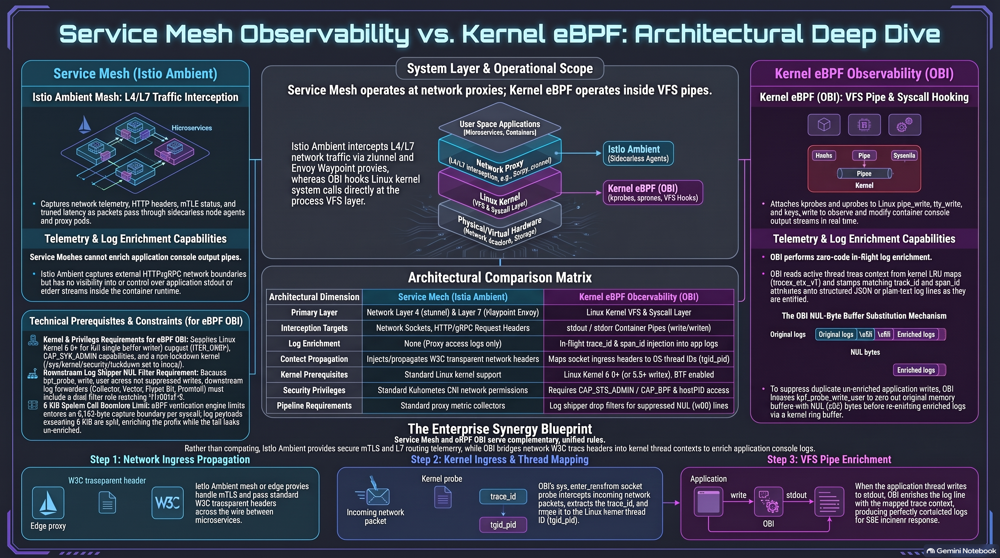
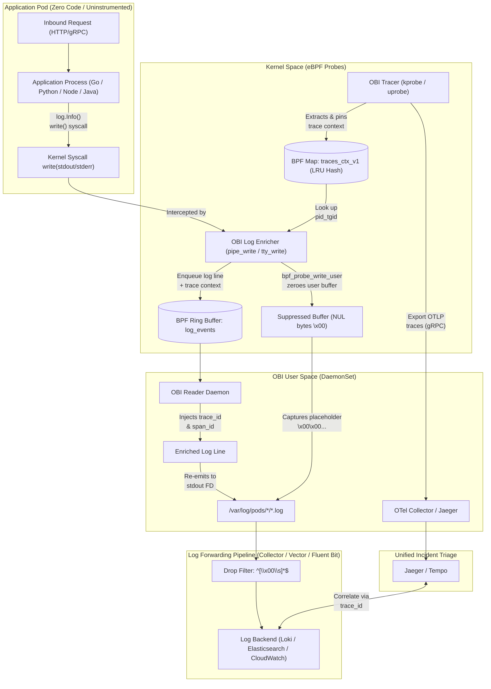
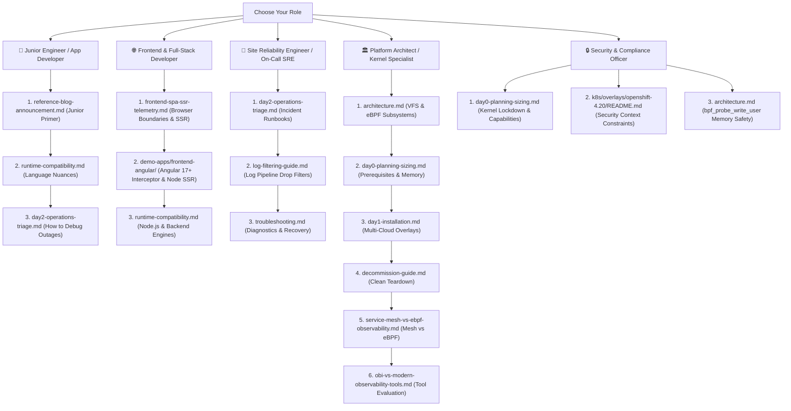

# OpenTelemetry eBPF (OBI) Zero-Code Trace-Log Correlation

[](https://github.com/nubenetes/obi-trace-log-correlation/releases)
[](https://github.com/nubenetes/obi-trace-log-correlation/actions)
[](LICENSE)
[](docs/day0-planning-sizing.md)
[](docs/architecture.md)
[](https://www.w3.org/TR/trace-context/)

<!-- Kubernetes Distribution Badges -->
[-EE0000.svg?logo=redhatopenshift&logoColor=white)](k8s/overlays/openshift-4.20/README.md)
[](k8s/overlays/aks/README.md)
[](k8s/overlays/eks/README.md)
[](k8s/overlays/gke/README.md)
[](k8s/overlays/rke/README.md)
[](docker-compose/README.md)

<!-- Observability & Log Shipper Badges -->
[](https://github.com/open-telemetry/opentelemetry-ebpf-instrumentation)
[](k8s/base/otel-collector.yaml)
[](docker-compose/compose.yaml)
[](log-pipelines/vector-filter.toml)
[](log-pipelines/fluent-bit-filter.conf)
[](log-pipelines/promtail-filter.yaml)

<!-- Runtimes & Operations -->
[-00ADD8.svg?logo=go&logoColor=white)](demo-apps/go/)
[-3776AB.svg?logo=python&logoColor=white)](demo-apps/python/)
[-5FA04E.svg?logo=nodedotjs&logoColor=white)](demo-apps/nodejs/)
[-ED8B00.svg?logo=openjdk&logoColor=white)](demo-apps/java/)
[-512BD4.svg?logo=dotnet&logoColor=white)](demo-apps/dotnet/)
[-CC342D.svg?logo=ruby&logoColor=white)](demo-apps/ruby/)
[-DD0031.svg?logo=angular&logoColor=white)](demo-apps/frontend-angular/)
[](scripts/)

Enterprise reference implementation, multi-cloud Kubernetes architectures, and end-to-end lifecycle automation for **Zero-Code Trace-Log Correlation** powered by [OpenTelemetry eBPF Instrumentation (OBI)](https://opentelemetry.io/blog/2026/obi-trace-log-correlation/).

> [!WARNING]
> **Disclaimer**: This repository has been generated by **Gemini 3.8 Flash** and has not been run or tested in a real environment.

---

## 📑 Table of Contents

- [Executive Overview](#executive-overview)
  - [🎯 Purpose of This Repository & Architectural Scope](#-purpose-of-this-repository--architectural-scope)
  - [🌍 Why This Blueprint Is Valuable Across Diverse Operational Platforms](#-why-this-blueprint-is-valuable-across-diverse-operational-platforms)
  - [🌐 Frontend SPAs & Full-Stack Telemetry Overview (Angular, React, Vue & SSR)](#-frontend-spas--full-stack-telemetry-overview-angular-react-vue--ssr)
    - [1. The Architectural Boundary: Client Browser vs. Host Linux Kernel](#1-the-architectural-boundary-client-browser-vs-host-linux-kernel)
    - [2. 📊 Full-Stack Architecture Infographic: Client Browser to eBPF Kernel Tracing](#full-stack-telemetry-infographic)
    - [3. Server-Side Rendering (SSR) vs. Client-Side SPAs](#3-server-side-rendering-ssr-vs-client-side-spas)
    - [4. Frontend Architecture Documentation & Runnable Demos](#4-frontend-architecture-documentation--runnable-demos)
  - [🕸️ Service Mesh vs. Kernel eBPF Observability Overview (Istio Ambient & OBI)](#-service-mesh-vs-kernel-ebpf-observability-overview-istio-ambient--obi)
    - [1. The Architectural Boundary: Network Proxies vs. Linux VFS Console Pipes](#1-the-architectural-boundary-network-proxies-vs-linux-vfs-console-pipes)
    - [2. 📊 Architecture Infographic: Service Mesh Observability vs. Kernel eBPF Deep Dive](#service-mesh-vs-ebpf-infographic)
    - [3. Deep Dive Breakdown: Core Architectural Dimensions & The 3-Step Synergy Blueprint](#3-deep-dive-breakdown-core-architectural-dimensions--the-3-step-synergy-blueprint)
    - [4. Service Mesh Architecture Documentation & Enterprise Synergy Blueprint](#4-service-mesh-architecture-documentation--enterprise-synergy-blueprint)
- [📖 Official Reference & Theoretical Motivation](#-official-reference--theoretical-motivation)
  - [1. The Core Motivation: The 2 AM Incident Response Dilemma](#1-the-core-motivation-the-2-am-incident-response-dilemma)
  - [2. Dual-Perspective Technical Guidance](#2-dual-perspective-technical-guidance)
- [🤖 AI-Generated Multimedia & Video Series (NotebookLM & YouTube)](#-ai-generated-multimedia--video-series-notebooklm--youtube)
  - [🎙️ Architectural Masterclass Podcasts (Audio)](#-architectural-masterclass-podcasts-audio)
  - [🎬 Full-Length Technical Deep Dives (Videos)](#-full-length-technical-deep-dives-videos)
  - [⚡ Topic-Focused Technical Shorts](#-topic-focused-technical-shorts)
- [📊 Architectural Infographic: Zero-Code Trace-Log Correlation with OBI](#-architectural-infographic-zero-code-trace-log-correlation-with-obi)
  - [Comprehensive Breakdown of the 5 Core Architectural Pillars](#comprehensive-breakdown-of-the-5-core-architectural-pillars)
    - [1. 🔍 The Problem: Inefficient Manual Log Search](#1--the-problem-inefficient-manual-log-search)
    - [2. ⚡ The Solution: Kernel-Level Context Injection via eBPF](#2--the-solution-kernel-level-context-injection-via-ebpf)
    - [3. 🔄 Visual Log Transformation: Before & After](#3--visual-log-transformation-before--after)
    - [4. 📋 Environment & Runtime Compatibility Checklist](#4--environment--runtime-compatibility-checklist)
    - [5. 🚀 Production Enablement & Deployment Strategy](#5--production-enablement--deployment-strategy)
- [Architecture](#architecture)
  - [Architectural Diagram Walkthrough & Operational Lifecycle](#architectural-diagram-walkthrough--operational-lifecycle)
    - [🐣 Junior Engineer Walkthrough: The Lifecycle of a Request & Log Line](#-junior-engineer-walkthrough-the-lifecycle-of-a-request--log-line)
    - [🚀 Advanced Specialist Deep Dive: Systems, Kernel & Pipeline Mechanics](#-advanced-specialist-deep-dive-systems-kernel--pipeline-mechanics)
- [Supported Use Cases](#supported-use-cases)
- [Repository Structure](#repository-structure)
  - [Compact Overview (ASCII Tree)](#compact-overview-ascii-tree)
  - [Interactive Repository Map](#interactive-repository-map)
  - [Detailed Component & Directory Breakdown](#detailed-component--directory-breakdown)
    - [📁 `demo-apps/` — Polyglot Application Microservices](#-demo-apps--polyglot-application-microservices)
    - [📁 `docker-compose/` — Local Evaluation Environment](#-docker-compose--local-evaluation-environment)
    - [📁 `k8s/base/` — Production Kubernetes Foundations](#-k8sbase--production-kubernetes-foundations)
    - [📁 `k8s/overlays/` — Enterprise Cloud & On-Prem Distribution Overlays](#-k8soverlays--enterprise-cloud--on-prem-distribution-overlays)
    - [📁 `log-pipelines/` — Suppressed NUL Byte Filter Configurations](#-log-pipelines--suppressed-nul-byte-filter-configurations)
    - [📁 `scripts/` — Production Lifecycle & Operational Tooling](#-scripts--production-lifecycle--operational-tooling)
    - [📁 `docs/` — Technical Architecture & Operational Guides](#-docs--technical-architecture--operational-guides)
- [📚 Technical Documentation Inventory (`docs/`)](#-technical-documentation-inventory-docs)
  - [Complete Documentation Matrix](#complete-documentation-matrix)
  - [Role-Based Learning Roadmaps](#role-based-learning-roadmaps)
  - [Inter-Document Navigation Guide](#inter-document-navigation-guide)
- [Quickstart: Local Evaluation (60 Seconds)](#quickstart-local-evaluation-60-seconds)
  - [Inspecting Enriched Logs](#inspecting-enriched-logs)
- [Production Kubernetes Deployments](#production-kubernetes-deployments)
  - [Red Hat OpenShift 4.20+](#red-hat-openshift-420)
  - [Azure Kubernetes Service (AKS)](#azure-kubernetes-service-aks)
  - [AWS Elastic Kubernetes Service (EKS)](#aws-elastic-kubernetes-service-eks)
  - [Google Kubernetes Engine (GKE Standard)](#google-kubernetes-engine-gke-standard)
  - [Rancher RKE2 / K3s](#rancher-rke2--k3s)
- [The Suppressed NUL Byte Filter Requirement](#the-suppressed-nul-byte-filter-requirement)
- [Lifecycle Operations Summary](#lifecycle-operations-summary)
- [Video Walkthroughs & Architecture References (YouTube)](#video-walkthroughs--architecture-references-youtube)
  - [🎬 Full-Length Technical Deep Dives (15 Videos)](#-full-length-technical-deep-dives-15-videos)
    - [1. How OBI Correlation Works: Zero-Code Trace-Log Correlation with eBPF](#1-how-obi-correlation-works-zero-code-trace-log-correlation-with-ebpf)
    - [2. Zero-Code Trace-Log Correlation: OpenTelemetry eBPF (OBI) Deep Dive](#2-zero-code-trace-log-correlation-opentelemetry-ebpf-obi-deep-dive)
    - [3. How to Inject Trace IDs into Logs Without Code Changes Using OBI eBPF](#3-how-to-inject-trace-ids-into-logs-without-code-changes-using-obi-ebpf)
    - [4. Tuning Log Shipper Pipelines for OBI eBPF: Null-Byte Filters & 8KB Log Splits](#4-tuning-log-shipper-pipelines-for-obi-ebpf-null-byte-filters--8kb-log-splits)
    - [5. Under the Hood of OBI eBPF: write vs writev Syscalls, Kernel Security & Limits](#5-under-the-hood-of-obi-ebpf-write-vs-writev-syscalls-kernel-security--limits)
    - [6. Zero-Code Trace-Log Correlation with eBPF: Production Architecture & Triage Guide](#6-zero-code-trace-log-correlation-with-ebpf-production-architecture--triage-guide)
    - [7. Service Mesh vs. Kernel eBPF: Why Meshes Fail at Log Correlation & How OBI Solves It](#7-service-mesh-vs-kernel-ebpf-why-meshes-fail-at-log-correlation--how-obi-solves-it)
    - [8. OBI vs. Legacy Observability Tools: The Zero-Code eBPF Revolution](#8-obi-vs-legacy-observability-tools-the-zero-code-ebpf-revolution)
    - [9. Análisis de OBI eBPF: Correlación Zero-Code de Logs y Trazas en Producción](#9-análisis-de-obi-ebpf-correlación-zero-code-de-logs-y-trazas-en-producción)
    - [10. Browser to Kernel: Zero-Code Trace-Log Correlation with eBPF & OBI](#10-browser-to-kernel-zero-code-trace-log-correlation-with-ebpf--obi)
    - [11. Server-Side Rendering Telemetry: Next.js, Node.js & OpenTelemetry eBPF](#11-server-side-rendering-telemetry-nextjs-nodejs--opentelemetry-ebpf)
    - [12. Telemetría Full Stack con eBPF: De SPAs y SSR al Kernel en Linux](#12-telemetría-full-stack-con-ebpf-de-spas-y-ssr-al-kernel-en-linux)
    - [13. Telemetría Full Stack OBI: Conectando el Navegador con el Kernel](#13-telemetría-full-stack-obi-conectando-el-navegador-con-el-kernel)
    - [14. Conecta la Telemetría Frontend al Backend con OpenTelemetry y eBPF](#14-conecta-la-telemetría-frontend-al-backend-con-opentelemetry-y-ebpf)
    - [15. Connecting Browser Clicks to eBPF Logs: Full-Stack Architecture Guide](#15-connecting-browser-clicks-to-ebpf-logs-full-stack-architecture-guide)
  - [⚡ Topic-Focused Technical Shorts (17 Shorts)](#-topic-focused-technical-shorts-17-shorts)
    - [1. Zero-Code Trace-Log Correlation Explained: OpenTelemetry OBI eBPF](#1-zero-code-trace-log-correlation-explained-opentelemetry-obi-ebpf)
    - [2. How OBI Correlates Logs Without Code: OpenTelemetry eBPF In-Flight](#2-how-obi-correlates-logs-without-code-opentelemetry-ebpf-in-flight)
    - [3. How eBPF Automates Trace-Log Correlation in Go Without SDKs](#3-how-ebpf-automates-trace-log-correlation-in-go-without-sdks)
    - [4. How eBPF Injects Trace IDs into Logs Without SDKs or Code Changes](#4-how-ebpf-injects-trace-ids-into-logs-without-sdks-or-code-changes)
    - [5. How eBPF Instruments Code Silently: OpenTelemetry OBI Zero-Code](#5-how-ebpf-instruments-code-silently-opentelemetry-obi-zero-code)
    - [6. How OBI Injects Trace IDs Without Code: In-Flight eBPF Kernel Interception](#6-how-obi-injects-trace-ids-without-code-in-flight-ebpf-kernel-interception)
    - [7. Tuning Log Pipelines for OBI: Filtering Null Bytes and 8KB Multi-Line Splits](#7-tuning-log-pipelines-for-obi-filtering-null-bytes-and-8kb-multi-line-splits)
    - [8. Why eBPF Trace-Log Correlation Loses Context: Async Buffers and Runtime Caveats](#8-why-ebpf-trace-log-correlation-loses-context-async-buffers-and-runtime-caveats)
    - [9. Why Service Meshes Fail at Log Correlation: Network Perimeter vs Kernel eBPF](#9-why-service-meshes-fail-at-log-correlation-network-perimeter-vs-kernel-ebpf)
    - [10. Por Qué Combinar Service Mesh y eBPF: Observabilidad Completa sin Puntos Ciegos](#10-por-qué-combinar-service-mesh-y-ebpf-observabilidad-completa-sin-puntos-ciegos)
    - [11. How to Canary Deploy OBI: Safe Zero-Downtime eBPF Rollout in Kubernetes](#11-how-to-canary-deploy-obi-safe-zero-downtime-ebpf-rollout-in-kubernetes)
    - [12. How eBPF Connects Traces to Logs: Instant Outage Root Cause Analysis](#12-how-ebpf-connects-traces-to-logs-instant-outage-root-cause-analysis)
    - [13. How OBI Mutates Logs In-Flight: Kernel Syscalls vs Intrusive APM Agents](#13-how-obi-mutates-logs-in-flight-kernel-syscalls-vs-intrusive-apm-agents)
    - [14. Cómo OBI Inyecta Trazas en los Logs sin Modificar Código](#14-cómo-obi-inyecta-trazas-en-los-logs-sin-modificar-código)
    - [15. El Fin de los Agentes de Monitorización: Observabilidad con eBPF](#15-el-fin-de-los-agentes-de-monitorización-observabilidad-con-ebpf)
    - [16. Frontend SPA Telemetry: How W3C Trace Context Connects Clicks to Logs](#16-frontend-spa-telemetry-how-w3c-trace-context-connects-clicks-to-logs)
    - [17. Cómo Conectar el Frontend con eBPF: Del Navegador al Kernel en Linux](#17-cómo-conectar-el-frontend-con-ebpf-del-navegador-al-kernel-en-linux)
  - [🎙️ Architectural Masterclass Podcasts (8 Episodes)](#-architectural-masterclass-podcasts-8-episodes)
    - [1. Podcast: Zero-Code Trace-Log Correlation with OpenTelemetry eBPF (OBI) Deep Dive](#1-podcast-zero-code-trace-log-correlation-with-opentelemetry-ebpf-obi-deep-dive)
    - [2. Podcast: Correlación Zero-Code de Logs y Trazas con eBPF y OpenTelemetry OBI](#2-podcast-correlación-zero-code-de-logs-y-trazas-con-ebpf-y-opentelemetry-obi)
    - [3. Podcast: Zero-Code Trace-Log Correlation: Service Mesh vs. Kernel eBPF (OBI)](#3-podcast-zero-code-trace-log-correlation-service-mesh-vs-kernel-ebpf-obi)
    - [4. Podcast: Correlación Zero-Code de Logs y Trazas: Service Mesh vs. Kernel eBPF (OBI)](#4-podcast-correlación-zero-code-de-logs-y-trazas-service-mesh-vs-kernel-ebpf-obi)
    - [5. Podcast: How eBPF Correlates Traces and Logs: Kernel Mechanics Deep Dive](#5-podcast-how-ebpf-correlates-traces-and-logs-kernel-mechanics-deep-dive)
    - [6. Podcast: Correlación de Trazas y Logs con eBPF: De la Alerta al Código](#6-podcast-correlación-de-trazas-y-logs-con-ebpf-de-la-alerta-al-código)
    - [7. Podcast: Correlating Browser Clicks with Kernel Logs: Full-Stack OBI Deep Dive](#7-podcast-correlating-browser-clicks-with-kernel-logs-full-stack-obi-deep-dive)
    - [8. Podcast: Observabilidad del Navegador al Kernel con eBPF y OpenTelemetry OBI](#8-podcast-observabilidad-del-navegador-al-kernel-con-ebpf-y-opentelemetry-obi)
- [References & Official Links](#references--official-links)
- [License](#license)

---

<a id="executive-overview"></a>
## Executive Overview

When an incident occurs in production, operators often get paged with a failing trace, knowing the answers lie within application logs. If the service never adopted structured logging with trace context, the traditional response is grepping through timestamps and praying.

**OpenTelemetry eBPF Instrumentation (OBI)** bridges this gap at the Linux kernel level:
- **Zero Code Changes**: No OpenTelemetry SDKs, no logging framework modifications, no rebuilds or redeployments.
- **Bi-Directional Correlation**: Automatically injects matching `trace_id` and `span_id` directly into `stdout` and `stderr` writes.
- **Polyglot & Multi-Format**: Enriches structured **JSON** logs as native attributes and formats **Plain-Text** logs with key-value annotations (`trace_id=... span_id=...`).
- **Distributed Context Propagation**: Transparently propagates trace contexts across network hops (HTTP/gRPC) across disparate services.
- **Full-Stack & Frontend Boundary Bridging**: Seamlessly links browser-based Single Page Applications (Angular, React, Vue) to backend kernel tracing via W3C `traceparent` HTTP injection, while intercepting Node.js Server-Side Rendering (SSR) logs at the host kernel level without client-side kernel access.
- **Service Mesh Coexistence & Boundary Bridging**: Complements modern sidecarless service meshes (Istio Ambient Mesh, Cilium Service Mesh) by enriching container stdout/stderr VFS pipes that network proxies cannot see, while coexisting seamlessly with mesh eBPF programs on isolated BPF map paths.

### 🎯 Purpose of This Repository & Architectural Scope

> [!WARNING]
> **AI Architectural Synthesis & Testing Status**: This repository has been generated by **Gemini 3.8 Flash** as an exhaustive architectural reference implementation and educational blueprint. The codebase, configurations, Kubernetes manifests, and operational scripts **have not been executed, run, or validated in a real-world production or physical staging environment**. Users and platform teams must independently review, benchmark, and validate all assets in an isolated sandbox before production rollout.

The primary **purpose** of this repository is to bridge the vast gap between high-level conceptual announcements and production-grade implementation. While the official OpenTelemetry blog post demonstrates the elegance of zero-code eBPF trace-log correlation, real enterprise infrastructure demands robust answers to complex operational realities: kernel compatibility matrices, security contexts, distribution overlays, log pipeline transformations, multi-tenant isolation, and teardown lifecycles.

This project delivers a complete, cohesive, and auditable reference architecture that serves as a tangible foundation for engineering teams exploring or adopting OBI.

### 🌍 Why This Blueprint Is Valuable Across Diverse Operational Platforms

Whether operating in on-premises data centers, strictly isolated air-gapped enclaves, or public cloud environments, this blueprint provides concrete value by solving platform-specific adoption hurdles:

- **🏢 Enterprise On-Premises & Private Clouds (Red Hat OpenShift 4.20+, Rancher RKE2, Bare-Metal)**:
  - **Granular Security Context Constraints (SCC)**: Enterprise Kubernetes distributions strictly disallow default privileged DaemonSets. This repository provides dedicated SCC configurations (`obi-ebpf-scc`) and SELinux type rules (`spc_t`) for OpenShift 4.20+ (RHCOS Linux 6.6+), enabling `hostPID` and `CAP_SYS_ADMIN` while maintaining organizational governance.
  - **Custom Kernel & BTF Preflight Checks**: On-premises Linux fleets frequently run custom enterprise kernels. The included `day0-kernel-audit.sh` preflight script audits kernel releases (>= 6.0), `/sys/kernel/btf/vmlinux` availability, and kernel lockdown modes without external dependencies.
  - **CIS Hardened Profiles**: Rancher RKE2 and K3s overlays demonstrate safe BPF filesystem mounting (`/sys/fs/bpf`) and control-plane tolerations adhering to strict CIS Kubernetes benchmarks.

- **🔒 Air-Gapped & High-Compliance Environments (Finance, Healthcare, Defense)**:
  - **Zero External Telemetry Dependencies**: Operates completely self-contained with in-cluster OpenTelemetry Collector, Jaeger, and Prometheus components, eliminating any requirement to connect to external SaaS observability providers.
  - **Compliance & Binary Integrity Preservation**: In regulated environments, introducing third-party tracing SDKs into application code requires extensive binary recompilation, code scanning, security certifications, and audit reviews. Kernel-level eBPF interception operates transparently at the VFS layer (`sys_enter_write` / `sys_enter_writev`), enriching standard `stdout`/`stderr` streams without touching or re-certifying application binaries.
  - **Fully Offline & Mirror-Ready**: All Kustomize manifests, pipeline configurations, and Docker Compose files are fully declarative and self-contained, ready for offline mirroring into private registries (Harbor, Nexus, Quay).

- **☁️ Public Cloud Managed Kubernetes (AWS EKS, Azure AKS, Google GKE Standard)**:
  - **Node Pool Kernel Targeting**: Cloud providers offer diverse node OS images (Amazon Linux 2023, Bottlerocket, Azure Linux CBL-Mariner, Ubuntu 24.04, GKE Container-Optimized OS). The included Kustomize overlays provide precise `nodeSelector` and toleration configurations to ensure OBI DaemonSets schedule strictly on nodes with kernel 6.0+ support.
  - **Coexistence with Cloud eBPF Networking**: Modern cloud clusters frequently employ eBPF for network datapath acceleration (AWS VPC CNI, Azure CNI powered by Cilium, GKE Datapath v2). This blueprint isolates BPF map pins under `/sys/fs/bpf/otel/`, preventing collisions with underlying cloud CNI maps.

- **🧩 Legacy, Polyglot & Closed-Source Binaries (COTS Software)**:
  - **Uninstrumentable Binaries**: Organizations commonly maintain legacy monolithic services, third-party Commercial Off-The-Shelf (COTS) software, or closed-source vendor binaries where source code access is impossible. OBI injects W3C trace context into their output streams transparently.
  - **Polyglot Consistency**: Demonstrates how Go (`log/slog`), Python (`PYTHONUNBUFFERED=1`), Node.js (Pino), and unstructured plain-text applications achieve identical trace correlation with zero SDK overhead.

- **🌐 Modern Frontend SPAs & Server-Side Rendering (Angular, React, Vue, SvelteKit)**:
  - **The Browser-to-Kernel Bridge**: Addresses the fundamental perimeter boundary where client web browsers run outside the Linux host kernel. Demonstrates how frontend SPAs inject W3C `traceparent` headers to prime kernel socket ingress probes (`sys_enter_recvfrom`), correlating user clicks with backend microservice logs.
  - **Zero-Code SSR Interception**: Validates that Server-Side Rendering engines (Node.js Express / Next.js) executing on the Linux host have their page generation logs automatically intercepted and enriched at the kernel level (`sys_enter_write`).

- **🕸️ Service Mesh Environments (Istio Ambient Mesh, Cilium Service Mesh, Linkerd)**:
  - **Closing the Application Visibility Gap**: Service meshes excel at transport security (mTLS) and network access logs, but are completely blind to container standard output pipes. This blueprint bridges the network wire to the Linux VFS pipe, correlating proxy spans with internal application stack traces without architectural overlap or BPF map collisions.

- **🛡️ De-Risking Production Adoption (The Hidden Gotchas)**:
  - **The Suppressed NUL Byte Filter**: Documents the low-level reality of `bpf_probe_write_user` zeroing out intercepted memory buffers, and provides ready-to-deploy drop filters for Vector, Fluent Bit, Promtail/Loki, and OTel Collector (`^[\x00\s]*$`).
  - **8 KiB Buffer Splitting & Multi-Line Logs**: Details kernel vector I/O splitting mechanics and mitigation strategies for large JSON payloads.
  - **Clean Decommissioning Runbooks**: Prevents orphaned pinned BPF maps in `/sys/fs/bpf/otel/` from exhausting kernel memory after DaemonSet removal.

<a id="frontend-spas--full-stack-telemetry-overview"></a>
<a id="-frontend-spas--full-stack-telemetry-overview-angular-react-vue--ssr"></a>
### 🌐 Frontend SPAs & Full-Stack Telemetry Overview (Angular, React, Vue & SSR)

A recurring architectural question when adopting eBPF observability is: **"Can eBPF capture logs and traces directly inside the end-user's web browser?"**

The short answer is **no, but full-stack correlation is achieved by bridging client-side W3C context into Linux kernel ingress probes.**

#### 1. The Architectural Boundary: Client Browser vs. Host Linux Kernel

```text
┌──────────────────────────────────────────────┐
│  End-User Client Device (Browser Sandbox)    │
│  Angular 17+ / React / Vue / SvelteKit SPA   │
│  ❌ Linux eBPF CANNOT run inside browser     │
└──────────────────────┬───────────────────────┘
                       │ Outbound HTTP Request + W3C traceparent Header
                       ▼
════════════════════════════════════════════════ Network Boundary
                       │
┌──────────────────────▼───────────────────────┐
│  Kubernetes Ingress / Linux Host Kernel      │
│  ✅ OBI sys_enter_recvfrom intercepts socket │
│  ✅ Stores trace_id in traces_ctx_v1 BPF map │
│  ✅ sys_enter_write enriches stdout logs     │
└──────────────────────────────────────────────┘
```

- **The Browser Sandbox**: Client Single Page Applications (SPAs) execute inside browser runtimes (V8 in Chrome/Edge, JavaScriptCore in Safari, SpiderMonkey in Firefox) on end-user devices (macOS, Windows, iOS, Android). Linux eBPF probes cannot inspect or attach to these client-side execution contexts.
- **The Context Bridge**: Modern frontend HTTP clients configure a lightweight interceptor (e.g. Angular 17+ `HttpInterceptorFn`, Axios/Fetch interceptors, or `@opentelemetry/sdk-trace-web`) that attaches the standard W3C `traceparent` header (`00-{trace_id}-{span_id}-01`) to outgoing requests.
- **Kernel Socket Ingress**: When the HTTP packet reaches the Linux host where the API Gateway, Ingress Controller, or Backend Service resides, OBI's socket probe (`sys_enter_recvfrom`) intercepts the header, extracts the `trace_id`, and caches it in the kernel's `traces_ctx_v1` BPF hash map keyed by the active thread (`tgid_pid`).
- **Unbroken Backend Correlation**: As backend microservices (Go, Python, Java, Node.js, .NET, Ruby) process the request and write logs to `stdout`, OBI enriches every log line with that exact client-originated `trace_id`.

<a id="full-stack-telemetry-infographic"></a>
#### 2. 📊 Full-Stack Architecture Infographic: Client Browser to eBPF Kernel Tracing

[](docs/images/full-stack-telemetry-via-ebpf.png)

> [!TIP]
> **Lossless High-Resolution Asset**: The architecture diagram above is available in original full-resolution (2752x1536 PNG, lossless) at [`docs/images/full-stack-telemetry-via-ebpf.png`](docs/images/full-stack-telemetry-via-ebpf.png) and high-definition JPEG at [`docs/images/full-stack-telemetry-via-ebpf.jpg`](docs/images/full-stack-telemetry-via-ebpf.jpg).

##### Detailed Architectural Walkthrough of the 3-Step Lifecycle:

- **1. 🖥️ Step 1: Client Browser Sandbox Context Generation (Frontend SPAs)**:
  - **The Client Execution Realm**: Single Page Applications (SPAs) built with Angular 17+, React, Vue, or Svelte execute inside browser JavaScript engines (V8 in Chrome/Edge, JavaScriptCore in Safari, SpiderMonkey in Firefox) on end-user physical devices (laptops, desktops, mobile phones).
  - **The Security & Kernel Boundary**: Linux kernel eBPF probes operate strictly inside Ring 0 on backend Kubernetes cluster nodes. Remote user machines are outside the cluster perimeter, meaning eBPF probes cannot attach to or inspect client-side browser processes.
  - **W3C `traceparent` Injection**: Instead of installing bulky proprietary RUM agents, the frontend uses native HTTP interceptors (such as Angular's `HttpInterceptorFn`, Axios/Fetch interceptors, or `@opentelemetry/sdk-trace-web`) to generate and inject standard W3C `traceparent` headers into outgoing requests:
    ```http
    traceparent: 00-a1b2c3d4e5f678901234567890abcdef-c700e9f012345678-01
    ```
  - **Baggage Propagation**: Contextual attributes (e.g. `client.framework=angular17`, `app.version=2.4.0`) flow through the standard W3C `baggage` header without requiring code alterations in downstream hops.

- **2. 🌉 Step 2: Network Boundary Crossing & Kernel Socket Ingress (Linux Host)**:
  - **Crossing the Network Perimeter**: The outbound HTTP request travels across public or private networks and enters the backend Kubernetes cluster via an Ingress Controller, API Gateway, or service mesh proxy.
  - **Kernel Socket Interception (`sys_enter_recvfrom`)**: As the incoming network packet arrives at the Linux host network interface, OBI's socket probe hooks the socket read operation before user space consumes the buffer.
  - **Header Parsing & BPF Map Insertion**: OBI parses the HTTP header stream in-flight, extracts the client-originated `trace_id` (`a1b2c3d4e5f6...`), and inserts it into the kernel's pinned `traces_ctx_v1` BPF hash map.
  - **Thread-to-Trace Association**: The trace context is keyed by the operating system thread ID (`tgid_pid`) assigned by the Linux kernel scheduler to process the incoming payload.

- **3. ⚡ Step 3: Kernel-Level In-Flight Log Enrichment (Backend & SSR)**:
  - **Zero-Code Application Writes**: As backend microservices (Go, Python, Java, Node.js, .NET, Ruby) or Node.js Server-Side Rendering (SSR) engines process business logic and emit log statements (`stdout`/`stderr`), they use standard runtime logging libraries without OpenTelemetry SDKs.
  - **Syscall Hooking (`sys_enter_write` / `pipe_write`)**: As the container thread executes a `write()` system call, OBI's kernel probe triggers:
    - Queries `traces_ctx_v1` using the current thread ID to retrieve the active `trace_id`.
    - Invokes `bpf_probe_write_user` to zero out the original user buffer with NUL characters (`\x00`), suppressing un-enriched output from reaching the CRI pipe.
    - Forwards the captured log message and trace context to the kernel `log_events` ring buffer.
  - **Enriched Re-Emission**: The OBI user daemon consumes the ring buffer event and re-emits the enriched log line directly to the container's stdout file descriptor (`/proc/<pid>/fd/1`):
    ```text
    ENRICHED LOG: [trace_id=a1b2c3d4e5f6...] User action processed.
    ```

##### Core Frontend & SSR Architectural Pillars:

- **Framework-Native W3C Header Injection**: SPAs leverage native framework primitives—Angular 17+ `HttpInterceptorFn`, React/Next.js traced `fetch`, Vue 3/Nuxt 3 `$fetch` plugins—to propagate standard trace headers without heavy SDK bundle sizes.
- **Zero-Code Server-Side Rendering (SSR) Interception**: Node.js SSR engines running on Linux hosts have page generation logs automatically intercepted and enriched at the kernel VFS layer without requiring client-side kernel access.
- **Client Error Ingestion Bridge Pattern**: Catches uncaught browser exceptions (`window.onerror`, `unhandledrejection`) and ships them to a dedicated backend bridge endpoint (`POST /api/telemetry/logs`), allowing client browser errors to enter the kernel-enriched Loki/Elasticsearch logging pipeline.

#### 3. Server-Side Rendering (SSR) vs. Client-Side SPAs

| Observability Tier | Execution Environment | eBPF Kernel Probe Coverage | Correlation & Ingestion Mechanism | Reference Architecture & Runnable Samples |
| :--- | :--- | :---: | :--- | :--- |
| **Client Browser SPA** | End-User Device Browser (Angular, React, Vue) | ❌ Inaccessible (Remote Sandbox) | Injects standard W3C `traceparent` headers via HTTP interceptors or OTel Web SDK | 📄 [Frontend Telemetry Guide](docs/frontend-spa-ssr-telemetry.md)<br>💻 [`demo-apps/frontend-angular/`](demo-apps/frontend-angular/) |
| **Server-Side Rendering (SSR)** | Host Linux Container (Node.js Express / Next.js) | ✅ 100% Kernel Coverage | Zero-code stdout write interception (`pipe_write` / `ksys_write`) during page rendering | ⚡ [Runtime Compatibility Guide](docs/runtime-compatibility.md#1-frontend-languages--single-page-applications-angular-react-vue)<br>💻 [Angular SSR Service](demo-apps/frontend-angular/) |
| **Client Error Ingestion Bridge** | Edge API Gateway / Pod (`POST /api/telemetry/logs`) | ✅ 100% Kernel Coverage | Captured browser exceptions (`window.onerror`) forwarded to backend bridge, enriched with trace context | 📄 [Browser Bridge Pattern](docs/frontend-spa-ssr-telemetry.md#7-browser-telemetry-ingestion-bridge-pattern) |
| **Downstream Microservices** | Host Linux Containers (Go, Python, Java, .NET, Ruby) | ✅ 100% Kernel Coverage | Automatic socket ingress context extraction and stdout enrichment | 🏛️ [Architecture Deep Dive](docs/architecture.md)<br>💻 [Polyglot Demo Apps](demo-apps/) |

#### 4. Frontend Architecture Documentation & Runnable Demos

This repository provides dedicated documentation, code patterns, and runnable implementations for frontend and SSR observability:

- 🌐 **[Frontend SPAs & SSR Telemetry Guide (`docs/frontend-spa-ssr-telemetry.md`)](docs/frontend-spa-ssr-telemetry.md)**:
  Comprehensive 10-section architecture guide featuring:
  - System topology diagrams and end-to-end distributed sequence diagrams.
  - Framework implementation snippets: **Angular 17+** (`HttpInterceptorFn`), **React / Next.js** (`instrumentation.ts` + traced `fetch`), **Vue 3 / Nuxt 3** (`$fetch` plugin), and **SvelteKit**.
  - OpenTelemetry Web SDK integration guide (`@opentelemetry/sdk-trace-web`).
  - Browser Ingestion Bridge pattern for shipping client-side exceptions (`window.onerror`) to Loki/Elasticsearch with trace correlation.
  - Server-Side Rendering (SSR) synchronous stdout vs async decoupled queue mechanics.
  - Categorized Public References and Standards Catalog (W3C Trace Context, W3C Baggage, OTel JS).
- ⚡ **[Runtime Compatibility Guide (`docs/runtime-compatibility.md`)](docs/runtime-compatibility.md#1-frontend-languages--single-page-applications-angular-react-vue)**:
  Detailed analysis of frontend runtime behaviors, synchronous Node.js SSR rendering vs asynchronous worker queues, and context staleness prevention.
- 💻 **[Angular 17+ & SSR Runnable Demo Application (`demo-apps/frontend-angular/`)](demo-apps/frontend-angular/)**:
  Production-ready demo service containing:
  - Standalone Angular 17+ HTTP interceptor automatically injecting W3C `traceparent` headers.
  - Node.js Express Server-Side Rendering engine writing structured JSON logs to stdout.
  - Dockerfile and multi-stage container build configuration.
  - Kubernetes deployment manifests and Kustomize overlays.

### 🕸️ Service Mesh vs. Kernel eBPF Observability Overview (Istio Ambient & OBI)

A frequent architectural question in modern cloud-native architectures is: **"If our cluster already runs a Service Mesh (such as Istio Ambient Mesh or Cilium Service Mesh), do we still need OpenTelemetry eBPF (OBI) for trace-log correlation?"**

The short answer is **yes**. While modern sidecarless service meshes provide robust transport security (mTLS) and L4/L7 network telemetry, they operate strictly on network sockets and are fundamentally blind to container runtime VFS pipes, making them unable to enrich internal application console output.

#### 1. The Architectural Boundary: Network Proxies vs. Linux VFS Console Pipes

```text
┌────────────────────────────────────────────────────────────────────────┐
│                          APPLICATIONS & CONTAINERS                     │
│  Container Application Process (Go, Python, Java, Node.js, .NET)       │
│  - Calls logger.info("Processing order") -> Writes to stdout (fd 1)    │
└───────────────────┬───────────────────────────────┬────────────────────┘
                    │                               │
         [Network Traffic Stream]        [VFS stdout/stderr Pipe]
         (AF_INET / AF_INET6 Sockets)    (/proc/<pid>/fd/1 CRI FIFO)
                    │                               │
                    ▼                               ▼
┌───────────────────────────────────────┐ ┌──────────────────────────────┐
│       SERVICE MESH DATA PLANE         │ │   KERNEL eBPF OBSERVABILITY  │
│  Istio Ambient (ztunnel & Waypoint)   │ │   OpenTelemetry OBI Engine   │
│  ───────────────────────────────────  │ │  ──────────────────────────  │
│  ✅ L4 mTLS (HBONE Geneve tunnels)    │ │  ✅ Intercepts sys_enter_write│
│  ✅ L7 HTTP routing & retries         │ │  ✅ Zero-code log mutation   │
│  ✅ Network access logs & proxy spans │ │  ✅ In-flight trace stamping │
│  ❌ CANNOT inspect container pipes    │ │  ✅ Correlates stdout & trace│
└───────────────────────────────────────┘ └──────────────────────────────┘
```

- **The Network Socket Domain (Service Mesh)**: Service meshes (such as Istio Ambient Mesh with Rust-based `ztunnel` and Envoy `waypoint` proxies) operate strictly on the network transport layer (`AF_INET`/`AF_INET6` TCP/UDP sockets). They observe traffic traversing the wire between pods, capturing network metrics, HTTP status codes, and network-level access logs.
- **The Container VFS Pipe Boundary (eBPF OBI)**: Application log statements (`logger.info()`, `fmt.Println()`) do **not** traverse network sockets. Instead, the runtime emits writes to standard output (file descriptor 1) via the Linux Virtual File System (VFS) pipe subsystem (`pipe_write` / `ksys_write`). Because service mesh proxies never sit on container CRI pipes, **service meshes cannot read, correlate, or enrich application logs**.
- **The Synergy**: Istio Ambient secures and traces the network wire, while OBI extracts incoming W3C trace contexts at kernel socket ingress and enriches in-flight application console logs on the host.

<a id="service-mesh-vs-ebpf-infographic"></a>
#### 2. 📊 Architecture Infographic: Service Mesh Observability vs. Kernel eBPF Deep Dive

[](docs/images/service-mesh-vs-kernel-ebpf.png)

> [!TIP]
> **Lossless High-Resolution Asset**: The architecture diagram above is available in original full-resolution (2752x1536 PNG, lossless) at [`docs/images/service-mesh-vs-kernel-ebpf.png`](docs/images/service-mesh-vs-kernel-ebpf.png) and high-definition JPEG at [`docs/images/service-mesh-vs-kernel-ebpf.jpg`](docs/images/service-mesh-vs-kernel-ebpf.jpg).

#### 3. Deep Dive Breakdown: Core Architectural Dimensions & The 3-Step Synergy Blueprint

- **1. 🏗️ System Layer & Operational Scope (The 3D Architectural Stack)**:
  - **User Space Applications**: Polyglot container microservices (Go, Python, Java, Node.js, .NET, Ruby) executing business transactions inside Linux namespaces.
  - **Network Proxy Layer (Istio Ambient Mesh)**: Sidecarless node agents (`ztunnel` executing in Rust) and per-namespace or per-service account Envoy `waypoint` proxies intercepting L4/L7 network traffic.
  - **Linux Kernel Layer (Kernel eBPF OBI)**: Kernel probes (`kprobes`, `uprobes`, tracepoints) attaching directly to `pipe_write`, `tty_write`, `sys_enter_recvfrom`, and `sys_enter_write` system calls at the process VFS boundary.
  - **Physical / Virtual Hardware**: Physical/virtual network adapters (NICs) and block storage devices underlying the cluster.
  - **Layer Separation Summary**: *Istio Ambient operates at network proxies; Kernel eBPF operates inside VFS pipes.*

- **2. 🌐 Service Mesh (Istio Ambient): L4/L7 Traffic Interception & Operational Scope**:
  - **L4/L7 Interception Capabilities**: Intercepts TCP streams and HTTP requests passing between pods via mutual TLS (HBONE encapsulation on port 15008) and Envoy waypoint proxies.
  - **Network-Level Observability**: Generates L4 TCP connection bytes/duration metrics, L7 HTTP access logs (`client_ip`, `status_code`, `path`, `latency`), and proxy trace spans.
  - **The Telemetry & Log Enrichment Blind Spot**: Service meshes **cannot** enrich application console output pipes. Istio Ambient captures external HTTP/gRPC boundaries, but has zero visibility into internal process memory, thread pools, or container stdout/stderr CRI FIFO pipes.

- **3. ⚡ Kernel eBPF Observability (OBI): VFS Pipe & Syscall Hooking**:
  - **VFS Pipe Hooking**: Attaches `kprobes` to `pipe_write` and `sys_enter_write` system calls to monitor and intercept all data written to file descriptor 1 (`/proc/<pid>/fd/1`).
  - **Zero-Code In-Flight Log Enrichment**: Queries the active Linux thread ID (`tgid_pid`) against the kernel LRU hash map (`traces_ctx_v1`), extracting the current `trace_id` and `span_id`, and injecting them into structured JSON or plain-text lines in-flight without SDKs or application rebuilds.
  - **The OBI NUL-Byte Buffer Substitution Mechanism**:
    - **The Problem**: Once an application thread executes `write()`, the kernel cannot stop the syscall return without terminating the process or causing errors.
    - **The In-Flight Mutation**: To prevent duplicate un-enriched log lines from reaching the container log file, OBI invokes the helper `bpf_probe_write_user` to overwrite the original user memory buffer with NUL bytes (`\x00`).
    - **Enriched Re-Emission**: OBI copies the raw log payload and trace context to a high-speed BPF ring buffer (`log_events`), where the user daemon formats and re-emits the enriched line directly to container stdout.

- **4. 📊 Architectural Dimension Comparison Matrix**:

  | Architectural Dimension | Service Mesh (Istio Ambient) | Kernel eBPF Observability (OBI) |
  | :--- | :--- | :--- |
  | **Primary Layer** | Network Layer 4 (ztunnel) & Layer 7 (Waypoint Envoy) | Linux Kernel VFS & System Call Layer |
  | **Interception Targets** | Network Sockets (`AF_INET`/`AF_INET6`), HTTP/gRPC Headers | stdout / stderr Container CRI Pipes (`write` / `writev`) |
  | **Log Enrichment** | None (Proxy access logs only) | In-flight `trace_id` & `span_id` injection into app logs |
  | **Context Propagation** | Injects/propagates W3C `traceparent` network headers | Maps socket ingress headers to OS thread IDs (`tgid_pid`) |
  | **Kernel Prerequisites** | Standard Linux kernel support | Linux Kernel 6.0+ (or 5.5+ writev), BTF enabled |
  | **Security Privileges** | Standard Kubernetes CNI network permissions | Requires `CAP_SYS_ADMIN` / `CAP_BPF` & `hostPID` access |
  | **Pipeline Requirements** | Standard proxy metric collectors | Log shipper drop filters for suppressed NUL (`\x00`) lines |

- **5. 🔄 The Enterprise Synergy Blueprint: A Unified 3-Step Lifecycle**:
  Rather than competing, Istio Ambient and OBI serve complementary, unified roles:
  - **Step 1: Network Ingress Propagation**:
    - The client or upstream service initiates an HTTP request.
    - Istio Ambient ztunnel or waypoint proxies handle secure mTLS, manage routing/retries, and propagate standard W3C `traceparent` headers across the wire between microservices.
  - **Step 2: Kernel Ingress & Thread Mapping**:
    - As the packet reaches the target pod's network interface, OBI's `sys_enter_recvfrom` socket probe intercepts the payload before application user space reads it.
    - OBI extracts the incoming `trace_id` and records the association in the kernel hash map (`traces_ctx_v1`) keyed by the active OS thread ID (`tgid_pid`).
  - **Step 3: VFS Pipe Enrichment**:
    - The application thread handles business logic and writes a log statement to stdout (`write(1, ...)`).
    - OBI's VFS hook intercepts the write, looks up the thread's active `trace_id`, zeroes out the raw buffer with `bpf_probe_write_user`, and re-emits the fully enriched log line (`{"trace_id":"...","msg":"..."}`).
    - Downstream log forwarders (Vector, Fluent Bit, Promtail) drop NUL lines and forward perfectly correlated logs to Loki/Elasticsearch for instant SRE triage.

- **6. ⚙️ Technical Prerequisites & Operational Constraints (for eBPF OBI)**:
  - **Kernel & Privilege Requirements**: Requires Linux Kernel 6.0+ (for full single-buffer write support without truncation), `CAP_SYS_ADMIN` capabilities, and non-lockdown kernel (`/sys/kernel/security/lockdown` set to `none`).
  - **Downstream Log Shipper NUL Filter**: Because `bpf_probe_write_user` zeroes out suppressed writes, downstream log forwarders (Collector, Vector, Fluent Bit, Promtail) must include a drop filter rule matching `^[\x00\s]*$`.
  - **8 KiB Syscall Boundary Limit**: Linux eBPF verifier loop boundaries limit string capture to 8,192 bytes per write syscall. Log payloads exceeding 8 KiB are split across syscall chunks, enriching the prefix while the tail leaks un-enriched.

#### 4. Service Mesh Architecture Documentation & Enterprise Synergy Blueprint

For the exhaustive engineering deep dive, low-level eBPF hook mechanics comparison (`sockops` vs `sys_enter_recvfrom`), and production coexistence blueprints, refer to:

- 🕸️ **[Service Mesh vs. Kernel eBPF Observability Guide (`docs/service-mesh-vs-ebpf-observability.md`)](docs/service-mesh-vs-ebpf-observability.md)**: Standalone 11-section architectural guide covering Istio Ambient ztunnel, Envoy waypoints, VFS pipe isolation, and the unified observability blueprint.

---

## 📖 Official Reference & Theoretical Motivation

> [!IMPORTANT]
> **Official Reference Announcement**:  
> This repository operationalizes the milestone OpenTelemetry architecture announced in:  
> 👉 [**Zero-code trace-log correlation with OBI** (OpenTelemetry Blog, October 2026)](https://opentelemetry.io/blog/2026/obi-trace-log-correlation/)  
> 
> For the complete, unabridged verbatim text of the announcement paired with section-by-section analysis for both junior engineers and Linux systems specialists, see:  
> 📄 [**`docs/reference-blog-announcement.md`**](docs/reference-blog-announcement.md)

### 1. The Core Motivation: The 2 AM Incident Response Dilemma
- **The Junior SRE Experience (Explain Like I'm 5)**:  
  You are on-call at 2:00 AM. Your phone buzzes: an order checkout failed. You open Jaeger or Grafana Tempo and find the exact trace with `trace_id: 4bf92f3577b34da6a3ce929d0e0e4736`. To discover why the order failed, you open your log viewer (Loki, Elasticsearch, or CloudWatch) and search logs around the incident timestamp. In a production Kubernetes cluster handling thousands of requests per second, there are tens of thousands of log lines across dozens of pods. Because the application never had an OpenTelemetry SDK installed, none of the log lines contain a `trace_id`. You are forced to guess by timestamp—hoping clock skew doesn't mislead you.
- **The Enterprise Reality (Why SDKs Fail to Reach 100% Coverage)**:  
  Why not simply import OpenTelemetry SDKs into every service?
  1. **Polyglot Fleet Friction**: Enterprises maintain hundreds of microservices written across Go, Python, Java, Node.js, and .NET by dozens of independent squads.
  2. **Legacy & Frozen Codebases**: Critical legacy services lack active maintainers; modifying source code risks regressions and requires extensive compliance cycles.
  3. **Third-Party & Vendor Binaries**: Closed-source commercial containers and sidecars cannot be modified.
  4. **Quarter-Long Backlogs**: Coordinating code updates, testing, and deployments across an entire engineering organization can take an entire year.
- **The OBI Revolution (Zero-Code Kernel Interception)**:  
  OpenTelemetry eBPF Instrumentation (OBI) operates entirely inside the Linux kernel. It hooks the operating system's `write()` and `writev()` system calls on container stdout/stderr pipes. Whenever an application thread emits a log line, OBI checks its in-kernel BPF map (`traces_ctx_v1`) to determine what request that thread is currently serving, stamps the matching `trace_id` and `span_id` onto the log line in-flight, and re-emits it. **No SDKs, no app config, no recompilation, no redeployment.**

### 2. Dual-Perspective Technical Guidance

| Architectural Area | Junior Engineer Perspective (Conceptual) | Advanced Specialist Perspective (Systems & Kernel) |
|---|---|---|
| **Log Stamping** | Stamping an order number onto a chef's kitchen note before it leaves the kitchen. | `bpf_probe_write_user` zeroes user buffer with NULs; user daemon injects IDs via `log_events` ring buffer and re-emits to container fd. |
| **Context Staleness** | A waiter handles Ticket A, drops it off, and picks up Ticket B—don't stamp Ticket A on Ticket B's drink! | Go `runtime.casgstatus` uprobes, Node.js `async_hooks` + `uv_fs_access`, Java ByteBuddy `ioctl` thread hierarchy traversal. |
| **Log Pipeline Tuning** | A vacuum cleaner that sucks up blank lines before they clutter your screen. | Downstream log shippers (Collector, Vector, Fluent Bit, Promtail) decode CRI/Docker JSON and drop lines matching `^[\x00\s]*$`. |
| **Write Limits** | Very long book pages might get split into two pages if they exceed 8 KB. | Single `write()`/`writev()` calls > 8 KiB split at the BPF stack limit: 8 KiB prefix is enriched; remainder leaks un-enriched. |
| **Hybrid Mode** | If an app already has a nametag, don't pin a second, conflicting nametag on it. | When an in-process OTel SDK exports traces, OBI injects `trace_id` only and suppresses `span_id` to prevent APM waterfall corruption. |

---

---

## 🤖 AI-Generated Multimedia & Video Series (NotebookLM & YouTube)

This repository includes a comprehensive multi-format educational series synthesized with **Gemini NotebookLM** based directly on this repository's architectural analyses, manifests, eBPF kernel mechanics, and the official [OpenTelemetry Announcement](https://opentelemetry.io/blog/2026/obi-trace-log-correlation/). All videos and shorts are published and freely accessible on YouTube on the [**@nubenetes**](https://youtube.com/@nubenetes) channel.

> [!NOTE]
> **Multilingual Learning Experience**:
> Content features native spoken audio in **English 🇺🇸** and **Spanish 🇪🇸**, and includes automated YouTube subtitles / closed captions (CC) translated into **20+ languages** (Spanish, French, German, Japanese, Portuguese, Italian, Arabic, Hindi, etc.) for global knowledge sharing.

### 🎙️ Architectural Masterclass Podcasts (Audio)

| # | Format | Podcast Episode | Domain / Focus | Origin Language | Duration | Direct YouTube Link |
|---|:---:|---|---|:---:|:---:|---|
| 1 | 🎙️ Audio Podcast | [**Podcast: Zero-Code Trace-Log Correlation with OpenTelemetry eBPF (OBI) Deep Dive**](https://www.youtube.com/watch?v=QUSwbpEERlI) | Complete Architecture, Kernel Hooks & SRE Triage | 🇺🇸 English *(CC 20+)* | `47:47` | [▶️ Listen Podcast](https://www.youtube.com/watch?v=QUSwbpEERlI) |
| 2 | 🎙️ Audio Podcast | [**Podcast: Correlación Zero-Code de Logs y Trazas con eBPF y OpenTelemetry OBI**](https://www.youtube.com/watch?v=mpSVsUIpaMc) | Arquitectura Kernel, Filtrado NUL y Producción | 🇪🇸 Spanish *(CC 20+)* | `21:37` | [▶️ Escuchar Podcast](https://www.youtube.com/watch?v=mpSVsUIpaMc) |
| 3 | 🎙️ Audio Podcast | [**Podcast: Zero-Code Trace-Log Correlation: Service Mesh vs. Kernel eBPF (OBI)**](https://www.youtube.com/watch?v=qJUrpdWvHTs) | Service Mesh vs Kernel eBPF & Full-Stack Synergy | 🇺🇸 English *(CC 20+)* | `58:23` | [▶️ Listen Podcast](https://www.youtube.com/watch?v=qJUrpdWvHTs) |
| 4 | 🎙️ Audio Podcast | [**Podcast: Correlación Zero-Code de Logs y Trazas: Service Mesh vs. Kernel eBPF (OBI)**](https://www.youtube.com/watch?v=kP_FrCcn_jE) | Service Mesh vs eBPF, Frontend W3C y Sinergia | 🇪🇸 Spanish *(CC 20+)* | `12:50` | [▶️ Escuchar Podcast](https://www.youtube.com/watch?v=kP_FrCcn_jE) |
| 5 | 🎙️ Audio Podcast | [**Podcast: How eBPF Correlates Traces and Logs: Kernel Mechanics Deep Dive**](https://www.youtube.com/watch?v=D5gHANofzQQ) | Socket Ingress, VFS Pipes & Real-Time Triage | 🇺🇸 English *(CC 20+)* | `55:20` | [▶️ Listen Podcast](https://www.youtube.com/watch?v=D5gHANofzQQ) |
| 6 | 🎙️ Audio Podcast | [**Podcast: Correlación de Trazas y Logs con eBPF: De la Alerta al Código**](https://www.youtube.com/watch?v=5XYbAeKnSLs) | Triage de Guardia 2 AM, Syscalls y Filtros NUL | 🇪🇸 Spanish *(CC 20+)* | `25:26` | [▶️ Escuchar Podcast](https://www.youtube.com/watch?v=5XYbAeKnSLs) |
| 7 | 🎙️ Audio Podcast | [**Podcast: Correlating Browser Clicks with Kernel Logs: Full-Stack OBI Deep Dive**](https://www.youtube.com/watch?v=YKPsm3iLVmk) | Conversational Blueprint: From Browser Sandbox to Kernel Stamping | 🇺🇸 English *(CC 20+)* | `22:34` | [▶️ Listen Podcast](https://www.youtube.com/watch?v=YKPsm3iLVmk) |
| 8 | 🎙️ Audio Podcast | [**Podcast: Observabilidad del Navegador al Kernel con eBPF y OpenTelemetry OBI**](https://www.youtube.com/watch?v=6Yvs6DSSUdI) | Analogía Postal, Frontera del Navegador y Trazabilidad Full-Stack | 🇪🇸 Spanish *(CC 20+)* | `24:04` | [▶️ Escuchar Podcast](https://www.youtube.com/watch?v=6Yvs6DSSUdI) |

### 🎬 Full-Length Technical Deep Dives (Videos)

| # | Format | Video Title | Category / Domain | Origin Language | Duration | Direct YouTube Link |
|---|:---:|---|---|:---:|:---:|---|
| 1 | 📽️ Video Guide | [**How OBI Correlation Works: Zero-Code Trace-Log Correlation with eBPF**](https://www.youtube.com/watch?v=f_tQfyjhgow) | Kernel Interception & Buffer Manipulation | 🇺🇸 English *(CC 20+)* | `7:55` | [▶️ Watch Video](https://www.youtube.com/watch?v=f_tQfyjhgow) |
| 2 | 📽️ Video Guide | [**Zero-Code Trace-Log Correlation: OpenTelemetry eBPF (OBI) Deep Dive**](https://www.youtube.com/watch?v=FVguXIDZwys) | Incident Response & Bidirectional Triage | 🇺🇸 English *(CC 20+)* | `8:18` | [▶️ Watch Video](https://www.youtube.com/watch?v=FVguXIDZwys) |
| 3 | 📽️ Video Guide | [**How to Inject Trace IDs into Logs Without Code Changes Using OBI eBPF**](https://www.youtube.com/watch?v=lNjPSBTPn0M) | Runtime Injection & Log Shipping Pipelines | 🇺🇸 English *(CC 20+)* | `6:34` | [▶️ Watch Video](https://www.youtube.com/watch?v=lNjPSBTPn0M) |
| 4 | 📽️ Video Guide | [**Tuning Log Shipper Pipelines for OBI eBPF: Null-Byte Filters & 8KB Log Splits**](https://www.youtube.com/watch?v=JbxR7WFacT8) | Downstream Log Pipelines & Buffer Chunking | 🇺🇸 English *(CC 20+)* | `6:16` | [▶️ Watch Video](https://www.youtube.com/watch?v=JbxR7WFacT8) |
| 5 | 📽️ Video Guide | [**Under the Hood of OBI eBPF: write vs writev Syscalls, Kernel Security & Limits**](https://www.youtube.com/watch?v=WzYDb8pX9Ao) | Syscall Interception & Linux Security | 🇺🇸 English *(CC 20+)* | `8:28` | [▶️ Watch Video](https://www.youtube.com/watch?v=WzYDb8pX9Ao) |
| 6 | 📽️ Video Guide | [**Zero-Code Trace-Log Correlation with eBPF: Production Architecture & Triage Guide**](https://www.youtube.com/watch?v=Vlo8nNAG-pw) | Production Architecture & SRE Triage | 🇺🇸 English *(CC 20+)* | `7:11` | [▶️ Watch Video](https://www.youtube.com/watch?v=Vlo8nNAG-pw) |
| 7 | 📽️ Video Guide | [**Service Mesh vs. Kernel eBPF: Why Meshes Fail at Log Correlation & How OBI Solves It**](https://www.youtube.com/watch?v=weRUz_7BC_A) | Service Mesh vs Kernel eBPF Observability | 🇺🇸 English *(CC 20+)* | `8:14` | [▶️ Watch Video](https://www.youtube.com/watch?v=weRUz_7BC_A) |
| 8 | 📽️ Video Guide | [**OBI vs. Legacy Observability Tools: The Zero-Code eBPF Revolution**](https://www.youtube.com/watch?v=LhDhokgkiqg) | OBI vs APM Agents, Verifier & Pipeline TCO | 🇺🇸 English *(CC 20+)* | `8:38` | [▶️ Watch Video](https://www.youtube.com/watch?v=LhDhokgkiqg) |
| 9 | 📽️ Video Guide | [**Análisis de OBI eBPF: Correlación Zero-Code de Logs y Trazas en Producción**](https://www.youtube.com/watch?v=n-Ha2MPAoi0) | Arquitectura Kernel, Buffers NUL y Despliegue | 🇪🇸 Spanish *(CC 20+)* | `6:56` | [▶️ Ver Video](https://www.youtube.com/watch?v=n-Ha2MPAoi0) |
| 10 | 📽️ Video Guide | [**Browser to Kernel: Zero-Code Trace-Log Correlation with eBPF & OBI**](https://www.youtube.com/watch?v=PpcLms88DrI) | Frontend Browser Sandbox & Linux Kernel Socket Interception | 🇺🇸 English *(CC 20+)* | `8:20` | [▶️ Watch Video](https://www.youtube.com/watch?v=PpcLms88DrI) |
| 11 | 📽️ Video Guide | [**Server-Side Rendering Telemetry: Next.js, Node.js & OpenTelemetry eBPF**](https://www.youtube.com/watch?v=eS7OHoRtfC8) | Server-Side Rendering (SSR) & Node.js Event-Loop Telemetry | 🇺🇸 English *(CC 20+)* | `7:43` | [▶️ Watch Video](https://www.youtube.com/watch?v=eS7OHoRtfC8) |
| 12 | 📽️ Video Guide | [**Telemetría Full Stack con eBPF: De SPAs y SSR al Kernel en Linux**](https://www.youtube.com/watch?v=aRfPpFjYiFM) | Telemetría Full-Stack, SPAs, SSR y Kernel de Linux | 🇪🇸 Spanish *(CC 20+)* | `7:55` | [▶️ Ver Video](https://www.youtube.com/watch?v=aRfPpFjYiFM) |
| 13 | 📽️ Video Guide | [**Telemetría Full Stack OBI: Conectando el Navegador con el Kernel**](https://www.youtube.com/watch?v=ulOScXmXit8) | Conexión Navegador a Kernel en 6 Etapas Arquitectónicas | 🇪🇸 Spanish *(CC 20+)* | `5:42` | [▶️ Ver Video](https://www.youtube.com/watch?v=ulOScXmXit8) |
| 14 | 📽️ Video Guide | [**Conecta la Telemetría Frontend al Backend con OpenTelemetry y eBPF**](https://www.youtube.com/watch?v=eHCTIUg4GmY) | Tres Pilares Full-Stack: Navegador, Puentes de Ingesta y SSR | 🇪🇸 Spanish *(CC 20+)* | `2:52` | [▶️ Ver Video](https://www.youtube.com/watch?v=eHCTIUg4GmY) |
| 15 | 📽️ Video Guide | [**Connecting Browser Clicks to eBPF Logs: Full-Stack Architecture Guide**](https://www.youtube.com/watch?v=l2ehRwv8z-g) | Browser Sandbox, Ingestion Bridges & Server-Side Rendering | 🇺🇸 English *(CC 20+)* | `2:29` | [▶️ Watch Video](https://www.youtube.com/watch?v=l2ehRwv8z-g) |

### ⚡ Topic-Focused Technical Shorts

| # | Short Title | Category | Origin Language | Duration | Direct YouTube Link |
|---|---|---|:---:|:---:|---|
| 1 | [**Zero-Code Trace-Log Correlation Explained: OpenTelemetry OBI eBPF**](https://www.youtube.com/shorts/Q4JZFSRVx4g) | Context Propagation & Stamping | 🇺🇸 English *(CC 20+)* | `1:06` | [▶️ Watch Short](https://www.youtube.com/shorts/Q4JZFSRVx4g) |
| 2 | [**How OBI Correlates Logs Without Code: OpenTelemetry eBPF In-Flight**](https://www.youtube.com/shorts/959UEHenqWI) | In-Flight Syscall Interception | 🇺🇸 English *(CC 20+)* | `1:10` | [▶️ Watch Short](https://www.youtube.com/shorts/959UEHenqWI) |
| 3 | [**How eBPF Automates Trace-Log Correlation in Go Without SDKs**](https://www.youtube.com/shorts/MHoXH29BrBE) | Go Runtime & JSON Enrichment | 🇺🇸 English *(CC 20+)* | `1:28` | [▶️ Watch Short](https://www.youtube.com/shorts/MHoXH29BrBE) |
| 4 | [**How eBPF Injects Trace IDs into Logs Without SDKs or Code Changes**](https://www.youtube.com/shorts/asTJjcmQjbs) | Buffer Substitution Mechanics | 🇺🇸 English *(CC 20+)* | `1:21` | [▶️ Watch Short](https://www.youtube.com/shorts/asTJjcmQjbs) |
| 5 | [**How eBPF Instruments Code Silently: OpenTelemetry OBI Zero-Code**](https://www.youtube.com/shorts/-3xdSEGKpps) | Non-Intrusive Kernel Observation | 🇺🇸 English *(CC 20+)* | `1:13` | [▶️ Watch Short](https://www.youtube.com/shorts/-3xdSEGKpps) |
| 6 | [**How OBI Injects Trace IDs Without Code: In-Flight eBPF Kernel Interception**](https://www.youtube.com/shorts/y6SQ_a_xNGY) | Kernel Interception & Zero-Rebuild Stamping | 🇺🇸 English *(CC 20+)* | `1:05` | [▶️ Watch Short](https://www.youtube.com/shorts/y6SQ_a_xNGY) |
| 7 | [**Tuning Log Pipelines for OBI: Filtering Null Bytes and 8KB Multi-Line Splits**](https://www.youtube.com/shorts/gSeqie44HqE) | Log Shipper Tuning & 8KB Reassembly | 🇺🇸 English *(CC 20+)* | `1:24` | [▶️ Watch Short](https://www.youtube.com/shorts/gSeqie44HqE) |
| 8 | [**Why eBPF Trace-Log Correlation Loses Context: Async Buffers and Runtime Caveats**](https://www.youtube.com/shorts/b9oNWMJlUcc) | Runtime Buffering & Async Disconnect Fixes | 🇺🇸 English *(CC 20+)* | `1:24` | [▶️ Watch Short](https://www.youtube.com/shorts/b9oNWMJlUcc) |
| 9 | [**Why Service Meshes Fail at Log Correlation: Network Perimeter vs Kernel eBPF**](https://www.youtube.com/shorts/g-mkqDaklMQ) | Network Perimeter vs Kernel VFS Interception | 🇺🇸 English *(CC 20+)* | `1:17` | [▶️ Watch Short](https://www.youtube.com/shorts/g-mkqDaklMQ) |
| 10 | [**Por Qué Combinar Service Mesh y eBPF: Observabilidad Completa sin Puntos Ciegos**](https://www.youtube.com/shorts/3SfLjZ0hHno) | Sinergia Service Mesh y eBPF en Incidentes | 🇪🇸 Spanish *(CC 20+)* | `1:02` | [▶️ Ver Short](https://www.youtube.com/shorts/3SfLjZ0hHno) |
| 11 | [**How to Canary Deploy OBI: Safe Zero-Downtime eBPF Rollout in Kubernetes**](https://www.youtube.com/shorts/zwLY42xEbq8) | Canary Rollout, Match Lists & Null Filters | 🇺🇸 English *(CC 20+)* | `1:20` | [▶️ Watch Short](https://www.youtube.com/shorts/zwLY42xEbq8) |
| 12 | [**How eBPF Connects Traces to Logs: Instant Outage Root Cause Analysis**](https://www.youtube.com/shorts/NWjt3wpw4ZA) | Root Cause Triage & Thread Interception | 🇺🇸 English *(CC 20+)* | `1:24` | [▶️ Watch Short](https://www.youtube.com/shorts/NWjt3wpw4ZA) |
| 13 | [**How OBI Mutates Logs In-Flight: Kernel Syscalls vs Intrusive APM Agents**](https://www.youtube.com/shorts/rXKn8waK3lk) | Syscall Interception vs Process Injection | 🇺🇸 English *(CC 20+)* | `1:13` | [▶️ Watch Short](https://www.youtube.com/shorts/rXKn8waK3lk) |
| 14 | [**Cómo OBI Inyecta Trazas en los Logs sin Modificar Código**](https://www.youtube.com/shorts/NqVcTV7XuuQ) | Inyección Kernel en Tiempo Real sin SDKs | 🇪🇸 Spanish *(CC 20+)* | `1:13` | [▶️ Ver Short](https://www.youtube.com/shorts/NqVcTV7XuuQ) |
| 15 | [**El Fin de los Agentes de Monitorización: Observabilidad con eBPF**](https://www.youtube.com/shorts/g8YGDj7FrEI) | Sustitución de APM por Observabilidad Kernel | 🇪🇸 Spanish *(CC 20+)* | `0:57` | [▶️ Ver Short](https://www.youtube.com/shorts/g8YGDj7FrEI) |
| 16 | [**Frontend SPA Telemetry: How W3C Trace Context Connects Clicks to Logs**](https://www.youtube.com/shorts/fPy7vW2vRDQ) | Client Browser Interception & W3C Trace Context | 🇺🇸 English *(CC 20+)* | `1:11` | [▶️ Watch Short](https://www.youtube.com/shorts/fPy7vW2vRDQ) |
| 17 | [**Cómo Conectar el Frontend con eBPF: Del Navegador al Kernel en Linux**](https://www.youtube.com/shorts/QdUdLTSOyZE) | Conexión Frontend al Kernel y Trazabilidad W3C | 🇪🇸 Spanish *(CC 20+)* | `1:11` | [▶️ Ver Short](https://www.youtube.com/shorts/QdUdLTSOyZE) |

*For complete descriptions and technical breakdowns, see [Video Walkthroughs & Architecture References](#video-walkthroughs--architecture-references-youtube).*

---

## 📊 Architectural Infographic: Zero-Code Trace-Log Correlation with OBI

[](docs/images/zero-code-trace-log-correlation-infographic.png)

### Comprehensive Breakdown of the 5 Core Architectural Pillars

#### 1. 🔍 The Problem: Inefficient Manual Log Search
- **The Operational Challenge**: In high-throughput distributed microservices, standard application logs lack any direct contextual link to distributed traces.
- **The Manual Triage Nightmare**: During an outage or degradation, on-call engineers are paged with a failing trace ID (e.g. from Jaeger, Tempo, or Datadog) but are forced to manually `grep` log files by imprecise timestamps across dozens of container pods.
- **The Resolution Bottleneck**: Clock drift between nodes, high concurrency (thousands of requests/sec), and asynchronous processing waste critical minutes guessing which logs belong to which user transaction, artificially inflating Mean Time to Resolution (MTTR).

#### 2. ⚡ The Solution: Kernel-Level Context Injection via eBPF
- **Real-Time Thread Context Tracking**: OpenTelemetry eBPF Instrumentation (OBI) operates transparently within the Linux kernel, continuously monitoring active request contexts (`trace_id`, `span_id`) across running application threads.
- **In-Flight Syscall Interception**: When an application thread calls `write()` or `writev()` to emit logs to stdout or stderr, OBI intercepts the system call in-flight and injects the active trace context directly into the log payload.
- **Zero-Touch Operational Model**: Requires **ZERO code changes**, **NO SDK imports**, **NO logger reconfigurations**, and **NO application rebuilds or container redeployments**.

#### 3. 🔄 Visual Log Transformation: Before & After
- **Standard Application Log Output (Before)**:
  - *Structured JSON*: `{"level":"INFO","message":"payment authorized","amount":42}` — missing `trace_id` and `span_id` attributes.
  - *Plain-Text*: `[2025-10-27 10:00:00] INFO payment authorized` — completely disconnected from tracing context.
- **OBI Enriched Log Output (After)**:
  - *Structured JSON*: Automatically enriched with native JSON attributes:
    ```json
    {
      "level": "INFO",
      "message": "payment authorized",
      "amount": 42,
      "trace_id": "4bf92f3577b34da6a3ce929d0e0e4736",
      "span_id": "00f067aa0ba902b7"
    }
    ```
  - *Plain-Text*: Decorated with fixed-width key-value suffixes:
    ```text
    [2025-10-27 10:00:00] INFO payment authorized trace_id=4bf92f3577b34da6a3ce929d0e0e4736 span_id=00f067aa0ba902b7
    ```
- **Bidirectional Navigation**: Engineers can copy a `trace_id` from a log record directly into a trace viewer (Jaeger/Tempo) to inspect the full distributed waterfall, or click through from a trace span directly to the correlated log entries in Grafana Loki, OpenSearch, or CloudWatch.

#### 4. 📋 Environment & Runtime Compatibility Checklist
- ☑ **Targets Standard Container Streams (`stdout`/`stderr`)**: Enrichment is exclusive to container runtime streams captured from Linux pipes and pseudo-terminals (`/dev/stdout`, `/dev/stderr`). Logs written directly to disk files or emitted via out-of-process network socket appenders bypass kernel stdout interception.
- ☑ **Kernel & Security Privilege Requirements**: Requires `CAP_SYS_ADMIN` capability and a non-lockdown Linux kernel (`[none]` mode in `/sys/kernel/security/lockdown`). Full `write()` support requires **Linux 6.0+** (`ITER_UBUF`); older kernels (5.8–5.19) support only `writev()` (`ITER_IOVEC`).
- ☑ **Synchronous Execution Threading**: Relies on synchronous log emission from the thread actively serving the request. Works out of the box in Go, Java (platform threads), and Ruby. Python requires `ENV PYTHONUNBUFFERED=1` to disable stdio pipe buffering. Node.js uses `async_hooks` to bridge libuv callbacks.
- ☑ **Coexistence with Existing OTel SDKs**: If an application already exports traces via an official OpenTelemetry SDK, OBI automatically detects it and injects **only `trace_id`**, safely suppressing synthetic `span_id` injection to avoid conflicting with the SDK's internal span hierarchy.

#### 5. 🚀 Production Enablement & Deployment Strategy
- **Step 1 — Enable Enrichment Configuration**: Activate `extensions.obi.correlation.log_trace_annotation.enabled: true` in OBI Config v2 and specify target workload match rules (`exe_path_glob`, namespaces, or container names).
- **Step 2 — Add Shipper Placeholder Filter**: When OBI suppresses the original un-enriched log via `bpf_probe_write_user`, it zeroes the user buffer. Downstream log shippers (OTel Collector, Vector, Fluent Bit, Promtail) must include a filter rule dropping blank placeholder records matching `^[\x00\s]*$`.
- **Step 3 — Evaluate Large Payload Handling (> 8 KiB)**: Linux eBPF probe limits enforce an 8 KiB boundary per system call. Payloads exceeding 8 KiB are split: the first 8 KiB prefix is enriched, while the remainder leaks through un-enriched. Applications emitting large payloads should be measured before rollout.
- **Step 4 — Execute an Incremental Canary Rollout**: Begin by enabling log correlation on a single low-risk service in OBI's `match` list. Validate that NUL placeholders are dropped and log lines are not duplicated before progressively expanding across the cluster.

---

## Architecture



### Architectural Diagram Walkthrough & Operational Lifecycle

The diagram above illustrates the complete end-to-end lifecycle of a distributed transaction, from socket ingress down into kernel VFS interception and up to the incident response UI.

---

#### 🐣 Junior Engineer Walkthrough: The Lifecycle of a Request & Log Line

If you are new to distributed systems, eBPF, or Linux internals, follow this step-by-step journey of what happens behind the scenes:

- **Step 1: The Request Arrives (`AppNamespace`)**
  - An HTTP or gRPC request arrives at your microservice (e.g., `POST /checkout`).
  - The application code starts running its standard business logic. The application **does not have any OpenTelemetry SDK installed**—it is just plain, unmodified code.
- **Step 2: The Kernel Catches the Network Call (`KernelSpace`)**
  - Before the application even processes the request bytes, an OBI network probe in the Linux kernel intercepts the incoming socket traffic.
  - It reads the W3C `traceparent` header (or creates a new root trace if it is the first service) and saves the active `trace_id` and `span_id` in a kernel memory ledger called `traces_ctx_v1`.
  - Crucially, it links these IDs to the **exact thread** running that code.
- **Step 3: The Application Emits a Log Line**
  - Your application calls standard logging: `log.Info("payment authorized", "amount", 42)`.
  - The programming language tells the Linux kernel: *"Please write this text to stdout (the console)."* This triggers a Linux `write()` system call.
- **Step 4: The Kernel Invisible Swap (`bpf_probe_write_user`)**
  - OBI's kernel probe catches the `write()` system call in-flight.
  - It checks the thread ID against the kernel ledger and sees: *"Aha! This thread is currently processing trace `4bf92f35...`!"*
  - It copies the original log message and the trace IDs into a fast queue (the BPF Ring Buffer).
  - **The Magic Trick**: Because the kernel cannot simply "cancel" a write that already started, OBI writes zeroes (`\0` NUL bytes) over the original log message in memory. This turns the original message into a harmless blank placeholder so you don't get duplicate log lines!
- **Step 5: The OBI Daemon Enriches and Re-emits (`OBIDaemonSet`)**
  - The user-space OBI daemon pulls the log message from the fast ring buffer queue.
  - It formats the message, injecting `"trace_id": "4bf9..."` and `"span_id": "00f0..."` into the JSON structure (or appends them as `key=value` on plain text).
  - It writes this freshly stamped log directly back to the container's log stream file (`/var/log/pods`).
- **Step 6: The Log Shipper Cleans Up the Garbage (`LogShipping`)**
  - The container log file now has two lines: the blank placeholder line (NUL bytes) and the newly enriched line.
  - Your log shipping agent (OTel Collector, Vector, Fluent Bit, or Promtail) runs a 1-line filter rule (`^[\x00\s]*$`) that silently discards the blank placeholder line, keeping only the enriched line.
- **Step 7: Instant Incident Response (`ObservabilityUI`)**
  - You open Jaeger, click a failed span, copy the `trace_id`, paste it into Grafana Loki, and immediately see the exact log lines for that request! No timestamp guessing required.

---

#### 🚀 Advanced Specialist Deep Dive: Systems, Kernel & Pipeline Mechanics

For Platform Architects, Linux Kernel Engineers, and Staff SREs, here is the technical breakdown of the subgraphs and kernel data structures:

- **1. Ingress Socket Interception & Context Pinning (`traces_ctx_v1`)**:
  - OBI attaches kprobes and uprobes to transport socket read paths (`sys_enter_read`, `sys_enter_recvfrom`, SSL/TLS uprobes).
  - It extracts or generates 128-bit W3C `trace_id` and 64-bit `span_id` values, serializing them into an `obi_ctx_info_t` struct.
  - Context is inserted into `traces_ctx_v1`, a kernel BPF map of type `BPF_MAP_TYPE_LRU_HASH` pinned by name under `/sys/fs/bpf/otel/`. The map is keyed by `u64 pid_tgid` (upper 32 bits PID, lower 32 bits TID) with `BPF_ANY` update semantics to ensure lockless, thread-safe, and idempotent writes.
- **2. VFS Syscall Hook Points & Iterator Subsystems (`pipe_write` / `ksys_write`)**:
  - Container runtimes redirect container stdout/stderr to Linux pipes. OBI attaches probes to `pipe_write`, `tty_write`, and `ksys_write`.
  - For vectored I/O (`writev`), an auxiliary kprobe on `do_writev` captures the active file descriptor and tracks it per thread so `pipe_write` can inspect file descriptor metadata.
  - **Kernel Iterator Differences**:
    - **Linux >= 6.0**: Uses `ITER_UBUF` for single-buffer `write()` calls, enabling zero-copy inspection and in-place buffer substitution.
    - **Linux 5.8–5.19**: Uses `ITER_IOVEC`, restricting full write interception to runtimes utilizing vectored I/O (`writev()`).
- **3. Memory Mutation Semantics (`bpf_probe_write_user`)**:
  - In Linux eBPF, a tracing probe cannot divert or abort an in-flight system call once invoked.
  - To prevent duplicate entries in `/var/log/pods` (the original un-enriched write plus the daemon's enriched re-emission), OBI invokes the kernel helper `bpf_probe_write_user()`.
  - It zeroes the user-space buffer memory with NUL characters (`\x00`) up to the write length, terminating with a newline (`\n`).
  - **Security Requirements**: The target host requires `CAP_SYS_ADMIN` capability. Kernel lockdown (`/sys/kernel/security/lockdown`) must be `[none]`—in `integrity` or `confidentiality` mode, `bpf_probe_write_user` is explicitly prohibited by the Linux kernel.
- **4. Asynchronous Ringbuffer Dispatch (`log_events`)**:
  - Captured log chunks and trace context structs are submitted to the kernel `log_events` ring buffer via `bpf_ringbuf_submit()`.
  - Ring buffers provide lockless, multi-producer single-consumer queues with significantly lower overhead and memory contention than legacy perf event buffers.
- **5. User-Space Re-emission & File Descriptor Injection**:
  - The OBI user-space reader daemon consumes raw `log_event_t` events from the ring buffer.
  - It inspects the payload structure (distinguishing JSON, NDJSON, and unstructured plain text) and injects `trace_id` and `span_id`.
  - It re-emits the payload directly to the target container's stdout file descriptor via `/proc/<pid>/fd/<fd>`, preserving original container log format envelopes.
- **6. Downstream Ingestion & The NUL Placeholder Filter**:
  - The suppressed buffer written by the application process reaches the container runtime logging engine as a line of NUL characters (`\0` or `\u0000` in JSON CRI envelopes).
  - Log forwarders (OpenTelemetry Collector, Vector, Fluent Bit, Promtail) decode the envelope into raw strings, where a single drop regex rule `^[\x00\s]*$` excludes the placeholder line before transmitting logs over the network.
- **7. The 8 KiB Single-Write Boundary**:
  - The eBPF verification engine enforces a strict 8,192-byte (8 KiB) maximum capture buffer per system call.
  - Writes $\le 8\text{ KiB}$ are fully captured, zeroed, and re-emitted with trace enrichment.
  - Writes $> 8\text{ KiB}$ are chunked: the initial 8 KiB is enriched, while the remaining tail leaks through un-enriched to stdout, splitting one logical log line into two physical records.

---

## Supported Use Cases

1. **Zero-Code Microservices Correlation**: Complete end-to-end tracing and log linking across microservices written in Go, Python, Node.js, and Java without touching source code.
2. **Legacy & Third-Party Binaries**: Instrument legacy applications where source code is unavailable, lost, or frozen.
3. **Polyglot Log Harmonization**: Correlate mixed formats—injecting JSON keys into structured logs while decorating unstructured text lines with `trace_id=... span_id=...`.
4. **Hybrid OTel SDK Coexistence**: When services already use an OTel SDK for traces but lack log correlation, OBI automatically injects `trace_id` while suppressing conflicting `span_id` fields.
5. **Incident Debugging Acceleration**: Jump directly from a failing trace span in Jaeger/Tempo to exact log lines in Grafana Loki, OpenSearch, or CloudWatch.
6. **Frontend SPAs & SSR Correlation**: Bridge client-side user interactions in browsers (Angular 17+, React/Next.js, Vue/Nuxt 3) into backend eBPF kernel traces via W3C `traceparent` HTTP headers, while capturing Node.js Server-Side Rendering (SSR) logs at the host kernel level without application-level tracing SDKs.

---

## Repository Structure

### Compact Overview (ASCII Tree)

```text
obi-trace-log-correlation/
├── demo-apps/                 # Polyglot uninstrumented application workloads
│   ├── frontend-angular/      # Angular 17+ SPA & SSR service (W3C traceparent bridge)
│   ├── go/frontend/           # Uninstrumented Go HTTP service (log/slog JSON)
│   ├── go/backend/            # Uninstrumented Go HTTP service (log/slog JSON)
│   ├── python/                # Python unbuffered service (PYTHONUNBUFFERED=1)
│   ├── nodejs/                # Node.js service with Pino JSON logging
│   ├── java/                  # Java 21 microservice (Platform Threads vs Loom)
│   ├── dotnet/                # .NET 8.0 microservice (Serilog Sync vs AddConsole)
│   ├── ruby/                  # Ruby 3.3 Puma service (STDOUT.sync vs Block Buffering)
│   └── plaintext/             # Legacy plain-text service showing key=value annotations
├── docker-compose/            # Self-contained local Linux evaluation stack
│   ├── compose.yaml           # Frontend, Backend, Jaeger, and OBI DaemonSet
│   └── obi-config.yml         # OBI Config v2 with correlation.log_trace_annotation
├── k8s/                       # Production Kubernetes configurations
│   ├── base/                  # Kustomize base (DaemonSet, RBAC, ConfigMap, Collector)
│   └── overlays/              # Enterprise distribution overlays
│       ├── openshift-4.20/    # OpenShift 4.20+ with custom SCC & Vector filter
│       ├── aks/               # Azure Kubernetes Service (Azure Linux/Ubuntu)
│       ├── eks/               # AWS Elastic Kubernetes Service (AL2023/Bottlerocket)
│       ├── gke/               # Google Kubernetes Engine (Standard COS/Ubuntu)
│       └── rke/               # Rancher RKE2 / K3s hardened profiles
├── log-pipelines/             # Filter configurations to drop suppressed NUL placeholders
│   ├── otel-collector-filelog.yaml
│   ├── fluent-bit-filter.conf
│   ├── vector-filter.toml
│   └── promtail-filter.yaml
├── scripts/                   # Production lifecycle automation scripts
│   ├── common.sh                  # Shared logging, ANSI colors, and error trap library
│   ├── day0-kernel-audit.sh       # Preflight kernel, BPF, and lockdown audit
│   ├── day1-deploy.sh             # Multi-cloud automated deployment
│   ├── day1-generate-traffic.sh   # Synthetic HTTP traffic generator
│   ├── day2-verify-correlation.sh # Live verification of log trace IDs
│   ├── day2-canary-rollout.sh     # Canary progressive rollout helper
│   ├── benchmark-overhead.sh      # Latency and throughput overhead benchmark
│   └── decommission.sh            # Safe cleanup and BPF map unpinning
└── docs/                      # Comprehensive technical documentation
    ├── images/                    # Architectural infographics and visual assets
    │   ├── zero-code-trace-log-correlation-infographic.png # Full-resolution (2752x1536) master PNG
    │   ├── zero-code-trace-log-correlation-infographic.jpg # High-definition (2752x1536) JPEG
    │   ├── full-stack-telemetry-via-ebpf.png # Full-resolution (2752x1536) full-stack & SSR master PNG
    │   ├── full-stack-telemetry-via-ebpf.jpg # High-definition (2752x1536) full-stack & SSR JPEG
    │   ├── service-mesh-vs-kernel-ebpf.png # Full-resolution (2752x1536) Service Mesh vs eBPF master PNG
    │   └── service-mesh-vs-kernel-ebpf.jpg # High-definition (2752x1536) Service Mesh vs eBPF JPEG
    ├── reference-blog-announcement.md # Verbatim blog text, junior primers & specialist deep dives
    ├── architecture.md            # Kernel hooks, LRU maps, and ringbuffer flow
    ├── day0-planning-sizing.md    # Kernel matrix, hardware sizing, security model
    ├── day1-installation.md       # Multi-platform deployment guides
    ├── day2-operations-triage.md  # Incident triage queries (Loki, Jaeger, ES)
    ├── log-filtering-guide.md     # In-depth explanation of NUL bytes & filters
    ├── runtime-compatibility.md   # Language runtime specifics (Go, Python, Java, .NET)
    ├── frontend-spa-ssr-telemetry.md # Frontend SPAs (Angular, React, Vue) & SSR telemetry guide
    ├── service-mesh-vs-ebpf-observability.md # Istio Ambient Mesh vs OBI kernel comparison
    ├── obi-vs-modern-observability-tools.md # OBI vs Datadog, Grafana, Dynatrace & New Relic
    ├── troubleshooting.md         # Diagnostic runbook for common pitfalls
    ├── decommission-guide.md      # Clean teardown procedures
    └── references.md              # Catalog of official links and resources
```

### Interactive Repository Map

> [!TIP]
> **Interactive Repository Map**: Every directory and file link in the tree below is hyperlinked directly to its source. Click any item to explore its code, configuration, or documentation without losing context.

- 📂 **[`obi-trace-log-correlation/`](.)**
  - 📁 **[`demo-apps/`](demo-apps/)** — *Polyglot uninstrumented application workloads (Zero-Code)*
    - 📁 **[`demo-apps/frontend-angular/`](demo-apps/frontend-angular/)**
      - 🌐 [`server.js`](demo-apps/frontend-angular/server.js) — *Express SSR server pre-rendering Angular templates and handling client log ingestion*
      - 🧩 [`src/app/telemetry.interceptor.ts`](demo-apps/frontend-angular/src/app/telemetry.interceptor.ts) — *Angular 17+ HTTP interceptor injecting W3C `traceparent` headers*
      - 🅰️ [`src/app/app.component.ts`](demo-apps/frontend-angular/src/app/app.component.ts) — *Angular component demonstrating client actions and telemetry bridging*
      - 🐳 [`Dockerfile`](demo-apps/frontend-angular/Dockerfile) — *Multi-stage Alpine container build with non-root security context*
      - 📖 [`README.md`](demo-apps/frontend-angular/README.md) — *Frontend SPA vs SSR architecture guide and W3C header propagation runbook*
    - 📁 **[`demo-apps/go/`](demo-apps/go/)**
      - 📁 **[`demo-apps/go/frontend/`](demo-apps/go/frontend/)**
        - 📄 [`main.go`](demo-apps/go/frontend/main.go) — *Uninstrumented Go HTTP frontend service emitting JSON logs via `log/slog`*
        - 🐳 [`Dockerfile`](demo-apps/go/frontend/Dockerfile) — *Multi-stage minimal Alpine container build with non-root user*
        - 📦 [`go.mod`](demo-apps/go/frontend/go.mod) — *Go 1.23 module declaration*
      - 📁 **[`demo-apps/go/backend/`](demo-apps/go/backend/)**
        - 📄 [`main.go`](demo-apps/go/backend/main.go) — *Uninstrumented Go backend handling incoming requests and logging JSON to stdout*
        - 🐳 [`Dockerfile`](demo-apps/go/backend/Dockerfile) — *Multi-stage container build with non-root security context*
        - 📦 [`go.mod`](demo-apps/go/backend/go.mod) — *Go 1.23 module declaration*
    - 📁 **[`demo-apps/python/`](demo-apps/python/)**
      - 🐍 [`app.py`](demo-apps/python/app.py) — *Python HTTP service with synchronous structured JSON logging*
      - 🐳 [`Dockerfile`](demo-apps/python/Dockerfile) — *Container build configuring `ENV PYTHONUNBUFFERED=1` for synchronous stdout writes*
      - 📄 [`requirements.txt`](demo-apps/python/requirements.txt) — *Python dependency manifest (zero external dependencies required)*
    - 📁 **[`demo-apps/nodejs/`](demo-apps/nodejs/)**
      - 🟩 [`server.js`](demo-apps/nodejs/server.js) — *Node.js HTTP service using Pino-compatible structured JSON logging to stdout*
      - 🐳 [`Dockerfile`](demo-apps/nodejs/Dockerfile) — *Node 20 Alpine container build*
      - 📦 [`package.json`](demo-apps/nodejs/package.json) — *Node.js package manifest and entrypoint definition*
    - 📁 **[`demo-apps/java/`](demo-apps/java/)**
      - ☕ [`App.java`](demo-apps/java/App.java) — *Java 21 HTTP service comparing Platform Threads with Project Loom Virtual Threads*
      - 🐳 [`Dockerfile`](demo-apps/java/Dockerfile) — *Multi-stage Alpine container build (`eclipse-temurin:21`)*
      - 📦 [`pom.xml`](demo-apps/java/pom.xml) — *Maven project descriptor with Logback/SLF4J configuration*
      - 📖 [`README.md`](demo-apps/java/README.md) — *Platform thread vs virtual thread carrier collision runbook*
    - 📁 **[`demo-apps/dotnet/`](demo-apps/dotnet/)**
      - 🟣 [`Program.cs`](demo-apps/dotnet/Program.cs) — *ASP.NET Core 8.0 Minimal API demonstrating synchronous Serilog vs default background channel*
      - 🐳 [`Dockerfile`](demo-apps/dotnet/Dockerfile) — *Multi-stage Alpine container build (`mcr.microsoft.com/dotnet/aspnet:8.0`)*
      - 📦 [`DotnetApp.csproj`](demo-apps/dotnet/DotnetApp.csproj) — *.NET 8.0 project manifest with Serilog packages*
      - 📖 [`README.md`](demo-apps/dotnet/README.md) — *.NET background channel logging analysis and solution guide*
    - 📁 **[`demo-apps/ruby/`](demo-apps/ruby/)**
      - 💎 [`app.rb`](demo-apps/ruby/app.rb) — *Ruby HTTP microservice with structured JSON logging and `STDOUT.sync` toggle*
      - ⚙️ [`puma.rb`](demo-apps/ruby/puma.rb) — *Puma 6.x server configuration for clustered workers and unbuffered stdout*
      - 📄 [`config.ru`](demo-apps/ruby/config.ru) — *Rack entrypoint for Puma server*
      - 🐳 [`Dockerfile`](demo-apps/ruby/Dockerfile) — *Multi-stage Alpine container build (`ruby:3.3-alpine`)*
      - 📖 [`README.md`](demo-apps/ruby/README.md) — *Puma clustered vs threaded runbook and `STDOUT.sync = true` guidance*
    - 📁 **[`demo-apps/plaintext/`](demo-apps/plaintext/)**
      - 📄 [`main.go`](demo-apps/plaintext/main.go) — *Legacy plain-text service demonstrating OBI's key-value annotations (`trace_id=... span_id=...`)*
      - 🐳 [`Dockerfile`](demo-apps/plaintext/Dockerfile) — *Minimal Alpine container build*
      - 📦 [`go.mod`](demo-apps/plaintext/go.mod) — *Go 1.23 module declaration*
  - 📁 **[`docker-compose/`](docker-compose/)** — *Self-contained local Linux evaluation environment*
    - 🐙 [`compose.yaml`](docker-compose/compose.yaml) — *Multi-container stack (Frontend, Backend, Jaeger 1.62, and OBI v0.14.0)*
    - ⚙️ [`obi-config.yml`](docker-compose/obi-config.yml) — *OBI Config v2 with `extensions.obi.correlation.log_trace_annotation`*
    - 📖 [`README.md`](docker-compose/README.md) — *Local 60-second evaluation guide and step-by-step instructions*
  - 📁 **[`k8s/`](k8s/)** — *Enterprise Kubernetes manifests and multi-cloud overlays*
    - 📁 **[`k8s/base/`](k8s/base/)** — *Kustomize foundational base manifests*
      - ☸️ [`kustomization.yaml`](k8s/base/kustomization.yaml) — *Kustomize base resource aggregator*
      - 🏷️ [`namespace.yaml`](k8s/base/namespace.yaml) — *`obi` (privileged) and `demo-apps` (restricted) namespaces with PSA labels*
      - 🛡️ [`rbac.yaml`](k8s/base/rbac.yaml) — *ServiceAccount, ClusterRole, and ClusterRoleBinding for Kubernetes metadata decoration*
      - ⚙️ [`obi-configmap.yaml`](k8s/base/obi-configmap.yaml) — *Production OBI Config v2 ConfigMap with workload match rules and trace-log correlation*
      - 🚀 [`obi-daemonset.yaml`](k8s/base/obi-daemonset.yaml) — *Production DaemonSet with `hostPID: true`, `privileged: true`, and `/sys/fs/bpf` mount*
      - 📦 [`demo-services.yaml`](k8s/base/demo-services.yaml) — *Deployments and Services for Frontend and Backend demo applications*
      - 🔭 [`otel-collector.yaml`](k8s/base/otel-collector.yaml) — *In-cluster OTel Collector DaemonSet with `filelog` receiver and NUL placeholder filter*
    - 📁 **[`k8s/overlays/`](k8s/overlays/)** — *Enterprise distribution overlays and hardened profiles*
      - 📁 **[`k8s/overlays/openshift-4.20/`](k8s/overlays/openshift-4.20/)** — *Red Hat OpenShift 4.20+ overlay (RHCOS Linux 6.6+)*
        - 🛡️ [`security-context-constraints.yaml`](k8s/overlays/openshift-4.20/security-context-constraints.yaml) — *Custom `obi-ebpf-scc` granting `hostPID`, `CAP_SYS_ADMIN`, and hostPath mounts*
        - 🩹 [`obi-daemonset-patch.yaml`](k8s/overlays/openshift-4.20/obi-daemonset-patch.yaml) — *SELinux `spc_t` type and infra/master tolerations patch*
        - ⚙️ [`vector-filter-configmap.yaml`](k8s/overlays/openshift-4.20/vector-filter-configmap.yaml) — *OpenShift Cluster Logging Vector drop filter for NUL placeholders*
        - ☸️ [`kustomization.yaml`](k8s/overlays/openshift-4.20/kustomization.yaml) — *OpenShift 4.20+ Kustomization declaration*
        - 📖 [`README.md`](k8s/overlays/openshift-4.20/README.md) — *Detailed OpenShift 4.20+ deployment runbook and security guide*
      - 📁 **[`k8s/overlays/aks/`](k8s/overlays/aks/)** — *Azure Kubernetes Service (AKS) overlay*
        - 🩹 [`obi-daemonset-patch.yaml`](k8s/overlays/aks/obi-daemonset-patch.yaml) — *NodeSelector targeting Azure Linux (CBL-Mariner) / Ubuntu 24.04 (kernel >= 6.0)*
        - ☸️ [`kustomization.yaml`](k8s/overlays/aks/kustomization.yaml) — *AKS Kustomization declaration*
        - 📖 [`README.md`](k8s/overlays/aks/README.md) — *AKS deployment guide and Azure Monitor / OTel Collector pipeline notes*
      - 📁 **[`k8s/overlays/eks/`](k8s/overlays/eks/)** — *AWS Elastic Kubernetes Service (EKS) overlay*
        - 🩹 [`obi-daemonset-patch.yaml`](k8s/overlays/eks/obi-daemonset-patch.yaml) — *NodeSelector targeting Amazon Linux 2023 (AL2023) / Bottlerocket node pools*
        - ☸️ [`kustomization.yaml`](k8s/overlays/eks/kustomization.yaml) — *EKS Kustomization declaration*
        - 📖 [`README.md`](k8s/overlays/eks/README.md) — *EKS deployment guide and AWS VPC CNI eBPF coexistence details*
      - 📁 **[`k8s/overlays/gke/`](k8s/overlays/gke/)** — *Google Kubernetes Engine (GKE Standard) overlay*
        - 🩹 [`obi-daemonset-patch.yaml`](k8s/overlays/gke/obi-daemonset-patch.yaml) — *NodeSelector targeting GKE Standard Linux nodes with COS / Ubuntu*
        - ☸️ [`kustomization.yaml`](k8s/overlays/gke/kustomization.yaml) — *GKE Kustomization declaration*
        - 📖 [`README.md`](k8s/overlays/gke/README.md) — *GKE deployment guide and Datapath v2 (Cilium) coexistence details*
      - 📁 **[`k8s/overlays/rke/`](k8s/overlays/rke/)** — *Rancher RKE2 / K3s hardened profiles overlay*
        - 🩹 [`obi-daemonset-patch.yaml`](k8s/overlays/rke/obi-daemonset-patch.yaml) — *Control-plane and etcd node tolerations patch*
        - ☸️ [`kustomization.yaml`](k8s/overlays/rke/kustomization.yaml) — *RKE2 Kustomization declaration*
        - 📖 [`README.md`](k8s/overlays/rke/README.md) — *RKE2 CIS hardening notes and `/sys/fs/bpf` mount configuration*
  - 📁 **[`log-pipelines/`](log-pipelines/)** — *Log forwarder configurations to drop suppressed NUL placeholders*
    - 🔭 [`otel-collector-filelog.yaml`](log-pipelines/otel-collector-filelog.yaml) — *OpenTelemetry Collector `filelog` receiver with `body matches "^[\\x00\\s]*$"`*
    - ⚡ [`vector-filter.toml`](log-pipelines/vector-filter.toml) — *Vector VRL filter transform dropping records matching `^[\x00\s]*$`*
    - 📜 [`fluent-bit-filter.conf`](log-pipelines/fluent-bit-filter.conf) — *Fluent Bit `grep` filter excluding `^[\x00\s]*$`*
    - 🔥 [`promtail-filter.yaml`](log-pipelines/promtail-filter.yaml) — *Promtail / Loki pipeline stage dropping `^[\x00\s]*$`*
  - 📁 **[`scripts/`](scripts/)** — *Production lifecycle automation scripts*
    - 🛠️ [`common.sh`](scripts/common.sh) — *Shared logging, ANSI color formatting, and error trap library*
    - 🔍 [`day0-kernel-audit.sh`](scripts/day0-kernel-audit.sh) — *Preflight audit verifying kernel >= 6.0, `/sys/fs/bpf`, lockdown, and cluster nodes*
    - 🚀 [`day1-deploy.sh`](scripts/day1-deploy.sh) — *Multi-cloud deployment CLI supporting `openshift`, `aks`, `eks`, `gke`, `rke`, `docker-compose`*
    - 🚦 [`day1-generate-traffic.sh`](scripts/day1-generate-traffic.sh) — *Synthetic HTTP load generator triggering distributed transactions*
    - ✅ [`day2-verify-correlation.sh`](scripts/day2-verify-correlation.sh) — *Live verification script validating matching `trace_id` values across container logs*
    - 🐤 [`day2-canary-rollout.sh`](scripts/day2-canary-rollout.sh) — *Canary progressive rollout and rollback helper for OBI match rules*
    - ⏱️ [`benchmark-overhead.sh`](scripts/benchmark-overhead.sh) — *Overhead benchmarking tool measuring latency, throughput, and CPU usage*
    - 🧹 [`decommission.sh`](scripts/decommission.sh) — *Safe cleanup script unpinning `/sys/fs/bpf/otel` maps and tearing down resources*
  - 📁 **[`docs/`](docs/)** — *Comprehensive technical and operational documentation*
    - 📁 **[`docs/images/`](docs/images/)** — *Architectural infographics and visual assets*
      - 🖼️ [`zero-code-trace-log-correlation-infographic.png`](docs/images/zero-code-trace-log-correlation-infographic.png) — *Full-resolution master architectural infographic (2752x1536 PNG, lossless)*
      - 🖼️ [`zero-code-trace-log-correlation-infographic.jpg`](docs/images/zero-code-trace-log-correlation-infographic.jpg) — *High-definition architectural infographic (2752x1536 JPG)*
      - 🖼️ [`full-stack-telemetry-via-ebpf.png`](docs/images/full-stack-telemetry-via-ebpf.png) — *Full-stack frontend SPA to kernel eBPF architectural infographic (2752x1536 PNG, lossless)*
      - 🖼️ [`full-stack-telemetry-via-ebpf.jpg`](docs/images/full-stack-telemetry-via-ebpf.jpg) — *High-definition full-stack frontend telemetry infographic (2752x1536 JPG)*
      - 🖼️ [`service-mesh-vs-kernel-ebpf.png`](docs/images/service-mesh-vs-kernel-ebpf.png) — *Service Mesh (Istio Ambient) vs Kernel eBPF architectural infographic (2752x1536 PNG, lossless)*
      - 🖼️ [`service-mesh-vs-kernel-ebpf.jpg`](docs/images/service-mesh-vs-kernel-ebpf.jpg) — *High-definition Service Mesh vs Kernel eBPF infographic (2752x1536 JPG)*
    - 📜 [`reference-blog-announcement.md`](docs/reference-blog-announcement.md) — *Verbatim OpenTelemetry announcement, junior primer, and kernel deep dive*
    - 🏛️ [`architecture.md`](docs/architecture.md) — *Deep dive into write syscall hooks, `traces_ctx_v1` LRU map, and ringbuffer flow*
    - 📋 [`day0-planning-sizing.md`](docs/day0-planning-sizing.md) — *Kernel matrix, hardware sizing formulas, and security postures*
    - 📦 [`day1-installation.md`](docs/day1-installation.md) — *Multi-platform installation guide and bootstrap steps*
    - 🚨 [`day2-operations-triage.md`](docs/day2-operations-triage.md) — *Incident triage playbook with LogQL/Jaeger queries and Prometheus alerts*
    - 💧 [`log-filtering-guide.md`](docs/log-filtering-guide.md) — *Technical explanation of NUL placeholder lines and the 8 KiB write boundary*
    - 🌐 [`runtime-compatibility.md`](docs/runtime-compatibility.md) — *Language runtime specifics for Go, Python, Java (Loom), Node.js, and .NET*
    - 🌐 [`frontend-spa-ssr-telemetry.md`](docs/frontend-spa-ssr-telemetry.md) — *Frontend SPAs (Angular, React, Vue), SSR interception, and W3C trace propagation*
    - 🕸️ [`service-mesh-vs-ebpf-observability.md`](docs/service-mesh-vs-ebpf-observability.md) — *Detailed architectural comparison between Istio Ambient Mesh and OBI*
    - 📊 [`obi-vs-modern-observability-tools.md`](docs/obi-vs-modern-observability-tools.md) — *Architectural analysis & strategic conclusions comparing OBI vs Datadog, Grafana, Dynatrace & New Relic*
    - 🩺 [`troubleshooting.md`](docs/troubleshooting.md) — *Diagnostic runbook for common pitfalls*
    - 🛑 [`decommission-guide.md`](docs/decommission-guide.md) — *Clean teardown procedures ensuring zero orphaned kernel resources*
    - 🔗 [`references.md`](docs/references.md) — *Official OpenTelemetry blog links, developer docs, and community resources*
  - 📁 **[`.github/workflows/`](.github/workflows/)** — *GitHub Actions CI/CD automation*
    - 🤖 [`ci.yml`](.github/workflows/ci.yml) — *Continuous integration workflow validating shell scripts, manifests, and container builds*
  - 📜 [`LICENSE`](LICENSE) — *Apache License, Version 2.0*
  - 🙈 [`.gitignore`](.gitignore) — *Git ignore rules for binaries, build artifacts, and virtual environments*
  - 📘 [`README.md`](README.md) — *Master repository documentation, architecture diagrams, and quickstart guides*

---

### Detailed Component & Directory Breakdown

#### 📁 `demo-apps/` — Polyglot Application Microservices
- **Angular Frontend & SSR ([`demo-apps/frontend-angular/`](demo-apps/frontend-angular/))**: An Angular 17+ service demonstrating client-side W3C `traceparent` HTTP header injection via an Angular interceptor, paired with a Node.js SSR engine executing server-side rendering logs intercepted by OBI eBPF. *(Full technical guide: [`docs/frontend-spa-ssr-telemetry.md`](docs/frontend-spa-ssr-telemetry.md); runtime compatibility: [`docs/runtime-compatibility.md`](docs/runtime-compatibility.md#1-frontend-languages--single-page-applications-angular-react-vue))*.
- **Go Frontend ([`demo-apps/go/frontend/`](demo-apps/go/frontend/))**: An uninstrumented HTTP microservice listening on port 8080. It utilizes Go 1.23 standard library `log/slog` to write JSON records to stdout. When `/checkout` is invoked, it logs an order event and dispatches an HTTP GET request to the downstream backend. OBI automatically intercepts the outbound HTTP client call, generates a W3C `traceparent` header, joins the spans, and enriches stdout writes with `trace_id` and `span_id`.
- **Go Backend ([`demo-apps/go/backend/`](demo-apps/go/backend/))**: An uninstrumented HTTP microservice listening on port 8081. It serves the `/hello` endpoint and logs structured JSON with `log/slog`. OBI extracts incoming W3C trace context from the kernel socket buffer and decorates the backend logs with the identical `trace_id`.
- **Python Service ([`demo-apps/python/`](demo-apps/python/))**: Demonstrates Python compatibility. Configured with `ENV PYTHONUNBUFFERED=1` in its Dockerfile to prevent stdout buffering in container pipes, ensuring write syscalls execute synchronously on the request-handling thread.
- **Node.js Service ([`demo-apps/nodejs/`](demo-apps/nodejs/))**: An Express service utilizing Pino JSON structured logging, demonstrating how OBI's kernel hooks track asynchronous event-loop callbacks.
- **Java Service ([`demo-apps/java/`](demo-apps/java/))**: A Java 21 microservice demonstrating standard Platform Thread Pools (supported out of the box via ByteBuddy + `ioctl` hierarchy tracking) alongside an explicit toggle for Project Loom Virtual Threads (`USE_VIRTUAL_THREADS=true`) to demonstrate carrier OS thread collisions in eBPF.
- **.NET Service ([`demo-apps/dotnet/`](demo-apps/dotnet/))**: An ASP.NET Core 8.0 microservice illustrating why default `AddConsole()` fails (due to its asynchronous `Channel<LogMessageEntry>` background processor thread) and showcasing the production fix using Serilog synchronous console logging (`USE_SYNCHRONOUS_LOGGER=true`).
- **Ruby Puma Service ([`demo-apps/ruby/`](demo-apps/ruby/))**: A Ruby 3.3 Puma microservice illustrating clustered multi-process execution (isolated PIDs) vs multi-threaded execution, highlighting the critical role of `STDOUT.sync = true` to prevent `libc` 8 KiB block buffering on non-TTY container pipes.
- **Plain-Text Service ([`demo-apps/plaintext/`](demo-apps/plaintext/))**: Emits unstructured free-form log lines (`legacy transaction executed user=john_doe...`), showcasing OBI's ability to append key-value annotations (`trace_id=... span_id=...`) to non-JSON output.

#### 📁 `docker-compose/` — Local Evaluation Environment
- **[`docker-compose/compose.yaml`](docker-compose/compose.yaml)**: Launches a 4-container topology on a Linux host (`frontend`, `backend`, `jaeger:1.62.0`, and `otel/ebpf-instrument:v0.14.0`). Configured with `pid: host` and `privileged: true`, mounting `/sys/fs/bpf` to enable live eBPF probe attachment without requiring a full Kubernetes cluster.
- **[`docker-compose/obi-config.yml`](docker-compose/obi-config.yml)**: Configures OBI using Config v2 syntax. Defines `capture.rules` matching target binary globs (`/frontend`, `/backend`) and enables `extensions.obi.correlation.log_trace_annotation`.

#### 📁 `k8s/base/` — Production Kubernetes Foundations
- **[`k8s/base/namespace.yaml`](k8s/base/namespace.yaml)**: Declares dedicated namespaces with Pod Security Standards (`privileged` for `obi` and `restricted` for `demo-apps`).
- **[`k8s/base/rbac.yaml`](k8s/base/rbac.yaml)**: Provisions the `ServiceAccount`, `ClusterRole`, and `ClusterRoleBinding` granting OBI read access to Pods, Nodes, and Services for decorating telemetry with Kubernetes metadata attributes.
- **[`k8s/base/obi-configmap.yaml`](k8s/base/obi-configmap.yaml)**: The cluster-wide ConfigMap containing OBI Config v2, pointing OTLP traces export to the in-cluster collector.
- **[`k8s/base/obi-daemonset.yaml`](k8s/base/obi-daemonset.yaml)**: The enterprise DaemonSet deploying OBI across all cluster nodes. Includes `hostPID: true`, Bidirectional `/sys/fs/bpf` mount propagation, host `/sys/kernel/debug` access, and resource requests/limits.
- **[`k8s/base/otel-collector.yaml`](k8s/base/otel-collector.yaml)**: Deploys the OpenTelemetry Collector with both OTLP receivers and the `filelog` receiver tailing `/var/log/pods`. Configured with the essential NUL placeholder drop filter.
- **[`k8s/base/demo-services.yaml`](k8s/base/demo-services.yaml)**: Deployments and ClusterIP Services for the frontend and backend sample workloads.

#### 📁 `k8s/overlays/` — Enterprise Cloud & On-Prem Distribution Overlays
- **[`k8s/overlays/openshift-4.20/`](k8s/overlays/openshift-4.20/)**: Tailored for Red Hat OpenShift 4.20+ running RHCOS with Linux kernel 6.6+. Features a custom `SecurityContextConstraints` (`obi-ebpf-scc`) to authorize hostPID and eBPF capabilities, SELinux `spc_t` container settings, and a Vector filter ConfigMap for OpenShift Cluster Logging.
- **[`k8s/overlays/aks/`](k8s/overlays/aks/)**: Configured for Azure Kubernetes Service node pools running Azure Linux (CBL-Mariner) or Ubuntu 24.04 (kernel >= 6.0), including nodeSelectors and Azure Monitor considerations.
- **[`k8s/overlays/eks/`](k8s/overlays/eks/)**: Configured for AWS Elastic Kubernetes Service node pools running Amazon Linux 2023 (AL2023) or Bottlerocket, addressing AWS VPC CNI eBPF coexistence.
- **[`k8s/overlays/gke/`](k8s/overlays/gke/)**: Configured for Google Kubernetes Engine Standard clusters running Container-Optimized OS (COS) or Ubuntu, detailing coexistence with GKE Datapath v2.
- **[`k8s/overlays/rke/`](k8s/overlays/rke/)**: Hardened overlay for Rancher RKE2 and K3s distributions complying with CIS benchmarks.

#### 📁 `log-pipelines/` — Suppressed NUL Byte Filter Configurations
- Explains and provides ready-to-use configuration drop filters for log forwarders ([`otel-collector-filelog.yaml`](log-pipelines/otel-collector-filelog.yaml), [`vector-filter.toml`](log-pipelines/vector-filter.toml), [`fluent-bit-filter.conf`](log-pipelines/fluent-bit-filter.conf), [`promtail-filter.yaml`](log-pipelines/promtail-filter.yaml)). These filters match `^[\x00\s]*$` to silently discard the zeroed-out memory placeholders produced by `bpf_probe_write_user`.

#### 📁 `scripts/` — Production Lifecycle & Operational Tooling
- **[`scripts/common.sh`](scripts/common.sh)**: Shared bash helper library providing colorized logging, error traps, and dependency checks.
- **[`scripts/day0-kernel-audit.sh`](scripts/day0-kernel-audit.sh)**: Comprehensive preflight audit verifying kernel release >= 6.0, `/sys/fs/bpf` bpffs mount, kernel lockdown mode, BPF JIT status, and cluster node readiness.
- **[`scripts/day1-deploy.sh`](scripts/day1-deploy.sh)**: Multi-cloud deployment orchestrator supporting `--cluster [openshift|aks|eks|gke|rke|docker-compose]` with idempotent rollouts.
- **[`scripts/day1-generate-traffic.sh`](scripts/day1-generate-traffic.sh)**: Synthetic HTTP load generator triggering distributed requests to verify trace generation.
- **[`scripts/day2-verify-correlation.sh`](scripts/day2-verify-correlation.sh)**: Automated verification tool that extracts container logs from both microservices, parses JSON fields, confirms matching `trace_id` values, and validates traces in the Jaeger API.
- **[`scripts/day2-canary-rollout.sh`](scripts/day2-canary-rollout.sh)**: Canary progressive rollout automation allowing SREs to add or remove services from OBI's log annotation `match` list dynamically without restarting applications.
- **[`scripts/benchmark-overhead.sh`](scripts/benchmark-overhead.sh)**: Performance testing tool measuring request latency, throughput, and CPU/memory overhead added by kernel write interception.
- **[`scripts/decommission.sh`](scripts/decommission.sh)**: Clean teardown script that detaches kernel probes, unpins persistent BPF maps under `/sys/fs/bpf/otel/`, and deletes cluster namespaces and RBAC.

#### 📁 `docs/` — Technical Architecture & Operational Guides
- **[`docs/images/zero-code-trace-log-correlation-infographic.png`](docs/images/zero-code-trace-log-correlation-infographic.png)**: Full-resolution master architectural infographic (2752x1536 lossless PNG) illustrating the 5 core pillars: the inefficient manual log search problem, kernel-level eBPF context injection, before/after log transformation, compatibility checklist, and production rollout strategy. Also available in high-definition format as **[`zero-code-trace-log-correlation-infographic.jpg`](docs/images/zero-code-trace-log-correlation-infographic.jpg)**.
- **[`docs/images/full-stack-telemetry-via-ebpf.png`](docs/images/full-stack-telemetry-via-ebpf.png)**: Full-resolution architectural infographic (2752x1536 lossless PNG) mapping the complete full-stack telemetry journey from client browser SPAs (Angular, React, Vue) across the network perimeter to Linux host ingress socket interception (`sys_enter_recvfrom`) and in-flight kernel stdout log enrichment (`sys_enter_write`). Also available in high-definition format as **[`full-stack-telemetry-via-ebpf.jpg`](docs/images/full-stack-telemetry-via-ebpf.jpg)**.
- **[`docs/images/service-mesh-vs-kernel-ebpf.png`](docs/images/service-mesh-vs-kernel-ebpf.png)**: Full-resolution architectural infographic (2752x1536 lossless PNG) mapping the architectural distinction between Service Mesh L4/L7 traffic interception (Istio Ambient ztunnel and waypoint proxies) and Linux Kernel eBPF VFS stdout pipe interception (OBI `bpf_probe_write_user` substitution). Also available in high-definition format as **[`service-mesh-vs-kernel-ebpf.jpg`](docs/images/service-mesh-vs-kernel-ebpf.jpg)**.
- **[`docs/reference-blog-announcement.md`](docs/reference-blog-announcement.md)**: Verbatim text of the official OpenTelemetry announcement (*Zero-code trace-log correlation with OBI*), accompanied by multi-tiered explanatory breakdowns for juniors (ELI5) and advanced kernel specialists (VFS mechanics, BPF memory mutation, and context staleness).
- **[`docs/architecture.md`](docs/architecture.md)**: Complete architectural breakdown of write syscall interception (`pipe_write`, `tty_write`, `ksys_write`, `do_writev`), the pinned `traces_ctx_v1` LRU map, and user-space re-emission.
- **[`docs/day0-planning-sizing.md`](docs/day0-planning-sizing.md)**: Hardware sizing formulas, BPF kernel memory preallocation calculations, and security postures.
- **[`docs/day1-installation.md`](docs/day1-installation.md)**: Step-by-step deployment guide across all supported Kubernetes platforms.
- **[`docs/day2-operations-triage.md`](docs/day2-operations-triage.md)**: SRE incident triage guide with sample LogQL, Elasticsearch, and CloudWatch queries, alert definitions, and canary rollout strategies.
- **[`docs/log-filtering-guide.md`](docs/log-filtering-guide.md)**: Deep dive into why suppressed writes contain NUL bytes and how the 8 KiB single-write limit affects large payloads.
- **[`docs/runtime-compatibility.md`](docs/runtime-compatibility.md)**: Programming language runtime guidance covering Go, Python unbuffered mode, Java platform threads vs virtual threads (Project Loom), Node.js async hooks, and .NET synchronous writers.
- **[`docs/frontend-spa-ssr-telemetry.md`](docs/frontend-spa-ssr-telemetry.md)**: Comprehensive architectural guide on Frontend Single Page Applications (Angular, React/Next.js, Vue/Nuxt 3) and Server-Side Rendering (SSR) telemetry, detailing why eBPF cannot inspect browser processes, W3C `traceparent` injection, and SSR stdout kernel correlation.
- **[`docs/service-mesh-vs-ebpf-observability.md`](docs/service-mesh-vs-ebpf-observability.md)**: In-depth architectural comparison between Service Mesh Observability (Istio Ambient Mesh ztunnel and waypoint proxies) and OpenTelemetry eBPF (OBI), analyzing why service meshes cannot enrich application stdout pipes and presenting the ideal enterprise synergy blueprint.
- **[`docs/obi-vs-modern-observability-tools.md`](docs/obi-vs-modern-observability-tools.md)**: Comprehensive architectural analysis, master comparison infographic, and strategic conclusions comparing OpenTelemetry eBPF (OBI) with leading modern commercial and open-source platforms (Datadog, Grafana Cloud, Grafana OSS, Dynatrace, New Relic), detailing in-flight VFS mutation vs. network-only eBPF, TCO pricing mechanics (>95% savings), and enterprise migration strategies.
- **[`docs/troubleshooting.md`](docs/troubleshooting.md)**: Diagnostic runbook for missing trace contexts, kernel lockdown denials, split log lines, and permission errors.
- **[`docs/decommission-guide.md`](docs/decommission-guide.md)**: Clean de-provisioning instructions ensuring no orphaned kernel memory remains.
- **[`docs/references.md`](docs/references.md)**: Comprehensive bibliography citing official OpenTelemetry blog posts, specifications, GitHub repositories, and community Slack channels.

---

## 📚 Technical Documentation Inventory (`docs/`)

The [`docs/`](docs/) directory contains comprehensive, standalone engineering documentation covering every facet of zero-code trace-log correlation—from Linux kernel system call hooks to day-to-day SRE incident response runbooks and enterprise Kubernetes distribution overlays.

### Complete Documentation Matrix

| Document | Scope & Focus | Primary Audience | Operational Phase | Core Technical Concepts | Est. Read Time |
| :--- | :--- | :--- | :---: | :--- | :---: |
| 📜 **[`reference-blog-announcement.md`](docs/reference-blog-announcement.md)** | Verbatim official announcement & dual-perspective breakdown | Junior Engineers, SREs, Kernel Specialists | Theory & Motivation | W3C TraceContext, 2 AM triage problem, VFS interception, BPF map context lifecycle | 15 min |
| 🏛️ **[`architecture.md`](docs/architecture.md)** | Low-level Linux kernel interception architecture | Staff SREs, Systems Engineers, Architects | Architecture | `pipe_write`, `ksys_write`, `do_writev`, `traces_ctx_v1` LRU map, user-space ringbuffer | 20 min |
| 📋 **[`day0-planning-sizing.md`](docs/day0-planning-sizing.md)** | Infrastructure prerequisites, hardware sizing & security model | Platform Engineers, Security & Cloud Architects | Day 0: Planning | Linux 6.0+ matrix, BTF, `CAP_SYS_ADMIN`, `CAP_BPF`, kernel lockdown, map memory formula | 12 min |
| 📦 **[`day1-installation.md`](docs/day1-installation.md)** | Step-by-step multi-cloud Kubernetes deployment guide | DevOps, Kubernetes Administrators, SREs | Day 1: Deployment | OpenShift 4.20+ (SCC), AKS, EKS, GKE, RKE2, Kustomize overlays, automated CLI deployment | 18 min |
| 🚨 **[`day2-operations-triage.md`](docs/day2-operations-triage.md)** | Incident triage runbook, queries & canary rollouts | On-Call Engineers, SREs, Incident Commanders | Day 2: Operations | Jaeger-to-Loki navigation, LogQL & Elasticsearch queries, Prometheus alerts, canary CLI | 15 min |
| 💧 **[`log-filtering-guide.md`](docs/log-filtering-guide.md)** | Suppressed NUL byte filter patterns & 8 KiB write limits | Log Pipeline Engineers, Observability Teams | Day 1 & Day 2 | `bpf_probe_write_user` suppression, NUL drop regex (`^[\x00\s]*$`), 8 KiB chunk split reassembly | 14 min |
| ⚡ **[`runtime-compatibility.md`](docs/runtime-compatibility.md)** | Language runtime specifics & context staleness fixes | Application Developers, Software Architects | Design & Runtime | Go goroutine scheduler, Python unbuffered mode, Node.js async streams, Java Loom threads | 16 min |
| 🌐 **[`frontend-spa-ssr-telemetry.md`](docs/frontend-spa-ssr-telemetry.md)** | Frontend SPAs (Angular, React, Vue) & SSR telemetry architecture | Frontend Engineers, Full-Stack Developers, Architects | Frontend & SSR | Client-kernel boundary, W3C `traceparent` HTTP bridge, SSR Node.js writes, OTel Web SDK | 15 min |
| 🕸️ **[`service-mesh-vs-ebpf-observability.md`](docs/service-mesh-vs-ebpf-observability.md)** | Service Mesh (Istio Ambient) vs. Kernel eBPF (OBI) deep dive | Platform Architects, SREs, Systems Engineers | Architecture & Design | ztunnel L4 mTLS, Waypoint L7 Envoy, VFS pipe isolation, eBPF hook separation | 18 min |
| 📊 **[`obi-vs-modern-observability-tools.md`](docs/obi-vs-modern-observability-tools.md)** | OBI vs. Datadog, Grafana Cloud/OSS, Dynatrace & New Relic analysis | Platform Architects, CTOs, SRE Leaders | Strategy & Evaluation | In-flight VFS mutation vs network eBPF, TCO economics, APM licensing, migration | 22 min |
| 🔧 **[`troubleshooting.md`](docs/troubleshooting.md)** | Practical diagnostics, error codes & recovery steps | Platform Engineers, On-Call SREs | Operations & Triage | Missing `trace_id`, kernel lockdown rejection, duplicate logs, BPF map saturation | 12 min |
| 🧹 **[`decommission-guide.md`](docs/decommission-guide.md)** | Safe decommissioning, probe detachment & cleanup | Platform Engineers, Cluster Operators | Decommission | Probe detachment, unpinning `/sys/fs/bpf/otel`, RBAC/SCC cleanup, pipeline filter retirement | 10 min |
| 📚 **[`references.md`](docs/references.md)** | Upstream bibliographies, specifications & community links | All Engineers | Reference | Official OTel blog, OpenTelemetry OBI repo, devdocs, upstream demo gist, CNCF Slack | 8 min |

---

### Role-Based Learning Roadmaps

Depending on your engineering role and immediate objective, follow these recommended reading sequences:



---

### Inter-Document Navigation Guide

To deliver a frictionless reading experience across GitHub and local clones, every document in the [`docs/`](docs/) directory includes:
1. **Header Breadcrumb Bar**: Direct access at the top of each page to return to the [Repository Overview (`README.md`)](README.md) or switch instantly to any of the 13 companion guides.
2. **Sequential Footer Navigation Matrix**: Direct previous (`← Previous`) and next (`Next →`) links following the logical operational lifecycle (Day 0 ➔ Day 1 ➔ Day 2 ➔ Decommission).
3. **Complete Guide Directory**: An exhaustive catalog at the bottom of every page ensuring you never hit a navigational dead end.

---

## Quickstart: Local Evaluation (60 Seconds)

Evaluate OBI trace-log correlation locally on any Linux machine with kernel 6.0+:

```bash
# 1. Run Day 0 Preflight Audit
./scripts/day0-kernel-audit.sh

# 2. Deploy Local Docker Compose Stack
./scripts/day1-deploy.sh --cluster docker-compose

# 3. Generate Sample HTTP Traffic
./scripts/day1-generate-traffic.sh http://localhost:8080/checkout 10

# 4. Verify Correlated Trace IDs
./scripts/day2-verify-correlation.sh
```

### Inspecting Enriched Logs
```bash
docker compose -f docker-compose/compose.yaml logs frontend backend | grep -a trace_id
```

Output:
```json
frontend-1  | {"amount":42.5,"level":"INFO","msg":"payment authorized","order_id":"ord-1049","span_id":"00f067aa0ba902b7","time":"2026-10-06T14:00:00Z","trace_id":"4bf92f3577b34da6a3ce929d0e0e4736"}
backend-1   | {"client_ip":"172.18.0.3:5102","db_query_latency":"23ms","level":"INFO","msg":"handling request in backend","span_id":"278a9c1e55fa4189","time":"2026-10-06T14:00:00Z","trace_id":"4bf92f3577b34da6a3ce929d0e0e4736"}
```
Open **http://localhost:16686** to view the correlated distributed trace in Jaeger.

---

## Production Kubernetes Deployments

Deploy using the provided production Kustomize overlays:

### Red Hat OpenShift 4.20+
OpenShift 4.20+ runs Red Hat Enterprise Linux CoreOS (RHCOS with Linux 6.6+). Deploy with the dedicated `obi-ebpf-scc` and Vector filter:
```bash
./scripts/day1-deploy.sh --cluster openshift
```
*Details*: [OpenShift 4.20+ Guide](k8s/overlays/openshift-4.20/README.md).

### Azure Kubernetes Service (AKS)
Target node pools running Azure Linux (CBL-Mariner) or Ubuntu 24.04:
```bash
./scripts/day1-deploy.sh --cluster aks
```
*Details*: [AKS Deployment Guide](k8s/overlays/aks/README.md).

### AWS Elastic Kubernetes Service (EKS)
Target Amazon Linux 2023 (AL2023 with Linux 6.1+) or Bottlerocket node pools:
```bash
./scripts/day1-deploy.sh --cluster eks
```
*Details*: [EKS Deployment Guide](k8s/overlays/eks/README.md).

### Google Kubernetes Engine (GKE Standard)
Target GKE Standard clusters running Container-Optimized OS (COS) or Ubuntu:
```bash
./scripts/day1-deploy.sh --cluster gke
```
*Details*: [GKE Deployment Guide](k8s/overlays/gke/README.md).

### Rancher RKE2 / K3s
Deploy to hardened enterprise clusters:
```bash
./scripts/day1-deploy.sh --cluster rke
```
*Details*: [RKE2 Deployment Guide](k8s/overlays/rke/README.md).

---

## The Suppressed NUL Byte Filter Requirement

When OBI enriches a log line, it suppresses the original un-enriched write by overwriting the user-space buffer with zeroes (`\0` / NUL bytes) via `bpf_probe_write_user`.

To prevent ingestion of blank placeholder lines, add this drop filter to your log shipper:

| Log Forwarder | Configuration Snippet | Reference File |
|---|---|---|
| **OTel Collector** | `expr: 'body matches "^[\\x00\\s]*$"'` | [`log-pipelines/otel-collector-filelog.yaml`](log-pipelines/otel-collector-filelog.yaml) |
| **Vector** | `condition = '!match(string!(.message), r"^[\x00\s]*$")'` | [`log-pipelines/vector-filter.toml`](log-pipelines/vector-filter.toml) |
| **Fluent Bit** | `Exclude log ^[\x00\s]*$` | [`log-pipelines/fluent-bit-filter.conf`](log-pipelines/fluent-bit-filter.conf) |
| **Promtail / Alloy** | `expression: "^[\\x00\\s]*$"` | [`log-pipelines/promtail-filter.yaml`](log-pipelines/promtail-filter.yaml) |

*Full Technical Breakdown*: [Log Shipper Filtering Guide](docs/log-filtering-guide.md).

---

## Lifecycle Operations Summary

- **Day 0: Planning & Audit**
  - Run [`scripts/day0-kernel-audit.sh`](scripts/day0-kernel-audit.sh) to verify kernel >= 6.0, BPF filesystem `/sys/fs/bpf`, and lockdown status.
  - Review hardware sizing in [`docs/day0-planning-sizing.md`](docs/day0-planning-sizing.md).
- **Day 1: Deployment & Validation**
  - Execute [`scripts/day1-deploy.sh`](scripts/day1-deploy.sh) for your target platform.
  - Generate load with [`scripts/day1-generate-traffic.sh`](scripts/day1-generate-traffic.sh).
- **Day 2: Operations & Triage**
  - Perform canary service rollouts with [`scripts/day2-canary-rollout.sh`](scripts/day2-canary-rollout.sh).
  - Triage incidents with Loki/Jaeger queries in [`docs/day2-operations-triage.md`](docs/day2-operations-triage.md).
  - Benchmark overhead with [`scripts/benchmark-overhead.sh`](scripts/benchmark-overhead.sh).
- **Decommission: Safe Teardown**
  - Cleanly detach probes and unpin kernel maps with [`scripts/decommission.sh`](scripts/decommission.sh).
  - Read [Decommission Guide](docs/decommission-guide.md).

---

---

## Video Walkthroughs & Architecture References (YouTube)

End-to-end architectural walkthroughs and technical shorts for `obi-trace-log-correlation` are hosted on the **[Nubenetes YouTube Channel (@nubenetes)](https://www.youtube.com/@nubenetes)**.

Below are the direct links and full descriptions for each session.

### 🎬 Full-Length Technical Deep Dives (15 Videos)

<details open>
<summary>📂 <strong>Detailed Breakdown: Full-Length Sessions</strong></summary>

<br/>

#### 1. How OBI Correlation Works: Zero-Code Trace-Log Correlation with eBPF
- 🔗 **Direct Link**: [https://www.youtube.com/watch?v=f_tQfyjhgow](https://www.youtube.com/watch?v=f_tQfyjhgow)
- ⏱️ **Duration**: 7:55
- 🏷️ **Domain**: Kernel Interception, Syscall Hooks & NUL Byte Suppression
- 📝 **Full Description**:
> 🔍 **How OBI Correlation Works: Zero-Code Trace-Log Correlation with OpenTelemetry eBPF**
>
> An architectural masterclass and deep dive into zero-code trace-log correlation using OpenTelemetry eBPF Instrumentation (OBI). Discover how site reliability engineers and platform teams correlate application logs with distributed traces without adding SDKs, rebuilding code, or altering container images.
>
> 📌 **Core Architectural Concepts & Technical Roadmap:**
>
> - **The 3:00 AM Pager Dilemma**: Why grepping logs by timestamp during an incident fails in distributed microservices.
> - **Operating System Kernel Interception**: How OBI hooks `write()` and `writev()` system calls in Linux kernel space using eBPF probes.
> - **Real-Time Context Extraction**: Tracking the active thread processing each request and extracting current `trace_id` and `span_id` in-flight.
> - **The Suppressed NUL Byte Mechanism**: How `bpf_probe_write_user` zeroes out un-enriched user buffers and re-emits enriched logs to stdout.
> - **Log Pipeline Filter Configuration**: Implementing drop filters in OpenTelemetry Collector, Vector, Fluent Bit, and Promtail to discard NUL placeholders.
> - **Buffer Sizing & Edge Cases**: Understanding the 8 KiB buffer split boundary and kernel requirements (Linux 6.0+ and `CAP_SYS_ADMIN`).
>
> 🔗 **Official Blueprint Repository & Reference Documentation:**
>
> - **GitHub Blueprint Repository**: [https://github.com/nubenetes/obi-trace-log-correlation](https://github.com/nubenetes/obi-trace-log-correlation)
> - **OpenTelemetry Official Announcement**: [https://opentelemetry.io/blog/2026/obi-trace-log-correlation/](https://opentelemetry.io/blog/2026/obi-trace-log-correlation/)
> - **Production Manifests & Scripts**: [https://github.com/nubenetes/obi-trace-log-correlation/tree/main/k8s](https://github.com/nubenetes/obi-trace-log-correlation/tree/main/k8s)
>
> ⏱️ **Duration**: 7:55
> #OpenTelemetry #eBPF #Observability #Kubernetes #DistributedTracing #SRE #DevOps #CloudNative #Jaeger #Grafana

#### 2. Zero-Code Trace-Log Correlation: OpenTelemetry eBPF (OBI) Deep Dive
- 🔗 **Direct Link**: [https://www.youtube.com/watch?v=FVguXIDZwys](https://www.youtube.com/watch?v=FVguXIDZwys)
- ⏱️ **Duration**: 8:18
- 🏷️ **Domain**: Incident Triage, Bidirectional Correlation & Runtime Semantics
- 📝 **Full Description**:
> ⚡ **Zero-Code Trace-Log Correlation: Solving Incident Triage with OpenTelemetry eBPF (OBI)**
>
> When production microservices fail, finding the exact log lines belonging to a distributed trace is critical. Learn how OpenTelemetry eBPF Instrumentation (OBI) brings seamless bidirectional correlation between traces and logs with zero application modifications.
>
> 📌 **Key Incident Response & Architecture Topics:**
>
> - **Ending Timestamp Guesswork**: Eliminating the painful SRE ritual of cross-referencing timestamps across multiple microservice logs.
> - **Bidirectional Navigation**: Jumping seamlessly from a failing span in Jaeger/Tempo to exact log lines in Grafana Loki/OpenSearch, and vice versa.
> - **Format Harmonization**: Automatic injection of `trace_id` and `span_id` into structured JSON payloads and key=value suffixes onto plain-text lines.
> - **Synchronous vs Asynchronous Logging**: Comparing Go, Java, and Python synchronous loggers with Node.js async stdout pipe behavior.
> - **Production Rollout & Safety**: Configuring OBI v2 log_trace_annotation rules, canary service selection, and safe rollback mechanisms.
>
> 🔗 **Official Blueprint Repository & Reference Documentation:**
>
> - **GitHub Blueprint Repository**: [https://github.com/nubenetes/obi-trace-log-correlation](https://github.com/nubenetes/obi-trace-log-correlation)
> - **OpenTelemetry Official Announcement**: [https://opentelemetry.io/blog/2026/obi-trace-log-correlation/](https://opentelemetry.io/blog/2026/obi-trace-log-correlation/)
> - **Local Docker Compose Demo**: [https://github.com/nubenetes/obi-trace-log-correlation/tree/main/docker-compose](https://github.com/nubenetes/obi-trace-log-correlation/tree/main/docker-compose)
>
> ⏱️ **Duration**: 8:18
> #OpenTelemetry #eBPF #Logging #DistributedTracing #SRE #DevOps #Observability #Kubernetes #Jaeger #Loki

#### 3. How to Inject Trace IDs into Logs Without Code Changes Using OBI eBPF
- 🔗 **Direct Link**: [https://www.youtube.com/watch?v=lNjPSBTPn0M](https://www.youtube.com/watch?v=lNjPSBTPn0M)
- ⏱️ **Duration**: 6:34
- 🏷️ **Domain**: Runtime Injection, DaemonSet Delivery & Log Pipeline Filtering
- 📝 **Full Description**:
> 🚀 **How to Inject Trace IDs into Logs Without Code Changes Using OBI eBPF**
>
> A comprehensive engineering guide on injecting trace context into application logs at runtime without touching source code, configuring logging frameworks, or redeploying services.
>
> 📌 **Engineering Highlights & Practical Walkthrough:**
>
> - **Zero-Touch Telemetry**: Linking uninstrumented Go and Java microservices directly to distributed traces.
> - **Linux Kernel Inspection**: How eBPF DaemonSets monitor container processes from the host OS without container intrusion.
> - **In-Flight Enrichment**: Stamping `trace_id` and `span_id` into stdout/stderr streams before the container engine writes to disk.
> - **Log Forwarder Interoperability**: Filtering suppressed NUL placeholders in Vector, Fluent Bit, and OpenTelemetry Collector.
> - **Verification & Troubleshooting**: Using scripts to generate synthetic traffic and validate enriched logs in Grafana and Jaeger.
>
> 🔗 **Official Blueprint Repository & Reference Documentation:**
>
> - **GitHub Blueprint Repository**: [https://github.com/nubenetes/obi-trace-log-correlation](https://github.com/nubenetes/obi-trace-log-correlation)
> - **OpenTelemetry Official Announcement**: [https://opentelemetry.io/blog/2026/obi-trace-log-correlation/](https://opentelemetry.io/blog/2026/obi-trace-log-correlation/)
> - **Verification Runbooks**: [https://github.com/nubenetes/obi-trace-log-correlation/blob/main/docs/day2-operations-triage.md](https://github.com/nubenetes/obi-trace-log-correlation/blob/main/docs/day2-operations-triage.md)
>
> ⏱️ **Duration**: 6:34
> #OpenTelemetry #eBPF #Kubernetes #Observability #SRE #DevOps #Microservices #Logging #CloudNative #Docker

#### 4. Tuning Log Shipper Pipelines for OBI eBPF: Null-Byte Filters & 8KB Log Splits
- 🔗 **Direct Link**: [https://www.youtube.com/watch?v=JbxR7WFacT8](https://www.youtube.com/watch?v=JbxR7WFacT8)
- ⏱️ **Duration**: 6:16
- 🏷️ **Domain**: Downstream Log Shipper Pipelines, NUL-Byte Filters & 8KB Chunking
- 📝 **Full Description**:
> 🔧 **Tuning Log Shipper Pipelines for OBI eBPF: Null-Byte Filters and 8KB Log Splits**
>
> A hands-on engineering guide to configuring downstream log shipping pipelines (Fluent Bit, Vector, OpenTelemetry Collector) for zero-code trace-log correlation powered by OpenTelemetry eBPF Instrumentation (OBI).
>
> 📌 **Deep Dive Architecture & Pipeline Engineering:**
>
> - **The Trace-Log Disconnect**: Why 3:00 AM incident triage stalls when microservice logs lack trace context and engineers are forced to grep by timestamps.
> - **Operating System Kernel Interception**: How OBI intercepts write system calls at the Linux kernel boundary without altering application code or Docker containers.
> - **Configuring OBI v2 Rules**: Enabling correlation.log_trace_annotation and setting up seamless context stamping across container streams.
> - **Downstream Log Shipper Filtering**: Why OBI zeroes out original un-enriched buffers with NUL bytes (\x00) and how to configure drop filters in Fluent Bit, Vector, and OTel Collector.
> - **Handling Large Log Splits**: Managing payloads exceeding the 8 KiB kernel buffer boundary with multi-line reassembly rules in your collector.
> - **Safe Incremental Production Rollout**: Best practices for canary service deployments, validating stdout and stderr streams, and verifying `trace_id` injection.
>
> 🔗 **Official Blueprint Repository & Reference Documentation:**
>
> - **GitHub Blueprint Repository**: [https://github.com/nubenetes/obi-trace-log-correlation](https://github.com/nubenetes/obi-trace-log-correlation)
> - **OpenTelemetry Official Announcement**: [https://opentelemetry.io/blog/2026/obi-trace-log-correlation/](https://opentelemetry.io/blog/2026/obi-trace-log-correlation/)
> - **Log Pipeline Filter Configurations**: [https://github.com/nubenetes/obi-trace-log-correlation/tree/main/log-pipelines](https://github.com/nubenetes/obi-trace-log-correlation/tree/main/log-pipelines)
>
> ⏱️ **Duration**: 6:16
> #OpenTelemetry #eBPF #Logging #FluentBit #Vector #Observability #SRE #Kubernetes #DevOps #CloudNative

#### 5. Under the Hood of OBI eBPF: write vs writev Syscalls, Kernel Security & Limits
- 🔗 **Direct Link**: [https://www.youtube.com/watch?v=WzYDb8pX9Ao](https://www.youtube.com/watch?v=WzYDb8pX9Ao)
- ⏱️ **Duration**: 8:28
- 🏷️ **Domain**: Kernel Interception, write vs writev Syscalls & Linux Security
- 📝 **Full Description**:
> 🔬 **Under the Hood of OBI eBPF: write vs writev Syscalls, Kernel Security and Limits**
>
> An advanced systems architecture breakdown uncovering the low-level Linux kernel mechanics behind OpenTelemetry eBPF Instrumentation (OBI) zero-code trace-log correlation.
>
> 📌 **Deep Dive Topics Covered:**
>
> - **The Missing Trace Context Dilemma**: Why traditional application log streams lack distributed tracing metadata and how OBI resolves it at the system layer.
> - **Standard Output and Standard Error Pipeline Prerequisites**: Tracking container runtime I/O streams and kernel file descriptors.
> - **Kernel Privileges and Linux Security**: Mandatory prerequisites including Linux 6.0+, BTF (BPF Type Format), `CAP_BPF`, and `CAP_SYS_ADMIN` capabilities.
> - **Down to the Metal: Syscall Interception**: Comparing `write()` versus `writev()` vector I/O syscalls, iovec array traversal, and mid-flight payload enrichment.
> - **The NUL Byte Suppression Trick**: How `bpf_probe_write_user` suppresses the original buffer while re-emitting correlated logs to stdout.
> - **Safe Incremental Production Deployments**: Production rollout strategies, 8 KiB buffer split behavior, and eliminating incident triage guesswork.
>
> 🔗 **Official Blueprint Repository & Reference Documentation:**
>
> - **GitHub Blueprint Repository**: [https://github.com/nubenetes/obi-trace-log-correlation](https://github.com/nubenetes/obi-trace-log-correlation)
> - **OpenTelemetry Official Announcement**: [https://opentelemetry.io/blog/2026/obi-trace-log-correlation/](https://opentelemetry.io/blog/2026/obi-trace-log-correlation/)
> - **Architecture Internals & Kernel Specs**: [https://github.com/nubenetes/obi-trace-log-correlation/blob/main/docs/architecture.md](https://github.com/nubenetes/obi-trace-log-correlation/blob/main/docs/architecture.md)
>
> ⏱️ **Duration**: 8:28
> #OpenTelemetry #eBPF #Linux #Kernel #Observability #Syscalls #Kubernetes #SRE #DevOps #DistributedTracing

#### 6. Zero-Code Trace-Log Correlation with eBPF: Production Architecture & Triage Guide
- 🔗 **Direct Link**: [https://www.youtube.com/watch?v=Vlo8nNAG-pw](https://www.youtube.com/watch?v=Vlo8nNAG-pw)
- ⏱️ **Duration**: 7:11
- 🏷️ **Domain**: Production Architecture, SRE Incident Triage & Runtime Limits
- 📝 **Full Description**:
> ⚡ **Zero-Code Trace-Log Correlation with eBPF: Production Architecture and Triage Guide**
>
> Discover how OpenTelemetry eBPF Instrumentation (OBI) revolutionizes microservice observability by eliminating the midnight debugging nightmare of grepping logs by timestamp.
>
> 📌 **Production Roadmap & Architecture Highlights:**
>
> - **The Midnight Debugging Problem**: Why timestamp cross-referencing during 2:00 AM outages is painful, slow, and imprecise.
> - **Zero-Code Correlation Explained**: Transparently injecting `trace_id` and `span_id` into application log output without modifying source code or rebuilding binaries.
> - **How eBPF Makes It Work**: Using kernel uprobes, kprobes, and BPF maps to track execution threads and link active trace contexts to stdout streams.
> - **Environment Requirements and Limits**: Linux kernel prerequisites, synchronous console writer requirements, and runtime buffering considerations.
> - **Enabling OBI in Production**: Configuring DaemonSets, integrating with OpenTelemetry Collector, and setting up canary rollouts across Kubernetes clusters.
>
> 🔗 **Official Blueprint Repository & Reference Documentation:**
>
> - **GitHub Blueprint Repository**: [https://github.com/nubenetes/obi-trace-log-correlation](https://github.com/nubenetes/obi-trace-log-correlation)
> - **OpenTelemetry Official Announcement**: [https://opentelemetry.io/blog/2026/obi-trace-log-correlation/](https://opentelemetry.io/blog/2026/obi-trace-log-correlation/)
> - **Kubernetes Deployment Overlays**: [https://github.com/nubenetes/obi-trace-log-correlation/tree/main/k8s](https://github.com/nubenetes/obi-trace-log-correlation/tree/main/k8s)
>
> ⏱️ **Duration**: 7:11
> #OpenTelemetry #eBPF #Observability #SRE #DevOps #Microservices #Kubernetes #DistributedTracing #CloudNative #Docker

#### 7. Service Mesh vs. Kernel eBPF: Why Meshes Fail at Log Correlation & How OBI Solves It
- 🔗 **Direct Link**: [https://www.youtube.com/watch?v=weRUz_7BC_A](https://www.youtube.com/watch?v=weRUz_7BC_A)
- ⏱️ **Duration**: 8:14
- 🏷️ **Domain**: Service Mesh vs Kernel eBPF Observability & VFS Syscall Interception
- 📝 **Full Description**:
> 🔍 Service Mesh vs. Kernel eBPF: Why Service Meshes Fail at Log Correlation & How OBI Solves It
>
> A comprehensive architectural deep dive comparing Service Mesh Observability (Istio Ambient Mesh) with Kernel-level eBPF Instrumentation (OpenTelemetry OBI).
>
> Discover why network proxies cannot bridge the gap between distributed traces and local application logs, and how operating at the Linux kernel layer enables zero-code log enrichment.
>
> 📌 **Core Architectural Concepts & Highlights:**
>
> - **The SRE Midnight Nightmare**: Paged for an HTTP 500 error where the trace is known, but application logs have zero trace context.
> - **Service Mesh Perimeter Limits**: Why Envoy, ztunnel, and Waypoint proxies operate strictly on network sockets (AF_INET) and have zero access to container stdout/stderr pipes.
> - **The Linux Namespace Boundary**: Examining why network proxies cannot intercept in-process memory or file descriptor writes.
> - **Kernel Syscall Interception**: How OBI hooks write() system calls in Linux kernel space using eBPF probes.
> - **Real-Time Context Stamping**: Extracting active trace IDs from BPF maps and modifying log line buffers in-flight.
> - **The Perfect Partnership**: Running Istio Ambient Mesh for L4/L7 traffic security alongside OBI for bidirectional incident triage.
>
> 🔗 **Official Blueprint Repository & Reference Documentation:**
>
> - **GitHub Blueprint Repository**: https://github.com/nubenetes/obi-trace-log-correlation
> - **Service Mesh vs. eBPF Guide**: https://github.com/nubenetes/obi-trace-log-correlation/blob/main/docs/service-mesh-vs-ebpf-observability.md
> - **OpenTelemetry Official Announcement**: https://opentelemetry.io/blog/2026/obi-trace-log-correlation/
>
> ⏱️ **Duration**: 8:14
> #OpenTelemetry #eBPF #ServiceMesh #Istio #AmbientMesh #Observability #Kubernetes #SRE #DevOps #DistributedTracing

#### 8. OBI vs. Legacy Observability Tools: The Zero-Code eBPF Revolution
- 🔗 **Direct Link**: [https://www.youtube.com/watch?v=LhDhokgkiqg](https://www.youtube.com/watch?v=LhDhokgkiqg)
- ⏱️ **Duration**: 8:38
- 🏷️ **Domain**: OBI vs APM Agents, Verifier Guarantees & Total Cost of Ownership
- 📝 **Full Description**:
> 🔍 OBI vs. Legacy Observability Tools: The Zero-Code eBPF Revolution
>
> A comprehensive architectural breakdown comparing OpenTelemetry eBPF Instrumentation (OBI) with legacy observability tools, proprietary APM agents, and manual SDK instrumentation.
>
> Discover why enterprise platform teams are transitioning away from heavy runtime agents towards transparent kernel-level telemetry.
>
> 📌 **Core Comparison Topics Covered:**
>
> - **The Hidden Cost of Legacy APM Agents**: Memory overhead, runtime injection instability, and endless application redeployments.
> - **Zero-Code eBPF Architecture**: How OBI operates beneath user space, capturing distributed context with zero code changes.
> - **Solving Trace-Log Disconnect**: Automatically stamping trace_id and span_id into stdout/stderr without modifying logging libraries.
> - **Kernel Safety & Verifier Guarantees**: How the Linux eBPF in-kernel verifier ensures safe execution without system crashes.
> - **Pipeline Compatibility**: Integrating OBI with standard collectors including Fluent Bit, Vector, and OpenTelemetry Collector.
> - **Operational TCO Comparison**: Evaluating maintenance, upgrade cycles, and incident MTTR reductions.
>
> 🔗 **Official Blueprint Repository & Reference Documentation:**
>
> - **GitHub Blueprint Repository**: https://github.com/nubenetes/obi-trace-log-correlation
> - **OpenTelemetry Official Announcement**: https://opentelemetry.io/blog/2026/obi-trace-log-correlation/
> - **Architecture Documentation**: https://github.com/nubenetes/obi-trace-log-correlation/blob/main/docs/architecture.md
>
> ⏱️ **Duration**: 8:38
> #OpenTelemetry #eBPF #Observability #APM #DevOps #SRE #Kubernetes #CloudNative #DistributedTracing #Microservices

#### 9. Análisis de OBI eBPF: Correlación Zero-Code de Logs y Trazas en Producción
- 🔗 **Direct Link**: [https://www.youtube.com/watch?v=n-Ha2MPAoi0](https://www.youtube.com/watch?v=n-Ha2MPAoi0)
- ⏱️ **Duration**: 6:56
- 🏷️ **Domain**: Arquitectura Kernel, Buffers NUL y Despliegue en Producción
- 📝 **Full Description**:
> 🔍 Análisis de OBI eBPF: Correlación Zero-Code de Logs y Trazas en Producción
>
> Guía técnica en profundidad en español analizando la arquitectura de OpenTelemetry eBPF Instrumentation (OBI) y cómo revoluciona la correlación de logs y trazas en entornos empresariales.
>
> Aprende cómo funciona la intercepción de llamadas al sistema en el kernel de Linux y cómo implementar esta solución sin modificar el código de tus microservicios.
>
> 📌 Puntos Clave del Análisis:
> • El Cambio de Paradigma: Por qué los agentes de telemetría tradicionales añaden sobrecarga y fragilidad a los despliegues.
> • Intercepción en el Kernel: Cómo las sondas eBPF capturan las escrituras en stdout y stderr en tiempo real.
> • Inyección Dinámica de Contexto: Estampado automático de trace_id y span_id en logs estructurados (JSON) y texto plano.
> • Filtrado de Bytes NUL: Configuración necesaria en recolectores de logs para descartar los buffers originales sustituidos por OBI.
> • Estrategias de Rollout: Prácticas recomendadas para despliegues canary progresivos en clusters de Kubernetes.
>
> 🔗 Repositorio Oficial y Documentación:
> • Repositorio Blueprint en GitHub: https://github.com/nubenetes/obi-trace-log-correlation
> • Anuncio Oficial de OpenTelemetry: https://opentelemetry.io/blog/2026/obi-trace-log-correlation/
> • Guía de Arquitectura: https://github.com/nubenetes/obi-trace-log-correlation/blob/main/docs/architecture.md
>
> ⏱️ Duración: 6:56
> #OpenTelemetry #eBPF #Observabilidad #Kubernetes #DevOps #SRE #CloudNative #Microservicios #DistributedTracing

#### 10. Browser to Kernel: Zero-Code Trace-Log Correlation with eBPF & OBI
- 🔗 **Direct Link**: [https://www.youtube.com/watch?v=PpcLms88DrI](https://www.youtube.com/watch?v=PpcLms88DrI)
- ⏱️ **Duration**: 8:20
- 🏷️ **Domain**: Frontend Browser Sandbox & Linux Kernel Socket Interception
- 📝 **Full Description**:
> 🌐 Architectural Masterclass: From Browser Sandbox to Linux Kernel with OpenTelemetry eBPF (OBI)
>
> Full 8-minute technical walkthrough exploring how OpenTelemetry eBPF Instrumentation (OBI) bridges the gap between client-side browser single page applications (SPAs) and host Linux kernel logging.
>
> Learn how to trace a user request chronologically from a frontend button click, across the network wire, through kernel socket ingress, down to mid-flight log enrichment in Ring 0 without changing a single line of application source code.
>
> 📌 Key Architectural Milestones Explored:
> • The Midnight Triage Crisis: Receiving a failing trace alert at 2:00 AM and encountering completely orphaned backend logs.
> • The Browser Sandbox Boundary: Why client JavaScript (React, Angular, Vue) runs in isolated user devices and cannot execute Linux eBPF probes.
> • W3C Trace Context Propagation: How frontend HTTP interceptors generate and inject traceparent headers (00-trace_id-span_id-01) across outgoing network boundaries.
> • Kernel Socket Interception: How sys_enter_recvfrom intercepts incoming HTTP packets and populates the traces_ctx_v1 BPF map.
> • Mid-Flight Syscall Enrichment: How sys_enter_write intercepts backend stdout/stderr streams and stamps active trace identifiers.
> • Unified Incident Resolution: Bridging user clicks to root-cause backend log lines in seconds.
>
> 🔗 Official Blueprint Repository & Documentation:
> • GitHub Blueprint Repository: https://github.com/nubenetes/obi-trace-log-correlation
> • Frontend SPAs & SSR Telemetry Guide: https://github.com/nubenetes/obi-trace-log-correlation/blob/main/docs/frontend-spa-ssr-telemetry.md
> • OpenTelemetry Official Announcement: https://opentelemetry.io/blog/2026/obi-trace-log-correlation/
>
> ⏱️ Duration: 8:20
> #OpenTelemetry #eBPF #Frontend #Kubernetes #DistributedTracing #Observability #SRE #DevOps #Angular #React

#### 11. Server-Side Rendering Telemetry: Next.js, Node.js & OpenTelemetry eBPF
- 🔗 **Direct Link**: [https://www.youtube.com/watch?v=eS7OHoRtfC8](https://www.youtube.com/watch?v=eS7OHoRtfC8)
- ⏱️ **Duration**: 7:43
- 🏷️ **Domain**: Server-Side Rendering (SSR) & Node.js Event-Loop Telemetry
- 📝 **Full Description**:
> ⚡ Architectural Deep Dive: Server-Side Rendering (SSR) Telemetry with OpenTelemetry eBPF (OBI)
>
> Full 7-minute systems analysis covering the unique challenges and operational solutions for instrumenting Server-Side Rendering (SSR) applications (Next.js, Nuxt, Node.js Express) with kernel eBPF probes.
>
> Explore why asynchronous runtime buffering causes trace desynchronization and discover production architectural patterns to maintain flawless trace-log correlation across modern full-stack web frameworks.
>
> 📌 Key Technical Modules Explored:
> • The SSR Runtime Dilemma: How Node.js single-threaded event loops decouple asynchronous request handling from operating system write syscalls.
> • The Async Buffering Gotcha: Why asynchronous log transports (e.g. Pino async logging, buffered streams) cause eBPF to stamp outdated trace context.
> • Thread-Context Alignment: Ensuring synchronous stream flushes so eBPF hooks capture matching thread IDs (tgid_pid) during active requests.
> • The Client Telemetry Ingestion Bridge: Designing dedicated HTTP ingestion endpoints to forward browser console errors into backend log pipelines.
> • Production Best Practices: Performance baselines, memory consumption, and configuring multi-line log assemblers in Fluent Bit and Vector.
>
> 🔗 Official Blueprint Repository & Documentation:
> • GitHub Blueprint Repository: https://github.com/nubenetes/obi-trace-log-correlation
> • Frontend SPAs & SSR Telemetry Guide: https://github.com/nubenetes/obi-trace-log-correlation/blob/main/docs/frontend-spa-ssr-telemetry.md
> • OpenTelemetry Official Announcement: https://opentelemetry.io/blog/2026/obi-trace-log-correlation/
>
> ⏱️ Duration: 7:43
> #OpenTelemetry #eBPF #SSR #NextJS #NodeJS #Kubernetes #Observability #SRE #DevOps #Microservices

#### 12. Telemetría Full Stack con eBPF: De SPAs y SSR al Kernel en Linux
- 🔗 **Direct Link**: [https://www.youtube.com/watch?v=aRfPpFjYiFM](https://www.youtube.com/watch?v=aRfPpFjYiFM)
- ⏱️ **Duration**: 7:55
- 🏷️ **Domain**: Telemetría Full-Stack, SPAs, SSR y Kernel de Linux
- 📝 **Full Description**:
> 🌐 Masterclass de Arquitectura: Telemetría Full Stack con eBPF – De SPAs y SSR al Kernel de Linux
>
> Recorrido arquitectónico técnico en español de 8 minutos analizando cómo correlacionar telemetría desde aplicaciones frontend cliente y servidores SSR hasta el kernel de Linux utilizando OpenTelemetry eBPF (OBI).
>
> Descubre cómo resolver el mayor dolor de cabeza de los equipos SRE: conectar clics de usuario y renderizado en servidor con registros de contenedores sin modificar una sola línea de código fuente.
>
> 📌 Puntos Clave de la Sesión:
> • El Dilema de la Guardia a las 2:00 AM: Trazas distribuidas impecables en los paneles pero logs de backend totalmente desconectados del contexto de usuario.
> • La Frontera del Navegador: Por qué los clientes frontend (Angular, React, Vue) no pueden ejecutar sondas eBPF y cómo la cabecera W3C traceparent resuelve la conexión.
> • Intercepción en el Kernel: Captura de paquetes en sockets de red (sys_enter_recvfrom) y almacenamiento del trace_id en mapas BPF del kernel.
> • Retos en Server-Side Rendering (SSR): El impacto del bucle de eventos de Node.js y cómo el buffer asíncrono desincroniza el contexto de ejecución.
> • Soluciones de Producción: Modos de escritura síncrona en Pino y Node.js, puentes de ingesta de telemetría y ensamblaje de registros multilínea.
>
> 🔗 Repositorio Blueprint y Documentación Oficial:
> • Repositorio Blueprint en GitHub: https://github.com/nubenetes/obi-trace-log-correlation
> • Guía de Telemetría Frontend SPAs y SSR: https://github.com/nubenetes/obi-trace-log-correlation/blob/main/docs/frontend-spa-ssr-telemetry.md
> • Anuncio Oficial de OpenTelemetry: https://opentelemetry.io/blog/2026/obi-trace-log-correlation/
>
> ⏱️ Duración: 7:55
> #OpenTelemetry #eBPF #Frontend #SSR #NodeJS #React #Angular #Kubernetes #Observabilidad #SRE #DevOps

#### 13. Telemetría Full Stack OBI: Conectando el Navegador con el Kernel
- 🔗 **Direct Link**: [https://www.youtube.com/watch?v=ulOScXmXit8](https://www.youtube.com/watch?v=ulOScXmXit8)
- ⏱️ **Duration**: 5:42
- 🏷️ **Domain**: Conexión Navegador a Kernel en 6 Etapas Arquitectónicas
- 📝 **Full Description**:
> 🔍 Guía Técnica: Telemetría Full Stack OBI – Conectando el Navegador con el Kernel de Linux
>
> Análisis técnico en español de 6 minutos estructurado en seis etapas fundamentales para mapear el viaje completo de la telemetría: desde un clic en el navegador hasta el kernel del servidor backend.
>
> Aprende la ingeniería de sistemas detrás de OpenTelemetry eBPF (OBI) para unificar la observabilidad full-stack sin tocar código de las aplicaciones.
>
> 📌 Las 6 Etapas Arquitectónicas Analizadas:
> • Etapa 1 - El Dilema de la Observabilidad: La barrera física entre el dispositivo del usuario y el servidor en incidentes de producción.
> • Etapa 2 - Trazas desde el Navegador: Generación de identificadores de traza en librerías cliente e interceptores HTTP.
> • Etapa 3 - La Pasarela y Reenvío W3C: Propagación de cabeceras traceparent estándar a través de proxies y balanceadores.
> • Etapa 4 - Intercepción en el Kernel: Detección a nivel de socket por OBI y vinculación con el ID de hilo del sistema operativo.
> • Etapa 5 - Reconciliación Zero-Code: Inyección del Trace ID en llamadas al sistema write() sobre stdout y stderr.
> • Etapa 6 - Triaje y Visibilidad Total: De la alerta en pantalla a la línea de código exacta del microservicio en segundos.
>
> 🔗 Repositorio Blueprint y Documentación Oficial:
> • Repositorio Blueprint en GitHub: https://github.com/nubenetes/obi-trace-log-correlation
> • Guía de Telemetría Frontend SPAs y SSR: https://github.com/nubenetes/obi-trace-log-correlation/blob/main/docs/frontend-spa-ssr-telemetry.md
> • Anuncio Oficial de OpenTelemetry: https://opentelemetry.io/blog/2026/obi-trace-log-correlation/
>
> ⏱️ Duración: 5:42
> #OpenTelemetry #eBPF #Frontend #FullStack #W3C #Kubernetes #Observabilidad #SRE #DevOps #Microservicios

#### 14. Conecta la Telemetría Frontend al Backend con OpenTelemetry y eBPF
- 🔗 **Direct Link**: [https://www.youtube.com/watch?v=eHCTIUg4GmY](https://www.youtube.com/watch?v=eHCTIUg4GmY)
- ⏱️ **Duration**: 2:52
- 🏷️ **Domain**: Tres Pilares Full-Stack: Navegador, Puentes de Ingesta y SSR
- 📝 **Full Description**:
> 🌐 Guía Rápida de Arquitectura: Conecta la Telemetría Frontend al Backend con OpenTelemetry y eBPF
>
> Resumen técnico de 3 minutos en español que sintetiza los conceptos esenciales para conectar Single Page Applications (SPAs) con registros del backend utilizando OpenTelemetry eBPF (OBI).
>
> Descubre los 3 pilares clave de la arquitectura full-stack para resolver incidencias de producción sin perder el rastro de los errores de usuario.
>
> 📌 Los 3 Pilares Arquitectónicos Explicados:
> • El Dilema del Navegador: La analogía del guardia de seguridad del edificio y por qué eBPF en Linux necesita la cabecera W3C traceparent generada por el frontend.
> • Captura de Errores Aislados: El patrón del puente de ingesta de telemetría para enviar errores de JavaScript sin coste adicional en herramientas propietarias.
> • La Excepción de SSR: Por qué Server-Side Rendering (Next.js, Node.js) ejecuta código directamente en el servidor y cómo eBPF captura sus registros automáticamente.
>
> 🔗 Repositorio Blueprint y Documentación Oficial:
> • Repositorio Blueprint en GitHub: https://github.com/nubenetes/obi-trace-log-correlation
> • Guía de Telemetría Frontend SPAs y SSR: https://github.com/nubenetes/obi-trace-log-correlation/blob/main/docs/frontend-spa-ssr-telemetry.md
> • Anuncio Oficial de OpenTelemetry: https://opentelemetry.io/blog/2026/obi-trace-log-correlation/
>
> ⏱️ Duración: 2:52
> #OpenTelemetry #eBPF #Frontend #FullStack #Kubernetes #Observabilidad #SRE #DevOps #Microservicios #NodeJS

#### 15. Connecting Browser Clicks to eBPF Logs: Full-Stack Architecture Guide
- 🔗 **Direct Link**: [https://www.youtube.com/watch?v=l2ehRwv8z-g](https://www.youtube.com/watch?v=l2ehRwv8z-g)
- ⏱️ **Duration**: 2:29
- 🏷️ **Domain**: Browser Sandbox, Ingestion Bridges & Server-Side Rendering
- 📝 **Full Description**:
> 🌐 Architecture Quick Guide: Connecting Browser Clicks to eBPF Logs
>
> High-density 2-minute architectural overview breaking down the three foundational pillars needed to bridge user-facing Single Page Applications (SPAs) with host Linux kernel eBPF log correlation.
>
> Learn how OpenTelemetry eBPF Instrumentation (OBI) connects browser interactions with backend execution without code modification.
>
> 📌 The 3 Architectural Pillars Explained:
> • The Browser Sandbox Dilemma: Why Linux eBPF cannot inspect user devices directly and how W3C traceparent headers bridge the network boundary.
> • Isolated Client Error Capture: How telemetry ingestion bridges capture unhandled frontend exceptions and route them into the backend trace tree.
> • Server-Side Rendering (SSR) Direct Hooking: Why Node.js and Next.js server components execute locally and are automatically captured by host kernel probes.
>
> 🔗 Official Blueprint Repository & Reference Documentation:
> • GitHub Blueprint Repository: https://github.com/nubenetes/obi-trace-log-correlation
> • Frontend SPAs & SSR Telemetry Guide: https://github.com/nubenetes/obi-trace-log-correlation/blob/main/docs/frontend-spa-ssr-telemetry.md
> • OpenTelemetry Official Announcement: https://opentelemetry.io/blog/2026/obi-trace-log-correlation/
>
> ⏱️ Duration: 2:29
> #OpenTelemetry #eBPF #Frontend #FullStack #Kubernetes #DistributedTracing #Observability #SRE #DevOps #Microservices

</details>

<br/>

### ⚡ Topic-Focused Technical Shorts (17 Shorts)

<details>
<summary>📂 <strong>Technical Video Shorts Breakdown (15 Shorts)</strong></summary>

<br/>

#### 1. Zero-Code Trace-Log Correlation Explained: OpenTelemetry OBI eBPF
- 🔗 **Direct Link**: [https://www.youtube.com/shorts/Q4JZFSRVx4g](https://www.youtube.com/shorts/Q4JZFSRVx4g)
- ⏱️ **Duration**: 1:06
- 🏷️ **Domain**: Thread Context Tracking & Dynamic Stamping
- 📝 **Full Description**:
> ⚡ **Zero-Code Trace-Log Correlation Explained with OpenTelemetry OBI!**
>
> Finding the exact log line for a failing distributed trace usually means guessing by timestamps or rewriting application code.
>
> Here is how OpenTelemetry eBPF Instrumentation (OBI) solves it without touching code:
>
> - **Background Tracking**: OBI tracks the server thread processing each request and assigns unique trace and span IDs.
> - **In-Flight Stamping**: Before logs drop into the container runtime, eBPF stamps matching IDs directly into the log payload.
> - **Instant Searchability**: Search by trace ID in your log backend to land on the exact lines you need.
>
> 🔗 **Official Blueprint Repo & Docs:**
>
> - **GitHub Blueprint Repository**: [https://github.com/nubenetes/obi-trace-log-correlation](https://github.com/nubenetes/obi-trace-log-correlation)
> - **OpenTelemetry Official Announcement**: [https://opentelemetry.io/blog/2026/obi-trace-log-correlation/](https://opentelemetry.io/blog/2026/obi-trace-log-correlation/)
>
> #Shorts #OpenTelemetry #eBPF #Observability #SRE #Kubernetes #DevOps #DistributedTracing #CloudNative

#### 2. How OBI Correlates Logs Without Code: OpenTelemetry eBPF In-Flight
- 🔗 **Direct Link**: [https://www.youtube.com/shorts/959UEHenqWI](https://www.youtube.com/shorts/959UEHenqWI)
- ⏱️ **Duration**: 1:10
- 🏷️ **Domain**: OS Kernel Syscall Interception
- 📝 **Full Description**:
> ⚡ **How OBI Correlates Logs Without Code: OpenTelemetry eBPF In-Flight!**
>
> Tired of grepping logs by timestamp? Here is how OpenTelemetry eBPF Instrumentation (OBI) links logs to traces automatically:
>
> - **The Kernel Trick**: OBI watches active threads at the OS kernel layer, tracking ongoing HTTP and gRPC transactions.
> - **Intercepting the Write**: When a thread issues a write syscall, eBPF pauses it momentarily and injects trace and span IDs.
> - **Seamless Output**: The enriched log flows into container logs fully tagged, ready for instant root cause triage.
>
> 🔗 **Official Blueprint Repo & Docs:**
>
> - **GitHub Blueprint Repository**: [https://github.com/nubenetes/obi-trace-log-correlation](https://github.com/nubenetes/obi-trace-log-correlation)
> - **OpenTelemetry Official Announcement**: [https://opentelemetry.io/blog/2026/obi-trace-log-correlation/](https://opentelemetry.io/blog/2026/obi-trace-log-correlation/)
>
> #Shorts #OpenTelemetry #eBPF #Logging #Tracing #DevOps #SRE #Observability #Kubernetes

#### 3. How eBPF Automates Trace-Log Correlation in Go Without SDKs
- 🔗 **Direct Link**: [https://www.youtube.com/shorts/MHoXH29BrBE](https://www.youtube.com/shorts/MHoXH29BrBE)
- ⏱️ **Duration**: 1:28
- 🏷️ **Domain**: Uninstrumented Go Microservices & JSON Injection
- 📝 **Full Description**:
> ⚡ **How eBPF Automates Trace-Log Correlation in Go Without SDKs!**
>
> Stop configuring logging frameworks across hundreds of microservices!
>
> How OpenTelemetry eBPF Instrumentation (OBI) operates:
>
> - **Outside Application Space**: OBI runs entirely below your app in Linux kernel space.
> - **Context Injection**: When your uninstrumented Go service logs JSON, eBPF injects the `trace_id` into the payload.
> - **Completely Unmodified**: The application remains untouched while your observability dashboards get instant correlation.
>
> 🔗 **Official Blueprint Repo & Docs:**
>
> - **GitHub Blueprint Repository**: [https://github.com/nubenetes/obi-trace-log-correlation](https://github.com/nubenetes/obi-trace-log-correlation)
> - **OpenTelemetry Official Announcement**: [https://opentelemetry.io/blog/2026/obi-trace-log-correlation/](https://opentelemetry.io/blog/2026/obi-trace-log-correlation/)
>
> #Shorts #Golang #OpenTelemetry #eBPF #Microservices #SRE #DevOps #Observability #Kubernetes

#### 4. How eBPF Injects Trace IDs into Logs Without SDKs or Code Changes
- 🔗 **Direct Link**: [https://www.youtube.com/shorts/asTJjcmQjbs](https://www.youtube.com/shorts/asTJjcmQjbs)
- ⏱️ **Duration**: 1:21
- 🏷️ **Domain**: Zero-Code Architecture & Buffer Substitution
- 📝 **Full Description**:
> ⚡ **How eBPF Injects Trace IDs into Logs Without SDKs or Code Changes!**
>
> Why install heavyweight SDKs in every container just to link logs to traces?
>
> The OBI eBPF Flow:
>
> - **Thread Tracking**: Tracks execution threads handling user requests.
> - **Buffer Replacement**: Replaces raw write buffers with enriched payloads containing trace and span IDs.
> - **Zero Changes**: Your microservices run unmodified while log forwarders collect perfectly correlated data.
>
> 🔗 **Official Blueprint Repo & Docs:**
>
> - **GitHub Blueprint Repository**: [https://github.com/nubenetes/obi-trace-log-correlation](https://github.com/nubenetes/obi-trace-log-correlation)
> - **OpenTelemetry Official Announcement**: [https://opentelemetry.io/blog/2026/obi-trace-log-correlation/](https://opentelemetry.io/blog/2026/obi-trace-log-correlation/)
>
> #Shorts #eBPF #OpenTelemetry #Kubernetes #Logging #Tracing #DevOps #PlatformEngineering #SRE

#### 5. How eBPF Instruments Code Silently: OpenTelemetry OBI Zero-Code
- 🔗 **Direct Link**: [https://www.youtube.com/shorts/-3xdSEGKpps](https://www.youtube.com/shorts/-3xdSEGKpps)
- ⏱️ **Duration**: 1:13
- 🏷️ **Domain**: Silent Kernel Observation & Frictionless Telemetry
- 📝 **Full Description**:
> ⚡ **How eBPF Instruments Code Silently with OpenTelemetry OBI!**
>
> How does eBPF enrich application logs without touching a single line of source code?
>
> Inside the Kernel Mechanism:
>
> - **Secret Observer**: eBPF watches the process thread handling each incoming transaction.
> - **Instant Enrichment**: Stamps trace IDs into JSON and plain-text output right before the container runtime captures it.
> - **Effortless Triage**: Connects failing traces to exact log lines with zero guesswork.
>
> 🔗 **Official Blueprint Repo & Docs:**
>
> - **GitHub Blueprint Repository**: [https://github.com/nubenetes/obi-trace-log-correlation](https://github.com/nubenetes/obi-trace-log-correlation)
> - **OpenTelemetry Official Announcement**: [https://opentelemetry.io/blog/2026/obi-trace-log-correlation/](https://opentelemetry.io/blog/2026/obi-trace-log-correlation/)
>
> #Shorts #OpenTelemetry #eBPF #ZeroCode #Observability #CloudNative #DevOps #SRE #Kubernetes

#### 6. How OBI Injects Trace IDs Without Code: In-Flight eBPF Kernel Interception
- 🔗 **Direct Link**: [https://www.youtube.com/shorts/y6SQ_a_xNGY](https://www.youtube.com/shorts/y6SQ_a_xNGY)
- ⏱️ **Duration**: 1:05
- 🏷️ **Domain**: Kernel Interception & Zero-Rebuild Stamping
- 📝 **Full Description**:
> ⚡ **How OBI Injects Trace IDs Without Code: In-Flight eBPF Kernel Interception!**
>
> Manually matching application logs to failed traces during an outage is painfully slow. Here is how OpenTelemetry eBPF Instrumentation (OBI) correlates them automatically:
>
> - **Uninstrumented Service**: An application writes a standard JSON log without any awareness of distributed traces.
> - **Kernel Interception**: OBI intercepts the operating system write command in real time at the Linux kernel boundary.
> - **In-Flight Enrichment**: Because eBPF tracks the active request handled by that exact thread, it appends the active trace ID directly into the text payload mid-flight.
> - **Zero Rebuilds**: Downstream observability backends receive fully correlated JSON logs without changing a single line of code.
>
> 🔗 **Official Blueprint Repo & Docs:**
>
> - **GitHub Blueprint Repository**: [https://github.com/nubenetes/obi-trace-log-correlation](https://github.com/nubenetes/obi-trace-log-correlation)
> - **OpenTelemetry Official Announcement**: [https://opentelemetry.io/blog/2026/obi-trace-log-correlation/](https://opentelemetry.io/blog/2026/obi-trace-log-correlation/)
>
> #Shorts #OpenTelemetry #eBPF #Observability #SRE #Kubernetes #DevOps #DistributedTracing #CloudNative

#### 7. Tuning Log Pipelines for OBI: Filtering Null Bytes and 8KB Multi-Line Splits
- 🔗 **Direct Link**: [https://www.youtube.com/shorts/gSeqie44HqE](https://www.youtube.com/shorts/gSeqie44HqE)
- ⏱️ **Duration**: 1:24
- 🏷️ **Domain**: Log Shipper Tuning & 8KB Reassembly
- 📝 **Full Description**:
> ⚡ Tuning Log Pipelines for OBI: Filtering Null Bytes and 8KB Multi-Line Splits!
>
> OBI zero-code trace enrichment is powerful, but how do you configure your log shippers for kernel-level anomalies?
>
> - **Dropping NUL Byte Placeholders**: To make room for enriched logs, OBI replaces original writes with blank null-byte placeholders (\x00). Configure an explicit drop filter in Fluent Bit, Vector, or OTel Collector to discard them.
> - **Handling 8KB Splits**: When log lines exceed 8 KiB, OBI enriches the first chunk while the remainder arrives separately. Use a multi-line reassembly rule to stitch them back together into one clean record.
> - **Clean Telemetry**: With these two pipeline rules, your log backend receives pristine, fully correlated JSON logs.
>
> 🔗 **Official Blueprint Repo & Docs:**
> https://github.com/nubenetes/obi-trace-log-correlation
> Official Announcement: https://opentelemetry.io/blog/2026/obi-trace-log-correlation/
>
> #Shorts #OpenTelemetry #eBPF #FluentBit #Vector #Logging #Observability #SRE #Kubernetes #DevOps

#### 8. Why eBPF Trace-Log Correlation Loses Context: Async Buffers and Runtime Caveats
- 🔗 **Direct Link**: [https://www.youtube.com/shorts/b9oNWMJlUcc](https://www.youtube.com/shorts/b9oNWMJlUcc)
- ⏱️ **Duration**: 1:24
- 🏷️ **Domain**: Runtime Buffering & Async Disconnect Fixes
- 📝 **Full Description**:
> ⚡ Why eBPF Trace-Log Correlation Loses Context: Async Buffers and Runtime Caveats!
>
> Why does eBPF sometimes attach the wrong trace ID to application logs?
>
> - **The Async Buffering Problem**: eBPF stamps trace IDs at the moment of the OS write syscall. When languages buffer logs in memory (Python default buffering) or use async pipes (Node.js), the write is delayed.
> - **Mismatched Context**: By the time the background flush occurs, the thread is serving a different request, causing eBPF to stamp the wrong trace badge.
> - **The Fix**: Force synchronous writes (e.g. PYTHONUNBUFFERED=1), avoid Java virtual threads with OBI, or configure OBI to drop span IDs in hybrid SDK setups.
>
> 🔗 **Official Blueprint Repo & Docs:**
> https://github.com/nubenetes/obi-trace-log-correlation
> Official Announcement: https://opentelemetry.io/blog/2026/obi-trace-log-correlation/
>
> #Shorts #OpenTelemetry #eBPF #Python #NodeJS #Observability #Debugging #SRE #Kubernetes #DevOps

#### 9. Why Service Meshes Fail at Log Correlation: Network Perimeter vs Kernel eBPF
- 🔗 **Direct Link**: [https://www.youtube.com/shorts/g-mkqDaklMQ](https://www.youtube.com/shorts/g-mkqDaklMQ)
- ⏱️ **Duration**: 1:17
- 🏷️ **Domain**: Network Perimeter vs Kernel VFS Interception
- 📝 **Full Description**:
> ⚡ Why Service Meshes Fail at Log Correlation: Network Perimeter vs Kernel eBPF!
>
> Service meshes track requests across the network, but the moment your application writes a local log, they lose the trail. Here is why:
>
> - **Outside the Container**: Service meshes act as traffic cops on the network boundary. They have zero access to the internal pipes where your code prints its logs.
> - **The Kernel Solution**: To correlate logs, you must go beneath the application to the OS kernel. OBI intercepts write system calls mid-flight via eBPF.
> - **In-Flight Stamping**: OBI stamps the active trace ID directly into the log line and suppresses the original buffer with bpf_probe_write_user.
> - **The Perfect Pair**: Service meshes secure network traffic while eBPF silently links application logs to traces without code changes.
>
> 🔗 **Official Blueprint Repo & Docs:**
> https://github.com/nubenetes/obi-trace-log-correlation
> Architecture Deep Dive: https://github.com/nubenetes/obi-trace-log-correlation/blob/main/docs/service-mesh-vs-ebpf-observability.md
> Official Blog: https://opentelemetry.io/blog/2026/obi-trace-log-correlation/
>
> #Shorts #OpenTelemetry #eBPF #ServiceMesh #Istio #Kubernetes #DevOps #SRE #Observability #CloudNative

#### 10. Por Qué Combinar Service Mesh y eBPF: Observabilidad Completa sin Puntos Ciegos
- 🔗 **Direct Link**: [https://www.youtube.com/shorts/3SfLjZ0hHno](https://www.youtube.com/shorts/3SfLjZ0hHno)
- ⏱️ **Duration**: 1:02
- 🏷️ **Domain**: Sinergia Service Mesh y eBPF en Resolución de Incidentes
- 📝 **Full Description**:
> ⚡ Por Qué Combinar Service Mesh y eBPF: Observabilidad Completa sin Puntos Ciegos!
>
> ¿Por qué combinar una malla de servicios con eBPF si ambas monitorizan la infraestructura? Porque por separado sus puntos ciegos complican la resolución de incidentes:
>
> - **El Punto Ciego de la Red**: La malla de servicios detecta el error 500 en la red, pero es ciega a lo que ocurre en la memoria interna y stdout de la aplicación.
> - **Intercepción en el Kernel**: eBPF opera en el núcleo de Linux, intercepta los mensajes de log justo al escribirse y les estampa el trace ID de la red al instante.
> - **Triage Inmediato**: Permite saltar con un solo clic desde la alerta de red hasta la línea exacta de log que explica el error en segundos.
> - **Sinergia Total**: La malla gestiona la seguridad y el tráfico mientras eBPF sincroniza los logs sin tocar una sola línea de código.
>
> 🔗 **Repositorio Oficial y Documentación:**
> https://github.com/nubenetes/obi-trace-log-correlation
> Guía Service Mesh vs eBPF: https://github.com/nubenetes/obi-trace-log-correlation/blob/main/docs/service-mesh-vs-ebpf-observability.md
> Anuncio Oficial: https://opentelemetry.io/blog/2026/obi-trace-log-correlation/
>
> #Shorts #OpenTelemetry #eBPF #ServiceMesh #Istio #Kubernetes #DevOps #SRE #Observabilidad #CloudNative

#### 11. How to Canary Deploy OBI: Safe Zero-Downtime eBPF Rollout in Kubernetes
- 🔗 **Direct Link**: [https://www.youtube.com/shorts/zwLY42xEbq8](https://www.youtube.com/shorts/zwLY42xEbq8)
- ⏱️ **Duration**: 1:20
- 🏷️ **Domain**: Canary Deployment, OBI Match Lists & 8KB Buffer Splits
- 📝 **Full Description**:
> ⚡ How to Safely Canary Deploy OBI eBPF in Kubernetes Without Breaking Logs!
>
> Rolling out eBPF in production requires caution because it alters memory in flight. Here is how to execute a safe canary deployment:
>
> - **Start Small**: Target a single low-risk microservice emitting JSON logs by adding its binary path to the OBI match list.
> - **Verify NUL Byte Filtering**: Ensure your log shipper discards the \x00 placeholder buffers created by bpf_probe_write_user to avoid duplicates.
> - **Test 8KB Payloads**: Confirm your log pipeline stitches together large payloads split across kernel memory boundaries.
> - **Zero-Downtime Rollback**: If an issue arises, remove the binary from the match list; eBPF probes detach instantly without restarting containers.
> - **Cluster-Wide Rollout**: Once validated, safely enable zero-code trace-log correlation across your entire Kubernetes cluster.
>
> 🔗 **Official Blueprint Repo & Manifests:**
> https://github.com/nubenetes/obi-trace-log-correlation
> Canary Deployment Overlays: https://github.com/nubenetes/obi-trace-log-correlation/tree/main/k8s
> Official Announcement: https://opentelemetry.io/blog/2026/obi-trace-log-correlation/
>
> #Shorts #OpenTelemetry #eBPF #Kubernetes #DevOps #SRE #Observability #CanaryDeployment #CloudNative #Microservices

#### 12. How eBPF Connects Traces to Logs: Instant Outage Root Cause Analysis
- 🔗 **Direct Link**: [https://www.youtube.com/shorts/NWjt3wpw4ZA](https://www.youtube.com/shorts/NWjt3wpw4ZA)
- ⏱️ **Duration**: 1:24
- 🏷️ **Domain**: Root Cause Triage & Thread Interception
- 📝 **Full Description**:
> ⚡ How eBPF Connects Traces to Logs: Instant Outage Root Cause Analysis!
>
> Finding the exact error log during an outage is a nightmare of constant timestamp guessing. Here is how eBPF links network failures to root cause logs instantly:
>
> - **The Incident Gap**: A payment service fails with an HTTP 500 error. The trace tells you where it broke, but logs hold the why.
> - **Kernel Thread Interception**: When a request hits your container, eBPF captures the W3C trace ID and tracks the operating system thread.
> - **In-Flight Log Stamping**: As the app logs an unhandled exception, eBPF writes the active trace ID directly into the log line before it leaves the kernel.
> - **Instant Triage**: Jump from your trace span directly to the exact line of code that triggered the failure in seconds.
>
> 🔗 **Official Blueprint Repo & Docs:**
> https://github.com/nubenetes/obi-trace-log-correlation
> Architecture Deep Dive: https://github.com/nubenetes/obi-trace-log-correlation/blob/main/docs/architecture.md
> Official Announcement: https://opentelemetry.io/blog/2026/obi-trace-log-correlation/
>
> #Shorts #OpenTelemetry #eBPF #Kubernetes #DevOps #SRE #Observability #DistributedTracing #CloudNative

#### 13. How OBI Mutates Logs In-Flight: Kernel Syscalls vs Intrusive APM Agents
- 🔗 **Direct Link**: [https://www.youtube.com/shorts/rXKn8waK3lk](https://www.youtube.com/shorts/rXKn8waK3lk)
- ⏱️ **Duration**: 1:13
- 🏷️ **Domain**: Syscall Interception vs Process Injection
- 📝 **Full Description**:
> ⚡ How OBI Mutates Logs In-Flight: Kernel Syscalls vs Intrusive APM Agents!
>
> How does OBI inject trace IDs into application logs without code changes? Here is the kernel-level magic:
>
> - **No Risky Agents**: Legacy tools inject heavy byte-code agents into process memory. OBI watches safely from the Linux kernel.
> - **Syscall Interception**: When your code calls write() or writev(), eBPF catches the payload mid-flight.
> - **Buffer Substitution**: OBI uses bpf_probe_write_user to replace the original buffer with blank NUL bytes and emits the enriched log with trace context.
> - **Downstream Discard**: Log forwarders drop the blank placeholder, leaving only perfectly correlated logs without code edits.
>
> 🔗 **Official Blueprint Repo & Docs:**
> https://github.com/nubenetes/obi-trace-log-correlation
> Log Filtering Guide: https://github.com/nubenetes/obi-trace-log-correlation/blob/main/docs/log-filtering-guide.md
> Official Announcement: https://opentelemetry.io/blog/2026/obi-trace-log-correlation/
>
> #Shorts #OpenTelemetry #eBPF #Linux #Kernel #Kubernetes #DevOps #SRE #Observability #CloudNative

#### 14. Cómo OBI Inyecta Trazas en los Logs sin Modificar Código
- 🔗 **Direct Link**: [https://www.youtube.com/shorts/NqVcTV7XuuQ](https://www.youtube.com/shorts/NqVcTV7XuuQ)
- ⏱️ **Duration**: 1:13
- 🏷️ **Domain**: Inyección Kernel en Tiempo Real sin SDKs
- 📝 **Full Description**:
> ⚡ Cómo OBI Inyecta Trazas en los Logs sin Modificar Código!
>
> Vincular trazas distribuidas con logs locales sin tocar el código de la aplicación parecía imposible hasta la llegada de eBPF. Así lo hace OBI:
>
> - **Sin Agentes Pesados**: Nada de inyectar agentes intrusivos en la memoria de la aplicación que puedan degradar el rendimiento o tumbar el servicio.
> - **Intercepción en el Kernel**: OBI opera desde el núcleo de Linux, interceptando las llamadas al sistema write() en el instante exacto en que la aplicación genera un log.
> - **Inyección en Tiempo Real**: Recupera el trace_id activo del hilo y lo añade directamente al registro antes de que llegue a stdout.
> - **Sincronización Total**: Correlación perfecta entre peticiones de red y logs internos sin tocar una sola línea de código fuente.
>
> 🔗 **Repositorio Oficial y Documentación:**
> https://github.com/nubenetes/obi-trace-log-correlation
> Guía de Arquitectura: https://github.com/nubenetes/obi-trace-log-correlation/blob/main/docs/architecture.md
> Anuncio Oficial: https://opentelemetry.io/blog/2026/obi-trace-log-correlation/
>
> #Shorts #OpenTelemetry #eBPF #Kubernetes #DevOps #SRE #Observabilidad #CloudNative #Microservicios

#### 15. El Fin de los Agentes de Monitorización: Observabilidad con eBPF
- 🔗 **Direct Link**: [https://www.youtube.com/shorts/g8YGDj7FrEI](https://www.youtube.com/shorts/g8YGDj7FrEI)
- ⏱️ **Duration**: 0:57
- 🏷️ **Domain**: Sustitución de APM por Observabilidad Kernel
- 📝 **Full Description**:
> ⚡ El Fin de los Agentes de Monitorización: Observabilidad con eBPF!
>
> Son las 2:00 AM, una aplicación crítica falla y salta la alarma. El reto no es saber que falló, sino encontrar el log exacto entre millones de líneas:
> • La Falsa Promesa de los Agentes: Los agentes APM tradicionales consumen memoria, complican los despliegues y a menudo carecen del contexto de red adecuado.
> • La Revolución de eBPF: En lugar de invadir el contenedor, la observabilidad se traslada al kernel de Linux de forma no intrusiva y ultraligera.
> • Correlación Instantánea: OBI une el trace ID de la petición de red con la línea exacta de log que describe el error en milisegundos.
> • Diagnóstico Inmediato: Reduce el tiempo medio de resolución (MTTR) de horas a segundos en sistemas distribuidos.
>
> 🔗 Repositorio Oficial y Documentación:
> https://github.com/nubenetes/obi-trace-log-correlation
> Guía de Filtrado y Arquitectura: https://github.com/nubenetes/obi-trace-log-correlation/blob/main/docs/architecture.md
> Anuncio Oficial: https://opentelemetry.io/blog/2026/obi-trace-log-correlation/
>
> #Shorts #OpenTelemetry #eBPF #Kubernetes #DevOps #SRE #Observabilidad #CloudNative #MTTR

#### 16. Frontend SPA Telemetry: How W3C Trace Context Connects Clicks to Logs
- 🔗 **Direct Link**: [https://www.youtube.com/shorts/fPy7vW2vRDQ](https://www.youtube.com/shorts/fPy7vW2vRDQ)
- ⏱️ **Duration**: 1:11
- 🏷️ **Domain**: Client Browser Interception & W3C Trace Context
- 📝 **Full Description**:
> ⚡ Frontend SPA Telemetry: How W3C Trace Context Connects Clicks to Logs!
>
> How does a click in an Angular or React app get linked to backend server logs?
>
> Frontend web apps run in isolated client browsers where Linux eBPF probes cannot reach. Here is how modern observability connects them without changing backend code:
>
> 1. Client Interceptor: When a user clicks an action, an HTTP interceptor injects a W3C traceparent header into the request.
> 2. Kernel Socket Interception: An eBPF probe captures the incoming socket call, extracts the trace ID, and saves it in a BPF kernel map.
> 3. Mid-Flight Log Enrichment: When the backend writes to stdout, eBPF intercepts the write syscall mid-flight and stamps the trace ID.
> 4. Instant Outage Resolution: Operators can jump directly from a user click to the exact backend failure log.
>
> 🔗 Blueprint Repository & Full-Stack Telemetry Architecture:
> https://github.com/nubenetes/obi-trace-log-correlation
> Full Guide: https://github.com/nubenetes/obi-trace-log-correlation/blob/main/docs/frontend-spa-ssr-telemetry.md
> Announcement: https://opentelemetry.io/blog/2026/obi-trace-log-correlation/
>
> #Shorts #OpenTelemetry #eBPF #Frontend #Angular #React #Observability #Kubernetes #SRE #DevOps

#### 17. Cómo Conectar el Frontend con eBPF: Del Navegador al Kernel en Linux
- 🔗 **Direct Link**: [https://www.youtube.com/shorts/QdUdLTSOyZE](https://www.youtube.com/shorts/QdUdLTSOyZE)
- ⏱️ **Duration**: 1:11
- 🏷️ **Domain**: Conexión Frontend al Kernel y Trazabilidad W3C
- 📝 **Full Description**:
> ⚡ Cómo Conectar el Frontend con eBPF: Del Navegador al Kernel en Linux!
>
> ¿Cómo rastrear un error desde el navegador del usuario hasta el servidor backend sin librerías pesadas?
>
> Las aplicaciones React o Angular se ejecutan en el dispositivo del usuario, totalmente aisladas del kernel de Linux del servidor. Así es como la arquitectura moderna conecta ambos mundos:
>
> 1. Interceptor HTTP: El frontend inyecta una cabecera W3C traceparent única antes de enviar la petición de red.
> 2. Captura en el Kernel: Una sonda eBPF intercepta la conexión de red en el socket, extrae el identificador y lo asocia al hilo de ejecución.
> 3. Inyección en Registros: Si ocurre un fallo en backend, el kernel inyecta el Trace ID en el registro de salida en tiempo real.
> 4. Diagnóstico Inmediato: Pasas del clic frustrado del cliente a la línea de código exacta que falló en segundos.
>
> 🔗 Repositorio Blueprint y Guía de Arquitectura Frontend:
> https://github.com/nubenetes/obi-trace-log-correlation
> Guía Completa: https://github.com/nubenetes/obi-trace-log-correlation/blob/main/docs/frontend-spa-ssr-telemetry.md
> Anuncio Oficial: https://opentelemetry.io/blog/2026/obi-trace-log-correlation/
>
> #Shorts #OpenTelemetry #eBPF #Frontend #Angular #React #Observabilidad #Kubernetes #SRE #DevOps

</details>

<br/>

### 🎙️ Architectural Masterclass Podcasts (8 Episodes)

<details open>
<summary>📂 <strong>Detailed Breakdown: Architectural Podcasts</strong></summary>

<br/>

#### 1. Podcast: Zero-Code Trace-Log Correlation with OpenTelemetry eBPF (OBI) Deep Dive
- 🔗 **Direct Link**: [https://www.youtube.com/watch?v=QUSwbpEERlI](https://www.youtube.com/watch?v=QUSwbpEERlI)
- ⏱️ **Duration**: 47:47
- 🏷️ **Domain**: Complete Architecture Masterclass, Kernel Hooks & SRE Triage
- 📝 **Full Description**:
> 🎙️ Architecture Podcast: Zero-Code Trace-Log Correlation with OpenTelemetry eBPF (OBI)
>
> Full 47-minute masterclass podcast deep dive exploring how OpenTelemetry eBPF Instrumentation (OBI) bridges distributed traces and application logs at the Linux kernel level with zero source code changes.
>
> An in-depth technical discussion for platform engineers, SREs, and cloud architects on ending midnight incident triage guesswork and unifying observability telemetry.
>
> 📌 **Key Discussion Topics:**
>
> - **The Midnight Triage Nightmare**: Why grepping application logs by timestamp during production outages fails in distributed microservice architectures.
> - **The Zero-Code Revolution**: How eBPF operates below user space, instrumenting applications without language SDKs, code edits, or image rebuilds.
> - **Linux Kernel Syscall Interception**: The mechanics of hooking write() and writev() syscalls, extracting active thread execution context, and tracking distributed transactions in BPF maps.
> - **The NUL Byte Suppression Trick**: How bpf_probe_write_user zeroes out un-enriched user buffers and why downstream shippers (Fluent Bit, Vector, OTel Collector) require drop filters.
> - **8KB Buffer Boundaries**: Handling large log payloads, chunked splits, and configuring multi-line reassembly in log forwarders.
> - **Runtime Buffering Quirks**: Synchronous vs asynchronous loggers, Python unbuffered mode (PYTHONUNBUFFERED=1), Node.js async stdout streams, and Java virtual thread nuances.
> - **Production Security & Rollout**: Kernel version prerequisites (Linux 6.0+), CAP_BPF / CAP_SYS_ADMIN capabilities, and progressive canary rollouts in Kubernetes.
>
> 🔗 **Official Blueprint Repository & Reference Documentation:**
>
> - **GitHub Blueprint Repository**: https://github.com/nubenetes/obi-trace-log-correlation
> - **OpenTelemetry Official Announcement**: https://opentelemetry.io/blog/2026/obi-trace-log-correlation/
> - **Production Manifests & Architecture**: https://github.com/nubenetes/obi-trace-log-correlation/tree/main/k8s
>
> ⏱️ **Duration**: 47:47
> #OpenTelemetry #eBPF #Observability #Podcast #Kubernetes #DistributedTracing #SRE #DevOps #CloudNative #Microservices

#### 2. Podcast: Correlación Zero-Code de Logs y Trazas con eBPF y OpenTelemetry OBI
- 🔗 **Direct Link**: [https://www.youtube.com/watch?v=mpSVsUIpaMc](https://www.youtube.com/watch?v=mpSVsUIpaMc)
- ⏱️ **Duration**: 21:37
- 🏷️ **Domain**: Arquitectura Kernel, Filtrado NUL y Producción
- 📝 **Full Description**:
> 🎙️ Podcast de Arquitectura Técnica: Correlación Zero-Code de Logs y Trazas con eBPF y OpenTelemetry OBI
>
> Episodio completo de 21 minutos en formato podcast técnico en español analizando la arquitectura de correlación automática entre logs y trazas distribuidas mediante OpenTelemetry eBPF Instrumentation (OBI).
>
> Una conversación exhaustiva para ingenieros de fiabilidad (SRE), líderes de plataforma y desarrolladores sobre cómo conectar telemetría directamente desde el kernel de Linux sin tocar código fuente ni recompilar servicios.
>
> 📌 **Puntos Clave de la Sesión:**
>
> - **El Drama de la Guardia a las 3:00 AM**: Por qué buscar logs con grep por timestamp durante un incidente es impreciso y ralentiza la recuperación del servicio.
> - **Filosofía Zero-Code**: Cómo eBPF inyecta identificadores de traza (trace_id y span_id) en tiempo de ejecución sin dependencias de SDKs en las aplicaciones.
> - **Mecánica en el Kernel de Linux**: Intercepción de syscalls write() y writev(), mapas LRU de contexto y seguimiento del hilo de ejecución en tiempo real.
> - **Supresión de Buffers y Filtrado NUL**: Por qué OBI reemplaza el buffer original con bytes nulos (\x00) mediante bpf_probe_write_user y cómo configurar filtros de descarte en Fluent Bit, Vector y OTel Collector.
> - **Límites y Ensamblado de 8 KiB**: Comportamiento ante líneas de log masivas que superan la memoria del kernel y reglas de reconstrucción multilínea.
> - **Trampas en Runtimes Asíncronos**: Cómo evitar desfases de contexto en Python deshabilitando el buffer (PYTHONUNBUFFERED=1), Node.js y virtual threads en Java.
> - **Puesta en Producción Segura**: Requisitos de kernel (Linux 6.0+), privilegios de seguridad (CAP_SYS_ADMIN) y estrategias de despliegue canary en Kubernetes y OpenShift.
>
> 🔗 **Repositorio Oficial y Documentación:**
>
> - **Repositorio Blueprint en GitHub**: https://github.com/nubenetes/obi-trace-log-correlation
> - **Anuncio Oficial de OpenTelemetry**: https://opentelemetry.io/blog/2026/obi-trace-log-correlation/
> - **Guía de Filtrado de Logs**: https://github.com/nubenetes/obi-trace-log-correlation/blob/main/docs/log-filtering-guide.md
>
> ⏱️ **Duración**: 21:37
> #OpenTelemetry #eBPF #Observability #Podcast #Kubernetes #DistributedTracing #SRE #DevOps #CloudNative #Microservicios

#### 3. Podcast: Zero-Code Trace-Log Correlation: Service Mesh vs. Kernel eBPF (OBI)
- 🔗 **Direct Link**: [https://www.youtube.com/watch?v=qJUrpdWvHTs](https://www.youtube.com/watch?v=qJUrpdWvHTs)
- ⏱️ **Duration**: 58:23
- 🏷️ **Domain**: Service Mesh vs Kernel eBPF Observability & Full-Stack Synergy
- 📝 **Full Description**:
> 🎙️ Architecture Podcast: Zero-Code Trace-Log Correlation – Service Mesh Observability vs. Kernel eBPF
>
> Full 58-minute masterclass podcast exploring the architectural boundaries, trade-offs, and synergies between sidecarless Service Meshes (Istio Ambient, Linkerd, Cilium Mesh) and Kernel eBPF Instrumentation (OpenTelemetry OBI).
>
> An exhaustive discussion for cloud architects, platform engineers, and SREs on why service meshes excel at network traffic but remain blind to application internals, and how combining both unlocks full-stack zero-trust observability.
>
> 📌 **Architectural Roadmap & Key Topics:**
>
> - **The Fundamental Dilemma**: Why deploying a modern service mesh does not eliminate the need for kernel-level trace-log correlation.
> - **Network Datapath vs. Kernel VFS**: Understanding the socket boundary (L4 TCP / L7 HTTP) versus the Linux Virtual File System and system call boundary.
> - **The 2:00 AM P1 Triage Dilemma**: Why proxy access logs alone cannot diagnose an internal NullPointerException, database timeout, or unhandled exception.
> - **Inside Istio Ambient Mesh**: How ztunnel handles L4 mTLS (HBONE) and Waypoint proxies emit L7 metrics and spans without sidecars.
> - **The Log Correlation Blind Spot**: Why network proxies cannot physically access container stdout/stderr file descriptors or inject trace context into application logs.
> - **OBI Kernel Mechanics**: Intercepting write() and writev() syscalls, BPF LRU maps, and in-flight trace_id stamping via bpf_probe_write_user.
> - **Full-Stack Enterprise Synergy**: Combining Ambient Mesh for L7 security and policy enforcement with OBI for instant, zero-code trace-log correlation.
>
> 🔗 **Official Blueprint Repository & Reference Documentation:**
>
> - **GitHub Blueprint Repository**: https://github.com/nubenetes/obi-trace-log-correlation
> - **Service Mesh vs. eBPF Architectural Deep Dive**: https://github.com/nubenetes/obi-trace-log-correlation/blob/main/docs/service-mesh-vs-ebpf-observability.md
> - **OpenTelemetry Official Announcement**: https://opentelemetry.io/blog/2026/obi-trace-log-correlation/
>
> ⏱️ **Duration**: 58:23
> #OpenTelemetry #eBPF #ServiceMesh #Istio #AmbientMesh #Observability #Kubernetes #SRE #DevOps #DistributedTracing #Podcast

#### 4. Podcast: Correlación Zero-Code de Logs y Trazas: Service Mesh vs. Kernel eBPF (OBI)
- 🔗 **Direct Link**: [https://www.youtube.com/watch?v=kP_FrCcn_jE](https://www.youtube.com/watch?v=kP_FrCcn_jE)
- ⏱️ **Duration**: 12:50
- 🏷️ **Domain**: Service Mesh vs eBPF, Frontend W3C Context & Mutación de Memoria
- 📝 **Full Description**:
> 🎙️ Podcast de Arquitectura: Correlación Zero-Code de Logs y Trazas – Service Mesh vs. Kernel eBPF
>
> Episodio completo de 13 minutos en formato podcast técnico en español analizando la sinergia arquitectónica entre Service Mesh (Istio Ambient, Envoy) y la instrumentación en el Kernel de Linux mediante eBPF (OpenTelemetry OBI).
>
> Una conversación técnica profunda para ingenieros de fiabilidad (SRE), arquitectos cloud y desarrolladores sobre por qué las mallas de servicio son ciegas a los registros locales de las aplicaciones y cómo eBPF resuelve este dilema sin tocar una sola línea de código.
>
> 📌 **Puntos Clave y Hoja de Ruta de la Sesión:**
>
> - **El Incidente de las 2:00 AM**: Recibir una alerta crítica con un Trace ID específico y encontrar cero resultados al buscar en los logs distribuidos.
> - **La Frontera del Service Mesh**: Por qué los proxies de red actúan en el muelle de carga (sockets TCP/HTTP) sin visibilidad alguna sobre los pipes internos stdout y stderr del contenedor.
> - **La Solución en el Kernel**: Cómo OBI intercepta llamadas al sistema write() y writev() en Linux, inyectando el Trace ID activo en memoria antes de consolidar el registro.
> - **Del Navegador al Kernel**: Conectando el frontend (React, Angular) mediante cabeceras W3C traceparent capturadas por el servidor vía sys_recvfrom.
> - **Supresión NUL y Límites de 8 KiB**: El truco de bpf_probe_write_user para silenciar el buffer original y estrategias de reensamblaje multilínea en los colectores.
> - **La Verdad en Producción**: Reflexión final sobre el papel del sistema operativo como editor fantasma en la telemetría moderna.
>
> 🔗 **Repositorio Oficial y Documentación de Referencia:**
>
> - **Repositorio Blueprint en GitHub**: https://github.com/nubenetes/obi-trace-log-correlation
> - **Guía Arquitectónica Service Mesh vs. eBPF**: https://github.com/nubenetes/obi-trace-log-correlation/blob/main/docs/service-mesh-vs-ebpf-observability.md
> - **Anuncio Oficial de OpenTelemetry**: https://opentelemetry.io/blog/2026/obi-trace-log-correlation/
>
> ⏱️ **Duración**: 12:50
> #OpenTelemetry #eBPF #ServiceMesh #Istio #AmbientMesh #Observabilidad #Kubernetes #SRE #DevOps #DistributedTracing #Podcast

#### 5. Podcast: How eBPF Correlates Traces and Logs: Kernel Mechanics Deep Dive
- 🔗 **Direct Link**: [https://www.youtube.com/watch?v=D5gHANofzQQ](https://www.youtube.com/watch?v=D5gHANofzQQ)
- ⏱️ **Duration**: 55:20
- 🏷️ **Domain**: Socket Ingress, VFS Pipes & Real-Time Triage
- 📝 **Full Description**:
> 🎙️ Architecture Podcast: How eBPF Correlates Traces and Logs – Kernel Mechanics Deep Dive
>
> Full 55-minute masterclass podcast exploring the low-level systems mechanics behind OpenTelemetry eBPF Instrumentation (OBI) and in-flight trace-log correlation.
>
> An in-depth systems discussion for Kubernetes architects and reliability engineers on how Linux kernel probes attach to container execution threads and eliminate observability blind spots.
>
> 📌 **Key Technical Topics Explored:**
>
> - **From Network Socket to Kernel VFS**: How incoming W3C traceparent headers are captured by sys_enter_recvfrom and stored in BPF maps.
> - **Thread-to-Trace Mapping**: Tracking the lifecycle of requests through OS thread IDs (tgid_pid) and correlating asynchronous execution.
> - **In-Flight Payload Modification**: The exact mechanics of memory buffer replacement via bpf_probe_write_user.
> - **Filtering Placeholders**: Configuring Fluent Bit, Vector, and OpenTelemetry Collector to suppress \x00 characters.
> - **Real-World Enterprise Triage**: Jumping from a distributed trace span directly to the exact root-cause log line in seconds.
> - **Operational Best Practices**: Resource overhead, CPU/memory benchmarks, and production readiness checklists.
>
> 🔗 **Official Blueprint Repository & Reference Documentation:**
>
> - **GitHub Blueprint Repository**: https://github.com/nubenetes/obi-trace-log-correlation
> - **OpenTelemetry Official Announcement**: https://opentelemetry.io/blog/2026/obi-trace-log-correlation/
> - **Documentation & Guides**: https://github.com/nubenetes/obi-trace-log-correlation/tree/main/docs
>
> ⏱️ **Duration**: 55:20
> #OpenTelemetry #eBPF #Observability #Podcast #Kubernetes #DistributedTracing #SRE #DevOps #CloudNative #SystemsEngineering

#### 6. Podcast: Correlación de Trazas y Logs con eBPF: De la Alerta al Código
- 🔗 **Direct Link**: [https://www.youtube.com/watch?v=5XYbAeKnSLs](https://www.youtube.com/watch?v=5XYbAeKnSLs)
- ⏱️ **Duration**: 25:26
- 🏷️ **Domain**: Triage de Guardia 2 AM, Syscalls y Filtros NUL
- 📝 **Full Description**:
> 🎙️ Podcast de Arquitectura Técnica: Correlación de Trazas y Logs con eBPF – De la Alerta al Código
>
> Episodio completo de 25 minutos en formato podcast técnico en español analizando la pesadilla de las guardias de madrugada a las 2:00 AM y cómo resolver incidentes conectando trazas de red y registros locales con OpenTelemetry eBPF (OBI).
>
> Una conversación técnica indispensable para ingenieros de fiabilidad (SRE), líderes de plataforma y arquitectos cloud sobre observabilidad moderna en Kubernetes.
>
> 📌 Puntos Clave de la Sesión:
> • El Drama de la Guardia a las 2:00 AM: Por qué buscar logs con grep por timestamp durante una caída de producción es lento, impreciso y frustrante.
> • Observabilidad Zero-Code: Cómo eBPF inyecta identificadores de traza en tiempo de ejecución sin añadir SDKs a las aplicaciones ni recompilar contenedores.
> • Intercepción en el Kernel de Linux: Captura de llamadas write() y writev(), mapas LRU de contexto y seguimiento de hilos.
> • Supresión NUL y Filtros de Pipeline: Por qué OBI reemplaza el buffer original con bytes nulos () y cómo configurarlo en Fluent Bit, Vector y OTel Collector.
> • Límite de 8 KiB y Runtimes Asíncronos: Ensamblado multilínea y recomendaciones para Python, Node.js y Java.
> • Despliegue Seguro en Producción: Requisitos de kernel Linux 6.0+, capacidades CAP_SYS_ADMIN y despliegue canary en Kubernetes y OpenShift.
>
> 🔗 Repositorio Oficial y Documentación:
> • Repositorio Blueprint en GitHub: https://github.com/nubenetes/obi-trace-log-correlation
> • Anuncio Oficial de OpenTelemetry: https://opentelemetry.io/blog/2026/obi-trace-log-correlation/
> • Guía de Filtrado de Logs: https://github.com/nubenetes/obi-trace-log-correlation/blob/main/docs/log-filtering-guide.md
>
> ⏱️ Duración: 25:26
> #OpenTelemetry #eBPF #Observabilidad #Podcast #Kubernetes #DistributedTracing #SRE #DevOps #CloudNative #Microservicios

#### 7. Podcast: Correlating Browser Clicks with Kernel Logs: Full-Stack OBI Deep Dive
- 🔗 **Direct Link**: [https://www.youtube.com/watch?v=YKPsm3iLVmk](https://www.youtube.com/watch?v=YKPsm3iLVmk)
- ⏱️ **Duration**: 22:34
- 🏷️ **Domain**: Conversational Blueprint: From Browser Sandbox to Kernel Stamping
- 📝 **Full Description**:
> 🎙️ Architecture Podcast: Correlating Browser Clicks with Kernel Logs – Full-Stack OBI Deep Dive
>
> Full 22-minute conversational masterclass podcast deconstructing the invisible bridge between client-side browser user interactions and deep Linux kernel log stamping via OpenTelemetry eBPF (OBI).
>
> Based directly on the frontend-spa-ssr-telemetry.md architectural blueprint, this session guides platform engineers, web architects, and SREs through solving one of the most frustrating observability hurdles in modern microservices.
>
> 📌 Key Architectural Discussion Points:
> • The Midnight Developer Frustration: The dreaded ticket stating the site is broken and the challenge of correlating anonymous browser actions with server crashes.
> • The Browser Sandbox Isolation: Why frontend code (Angular, React, Vue) running on user devices cannot execute Linux kernel probes.
> • W3C Trace Context as the Rosetta Stone: Generating traceparent headers in frontend HTTP interceptors to create an unbroken audit trail.
> • Ingress Socket Capture in Kernel Space: How sys_enter_recvfrom intercepts incoming HTTP packets and populates the traces_ctx_v1 BPF map.
> • Mid-Flight Syscall Enrichment: How sys_enter_write intercepts stdout/stderr streams and stamps active trace IDs before disk commit.
> • Server-Side Rendering (SSR) & Node.js Gotchas: Navigating event-loop decoupling, async Pino logging streams, and client ingestion bridges.
>
> 🔗 Official Blueprint Repository & Reference Documentation:
> • GitHub Blueprint Repository: https://github.com/nubenetes/obi-trace-log-correlation
> • Frontend SPAs & SSR Telemetry Guide: https://github.com/nubenetes/obi-trace-log-correlation/blob/main/docs/frontend-spa-ssr-telemetry.md
> • OpenTelemetry Official Announcement: https://opentelemetry.io/blog/2026/obi-trace-log-correlation/
>
> ⏱️ Duration: 22:34
> #OpenTelemetry #eBPF #Frontend #Podcast #Kubernetes #DistributedTracing #Observability #SRE #DevOps #Angular #React

#### 8. Podcast: Observabilidad del Navegador al Kernel con eBPF y OpenTelemetry OBI
- 🔗 **Direct Link**: [https://www.youtube.com/watch?v=6Yvs6DSSUdI](https://www.youtube.com/watch?v=6Yvs6DSSUdI)
- ⏱️ **Duration**: 24:04
- 🏷️ **Domain**: Analogía Postal, Frontera del Navegador y Trazabilidad Full-Stack
- 📝 **Full Description**:
> 🎙️ Podcast de Arquitectura Técnica: Observabilidad del Navegador al Kernel con eBPF y OpenTelemetry OBI
>
> Episodio completo de 24 minutos en formato podcast técnico en español analizando la desconexión crítica entre las aplicaciones web en el navegador del usuario y el kernel del servidor Linux.
>
> Una conversación amena y profunda para arquitectos de software, líderes de plataforma y equipos SRE sobre cómo conectar el clic de compra de un usuario con los registros del sistema backend sin modificar código.
>
> 📌 Puntos Clave de la Sesión:
> • La Metáfora de la Instalación Postal: Por qué las herramientas de monitorización en el servidor son como cámaras de seguridad que no ven lo que ocurre dentro de la casa del usuario.
> • La Frontera del Navegador: El aislamiento de las SPAs (React, Angular) en dispositivos móviles y de escritorio frente al kernel de Linux.
> • La Cabecera W3C traceparent: La etiqueta de seguimiento estandarizada inyectada por interceptores HTTP cliente antes de salir a la red.
> • Captura en Sockets por eBPF: Cómo OBI extrae el identificador de traza en sys_enter_recvfrom y lo asocia al mapa BPF de contexto de hilos.
> • Estampado en Vuelo sin Código: Modificación en memoria del buffer de registros en llamadas al sistema write() y writev().
> • Casos Extremos en SSR y Node.js: Manejo de flujos asíncronos en Next.js, renderizado en servidor y puentes de ingesta de errores.
>
> 🔗 Repositorio Blueprint y Documentación Oficial:
> • Repositorio Blueprint en GitHub: https://github.com/nubenetes/obi-trace-log-correlation
> • Guía de Telemetría Frontend SPAs y SSR: https://github.com/nubenetes/obi-trace-log-correlation/blob/main/docs/frontend-spa-ssr-telemetry.md
> • Anuncio Oficial de OpenTelemetry: https://opentelemetry.io/blog/2026/obi-trace-log-correlation/
>
> ⏱️ Duración: 24:04
> #OpenTelemetry #eBPF #Frontend #Podcast #Kubernetes #DistributedTracing #Observabilidad #SRE #DevOps #Microservicios

</details>

<br/>

## References & Official Links

- **OpenTelemetry Announcement**: [Zero-code trace-log correlation with OBI](https://opentelemetry.io/blog/2026/obi-trace-log-correlation/)
- **Official Documentation**: [OpenTelemetry OBI Trace-Log Correlation](https://opentelemetry.io/docs/zero-code/obi/trace-log-correlation/)
- **Core Repository**: [open-telemetry/opentelemetry-ebpf-instrumentation](https://github.com/open-telemetry/opentelemetry-ebpf-instrumentation)
- **Kernel Internals & Dev Docs**: [devdocs/trace-log-correlation.md](https://github.com/open-telemetry/opentelemetry-ebpf-instrumentation/blob/main/devdocs/trace-log-correlation.md)
- **Demo Gist**: [mmat11/f3f23707e7bc9c94bce144f56276251d](https://gist.github.com/mmat11/f3f23707e7bc9c94bce144f56276251d)
- **CNCF Slack Community**: [#otel-ebpf-instrumentation](https://cloud-native.slack.com/archives/C06DQ7S2YEP)

---

## License

Licensed under the [Apache License, Version 2.0](LICENSE).
