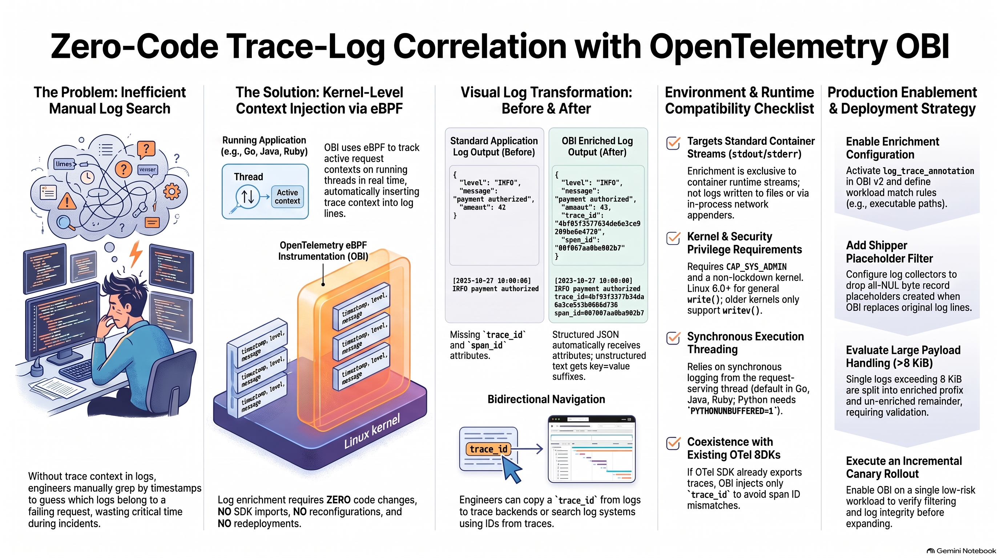
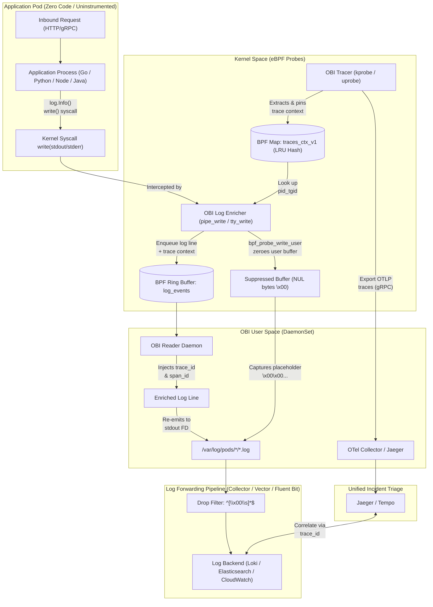

# OpenTelemetry eBPF (OBI) Zero-Code Trace-Log Correlation

[](https://github.com/nubenetes/obi-trace-log-correlation/releases)
[](https://github.com/nubenetes/obi-trace-log-correlation/actions)
[](LICENSE)
[](docs/day0-planning-sizing.md)
[](docs/architecture.md)
[](https://www.w3.org/TR/trace-context/)

<!-- Kubernetes Distribution Badges -->
[-EE0000.svg?logo=redhatopenshift&logoColor=white)](k8s/overlays/openshift-4.20/README.md)
[](k8s/overlays/aks/README.md)
[](k8s/overlays/eks/README.md)
[](k8s/overlays/gke/README.md)
[](k8s/overlays/rke/README.md)
[](docker-compose/README.md)

<!-- Observability & Log Shipper Badges -->
[](https://github.com/open-telemetry/opentelemetry-ebpf-instrumentation)
[](k8s/base/otel-collector.yaml)
[](docker-compose/compose.yaml)
[](log-pipelines/vector-filter.toml)
[](log-pipelines/fluent-bit-filter.conf)
[](log-pipelines/promtail-filter.yaml)

<!-- Runtimes & Operations -->
[-00ADD8.svg?logo=go&logoColor=white)](demo-apps/go/)
[-3776AB.svg?logo=python&logoColor=white)](demo-apps/python/)
[-5FA04E.svg?logo=nodedotjs&logoColor=white)](demo-apps/nodejs/)
[](scripts/)

Enterprise reference implementation, multi-cloud Kubernetes architectures, and end-to-end lifecycle automation for **Zero-Code Trace-Log Correlation** powered by [OpenTelemetry eBPF Instrumentation (OBI)](https://opentelemetry.io/blog/2026/obi-trace-log-correlation/).

---

## Executive Overview

When an incident occurs in production, operators often get paged with a failing trace, knowing the answers lie within application logs. If the service never adopted structured logging with trace context, the traditional response is grepping through timestamps and praying.

**OpenTelemetry eBPF Instrumentation (OBI)** bridges this gap at the Linux kernel level:
- **Zero Code Changes**: No OpenTelemetry SDKs, no logging framework modifications, no rebuilds or redeployments.
- **Bi-Directional Correlation**: Automatically injects matching `trace_id` and `span_id` directly into `stdout` and `stderr` writes.
- **Polyglot & Multi-Format**: Enriches structured **JSON** logs as native attributes and formats **Plain-Text** logs with key-value annotations (`trace_id=... span_id=...`).
- **Distributed Context Propagation**: Transparently propagates trace contexts across network hops (HTTP/gRPC) across disparate services.

---

## 📖 Official Reference & Theoretical Motivation

> [!IMPORTANT]
> **Official Reference Announcement**:  
> This repository operationalizes the milestone OpenTelemetry architecture announced in:  
> 👉 [**Zero-code trace-log correlation with OBI** (OpenTelemetry Blog, October 2026)](https://opentelemetry.io/blog/2026/obi-trace-log-correlation/)  
> 
> For the complete, unabridged verbatim text of the announcement paired with section-by-section analysis for both junior engineers and Linux systems specialists, see:  
> 📄 [**`docs/reference-blog-announcement.md`**](docs/reference-blog-announcement.md)

### 1. The Core Motivation: The 2 AM Incident Response Dilemma
- **The Junior SRE Experience (Explain Like I'm 5)**:  
  You are on-call at 2:00 AM. Your phone buzzes: an order checkout failed. You open Jaeger or Grafana Tempo and find the exact trace with `trace_id: 4bf92f3577b34da6a3ce929d0e0e4736`. To discover why the order failed, you open your log viewer (Loki, Elasticsearch, or CloudWatch) and search logs around the incident timestamp. In a production Kubernetes cluster handling thousands of requests per second, there are tens of thousands of log lines across dozens of pods. Because the application never had an OpenTelemetry SDK installed, none of the log lines contain a `trace_id`. You are forced to guess by timestamp—hoping clock skew doesn't mislead you.
- **The Enterprise Reality (Why SDKs Fail to Reach 100% Coverage)**:  
  Why not simply import OpenTelemetry SDKs into every service?
  1. **Polyglot Fleet Friction**: Enterprises maintain hundreds of microservices written across Go, Python, Java, Node.js, and .NET by dozens of independent squads.
  2. **Legacy & Frozen Codebases**: Critical legacy services lack active maintainers; modifying source code risks regressions and requires extensive compliance cycles.
  3. **Third-Party & Vendor Binaries**: Closed-source commercial containers and sidecars cannot be modified.
  4. **Quarter-Long Backlogs**: Coordinating code updates, testing, and deployments across an entire engineering organization can take an entire year.
- **The OBI Revolution (Zero-Code Kernel Interception)**:  
  OpenTelemetry eBPF Instrumentation (OBI) operates entirely inside the Linux kernel. It hooks the operating system's `write()` and `writev()` system calls on container stdout/stderr pipes. Whenever an application thread emits a log line, OBI checks its in-kernel BPF map (`traces_ctx_v1`) to determine what request that thread is currently serving, stamps the matching `trace_id` and `span_id` onto the log line in-flight, and re-emits it. **No SDKs, no app config, no recompilation, no redeployment.**

### 2. Dual-Perspective Technical Guidance

| Architectural Area | Junior Engineer Perspective (Conceptual) | Advanced Specialist Perspective (Systems & Kernel) |
|---|---|---|
| **Log Stamping** | Stamping an order number onto a chef's kitchen note before it leaves the kitchen. | `bpf_probe_write_user` zeroes user buffer with NULs; user daemon injects IDs via `log_events` ring buffer and re-emits to container fd. |
| **Context Staleness** | A waiter handles Ticket A, drops it off, and picks up Ticket B—don't stamp Ticket A on Ticket B's drink! | Go `runtime.casgstatus` uprobes, Node.js `async_hooks` + `uv_fs_access`, Java ByteBuddy `ioctl` thread hierarchy traversal. |
| **Log Pipeline Tuning** | A vacuum cleaner that sucks up blank lines before they clutter your screen. | Downstream log shippers (Collector, Vector, Fluent Bit, Promtail) decode CRI/Docker JSON and drop lines matching `^[\x00\s]*$`. |
| **Write Limits** | Very long book pages might get split into two pages if they exceed 8 KB. | Single `write()`/`writev()` calls > 8 KiB split at the BPF stack limit: 8 KiB prefix is enriched; remainder leaks un-enriched. |
| **Hybrid Mode** | If an app already has a nametag, don't pin a second, conflicting nametag on it. | When an in-process OTel SDK exports traces, OBI injects `trace_id` only and suppresses `span_id` to prevent APM waterfall corruption. |

---

---

## 🤖 AI-Generated Multimedia & Video Series (NotebookLM & YouTube)

This repository includes a comprehensive multi-format educational series synthesized with **Gemini NotebookLM** based directly on this repository's architectural analyses, manifests, eBPF kernel mechanics, and the official [OpenTelemetry Announcement](https://opentelemetry.io/blog/2026/obi-trace-log-correlation/). All videos and shorts are published and freely accessible on YouTube on the [**@nubenetes**](https://youtube.com/@nubenetes) channel.

> [!NOTE]
> **Multilingual Learning Experience**:
> Content features native spoken audio in **English 🇺🇸** and **Spanish 🇪🇸**, and includes automated YouTube subtitles / closed captions (CC) translated into **20+ languages** (Spanish, French, German, Japanese, Portuguese, Italian, Arabic, Hindi, etc.) for global knowledge sharing.

### 🎙️ Architectural Masterclass Podcasts (Audio)

| # | Format | Podcast Episode | Domain / Focus | Origin Language | Duration | Direct YouTube Link |
|---|:---:|---|---|:---:|:---:|---|
| 1 | 🎙️ Audio Podcast | [**Podcast: Zero-Code Trace-Log Correlation with OpenTelemetry eBPF (OBI) Deep Dive**](https://www.youtube.com/watch?v=QUSwbpEERlI) | Complete Architecture, Kernel Hooks & SRE Triage | 🇺🇸 English *(CC 20+)* | `47:47` | [▶️ Listen Podcast](https://www.youtube.com/watch?v=QUSwbpEERlI) |
| 2 | 🎙️ Audio Podcast | [**Podcast: Correlación Zero-Code de Logs y Trazas con eBPF y OpenTelemetry OBI**](https://www.youtube.com/watch?v=mpSVsUIpaMc) | Arquitectura Kernel, Filtrado NUL y Producción | 🇪🇸 Spanish *(CC 20+)* | `21:37` | [▶️ Escuchar Podcast](https://www.youtube.com/watch?v=mpSVsUIpaMc) |

### 🎬 Full-Length Technical Deep Dives (Videos)

| # | Format | Video Title | Category / Domain | Origin Language | Duration | Direct YouTube Link |
|---|:---:|---|---|:---:|:---:|---|
| 1 | 📽️ Video Guide | [**How OBI Correlation Works: Zero-Code Trace-Log Correlation with eBPF**](https://www.youtube.com/watch?v=f_tQfyjhgow) | Kernel Interception & Buffer Manipulation | 🇺🇸 English *(CC 20+)* | `7:55` | [▶️ Watch Video](https://www.youtube.com/watch?v=f_tQfyjhgow) |
| 2 | 📽️ Video Guide | [**Zero-Code Trace-Log Correlation: OpenTelemetry eBPF (OBI) Deep Dive**](https://www.youtube.com/watch?v=FVguXIDZwys) | Incident Response & Bidirectional Triage | 🇺🇸 English *(CC 20+)* | `8:18` | [▶️ Watch Video](https://www.youtube.com/watch?v=FVguXIDZwys) |
| 3 | 📽️ Video Guide | [**How to Inject Trace IDs into Logs Without Code Changes Using OBI eBPF**](https://www.youtube.com/watch?v=lNjPSBTPn0M) | Runtime Injection & Log Shipping Pipelines | 🇺🇸 English *(CC 20+)* | `6:34` | [▶️ Watch Video](https://www.youtube.com/watch?v=lNjPSBTPn0M) |
| 4 | 📽️ Video Guide | [**Tuning Log Shipper Pipelines for OBI eBPF: Null-Byte Filters & 8KB Log Splits**](https://www.youtube.com/watch?v=JbxR7WFacT8) | Downstream Log Pipelines & Buffer Chunking | 🇺🇸 English *(CC 20+)* | `6:16` | [▶️ Watch Video](https://www.youtube.com/watch?v=JbxR7WFacT8) |
| 5 | 📽️ Video Guide | [**Under the Hood of OBI eBPF: write vs writev Syscalls, Kernel Security & Limits**](https://www.youtube.com/watch?v=WzYDb8pX9Ao) | Syscall Interception & Linux Security | 🇺🇸 English *(CC 20+)* | `8:28` | [▶️ Watch Video](https://www.youtube.com/watch?v=WzYDb8pX9Ao) |
| 6 | 📽️ Video Guide | [**Zero-Code Trace-Log Correlation with eBPF: Production Architecture & Triage Guide**](https://www.youtube.com/watch?v=Vlo8nNAG-pw) | Production Architecture & SRE Triage | 🇺🇸 English *(CC 20+)* | `7:11` | [▶️ Watch Video](https://www.youtube.com/watch?v=Vlo8nNAG-pw) |

### ⚡ Topic-Focused Technical Shorts

| # | Short Title | Category | Origin Language | Duration | Direct YouTube Link |
|---|---|---|:---:|:---:|---|
| 1 | [**Zero-Code Trace-Log Correlation Explained: OpenTelemetry OBI eBPF**](https://www.youtube.com/shorts/Q4JZFSRVx4g) | Context Propagation & Stamping | 🇺🇸 English *(CC 20+)* | `1:06` | [▶️ Watch Short](https://www.youtube.com/shorts/Q4JZFSRVx4g) |
| 2 | [**How OBI Correlates Logs Without Code: OpenTelemetry eBPF In-Flight**](https://www.youtube.com/shorts/959UEHenqWI) | In-Flight Syscall Interception | 🇺🇸 English *(CC 20+)* | `1:10` | [▶️ Watch Short](https://www.youtube.com/shorts/959UEHenqWI) |
| 3 | [**How eBPF Automates Trace-Log Correlation in Go Without SDKs**](https://www.youtube.com/shorts/MHoXH29BrBE) | Go Runtime & JSON Enrichment | 🇺🇸 English *(CC 20+)* | `1:28` | [▶️ Watch Short](https://www.youtube.com/shorts/MHoXH29BrBE) |
| 4 | [**How eBPF Injects Trace IDs into Logs Without SDKs or Code Changes**](https://www.youtube.com/shorts/asTJjcmQjbs) | Buffer Substitution Mechanics | 🇺🇸 English *(CC 20+)* | `1:21` | [▶️ Watch Short](https://www.youtube.com/shorts/asTJjcmQjbs) |
| 5 | [**How eBPF Instruments Code Silently: OpenTelemetry OBI Zero-Code**](https://www.youtube.com/shorts/-3xdSEGKpps) | Non-Intrusive Kernel Observation | 🇺🇸 English *(CC 20+)* | `1:13` | [▶️ Watch Short](https://www.youtube.com/shorts/-3xdSEGKpps) |
| 6 | [**How OBI Injects Trace IDs Without Code: In-Flight eBPF Kernel Interception**](https://www.youtube.com/shorts/y6SQ_a_xNGY) | Kernel Interception & Zero-Rebuild Stamping | 🇺🇸 English *(CC 20+)* | `1:05` | [▶️ Watch Short](https://www.youtube.com/shorts/y6SQ_a_xNGY) |
| 7 | [**Tuning Log Pipelines for OBI: Filtering Null Bytes and 8KB Multi-Line Splits**](https://www.youtube.com/shorts/gSeqie44HqE) | Log Shipper Tuning & 8KB Reassembly | 🇺🇸 English *(CC 20+)* | `1:24` | [▶️ Watch Short](https://www.youtube.com/shorts/gSeqie44HqE) |
| 8 | [**Why eBPF Trace-Log Correlation Loses Context: Async Buffers and Runtime Caveats**](https://www.youtube.com/shorts/b9oNWMJlUcc) | Runtime Buffering & Async Disconnect Fixes | 🇺🇸 English *(CC 20+)* | `1:24` | [▶️ Watch Short](https://www.youtube.com/shorts/b9oNWMJlUcc) |

*For complete descriptions, technical breakdowns, and YouTube Studio links, see [Video Walkthroughs & Architecture References](#video-walkthroughs--architecture-references-youtube).*

---

## 📊 Architectural Infographic: Zero-Code Trace-Log Correlation with OBI

[](docs/images/zero-code-trace-log-correlation-infographic.png)

### Comprehensive Breakdown of the 5 Core Architectural Pillars

#### 1. 🔍 The Problem: Inefficient Manual Log Search
- **The Operational Challenge**: In high-throughput distributed microservices, standard application logs lack any direct contextual link to distributed traces.
- **The Manual Triage Nightmare**: During an outage or degradation, on-call engineers are paged with a failing trace ID (e.g. from Jaeger, Tempo, or Datadog) but are forced to manually `grep` log files by imprecise timestamps across dozens of container pods.
- **The Resolution Bottleneck**: Clock drift between nodes, high concurrency (thousands of requests/sec), and asynchronous processing waste critical minutes guessing which logs belong to which user transaction, artificially inflating Mean Time to Resolution (MTTR).

#### 2. ⚡ The Solution: Kernel-Level Context Injection via eBPF
- **Real-Time Thread Context Tracking**: OpenTelemetry eBPF Instrumentation (OBI) operates transparently within the Linux kernel, continuously monitoring active request contexts (`trace_id`, `span_id`) across running application threads.
- **In-Flight Syscall Interception**: When an application thread calls `write()` or `writev()` to emit logs to stdout or stderr, OBI intercepts the system call in-flight and injects the active trace context directly into the log payload.
- **Zero-Touch Operational Model**: Requires **ZERO code changes**, **NO SDK imports**, **NO logger reconfigurations**, and **NO application rebuilds or container redeployments**.

#### 3. 🔄 Visual Log Transformation: Before & After
- **Standard Application Log Output (Before)**:
  - *Structured JSON*: `{"level":"INFO","message":"payment authorized","amount":42}` — missing `trace_id` and `span_id` attributes.
  - *Plain-Text*: `[2025-10-27 10:00:00] INFO payment authorized` — completely disconnected from tracing context.
- **OBI Enriched Log Output (After)**:
  - *Structured JSON*: Automatically enriched with native JSON attributes:
    ```json
    {
      "level": "INFO",
      "message": "payment authorized",
      "amount": 42,
      "trace_id": "4bf92f3577b34da6a3ce929d0e0e4736",
      "span_id": "00f067aa0ba902b7"
    }
    ```
  - *Plain-Text*: Decorated with fixed-width key-value suffixes:
    ```text
    [2025-10-27 10:00:00] INFO payment authorized trace_id=4bf92f3577b34da6a3ce929d0e0e4736 span_id=00f067aa0ba902b7
    ```
- **Bidirectional Navigation**: Engineers can copy a `trace_id` from a log record directly into a trace viewer (Jaeger/Tempo) to inspect the full distributed waterfall, or click through from a trace span directly to the correlated log entries in Grafana Loki, OpenSearch, or CloudWatch.

#### 4. 📋 Environment & Runtime Compatibility Checklist
- ☑ **Targets Standard Container Streams (`stdout`/`stderr`)**: Enrichment is exclusive to container runtime streams captured from Linux pipes and pseudo-terminals (`/dev/stdout`, `/dev/stderr`). Logs written directly to disk files or emitted via out-of-process network socket appenders bypass kernel stdout interception.
- ☑ **Kernel & Security Privilege Requirements**: Requires `CAP_SYS_ADMIN` capability and a non-lockdown Linux kernel (`[none]` mode in `/sys/kernel/security/lockdown`). Full `write()` support requires **Linux 6.0+** (`ITER_UBUF`); older kernels (5.8–5.19) support only `writev()` (`ITER_IOVEC`).
- ☑ **Synchronous Execution Threading**: Relies on synchronous log emission from the thread actively serving the request. Works out of the box in Go, Java (platform threads), and Ruby. Python requires `ENV PYTHONUNBUFFERED=1` to disable stdio pipe buffering. Node.js uses `async_hooks` to bridge libuv callbacks.
- ☑ **Coexistence with Existing OTel SDKs**: If an application already exports traces via an official OpenTelemetry SDK, OBI automatically detects it and injects **only `trace_id`**, safely suppressing synthetic `span_id` injection to avoid conflicting with the SDK's internal span hierarchy.

#### 5. 🚀 Production Enablement & Deployment Strategy
- **Step 1 — Enable Enrichment Configuration**: Activate `extensions.obi.correlation.log_trace_annotation.enabled: true` in OBI Config v2 and specify target workload match rules (`exe_path_glob`, namespaces, or container names).
- **Step 2 — Add Shipper Placeholder Filter**: When OBI suppresses the original un-enriched log via `bpf_probe_write_user`, it zeroes the user buffer. Downstream log shippers (OTel Collector, Vector, Fluent Bit, Promtail) must include a filter rule dropping blank placeholder records matching `^[\x00\s]*$`.
- **Step 3 — Evaluate Large Payload Handling (> 8 KiB)**: Linux eBPF probe limits enforce an 8 KiB boundary per system call. Payloads exceeding 8 KiB are split: the first 8 KiB prefix is enriched, while the remainder leaks through un-enriched. Applications emitting large payloads should be measured before rollout.
- **Step 4 — Execute an Incremental Canary Rollout**: Begin by enabling log correlation on a single low-risk service in OBI's `match` list. Validate that NUL placeholders are dropped and log lines are not duplicated before progressively expanding across the cluster.

---

## Architecture



### Architectural Diagram Walkthrough & Operational Lifecycle

The diagram above illustrates the complete end-to-end lifecycle of a distributed transaction, from socket ingress down into kernel VFS interception and up to the incident response UI.

---

#### 🐣 Junior Engineer Walkthrough: The Lifecycle of a Request & Log Line

If you are new to distributed systems, eBPF, or Linux internals, follow this step-by-step journey of what happens behind the scenes:

- **Step 1: The Request Arrives (`AppNamespace`)**
  - An HTTP or gRPC request arrives at your microservice (e.g., `POST /checkout`).
  - The application code starts running its standard business logic. The application **does not have any OpenTelemetry SDK installed**—it is just plain, unmodified code.
- **Step 2: The Kernel Catches the Network Call (`KernelSpace`)**
  - Before the application even processes the request bytes, an OBI network probe in the Linux kernel intercepts the incoming socket traffic.
  - It reads the W3C `traceparent` header (or creates a new root trace if it is the first service) and saves the active `trace_id` and `span_id` in a kernel memory ledger called `traces_ctx_v1`.
  - Crucially, it links these IDs to the **exact thread** running that code.
- **Step 3: The Application Emits a Log Line**
  - Your application calls standard logging: `log.Info("payment authorized", "amount", 42)`.
  - The programming language tells the Linux kernel: *"Please write this text to stdout (the console)."* This triggers a Linux `write()` system call.
- **Step 4: The Kernel Invisible Swap (`bpf_probe_write_user`)**
  - OBI's kernel probe catches the `write()` system call in-flight.
  - It checks the thread ID against the kernel ledger and sees: *"Aha! This thread is currently processing trace `4bf92f35...`!"*
  - It copies the original log message and the trace IDs into a fast queue (the BPF Ring Buffer).
  - **The Magic Trick**: Because the kernel cannot simply "cancel" a write that already started, OBI writes zeroes (`\0` NUL bytes) over the original log message in memory. This turns the original message into a harmless blank placeholder so you don't get duplicate log lines!
- **Step 5: The OBI Daemon Enriches and Re-emits (`OBIDaemonSet`)**
  - The user-space OBI daemon pulls the log message from the fast ring buffer queue.
  - It formats the message, injecting `"trace_id": "4bf9..."` and `"span_id": "00f0..."` into the JSON structure (or appends them as `key=value` on plain text).
  - It writes this freshly stamped log directly back to the container's log stream file (`/var/log/pods`).
- **Step 6: The Log Shipper Cleans Up the Garbage (`LogShipping`)**
  - The container log file now has two lines: the blank placeholder line (NUL bytes) and the newly enriched line.
  - Your log shipping agent (OTel Collector, Vector, Fluent Bit, or Promtail) runs a 1-line filter rule (`^[\x00\s]*$`) that silently discards the blank placeholder line, keeping only the enriched line.
- **Step 7: Instant Incident Response (`ObservabilityUI`)**
  - You open Jaeger, click a failed span, copy the `trace_id`, paste it into Grafana Loki, and immediately see the exact log lines for that request! No timestamp guessing required.

---

#### 🚀 Advanced Specialist Deep Dive: Systems, Kernel & Pipeline Mechanics

For Platform Architects, Linux Kernel Engineers, and Staff SREs, here is the technical breakdown of the subgraphs and kernel data structures:

- **1. Ingress Socket Interception & Context Pinning (`traces_ctx_v1`)**:
  - OBI attaches kprobes and uprobes to transport socket read paths (`sys_enter_read`, `sys_enter_recvfrom`, SSL/TLS uprobes).
  - It extracts or generates 128-bit W3C `trace_id` and 64-bit `span_id` values, serializing them into an `obi_ctx_info_t` struct.
  - Context is inserted into `traces_ctx_v1`, a kernel BPF map of type `BPF_MAP_TYPE_LRU_HASH` pinned by name under `/sys/fs/bpf/otel/`. The map is keyed by `u64 pid_tgid` (upper 32 bits PID, lower 32 bits TID) with `BPF_ANY` update semantics to ensure lockless, thread-safe, and idempotent writes.
- **2. VFS Syscall Hook Points & Iterator Subsystems (`pipe_write` / `ksys_write`)**:
  - Container runtimes redirect container stdout/stderr to Linux pipes. OBI attaches probes to `pipe_write`, `tty_write`, and `ksys_write`.
  - For vectored I/O (`writev`), an auxiliary kprobe on `do_writev` captures the active file descriptor and tracks it per thread so `pipe_write` can inspect file descriptor metadata.
  - **Kernel Iterator Differences**:
    - **Linux >= 6.0**: Uses `ITER_UBUF` for single-buffer `write()` calls, enabling zero-copy inspection and in-place buffer substitution.
    - **Linux 5.8–5.19**: Uses `ITER_IOVEC`, restricting full write interception to runtimes utilizing vectored I/O (`writev()`).
- **3. Memory Mutation Semantics (`bpf_probe_write_user`)**:
  - In Linux eBPF, a tracing probe cannot divert or abort an in-flight system call once invoked.
  - To prevent duplicate entries in `/var/log/pods` (the original un-enriched write plus the daemon's enriched re-emission), OBI invokes the kernel helper `bpf_probe_write_user()`.
  - It zeroes the user-space buffer memory with NUL characters (`\x00`) up to the write length, terminating with a newline (`\n`).
  - **Security Requirements**: The target host requires `CAP_SYS_ADMIN` capability. Kernel lockdown (`/sys/kernel/security/lockdown`) must be `[none]`—in `integrity` or `confidentiality` mode, `bpf_probe_write_user` is explicitly prohibited by the Linux kernel.
- **4. Asynchronous Ringbuffer Dispatch (`log_events`)**:
  - Captured log chunks and trace context structs are submitted to the kernel `log_events` ring buffer via `bpf_ringbuf_submit()`.
  - Ring buffers provide lockless, multi-producer single-consumer queues with significantly lower overhead and memory contention than legacy perf event buffers.
- **5. User-Space Re-emission & File Descriptor Injection**:
  - The OBI user-space reader daemon consumes raw `log_event_t` events from the ring buffer.
  - It inspects the payload structure (distinguishing JSON, NDJSON, and unstructured plain text) and injects `trace_id` and `span_id`.
  - It re-emits the payload directly to the target container's stdout file descriptor via `/proc/<pid>/fd/<fd>`, preserving original container log format envelopes.
- **6. Downstream Ingestion & The NUL Placeholder Filter**:
  - The suppressed buffer written by the application process reaches the container runtime logging engine as a line of NUL characters (`\0` or `\u0000` in JSON CRI envelopes).
  - Log forwarders (OpenTelemetry Collector, Vector, Fluent Bit, Promtail) decode the envelope into raw strings, where a single drop regex rule `^[\x00\s]*$` excludes the placeholder line before transmitting logs over the network.
- **7. The 8 KiB Single-Write Boundary**:
  - The eBPF verification engine enforces a strict 8,192-byte (8 KiB) maximum capture buffer per system call.
  - Writes $\le 8\text{ KiB}$ are fully captured, zeroed, and re-emitted with trace enrichment.
  - Writes $> 8\text{ KiB}$ are chunked: the initial 8 KiB is enriched, while the remaining tail leaks through un-enriched to stdout, splitting one logical log line into two physical records.

---

## Supported Use Cases

1. **Zero-Code Microservices Correlation**: Complete end-to-end tracing and log linking across microservices written in Go, Python, Node.js, and Java without touching source code.
2. **Legacy & Third-Party Binaries**: Instrument legacy applications where source code is unavailable, lost, or frozen.
3. **Polyglot Log Harmonization**: Correlate mixed formats—injecting JSON keys into structured logs while decorating unstructured text lines with `trace_id=... span_id=...`.
4. **Hybrid OTel SDK Coexistence**: When services already use an OTel SDK for traces but lack log correlation, OBI automatically injects `trace_id` while suppressing conflicting `span_id` fields.
5. **Incident Debugging Acceleration**: Jump directly from a failing trace span in Jaeger/Tempo to exact log lines in Grafana Loki, OpenSearch, or CloudWatch.

---

## Repository Structure

### Compact Overview (ASCII Tree)

```text
obi-trace-log-correlation/
├── demo-apps/                 # Polyglot uninstrumented application workloads
│   ├── go/frontend/           # Uninstrumented Go HTTP service (log/slog JSON)
│   ├── go/backend/            # Uninstrumented Go HTTP service (log/slog JSON)
│   ├── python/                # Python unbuffered service (PYTHONUNBUFFERED=1)
│   ├── nodejs/                # Node.js service with Pino JSON logging
│   └── plaintext/             # Legacy plain-text service showing key=value annotations
├── docker-compose/            # Self-contained local Linux evaluation stack
│   ├── compose.yaml           # Frontend, Backend, Jaeger, and OBI DaemonSet
│   └── obi-config.yml         # OBI Config v2 with correlation.log_trace_annotation
├── k8s/                       # Production Kubernetes configurations
│   ├── base/                  # Kustomize base (DaemonSet, RBAC, ConfigMap, Collector)
│   └── overlays/              # Enterprise distribution overlays
│       ├── openshift-4.20/    # OpenShift 4.20+ with custom SCC & Vector filter
│       ├── aks/               # Azure Kubernetes Service (Azure Linux/Ubuntu)
│       ├── eks/               # AWS Elastic Kubernetes Service (AL2023/Bottlerocket)
│       ├── gke/               # Google Kubernetes Engine (Standard COS/Ubuntu)
│       └── rke/               # Rancher RKE2 / K3s hardened profiles
├── log-pipelines/             # Filter configurations to drop suppressed NUL placeholders
│   ├── otel-collector-filelog.yaml
│   ├── fluent-bit-filter.conf
│   ├── vector-filter.toml
│   └── promtail-filter.yaml
├── scripts/                   # Production lifecycle automation scripts
│   ├── common.sh                  # Shared logging, ANSI colors, and error trap library
│   ├── day0-kernel-audit.sh       # Preflight kernel, BPF, and lockdown audit
│   ├── day1-deploy.sh             # Multi-cloud automated deployment
│   ├── day1-generate-traffic.sh   # Synthetic HTTP traffic generator
│   ├── day2-verify-correlation.sh # Live verification of log trace IDs
│   ├── day2-canary-rollout.sh     # Canary progressive rollout helper
│   ├── benchmark-overhead.sh      # Latency and throughput overhead benchmark
│   └── decommission.sh            # Safe cleanup and BPF map unpinning
└── docs/                      # Comprehensive technical documentation
    ├── images/                    # Architectural infographics and visual assets
    │   ├── zero-code-trace-log-correlation-infographic.png # Full-resolution (2752x1536) master PNG
    │   └── zero-code-trace-log-correlation-infographic.jpg # High-definition (2752x1536) JPEG
    ├── reference-blog-announcement.md # Verbatim blog text, junior primers & specialist deep dives
    ├── architecture.md            # Kernel hooks, LRU maps, and ringbuffer flow
    ├── day0-planning-sizing.md    # Kernel matrix, hardware sizing, security model
    ├── day1-installation.md       # Multi-platform deployment guides
    ├── day2-operations-triage.md  # Incident triage queries (Loki, Jaeger, ES)
    ├── log-filtering-guide.md     # In-depth explanation of NUL bytes & filters
    ├── runtime-compatibility.md   # Language runtime specifics (Go, Python, Java, .NET)
    ├── troubleshooting.md         # Diagnostic runbook for common pitfalls
    ├── decommission-guide.md      # Clean teardown procedures
    └── references.md              # Catalog of official links and resources
```

### Interactive Repository Map

> [!TIP]
> **Interactive Repository Map**: Every directory and file link in the tree below is hyperlinked directly to its source. Click any item to explore its code, configuration, or documentation without losing context.

- 📂 **[`obi-trace-log-correlation/`](.)**
  - 📁 **[`demo-apps/`](demo-apps/)** — *Polyglot uninstrumented application workloads (Zero-Code)*
    - 📁 **[`demo-apps/go/`](demo-apps/go/)**
      - 📁 **[`demo-apps/go/frontend/`](demo-apps/go/frontend/)**
        - 📄 [`main.go`](demo-apps/go/frontend/main.go) — *Uninstrumented Go HTTP frontend service emitting JSON logs via `log/slog`*
        - 🐳 [`Dockerfile`](demo-apps/go/frontend/Dockerfile) — *Multi-stage minimal Alpine container build with non-root user*
        - 📦 [`go.mod`](demo-apps/go/frontend/go.mod) — *Go 1.23 module declaration*
      - 📁 **[`demo-apps/go/backend/`](demo-apps/go/backend/)**
        - 📄 [`main.go`](demo-apps/go/backend/main.go) — *Uninstrumented Go backend handling incoming requests and logging JSON to stdout*
        - 🐳 [`Dockerfile`](demo-apps/go/backend/Dockerfile) — *Multi-stage container build with non-root security context*
        - 📦 [`go.mod`](demo-apps/go/backend/go.mod) — *Go 1.23 module declaration*
    - 📁 **[`demo-apps/python/`](demo-apps/python/)**
      - 🐍 [`app.py`](demo-apps/python/app.py) — *Python HTTP service with synchronous structured JSON logging*
      - 🐳 [`Dockerfile`](demo-apps/python/Dockerfile) — *Container build configuring `ENV PYTHONUNBUFFERED=1` for synchronous stdout writes*
      - 📄 [`requirements.txt`](demo-apps/python/requirements.txt) — *Python dependency manifest (zero external dependencies required)*
    - 📁 **[`demo-apps/nodejs/`](demo-apps/nodejs/)**
      - 🟩 [`server.js`](demo-apps/nodejs/server.js) — *Node.js HTTP service using Pino-compatible structured JSON logging to stdout*
      - 🐳 [`Dockerfile`](demo-apps/nodejs/Dockerfile) — *Node 20 Alpine container build*
      - 📦 [`package.json`](demo-apps/nodejs/package.json) — *Node.js package manifest and entrypoint definition*
    - 📁 **[`demo-apps/plaintext/`](demo-apps/plaintext/)**
      - 📄 [`main.go`](demo-apps/plaintext/main.go) — *Legacy plain-text service demonstrating OBI's key-value annotations (`trace_id=... span_id=...`)*
      - 🐳 [`Dockerfile`](demo-apps/plaintext/Dockerfile) — *Minimal Alpine container build*
      - 📦 [`go.mod`](demo-apps/plaintext/go.mod) — *Go 1.23 module declaration*
  - 📁 **[`docker-compose/`](docker-compose/)** — *Self-contained local Linux evaluation environment*
    - 🐙 [`compose.yaml`](docker-compose/compose.yaml) — *Multi-container stack (Frontend, Backend, Jaeger 1.62, and OBI v0.14.0)*
    - ⚙️ [`obi-config.yml`](docker-compose/obi-config.yml) — *OBI Config v2 with `extensions.obi.correlation.log_trace_annotation`*
    - 📖 [`README.md`](docker-compose/README.md) — *Local 60-second evaluation guide and step-by-step instructions*
  - 📁 **[`k8s/`](k8s/)** — *Enterprise Kubernetes manifests and multi-cloud overlays*
    - 📁 **[`k8s/base/`](k8s/base/)** — *Kustomize foundational base manifests*
      - ☸️ [`kustomization.yaml`](k8s/base/kustomization.yaml) — *Kustomize base resource aggregator*
      - 🏷️ [`namespace.yaml`](k8s/base/namespace.yaml) — *`obi` (privileged) and `demo-apps` (restricted) namespaces with PSA labels*
      - 🛡️ [`rbac.yaml`](k8s/base/rbac.yaml) — *ServiceAccount, ClusterRole, and ClusterRoleBinding for Kubernetes metadata decoration*
      - ⚙️ [`obi-configmap.yaml`](k8s/base/obi-configmap.yaml) — *Production OBI Config v2 ConfigMap with workload match rules and trace-log correlation*
      - 🚀 [`obi-daemonset.yaml`](k8s/base/obi-daemonset.yaml) — *Production DaemonSet with `hostPID: true`, `privileged: true`, and `/sys/fs/bpf` mount*
      - 📦 [`demo-services.yaml`](k8s/base/demo-services.yaml) — *Deployments and Services for Frontend and Backend demo applications*
      - 🔭 [`otel-collector.yaml`](k8s/base/otel-collector.yaml) — *In-cluster OTel Collector DaemonSet with `filelog` receiver and NUL placeholder filter*
    - 📁 **[`k8s/overlays/`](k8s/overlays/)** — *Enterprise distribution overlays and hardened profiles*
      - 📁 **[`k8s/overlays/openshift-4.20/`](k8s/overlays/openshift-4.20/)** — *Red Hat OpenShift 4.20+ overlay (RHCOS Linux 6.6+)*
        - 🛡️ [`security-context-constraints.yaml`](k8s/overlays/openshift-4.20/security-context-constraints.yaml) — *Custom `obi-ebpf-scc` granting `hostPID`, `CAP_SYS_ADMIN`, and hostPath mounts*
        - 🩹 [`obi-daemonset-patch.yaml`](k8s/overlays/openshift-4.20/obi-daemonset-patch.yaml) — *SELinux `spc_t` type and infra/master tolerations patch*
        - ⚙️ [`vector-filter-configmap.yaml`](k8s/overlays/openshift-4.20/vector-filter-configmap.yaml) — *OpenShift Cluster Logging Vector drop filter for NUL placeholders*
        - ☸️ [`kustomization.yaml`](k8s/overlays/openshift-4.20/kustomization.yaml) — *OpenShift 4.20+ Kustomization declaration*
        - 📖 [`README.md`](k8s/overlays/openshift-4.20/README.md) — *Detailed OpenShift 4.20+ deployment runbook and security guide*
      - 📁 **[`k8s/overlays/aks/`](k8s/overlays/aks/)** — *Azure Kubernetes Service (AKS) overlay*
        - 🩹 [`obi-daemonset-patch.yaml`](k8s/overlays/aks/obi-daemonset-patch.yaml) — *NodeSelector targeting Azure Linux (CBL-Mariner) / Ubuntu 24.04 (kernel >= 6.0)*
        - ☸️ [`kustomization.yaml`](k8s/overlays/aks/kustomization.yaml) — *AKS Kustomization declaration*
        - 📖 [`README.md`](k8s/overlays/aks/README.md) — *AKS deployment guide and Azure Monitor / OTel Collector pipeline notes*
      - 📁 **[`k8s/overlays/eks/`](k8s/overlays/eks/)** — *AWS Elastic Kubernetes Service (EKS) overlay*
        - 🩹 [`obi-daemonset-patch.yaml`](k8s/overlays/eks/obi-daemonset-patch.yaml) — *NodeSelector targeting Amazon Linux 2023 (AL2023) / Bottlerocket node pools*
        - ☸️ [`kustomization.yaml`](k8s/overlays/eks/kustomization.yaml) — *EKS Kustomization declaration*
        - 📖 [`README.md`](k8s/overlays/eks/README.md) — *EKS deployment guide and AWS VPC CNI eBPF coexistence details*
      - 📁 **[`k8s/overlays/gke/`](k8s/overlays/gke/)** — *Google Kubernetes Engine (GKE Standard) overlay*
        - 🩹 [`obi-daemonset-patch.yaml`](k8s/overlays/gke/obi-daemonset-patch.yaml) — *NodeSelector targeting GKE Standard Linux nodes with COS / Ubuntu*
        - ☸️ [`kustomization.yaml`](k8s/overlays/gke/kustomization.yaml) — *GKE Kustomization declaration*
        - 📖 [`README.md`](k8s/overlays/gke/README.md) — *GKE deployment guide and Datapath v2 (Cilium) coexistence details*
      - 📁 **[`k8s/overlays/rke/`](k8s/overlays/rke/)** — *Rancher RKE2 / K3s hardened profiles overlay*
        - 🩹 [`obi-daemonset-patch.yaml`](k8s/overlays/rke/obi-daemonset-patch.yaml) — *Control-plane and etcd node tolerations patch*
        - ☸️ [`kustomization.yaml`](k8s/overlays/rke/kustomization.yaml) — *RKE2 Kustomization declaration*
        - 📖 [`README.md`](k8s/overlays/rke/README.md) — *RKE2 CIS hardening notes and `/sys/fs/bpf` mount configuration*
  - 📁 **[`log-pipelines/`](log-pipelines/)** — *Log forwarder configurations to drop suppressed NUL placeholders*
    - 🔭 [`otel-collector-filelog.yaml`](log-pipelines/otel-collector-filelog.yaml) — *OpenTelemetry Collector `filelog` receiver with `body matches "^[\\x00\\s]*$"`*
    - ⚡ [`vector-filter.toml`](log-pipelines/vector-filter.toml) — *Vector VRL filter transform dropping records matching `^[\x00\s]*$`*
    - 📜 [`fluent-bit-filter.conf`](log-pipelines/fluent-bit-filter.conf) — *Fluent Bit `grep` filter excluding `^[\x00\s]*$`*
    - 🔥 [`promtail-filter.yaml`](log-pipelines/promtail-filter.yaml) — *Promtail / Loki pipeline stage dropping `^[\x00\s]*$`*
  - 📁 **[`scripts/`](scripts/)** — *Production lifecycle automation scripts*
    - 🛠️ [`common.sh`](scripts/common.sh) — *Shared logging, ANSI color formatting, and error trap library*
    - 🔍 [`day0-kernel-audit.sh`](scripts/day0-kernel-audit.sh) — *Preflight audit verifying kernel >= 6.0, `/sys/fs/bpf`, lockdown, and cluster nodes*
    - 🚀 [`day1-deploy.sh`](scripts/day1-deploy.sh) — *Multi-cloud deployment CLI supporting `openshift`, `aks`, `eks`, `gke`, `rke`, `docker-compose`*
    - 🚦 [`day1-generate-traffic.sh`](scripts/day1-generate-traffic.sh) — *Synthetic HTTP load generator triggering distributed transactions*
    - ✅ [`day2-verify-correlation.sh`](scripts/day2-verify-correlation.sh) — *Live verification script validating matching `trace_id` values across container logs*
    - 🐤 [`day2-canary-rollout.sh`](scripts/day2-canary-rollout.sh) — *Canary progressive rollout and rollback helper for OBI match rules*
    - ⏱️ [`benchmark-overhead.sh`](scripts/benchmark-overhead.sh) — *Overhead benchmarking tool measuring latency, throughput, and CPU usage*
    - 🧹 [`decommission.sh`](scripts/decommission.sh) — *Safe cleanup script unpinning `/sys/fs/bpf/otel` maps and tearing down resources*
  - 📁 **[`docs/`](docs/)** — *Comprehensive technical and operational documentation*
    - 📁 **[`docs/images/`](docs/images/)** — *Architectural infographics and visual assets*
      - 🖼️ [`zero-code-trace-log-correlation-infographic.png`](docs/images/zero-code-trace-log-correlation-infographic.png) — *Full-resolution master architectural infographic (2752x1536 PNG, lossless)*
      - 🖼️ [`zero-code-trace-log-correlation-infographic.jpg`](docs/images/zero-code-trace-log-correlation-infographic.jpg) — *High-definition architectural infographic (2752x1536 JPG)*
    - 📜 [`reference-blog-announcement.md`](docs/reference-blog-announcement.md) — *Verbatim OpenTelemetry announcement, junior primer, and kernel deep dive*
    - 🏛️ [`architecture.md`](docs/architecture.md) — *Deep dive into write syscall hooks, `traces_ctx_v1` LRU map, and ringbuffer flow*
    - 📋 [`day0-planning-sizing.md`](docs/day0-planning-sizing.md) — *Kernel matrix, hardware sizing formulas, and security postures*
    - 📦 [`day1-installation.md`](docs/day1-installation.md) — *Multi-platform installation guide and bootstrap steps*
    - 🚨 [`day2-operations-triage.md`](docs/day2-operations-triage.md) — *Incident triage playbook with LogQL/Jaeger queries and Prometheus alerts*
    - 💧 [`log-filtering-guide.md`](docs/log-filtering-guide.md) — *Technical explanation of NUL placeholder lines and the 8 KiB write boundary*
    - 🌐 [`runtime-compatibility.md`](docs/runtime-compatibility.md) — *Language runtime specifics for Go, Python, Java (Loom), Node.js, and .NET*
    - 🩺 [`troubleshooting.md`](docs/troubleshooting.md) — *Diagnostic runbook for common pitfalls*
    - 🛑 [`decommission-guide.md`](docs/decommission-guide.md) — *Clean teardown procedures ensuring zero orphaned kernel resources*
    - 🔗 [`references.md`](docs/references.md) — *Official OpenTelemetry blog links, developer docs, and community resources*
  - 📁 **[`.github/workflows/`](.github/workflows/)** — *GitHub Actions CI/CD automation*
    - 🤖 [`ci.yml`](.github/workflows/ci.yml) — *Continuous integration workflow validating shell scripts, manifests, and container builds*
  - 📜 [`LICENSE`](LICENSE) — *Apache License, Version 2.0*
  - 🙈 [`.gitignore`](.gitignore) — *Git ignore rules for binaries, build artifacts, and virtual environments*
  - 📘 [`README.md`](README.md) — *Master repository documentation, architecture diagrams, and quickstart guides*

---

### Detailed Component & Directory Breakdown

#### 📁 `demo-apps/` — Polyglot Application Microservices
- **Go Frontend ([`demo-apps/go/frontend/`](demo-apps/go/frontend/))**: An uninstrumented HTTP microservice listening on port 8080. It utilizes Go 1.23 standard library `log/slog` to write JSON records to stdout. When `/checkout` is invoked, it logs an order event and dispatches an HTTP GET request to the downstream backend. OBI automatically intercepts the outbound HTTP client call, generates a W3C `traceparent` header, joins the spans, and enriches stdout writes with `trace_id` and `span_id`.
- **Go Backend ([`demo-apps/go/backend/`](demo-apps/go/backend/))**: An uninstrumented HTTP microservice listening on port 8081. It serves the `/hello` endpoint and logs structured JSON with `log/slog`. OBI extracts incoming W3C trace context from the kernel socket buffer and decorates the backend logs with the identical `trace_id`.
- **Python Service ([`demo-apps/python/`](demo-apps/python/))**: Demonstrates Python compatibility. Configured with `ENV PYTHONUNBUFFERED=1` in its Dockerfile to prevent stdout buffering in container pipes, ensuring write syscalls execute synchronously on the request-handling thread.
- **Node.js Service ([`demo-apps/nodejs/`](demo-apps/nodejs/))**: An Express service utilizing Pino JSON structured logging, demonstrating how OBI's kernel hooks track asynchronous event-loop callbacks.
- **Plain-Text Service ([`demo-apps/plaintext/`](demo-apps/plaintext/))**: Emits unstructured free-form log lines (`legacy transaction executed user=john_doe...`), showcasing OBI's ability to append key-value annotations (`trace_id=... span_id=...`) to non-JSON output.

#### 📁 `docker-compose/` — Local Evaluation Environment
- **[`docker-compose/compose.yaml`](docker-compose/compose.yaml)**: Launches a 4-container topology on a Linux host (`frontend`, `backend`, `jaeger:1.62.0`, and `otel/ebpf-instrument:v0.14.0`). Configured with `pid: host` and `privileged: true`, mounting `/sys/fs/bpf` to enable live eBPF probe attachment without requiring a full Kubernetes cluster.
- **[`docker-compose/obi-config.yml`](docker-compose/obi-config.yml)**: Configures OBI using Config v2 syntax. Defines `capture.rules` matching target binary globs (`/frontend`, `/backend`) and enables `extensions.obi.correlation.log_trace_annotation`.

#### 📁 `k8s/base/` — Production Kubernetes Foundations
- **[`k8s/base/namespace.yaml`](k8s/base/namespace.yaml)**: Declares dedicated namespaces with Pod Security Standards (`privileged` for `obi` and `restricted` for `demo-apps`).
- **[`k8s/base/rbac.yaml`](k8s/base/rbac.yaml)**: Provisions the `ServiceAccount`, `ClusterRole`, and `ClusterRoleBinding` granting OBI read access to Pods, Nodes, and Services for decorating telemetry with Kubernetes metadata attributes.
- **[`k8s/base/obi-configmap.yaml`](k8s/base/obi-configmap.yaml)**: The cluster-wide ConfigMap containing OBI Config v2, pointing OTLP traces export to the in-cluster collector.
- **[`k8s/base/obi-daemonset.yaml`](k8s/base/obi-daemonset.yaml)**: The enterprise DaemonSet deploying OBI across all cluster nodes. Includes `hostPID: true`, Bidirectional `/sys/fs/bpf` mount propagation, host `/sys/kernel/debug` access, and resource requests/limits.
- **[`k8s/base/otel-collector.yaml`](k8s/base/otel-collector.yaml)**: Deploys the OpenTelemetry Collector with both OTLP receivers and the `filelog` receiver tailing `/var/log/pods`. Configured with the essential NUL placeholder drop filter.
- **[`k8s/base/demo-services.yaml`](k8s/base/demo-services.yaml)**: Deployments and ClusterIP Services for the frontend and backend sample workloads.

#### 📁 `k8s/overlays/` — Enterprise Cloud & On-Prem Distribution Overlays
- **[`k8s/overlays/openshift-4.20/`](k8s/overlays/openshift-4.20/)**: Tailored for Red Hat OpenShift 4.20+ running RHCOS with Linux kernel 6.6+. Features a custom `SecurityContextConstraints` (`obi-ebpf-scc`) to authorize hostPID and eBPF capabilities, SELinux `spc_t` container settings, and a Vector filter ConfigMap for OpenShift Cluster Logging.
- **[`k8s/overlays/aks/`](k8s/overlays/aks/)**: Configured for Azure Kubernetes Service node pools running Azure Linux (CBL-Mariner) or Ubuntu 24.04 (kernel >= 6.0), including nodeSelectors and Azure Monitor considerations.
- **[`k8s/overlays/eks/`](k8s/overlays/eks/)**: Configured for AWS Elastic Kubernetes Service node pools running Amazon Linux 2023 (AL2023) or Bottlerocket, addressing AWS VPC CNI eBPF coexistence.
- **[`k8s/overlays/gke/`](k8s/overlays/gke/)**: Configured for Google Kubernetes Engine Standard clusters running Container-Optimized OS (COS) or Ubuntu, detailing coexistence with GKE Datapath v2.
- **[`k8s/overlays/rke/`](k8s/overlays/rke/)**: Hardened overlay for Rancher RKE2 and K3s distributions complying with CIS benchmarks.

#### 📁 `log-pipelines/` — Suppressed NUL Byte Filter Configurations
- Explains and provides ready-to-use configuration drop filters for log forwarders ([`otel-collector-filelog.yaml`](log-pipelines/otel-collector-filelog.yaml), [`vector-filter.toml`](log-pipelines/vector-filter.toml), [`fluent-bit-filter.conf`](log-pipelines/fluent-bit-filter.conf), [`promtail-filter.yaml`](log-pipelines/promtail-filter.yaml)). These filters match `^[\x00\s]*$` to silently discard the zeroed-out memory placeholders produced by `bpf_probe_write_user`.

#### 📁 `scripts/` — Production Lifecycle & Operational Tooling
- **[`scripts/common.sh`](scripts/common.sh)**: Shared bash helper library providing colorized logging, error traps, and dependency checks.
- **[`scripts/day0-kernel-audit.sh`](scripts/day0-kernel-audit.sh)**: Comprehensive preflight audit verifying kernel release >= 6.0, `/sys/fs/bpf` bpffs mount, kernel lockdown mode, BPF JIT status, and cluster node readiness.
- **[`scripts/day1-deploy.sh`](scripts/day1-deploy.sh)**: Multi-cloud deployment orchestrator supporting `--cluster [openshift|aks|eks|gke|rke|docker-compose]` with idempotent rollouts.
- **[`scripts/day1-generate-traffic.sh`](scripts/day1-generate-traffic.sh)**: Synthetic HTTP load generator triggering distributed requests to verify trace generation.
- **[`scripts/day2-verify-correlation.sh`](scripts/day2-verify-correlation.sh)**: Automated verification tool that extracts container logs from both microservices, parses JSON fields, confirms matching `trace_id` values, and validates traces in the Jaeger API.
- **[`scripts/day2-canary-rollout.sh`](scripts/day2-canary-rollout.sh)**: Canary progressive rollout automation allowing SREs to add or remove services from OBI's log annotation `match` list dynamically without restarting applications.
- **[`scripts/benchmark-overhead.sh`](scripts/benchmark-overhead.sh)**: Performance testing tool measuring request latency, throughput, and CPU/memory overhead added by kernel write interception.
- **[`scripts/decommission.sh`](scripts/decommission.sh)**: Clean teardown script that detaches kernel probes, unpins persistent BPF maps under `/sys/fs/bpf/otel/`, and deletes cluster namespaces and RBAC.

#### 📁 `docs/` — Technical Architecture & Operational Guides
- **[`docs/images/zero-code-trace-log-correlation-infographic.png`](docs/images/zero-code-trace-log-correlation-infographic.png)**: Full-resolution master architectural infographic (2752x1536 lossless PNG) illustrating the 5 core pillars: the inefficient manual log search problem, kernel-level eBPF context injection, before/after log transformation, compatibility checklist, and production rollout strategy. Also available in high-definition format as **[`zero-code-trace-log-correlation-infographic.jpg`](docs/images/zero-code-trace-log-correlation-infographic.jpg)**.
- **[`docs/reference-blog-announcement.md`](docs/reference-blog-announcement.md)**: Verbatim text of the official OpenTelemetry announcement (*Zero-code trace-log correlation with OBI*), accompanied by multi-tiered explanatory breakdowns for juniors (ELI5) and advanced kernel specialists (VFS mechanics, BPF memory mutation, and context staleness).
- **[`docs/architecture.md`](docs/architecture.md)**: Complete architectural breakdown of write syscall interception (`pipe_write`, `tty_write`, `ksys_write`, `do_writev`), the pinned `traces_ctx_v1` LRU map, and user-space re-emission.
- **[`docs/day0-planning-sizing.md`](docs/day0-planning-sizing.md)**: Hardware sizing formulas, BPF kernel memory preallocation calculations, and security postures.
- **[`docs/day1-installation.md`](docs/day1-installation.md)**: Step-by-step deployment guide across all supported Kubernetes platforms.
- **[`docs/day2-operations-triage.md`](docs/day2-operations-triage.md)**: SRE incident triage guide with sample LogQL, Elasticsearch, and CloudWatch queries, alert definitions, and canary rollout strategies.
- **[`docs/log-filtering-guide.md`](docs/log-filtering-guide.md)**: Deep dive into why suppressed writes contain NUL bytes and how the 8 KiB single-write limit affects large payloads.
- **[`docs/runtime-compatibility.md`](docs/runtime-compatibility.md)**: Programming language runtime guidance covering Go, Python unbuffered mode, Java platform threads vs virtual threads (Project Loom), Node.js async hooks, and .NET synchronous writers.
- **[`docs/troubleshooting.md`](docs/troubleshooting.md)**: Diagnostic runbook for missing trace contexts, kernel lockdown denials, split log lines, and permission errors.
- **[`docs/decommission-guide.md`](docs/decommission-guide.md)**: Clean de-provisioning instructions ensuring no orphaned kernel memory remains.
- **[`docs/references.md`](docs/references.md)**: Comprehensive bibliography citing official OpenTelemetry blog posts, specifications, GitHub repositories, and community Slack channels.

---

## Quickstart: Local Evaluation (60 Seconds)

Evaluate OBI trace-log correlation locally on any Linux machine with kernel 6.0+:

```bash
# 1. Run Day 0 Preflight Audit
./scripts/day0-kernel-audit.sh

# 2. Deploy Local Docker Compose Stack
./scripts/day1-deploy.sh --cluster docker-compose

# 3. Generate Sample HTTP Traffic
./scripts/day1-generate-traffic.sh http://localhost:8080/checkout 10

# 4. Verify Correlated Trace IDs
./scripts/day2-verify-correlation.sh
```

### Inspecting Enriched Logs
```bash
docker compose -f docker-compose/compose.yaml logs frontend backend | grep -a trace_id
```

Output:
```json
frontend-1  | {"amount":42.5,"level":"INFO","msg":"payment authorized","order_id":"ord-1049","span_id":"00f067aa0ba902b7","time":"2026-10-06T14:00:00Z","trace_id":"4bf92f3577b34da6a3ce929d0e0e4736"}
backend-1   | {"client_ip":"172.18.0.3:5102","db_query_latency":"23ms","level":"INFO","msg":"handling request in backend","span_id":"278a9c1e55fa4189","time":"2026-10-06T14:00:00Z","trace_id":"4bf92f3577b34da6a3ce929d0e0e4736"}
```
Open **http://localhost:16686** to view the correlated distributed trace in Jaeger.

---

## Production Kubernetes Deployments

Deploy using the provided production Kustomize overlays:

### Red Hat OpenShift 4.20+
OpenShift 4.20+ runs Red Hat Enterprise Linux CoreOS (RHCOS with Linux 6.6+). Deploy with the dedicated `obi-ebpf-scc` and Vector filter:
```bash
./scripts/day1-deploy.sh --cluster openshift
```
*Details*: [OpenShift 4.20+ Guide](k8s/overlays/openshift-4.20/README.md).

### Azure Kubernetes Service (AKS)
Target node pools running Azure Linux (CBL-Mariner) or Ubuntu 24.04:
```bash
./scripts/day1-deploy.sh --cluster aks
```
*Details*: [AKS Deployment Guide](k8s/overlays/aks/README.md).

### AWS Elastic Kubernetes Service (EKS)
Target Amazon Linux 2023 (AL2023 with Linux 6.1+) or Bottlerocket node pools:
```bash
./scripts/day1-deploy.sh --cluster eks
```
*Details*: [EKS Deployment Guide](k8s/overlays/eks/README.md).

### Google Kubernetes Engine (GKE Standard)
Target GKE Standard clusters running Container-Optimized OS (COS) or Ubuntu:
```bash
./scripts/day1-deploy.sh --cluster gke
```
*Details*: [GKE Deployment Guide](k8s/overlays/gke/README.md).

### Rancher RKE2 / K3s
Deploy to hardened enterprise clusters:
```bash
./scripts/day1-deploy.sh --cluster rke
```
*Details*: [RKE2 Deployment Guide](k8s/overlays/rke/README.md).

---

## The Suppressed NUL Byte Filter Requirement

When OBI enriches a log line, it suppresses the original un-enriched write by overwriting the user-space buffer with zeroes (`\0` / NUL bytes) via `bpf_probe_write_user`.

To prevent ingestion of blank placeholder lines, add this drop filter to your log shipper:

| Log Forwarder | Configuration Snippet | Reference File |
|---|---|---|
| **OTel Collector** | `expr: 'body matches "^[\\x00\\s]*$"'` | [`log-pipelines/otel-collector-filelog.yaml`](log-pipelines/otel-collector-filelog.yaml) |
| **Vector** | `condition = '!match(string!(.message), r"^[\x00\s]*$")'` | [`log-pipelines/vector-filter.toml`](log-pipelines/vector-filter.toml) |
| **Fluent Bit** | `Exclude log ^[\x00\s]*$` | [`log-pipelines/fluent-bit-filter.conf`](log-pipelines/fluent-bit-filter.conf) |
| **Promtail / Alloy** | `expression: "^[\\x00\\s]*$"` | [`log-pipelines/promtail-filter.yaml`](log-pipelines/promtail-filter.yaml) |

*Full Technical Breakdown*: [Log Shipper Filtering Guide](docs/log-filtering-guide.md).

---

## Lifecycle Operations Summary

- **Day 0: Planning & Audit**
  - Run [`scripts/day0-kernel-audit.sh`](scripts/day0-kernel-audit.sh) to verify kernel >= 6.0, BPF filesystem `/sys/fs/bpf`, and lockdown status.
  - Review hardware sizing in [`docs/day0-planning-sizing.md`](docs/day0-planning-sizing.md).
- **Day 1: Deployment & Validation**
  - Execute [`scripts/day1-deploy.sh`](scripts/day1-deploy.sh) for your target platform.
  - Generate load with [`scripts/day1-generate-traffic.sh`](scripts/day1-generate-traffic.sh).
- **Day 2: Operations & Triage**
  - Perform canary service rollouts with [`scripts/day2-canary-rollout.sh`](scripts/day2-canary-rollout.sh).
  - Triage incidents with Loki/Jaeger queries in [`docs/day2-operations-triage.md`](docs/day2-operations-triage.md).
  - Benchmark overhead with [`scripts/benchmark-overhead.sh`](scripts/benchmark-overhead.sh).
- **Decommission: Safe Teardown**
  - Cleanly detach probes and unpin kernel maps with [`scripts/decommission.sh`](scripts/decommission.sh).
  - Read [Decommission Guide](docs/decommission-guide.md).

---

---

## Video Walkthroughs & Architecture References (YouTube)

End-to-end architectural walkthroughs and technical shorts for `obi-trace-log-correlation` are hosted on the **[Nubenetes YouTube Channel (@nubenetes)](https://www.youtube.com/@nubenetes)**.

Below are the direct links and full descriptions for each session.

### 🇬🇧 Full-Length Technical Deep Dives (6 Videos)

<details open>
<summary>📂 <strong>Detailed Breakdown: Full-Length Sessions</strong></summary>

<br/>

#### 1. How OBI Correlation Works: Zero-Code Trace-Log Correlation with eBPF
- 🔗 **Direct Link**: [https://www.youtube.com/watch?v=f_tQfyjhgow](https://www.youtube.com/watch?v=f_tQfyjhgow)
- 🛠️ **YouTube Studio**: [https://studio.youtube.com/video/f_tQfyjhgow/edit](https://studio.youtube.com/video/f_tQfyjhgow/edit)
- ⏱️ **Duration**: 7:55
- 🏷️ **Domain**: Kernel Interception, Syscall Hooks & NUL Byte Suppression
- 📝 **Full Description**:
> 🔍 **How OBI Correlation Works: Zero-Code Trace-Log Correlation with OpenTelemetry eBPF**
>
> An architectural masterclass and deep dive into zero-code trace-log correlation using OpenTelemetry eBPF Instrumentation (OBI). Discover how site reliability engineers and platform teams correlate application logs with distributed traces without adding SDKs, rebuilding code, or altering container images.
>
> 📌 **Core Architectural Concepts & Technical Roadmap:**
> - **The 3:00 AM Pager Dilemma**: Why grepping logs by timestamp during an incident fails in distributed microservices.
> - **Operating System Kernel Interception**: How OBI hooks `write()` and `writev()` system calls in Linux kernel space using eBPF probes.
> - **Real-Time Context Extraction**: Tracking the active thread processing each request and extracting current `trace_id` and `span_id` in-flight.
> - **The Suppressed NUL Byte Mechanism**: How `bpf_probe_write_user` zeroes out un-enriched user buffers and re-emits enriched logs to stdout.
> - **Log Pipeline Filter Configuration**: Implementing drop filters in OpenTelemetry Collector, Vector, Fluent Bit, and Promtail to discard NUL placeholders.
> - **Buffer Sizing & Edge Cases**: Understanding the 8 KiB buffer split boundary and kernel requirements (Linux 6.0+ and `CAP_SYS_ADMIN`).
>
> 🔗 **Official Blueprint Repository & Reference Documentation:**
> - **GitHub Blueprint Repository**: [https://github.com/nubenetes/obi-trace-log-correlation](https://github.com/nubenetes/obi-trace-log-correlation)
> - **OpenTelemetry Official Announcement**: [https://opentelemetry.io/blog/2026/obi-trace-log-correlation/](https://opentelemetry.io/blog/2026/obi-trace-log-correlation/)
> - **Production Manifests & Scripts**: [https://github.com/nubenetes/obi-trace-log-correlation/tree/main/k8s](https://github.com/nubenetes/obi-trace-log-correlation/tree/main/k8s)
>
> ⏱️ **Duration**: 7:55
> #OpenTelemetry #eBPF #Observability #Kubernetes #DistributedTracing #SRE #DevOps #CloudNative #Jaeger #Grafana

#### 2. Zero-Code Trace-Log Correlation: OpenTelemetry eBPF (OBI) Deep Dive
- 🔗 **Direct Link**: [https://www.youtube.com/watch?v=FVguXIDZwys](https://www.youtube.com/watch?v=FVguXIDZwys)
- 🛠️ **YouTube Studio**: [https://studio.youtube.com/video/FVguXIDZwys/edit](https://studio.youtube.com/video/FVguXIDZwys/edit)
- ⏱️ **Duration**: 8:18
- 🏷️ **Domain**: Incident Triage, Bidirectional Correlation & Runtime Semantics
- 📝 **Full Description**:
> ⚡ **Zero-Code Trace-Log Correlation: Solving Incident Triage with OpenTelemetry eBPF (OBI)**
>
> When production microservices fail, finding the exact log lines belonging to a distributed trace is critical. Learn how OpenTelemetry eBPF Instrumentation (OBI) brings seamless bidirectional correlation between traces and logs with zero application modifications.
>
> 📌 **Key Incident Response & Architecture Topics:**
> - **Ending Timestamp Guesswork**: Eliminating the painful SRE ritual of cross-referencing timestamps across multiple microservice logs.
> - **Bidirectional Navigation**: Jumping seamlessly from a failing span in Jaeger/Tempo to exact log lines in Grafana Loki/OpenSearch, and vice versa.
> - **Format Harmonization**: Automatic injection of `trace_id` and `span_id` into structured JSON payloads and key=value suffixes onto plain-text lines.
> - **Synchronous vs Asynchronous Logging**: Comparing Go, Java, and Python synchronous loggers with Node.js async stdout pipe behavior.
> - **Production Rollout & Safety**: Configuring OBI v2 log_trace_annotation rules, canary service selection, and safe rollback mechanisms.
>
> 🔗 **Official Blueprint Repository & Reference Documentation:**
> - **GitHub Blueprint Repository**: [https://github.com/nubenetes/obi-trace-log-correlation](https://github.com/nubenetes/obi-trace-log-correlation)
> - **OpenTelemetry Official Announcement**: [https://opentelemetry.io/blog/2026/obi-trace-log-correlation/](https://opentelemetry.io/blog/2026/obi-trace-log-correlation/)
> - **Local Docker Compose Demo**: [https://github.com/nubenetes/obi-trace-log-correlation/tree/main/docker-compose](https://github.com/nubenetes/obi-trace-log-correlation/tree/main/docker-compose)
>
> ⏱️ **Duration**: 8:18
> #OpenTelemetry #eBPF #Logging #DistributedTracing #SRE #DevOps #Observability #Kubernetes #Jaeger #Loki

#### 3. How to Inject Trace IDs into Logs Without Code Changes Using OBI eBPF
- 🔗 **Direct Link**: [https://www.youtube.com/watch?v=lNjPSBTPn0M](https://www.youtube.com/watch?v=lNjPSBTPn0M)
- 🛠️ **YouTube Studio**: [https://studio.youtube.com/video/lNjPSBTPn0M/edit](https://studio.youtube.com/video/lNjPSBTPn0M/edit)
- ⏱️ **Duration**: 6:34
- 🏷️ **Domain**: Runtime Injection, DaemonSet Delivery & Log Pipeline Filtering
- 📝 **Full Description**:
> 🚀 **How to Inject Trace IDs into Logs Without Code Changes Using OBI eBPF**
>
> A comprehensive engineering guide on injecting trace context into application logs at runtime without touching source code, configuring logging frameworks, or redeploying services.
>
> 📌 **Engineering Highlights & Practical Walkthrough:**
> - **Zero-Touch Telemetry**: Linking uninstrumented Go and Java microservices directly to distributed traces.
> - **Linux Kernel Inspection**: How eBPF DaemonSets monitor container processes from the host OS without container intrusion.
> - **In-Flight Enrichment**: Stamping `trace_id` and `span_id` into stdout/stderr streams before the container engine writes to disk.
> - **Log Forwarder Interoperability**: Filtering suppressed NUL placeholders in Vector, Fluent Bit, and OpenTelemetry Collector.
> - **Verification & Troubleshooting**: Using scripts to generate synthetic traffic and validate enriched logs in Grafana and Jaeger.
>
> 🔗 **Official Blueprint Repository & Reference Documentation:**
> - **GitHub Blueprint Repository**: [https://github.com/nubenetes/obi-trace-log-correlation](https://github.com/nubenetes/obi-trace-log-correlation)
> - **OpenTelemetry Official Announcement**: [https://opentelemetry.io/blog/2026/obi-trace-log-correlation/](https://opentelemetry.io/blog/2026/obi-trace-log-correlation/)
> - **Verification Runbooks**: [https://github.com/nubenetes/obi-trace-log-correlation/blob/main/docs/day2-operations-triage.md](https://github.com/nubenetes/obi-trace-log-correlation/blob/main/docs/day2-operations-triage.md)
>
> ⏱️ **Duration**: 6:34
> #OpenTelemetry #eBPF #Kubernetes #Observability #SRE #DevOps #Microservices #Logging #CloudNative #Docker

#### 4. Tuning Log Shipper Pipelines for OBI eBPF: Null-Byte Filters & 8KB Log Splits
- 🔗 **Direct Link**: [https://www.youtube.com/watch?v=JbxR7WFacT8](https://www.youtube.com/watch?v=JbxR7WFacT8)
- 🛠️ **YouTube Studio**: [https://studio.youtube.com/video/JbxR7WFacT8/edit](https://studio.youtube.com/video/JbxR7WFacT8/edit)
- ⏱️ **Duration**: 6:16
- 🏷️ **Domain**: Downstream Log Shipper Pipelines, NUL-Byte Filters & 8KB Chunking
- 📝 **Full Description**:
> 🔧 **Tuning Log Shipper Pipelines for OBI eBPF: Null-Byte Filters and 8KB Log Splits**
>
> A hands-on engineering guide to configuring downstream log shipping pipelines (Fluent Bit, Vector, OpenTelemetry Collector) for zero-code trace-log correlation powered by OpenTelemetry eBPF Instrumentation (OBI).
>
> 📌 **Deep Dive Architecture & Pipeline Engineering:**
> - **The Trace-Log Disconnect**: Why 3:00 AM incident triage stalls when microservice logs lack trace context and engineers are forced to grep by timestamps.
> - **Operating System Kernel Interception**: How OBI intercepts write system calls at the Linux kernel boundary without altering application code or Docker containers.
> - **Configuring OBI v2 Rules**: Enabling correlation.log_trace_annotation and setting up seamless context stamping across container streams.
> - **Downstream Log Shipper Filtering**: Why OBI zeroes out original un-enriched buffers with NUL bytes (\x00) and how to configure drop filters in Fluent Bit, Vector, and OTel Collector.
> - **Handling Large Log Splits**: Managing payloads exceeding the 8 KiB kernel buffer boundary with multi-line reassembly rules in your collector.
> - **Safe Incremental Production Rollout**: Best practices for canary service deployments, validating stdout and stderr streams, and verifying `trace_id` injection.
>
> 🔗 **Official Blueprint Repository & Reference Documentation:**
> - **GitHub Blueprint Repository**: [https://github.com/nubenetes/obi-trace-log-correlation](https://github.com/nubenetes/obi-trace-log-correlation)
> - **OpenTelemetry Official Announcement**: [https://opentelemetry.io/blog/2026/obi-trace-log-correlation/](https://opentelemetry.io/blog/2026/obi-trace-log-correlation/)
> - **Log Pipeline Filter Configurations**: [https://github.com/nubenetes/obi-trace-log-correlation/tree/main/log-pipelines](https://github.com/nubenetes/obi-trace-log-correlation/tree/main/log-pipelines)
>
> ⏱️ **Duration**: 6:16
> #OpenTelemetry #eBPF #Logging #FluentBit #Vector #Observability #SRE #Kubernetes #DevOps #CloudNative

#### 5. Under the Hood of OBI eBPF: write vs writev Syscalls, Kernel Security & Limits
- 🔗 **Direct Link**: [https://www.youtube.com/watch?v=WzYDb8pX9Ao](https://www.youtube.com/watch?v=WzYDb8pX9Ao)
- 🛠️ **YouTube Studio**: [https://studio.youtube.com/video/WzYDb8pX9Ao/edit](https://studio.youtube.com/video/WzYDb8pX9Ao/edit)
- ⏱️ **Duration**: 8:28
- 🏷️ **Domain**: Kernel Interception, write vs writev Syscalls & Linux Security
- 📝 **Full Description**:
> 🔬 **Under the Hood of OBI eBPF: write vs writev Syscalls, Kernel Security and Limits**
>
> An advanced systems architecture breakdown uncovering the low-level Linux kernel mechanics behind OpenTelemetry eBPF Instrumentation (OBI) zero-code trace-log correlation.
>
> 📌 **Deep Dive Topics Covered:**
> - **The Missing Trace Context Dilemma**: Why traditional application log streams lack distributed tracing metadata and how OBI resolves it at the system layer.
> - **Standard Output and Standard Error Pipeline Prerequisites**: Tracking container runtime I/O streams and kernel file descriptors.
> - **Kernel Privileges and Linux Security**: Mandatory prerequisites including Linux 6.0+, BTF (BPF Type Format), `CAP_BPF`, and `CAP_SYS_ADMIN` capabilities.
> - **Down to the Metal: Syscall Interception**: Comparing `write()` versus `writev()` vector I/O syscalls, iovec array traversal, and mid-flight payload enrichment.
> - **The NUL Byte Suppression Trick**: How `bpf_probe_write_user` suppresses the original buffer while re-emitting correlated logs to stdout.
> - **Safe Incremental Production Deployments**: Production rollout strategies, 8 KiB buffer split behavior, and eliminating incident triage guesswork.
>
> 🔗 **Official Blueprint Repository & Reference Documentation:**
> - **GitHub Blueprint Repository**: [https://github.com/nubenetes/obi-trace-log-correlation](https://github.com/nubenetes/obi-trace-log-correlation)
> - **OpenTelemetry Official Announcement**: [https://opentelemetry.io/blog/2026/obi-trace-log-correlation/](https://opentelemetry.io/blog/2026/obi-trace-log-correlation/)
> - **Architecture Internals & Kernel Specs**: [https://github.com/nubenetes/obi-trace-log-correlation/blob/main/docs/architecture.md](https://github.com/nubenetes/obi-trace-log-correlation/blob/main/docs/architecture.md)
>
> ⏱️ **Duration**: 8:28
> #OpenTelemetry #eBPF #Linux #Kernel #Observability #Syscalls #Kubernetes #SRE #DevOps #DistributedTracing

#### 6. Zero-Code Trace-Log Correlation with eBPF: Production Architecture & Triage Guide
- 🔗 **Direct Link**: [https://www.youtube.com/watch?v=Vlo8nNAG-pw](https://www.youtube.com/watch?v=Vlo8nNAG-pw)
- 🛠️ **YouTube Studio**: [https://studio.youtube.com/video/Vlo8nNAG-pw/edit](https://studio.youtube.com/video/Vlo8nNAG-pw/edit)
- ⏱️ **Duration**: 7:11
- 🏷️ **Domain**: Production Architecture, SRE Incident Triage & Runtime Limits
- 📝 **Full Description**:
> ⚡ **Zero-Code Trace-Log Correlation with eBPF: Production Architecture and Triage Guide**
>
> Discover how OpenTelemetry eBPF Instrumentation (OBI) revolutionizes microservice observability by eliminating the midnight debugging nightmare of grepping logs by timestamp.
>
> 📌 **Production Roadmap & Architecture Highlights:**
> - **The Midnight Debugging Problem**: Why timestamp cross-referencing during 2:00 AM outages is painful, slow, and imprecise.
> - **Zero-Code Correlation Explained**: Transparently injecting `trace_id` and `span_id` into application log output without modifying source code or rebuilding binaries.
> - **How eBPF Makes It Work**: Using kernel uprobes, kprobes, and BPF maps to track execution threads and link active trace contexts to stdout streams.
> - **Environment Requirements and Limits**: Linux kernel prerequisites, synchronous console writer requirements, and runtime buffering considerations.
> - **Enabling OBI in Production**: Configuring DaemonSets, integrating with OpenTelemetry Collector, and setting up canary rollouts across Kubernetes clusters.
>
> 🔗 **Official Blueprint Repository & Reference Documentation:**
> - **GitHub Blueprint Repository**: [https://github.com/nubenetes/obi-trace-log-correlation](https://github.com/nubenetes/obi-trace-log-correlation)
> - **OpenTelemetry Official Announcement**: [https://opentelemetry.io/blog/2026/obi-trace-log-correlation/](https://opentelemetry.io/blog/2026/obi-trace-log-correlation/)
> - **Kubernetes Deployment Overlays**: [https://github.com/nubenetes/obi-trace-log-correlation/tree/main/k8s](https://github.com/nubenetes/obi-trace-log-correlation/tree/main/k8s)
>
> ⏱️ **Duration**: 7:11
> #OpenTelemetry #eBPF #Observability #SRE #DevOps #Microservices #Kubernetes #DistributedTracing #CloudNative #Docker

</details>

<br/>

### ⚡ Topic-Focused Technical Shorts (8 Shorts)

<details>
<summary>📂 <strong>Technical Video Shorts Breakdown (8 Shorts)</strong></summary>

<br/>

#### 1. Zero-Code Trace-Log Correlation Explained: OpenTelemetry OBI eBPF
- 🔗 **Direct Link**: [https://www.youtube.com/shorts/Q4JZFSRVx4g](https://www.youtube.com/shorts/Q4JZFSRVx4g)
- 🛠️ **YouTube Studio**: [https://studio.youtube.com/video/Q4JZFSRVx4g/edit](https://studio.youtube.com/video/Q4JZFSRVx4g/edit)
- ⏱️ **Duration**: 1:06
- 🏷️ **Domain**: Thread Context Tracking & Dynamic Stamping
- 📝 **Full Description**:
> ⚡ **Zero-Code Trace-Log Correlation Explained with OpenTelemetry OBI!**
>
> Finding the exact log line for a failing distributed trace usually means guessing by timestamps or rewriting application code.
>
> Here is how OpenTelemetry eBPF Instrumentation (OBI) solves it without touching code:
> - **Background Tracking**: OBI tracks the server thread processing each request and assigns unique trace and span IDs.
> - **In-Flight Stamping**: Before logs drop into the container runtime, eBPF stamps matching IDs directly into the log payload.
> - **Instant Searchability**: Search by trace ID in your log backend to land on the exact lines you need.
>
> 🔗 **Official Blueprint Repo & Docs:**
> - **GitHub Blueprint Repository**: [https://github.com/nubenetes/obi-trace-log-correlation](https://github.com/nubenetes/obi-trace-log-correlation)
> - **OpenTelemetry Official Announcement**: [https://opentelemetry.io/blog/2026/obi-trace-log-correlation/](https://opentelemetry.io/blog/2026/obi-trace-log-correlation/)
>
> #Shorts #OpenTelemetry #eBPF #Observability #SRE #Kubernetes #DevOps #DistributedTracing #CloudNative

#### 2. How OBI Correlates Logs Without Code: OpenTelemetry eBPF In-Flight
- 🔗 **Direct Link**: [https://www.youtube.com/shorts/959UEHenqWI](https://www.youtube.com/shorts/959UEHenqWI)
- 🛠️ **YouTube Studio**: [https://studio.youtube.com/video/959UEHenqWI/edit](https://studio.youtube.com/video/959UEHenqWI/edit)
- ⏱️ **Duration**: 1:10
- 🏷️ **Domain**: OS Kernel Syscall Interception
- 📝 **Full Description**:
> ⚡ **How OBI Correlates Logs Without Code: OpenTelemetry eBPF In-Flight!**
>
> Tired of grepping logs by timestamp? Here is how OpenTelemetry eBPF Instrumentation (OBI) links logs to traces automatically:
>
> - **The Kernel Trick**: OBI watches active threads at the OS kernel layer, tracking ongoing HTTP and gRPC transactions.
> - **Intercepting the Write**: When a thread issues a write syscall, eBPF pauses it momentarily and injects trace and span IDs.
> - **Seamless Output**: The enriched log flows into container logs fully tagged, ready for instant root cause triage.
>
> 🔗 **Official Blueprint Repo & Docs:**
> - **GitHub Blueprint Repository**: [https://github.com/nubenetes/obi-trace-log-correlation](https://github.com/nubenetes/obi-trace-log-correlation)
> - **OpenTelemetry Official Announcement**: [https://opentelemetry.io/blog/2026/obi-trace-log-correlation/](https://opentelemetry.io/blog/2026/obi-trace-log-correlation/)
>
> #Shorts #OpenTelemetry #eBPF #Logging #Tracing #DevOps #SRE #Observability #Kubernetes

#### 3. How eBPF Automates Trace-Log Correlation in Go Without SDKs
- 🔗 **Direct Link**: [https://www.youtube.com/shorts/MHoXH29BrBE](https://www.youtube.com/shorts/MHoXH29BrBE)
- 🛠️ **YouTube Studio**: [https://studio.youtube.com/video/MHoXH29BrBE/edit](https://studio.youtube.com/video/MHoXH29BrBE/edit)
- ⏱️ **Duration**: 1:28
- 🏷️ **Domain**: Uninstrumented Go Microservices & JSON Injection
- 📝 **Full Description**:
> ⚡ **How eBPF Automates Trace-Log Correlation in Go Without SDKs!**
>
> Stop configuring logging frameworks across hundreds of microservices!
>
> How OpenTelemetry eBPF Instrumentation (OBI) operates:
> - **Outside Application Space**: OBI runs entirely below your app in Linux kernel space.
> - **Context Injection**: When your uninstrumented Go service logs JSON, eBPF injects the `trace_id` into the payload.
> - **Completely Unmodified**: The application remains untouched while your observability dashboards get instant correlation.
>
> 🔗 **Official Blueprint Repo & Docs:**
> - **GitHub Blueprint Repository**: [https://github.com/nubenetes/obi-trace-log-correlation](https://github.com/nubenetes/obi-trace-log-correlation)
> - **OpenTelemetry Official Announcement**: [https://opentelemetry.io/blog/2026/obi-trace-log-correlation/](https://opentelemetry.io/blog/2026/obi-trace-log-correlation/)
>
> #Shorts #Golang #OpenTelemetry #eBPF #Microservices #SRE #DevOps #Observability #Kubernetes

#### 4. How eBPF Injects Trace IDs into Logs Without SDKs or Code Changes
- 🔗 **Direct Link**: [https://www.youtube.com/shorts/asTJjcmQjbs](https://www.youtube.com/shorts/asTJjcmQjbs)
- 🛠️ **YouTube Studio**: [https://studio.youtube.com/video/asTJjcmQjbs/edit](https://studio.youtube.com/video/asTJjcmQjbs/edit)
- ⏱️ **Duration**: 1:21
- 🏷️ **Domain**: Zero-Code Architecture & Buffer Substitution
- 📝 **Full Description**:
> ⚡ **How eBPF Injects Trace IDs into Logs Without SDKs or Code Changes!**
>
> Why install heavyweight SDKs in every container just to link logs to traces?
>
> The OBI eBPF Flow:
> - **Thread Tracking**: Tracks execution threads handling user requests.
> - **Buffer Replacement**: Replaces raw write buffers with enriched payloads containing trace and span IDs.
> - **Zero Changes**: Your microservices run unmodified while log forwarders collect perfectly correlated data.
>
> 🔗 **Official Blueprint Repo & Docs:**
> - **GitHub Blueprint Repository**: [https://github.com/nubenetes/obi-trace-log-correlation](https://github.com/nubenetes/obi-trace-log-correlation)
> - **OpenTelemetry Official Announcement**: [https://opentelemetry.io/blog/2026/obi-trace-log-correlation/](https://opentelemetry.io/blog/2026/obi-trace-log-correlation/)
>
> #Shorts #eBPF #OpenTelemetry #Kubernetes #Logging #Tracing #DevOps #PlatformEngineering #SRE

#### 5. How eBPF Instruments Code Silently: OpenTelemetry OBI Zero-Code
- 🔗 **Direct Link**: [https://www.youtube.com/shorts/-3xdSEGKpps](https://www.youtube.com/shorts/-3xdSEGKpps)
- 🛠️ **YouTube Studio**: [https://studio.youtube.com/video/-3xdSEGKpps/edit](https://studio.youtube.com/video/-3xdSEGKpps/edit)
- ⏱️ **Duration**: 1:13
- 🏷️ **Domain**: Silent Kernel Observation & Frictionless Telemetry
- 📝 **Full Description**:
> ⚡ **How eBPF Instruments Code Silently with OpenTelemetry OBI!**
>
> How does eBPF enrich application logs without touching a single line of source code?
>
> Inside the Kernel Mechanism:
> - **Secret Observer**: eBPF watches the process thread handling each incoming transaction.
> - **Instant Enrichment**: Stamps trace IDs into JSON and plain-text output right before the container runtime captures it.
> - **Effortless Triage**: Connects failing traces to exact log lines with zero guesswork.
>
> 🔗 **Official Blueprint Repo & Docs:**
> - **GitHub Blueprint Repository**: [https://github.com/nubenetes/obi-trace-log-correlation](https://github.com/nubenetes/obi-trace-log-correlation)
> - **OpenTelemetry Official Announcement**: [https://opentelemetry.io/blog/2026/obi-trace-log-correlation/](https://opentelemetry.io/blog/2026/obi-trace-log-correlation/)
>
> #Shorts #OpenTelemetry #eBPF #ZeroCode #Observability #CloudNative #DevOps #SRE #Kubernetes

#### 6. How OBI Injects Trace IDs Without Code: In-Flight eBPF Kernel Interception
- 🔗 **Direct Link**: [https://www.youtube.com/shorts/y6SQ_a_xNGY](https://www.youtube.com/shorts/y6SQ_a_xNGY)
- 🛠️ **YouTube Studio**: [https://studio.youtube.com/video/y6SQ_a_xNGY/edit](https://studio.youtube.com/video/y6SQ_a_xNGY/edit)
- ⏱️ **Duration**: 1:05
- 🏷️ **Domain**: Kernel Interception & Zero-Rebuild Stamping
- 📝 **Full Description**:
> ⚡ **How OBI Injects Trace IDs Without Code: In-Flight eBPF Kernel Interception!**
>
> Manually matching application logs to failed traces during an outage is painfully slow. Here is how OpenTelemetry eBPF Instrumentation (OBI) correlates them automatically:
>
> - **Uninstrumented Service**: An application writes a standard JSON log without any awareness of distributed traces.
> - **Kernel Interception**: OBI intercepts the operating system write command in real time at the Linux kernel boundary.
> - **In-Flight Enrichment**: Because eBPF tracks the active request handled by that exact thread, it appends the active trace ID directly into the text payload mid-flight.
> - **Zero Rebuilds**: Downstream observability backends receive fully correlated JSON logs without changing a single line of code.
>
> 🔗 **Official Blueprint Repo & Docs:**
> - **GitHub Blueprint Repository**: [https://github.com/nubenetes/obi-trace-log-correlation](https://github.com/nubenetes/obi-trace-log-correlation)
> - **OpenTelemetry Official Announcement**: [https://opentelemetry.io/blog/2026/obi-trace-log-correlation/](https://opentelemetry.io/blog/2026/obi-trace-log-correlation/)
>
> #Shorts #OpenTelemetry #eBPF #Observability #SRE #Kubernetes #DevOps #DistributedTracing #CloudNative

#### 7. Tuning Log Pipelines for OBI: Filtering Null Bytes and 8KB Multi-Line Splits
- 🔗 **Direct Link**: [https://www.youtube.com/shorts/gSeqie44HqE](https://www.youtube.com/shorts/gSeqie44HqE)
- 🛠️ **YouTube Studio**: [https://studio.youtube.com/video/gSeqie44HqE/edit](https://studio.youtube.com/video/gSeqie44HqE/edit)
- ⏱️ **Duration**: 1:24
- 🏷️ **Domain**: Log Shipper Tuning & 8KB Reassembly
- 📝 **Full Description**:
> ⚡ **Tuning Log Pipelines for OBI: Filtering Null Bytes and 8KB Multi-Line Splits!**
>
> OBI zero-code trace enrichment is powerful, but how do you configure your log shippers for kernel-level anomalies?
>
> - **Dropping NUL Byte Placeholders**: To make room for enriched logs, OBI replaces original writes with blank null-byte placeholders (\x00). Configure an explicit drop filter in Fluent Bit, Vector, or OTel Collector to discard them.
> - **Handling 8KB Splits**: When log lines exceed 8 KiB, OBI enriches the first chunk while the remainder arrives separately. Use a multi-line reassembly rule to stitch them back together into one clean record.
> - **Clean Telemetry**: With these two pipeline rules, your log backend receives pristine, fully correlated JSON logs.
>
> 🔗 **Official Blueprint Repo & Docs:**
> - **GitHub Blueprint Repository**: [https://github.com/nubenetes/obi-trace-log-correlation](https://github.com/nubenetes/obi-trace-log-correlation)
> - **OpenTelemetry Official Announcement**: [https://opentelemetry.io/blog/2026/obi-trace-log-correlation/](https://opentelemetry.io/blog/2026/obi-trace-log-correlation/)
>
> #Shorts #OpenTelemetry #eBPF #FluentBit #Vector #Logging #Observability #SRE #Kubernetes #DevOps

#### 8. Why eBPF Trace-Log Correlation Loses Context: Async Buffers and Runtime Caveats
- 🔗 **Direct Link**: [https://www.youtube.com/shorts/b9oNWMJlUcc](https://www.youtube.com/shorts/b9oNWMJlUcc)
- 🛠️ **YouTube Studio**: [https://studio.youtube.com/video/b9oNWMJlUcc/edit](https://studio.youtube.com/video/b9oNWMJlUcc/edit)
- ⏱️ **Duration**: 1:24
- 🏷️ **Domain**: Runtime Buffering & Async Disconnect Fixes
- 📝 **Full Description**:
> ⚡ **Why eBPF Trace-Log Correlation Loses Context: Async Buffers and Runtime Caveats!**
>
> Why does eBPF sometimes attach the wrong trace ID to application logs?
>
> - **The Async Buffering Problem**: eBPF stamps trace IDs at the moment of the OS write syscall. When languages buffer logs in memory (Python default buffering) or use async pipes (Node.js), the write is delayed.
> - **Mismatched Context**: By the time the background flush occurs, the thread is serving a different request, causing eBPF to stamp the wrong trace badge.
> - **The Fix**: Force synchronous writes (e.g. `PYTHONUNBUFFERED=1`), avoid Java virtual threads with OBI, or configure OBI to drop span IDs in hybrid SDK setups.
>
> 🔗 **Official Blueprint Repo & Docs:**
> - **GitHub Blueprint Repository**: [https://github.com/nubenetes/obi-trace-log-correlation](https://github.com/nubenetes/obi-trace-log-correlation)
> - **OpenTelemetry Official Announcement**: [https://opentelemetry.io/blog/2026/obi-trace-log-correlation/](https://opentelemetry.io/blog/2026/obi-trace-log-correlation/)
>
> #Shorts #OpenTelemetry #eBPF #Python #NodeJS #Observability #Debugging #SRE #Kubernetes #DevOps

</details>

<br/>

### 🎙️ Architectural Masterclass Podcasts (2 Episodes)

<details open>
<summary>📂 <strong>Detailed Breakdown: Architectural Podcasts</strong></summary>

<br/>

#### 1. Podcast: Zero-Code Trace-Log Correlation with OpenTelemetry eBPF (OBI) Deep Dive
- 🔗 **Direct Link**: [https://www.youtube.com/watch?v=QUSwbpEERlI](https://www.youtube.com/watch?v=QUSwbpEERlI)
- 🛠️ **YouTube Studio**: [https://studio.youtube.com/video/QUSwbpEERlI/edit](https://studio.youtube.com/video/QUSwbpEERlI/edit)
- ⏱️ **Duration**: 47:47
- 🏷️ **Domain**: Complete Architecture Masterclass, Kernel Hooks & SRE Triage
- 📝 **Full Description**:
> 🎙️ **Architecture Podcast: Zero-Code Trace-Log Correlation with OpenTelemetry eBPF (OBI)**
>
> Full 47-minute masterclass podcast deep dive exploring how OpenTelemetry eBPF Instrumentation (OBI) bridges distributed traces and application logs at the Linux kernel level with zero source code changes.
>
> An in-depth technical discussion for platform engineers, SREs, and cloud architects on ending midnight incident triage guesswork and unifying observability telemetry.
>
> 📌 **Key Discussion Topics:**
> - **The Midnight Triage Nightmare**: Why grepping application logs by timestamp during production outages fails in distributed microservice architectures.
> - **The Zero-Code Revolution**: How eBPF operates below user space, instrumenting applications without language SDKs, code edits, or image rebuilds.
> - **Linux Kernel Syscall Interception**: The mechanics of hooking `write()` and `writev()` syscalls, extracting active thread execution context, and tracking distributed transactions in BPF maps.
> - **The NUL Byte Suppression Trick**: How `bpf_probe_write_user` zeroes out un-enriched user buffers and why downstream shippers (Fluent Bit, Vector, OTel Collector) require drop filters.
> - **8KB Buffer Boundaries**: Handling large log payloads, chunked splits, and configuring multi-line reassembly in log forwarders.
> - **Runtime Buffering Quirks**: Synchronous vs asynchronous loggers, Python unbuffered mode (`PYTHONUNBUFFERED=1`), Node.js async stdout streams, and Java virtual thread nuances.
> - **Production Security & Rollout**: Kernel version prerequisites (Linux 6.0+), `CAP_BPF` / `CAP_SYS_ADMIN` capabilities, and progressive canary rollouts in Kubernetes.
>
> 🔗 **Official Blueprint Repository & Reference Documentation:**
> - **GitHub Blueprint Repository**: [https://github.com/nubenetes/obi-trace-log-correlation](https://github.com/nubenetes/obi-trace-log-correlation)
> - **OpenTelemetry Official Announcement**: [https://opentelemetry.io/blog/2026/obi-trace-log-correlation/](https://opentelemetry.io/blog/2026/obi-trace-log-correlation/)
> - **Production Manifests & Architecture**: [https://github.com/nubenetes/obi-trace-log-correlation/tree/main/k8s](https://github.com/nubenetes/obi-trace-log-correlation/tree/main/k8s)
>
> ⏱️ **Duration**: 47:47
> #OpenTelemetry #eBPF #Observability #Podcast #Kubernetes #DistributedTracing #SRE #DevOps #CloudNative #Microservices

#### 2. Podcast: Correlación Zero-Code de Logs y Trazas con eBPF y OpenTelemetry OBI
- 🔗 **Direct Link**: [https://www.youtube.com/watch?v=mpSVsUIpaMc](https://www.youtube.com/watch?v=mpSVsUIpaMc)
- 🛠️ **YouTube Studio**: [https://studio.youtube.com/video/mpSVsUIpaMc/edit](https://studio.youtube.com/video/mpSVsUIpaMc/edit)
- ⏱️ **Duration**: 21:37
- 🏷️ **Domain**: Arquitectura Kernel, Filtrado NUL y Producción
- 📝 **Full Description**:
> 🎙️ **Podcast de Arquitectura Técnica: Correlación Zero-Code de Logs y Trazas con eBPF y OpenTelemetry OBI**
>
> Episodio completo de 21 minutos en formato podcast técnico en español analizando la arquitectura de correlación automática entre logs y trazas distribuidas mediante OpenTelemetry eBPF Instrumentation (OBI).
>
> Una conversación exhaustiva para ingenieros de fiabilidad (SRE), líderes de plataforma y desarrolladores sobre cómo conectar telemetría directamente desde el kernel de Linux sin tocar código fuente ni recompilar servicios.
>
> 📌 **Puntos Clave de la Sesión:**
> - **El Drama de la Guardia a las 3:00 AM**: Por qué buscar logs con grep por timestamp durante un incidente es impreciso y ralentiza la recuperación del servicio.
> - **Filosofía Zero-Code**: Cómo eBPF inyecta identificadores de traza (`trace_id` y `span_id`) en tiempo de ejecución sin dependencias de SDKs en las aplicaciones.
> - **Mecánica en el Kernel de Linux**: Intercepción de syscalls `write()` y `writev()`, mapas LRU de contexto y seguimiento del hilo de ejecución en tiempo real.
> - **Supresión de Buffers y Filtrado NUL**: Por qué OBI reemplaza el buffer original con bytes nulos (\x00) mediante `bpf_probe_write_user` y cómo configurar filtros de descarte en Fluent Bit, Vector y OTel Collector.
> - **Límites y Ensamblado de 8 KiB**: Comportamiento ante líneas de log masivas que superan la memoria del kernel y reglas de reconstrucción multilínea.
> - **Trampas en Runtimes Asíncronos**: Cómo evitar desfases de contexto en Python deshabilitando el buffer (`PYTHONUNBUFFERED=1`), Node.js y virtual threads en Java.
> - **Puesta en Producción Segura**: Requisitos de kernel (Linux 6.0+), privilegios de seguridad (`CAP_SYS_ADMIN`) y estrategias de despliegue canary en Kubernetes y OpenShift.
>
> 🔗 **Repositorio Oficial y Documentación:**
> - **Repositorio Blueprint en GitHub**: [https://github.com/nubenetes/obi-trace-log-correlation](https://github.com/nubenetes/obi-trace-log-correlation)
> - **Anuncio Oficial de OpenTelemetry**: [https://opentelemetry.io/blog/2026/obi-trace-log-correlation/](https://opentelemetry.io/blog/2026/obi-trace-log-correlation/)
> - **Guía de Filtrado de Logs**: [https://github.com/nubenetes/obi-trace-log-correlation/blob/main/docs/log-filtering-guide.md](https://github.com/nubenetes/obi-trace-log-correlation/blob/main/docs/log-filtering-guide.md)
>
> ⏱️ **Duración**: 21:37
> #OpenTelemetry #eBPF #Observability #Podcast #Kubernetes #DistributedTracing #SRE #DevOps #CloudNative #Microservicios

</details>

<br/>

## References & Official Links

- **OpenTelemetry Announcement**: [Zero-code trace-log correlation with OBI](https://opentelemetry.io/blog/2026/obi-trace-log-correlation/)
- **Official Documentation**: [OpenTelemetry OBI Trace-Log Correlation](https://opentelemetry.io/docs/zero-code/obi/trace-log-correlation/)
- **Core Repository**: [open-telemetry/opentelemetry-ebpf-instrumentation](https://github.com/open-telemetry/opentelemetry-ebpf-instrumentation)
- **Kernel Internals & Dev Docs**: [devdocs/trace-log-correlation.md](https://github.com/open-telemetry/opentelemetry-ebpf-instrumentation/blob/main/devdocs/trace-log-correlation.md)
- **Demo Gist**: [mmat11/f3f23707e7bc9c94bce144f56276251d](https://gist.github.com/mmat11/f3f23707e7bc9c94bce144f56276251d)
- **CNCF Slack Community**: [#otel-ebpf-instrumentation](https://cloud-native.slack.com/archives/C06DQ7S2YEP)

---

## License

Licensed under the [Apache License, Version 2.0](LICENSE).
