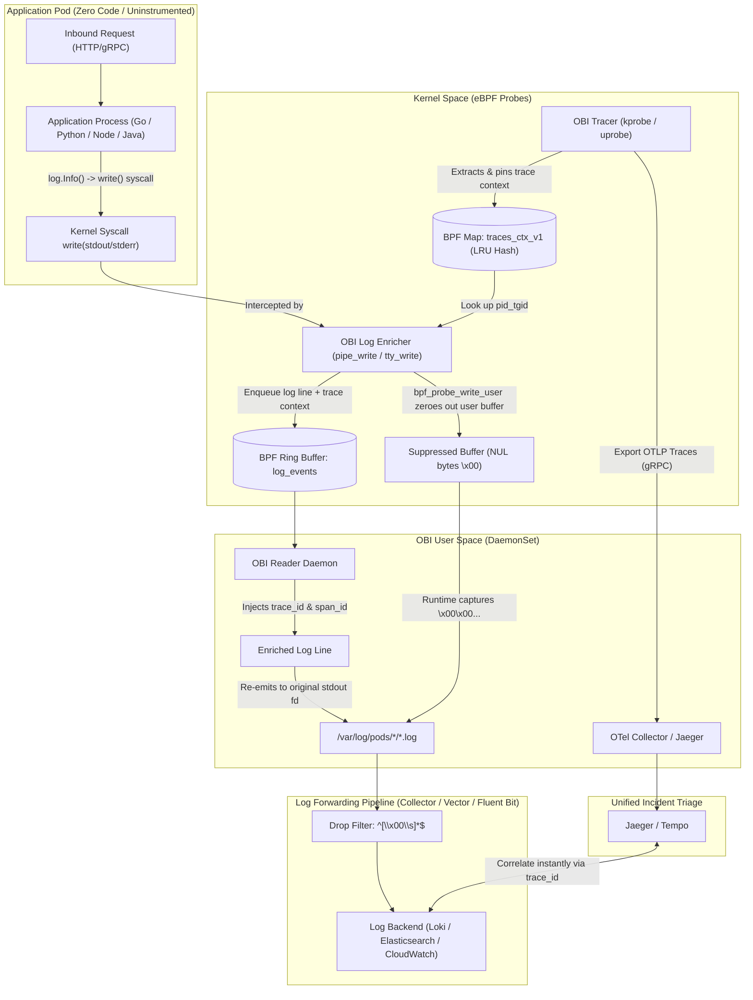

# OpenTelemetry eBPF (OBI) Zero-Code Trace-Log Correlation

[](https://github.com/nubenetes/obi-trace-log-correlation/actions)
[](LICENSE)
[](docs/day0-planning-sizing.md)
[](https://github.com/open-telemetry/opentelemetry-ebpf-instrumentation)

Enterprise reference implementation, multi-cloud Kubernetes architectures, and end-to-end lifecycle automation for **Zero-Code Trace-Log Correlation** powered by [OpenTelemetry eBPF Instrumentation (OBI)](https://opentelemetry.io/blog/2026/obi-trace-log-correlation/).

---

## Executive Overview

When an incident occurs in production, operators often get paged with a failing trace, knowing the answers lie within application logs. If the service never adopted structured logging with trace context, the traditional response is grepping through timestamps and praying.

**OpenTelemetry eBPF Instrumentation (OBI)** bridges this gap at the Linux kernel level:
- **Zero Code Changes**: No OpenTelemetry SDKs, no logging framework modifications, no rebuilds or redeployments.
- **Bi-Directional Correlation**: Automatically injects matching `trace_id` and `span_id` directly into `stdout` and `stderr` writes.
- **Polyglot & Multi-Format**: Enriches structured **JSON** logs as native attributes and formats **Plain-Text** logs with key-value annotations (`trace_id=... span_id=...`).
- **Distributed Context Propagation**: Transparently propagates trace contexts across network hops (HTTP/gRPC) across disparate services.

---

## Architecture



---

## Supported Use Cases

1. **Zero-Code Microservices Correlation**: Complete end-to-end tracing and log linking across microservices written in Go, Python, Node.js, and Java without touching source code.
2. **Legacy & Third-Party Binaries**: Instrument legacy applications where source code is unavailable, lost, or frozen.
3. **Polyglot Log Harmonization**: Correlate mixed formats—injecting JSON keys into structured logs while decorating unstructured text lines with `trace_id=... span_id=...`.
4. **Hybrid OTel SDK Coexistence**: When services already use an OTel SDK for traces but lack log correlation, OBI automatically injects `trace_id` while suppressing conflicting `span_id` fields.
5. **Incident Debugging Acceleration**: Jump directly from a failing trace span in Jaeger/Tempo to exact log lines in Grafana Loki, OpenSearch, or CloudWatch.

---

## Repository Structure

```text
obi-trace-log-correlation/
├── demo-apps/                 # Polyglot uninstrumented application workloads
│   ├── go/frontend/           # Uninstrumented Go HTTP service (log/slog JSON)
│   ├── go/backend/            # Uninstrumented Go HTTP service (log/slog JSON)
│   ├── python/                # Python unbuffered service (PYTHONUNBUFFERED=1)
│   ├── nodejs/                # Node.js service with Pino JSON logging
│   └── plaintext/             # Legacy plain-text service showing key=value annotations
├── docker-compose/            # Self-contained local Linux evaluation stack
│   ├── compose.yaml           # Frontend, Backend, Jaeger, and OBI DaemonSet
│   └── obi-config.yml         # OBI Config v2 with correlation.log_trace_annotation
├── k8s/                       # Production Kubernetes configurations
│   ├── base/                  # Kustomize base (DaemonSet, RBAC, ConfigMap, Collector)
│   └── overlays/              # Enterprise distribution overlays
│       ├── openshift-4.20/    # OpenShift 4.20+ with custom SCC & Vector filter
│       ├── aks/               # Azure Kubernetes Service (Azure Linux/Ubuntu)
│       ├── eks/               # AWS Elastic Kubernetes Service (AL2023/Bottlerocket)
│       ├── gke/               # Google Kubernetes Engine (Standard COS/Ubuntu)
│       └── rke/               # Rancher RKE2 / K3s hardened profiles
├── log-pipelines/             # Filter configurations to drop suppressed NUL placeholders
│   ├── otel-collector-filelog.yaml
│   ├── fluent-bit-filter.conf
│   ├── vector-filter.toml
│   └── promtail-filter.yaml
├── scripts/                   # Production lifecycle automation scripts
│   ├── day0-kernel-audit.sh       # Preflight kernel, BPF, and lockdown audit
│   ├── day1-deploy.sh             # Multi-cloud automated deployment
│   ├── day1-generate-traffic.sh   # Synthetic HTTP traffic generator
│   ├── day2-verify-correlation.sh # Live verification of log trace IDs
│   ├── day2-canary-rollout.sh     # Canary progressive rollout helper
│   ├── benchmark-overhead.sh      # Latency and throughput overhead benchmark
│   └── decommission.sh            # Safe cleanup and BPF map unpinning
└── docs/                      # Comprehensive technical documentation
    ├── architecture.md            # Kernel hooks, LRU maps, and ringbuffer flow
    ├── day0-planning-sizing.md    # Kernel matrix, hardware sizing, security model
    ├── day1-installation.md       # Multi-platform deployment guides
    ├── day2-operations-triage.md  # Incident triage queries (Loki, Jaeger, ES)
    ├── log-filtering-guide.md     # In-depth explanation of NUL bytes & filters
    ├── runtime-compatibility.md   # Language runtime specifics (Go, Python, Java, .NET)
    ├── troubleshooting.md         # Diagnostic runbook for common pitfalls
    ├── decommission-guide.md      # Clean teardown procedures
    └── references.md              # Catalog of official links and resources
```

---

## Quickstart: Local Evaluation (60 Seconds)

Evaluate OBI trace-log correlation locally on any Linux machine with kernel 6.0+:

```bash
# 1. Run Day 0 Preflight Audit
./scripts/day0-kernel-audit.sh

# 2. Deploy Local Docker Compose Stack
./scripts/day1-deploy.sh --cluster docker-compose

# 3. Generate Sample HTTP Traffic
./scripts/day1-generate-traffic.sh http://localhost:8080/checkout 10

# 4. Verify Correlated Trace IDs
./scripts/day2-verify-correlation.sh
```

### Inspecting Enriched Logs
```bash
docker compose -f docker-compose/compose.yaml logs frontend backend | grep -a trace_id
```

Output:
```json
frontend-1  | {"amount":42.5,"level":"INFO","msg":"payment authorized","order_id":"ord-1049","span_id":"00f067aa0ba902b7","time":"2026-10-06T14:00:00Z","trace_id":"4bf92f3577b34da6a3ce929d0e0e4736"}
backend-1   | {"client_ip":"172.18.0.3:5102","db_query_latency":"23ms","level":"INFO","msg":"handling request in backend","span_id":"278a9c1e55fa4189","time":"2026-10-06T14:00:00Z","trace_id":"4bf92f3577b34da6a3ce929d0e0e4736"}
```
Open **http://localhost:16686** to view the correlated distributed trace in Jaeger.

---

## Production Kubernetes Deployments

Deploy using the provided production Kustomize overlays:

### Red Hat OpenShift 4.20+
OpenShift 4.20+ runs Red Hat Enterprise Linux CoreOS (RHCOS with Linux 6.6+). Deploy with the dedicated `obi-ebpf-scc` and Vector filter:
```bash
./scripts/day1-deploy.sh --cluster openshift
```
*Details*: [OpenShift 4.20+ Guide](k8s/overlays/openshift-4.20/README.md).

### Azure Kubernetes Service (AKS)
Target node pools running Azure Linux (CBL-Mariner) or Ubuntu 24.04:
```bash
./scripts/day1-deploy.sh --cluster aks
```
*Details*: [AKS Deployment Guide](k8s/overlays/aks/README.md).

### AWS Elastic Kubernetes Service (EKS)
Target Amazon Linux 2023 (AL2023 with Linux 6.1+) or Bottlerocket node pools:
```bash
./scripts/day1-deploy.sh --cluster eks
```
*Details*: [EKS Deployment Guide](k8s/overlays/eks/README.md).

### Google Kubernetes Engine (GKE Standard)
Target GKE Standard clusters running Container-Optimized OS (COS) or Ubuntu:
```bash
./scripts/day1-deploy.sh --cluster gke
```
*Details*: [GKE Deployment Guide](k8s/overlays/gke/README.md).

### Rancher RKE2 / K3s
Deploy to hardened enterprise clusters:
```bash
./scripts/day1-deploy.sh --cluster rke
```
*Details*: [RKE2 Deployment Guide](k8s/overlays/rke/README.md).

---

## The Suppressed NUL Byte Filter Requirement

When OBI enriches a log line, it suppresses the original un-enriched write by overwriting the user-space buffer with zeroes (`\0` / NUL bytes) via `bpf_probe_write_user`.

To prevent ingestion of blank placeholder lines, add this drop filter to your log shipper:

| Log Forwarder | Configuration Snippet | Reference File |
|---|---|---|
| **OTel Collector** | `expr: 'body matches "^[\\x00\\s]*$"'` | [`log-pipelines/otel-collector-filelog.yaml`](log-pipelines/otel-collector-filelog.yaml) |
| **Vector** | `condition = '!match(string!(.message), r"^[\x00\s]*$")'` | [`log-pipelines/vector-filter.toml`](log-pipelines/vector-filter.toml) |
| **Fluent Bit** | `Exclude log ^[\x00\s]*$` | [`log-pipelines/fluent-bit-filter.conf`](log-pipelines/fluent-bit-filter.conf) |
| **Promtail / Alloy** | `expression: "^[\\x00\\s]*$"` | [`log-pipelines/promtail-filter.yaml`](log-pipelines/promtail-filter.yaml) |

*Full Technical Breakdown*: [Log Shipper Filtering Guide](docs/log-filtering-guide.md).

---

## Lifecycle Operations Summary

- **Day 0: Planning & Audit**
  - Run [`scripts/day0-kernel-audit.sh`](scripts/day0-kernel-audit.sh) to verify kernel >= 6.0, BPF filesystem `/sys/fs/bpf`, and lockdown status.
  - Review hardware sizing in [`docs/day0-planning-sizing.md`](docs/day0-planning-sizing.md).
- **Day 1: Deployment & Validation**
  - Execute [`scripts/day1-deploy.sh`](scripts/day1-deploy.sh) for your target platform.
  - Generate load with [`scripts/day1-generate-traffic.sh`](scripts/day1-generate-traffic.sh).
- **Day 2: Operations & Triage**
  - Perform canary service rollouts with [`scripts/day2-canary-rollout.sh`](scripts/day2-canary-rollout.sh).
  - Triage incidents with Loki/Jaeger queries in [`docs/day2-operations-triage.md`](docs/day2-operations-triage.md).
  - Benchmark overhead with [`scripts/benchmark-overhead.sh`](scripts/benchmark-overhead.sh).
- **Decommission: Safe Teardown**
  - Cleanly detach probes and unpin kernel maps with [`scripts/decommission.sh`](scripts/decommission.sh).
  - Read [Decommission Guide](docs/decommission-guide.md).

---

## References & Official Links

- **OpenTelemetry Announcement**: [Zero-code trace-log correlation with OBI](https://opentelemetry.io/blog/2026/obi-trace-log-correlation/)
- **Official Documentation**: [OpenTelemetry OBI Trace-Log Correlation](https://opentelemetry.io/docs/zero-code/obi/trace-log-correlation/)
- **Core Repository**: [open-telemetry/opentelemetry-ebpf-instrumentation](https://github.com/open-telemetry/opentelemetry-ebpf-instrumentation)
- **Kernel Internals & Dev Docs**: [devdocs/trace-log-correlation.md](https://github.com/open-telemetry/opentelemetry-ebpf-instrumentation/blob/main/devdocs/trace-log-correlation.md)
- **Demo Gist**: [mmat11/f3f23707e7bc9c94bce144f56276251d](https://gist.github.com/mmat11/f3f23707e7bc9c94bce144f56276251d)
- **CNCF Slack Community**: [#otel-ebpf-instrumentation](https://cloud-native.slack.com/archives/C06DQ7S2YEP)

---

## License

Licensed under the [Apache License, Version 2.0](LICENSE).
