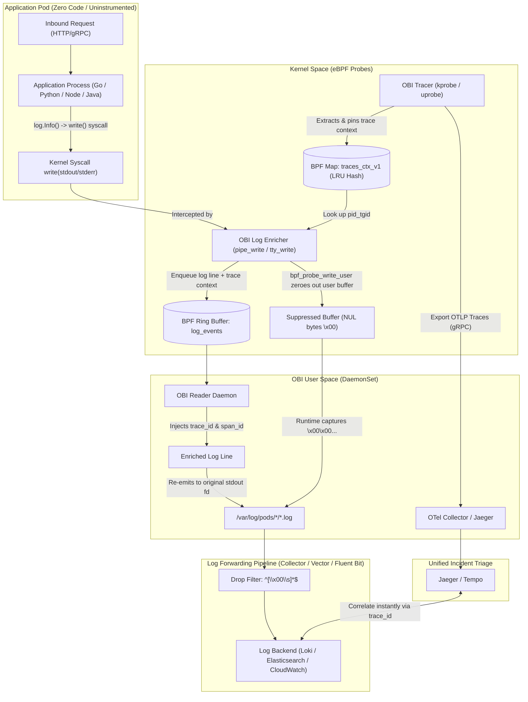

# OpenTelemetry eBPF (OBI) Zero-Code Trace-Log Correlation

[](https://github.com/nubenetes/obi-trace-log-correlation/releases)
[](https://github.com/nubenetes/obi-trace-log-correlation/actions)
[](LICENSE)
[](docs/day0-planning-sizing.md)
[](docs/architecture.md)
[](https://www.w3.org/TR/trace-context/)

<!-- Kubernetes Distribution Badges -->
[-EE0000.svg?logo=redhatopenshift&logoColor=white)](k8s/overlays/openshift-4.20/README.md)
[](k8s/overlays/aks/README.md)
[](k8s/overlays/eks/README.md)
[](k8s/overlays/gke/README.md)
[](k8s/overlays/rke/README.md)
[](docker-compose/README.md)

<!-- Observability & Log Shipper Badges -->
[](https://github.com/open-telemetry/opentelemetry-ebpf-instrumentation)
[](k8s/base/otel-collector.yaml)
[](docker-compose/compose.yaml)
[](log-pipelines/vector-filter.toml)
[](log-pipelines/fluent-bit-filter.conf)
[](log-pipelines/promtail-filter.yaml)

<!-- Runtimes & Operations -->
[-00ADD8.svg?logo=go&logoColor=white)](demo-apps/go/)
[-3776AB.svg?logo=python&logoColor=white)](demo-apps/python/)
[-5FA04E.svg?logo=nodedotjs&logoColor=white)](demo-apps/nodejs/)
[](scripts/)

Enterprise reference implementation, multi-cloud Kubernetes architectures, and end-to-end lifecycle automation for **Zero-Code Trace-Log Correlation** powered by [OpenTelemetry eBPF Instrumentation (OBI)](https://opentelemetry.io/blog/2026/obi-trace-log-correlation/).

---

## Executive Overview

When an incident occurs in production, operators often get paged with a failing trace, knowing the answers lie within application logs. If the service never adopted structured logging with trace context, the traditional response is grepping through timestamps and praying.

**OpenTelemetry eBPF Instrumentation (OBI)** bridges this gap at the Linux kernel level:
- **Zero Code Changes**: No OpenTelemetry SDKs, no logging framework modifications, no rebuilds or redeployments.
- **Bi-Directional Correlation**: Automatically injects matching `trace_id` and `span_id` directly into `stdout` and `stderr` writes.
- **Polyglot & Multi-Format**: Enriches structured **JSON** logs as native attributes and formats **Plain-Text** logs with key-value annotations (`trace_id=... span_id=...`).
- **Distributed Context Propagation**: Transparently propagates trace contexts across network hops (HTTP/gRPC) across disparate services.

---

---

## 🤖 AI-Generated Multimedia & Video Series (NotebookLM & YouTube)

This repository includes a comprehensive multi-format educational series synthesized with **Gemini NotebookLM** based directly on this repository's architectural analyses, manifests, eBPF kernel mechanics, and the official [OpenTelemetry Announcement](https://opentelemetry.io/blog/2026/obi-trace-log-correlation/). All videos and shorts are published and freely accessible on YouTube on the [**@nubenetes**](https://youtube.com/@nubenetes) channel.

> [!NOTE]
> **Multilingual Learning Experience**:
> Content features native spoken audio in **English 🇺🇸**, and includes automated YouTube subtitles / closed captions (CC) translated into **20+ languages** (Spanish, French, German, Japanese, Portuguese, Italian, Arabic, Hindi, etc.) for global knowledge sharing.

### 🎬 Full-Length Technical Deep Dives (Videos)

| # | Format | Video Title | Category / Domain | Origin Language | Duration | Direct YouTube Link |
|---|:---:|---|---|:---:|:---:|---|
| 1 | 📽️ Video Guide | [**How OBI Correlation Works: Zero-Code Trace-Log Correlation with eBPF**](https://www.youtube.com/watch?v=f_tQfyjhgow) | Kernel Interception & Buffer Manipulation | 🇺🇸 English *(CC 20+)* | `7:55` | [▶️ Watch Video](https://www.youtube.com/watch?v=f_tQfyjhgow) |
| 2 | 📽️ Video Guide | [**Zero-Code Trace-Log Correlation: OpenTelemetry eBPF (OBI) Deep Dive**](https://www.youtube.com/watch?v=FVguXIDZwys) | Incident Response & Bidirectional Triage | 🇺🇸 English *(CC 20+)* | `8:18` | [▶️ Watch Video](https://www.youtube.com/watch?v=FVguXIDZwys) |
| 3 | 📽️ Video Guide | [**How to Inject Trace IDs into Logs Without Code Changes Using OBI eBPF**](https://www.youtube.com/watch?v=lNjPSBTPn0M) | Runtime Injection & Log Shipping Pipelines | 🇺🇸 English *(CC 20+)* | `6:34` | [▶️ Watch Video](https://www.youtube.com/watch?v=lNjPSBTPn0M) |
| 4 | 📽️ Video Guide | [**Tuning Log Shipper Pipelines for OBI eBPF: Null-Byte Filters & 8KB Log Splits**](https://www.youtube.com/watch?v=JbxR7WFacT8) | Downstream Log Pipelines & Buffer Chunking | 🇺🇸 English *(CC 20+)* | `6:16` | [▶️ Watch Video](https://www.youtube.com/watch?v=JbxR7WFacT8) |
| 5 | 📽️ Video Guide | [**Under the Hood of OBI eBPF: write vs writev Syscalls, Kernel Security & Limits**](https://www.youtube.com/watch?v=WzYDb8pX9Ao) | Syscall Interception & Linux Security | 🇺🇸 English *(CC 20+)* | `8:28` | [▶️ Watch Video](https://www.youtube.com/watch?v=WzYDb8pX9Ao) |
| 6 | 📽️ Video Guide | [**Zero-Code Trace-Log Correlation with eBPF: Production Architecture & Triage Guide**](https://www.youtube.com/watch?v=Vlo8nNAG-pw) | Production Architecture & SRE Triage | 🇺🇸 English *(CC 20+)* | `7:11` | [▶️ Watch Video](https://www.youtube.com/watch?v=Vlo8nNAG-pw) |

### ⚡ Topic-Focused Technical Shorts

| # | Short Title | Category | Origin Language | Duration | Direct YouTube Link |
|---|---|---|:---:|:---:|---|
| 1 | [**Zero-Code Trace-Log Correlation Explained: OpenTelemetry OBI eBPF**](https://www.youtube.com/shorts/Q4JZFSRVx4g) | Context Propagation & Stamping | 🇺🇸 English *(CC 20+)* | `1:06` | [▶️ Watch Short](https://www.youtube.com/shorts/Q4JZFSRVx4g) |
| 2 | [**How OBI Correlates Logs Without Code: OpenTelemetry eBPF In-Flight**](https://www.youtube.com/shorts/959UEHenqWI) | In-Flight Syscall Interception | 🇺🇸 English *(CC 20+)* | `1:10` | [▶️ Watch Short](https://www.youtube.com/shorts/959UEHenqWI) |
| 3 | [**How eBPF Automates Trace-Log Correlation in Go Without SDKs**](https://www.youtube.com/shorts/MHoXH29BrBE) | Go Runtime & JSON Enrichment | 🇺🇸 English *(CC 20+)* | `1:28` | [▶️ Watch Short](https://www.youtube.com/shorts/MHoXH29BrBE) |
| 4 | [**How eBPF Injects Trace IDs into Logs Without SDKs or Code Changes**](https://www.youtube.com/shorts/asTJjcmQjbs) | Buffer Substitution Mechanics | 🇺🇸 English *(CC 20+)* | `1:21` | [▶️ Watch Short](https://www.youtube.com/shorts/asTJjcmQjbs) |
| 5 | [**How eBPF Instruments Code Silently: OpenTelemetry OBI Zero-Code**](https://www.youtube.com/shorts/-3xdSEGKpps) | Non-Intrusive Kernel Observation | 🇺🇸 English *(CC 20+)* | `1:13` | [▶️ Watch Short](https://www.youtube.com/shorts/-3xdSEGKpps) |
| 6 | [**How OBI Injects Trace IDs Without Code: In-Flight eBPF Kernel Interception**](https://www.youtube.com/shorts/y6SQ_a_xNGY) | Kernel Interception & Zero-Rebuild Stamping | 🇺🇸 English *(CC 20+)* | `1:05` | [▶️ Watch Short](https://www.youtube.com/shorts/y6SQ_a_xNGY) |
| 7 | [**Tuning Log Pipelines for OBI: Filtering Null Bytes and 8KB Multi-Line Splits**](https://www.youtube.com/shorts/gSeqie44HqE) | Log Shipper Tuning & 8KB Reassembly | 🇺🇸 English *(CC 20+)* | `1:24` | [▶️ Watch Short](https://www.youtube.com/shorts/gSeqie44HqE) |
| 8 | [**Why eBPF Trace-Log Correlation Loses Context: Async Buffers and Runtime Caveats**](https://www.youtube.com/shorts/b9oNWMJlUcc) | Runtime Buffering & Async Disconnect Fixes | 🇺🇸 English *(CC 20+)* | `1:24` | [▶️ Watch Short](https://www.youtube.com/shorts/b9oNWMJlUcc) |

*For complete descriptions, technical breakdowns, and YouTube Studio links, see [Video Walkthroughs & Architecture References](#video-walkthroughs--architecture-references-youtube).*

## Architecture



---

## Supported Use Cases

1. **Zero-Code Microservices Correlation**: Complete end-to-end tracing and log linking across microservices written in Go, Python, Node.js, and Java without touching source code.
2. **Legacy & Third-Party Binaries**: Instrument legacy applications where source code is unavailable, lost, or frozen.
3. **Polyglot Log Harmonization**: Correlate mixed formats—injecting JSON keys into structured logs while decorating unstructured text lines with `trace_id=... span_id=...`.
4. **Hybrid OTel SDK Coexistence**: When services already use an OTel SDK for traces but lack log correlation, OBI automatically injects `trace_id` while suppressing conflicting `span_id` fields.
5. **Incident Debugging Acceleration**: Jump directly from a failing trace span in Jaeger/Tempo to exact log lines in Grafana Loki, OpenSearch, or CloudWatch.

---

## Repository Structure

```text
obi-trace-log-correlation/
├── demo-apps/                 # Polyglot uninstrumented application workloads
│   ├── go/frontend/           # Uninstrumented Go HTTP service (log/slog JSON)
│   ├── go/backend/            # Uninstrumented Go HTTP service (log/slog JSON)
│   ├── python/                # Python unbuffered service (PYTHONUNBUFFERED=1)
│   ├── nodejs/                # Node.js service with Pino JSON logging
│   └── plaintext/             # Legacy plain-text service showing key=value annotations
├── docker-compose/            # Self-contained local Linux evaluation stack
│   ├── compose.yaml           # Frontend, Backend, Jaeger, and OBI DaemonSet
│   └── obi-config.yml         # OBI Config v2 with correlation.log_trace_annotation
├── k8s/                       # Production Kubernetes configurations
│   ├── base/                  # Kustomize base (DaemonSet, RBAC, ConfigMap, Collector)
│   └── overlays/              # Enterprise distribution overlays
│       ├── openshift-4.20/    # OpenShift 4.20+ with custom SCC & Vector filter
│       ├── aks/               # Azure Kubernetes Service (Azure Linux/Ubuntu)
│       ├── eks/               # AWS Elastic Kubernetes Service (AL2023/Bottlerocket)
│       ├── gke/               # Google Kubernetes Engine (Standard COS/Ubuntu)
│       └── rke/               # Rancher RKE2 / K3s hardened profiles
├── log-pipelines/             # Filter configurations to drop suppressed NUL placeholders
│   ├── otel-collector-filelog.yaml
│   ├── fluent-bit-filter.conf
│   ├── vector-filter.toml
│   └── promtail-filter.yaml
├── scripts/                   # Production lifecycle automation scripts
│   ├── day0-kernel-audit.sh       # Preflight kernel, BPF, and lockdown audit
│   ├── day1-deploy.sh             # Multi-cloud automated deployment
│   ├── day1-generate-traffic.sh   # Synthetic HTTP traffic generator
│   ├── day2-verify-correlation.sh # Live verification of log trace IDs
│   ├── day2-canary-rollout.sh     # Canary progressive rollout helper
│   ├── benchmark-overhead.sh      # Latency and throughput overhead benchmark
│   └── decommission.sh            # Safe cleanup and BPF map unpinning
└── docs/                      # Comprehensive technical documentation
    ├── architecture.md            # Kernel hooks, LRU maps, and ringbuffer flow
    ├── day0-planning-sizing.md    # Kernel matrix, hardware sizing, security model
    ├── day1-installation.md       # Multi-platform deployment guides
    ├── day2-operations-triage.md  # Incident triage queries (Loki, Jaeger, ES)
    ├── log-filtering-guide.md     # In-depth explanation of NUL bytes & filters
    ├── runtime-compatibility.md   # Language runtime specifics (Go, Python, Java, .NET)
    ├── troubleshooting.md         # Diagnostic runbook for common pitfalls
    ├── decommission-guide.md      # Clean teardown procedures
    └── references.md              # Catalog of official links and resources
```

---

## Quickstart: Local Evaluation (60 Seconds)

Evaluate OBI trace-log correlation locally on any Linux machine with kernel 6.0+:

```bash
# 1. Run Day 0 Preflight Audit
./scripts/day0-kernel-audit.sh

# 2. Deploy Local Docker Compose Stack
./scripts/day1-deploy.sh --cluster docker-compose

# 3. Generate Sample HTTP Traffic
./scripts/day1-generate-traffic.sh http://localhost:8080/checkout 10

# 4. Verify Correlated Trace IDs
./scripts/day2-verify-correlation.sh
```

### Inspecting Enriched Logs
```bash
docker compose -f docker-compose/compose.yaml logs frontend backend | grep -a trace_id
```

Output:
```json
frontend-1  | {"amount":42.5,"level":"INFO","msg":"payment authorized","order_id":"ord-1049","span_id":"00f067aa0ba902b7","time":"2026-10-06T14:00:00Z","trace_id":"4bf92f3577b34da6a3ce929d0e0e4736"}
backend-1   | {"client_ip":"172.18.0.3:5102","db_query_latency":"23ms","level":"INFO","msg":"handling request in backend","span_id":"278a9c1e55fa4189","time":"2026-10-06T14:00:00Z","trace_id":"4bf92f3577b34da6a3ce929d0e0e4736"}
```
Open **http://localhost:16686** to view the correlated distributed trace in Jaeger.

---

## Production Kubernetes Deployments

Deploy using the provided production Kustomize overlays:

### Red Hat OpenShift 4.20+
OpenShift 4.20+ runs Red Hat Enterprise Linux CoreOS (RHCOS with Linux 6.6+). Deploy with the dedicated `obi-ebpf-scc` and Vector filter:
```bash
./scripts/day1-deploy.sh --cluster openshift
```
*Details*: [OpenShift 4.20+ Guide](k8s/overlays/openshift-4.20/README.md).

### Azure Kubernetes Service (AKS)
Target node pools running Azure Linux (CBL-Mariner) or Ubuntu 24.04:
```bash
./scripts/day1-deploy.sh --cluster aks
```
*Details*: [AKS Deployment Guide](k8s/overlays/aks/README.md).

### AWS Elastic Kubernetes Service (EKS)
Target Amazon Linux 2023 (AL2023 with Linux 6.1+) or Bottlerocket node pools:
```bash
./scripts/day1-deploy.sh --cluster eks
```
*Details*: [EKS Deployment Guide](k8s/overlays/eks/README.md).

### Google Kubernetes Engine (GKE Standard)
Target GKE Standard clusters running Container-Optimized OS (COS) or Ubuntu:
```bash
./scripts/day1-deploy.sh --cluster gke
```
*Details*: [GKE Deployment Guide](k8s/overlays/gke/README.md).

### Rancher RKE2 / K3s
Deploy to hardened enterprise clusters:
```bash
./scripts/day1-deploy.sh --cluster rke
```
*Details*: [RKE2 Deployment Guide](k8s/overlays/rke/README.md).

---

## The Suppressed NUL Byte Filter Requirement

When OBI enriches a log line, it suppresses the original un-enriched write by overwriting the user-space buffer with zeroes (`\0` / NUL bytes) via `bpf_probe_write_user`.

To prevent ingestion of blank placeholder lines, add this drop filter to your log shipper:

| Log Forwarder | Configuration Snippet | Reference File |
|---|---|---|
| **OTel Collector** | `expr: 'body matches "^[\\x00\\s]*$"'` | [`log-pipelines/otel-collector-filelog.yaml`](log-pipelines/otel-collector-filelog.yaml) |
| **Vector** | `condition = '!match(string!(.message), r"^[\x00\s]*$")'` | [`log-pipelines/vector-filter.toml`](log-pipelines/vector-filter.toml) |
| **Fluent Bit** | `Exclude log ^[\x00\s]*$` | [`log-pipelines/fluent-bit-filter.conf`](log-pipelines/fluent-bit-filter.conf) |
| **Promtail / Alloy** | `expression: "^[\\x00\\s]*$"` | [`log-pipelines/promtail-filter.yaml`](log-pipelines/promtail-filter.yaml) |

*Full Technical Breakdown*: [Log Shipper Filtering Guide](docs/log-filtering-guide.md).

---

## Lifecycle Operations Summary

- **Day 0: Planning & Audit**
  - Run [`scripts/day0-kernel-audit.sh`](scripts/day0-kernel-audit.sh) to verify kernel >= 6.0, BPF filesystem `/sys/fs/bpf`, and lockdown status.
  - Review hardware sizing in [`docs/day0-planning-sizing.md`](docs/day0-planning-sizing.md).
- **Day 1: Deployment & Validation**
  - Execute [`scripts/day1-deploy.sh`](scripts/day1-deploy.sh) for your target platform.
  - Generate load with [`scripts/day1-generate-traffic.sh`](scripts/day1-generate-traffic.sh).
- **Day 2: Operations & Triage**
  - Perform canary service rollouts with [`scripts/day2-canary-rollout.sh`](scripts/day2-canary-rollout.sh).
  - Triage incidents with Loki/Jaeger queries in [`docs/day2-operations-triage.md`](docs/day2-operations-triage.md).
  - Benchmark overhead with [`scripts/benchmark-overhead.sh`](scripts/benchmark-overhead.sh).
- **Decommission: Safe Teardown**
  - Cleanly detach probes and unpin kernel maps with [`scripts/decommission.sh`](scripts/decommission.sh).
  - Read [Decommission Guide](docs/decommission-guide.md).

---

---

## Video Walkthroughs & Architecture References (YouTube)

End-to-end architectural walkthroughs and technical shorts for `obi-trace-log-correlation` are hosted on the **[Nubenetes YouTube Channel (@nubenetes)](https://www.youtube.com/@nubenetes)**.

Below are the direct links and full descriptions for each session.

### 🇬🇧 Full-Length Technical Deep Dives (6 Videos)

<details open>
<summary>📂 <strong>Detailed Breakdown: Full-Length Sessions</strong></summary>

<br/>

#### 1. How OBI Correlation Works: Zero-Code Trace-Log Correlation with eBPF
- 🔗 **Direct Link**: [https://www.youtube.com/watch?v=f_tQfyjhgow](https://www.youtube.com/watch?v=f_tQfyjhgow)
- 🛠️ **YouTube Studio**: [https://studio.youtube.com/video/f_tQfyjhgow/edit](https://studio.youtube.com/video/f_tQfyjhgow/edit)
- ⏱️ **Duration**: 7:55
- 🏷️ **Domain**: Kernel Interception, Syscall Hooks & NUL Byte Suppression
- 📝 **Full Description**:
> 🔍 How OBI Correlation Works: Zero-Code Trace-Log Correlation with OpenTelemetry eBPF
>
> An architectural masterclass and deep dive into zero-code trace-log correlation using OpenTelemetry eBPF Instrumentation (OBI). Discover how site reliability engineers and platform teams correlate application logs with distributed traces without adding SDKs, rebuilding code, or altering container images.
>
> 📌 Core Architectural Concepts & Technical Roadmap:
> • The 3:00 AM Pager Dilemma: Why grepping logs by timestamp during an incident fails in distributed microservices.
> • Operating System Kernel Interception: How OBI hooks write() and writev() system calls in Linux kernel space using eBPF probes.
> • Real-Time Context Extraction: Tracking the active thread processing each request and extracting current trace_id and span_id in-flight.
> • The Suppressed NUL Byte Mechanism: How bpf_probe_write_user zeroes out un-enriched user buffers and re-emits enriched logs to stdout.
> • Log Pipeline Filter Configuration: Implementing drop filters in OpenTelemetry Collector, Vector, Fluent Bit, and Promtail to discard NUL placeholders.
> • Buffer Sizing & Edge Cases: Understanding the 8 KiB buffer split boundary and kernel requirements (Linux 6.0+ and CAP_SYS_ADMIN).
>
> 🔗 Official Blueprint Repository & Reference Documentation:
> • GitHub Blueprint Repository: https://github.com/nubenetes/obi-trace-log-correlation
> • OpenTelemetry Official Announcement: https://opentelemetry.io/blog/2026/obi-trace-log-correlation/
> • Production Manifests & Scripts: https://github.com/nubenetes/obi-trace-log-correlation/tree/main/k8s
>
> ⏱️ Duration: 7:55
> #OpenTelemetry #eBPF #Observability #Kubernetes #DistributedTracing #SRE #DevOps #CloudNative #Jaeger #Grafana

#### 2. Zero-Code Trace-Log Correlation: OpenTelemetry eBPF (OBI) Deep Dive
- 🔗 **Direct Link**: [https://www.youtube.com/watch?v=FVguXIDZwys](https://www.youtube.com/watch?v=FVguXIDZwys)
- 🛠️ **YouTube Studio**: [https://studio.youtube.com/video/FVguXIDZwys/edit](https://studio.youtube.com/video/FVguXIDZwys/edit)
- ⏱️ **Duration**: 8:18
- 🏷️ **Domain**: Incident Triage, Bidirectional Correlation & Runtime Semantics
- 📝 **Full Description**:
> ⚡ Zero-Code Trace-Log Correlation: Solving Incident Triage with OpenTelemetry eBPF (OBI)
>
> When production microservices fail, finding the exact log lines belonging to a distributed trace is critical. Learn how OpenTelemetry eBPF Instrumentation (OBI) brings seamless bidirectional correlation between traces and logs with zero application modifications.
>
> 📌 Key Incident Response & Architecture Topics:
> • Ending Timestamp Guesswork: Eliminating the painful SRE ritual of cross-referencing timestamps across multiple microservice logs.
> • Bidirectional Navigation: Jumping seamlessly from a failing span in Jaeger/Tempo to exact log lines in Grafana Loki/OpenSearch, and vice versa.
> • Format Harmonization: Automatic injection of trace_id and span_id into structured JSON payloads and key=value suffixes onto plain-text lines.
> • Synchronous vs Asynchronous Logging: Comparing Go, Java, and Python synchronous loggers with Node.js async stdout pipe behavior.
> • Production Rollout & Safety: Configuring OBI v2 log_trace_annotation rules, canary service selection, and safe rollback mechanisms.
>
> 🔗 Official Blueprint Repository & Reference Documentation:
> • GitHub Blueprint Repository: https://github.com/nubenetes/obi-trace-log-correlation
> • OpenTelemetry Official Announcement: https://opentelemetry.io/blog/2026/obi-trace-log-correlation/
> • Local Docker Compose Demo: https://github.com/nubenetes/obi-trace-log-correlation/tree/main/docker-compose
>
> ⏱️ Duration: 8:18
> #OpenTelemetry #eBPF #Logging #DistributedTracing #SRE #DevOps #Observability #Kubernetes #Jaeger #Loki

#### 3. How to Inject Trace IDs into Logs Without Code Changes Using OBI eBPF
- 🔗 **Direct Link**: [https://www.youtube.com/watch?v=lNjPSBTPn0M](https://www.youtube.com/watch?v=lNjPSBTPn0M)
- 🛠️ **YouTube Studio**: [https://studio.youtube.com/video/lNjPSBTPn0M/edit](https://studio.youtube.com/video/lNjPSBTPn0M/edit)
- ⏱️ **Duration**: 6:34
- 🏷️ **Domain**: Runtime Injection, DaemonSet Delivery & Log Pipeline Filtering
- 📝 **Full Description**:
> 🚀 How to Inject Trace IDs into Logs Without Code Changes Using OBI eBPF
>
> A comprehensive engineering guide on injecting trace context into application logs at runtime without touching source code, configuring logging frameworks, or redeploying services.
>
> 📌 Engineering Highlights & Practical Walkthrough:
> • Zero-Touch Telemetry: Linking uninstrumented Go and Java microservices directly to distributed traces.
> • Linux Kernel Inspection: How eBPF DaemonSets monitor container processes from the host OS without container intrusion.
> • In-Flight Enrichment: Stamping trace_id and span_id into stdout/stderr streams before the container engine writes to disk.
> • Log Forwarder Interoperability: Filtering suppressed NUL placeholders in Vector, Fluent Bit, and OpenTelemetry Collector.
> • Verification & Troubleshooting: Using scripts to generate synthetic traffic and validate enriched logs in Grafana and Jaeger.
>
> 🔗 Official Blueprint Repository & Reference Documentation:
> • GitHub Blueprint Repository: https://github.com/nubenetes/obi-trace-log-correlation
> • OpenTelemetry Official Announcement: https://opentelemetry.io/blog/2026/obi-trace-log-correlation/
> • Verification Runbooks: https://github.com/nubenetes/obi-trace-log-correlation/blob/main/docs/day2-operations-triage.md
>
> ⏱️ Duration: 6:34
> #OpenTelemetry #eBPF #Kubernetes #Observability #SRE #DevOps #Microservices #Logging #CloudNative #Docker

#### 4. Tuning Log Shipper Pipelines for OBI eBPF: Null-Byte Filters & 8KB Log Splits
- 🔗 **Direct Link**: [https://www.youtube.com/watch?v=JbxR7WFacT8](https://www.youtube.com/watch?v=JbxR7WFacT8)
- 🛠️ **YouTube Studio**: [https://studio.youtube.com/video/JbxR7WFacT8/edit](https://studio.youtube.com/video/JbxR7WFacT8/edit)
- ⏱️ **Duration**: 6:16
- 🏷️ **Domain**: Downstream Log Shipper Pipelines, NUL-Byte Filters & 8KB Chunking
- 📝 **Full Description**:
> 🔧 Tuning Log Shipper Pipelines for OBI eBPF: Null-Byte Filters and 8KB Log Splits
>
> A hands-on engineering guide to configuring downstream log shipping pipelines (Fluent Bit, Vector, OpenTelemetry Collector) for zero-code trace-log correlation powered by OpenTelemetry eBPF Instrumentation (OBI).
>
> 📌 Deep Dive Architecture & Pipeline Engineering:
> • The Trace-Log Disconnect: Why 3:00 AM incident triage stalls when microservice logs lack trace context and engineers are forced to grep by timestamps.
> • Operating System Kernel Interception: How OBI intercepts write system calls at the Linux kernel boundary without altering application code or Docker containers.
> • Configuring OBI v2 Rules: Enabling correlation.log_trace_annotation and setting up seamless context stamping across container streams.
> • Downstream Log Shipper Filtering: Why OBI zeroes out original un-enriched buffers with NUL bytes (\x00) and how to configure drop filters in Fluent Bit, Vector, and OTel Collector.
> • Handling Large Log Splits: Managing payloads exceeding the 8 KiB kernel buffer boundary with multi-line reassembly rules in your collector.
> • Safe Incremental Production Rollout: Best practices for canary service deployments, validating stdout and stderr streams, and verifying trace_id injection.
>
> 🔗 Official Blueprint Repository & Reference Documentation:
> • GitHub Blueprint Repository: https://github.com/nubenetes/obi-trace-log-correlation
> • OpenTelemetry Official Announcement: https://opentelemetry.io/blog/2026/obi-trace-log-correlation/
> • Log Pipeline Filter Configurations: https://github.com/nubenetes/obi-trace-log-correlation/tree/main/log-pipelines
>
> ⏱️ Duration: 6:16
> #OpenTelemetry #eBPF #Logging #FluentBit #Vector #Observability #SRE #Kubernetes #DevOps #CloudNative

#### 5. Under the Hood of OBI eBPF: write vs writev Syscalls, Kernel Security & Limits
- 🔗 **Direct Link**: [https://www.youtube.com/watch?v=WzYDb8pX9Ao](https://www.youtube.com/watch?v=WzYDb8pX9Ao)
- 🛠️ **YouTube Studio**: [https://studio.youtube.com/video/WzYDb8pX9Ao/edit](https://studio.youtube.com/video/WzYDb8pX9Ao/edit)
- ⏱️ **Duration**: 8:28
- 🏷️ **Domain**: Kernel Interception, write vs writev Syscalls & Linux Security
- 📝 **Full Description**:
> 🔬 Under the Hood of OBI eBPF: write vs writev Syscalls, Kernel Security and Limits
>
> An advanced systems architecture breakdown uncovering the low-level Linux kernel mechanics behind OpenTelemetry eBPF Instrumentation (OBI) zero-code trace-log correlation.
>
> 📌 Deep Dive Topics Covered:
> • The Missing Trace Context Dilemma: Why traditional application log streams lack distributed tracing metadata and how OBI resolves it at the system layer.
> • Standard Output and Standard Error Pipeline Prerequisites: Tracking container runtime I/O streams and kernel file descriptors.
> • Kernel Privileges and Linux Security: Mandatory prerequisites including Linux 6.0+, BTF (BPF Type Format), CAP_BPF, and CAP_SYS_ADMIN capabilities.
> • Down to the Metal: Syscall Interception: Comparing write() versus writev() vector I/O syscalls, iovec array traversal, and mid-flight payload enrichment.
> • The NUL Byte Suppression Trick: How bpf_probe_write_user suppresses the original buffer while re-emitting correlated logs to stdout.
> • Safe Incremental Production Deployments: Production rollout strategies, 8 KiB buffer split behavior, and eliminating incident triage guesswork.
>
> 🔗 Official Blueprint Repository & Reference Documentation:
> • GitHub Blueprint Repository: https://github.com/nubenetes/obi-trace-log-correlation
> • OpenTelemetry Official Announcement: https://opentelemetry.io/blog/2026/obi-trace-log-correlation/
> • Architecture Internals & Kernel Specs: https://github.com/nubenetes/obi-trace-log-correlation/blob/main/docs/architecture.md
>
> ⏱️ Duration: 8:28
> #OpenTelemetry #eBPF #Linux #Kernel #Observability #Syscalls #Kubernetes #SRE #DevOps #DistributedTracing

#### 6. Zero-Code Trace-Log Correlation with eBPF: Production Architecture & Triage Guide
- 🔗 **Direct Link**: [https://www.youtube.com/watch?v=Vlo8nNAG-pw](https://www.youtube.com/watch?v=Vlo8nNAG-pw)
- 🛠️ **YouTube Studio**: [https://studio.youtube.com/video/Vlo8nNAG-pw/edit](https://studio.youtube.com/video/Vlo8nNAG-pw/edit)
- ⏱️ **Duration**: 7:11
- 🏷️ **Domain**: Production Architecture, SRE Incident Triage & Runtime Limits
- 📝 **Full Description**:
> ⚡ Zero-Code Trace-Log Correlation with eBPF: Production Architecture and Triage Guide
>
> Discover how OpenTelemetry eBPF Instrumentation (OBI) revolutionizes microservice observability by eliminating the midnight debugging nightmare of grepping logs by timestamp.
>
> 📌 Production Roadmap & Architecture Highlights:
> • The Midnight Debugging Problem: Why timestamp cross-referencing during 2:00 AM outages is painful, slow, and imprecise.
> • Zero-Code Correlation Explained: Transparently injecting trace_id and span_id into application log output without modifying source code or rebuilding binaries.
> • How eBPF Makes It Work: Using kernel uprobes, kprobes, and BPF maps to track execution threads and link active trace contexts to stdout streams.
> • Environment Requirements and Limits: Linux kernel prerequisites, synchronous console writer requirements, and runtime buffering considerations.
> • Enabling OBI in Production: Configuring DaemonSets, integrating with OpenTelemetry Collector, and setting up canary rollouts across Kubernetes clusters.
>
> 🔗 Official Blueprint Repository & Reference Documentation:
> • GitHub Blueprint Repository: https://github.com/nubenetes/obi-trace-log-correlation
> • OpenTelemetry Official Announcement: https://opentelemetry.io/blog/2026/obi-trace-log-correlation/
> • Kubernetes Deployment Overlays: https://github.com/nubenetes/obi-trace-log-correlation/tree/main/k8s
>
> ⏱️ Duration: 7:11
> #OpenTelemetry #eBPF #Observability #SRE #DevOps #Microservices #Kubernetes #DistributedTracing #CloudNative #Docker

</details>

<br/>

### ⚡ Topic-Focused Technical Shorts (8 Shorts)

<details>
<summary>📂 <strong>Technical Video Shorts Breakdown (8 Shorts)</strong></summary>

<br/>

#### 1. Zero-Code Trace-Log Correlation Explained: OpenTelemetry OBI eBPF
- 🔗 **Direct Link**: [https://www.youtube.com/shorts/Q4JZFSRVx4g](https://www.youtube.com/shorts/Q4JZFSRVx4g)
- 🛠️ **YouTube Studio**: [https://studio.youtube.com/video/Q4JZFSRVx4g/edit](https://studio.youtube.com/video/Q4JZFSRVx4g/edit)
- ⏱️ **Duration**: 1:06
- 🏷️ **Domain**: Thread Context Tracking & Dynamic Stamping
- 📝 **Full Description**:
> ⚡ Zero-Code Trace-Log Correlation Explained with OpenTelemetry OBI!
>
> Finding the exact log line for a failing distributed trace usually means guessing by timestamps or rewriting application code.
>
> Here is how OpenTelemetry eBPF Instrumentation (OBI) solves it without touching code:
> • Background Tracking: OBI tracks the server thread processing each request and assigns unique trace and span IDs.
> • In-Flight Stamping: Before logs drop into the container runtime, eBPF stamps matching IDs directly into the log payload.
> • Instant Searchability: Search by trace ID in your log backend to land on the exact lines you need.
>
> 🔗 Official Blueprint Repo & Docs:
> https://github.com/nubenetes/obi-trace-log-correlation
> Official Blog: https://opentelemetry.io/blog/2026/obi-trace-log-correlation/
>
> #Shorts #OpenTelemetry #eBPF #Observability #SRE #Kubernetes #DevOps #DistributedTracing #CloudNative

#### 2. How OBI Correlates Logs Without Code: OpenTelemetry eBPF In-Flight
- 🔗 **Direct Link**: [https://www.youtube.com/shorts/959UEHenqWI](https://www.youtube.com/shorts/959UEHenqWI)
- 🛠️ **YouTube Studio**: [https://studio.youtube.com/video/959UEHenqWI/edit](https://studio.youtube.com/video/959UEHenqWI/edit)
- ⏱️ **Duration**: 1:10
- 🏷️ **Domain**: OS Kernel Syscall Interception
- 📝 **Full Description**:
> ⚡ How OBI Correlates Logs Without Code: OpenTelemetry eBPF In-Flight!
>
> Tired of grepping logs by timestamp? Here is how OpenTelemetry eBPF Instrumentation (OBI) links logs to traces automatically:
>
> • The Kernel Trick: OBI watches active threads at the OS kernel layer, tracking ongoing HTTP and gRPC transactions.
> • Intercepting the Write: When a thread issues a write syscall, eBPF pauses it momentarily and injects trace and span IDs.
> • Seamless Output: The enriched log flows into container logs fully tagged, ready for instant root cause triage.
>
> 🔗 Official Blueprint Repo & Docs:
> https://github.com/nubenetes/obi-trace-log-correlation
> Official Blog: https://opentelemetry.io/blog/2026/obi-trace-log-correlation/
>
> #Shorts #OpenTelemetry #eBPF #Logging #Tracing #DevOps #SRE #Observability #Kubernetes

#### 3. How eBPF Automates Trace-Log Correlation in Go Without SDKs
- 🔗 **Direct Link**: [https://www.youtube.com/shorts/MHoXH29BrBE](https://www.youtube.com/shorts/MHoXH29BrBE)
- 🛠️ **YouTube Studio**: [https://studio.youtube.com/video/MHoXH29BrBE/edit](https://studio.youtube.com/video/MHoXH29BrBE/edit)
- ⏱️ **Duration**: 1:28
- 🏷️ **Domain**: Uninstrumented Go Microservices & JSON Injection
- 📝 **Full Description**:
> ⚡ How eBPF Automates Trace-Log Correlation in Go Without SDKs!
>
> Stop configuring logging frameworks across hundreds of microservices!
>
> How OpenTelemetry eBPF Instrumentation (OBI) operates:
> • Outside Application Space: OBI runs entirely below your app in Linux kernel space.
> • Context Injection: When your uninstrumented Go service logs JSON, eBPF injects the trace_id into the payload.
> • Completely Unmodified: The application remains untouched while your observability dashboards get instant correlation.
>
> 🔗 Official Blueprint Repo & Docs:
> https://github.com/nubenetes/obi-trace-log-correlation
> Official Blog: https://opentelemetry.io/blog/2026/obi-trace-log-correlation/
>
> #Shorts #Golang #OpenTelemetry #eBPF #Microservices #SRE #DevOps #Observability #Kubernetes

#### 4. How eBPF Injects Trace IDs into Logs Without SDKs or Code Changes
- 🔗 **Direct Link**: [https://www.youtube.com/shorts/asTJjcmQjbs](https://www.youtube.com/shorts/asTJjcmQjbs)
- 🛠️ **YouTube Studio**: [https://studio.youtube.com/video/asTJjcmQjbs/edit](https://studio.youtube.com/video/asTJjcmQjbs/edit)
- ⏱️ **Duration**: 1:21
- 🏷️ **Domain**: Zero-Code Architecture & Buffer Substitution
- 📝 **Full Description**:
> ⚡ How eBPF Injects Trace IDs into Logs Without SDKs or Code Changes!
>
> Why install heavyweight SDKs in every container just to link logs to traces?
>
> The OBI eBPF Flow:
> • Thread Tracking: Tracks execution threads handling user requests.
> • Buffer Replacement: Replaces raw write buffers with enriched payloads containing trace and span IDs.
> • Zero Changes: Your microservices run unmodified while log forwarders collect perfectly correlated data.
>
> 🔗 Official Blueprint Repo & Docs:
> https://github.com/nubenetes/obi-trace-log-correlation
> Official Blog: https://opentelemetry.io/blog/2026/obi-trace-log-correlation/
>
> #Shorts #eBPF #OpenTelemetry #Kubernetes #Logging #Tracing #DevOps #PlatformEngineering #SRE

#### 5. How eBPF Instruments Code Silently: OpenTelemetry OBI Zero-Code
- 🔗 **Direct Link**: [https://www.youtube.com/shorts/-3xdSEGKpps](https://www.youtube.com/shorts/-3xdSEGKpps)
- 🛠️ **YouTube Studio**: [https://studio.youtube.com/video/-3xdSEGKpps/edit](https://studio.youtube.com/video/-3xdSEGKpps/edit)
- ⏱️ **Duration**: 1:13
- 🏷️ **Domain**: Silent Kernel Observation & Frictionless Telemetry
- 📝 **Full Description**:
> ⚡ How eBPF Instruments Code Silently with OpenTelemetry OBI!
>
> How does eBPF enrich application logs without touching a single line of source code?
>
> Inside the Kernel Mechanism:
> • Secret Observer: eBPF watches the process thread handling each incoming transaction.
> • Instant Enrichment: Stamps trace IDs into JSON and plain-text output right before the container runtime captures it.
> • Effortless Triage: Connects failing traces to exact log lines with zero guesswork.
>
> 🔗 Official Blueprint Repo & Docs:
> https://github.com/nubenetes/obi-trace-log-correlation
> Official Blog: https://opentelemetry.io/blog/2026/obi-trace-log-correlation/
>
> #Shorts #OpenTelemetry #eBPF #ZeroCode #Observability #CloudNative #DevOps #SRE #Kubernetes

#### 6. How OBI Injects Trace IDs Without Code: In-Flight eBPF Kernel Interception
- 🔗 **Direct Link**: [https://www.youtube.com/shorts/y6SQ_a_xNGY](https://www.youtube.com/shorts/y6SQ_a_xNGY)
- 🛠️ **YouTube Studio**: [https://studio.youtube.com/video/y6SQ_a_xNGY/edit](https://studio.youtube.com/video/y6SQ_a_xNGY/edit)
- ⏱️ **Duration**: 1:05
- 🏷️ **Domain**: Kernel Interception & Zero-Rebuild Stamping
- 📝 **Full Description**:
> ⚡ How OBI Injects Trace IDs Without Code: In-Flight eBPF Kernel Interception!
>
> Manually matching application logs to failed traces during an outage is painfully slow. Here is how OpenTelemetry eBPF Instrumentation (OBI) correlates them automatically:
>
> • Uninstrumented Service: An application writes a standard JSON log without any awareness of distributed traces.
> • Kernel Interception: OBI intercepts the operating system write command in real time at the Linux kernel boundary.
> • In-Flight Enrichment: Because eBPF tracks the active request handled by that exact thread, it appends the active trace ID directly into the text payload mid-flight.
> • Zero Rebuilds: Downstream observability backends receive fully correlated JSON logs without changing a single line of code.
>
> 🔗 Official Blueprint Repo & Docs:
> https://github.com/nubenetes/obi-trace-log-correlation
> Official Blog: https://opentelemetry.io/blog/2026/obi-trace-log-correlation/
>
> #Shorts #OpenTelemetry #eBPF #Observability #SRE #Kubernetes #DevOps #DistributedTracing #CloudNative

#### 7. Tuning Log Pipelines for OBI: Filtering Null Bytes and 8KB Multi-Line Splits
- 🔗 **Direct Link**: [https://www.youtube.com/shorts/gSeqie44HqE](https://www.youtube.com/shorts/gSeqie44HqE)
- 🛠️ **YouTube Studio**: [https://studio.youtube.com/video/gSeqie44HqE/edit](https://studio.youtube.com/video/gSeqie44HqE/edit)
- ⏱️ **Duration**: 1:24
- 🏷️ **Domain**: Log Shipper Tuning & 8KB Reassembly
- 📝 **Full Description**:
> ⚡ Tuning Log Pipelines for OBI: Filtering Null Bytes and 8KB Multi-Line Splits!
>
> OBI zero-code trace enrichment is powerful, but how do you configure your log shippers for kernel-level anomalies?
>
> • Dropping NUL Byte Placeholders: To make room for enriched logs, OBI replaces original writes with blank null-byte placeholders (\x00). Configure an explicit drop filter in Fluent Bit, Vector, or OTel Collector to discard them.
> • Handling 8KB Splits: When log lines exceed 8 KiB, OBI enriches the first chunk while the remainder arrives separately. Use a multi-line reassembly rule to stitch them back together into one clean record.
> • Clean Telemetry: With these two pipeline rules, your log backend receives pristine, fully correlated JSON logs.
>
> 🔗 Official Blueprint Repo & Docs:
> https://github.com/nubenetes/obi-trace-log-correlation
> Official Blog: https://opentelemetry.io/blog/2026/obi-trace-log-correlation/
>
> #Shorts #OpenTelemetry #eBPF #FluentBit #Vector #Logging #Observability #SRE #Kubernetes #DevOps

#### 8. Why eBPF Trace-Log Correlation Loses Context: Async Buffers and Runtime Caveats
- 🔗 **Direct Link**: [https://www.youtube.com/shorts/b9oNWMJlUcc](https://www.youtube.com/shorts/b9oNWMJlUcc)
- 🛠️ **YouTube Studio**: [https://studio.youtube.com/video/b9oNWMJlUcc/edit](https://studio.youtube.com/video/b9oNWMJlUcc/edit)
- ⏱️ **Duration**: 1:24
- 🏷️ **Domain**: Runtime Buffering & Async Disconnect Fixes
- 📝 **Full Description**:
> ⚡ Why eBPF Trace-Log Correlation Loses Context: Async Buffers and Runtime Caveats!
>
> Why does eBPF sometimes attach the wrong trace ID to application logs?
>
> • The Async Buffering Problem: eBPF stamps trace IDs at the moment of the OS write syscall. When languages buffer logs in memory (Python default buffering) or use async pipes (Node.js), the write is delayed.
> • Mismatched Context: By the time the background flush occurs, the thread is serving a different request, causing eBPF to stamp the wrong trace badge.
> • The Fix: Force synchronous writes (e.g. PYTHONUNBUFFERED=1), avoid Java virtual threads with OBI, or configure OBI to drop span IDs in hybrid SDK setups.
>
> 🔗 Official Blueprint Repo & Docs:
> https://github.com/nubenetes/obi-trace-log-correlation
> Official Blog: https://opentelemetry.io/blog/2026/obi-trace-log-correlation/
>
> #Shorts #OpenTelemetry #eBPF #Python #NodeJS #Observability #Debugging #SRE #Kubernetes #DevOps

</details>

## References & Official Links

- **OpenTelemetry Announcement**: [Zero-code trace-log correlation with OBI](https://opentelemetry.io/blog/2026/obi-trace-log-correlation/)
- **Official Documentation**: [OpenTelemetry OBI Trace-Log Correlation](https://opentelemetry.io/docs/zero-code/obi/trace-log-correlation/)
- **Core Repository**: [open-telemetry/opentelemetry-ebpf-instrumentation](https://github.com/open-telemetry/opentelemetry-ebpf-instrumentation)
- **Kernel Internals & Dev Docs**: [devdocs/trace-log-correlation.md](https://github.com/open-telemetry/opentelemetry-ebpf-instrumentation/blob/main/devdocs/trace-log-correlation.md)
- **Demo Gist**: [mmat11/f3f23707e7bc9c94bce144f56276251d](https://gist.github.com/mmat11/f3f23707e7bc9c94bce144f56276251d)
- **CNCF Slack Community**: [#otel-ebpf-instrumentation](https://cloud-native.slack.com/archives/C06DQ7S2YEP)

---

## License

Licensed under the [Apache License, Version 2.0](LICENSE).
