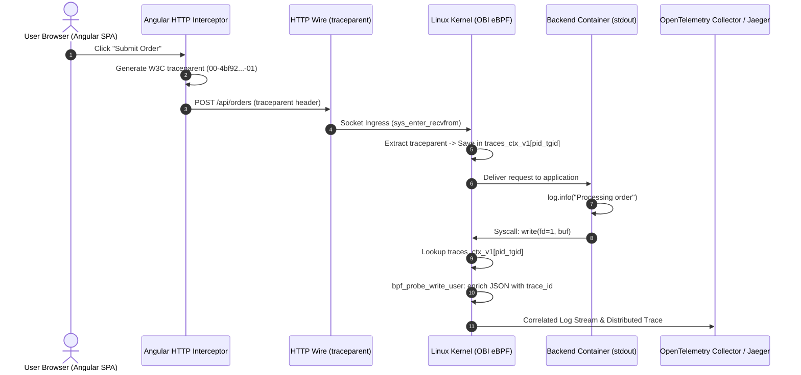

# Frontend Single Page Applications (SPA) & Server-Side Rendering (SSR) Telemetry Guide

This guide and runnable microservice demonstrates how modern frontend architectures—including **Angular 17+**, **React / Next.js**, **Vue / Nuxt 3**, and **SvelteKit**—interact with **OpenTelemetry eBPF Zero-Code Trace-Log Correlation (OBI)**.

---

## 1. Frontend Languages & Single Page Applications (Angular, React, Vue)

### The Architectural Boundary: Client Browser vs Linux Kernel Space

```mermaid
flowchart TD
    subgraph ClientDevice ["Client Device (Browser / Mobile / Desktop OS)"]
        subgraph AngularSPA ["Angular 17+ SPA / React / Vue (Client-Side)"]
            UI["User Click: 'Submit Order'"]
            OTelWeb["OpenTelemetry Web SDK / HTTP Interceptor"]
            ConsoleLog["console.log('Order submitted')\n(Browser DevTools Memory)"]
            Fetch["fetch('/api/orders')\n+ W3C traceparent header"]
            
            UI --> ConsoleLog
            UI --> OTelWeb
            OTelWeb --> Fetch
        end
    end

    subgraph Network ["HTTP / TLS Wire"]
        Fetch -->|HTTP Request with traceparent: 00-4bf92...| Gateway
    end

    subgraph LinuxHost ["Kubernetes Node / Linux Host (eBPF Kernel Layer)"]
        Gateway["API Gateway / Backend Service (Go, Node, Java, .NET)"]
        
        subgraph KernelSpace ["Linux Kernel (Ring 0)"]
            SockProbe["kprobe:sys_enter_recvfrom\n(Extracts W3C traceparent)"]
            BPFMap[("BPF Map: traces_ctx_v1\n(Key: PID/TID -> TraceID)")]
            SysWrite["kprobe:sys_enter_write(fd=1)\n(Intercepts stdout log buffer)"]
            PayloadEnrich["Mid-Flight Log Enrichment\n(Injects trace_id & span_id)"]
        end
        
        Gateway -->|Socket Read| SockProbe
        SockProbe -->|Store TraceID| BPFMap
        Gateway -->|log.info('Processing order')| SysWrite
        SysWrite -->|Lookup TraceID| BPFMap
        SysWrite --> PayloadEnrich
        PayloadEnrich --> DaemonLog["Containerd / stdout log stream"]
    end

    classDef client fill:#f8f9fa,stroke:#dc3545,stroke-width:2px;
    classDef kernel fill:#1a1a2e,stroke:#00adb5,stroke-width:2px,color:#fff;
    classDef kobj fill:#162447,stroke:#e43f5a,stroke-width:1px,color:#fff;
    classDef bpfmap fill:#1f4068,stroke:#e43f5a,stroke-width:2px,color:#fff;
    classDef net fill:#eef2f7,stroke:#6c757d,stroke-width:1px;

    class ClientDevice,AngularSPA,UI,ConsoleLog client;
    class KernelSpace kernel;
    class SockProbe,SysWrite,PayloadEnrich kobj;
    class BPFMap bpfmap;
    class Network net;
```

---

## 2. End-to-End Distributed Trace Sequence (Browser Click to Kernel Log Enrichment)



---

## 3. The Core Dilemma: Why eBPF Cannot Probe Client Browsers

Engineers evaluating OBI for frontend applications must understand where kernel probes can and cannot reach:

1. **Client-Side Browser Execution (Outside Host Kernel)**:
   - A standard Single Page Application (compiled HTML, JavaScript, CSS) executes client-side inside the end user's web browser (Google Chrome, Mozilla Firefox, Apple Safari) on their local operating system (macOS, Windows, iOS, Android, or Linux desktop).
   - When an Angular, React, or Vue component executes `console.log("Processing payment")`, that string is passed directly to the browser engine's internal memory buffer.
   - **No Linux system calls occur on the backend server.** The server hosting your Kubernetes pods has zero access to the client device's memory or kernel.
2. **The Distributed Tracing Solution (W3C HTTP Bridge)**:
   - The frontend application creates a client span and injects the W3C Trace Context standard HTTP header into outgoing network requests:
     ```http
     POST /api/orders HTTP/1.1
     Host: api.example.com
     traceparent: 00-4bf92f3577b34da6a3ce929d0e0e4736-00f067aa0ba902b7-01
     ```
   - When this HTTP packet lands on the Linux server running your backend container, **OBI intercepts socket ingress (`sys_enter_recvfrom`)**, extracts the `traceparent` header, and registers the `TraceID` (`4bf92f3577b34da6a3ce929d0e0e4736`) into the kernel BPF map (`traces_ctx_v1`).
   - When backend containers emit logs to stdout (`write(1, ...)`), OBI enriches them with that exact Trace ID.
3. **Server-Side Rendering (SSR) & Server Components**:
   - When an application uses Server-Side Rendering (Angular SSR, Next.js App Router, Nuxt 3 Nitro), initial page rendering executes **on the server inside a Node.js container on Linux**.
   - During SSR, server-side `console.log()` calls **DO execute `write(1, ...)` syscalls on the Linux kernel** and are directly intercepted and enriched by OBI eBPF.

---

## 4. Frontend Solutions Comparison Matrix

| Frontend Solution | Client Execution Location | Server SSR Engine & Runtime | eBPF Kernel Syscall Visibility | Recommended Client Trace Injection | SSR Server-Side Log Interception |
| :--- | :--- | :--- | :--- | :--- | :--- |
| **Angular 17+ (SPA)** | Browser (V8 / JSC) | None (Static Nginx / S3) | ❌ None (Client OS) | `HttpInterceptorFn` (`telemetry.interceptor.ts`) | N/A |
| **Angular 17+ (SSR)** | Browser (V8 / JSC) | Node.js 20 (`@angular/ssr` / Express) | ✅ Full on Server SSR | `HttpInterceptorFn` on client; direct stdout on server | ✅ OBI intercepts Node.js `process.stdout.write()` |
| **React / Next.js 14+** | Browser (Client Components) | Node.js 20 (Server Components / RSC) | ✅ Full on Server SSR | `tracedFetch` wrapper / OpenTelemetry Web SDK | ✅ OBI intercepts Node.js `console.log()` |
| **Vue 3 / Nuxt 3** | Browser (Vue Engine) | Node.js (Nitro Engine) | ✅ Full on Server SSR | Nuxt plugin overriding `$fetch` `onRequest` | ✅ OBI intercepts Nitro server stdout |
| **Svelte 5 / SvelteKit** | Browser (Svelte DOM) | Node.js (`adapter-node`) | ✅ Full on Server SSR | `handleFetch` client hook in `hooks.client.ts` | ✅ OBI intercepts SvelteKit server stdout |
| **Vanilla JS / HTMX** | Browser (DOM Script) | None (Static) | ❌ None (Client OS) | Custom `fetch` interceptor / `hx-headers` | N/A |

---

## 5. Implementations Across Frontend Solutions

### A. Angular 17+ Functional HTTP Interceptor
As implemented in [`src/app/telemetry.interceptor.ts`](src/app/telemetry.interceptor.ts):

```typescript
import { HttpInterceptorFn, HttpRequest, HttpHandlerFn } from '@angular/common/http';

export const openTelemetryInterceptor: HttpInterceptorFn = (req: HttpRequest<unknown>, next: HttpHandlerFn) => {
  if (req.headers.has('traceparent')) {
    return next(req);
  }

  // Generate 16-byte TraceID and 8-byte SpanID
  const traceId = generateHex(16);
  const spanId = generateHex(8);
  const traceparent = `00-${traceId}-${spanId}-01`;

  const tracedReq = req.clone({
    setHeaders: { 
      traceparent,
      baggage: 'frontend.framework=angular17,client.type=spa'
    }
  });

  return next(tracedReq);
};
```

### B. React / Next.js 14+ App Router Traced Fetch
As implemented in [`other-solutions/nextjs-instrumentation.ts`](other-solutions/nextjs-instrumentation.ts):

```typescript
// Traced Fetch wrapper for Next.js Client Components
export async function tracedFetch(input: RequestInfo | URL, init?: RequestInit): Promise<Response> {
  const headers = new Headers(init?.headers);

  if (!headers.has('traceparent')) {
    const traceId = generateHex(16);
    const spanId = generateHex(8);
    headers.set('traceparent', `00-${traceId}-${spanId}-01`);
    headers.set('baggage', 'client.framework=nextjs-app-router');
  }

  return fetch(input, { ...init, headers });
}
```

### C. Vue 3 / Nuxt 3 `$fetch` Plugin
As implemented in [`other-solutions/nuxt-fetch-plugin.ts`](other-solutions/nuxt-fetch-plugin.ts):

```typescript
// Nuxt 3 plugin auto-injecting traceparent on all outgoing $fetch calls
export default defineNuxtPlugin(() => {
  globalThis.$fetch = $fetch.create({
    onRequest({ options }) {
      options.headers = options.headers || {};
      const headers = new Headers(options.headers);
      if (!headers.has('traceparent')) {
        headers.set('traceparent', `00-${generateHex(16)}-${generateHex(8)}-01`);
        options.headers = headers;
      }
    }
  });
});
```

### D. Production OpenTelemetry Official Browser SDK
As implemented in [`other-solutions/otel-web-sdk.ts`](other-solutions/otel-web-sdk.ts):

```typescript
import { WebTracerProvider } from '@opentelemetry/sdk-trace-web';
import { registerInstrumentations } from '@opentelemetry/instrumentation';
import { FetchInstrumentation } from '@opentelemetry/instrumentation-fetch';

const provider = new WebTracerProvider();
provider.register();

registerInstrumentations({
  instrumentations: [
    new FetchInstrumentation({
      propagateTraceHeaderCorsUrls: [/.*/],
    }),
  ],
});
```

---

## 6. The Browser Telemetry Ingestion Bridge Pattern

To capture frontend client exceptions and UI logs without deploying a separate proprietary RUM service, the frontend forwards telemetry to the backend server:

```typescript
// Browser client error handler
window.onerror = (message, source, lineno, colno, error) => {
  const activeTrace = getActiveTraceContext(); // Retrieves active traceparent
  navigator.sendBeacon('/api/telemetry/logs', JSON.stringify({
    event: 'client_javascript_error',
    message,
    source,
    line: lineno,
    traceparent: activeTrace
  }));
};
```

When `POST /api/telemetry/logs` arrives at the server, **OBI intercepts the socket call**, captures the client's `traceparent`, and decorates the server's stdout log write. This binds client-side JavaScript crashes directly into the distributed trace!

---

## 7. Directory Structure

```text
demo-apps/frontend-angular/
├── Dockerfile                           # Multi-stage Alpine container (node:20-alpine)
├── package.json                         # Dependencies and build scripts
├── server.js                            # Express SSR server & telemetry ingestion bridge
├── README.md                            # This architectural guide
├── src/
│   └── app/
│       ├── app.component.ts             # Angular root component initiating checkout
│       └── telemetry.interceptor.ts     # Angular 17+ W3C traceparent HTTP interceptor
└── other-solutions/
    ├── nextjs-instrumentation.ts        # React / Next.js 14 App Router traced fetch
    ├── nuxt-fetch-plugin.ts             # Vue 3 / Nuxt 3 $fetch telemetry plugin
    └── otel-web-sdk.ts                  # Official OpenTelemetry Web SDK integration
```

---

## 8. Working vs Broken Modes

| Mode | Environment Variable | Stdout Emission Mechanism | OBI Correlation Behavior |
| :--- | :--- | :--- | :--- |
| **Working (Default)** | *(None)* | Synchronous `process.stdout.write()` directly on active event loop tick | ✅ **100% Correlated**: OBI associates stdout logs with the active HTTP request socket trace. |
| **Broken** | `ASYNC_BACKGROUND_LOGGER=true` | Dispatches logs to asynchronous `setTimeout` queue | ⚠️ **Trace Lost**: Logs are written after the request socket context has closed, causing trace context drop. |

---

## 9. Building and Running

### Build the Container Image
```bash
docker build -t obi-demo-angular:latest demo-apps/frontend-angular/
```

### Run in Working Mode (Synchronous SSR Logging)
```bash
docker run --rm -p 8086:8086 obi-demo-angular:latest
```

### Run in Broken Mode (Asynchronous Queue Decoupling)
```bash
docker run --rm -p 8086:8086 -e ASYNC_BACKGROUND_LOGGER=true obi-demo-angular:latest
```

### Test 1: SSR Page Render (Server-Side Logs Intercepted by OBI)
```bash
curl -i http://localhost:8086/ssr
```

### Test 2: Client SPA Call with Injected W3C Traceparent
```bash
curl -i -X POST http://localhost:8086/api/orders \
  -H "Content-Type: application/json" \
  -H "traceparent: 00-4bf92f3577b34da6a3ce929d0e0e4736-00f067aa0ba902b7-01" \
  -d '{"item":"license","qty":1}'
```

### Test 3: Client Telemetry Ingestion Bridge
```bash
curl -i -X POST http://localhost:8086/api/telemetry/logs \
  -H "Content-Type: application/json" \
  -H "traceparent: 00-4bf92f3577b34da6a3ce929d0e0e4736-00f067aa0ba902b7-01" \
  -d '{"event":"checkout_clicked","component":"CartComponent"}'
```
