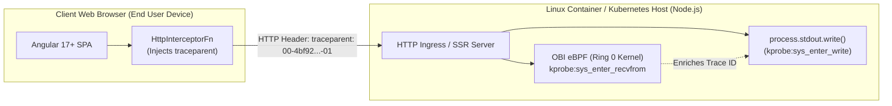

# Angular SPA & SSR Demo Microservice

This microservice demonstrates how frontend applications (such as Angular 17+ Single Page Applications and Server-Side Rendering engines) interact with **OpenTelemetry eBPF Zero-Code Trace-Log Correlation (OBI)**.

---

## 1. Architectural Overview: Client Browser vs Linux Kernel Space



### The Client-Side Challenge
* **Pure Client-Side SPAs**: When Angular runs in Google Chrome or Safari, `console.log()` calls execute inside the browser engine's memory. Because the browser runs on the end user's machine (macOS, Windows, iOS, Android), **no Linux system calls occur on the backend server**. The server's eBPF probes cannot inspect client browser memory.
* **The Distributed Tracing Solution**: The Angular application injects the standard W3C HTTP header (`traceparent: 00-{trace_id}-{span_id}-01`) into outgoing API requests. When the request lands on a Linux host running backend services, OBI extracts the `traceparent` header at socket ingress and enriches all backend container `write()` syscalls with that Trace ID.

### Server-Side Rendering (SSR)
* When Angular is deployed with Server-Side Rendering (SSR) using the Node.js Express engine, page pre-rendering occurs **on the server inside Linux containers**.
* During SSR, `console.log()` or `process.stdout.write()` calls execute on the host Linux kernel and are intercepted by OBI eBPF in real time.

---

## 2. Directory Structure

* [`server.js`](server.js): Express-based Angular SSR server handling `/ssr` pre-rendering, `/api/telemetry/logs` client log ingestion, and `/api/orders` backend simulation.
* [`src/app/telemetry.interceptor.ts`](src/app/telemetry.interceptor.ts): Angular 17+ functional HTTP interceptor (`HttpInterceptorFn`) generating and injecting W3C `traceparent` headers into outgoing requests.
* [`src/app/app.component.ts`](src/app/app.component.ts): Angular root component demonstrating client user actions.
* [`Dockerfile`](Dockerfile): Alpine-based non-root container image (`node:20-alpine`).
* [`package.json`](package.json): Node.js service metadata and dependencies.

---

## 3. Working vs Broken Modes

| Mode | Environment Variable | Mechanism | OBI Correlation Behavior |
| :--- | :--- | :--- | :--- |
| **Working (Default)** | *(None)* | Synchronous `process.stdout.write()` directly on active event loop context | ✅ **100% Correlated**: OBI associates stdout logs with the active HTTP request socket trace. |
| **Broken** | `ASYNC_BACKGROUND_LOGGER=true` | Dispatches logs to asynchronous `setTimeout` queue | ⚠️ **Trace Lost**: Logs are written after the request socket context has closed, causing trace context drop. |

---

## 4. Building and Running

### Build the Container Image
```bash
docker build -t obi-demo-angular:latest demo-apps/frontend-angular/
```

### Run in Working Mode (Synchronous SSR Logging)
```bash
docker run --rm -p 8086:8086 obi-demo-angular:latest
```

### Test SSR Page Render (Server-Side Logs Intercepted by OBI)
```bash
curl -i http://localhost:8086/ssr
```

### Test Client SPA Call with Injected W3C Traceparent
```bash
curl -i -X POST http://localhost:8086/api/orders \
  -H "Content-Type: application/json" \
  -H "traceparent: 00-4bf92f3577b34da6a3ce929d0e0e4736-00f067aa0ba902b7-01" \
  -d '{"item":"license","qty":1}'
```

### Test Client Telemetry Ingestion Endpoint
```bash
curl -i -X POST http://localhost:8086/api/telemetry/logs \
  -H "Content-Type: application/json" \
  -H "traceparent: 00-4bf92f3577b34da6a3ce929d0e0e4736-00f067aa0ba902b7-01" \
  -d '{"event":"checkout_clicked","component":"CartComponent"}'
```
