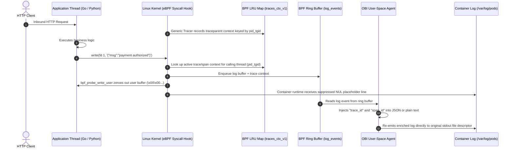

# Architecture Deep Dive: OpenTelemetry eBPF (OBI) Trace-Log Correlation

## 1. Executive Summary

Distributed tracing provides end-to-end visibility across microservices, while logs supply granular diagnostic events. Historically, correlating these two signals required:
1. Adopting OpenTelemetry SDKs across every application.
2. Configuring specialized logging layout appenders (e.g., Logback MDC, Winston trace enricher, Go slog OTel wrappers).
3. Rebuilding, testing, and redeploying entire application portfolios.

**OpenTelemetry eBPF Instrumentation (OBI)** eliminates this burden. Operating at the Linux kernel layer, OBI automatically captures distributed trace contexts and enriches standard container log streams (`stdout` / `stderr`) with matching `trace_id` and `span_id` fields—**without requiring a single line of code change or application rebuild**.

---

## 2. Kernel-Level Interception Mechanism



### Syscall Interception Flow
1. **Trace Capture**: The OBI network/HTTP tracer hooks into socket read/recv calls (`kprobe`/`uprobe`) to extract W3C `traceparent` headers or generate root traces. It stores active `(trace_id, span_id)` pairs in the kernel BPF map `traces_ctx_v1`.
2. **Log Hooking**: When an application writes to stdout/stderr, OBI intercepts write execution paths:
   - `tty_write`: Terminal writes.
   - `pipe_write`: Container pipe writes registered as tracked stdout/stderr fds.
   - `ksys_write` / `do_writev`: Syscall handlers for `write()` and `writev()`.
3. **Context Lookup**: The hook extracts the calling thread's `pid_tgid` and queries `traces_ctx_v1`.
4. **Buffer Suppression**: To avoid emitting duplicate log lines, OBI invokes the BPF helper `bpf_probe_write_user()` to overwrite the original user memory buffer with zeroes (`\0`).
5. **Ring Buffer Submission**: The captured line and metadata are packaged into a `log_event_t` struct and submitted to the `log_events` BPF ring buffer.
6. **User-Space Re-emission**: OBI's user-space daemon reads the ring buffer, injects the formatted trace attributes, and writes the enriched line back to the target container stdout file descriptor.

---

## 3. The `traces_ctx_v1` BPF Map

`traces_ctx_v1` is an **LRU_HASH** BPF map pinned to the BPF filesystem:
- **Location**: `/sys/fs/bpf/otel/traces_ctx_v1` (configurable via `OTEL_EBPF_BPF_FS_PATH`).
- **Key**: `u64 pid_tgid` (Combined 32-bit Process ID and 32-bit Thread ID).
- **Value**: `obi_ctx_info_t` containing:
  - `trace_id[16]`: 128-bit W3C Trace Identifier.
  - `span_id[8]`: 64-bit W3C Span Identifier.
- **Pinning Strategy**: Managed via `libbpf` with persistent kernel lifetime.

---

## 4. Kernel Version Support Matrix

| Kernel Version | write() [ITER_UBUF] | writev() [ITER_IOVEC] | Trace-Log Correlation Status |
|---|---|---|---|
| **Linux < 5.8** | ❌ Unsupported | ❌ Unsupported | Incompatible |
| **Linux 5.8 – 5.19** | ❌ Not enriched | ✅ Enriched | Partial (covers only runtimes using `writev`) |
| **Linux >= 6.0** | ✅ **Enriched** | ✅ **Enriched** | **Full Production Support** |

> [!NOTE]
> Linux 6.0 introduced `ITER_UBUF` for standard `write()` system calls. Operating systems such as **OpenShift 4.20+ (RHCOS Linux 6.6+)**, **Amazon Linux 2023 (Linux 6.1+)**, **Azure Linux (Linux 6.6+)**, and **Ubuntu 24.04 (Linux 6.8+)** fully support the entire feature set.

---

## 5. Output Formatting

### Structured JSON
**Application Output:**
```json
{"level":"INFO","message":"order processed","amount":42}
```
**Enriched Container Log:**
```json
{
  "level": "INFO",
  "message": "order processed",
  "amount": 42,
  "trace_id": "4bf92f3577b34da6a3ce929d0e0e4736",
  "span_id": "00f067aa0ba902b7"
}
```

### Unstructured Plain Text
**Application Output:**
```text
2026-10-06 14:00:00 order processed amount=$42
```
**Enriched Container Log:**
```text
2026-10-06 14:00:00 order processed amount=$42 trace_id=4bf92f3577b34da6a3ce929d0e0e4736 span_id=00f067aa0ba902b7
```
