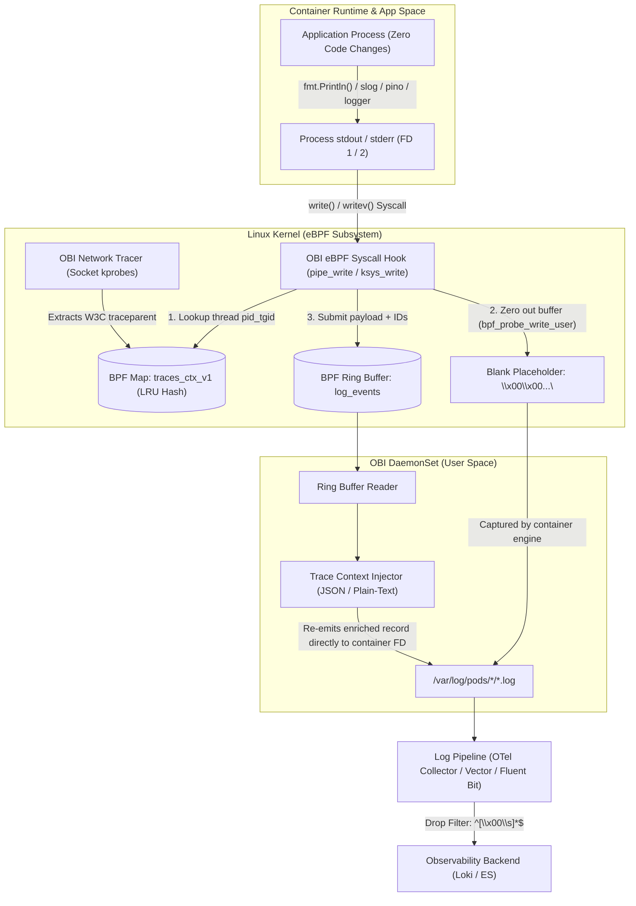
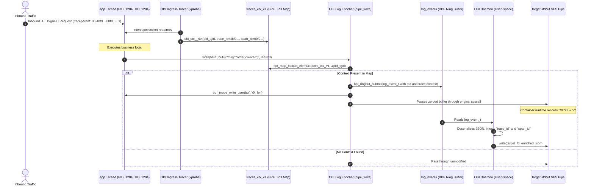

# Architecture Deep Dive: OpenTelemetry eBPF (OBI) Trace-Log Correlation

> **Reference Documentation**:
> - [Zero-Code Trace-Log Correlation with OBI (Official Blog Announcement)](reference-blog-announcement.md)
> - [Kernel Internals & Developer Spec (devdocs/trace-log-correlation.md)](https://github.com/open-telemetry/opentelemetry-ebpf-instrumentation/blob/main/devdocs/trace-log-correlation.md)

---

## Table of Contents
- [1. Executive Summary](#1-executive-summary)
- [2. The Motivation: Why Trace-Log Correlation Matters](#2-the-motivation-why-trace-log-correlation-matters)
  - [The Junior Perspective: What Is the Problem?](#the-junior-perspective-what-is-the-problem)
  - [The Enterprise Dilemma: Why In-Process SDKs Fall Short](#the-enterprise-dilemma-why-in-process-sdks-fall-short)
- [3. Conceptual Architecture (Mental Model)](#3-conceptual-architecture-mental-model)
- [4. Kernel-Level Interception Deep Dive (For Systems Specialists)](#4-kernel-level-interception-deep-dive-for-systems-specialists)
  - [End-to-End Syscall & Ringbuffer Sequence](#end-to-end-syscall--ringbuffer-sequence)
  - [Syscall Hook Targets & Iterator Semantics](#syscall-hook-targets--iterator-semantics)
  - [The `traces_ctx_v1` LRU Map Specification](#the-traces_ctx_v1-lru-map-specification)
  - [Memory Mutation via `bpf_probe_write_user`](#memory-mutation-via-bpf_probe_write_user)
  - [The 8 KiB Buffer Limit & Payload Chunking](#the-8-kib-buffer-limit--payload-chunking)
- [5. Output Formatting & Field Injection](#5-output-formatting--field-injection)
  - [Structured JSON & NDJSON](#structured-json--ndjson)
  - [Unstructured Plain Text (Key-Value Suffix/Prefix)](#unstructured-plain-text-key-value-suffixprefix)
  - [Preservation of Existing Fields](#preservation-of-existing-fields)
- [6. Downstream Pipeline Interaction](#6-downstream-pipeline-interaction)
- [7. Kernel Version & Architecture Matrix](#7-kernel-version--architecture-matrix)

---

## 1. Executive Summary

Distributed tracing provides transactional timing and causal context across microservice topologies, while log streams record granular internal state, error stack traces, and domain logic. Correlating traces and logs is the cornerstone of modern incident response.

Historically, achieving bi-directional correlation required instrumenting every application with language-specific OpenTelemetry SDKs, altering logging frameworks, and redeploying entire application fleets. **OpenTelemetry eBPF Instrumentation (OBI)** operates entirely within the Linux kernel to automatically correlate uninstrumented logs with active distributed traces without touching application source code, configuration, or runtime binaries.

---

## 2. The Motivation: Why Trace-Log Correlation Matters

### The Junior Perspective: What Is the Problem?
When you deploy a web service in Kubernetes:
1. Every time a user clicks "Buy Now", an HTTP request hits your pod.
2. The code runs: `log.Info("payment received", "user", "alice")`.
3. The code calls a payment gateway. The gateway returns an error.
4. The code runs: `log.Error("payment failed", "reason", "insufficient funds")`.
5. An APM tracing tool (like Jaeger or Tempo) catches the error and marks the request trace red with `trace_id: 4bf92f3577b34da6a3ce929d0e0e4736`.

**The Breakpoint**: When you open your log viewer (Grafana Loki, Elasticsearch, or CloudWatch), you search for errors around `14:02:15`. But your cluster handles 10,000 requests per second across 20 pods! You see 400 different error lines at `14:02:15`. You have no idea which error line caused the specific customer's request to fail. You are forced to guess based on timestamps—a tedious and error-prone process.

**The Solution**: If the log line contains `"trace_id": "4bf9..."`, you can copy the `trace_id` directly from Jaeger into Loki and see the exact 3 log lines produced by that single user's request.

### The Enterprise Dilemma: Why In-Process SDKs Fall Short
Why can't organizations just add the OpenTelemetry SDK to their code?
- **Massive Polyglot Fleets**: Large organizations maintain thousands of services written across Go, Python, Java, Node.js, C++, Rust, and .NET.
- **Legacy & Frozen Codebases**: Critical banking or logistics microservices may be legacy applications where the original authors have moved on and changes incur massive compliance cycles.
- **Third-Party & Vendor Binaries**: Off-the-shelf closed-source containers (proxies, agents, proprietary databases) cannot be modified.
- **Release Fatigue**: Updating 500 Git repositories with SDK dependencies and redeploying can take quarters.

**OBI solves this by decoupling observability instrumentation from application lifecycles.**

---

## 3. Conceptual Architecture (Mental Model)

[](images/zero-code-trace-log-correlation-infographic.png)



---

## 4. Kernel-Level Interception Deep Dive (For Systems Specialists)

### End-to-End Syscall & Ringbuffer Sequence



### Syscall Hook Targets & Iterator Semantics

OBI monitors logging writes by attaching eBPF probes to the Linux Virtual File System (VFS) and pipe subsystem:
- **`pipe_write`**: Attached to pipe write paths where container runtimes capture stdout and stderr streams.
- **`tty_write`**: Handles processes connected to pseudo-terminals (`pty`).
- **`ksys_write`**: Primary entry point for standard `write()` system calls.
- **`do_writev`**: Vectored I/O (`struct iovec`) handler. A kprobe captures the active file descriptor and associates it with the calling thread so `pipe_write` can inspect the underlying file metadata.

#### Kernel Iterators: `ITER_UBUF` vs `ITER_IOVEC`
- **Linux < 6.0**: Syscalls like `write()` utilized older iterator abstractions (`ITER_IOVEC`). Only runtimes issuing vectored `writev()` calls could be safely inspected.
- **Linux >= 6.0**: Introduced `ITER_UBUF` (single user buffer iterator) for standard `write()` paths. This allows OBI to cleanly inspect, read, and rewrite single-buffer system calls without overhead.

### The `traces_ctx_v1` LRU Map Specification

The correlation engine relies on a shared BPF map pinned into the Linux BPF filesystem (`bpffs`):
- **Name**: `traces_ctx_v1`
- **Map Type**: `BPF_MAP_TYPE_LRU_HASH` (Least Recently Used Hash Map)
- **Filesystem Pin Path**: `/sys/fs/bpf/otel/traces_ctx_v1`
- **Key Definition**:
  ```c
  typedef struct {
      u64 pid_tgid; // High 32 bits: PID (Process ID), Low 32 bits: TID (Thread ID)
  } obi_ctx_key_t;
  ```
- **Value Definition**:
  ```c
  typedef struct {
      u8  trace_id[16]; // 128-bit W3C Trace ID
      u8  span_id[8];   // 64-bit W3C Span ID
      u64 flags;        // Sampling and internal routing flags
  } obi_ctx_info_t;
  ```
- **Eviction Safety**: Because `traces_ctx_v1` is an LRU map, it is bounded in memory (default 65,536 concurrent entries, ~2.5 MB). Inactive or dead threads are automatically evicted without leaking kernel slab memory.

### Memory Mutation via `bpf_probe_write_user`

In Linux eBPF, a tracing program cannot cancel a system call once it has entered the kernel. If OBI captures a log line and re-emits an enriched version, the original log line would still be written to the pipe, causing duplicate lines.

To suppress the original line:
1. OBI safely copies the user memory buffer into kernel ring buffer space using `bpf_probe_read_user()`.
2. OBI overwrites the process's user memory buffer with zeroes (`\0`) using `bpf_probe_write_user()`.
3. The process's write syscall finishes writing the zeroed buffer to the pipe.
4. The container runtime captures a placeholder line containing NUL characters.
5. Downstream log forwarders drop the line via `^[\x00\s]*$`.

> [!WARNING]
> **Kernel Lockdown & Security Posture**:  
> The `bpf_probe_write_user()` helper modifies user-space memory. Linux kernels with kernel lockdown enabled (`integrity` or `confidentiality` mode) disable this helper. The host kernel must have `/sys/kernel/security/lockdown` set to `[none]`, and the OBI daemon requires `CAP_SYS_ADMIN`.

### The 8 KiB Buffer Limit & Payload Chunking

The eBPF verification engine enforces strict stack limits (512 bytes per function) and bounded loops:
- OBI's BPF probe allocates an internal memory capture buffer of **8,192 bytes (8 KiB)**.
- **Log lines <= 8 KiB**: The entire line is read, suppressed, and re-emitted with trace enrichment.
- **Log lines > 8 KiB**:
  - The first 8 KiB is captured, zeroed, and re-emitted with trace context.
  - The remaining bytes past the 8 KiB boundary leak through to stdout untouched without enrichment.
  - One logical record becomes two physical records in downstream logs.
  - **SRE Recommendation**: Configure application loggers (e.g. `slog`, `zap`, `logback`) with a message truncation policy (e.g., maximum 4 KiB or 6 KiB) to prevent record fragmentation.

---

## 5. Output Formatting & Field Injection

OBI dynamically inspects the buffer to detect whether the payload is JSON or unstructured text.

### Structured JSON & NDJSON
If the payload starts with `{` and ends with `}`, OBI parses the JSON stream:
- It injects native JSON fields:
  ```json
  {
    "timestamp": "2026-10-06T14:30:00Z",
    "level": "INFO",
    "message": "database transaction committed",
    "trace_id": "4bf92f3577b34da6a3ce929d0e0e4736",
    "span_id": "00f067aa0ba902b7"
  }
  ```
- **NDJSON (Newline-Delimited JSON)**: OBI enriches each JSON object independently while leaving non-object records untouched.

### Unstructured Plain Text (Key-Value Suffix/Prefix)
If the payload is free-form text, OBI injects fixed-width key-value pairs based on configuration:
- **Suffix Placement (Default)**:
  ```text
  database transaction committed trace_id=4bf92f3577b34da6a3ce929d0e0e4736 span_id=00f067aa0ba902b7
  ```
- **Prefix Placement**:
  ```text
  trace_id=4bf92f3577b34da6a3ce929d0e0e4736 span_id=00f067aa0ba902b7 database transaction committed
  ```
- **Multiline Handling**: Configurable via `multiline: first_line | last_line | each_line`.

### Preservation of Existing Fields
If an application logger or an OpenTelemetry SDK has already emitted `trace_id` or `span_id`:
- OBI parses existing tokens and **preserves the application's original values**.
- OBI only injects the missing attributes.
- If an in-process SDK is actively exporting OTLP traces, OBI injects `trace_id` only, deliberately omitting `span_id` to prevent conflicts with in-process span hierarchies.

---

## 6. Downstream Pipeline Interaction

Because OBI replaces the original buffer with zeroes, `/var/log/pods/*/*.log` contains suppressed NUL placeholder records. Every log forwarding agent must include a drop filter matching `^[\x00\s]*$`:

| Shipper | Filter Implementation | Documentation |
|---|---|---|
| **OpenTelemetry Collector** | `filelog` receiver with `expr: 'body matches "^[\\x00\\s]*$"'` | [log-pipelines/otel-collector-filelog.yaml](../log-pipelines/otel-collector-filelog.yaml) |
| **Vector** | VRL Transform: `abort = match(string!(.message), r'^[\x00\s]*$')` | [log-pipelines/vector-filter.toml](../log-pipelines/vector-filter.toml) |
| **Fluent Bit** | `grep` filter with `Exclude log ^[\x00\s]*$` | [log-pipelines/fluent-bit-filter.conf](../log-pipelines/fluent-bit-filter.conf) |
| **Promtail / Alloy** | Pipeline drop stage matching `^[\\x00\\s]*$` | [log-pipelines/promtail-filter.yaml](../log-pipelines/promtail-filter.yaml) |

---

## 7. Kernel Version & Architecture Matrix

| Kernel Version | BPF Architecture | `write()` [ITER_UBUF] | `writev()` [ITER_IOVEC] | Correlation Status |
|---|---|---|---|---|
| **< 5.8** | Pre-RingBuffer | ❌ Unsupported | ❌ Unsupported | Incompatible |
| **5.8 – 5.19** | RingBuffer Introduced | ❌ Not enriched | ✅ Enriched | Partial (writev only) |
| **>= 6.0** | Full VFS ITER_UBUF | ✅ **Enriched** | ✅ **Enriched** | **Full Production Support** |

### Supported Enterprise Distributions
- **Red Hat OpenShift 4.20+**: RHCOS on Linux 6.6+ (Full Support).
- **Amazon Web Services EKS**: Amazon Linux 2023 (Linux 6.1+), Bottlerocket 1.20+ (Full Support).
- **Microsoft Azure AKS**: Azure Linux / CBL-Mariner (Linux 6.6+), Ubuntu 24.04 LTS (Linux 6.8+) (Full Support).
- **Google Cloud GKE**: GKE Standard nodes with Container-Optimized OS (COS) Linux 6.1+ or Ubuntu 24.04 (Full Support).
- **Rancher RKE2 / K3s**: Hardened Linux nodes running modern kernels >= 6.0 (Full Support).
