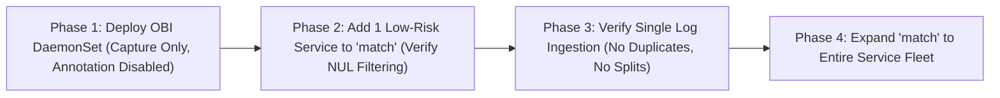

# Day 2: Operations, Incident Triage & Canary Rollout Guide

---

> **Documentation Hub**: [🏠 Overview](../README.md) &nbsp;|&nbsp; [📜 Announcement](reference-blog-announcement.md) &nbsp;|&nbsp; [🏛️ Architecture](architecture.md) &nbsp;|&nbsp; [📋 Day 0: Sizing](day0-planning-sizing.md) &nbsp;|&nbsp; [📦 Day 1: Deploy](day1-installation.md) &nbsp;|&nbsp; [🚨 Day 2: Ops](day2-operations-triage.md) &nbsp;|&nbsp; [💧 Log Filtering](log-filtering-guide.md) &nbsp;|&nbsp; [⚡ Runtimes](runtime-compatibility.md) &nbsp;|&nbsp; [🌐 Frontend](frontend-spa-ssr-telemetry.md) &nbsp;|&nbsp; [🔧 Troubleshooting](troubleshooting.md) &nbsp;|&nbsp; [🧹 Decommission](decommission-guide.md) &nbsp;|&nbsp; [📚 References](references.md)

---


## 1. Incident Triage Playbook: Correlating Traces to Logs

When an incident occurs and an alert fires, trace-log correlation cuts Mean Time To Resolution (MTTR) dramatically.

### Scenario: Paged on 502 Bad Gateway
1. **Locate the Trace in Jaeger**:
   - Open Jaeger UI (`http://localhost:16686`).
   - Query for errors or high latency on service `frontend`.
   - Copy the failing `trace_id` (e.g., `4bf92f3577b34da6a3ce929d0e0e4736`).

2. **Jump to Correlated Logs**:
   - In Grafana Loki, query directly by trace ID:
     ```logql
     {namespace="demo-apps"} |= "4bf92f3577b34da6a3ce929d0e0e4736"
     ```
   - In Elasticsearch / OpenSearch:
     ```json
     {
       "query": {
         "term": { "trace_id": "4bf92f3577b34da6a3ce929d0e0e4736" }
       }
     }
     ```
   - In AWS CloudWatch Logs Insights:
     ```sql
     fields @timestamp, @message
     | filter trace_id = '4bf92f3577b34da6a3ce929d0e0e4736'
     | sort @timestamp desc
     ```

3. **Diagnose the Root Cause**:
   - Every log line across every microservice executing that transaction appears in perfect chronological order.
   - You immediately observe the backend database timeout line containing the exact query parameters without searching through gigabytes of unrelated logs.

---

## 2. Progressive Canary Rollout Strategy

Do not enable log trace annotation on 100% of production workloads simultaneously. Roll out incrementally:



### Canary Automation with Script
```bash
# Check current annotation status
./scripts/day2-canary-rollout.sh status

# Enable annotation for frontend canary
./scripts/day2-canary-rollout.sh enable /frontend

# If an anomaly occurs, rollback instantly without touching the app
./scripts/day2-canary-rollout.sh disable /frontend

# Global emergency shutoff
./scripts/day2-canary-rollout.sh disable-all
```

---

## 3. Operational Monitoring & Alerting

Monitor the health of OBI and the eBPF subsystem using Prometheus metrics exported on port 8999:

| Metric | Threshold | Alert Severity | Description |
|---|---|---|---|
| `obi_bpf_map_entries{map="traces_ctx_v1"}` | > 85% capacity | Warning | The thread LRU map is near saturation; consider increasing map size |
| `obi_ringbuffer_dropped_events_total` | > 0 | Critical | Log events are being dropped due to user-space writer backpressure |
| `obi_enricher_errors_total` | > 10 / min | Warning | Syscall write interception encountered read/write failures |
| `container_cpu_usage_seconds_total{container="obi"}` | > 80% limit | Warning | OBI CPU throttling; increase resource limits |


---

## 🧭 Navigation & Documentation Directory

| ⬅️ Previous Document | 🏠 Documentation Hub | ➡️ Next Document |
| :--- | :---: | ---: |
| [**Day 1: Multi-Cluster Deployment**](day1-installation.md) | [**Repository Overview**](../README.md) | [**Log Shipper Filtering Guide**](log-filtering-guide.md) |

### 📚 Complete Guide Catalog
- 📜 **[Official Reference Announcement](reference-blog-announcement.md)** — Verbatim OpenTelemetry announcement with junior primers and kernel deep dives
- 🏛️ **[Architecture Deep Dive](architecture.md)** — Low-level syscall hooks (`pipe_write`, `ksys_write`, `do_writev`), LRU maps, and ringbuffer flow
- 📋 **[Day 0: Planning & Sizing](day0-planning-sizing.md)** — Linux 6.0+ matrix, kernel lockdown, memory sizing formulas, and security postures
- 📦 **[Day 1: Multi-Cluster Deployment](day1-installation.md)** — Enterprise overlays for OpenShift 4.20+, AKS, EKS, GKE, RKE2, and Docker Compose
- 🚨 **[Day 2: Operations & Incident Triage](day2-operations-triage.md)** — SRE incident response playbook, LogQL/Jaeger queries, and canary rollouts
- 💧 **[Log Shipper Filtering Guide](log-filtering-guide.md)** — Suppressed NUL byte placeholder drop filters and 8 KiB write split handling
- ⚡ **[Runtime Compatibility Guide](runtime-compatibility.md)** — Go runtime hooks, `PYTHONUNBUFFERED=1`, Node.js async streams, and Java Loom
- 🌐 **[Frontend SPAs & SSR Telemetry Guide](frontend-spa-ssr-telemetry.md)** — W3C `traceparent` HTTP bridge, Angular/React/Vue patterns, and SSR kernel interception
- 🔧 **[Troubleshooting & Diagnostics](troubleshooting.md)** — Common pitfalls, eBPF probe errors, missing trace IDs, and verification steps
- 🧹 **[Decommission & Teardown Guide](decommission-guide.md)** — Safe probe detachment, BPF map unpinning, and resource cleanup
- 📚 **[References & Official Documentation](references.md)** — Upstream OpenTelemetry specifications, GitHub repositories, and CNCF channels
