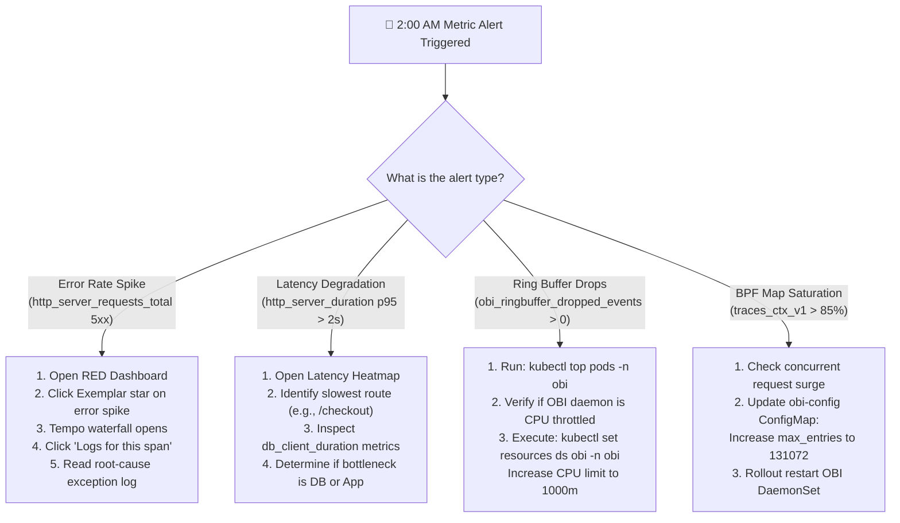

# OpenTelemetry eBPF (OBI) Metrics Architecture: RED Signals, Kernel Telemetry & Prometheus Exemplars

[](#-complete-guide-catalog)
[](day0-planning-sizing.md)
[](architecture.md)
[](https://prometheus.io)
[](../LICENSE)

> **Documentation Hub**: [🏠 Overview](../README.md) &nbsp;|&nbsp; [📜 Announcement](reference-blog-announcement.md) &nbsp;|&nbsp; [🏛️ Architecture](architecture.md) &nbsp;|&nbsp; [📋 Day 0: Sizing](day0-planning-sizing.md) &nbsp;|&nbsp; [📦 Day 1: Deploy](day1-installation.md) &nbsp;|&nbsp; [🚨 Day 2: Ops](day2-operations-triage.md) &nbsp;|&nbsp; [💧 Log Filtering](log-filtering-guide.md) &nbsp;|&nbsp; [⚡ Runtimes](runtime-compatibility.md) &nbsp;|&nbsp; [🌐 Frontend](frontend-spa-ssr-telemetry.md) &nbsp;|&nbsp; [🕸️ Service Mesh](service-mesh-vs-ebpf-observability.md) &nbsp;|&nbsp; [📊 Tool Comparison](obi-vs-modern-observability-tools.md) &nbsp;|&nbsp; [📈 Grafana & K8s](grafana-and-k8s-observability.md) &nbsp;|&nbsp; [📊 Metrics & Telemetry](ebpf-metrics-and-telemetry.md) &nbsp;|&nbsp; [🔧 Troubleshooting](troubleshooting.md) &nbsp;|&nbsp; [🧹 Decommission](decommission-guide.md) &nbsp;|&nbsp; [📚 References](references.md)

---

## 📑 Table of Contents

- [1. Executive Summary: Strategic Answers Upfront](#1-executive-summary-strategic-answers-upfront)
- [2. Kernel Mechanics: Socket Layer Probes vs. VFS Syscall Hooks](#2-kernel-mechanics-socket-layer-probes-vs-vfs-syscall-hooks)
  - [The Dual-Path Kernel Interception Architecture](#the-dual-path-kernel-interception-architecture)
  - [How Network Socket Hooks Derive RED Metrics](#how-network-socket-hooks-derive-red-metrics)
- [3. Layer 1: Application RED Metrics (Golden Signals)](#3-layer-1-application-red-metrics-golden-signals)
  - [3.1 OpenTelemetry Semantic Conventions](#31-opentelemetry-semantic-conventions)
  - [3.2 HTTP/HTTPS Server Metrics & PromQL Formulas](#32-httphttps-server-metrics--promql-formulas)
  - [3.3 gRPC & RPC Service Metrics](#33-grpc--rpc-service-metrics)
  - [3.4 Database Client Metrics (SQL & NoSQL)](#34-database-client-metrics-sql--nosql)
- [4. Layer 2: eBPF Subsystem & Kernel Health Telemetry](#4-layer-2-ebpf-subsystem--kernel-health-telemetry)
  - [4.1 Self-Monitoring Prometheus Endpoint (Port 8999)](#41-self-monitoring-prometheus-endpoint-port-8999)
  - [4.2 Kernel BPF Map Capacity & Saturation (`traces_ctx_v1`)](#42-kernel-bpf-map-capacity--saturation-traces_ctx_v1)
  - [4.3 Ring Buffer Backpressure & Drop Detection](#43-ring-buffer-backpressure--drop-detection)
  - [4.4 Probe Overhead & Microsecond Latency Tracking](#44-probe-overhead--microsecond-latency-tracking)
- [5. The Metric-Trace-Log Synergy: Prometheus & Mimir Exemplars](#5-the-metric-trace-log-synergy-prometheus--mimir-exemplars)
  - [5.1 How OBI Binds W3C Trace IDs to Histogram Buckets](#51-how-obi-binds-w3c-trace-ids-to-histogram-buckets)
  - [5.2 1-Click Investigation: Metric Spike ➔ Trace ➔ Correlated Logs](#52-1-click-investigation-metric-spike--trace--correlated-logs)
- [6. Production Configuration Blueprints](#6-production-configuration-blueprints)
  - [6.1 OBI DaemonSet Configuration (`meter_provider`)](#61-obi-daemonset-configuration-meter_provider)
  - [6.2 OpenTelemetry Collector Multi-Backend Metrics Pipeline](#62-opentelemetry-collector-multi-backend-metrics-pipeline)
  - [6.3 GitOps `PrometheusRule` Alerting CRD](#63-gitops-prometheusrule-alerting-crd)
- [7. Multi-Cloud Kubernetes Metrics Architecture](#7-multi-cloud-kubernetes-metrics-architecture)
  - [7.1 Red Hat OpenShift: User Workload Monitoring](#71-red-hat-openshift-user-workload-monitoring)
  - [7.2 Microsoft Azure AKS: Azure Managed Prometheus](#72-microsoft-azure-aks-azure-managed-prometheus)
  - [7.3 AWS EKS: Amazon Managed Service for Prometheus (AMP)](#73-aws-eks-amazon-managed-service-for-prometheus-amp)
  - [7.4 Google Cloud GKE: Google Cloud Managed Service for Prometheus (GMP)](#74-google-cloud-gke-google-cloud-managed-service-for-prometheus-gmp)
  - [7.5 SigNoz: Native Columnar ClickHouse Metrics](#75-signoz-native-columnar-clickhouse-metrics)
- [8. Boundaries & Anti-Patterns: What eBPF Metrics Do and Do Not Solve](#8-boundaries--anti-patterns-what-ebpf-metrics-do-and-do-not-solve)
  - [8.1 What eBPF Metrics Provide Out-of-the-Box](#81-what-ebpf-metrics-provide-out-of-the-box)
  - [8.2 What Requires In-Process Application SDKs](#82-what-requires-in-process-application-sdks)
  - [8.3 Architectural Decision Matrix](#83-architectural-decision-matrix)
- [9. The 2:00 AM Metric Alert Incident Runbook](#9-the-200-am-metric-alert-incident-runbook)
- [10. Categorized Public References & Standards Catalog](#10-categorized-public-references--standards-catalog)
- [11. Navigation & Documentation Directory](#11-navigation--documentation-directory)

---

## 1. Executive Summary: Strategic Answers Upfront

Platform architects and Site Reliability Engineers evaluating OpenTelemetry eBPF Instrumentation (OBI) frequently ask: **"Are metrics already integrated natively with OBI, or does OBI only handle log-trace correlation?"**

| Core Architectural Question | Definitive Technical Answer | Strategic Production Implication |
| :--- | :--- | :--- |
| **Are metrics already integrated natively with OBI?** | **YES. OBI generates two distinct layers of metrics natively.** Layer 1 provides zero-code application RED metrics; Layer 2 provides kernel subsystem health metrics. | SREs obtain instant Golden Signals (RPS, 5xx errors, latency histograms) across all uninstrumented microservices without developer code changes. |
| **How does OBI generate application metrics without SDKs?** | By attaching kernel probes (`kprobe: tcp_recvmsg / sockops` and TLS uprobes) directly to Linux network sockets. OBI parses protocol headers in kernel space and calculates request latencies. | Standardizes telemetry across polyglot microservice fleets (Go, Python, Java, Node.js, .NET, Rust) with zero bytecode injection. |
| **How do metrics connect to traces and logs?** | Via **Prometheus / Mimir Exemplars**. Because OBI measures network transaction durations and generates distributed traces simultaneously, it stamps the active W3C `trace_id` onto metric buckets. | Transforms static latency graphs into interactive investigation portals: clicking an alert spike immediately loads the trace and its correlated container logs. |
| **Can OBI replace custom business application metrics?** | **NO.** eBPF cannot inspect internal application variables (e.g., `cart_total_usd`, `active_user_tokens`). | Application business metrics still require lightweight in-process instrumentation or OpenTelemetry API calls. |
| **How are metrics exported?** | Via native **OTLP over gRPC/HTTP (port 4317/4318)** to the OpenTelemetry Collector, and via an internal **Prometheus scrape endpoint (port 8999)** for daemon health. | Integrates seamlessly with existing enterprise metric backends (Prometheus, Mimir, AWS AMP, Azure Monitor, Google GMP, Datadog, SigNoz). |

---

---

### 🎥 Multimedia Deep Dives & Architectural Audio-Visual Guides

This guide is supported by dedicated educational audio-visual deep dives synthesized with **Gemini NotebookLM** that explore OpenTelemetry eBPF (OBI) metrics architecture: from kernel socket interception deriving RED Golden Signals and self-monitoring eBPF maps to Prometheus / Mimir Exemplars, GitOps alerting rules, multi-cloud managed Prometheus backends, and metric boundaries. All episodes and technical shorts are hosted on the [**@nubenetes**](https://youtube.com/@nubenetes) YouTube channel.

> [!NOTE]
> **Multilingual Learning Experience**:
> Features native audio in **English 🇺🇸**, with automated closed captions (CC) translated into **20+ languages** (Spanish, French, German, Japanese, Portuguese, Italian, Arabic, Hindi, etc.) for platform engineering, cloud-native architecture, and SRE teams.

#### 📊 Curated eBPF Metrics & Telemetry Collection (4 Episodes)

| Format | Episode / Title | Domain / Focus | Language | Duration | Direct YouTube Link |
|:---:|---|---|:---:|:---:|---|
| 📽️ **Video Guide** | [**OBI Metrics Architecture: RED Signals, Kernel Telemetry & Prometheus Exemplars**](https://www.youtube.com/watch?v=KZKEWYL1b00) | **Core Metrics Architecture**: Dual-path interception, Golden Signals, map health & Exemplars | 🇺🇸 English *(CC 20+)* | `8:11` | [▶️ Watch Video](https://www.youtube.com/watch?v=KZKEWYL1b00) |
| 📽️ **Video Guide** | [**Production OBI Metrics Blueprints: Multi-Cloud, GitOps Alerts & Boundaries**](https://www.youtube.com/watch?v=yEChUSX2NXc) | **Production Blueprints**: Multi-cloud K8s metrics, PrometheusRule CRDs & Decision Matrix | 🇺🇸 English *(CC 20+)* | `9:22` | [▶️ Watch Video](https://www.youtube.com/watch?v=yEChUSX2NXc) |
| ⚡ **Technical Short** | [**How Prometheus Exemplars Connect Spikes to Logs**](https://www.youtube.com/shorts/nhwv34F6Fa0) | **Exemplars Integration**: 1-click drill-down from metric spikes to traces and correlated logs | 🇺🇸 English *(CC 20+)* | `1:11` | [▶️ Watch Short](https://www.youtube.com/shorts/nhwv34F6Fa0) |
| ⚡ **Technical Short** | [**Why eBPF Can't See Your Business Metrics**](https://www.youtube.com/shorts/Ja5gPK7KTK4) | **Architectural Boundaries**: Protocol-level RED metrics vs application business telemetry | 🇺🇸 English *(CC 20+)* | `1:23` | [▶️ Watch Short](https://www.youtube.com/shorts/Ja5gPK7KTK4) |

<details>
<summary>📂 <strong>Detailed Agendas & Architectural Relevance</strong></summary>

<br/>

#### 1. OBI Metrics Architecture: RED Signals, Kernel Telemetry & Prometheus Exemplars (8:11)
- 🔗 **Direct Link**: [https://www.youtube.com/watch?v=KZKEWYL1b00](https://www.youtube.com/watch?v=KZKEWYL1b00)
- ⏱️ **Duration**: 8:11
- 🏷️ **Domain**: Dual-Path Interception, RED Golden Signals, BPF Map Health & Prometheus Exemplars
- 📝 **Full Description**:
> 🔬 Architectural Deep Dive: OpenTelemetry eBPF (OBI) Metrics Architecture
>
> Comprehensive 8-minute architectural walkthrough exploring how OpenTelemetry eBPF Instrumentation (OBI) natively generates application RED metrics and kernel subsystem health telemetry without developer code changes.
>
> Based directly on the ebpf-metrics-and-telemetry.md blueprint, discover how Linux kernel socket probes derive Golden Signals and bind active W3C trace IDs to Prometheus and Mimir histogram buckets.
>
> 📌 Core Architectural Concepts Explored:
>
> - Native RED Signals Without SDKs: How OBI tcp_recvmsg and sockops probes derive request rate, error counts, and latency histograms at Ring 0.
> - Dual-Path Kernel Interception: The architectural separation between VFS syscall hooks (pipe_write) for log enrichment and socket probes for L7 network telemetry.
> - Layer 1 Application Metrics: OpenTelemetry semantic conventions for HTTP/HTTPS, gRPC, and database client interactions with PromQL formulas.
> - Layer 2 Kernel Health Telemetry: Self-monitoring port 8999, BPF map capacity tracking (traces_ctx_v1), and ringbuffer backpressure detection.
> - Metric-Trace-Log Synergy: How Prometheus and Mimir Exemplars enable 1-click investigation from a metric spike directly to distributed traces and correlated logs.
>
> 🔗 Official Blueprint Repository & Reference Documentation:
>
> - GitHub Blueprint Repository: https://github.com/nubenetes/obi-trace-log-correlation
> - eBPF Metrics & Telemetry Blueprint: https://github.com/nubenetes/obi-trace-log-correlation/blob/main/docs/ebpf-metrics-and-telemetry.md
> - OpenTelemetry Official Announcement: https://opentelemetry.io/blog/2026/obi-trace-log-correlation/
>
> ⏱️ Duration: 8:11
> #OpenTelemetry #eBPF #Prometheus #Kubernetes #Grafana #Mimir #Observability #SRE #DevOps #CloudNative #Exemplars

#### 2. Production OBI Metrics Blueprints: Multi-Cloud, GitOps Alerts & Boundaries (9:22)
- 🔗 **Direct Link**: [https://www.youtube.com/watch?v=yEChUSX2NXc](https://www.youtube.com/watch?v=yEChUSX2NXc)
- ⏱️ **Duration**: 9:22
- 🏷️ **Domain**: Multi-Cloud Architectures, GitOps PrometheusRules, Alerting & Boundaries
- 📝 **Full Description**:
> 🔬 Production Blueprints: OBI Metrics, Multi-Cloud Architectures & Alerting
>
> Comprehensive 9-minute engineering guide detailing production configurations, GitOps alerting rules, multi-cloud managed Prometheus backends, and architectural boundaries for OpenTelemetry eBPF metrics.
>
> Based directly on the ebpf-metrics-and-telemetry.md blueprint, discover how to deploy enterprise metric pipelines across OpenShift, AKS, EKS, GKE, and SigNoz.
>
> 📌 Production Engineering Blueprints Covered:
>
> - OBI DaemonSet Configuration: Configuring meter_provider, batch processors, and OTLP exporters with resource limits.
> - OpenTelemetry Collector Routing: Designing robust multi-backend pipelines for Prometheus remote write and OTLP endpoints.
> - GitOps PrometheusRule CRD: Production alerting rules for kernel BPF map saturation and dropped telemetry spans.
> - Multi-Cloud Deployments: Integrating with OpenShift User Workload Monitoring, Azure Managed Prometheus, AWS AMP, Google GMP, and SigNoz.
> - Architectural Decision Matrix: Clarifying what eBPF metrics solve out-of-the-box versus domain metrics requiring application SDKs.
> - The 2:00 AM Metric Alert Runbook: On-call troubleshooting protocol for kernel map pressure and ringbuffer exhaustion.
>
> 🔗 Official Blueprint Repository & Reference Documentation:
>
> - GitHub Blueprint Repository: https://github.com/nubenetes/obi-trace-log-correlation
> - eBPF Metrics & Telemetry Blueprint: https://github.com/nubenetes/obi-trace-log-correlation/blob/main/docs/ebpf-metrics-and-telemetry.md
> - OpenTelemetry Official Announcement: https://opentelemetry.io/blog/2026/obi-trace-log-correlation/
>
> ⏱️ Duration: 9:22
> #OpenTelemetry #eBPF #Kubernetes #GitOps #Prometheus #OpenShift #AzureAKS #AWSEKS #GKE #SRE #DevOps

#### 3. How Prometheus Exemplars Connect Spikes to Logs (1:11)
- 🔗 **Direct Link**: [https://www.youtube.com/shorts/nhwv34F6Fa0](https://www.youtube.com/shorts/nhwv34F6Fa0)
- ⏱️ **Duration**: 1:11
- 🏷️ **Domain**: Prometheus & Mimir Exemplars, 1-Click Investigation
- 📝 **Full Description**:
> ⚡ Technical Short: How Prometheus Exemplars Connect Spikes to Logs
>
> Static metric graphs alert you when latency spikes, but finding the failing root cause usually requires manual searching. Discover how OpenTelemetry eBPF Instrumentation (OBI) bridges metrics, traces, and logs using Prometheus and Mimir Exemplars.
>
> 📌 The 1-Click Investigation Portal:
>
> - Automatic Exemplar Binding: OBI attaches the active 32-character W3C trace ID to histogram latency buckets in real time.
> - Interactive Grafana Dashboards: Clicking an anomalous latency spike dot on a Prometheus chart immediately opens the exact Tempo trace.
> - Direct Path to Logs: Navigating from the distributed trace span straight into correlated container logs in Loki with zero timestamp guessing.
>
> 🔗 Official Blueprint Repository & Reference Documentation:
>
> - GitHub Blueprint Repository: https://github.com/nubenetes/obi-trace-log-correlation
> - eBPF Metrics & Telemetry Blueprint: https://github.com/nubenetes/obi-trace-log-correlation/blob/main/docs/ebpf-metrics-and-telemetry.md
> - OpenTelemetry Official Announcement: https://opentelemetry.io/blog/2026/obi-trace-log-correlation/
>
> ⏱️ Duration: 1:11
> #Shorts #Prometheus #Exemplars #OpenTelemetry #eBPF #Grafana #Loki #Tempo #Kubernetes #SRE #DevOps

#### 4. Why eBPF Can't See Your Business Metrics (1:23)
- 🔗 **Direct Link**: [https://www.youtube.com/shorts/Ja5gPK7KTK4](https://www.youtube.com/shorts/Ja5gPK7KTK4)
- ⏱️ **Duration**: 1:23
- 🏷️ **Domain**: Architectural Boundaries & Protocol vs. Application Telemetry
- 📝 **Full Description**:
> ⚡ Technical Short: Why eBPF Cannot See Your Business Metrics
>
> Can Linux kernel eBPF completely eliminate the need for application monitoring SDKs? Discover the critical architectural boundary between protocol-level telemetry and application domain metrics.
>
> 📌 Architectural Decision Boundary:
>
> - What eBPF Solves Out-of-the-Box: Zero-code RED Golden Signals (RPS, 5xx error rates, response durations), socket connection states, and kernel health.
> - The Kernel Blind Spot: Why OS probes operating at Ring 0 cannot inspect internal application heap objects (e.g. cart_total_usd, active_checkout_steps).
> - The Hybrid Observability Strategy: Leverage eBPF for zero-touch infrastructure and protocol telemetry, and standard OpenTelemetry API calls for specific business metrics.
>
> 🔗 Official Blueprint Repository & Reference Documentation:
>
> - GitHub Blueprint Repository: https://github.com/nubenetes/obi-trace-log-correlation
> - eBPF Metrics & Telemetry Blueprint: https://github.com/nubenetes/obi-trace-log-correlation/blob/main/docs/ebpf-metrics-and-telemetry.md
> - OpenTelemetry Official Announcement: https://opentelemetry.io/blog/2026/obi-trace-log-correlation/
>
> ⏱️ Duration: 1:23
> #Shorts #OpenTelemetry #eBPF #Observability #BusinessMetrics #Kubernetes #CloudNative #DevOps #SRE #Architecture

</details>

---

## 2. Kernel Mechanics: Socket Layer Probes vs. VFS Syscall Hooks

To understand how OBI produces metrics, one must analyze where OBI attaches inside the Linux kernel. OBI employs a **dual-path interception architecture** separating network wire telemetry from container stream I/O.

### The Dual-Path Kernel Interception Architecture

```
+-----------------------------------------------------------------------------------------+
|                                    APPLICATION POD                                      |
|                                                                                         |
|       Polyglot Application Process (Go, Java Platform/Virtual, Node.js, Python)         |
|             │                                                           │               |
|             │ 1. stdout/stderr log write                                │ 2. Inbound    |
|             │    printf("Processing order #91\n")                       │    HTTP/gRPC  |
+─────────────┼───────────────────────────────────────────────────────────┼───────────────+
              │                                                           │
              │ sys_enter_write / sys_enter_writev                        │ Socket read/write
══════════════╪═══════════════════════════════════════════════════════════╪═══════════════
              │ LINUX KERNEL SPACE (Ring 0)                               │
              ▼                                                           ▼
      PATH A: VFS LOG ENRICHMENT                                  PATH B: NETWORK TELEMETRY
   +──────────────────────────────────+                       +───────────────────────────+
   | OBI VFS Syscall Hook             |                       | OBI Socket Layer Hook     |
   | (pipe_write / tty_write)         |                       | (tcp_recvmsg / sockops)   |
   |                                  |                       |                           |
   | 1. Reads current pid_tgid        |                       | 1. Intercepts L7 headers  |
   | 2. Looks up active trace context |                       |    (HTTP, gRPC, TLS)      |
   |    in BPF map: traces_ctx_v1     |                       | 2. Starts request timer   |
   | 3. Injects W3C trace_id into log |                       | 3. On response commit:    |
   |    stream buffer via             |                       |    calculates latency     |
   |    bpf_probe_write_user()        |                       | 4. Generates OTLP Spans   |
   +─────────────────┬────────────────+                       | 5. Aggregates RED Metrics |
                     │                                        +─────────────┬─────────────+
                     ▼                                                      │
              Container Stream Pipe                                         │
              (/var/log/pods/*/*.log)                                       │
═════════════════════╪══════════════════════════════════════════════════════╪═══════════════
                     │                                                      │
                     ▼                                                      ▼
           LOG SHIPPER DAEMONSET                                  USER SPACE OBI DAEMON
        (Filelog / Vector / Promtail)                           (otel/ebpf-instrument)
                     │                                                      │
                     │ Suppressed NUL filtered logs                         ├── Port 8999: Prometheus
                     │                                                      │   (Subsystem Health)
                     ▼                                                      └── Port 4317: OTLP gRPC
          OPENTELEMETRY COLLECTOR                                               (RED Metrics + Spans
          (Unifies Logs, Traces & Metrics)                                       + W3C Exemplars)
```

### How Network Socket Hooks Derive RED Metrics

When a client initiates a network transaction with a Kubernetes container:
1. **Connection Establishment (`sys_enter_connect` / `sys_enter_accept`)**: OBI captures the peer IP, port, socket family, and assigns a connection tracking descriptor.
2. **Request Ingress (`kprobe/tcp_recvmsg` or TLS uprobe)**: OBI parses the initial packet payload. For HTTP/1.x, it parses the HTTP method (`GET`, `POST`), route path (`/api/v1/checkout`), and incoming W3C `traceparent` headers. For encrypted HTTPS, OBI attaches uprobes to OpenSSL (`SSL_read`), BoringSSL, or Go `crypto/tls` to inspect decrypted buffers before application consumption.
3. **Timer Initiation**: OBI records the nanosecond timestamp `ktime_get_ns()` in an internal BPF hash map keyed by socket file descriptor and thread ID.
4. **Response Egress (`kprobe/tcp_sendmsg` or TLS uprobe)**: OBI intercepts the response header containing the HTTP status code (`200 OK`, `500 Internal Server Error`). It calculates the delta:
   $$\Delta t = t_{\text{egress}} - t_{\text{ingress}}$$
5. **Metric Aggregation & Export**: Instead of emitting a heavy raw event for every single packet, OBI aggregates durations into histogram buckets inside kernel BPF arrays and periodically flushes them as OpenTelemetry metric data points.

---

## 3. Layer 1: Application RED Metrics (Golden Signals)

Layer 1 metrics represent application-level service performance metrics generated completely out-of-process without code modifications.

### 3.1 OpenTelemetry Semantic Conventions

OBI adheres strictly to the official [OpenTelemetry Semantic Conventions for HTTP Metrics](https://opentelemetry.io/docs/specs/semconv/http/http-metrics/):

| Semantic Metric Name | Instrument Type | Unit | Description |
| :--- | :--- | :--- | :--- |
| `http.server.request.duration` | Histogram | `s` (seconds) | Duration of HTTP server requests from ingress to response commit. |
| `http.server.requests` | Counter | `{requests}` | Total count of HTTP requests processed by the server. |
| `http.client.request.duration` | Histogram | `s` (seconds) | Outbound HTTP client call latency to external dependencies. |
| `rpc.server.duration` | Histogram | `s` (seconds) | Server call duration for gRPC and RPC transactions. |
| `db.client.operation.duration` | Histogram | `s` (seconds) | Latency of database client queries (PostgreSQL, MySQL, Redis). |

### 3.2 HTTP/HTTPS Server Metrics & PromQL Formulas

When scraped by Prometheus or shipped via OTLP to Grafana Mimir, AWS AMP, or Azure Monitor, OBI exposes standard Prometheus metric names:

#### 1. Inbound Request Rate (Requests Per Second - RPS)
Measures the real-time throughput of each service:
```promql
sum(rate(http_server_requests_total[1m])) by (service_name, http_route, http_request_method)
```

#### 2. HTTP Error Rate (5xx Server Errors)
Calculates the percentage of failing transactions to trigger alerts:
```promql
(
  sum(rate(http_server_requests_total{status_code=~"5.."}[1m])) by (service_name)
  /
  sum(rate(http_server_requests_total[1m])) by (service_name)
) * 100
```

#### 3. High-Percentile Latency (p90, p95, p99 Duration)
Evaluates tail latency using Prometheus histogram quantiles:
```promql
# p95 Request Duration across services
histogram_quantile(
  0.95,
  sum(rate(http_server_duration_milliseconds_bucket[2m])) by (le, service_name)
)

# p99 Tail Latency for a specific checkout route
histogram_quantile(
  0.99,
  sum(rate(http_server_duration_milliseconds_bucket{http_route="/api/v1/checkout"}[5m])) by (le)
)
```

### 3.3 gRPC & RPC Service Metrics

For high-performance microservices communicating via gRPC over HTTP/2, OBI decodes framing headers to produce RPC metrics:

| Metric Name | PromQL Label Filters | Description |
| :--- | :--- | :--- |
| `rpc_server_duration_milliseconds_bucket` | `rpc_system="grpc"`, `rpc_service="OrderService"` | Latency histogram per gRPC procedure. |
| `rpc_server_requests_total` | `rpc_grpc_status_code="0"` (OK), `!="0"` (Error) | Rate of gRPC calls and non-zero status code failures. |

Example PromQL query for gRPC error rate:
```promql
sum(rate(rpc_server_requests_total{rpc_grpc_status_code!="0"}[1m])) by (rpc_service, rpc_method)
```

### 3.4 Database Client Metrics (SQL & NoSQL)

When application processes communicate with SQL databases (PostgreSQL, MySQL) or in-memory caches (Redis), OBI detects client socket traffic:

- `db_client_duration_milliseconds_bucket{db_system="postgresql", db_name="payments"}`: Measures query round-trip time.
- Identifies slow queries, database connection stalls, and network partition latencies without installing database driver wrapper plugins.

---

## 4. Layer 2: eBPF Subsystem & Kernel Health Telemetry

Operating eBPF in production requires continuous visibility into the health, resource consumption, and execution safety of the kernel probes themselves. OBI exports dedicated subsystem metrics on **port `8999`**.

### 4.1 Self-Monitoring Prometheus Endpoint (Port 8999)

Every node-level OBI daemon exposes a Prometheus scrape target at `http://<node-ip>:8999/metrics`.

```
# HELP obi_bpf_syscall_writes_total Total number of VFS write syscalls intercepted
# TYPE obi_bpf_syscall_writes_total counter
obi_bpf_syscall_writes_total{syscall="sys_write",k8s_node_name="node-01"} 1849201
obi_bpf_syscall_writes_total{syscall="sys_writev",k8s_node_name="node-01"} 428193

# HELP obi_bpf_correlations_injected_total Total log lines enriched with W3C trace context
# TYPE obi_bpf_correlations_injected_total counter
obi_bpf_correlations_injected_total{k8s_namespace="production"} 1492011

# HELP obi_bpf_map_entries Current number of entries in eBPF maps
# TYPE obi_bpf_map_entries gauge
obi_bpf_map_entries{map="traces_ctx_v1"} 1420
obi_bpf_map_max_entries{map="traces_ctx_v1"} 65536

# HELP obi_ringbuffer_dropped_events_total Events dropped due to ring buffer backpressure
# TYPE obi_ringbuffer_dropped_events_total counter
obi_ringbuffer_dropped_events_total 0
```

### 4.2 Kernel BPF Map Capacity & Saturation (`traces_ctx_v1`)

The in-kernel BPF map `traces_ctx_v1` stores the active W3C trace context (`trace_id`, `span_id`) mapped to active thread/goroutine IDs (`pid_tgid`).

```promql
# Percentage of LRU map saturation
(
  obi_bpf_map_entries{map="traces_ctx_v1"}
  /
  obi_bpf_map_max_entries{map="traces_ctx_v1"}
) * 100
```

> [!WARNING]
> **Map Saturation Risk**: If map utilization exceeds 85%, high-concurrency spikes may cause the Least-Recently-Used (LRU) eviction algorithm to evict active thread contexts prematurely. This results in log lines emitted without `trace_id` injection. If this metric exceeds 80%, increase `max_entries` in the OBI configuration.

### 4.3 Ring Buffer Backpressure & Drop Detection

When OBI intercepts a log write, it enqueues metadata into the Linux BPF Ring Buffer (`BPF_MAP_TYPE_RINGBUF`) for user-space re-emission.

```promql
# Ring buffer drop rate alert query
sum(increase(obi_ringbuffer_dropped_events_total[5m]))
```

- **Target Value**: Must strictly remain **0**.
- **Non-Zero Cause**: If `obi_ringbuffer_dropped_events_total > 0`, the user-space OBI agent is CPU-throttled and cannot drain the ring buffer fast enough to keep up with kernel write volume. Remediate immediately by raising OBI container CPU limits.

### 4.4 Probe Overhead & Microsecond Latency Tracking

OBI tracks the execution time of its own eBPF bytecode programs using kernel hardware cycle counters:

```promql
# p99 execution duration of OBI kernel write hooks
histogram_quantile(
  0.99,
  sum(rate(obi_bpf_overhead_nanoseconds_bucket[5m])) by (le, instance)
)
```

- **Standard Latency**: Between **800 nanoseconds and 2.5 microseconds** per write.
- **Alert Condition**: Latency exceeding **5.0 microseconds** indicates severe node memory bus contention or CPU frequency scaling issues.

---

## 5. The Metric-Trace-Log Synergy: Prometheus & Mimir Exemplars

### 5.1 How OBI Binds W3C Trace IDs to Histogram Buckets

In traditional observability, metrics, traces, and logs exist in isolated silos. When an SRE observes an alert spike on a Prometheus latency graph, they are forced to switch tabs and guess which trace caused the spike.

Because OBI executes inside the Linux kernel and handles both network timings and distributed traces simultaneously, it bridges this gap via **OpenTelemetry / Prometheus Exemplars**:

```
+─────────────────────────────────────────────────────────────────────────────+
|                     Prometheus Metric Histogram Bucket                      |
|                                                                             |
|   Metric: http_server_duration_milliseconds_bucket{le="2500",status="500"}  |
|   Value:  142 requests                                                      |
|                                                                             |
|   ┌─────────────────────────────────────────────────────────────────────┐   |
|   │                         ATTACHED EXEMPLAR                           │   |
|   │                                                                     │   |
|   │   TraceID:  "4bf92f3577b34da6a3ce929d0e0e4736"                      │   |
|   │   SpanID:   "00f067aa0ba902b7"                                      │   |
|   │   Value:    2418.4 ms                                               │   |
|   │   Timestamp: 2026-10-10T12:00:04.120Z                               │   |
|   └───────────────────────────────────┬─────────────────────────────────┘   |
+───────────────────────────────────────┼─────────────────────────────────────+
                                        │
                                        │ 1-Click in Grafana / Web Console
                                        ▼
+─────────────────────────────────────────────────────────────────────────────+
|                         Tempo / Jaeger Trace Waterfall                      |
|                                                                             |
|   Span: checkout-service -> POST /api/v1/charge (2418 ms) [ERROR 500]       |
+───────────────────────────────────────┬─────────────────────────────────────+
                                        │
                                        │ "Logs for this span" (tracesToLogsV2)
                                        ▼
+─────────────────────────────────────────────────────────────────────────────+
|                         Loki / CloudWatch Correlated Logs                   |
|                                                                             |
|   {"level":"ERROR","msg":"gateway timeout","trace_id":"4bf92f3577b34..."}   |
+─────────────────────────────────────────────────────────────────────────────+
```

### 5.2 1-Click Investigation: Metric Spike ➔ Trace ➔ Correlated Logs

With OBI exemplars enabled across the stack:
1. **The Alert**: A PromQL alert triggers in Mimir or Prometheus: `http_server_duration_milliseconds_bucket p99 > 2s`.
2. **The Visual Exemplar**: On the Grafana time-series panel, an interactive point (blue diamond or star) appears above the spike representing an individual slow transaction.
3. **The Trace Jump**: Clicking the exemplar immediately opens **Grafana Tempo**, focusing directly on span `00f067aa0ba902b7`.
4. **The Log Jump**: Clicking **"Logs for this span"** inside Tempo utilizes `tracesToLogsV2` to open Grafana Loki filtered precisely by `{namespace="production"} |= "4bf92f3577b34da6a3ce929d0e0e4736"`.

Mean Time to Root Cause: **Under 30 seconds**, with zero timestamp guessing or manual log filtering.

---

## 6. Production Configuration Blueprints

### 6.1 OBI DaemonSet Configuration (`meter_provider`)

Deploy this updated `ConfigMap` to activate both RED metrics generation and internal Prometheus scrape endpoints:

```yaml
# k8s/base/obi-configmap.yaml
apiVersion: v1
kind: ConfigMap
metadata:
  name: obi-config
  namespace: obi
  labels:
    app.kubernetes.io/name: obi
    app.kubernetes.io/component: configuration
data:
  obi-config.yml: |
    file_format: '1.0'

    # 1. Distributed Traces Export
    tracer_provider:
      processors:
        - batch:
            exporter:
              otlp_grpc:
                endpoint: http://otel-collector.obi.svc.cluster.local:4317
                tls:
                  insecure: true

    # 2. Application RED Metrics Export (OTLP)
    meter_provider:
      processors:
        - batch:
            exporter:
              otlp_grpc:
                endpoint: http://otel-collector.obi.svc.cluster.local:4317
                tls:
                  insecure: true

    # 3. Subsystem Self-Monitoring Scrape Port
    prometheus:
      port: 8999
      path: /metrics

    extensions:
      obi:
        version: '2.0'
        # Network Layer: captures HTTP/gRPC/TLS RED metrics & traces
        network:
          protocols:
            - http
            - grpc
            - tls
        # VFS Layer: captures stdout/stderr writes & injects trace_id
        correlation:
          log_trace_annotation:
            enabled: true
            match:
              - process:
                  exe_path_glob:
                    - /frontend
                    - /backend
                    - /app/*
            plain_text:
              enabled: true
              placement: suffix
              multiline: first_line
            field_names:
              trace_id: trace_id
              span_id: span_id
```

### 6.2 OpenTelemetry Collector Multi-Backend Metrics Pipeline

The OpenTelemetry Collector ingests OTLP metrics from OBI and fans them out to your production time-series backends:

```yaml
# k8s/base/otel-collector-metrics.yaml
apiVersion: v1
kind: ConfigMap
metadata:
  name: otel-collector-config
  namespace: obi
data:
  config.yaml: |
    receivers:
      otlp:
        protocols:
          grpc:
            endpoint: 0.0.0.0:4317
          http:
            endpoint: 0.0.0.0:4318

      # Scrapes OBI daemon health metrics on port 8999
      prometheus/obi_health:
        config:
          scrape_configs:
            - job_name: 'obi-kernel-health'
              scrape_interval: 15s
              kubernetes_sd_configs:
                - role: pod
                  namespaces:
                    names: [ obi ]
              relabel_configs:
                - source_labels: [ __meta_kubernetes_pod_label_app_kubernetes_io_name ]
                  action: keep
                  regex: obi
                - target_label: __address__
                  replacement: '$1:8999'

    processors:
      memory_limiter:
        check_interval: 1s
        limit_percentage: 75
        spike_limit_percentage: 20

      k8sattributes:
        auth_type: "serviceAccount"
        passthrough: false
        extract:
          metadata:
            - k8s.namespace.name
            - k8s.pod.name
            - k8s.node.name
            - k8s.container.name

      batch:
        send_batch_size: 8192
        timeout: 1s

    exporters:
      # Target 1: Grafana Mimir / Prometheus Remote Write
      prometheusremotewrite/mimir:
        endpoint: "http://mimir-distributor.mimir.svc.cluster.local/api/v1/push"

      # Target 2: Local Prometheus Scrape Endpoint
      prometheus:
        endpoint: 0.0.0.0:8889

      # Target 3: AWS Managed Prometheus (AMP)
      awsprometheusremotewrite:
        endpoint: "https://aps-workspaces.us-east-1.amazonaws.com/workspaces/ws-xxx/api/v1/remote_write"
        aws_auth:
          region: us-east-1
          service: aps

    service:
      pipelines:
        metrics:
          receivers: [ otlp, prometheus/obi_health ]
          processors: [ memory_limiter, k8sattributes, batch ]
          exporters: [ prometheusremotewrite/mimir, prometheus ]
```

### 6.3 GitOps `PrometheusRule` Alerting CRD

Declare automated cluster alerts for both application RED metrics and OBI eBPF kernel health:

```yaml
# prometheus-rules-obi.yaml
apiVersion: monitoring.coreos.com/v1
kind: PrometheusRule
metadata:
  name: obi-operational-alerts
  namespace: obi
  labels:
    role: alert-rules
    prometheus: k8s
spec:
  groups:
    - name: obi.application.red.rules
      rules:
        # Alert 1: Elevated Service Error Rate (> 5% for 3 minutes)
        - alert: ServiceElevatedErrorRate
          expr: |
            (
              sum(rate(http_server_requests_total{status_code=~"5.."}[1m])) by (service_name)
              /
              sum(rate(http_server_requests_total[1m])) by (service_name)
            ) * 100 > 5
          for: 3m
          labels:
            severity: critical
            team: platform-sre
          annotations:
            summary: "Service {{ $labels.service_name }} error rate exceeded 5%"
            description: "Failing HTTP 5xx responses detected at {{ $value | printf '%.2f' }}% of total traffic."

        # Alert 2: High Latency p95 Degradation (> 1500ms)
        - alert: ServiceHighLatencyP95
          expr: |
            histogram_quantile(
              0.95,
              sum(rate(http_server_duration_milliseconds_bucket[2m])) by (le, service_name)
            ) > 1500
          for: 5m
          labels:
            severity: warning
            team: platform-sre
          annotations:
            summary: "Service {{ $labels.service_name }} p95 latency is {{ $value }}ms"
            description: "Kernel network socket inspection indicates prolonged transaction times."

    - name: obi.kernel.subsystem.rules
      rules:
        # Alert 3: Ring Buffer Drops (Immediate SRE Escalation)
        - alert: OBIRingBufferDroppedEvents
          expr: sum(increase(obi_ringbuffer_dropped_events_total[3m])) > 0
          for: 1m
          labels:
            severity: critical
            team: platform-sre
          annotations:
            summary: "OBI eBPF ring buffer is dropping events"
            description: "User-space daemon cannot keep up with kernel write rate. Increase OBI container CPU limits."

        # Alert 4: BPF Map Saturation (> 85% Capacity)
        - alert: OBIBPFMapNearCapacity
          expr: |
            (
              obi_bpf_map_entries{map="traces_ctx_v1"}
              /
              obi_bpf_map_max_entries{map="traces_ctx_v1"}
            ) * 100 > 85
          for: 5m
          labels:
            severity: warning
            team: platform-sre
          annotations:
            summary: "OBI BPF map traces_ctx_v1 is {{ $value | printf '%.1f' }}% full"
            description: "Thread context LRU map near saturation. Increase max_entries in obi-config."
```

---

## 7. Multi-Cloud Kubernetes Metrics Architecture

OBI metrics integrate natively with cloud provider observability engines without proprietary agent sidecars:

```
+─────────────────────────────────────────────────────────────────────────────────────────+
|                        KUBERNETES DISTRIBUTION METRIC TOPOLOGIES                        |
|                                                                                         |
|   [ Red Hat OpenShift ] ──► OpenShift User Workload Monitoring (Prometheus Operator)    |
|   [ Azure AKS ]         ──► Azure Monitor Managed Service for Prometheus (AMMP)         |
|   [ AWS EKS ]           ──► Amazon Managed Service for Prometheus (AMP) + CloudWatch    |
|   [ Google Cloud GKE ]  ──► Google Cloud Managed Service for Prometheus (GMP)           |
|   [ SigNoz ]            ──► ClickHouse Columnar Metrics Engine (OTLP Native)            |
+─────────────────────────────────────────────────────────────────────────────────────────+
```

### 7.1 Red Hat OpenShift: User Workload Monitoring

Red Hat OpenShift includes a pre-configured Prometheus Operator for user applications:
1. Enable User Workload Monitoring in `cluster-monitoring-config`:
   ```yaml
   apiVersion: v1
   kind: ConfigMap
   metadata:
     name: cluster-monitoring-config
     namespace: openshift-monitoring
   data:
     config.yaml: |
       enableUserWorkload: true
   ```
2. Deploy a `PodMonitor` targeting OBI on port `8999` and `8889`.
3. In the **OpenShift Web Console**, navigate to **Observe > Metrics**. OBI RED metrics appear natively alongside cluster platform metrics.

### 7.2 Microsoft Azure AKS: Azure Managed Prometheus

Azure AKS provides **Azure Monitor Managed Service for Prometheus (AMMP)**:
- OTel Collector forwards metrics via the `prometheusremotewrite` exporter to the Azure Prometheus endpoint.
- Metrics are queried using standard PromQL in the Azure Portal or in **Azure Managed Grafana (Azure AMG)** with built-in Entra ID authentication.

### 7.3 AWS EKS: Amazon Managed Service for Prometheus (AMP)

AWS EKS pairs with **Amazon Managed Service for Prometheus (AMP)**:
- Configure the OpenTelemetry Collector's `awsprometheusremotewrite` exporter using AWS IAM Roles for Service Accounts (IRSA).
- High-scale metrics ingestion is completely serverless and requires zero Prometheus disk management.
- Visualized in **Amazon Managed Grafana (AMG)** or correlated in AWS CloudWatch Container Insights.

### 7.4 Google Cloud GKE: Google Cloud Managed Service for Prometheus (GMP)

Google Kubernetes Engine features native **Google Cloud Managed Service for Prometheus (GMP)**:
- Deploy the `PodMonitoring` custom resource targeting OBI's Prometheus port.
- Google Cloud automatically scrapes, indexes, and retains metrics without managing metric storage disks.
- Available directly in Google Cloud Console **Monitoring > Metrics Explorer** and Grafana via the Cloud Monitoring datasource.

### 7.5 SigNoz: Native Columnar ClickHouse Metrics

SigNoz ingests OTLP metrics directly via gRPC into **ClickHouse**:
- Unlike traditional Prometheus index stores, ClickHouse handles millions of high-cardinality label combinations effortlessly.
- Clicking on a metric alert spike in SigNoz automatically filters traces and logs without configuring derived fields.

---

## 8. Boundaries & Anti-Patterns: What eBPF Metrics Do and Do Not Solve

To maintain architectural integrity, SRE teams must recognize the technical boundaries of kernel-level metric generation:

```
+────────────────────────────────────────────┬────────────────────────────────────────────+
|        WHAT eBPF METRICS SOLVE 100%        |       WHAT STILL REQUIRES IN-PROCESS SDK   |
+────────────────────────────────────────────┼────────────────────────────────────────────+
| ✅ Zero-Code Golden Signals (RED)          | ❌ Custom Business Domain Metrics          |
|    - Request rate (RPS)                    |    - e.g., shopping_cart_items_count       |
|    - HTTP 5xx/4xx error percentage         |    - e.g., credit_card_fraud_score         |
|    - p90/p95/p99 latency histograms        |    - e.g., active_auction_bids             |
|                                            |                                            |
| ✅ Protocol Layer Telemetry                | ❌ Language Runtime Deep Internals         |
|    - HTTP/1.1, HTTP/2, gRPC status codes   |    - JVM GC pause time & heap allocation   |
|    - Database query latency (SQL/Redis)    |    - Go runtime goroutine scheduler delay  |
|    - Inbound and outbound socket throughput|    - Node.js event-loop lag metrics        |
|                                            |                                            |
| ✅ Kernel & DaemonSet Health Monitoring   | ❌ In-Memory Thread Lock Contention        |
|    - LRU BPF map capacity                  |    - Java synchronized lock durations      |
|    - Kernel ring buffer drop counters      |    - C++ pthread mutex wait times          |
|    - Microsecond probe latency overhead    |                                            |
+────────────────────────────────────────────┴────────────────────────────────────────────+
```

### 8.1 What eBPF Metrics Provide Out-of-the-Box
- **100% Fleet Coverage**: Every microservice immediately emits Golden Signals without waiting for application sprints or SDK refactoring.
- **Zero App CPU Overhead**: Telemetry computation occurs in kernel space and the node-level daemon; the application process consumes 0 extra CPU cycles for metric aggregation.
- **Resilience During Crashes**: If an application crashes (OOM, segfault), the kernel probe captures the failing transaction duration and socket termination, preserving telemetry that in-process agents lose.

### 8.2 What Requires In-Process Application SDKs
- **Business Domain Metrics**: Kernel probes intercept network bytes and VFS writes; they cannot inspect application variables residing in private heap memory.
- **Runtime Virtual Machine Metrics**: For JVM heap memory sizing, Go GC pause duration, or Python GIL contention, use dedicated runtime metric scrapers or lightweight OTel runtime metric packages alongside OBI.

### 8.3 Architectural Decision Matrix

| Observability Requirement | Recommended Mechanism | Primary Tooling |
| :--- | :--- | :--- |
| **HTTP/gRPC Golden Signals (RED)** | **Kernel eBPF (OBI)** | OBI Socket Interception (`tcp_recvmsg`) |
| **Database Call Durations** | **Kernel eBPF (OBI)** | OBI Client Socket Inspection |
| **Log-Trace Correlation** | **Kernel eBPF (OBI)** | OBI VFS Interception (`pipe_write`) |
| **Custom Business Logic Metrics** | **In-Process SDK** | OpenTelemetry Metrics API / Micrometer / Prometheus Client |
| **Runtime Memory / GC Profiling** | **Runtime Scraper / Profiler** | JMX Exporter / Go pprof / Pyroscope |

---

## 9. The 2:00 AM Metric Alert Incident Runbook

When on-call engineers are paged at 2:00 AM by a metric alert, follow this 60-second diagnostic runbook:



---

## 10. Categorized Public References & Standards Catalog

### 1. OpenTelemetry Specifications & Standards
- [OpenTelemetry Semantic Conventions for HTTP Metrics](https://opentelemetry.io/docs/specs/semconv/http/http-metrics/) — Formal specifications for HTTP request duration, rate, and status codes.
- [OpenTelemetry Semantic Conventions for Database Metrics](https://opentelemetry.io/docs/specs/semconv/database/database-metrics/) — Standard attributes and metrics for database client operations.
- [W3C Trace Context Specification](https://www.w3.org/TR/trace-context/) — The foundational W3C recommendation for distributed context propagation.

### 2. Prometheus & Open-Source Tooling
- [Prometheus Exemplars Documentation](https://prometheus.io/docs/prometheus/latest/feature_flags/#exemplars-storage) — How Prometheus stores and visualizes OpenTelemetry trace IDs attached to histogram samples.
- [Grafana Mimir Long-Term Metric Storage](https://grafana.com/oss/mimir/) — Horizontally scalable multi-tenant metrics engine with native Exemplars support.
- [OpenTelemetry eBPF Instrumentation (OBI) Repository](https://github.com/open-telemetry/opentelemetry-ebpf-instrumentation) — Upstream CNCF repository for kernel eBPF instrumentation.

### 3. YouTube Architectural Video Guides & Technical Shorts
- [OBI Metrics Architecture: RED Signals, Kernel Telemetry & Prometheus Exemplars](https://www.youtube.com/watch?v=KZKEWYL1b00) — 8-minute architectural exploration of kernel socket interception, RED Golden Signals, BPF map health, and Prometheus / Mimir Exemplars.
- [Production OBI Metrics Blueprints: Multi-Cloud, GitOps Alerts & Boundaries](https://www.youtube.com/watch?v=yEChUSX2NXc) — 9-minute production engineering guide covering OBI DaemonSets, multi-backend OTel Collector routing, GitOps PrometheusRule CRDs, and multi-cloud metrics (OpenShift, AKS, EKS, GKE, SigNoz).
- [How Prometheus Exemplars Connect Spikes to Logs](https://www.youtube.com/shorts/nhwv34F6Fa0) — Technical short explaining 1-click drill-down from latency spikes in Grafana directly to traces and correlated Loki logs.
- [Why eBPF Can't See Your Business Metrics](https://www.youtube.com/shorts/Ja5gPK7KTK4) — Architectural short highlighting the boundary between kernel protocol telemetry and application-layer business metrics.

---

## 11. Navigation & Documentation Directory

| ⬅️ Previous Document | 🏠 Documentation Hub | ➡️ Next Document |
| :--- | :---: | ---: |
| [**Grafana & Kubernetes Observability**](grafana-and-k8s-observability.md) | [**Repository Overview**](../README.md) | [**Troubleshooting & Diagnostics**](troubleshooting.md) |

### 📚 Complete Guide Catalog
- 📜 **[Official Reference Announcement](reference-blog-announcement.md)** — Verbatim OpenTelemetry announcement with junior primers and kernel deep dives
- 🏛️ **[Architecture Deep Dive](architecture.md)** — Low-level syscall hooks (`pipe_write`, `ksys_write`, `do_writev`), LRU maps, and ringbuffer flow
- 📋 **[Day 0: Planning & Sizing](day0-planning-sizing.md)** — Linux 6.0+ matrix, kernel lockdown, memory sizing formulas, and security postures
- 📦 **[Day 1: Multi-Cluster Deployment](day1-installation.md)** — Enterprise overlays for OpenShift 4.20+, AKS, EKS, GKE, RKE2, and Docker Compose
- 🚨 **[Day 2: Operations & Incident Triage](day2-operations-triage.md)** — SRE incident response playbook, LogQL/Jaeger queries, and canary rollouts
- 💧 **[Log Shipper Filtering Guide](log-filtering-guide.md)** — Suppressed NUL byte placeholder drop filters and 8 KiB write split handling
- ⚡ **[Runtime Compatibility Guide](runtime-compatibility.md)** — Go runtime hooks, `PYTHONUNBUFFERED=1`, Node.js async streams, and Java Loom
- 🌐 **[Frontend SPAs & SSR Telemetry Guide](frontend-spa-ssr-telemetry.md)** — W3C `traceparent` HTTP bridge, Angular/React/Vue patterns, and SSR kernel interception
- 🕸️ **[Service Mesh vs. eBPF Observability Guide](service-mesh-vs-ebpf-observability.md)** — Architectural comparison between Istio Ambient (ztunnel/waypoint) network proxying and OBI kernel-level trace-log enrichment
- 📊 **[OBI vs. Modern Observability Tools](obi-vs-modern-observability-tools.md)** — Architectural analysis & strategic conclusions comparing OBI against Datadog, Grafana, Dynatrace & New Relic
- 📈 **[Grafana & Kubernetes Observability Guide](grafana-and-k8s-observability.md)** — Grafana dashboard integration (OSS, Cloud, Enterprise) and zero-Grafana full observability on OpenShift, AKS, EKS, GKE & RKE2
- 📊 **[Metrics & Telemetry Architecture Guide](ebpf-metrics-and-telemetry.md)** — Zero-code application RED metrics, Prometheus Exemplars, and kernel health monitoring
- 🔧 **[Troubleshooting & Diagnostics](troubleshooting.md)** — Common pitfalls, eBPF probe errors, missing trace IDs, and verification steps
- 🧹 **[Decommission & Teardown Guide](decommission-guide.md)** — Safe probe detachment, BPF map unpinning, and resource cleanup
- 📚 **[References & Official Documentation](references.md)** — Upstream OpenTelemetry specifications, GitHub repositories, and CNCF channels
