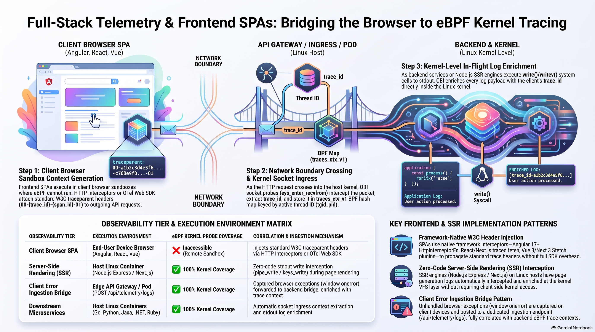
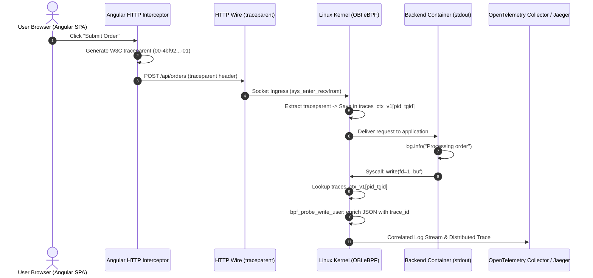

# Frontend Single Page Applications (SPA) & Server-Side Rendering (SSR) Telemetry Guide

> **Reference Documentation**:
> - [Zero-Code Trace-Log Correlation with OBI (Official Blog Announcement)](reference-blog-announcement.md)
> - [W3C Trace Context Specification (Recommendation)](https://www.w3.org/TR/trace-context/)
> - [OpenTelemetry Browser JavaScript SDK](https://opentelemetry.io/docs/languages/js/libraries/)

---

> **Documentation Hub**: [🏠 Overview](../README.md) &nbsp;|&nbsp; [📜 Announcement](reference-blog-announcement.md) &nbsp;|&nbsp; [🏛️ Architecture](architecture.md) &nbsp;|&nbsp; [📋 Day 0: Sizing](day0-planning-sizing.md) &nbsp;|&nbsp; [📦 Day 1: Deploy](day1-installation.md) &nbsp;|&nbsp; [🚨 Day 2: Ops](day2-operations-triage.md) &nbsp;|&nbsp; [💧 Log Filtering](log-filtering-guide.md) &nbsp;|&nbsp; [⚡ Runtimes](runtime-compatibility.md) &nbsp;|&nbsp; [🌐 Frontend](frontend-spa-ssr-telemetry.md) &nbsp;|&nbsp; [🕸️ Service Mesh](service-mesh-vs-ebpf-observability.md) &nbsp;|&nbsp; [📊 Tool Comparison](obi-vs-modern-observability-tools.md) &nbsp;|&nbsp; [🔧 Troubleshooting](troubleshooting.md) &nbsp;|&nbsp; [🧹 Decommission](decommission-guide.md) &nbsp;|&nbsp; [📚 References](references.md)

---

## Table of Contents
- [1. Executive Summary](#1-executive-summary)
- [2. The Architectural Boundary: Client Browser vs Linux Kernel Space](#2-the-architectural-boundary-client-browser-vs-linux-kernel-space)
- [3. End-to-End Distributed Trace Sequence](#3-end-to-end-distributed-trace-sequence)
- [4. The Core Dilemma: Why eBPF Cannot Probe Client Browsers](#4-the-core-dilemma-why-ebpf-cannot-probe-client-browsers)
- [5. Frontend Solutions Comparison Matrix](#5-frontend-solutions-comparison-matrix)
- [6. Framework Implementations & Code Patterns](#6-framework-implementations--code-patterns)
  - [A. Angular 17+ Functional HTTP Interceptor](#a-angular-17-functional-http-interceptor)
  - [B. React / Next.js 14+ App Router Traced Fetch](#b-react--nextjs-14-app-router-traced-fetch)
  - [C. Vue 3 / Nuxt 3 `$fetch` Interceptor Plugin](#c-vue-3--nuxt-3-fetch-interceptor-plugin)
  - [D. Production OpenTelemetry Official Browser SDK](#d-production-opentelemetry-official-browser-sdk)
- [7. The Browser Telemetry Ingestion Bridge Pattern](#7-the-browser-telemetry-ingestion-bridge-pattern)
- [8. Server-Side Rendering (SSR) & Server Components Deep Dive](#8-server-side-rendering-ssr--server-components-deep-dive)
  - [Working Synchronous SSR Logging](#working-synchronous-ssr-logging)
  - [Broken Decoupled SSR Logging](#broken-decoupled-ssr-logging)
- [9. Runnable Microservice Reference](#9-runnable-microservice-reference)
- [10. Public References & Standards Catalog](#10-public-references--standards-catalog)
  - [1. W3C Standards & Distributed Tracing Specifications](#1-w3c-standards--distributed-tracing-specifications)
  - [2. OpenTelemetry Documentation & eBPF Kernel Instrumentation](#2-opentelemetry-documentation--ebpf-kernel-instrumentation)
  - [3. Frontend Framework Documentation & HTTP Interception](#3-frontend-framework-documentation--http-interception)
  - [4. Local Guides & Architecture Blueprints in this Repository](#4-local-guides--architecture-blueprints-in-this-repository)

---

## 1. Executive Summary

OpenTelemetry eBPF Instrumentation (OBI) operates transparently at the Linux kernel boundary (`sys_enter_write`, `sys_enter_recvfrom`), correlating backend container stdout/stderr logs with active distributed traces without application modification.

However, frontend Single Page Applications (SPAs)—such as **Angular**, **React**, **Vue**, and **Svelte**—execute client-side inside end users' web browsers (Chrome, Firefox, Safari) on devices across macOS, Windows, iOS, and Android. Because client-side JavaScript execution occurs outside the host Linux kernel running the backend workloads, browser `console.log()` calls never generate system calls on the Kubernetes host.

This guide provides the authoritative architectural blueprint for bridging frontend clients with OBI backend kernel-level log enrichment via **W3C Trace Context propagation (`traceparent`)**, **Server-Side Rendering (SSR) log interception**, and **client telemetry ingestion bridges**.

---

## 2. The Architectural Boundary: Client Browser vs Linux Kernel Space

[](images/full-stack-telemetry-via-ebpf.png)

> [!TIP]
> **Full-Resolution Visual Architecture**: View the master diagram in full lossless resolution at [`images/full-stack-telemetry-via-ebpf.png`](images/full-stack-telemetry-via-ebpf.png) or high-definition JPEG at [`images/full-stack-telemetry-via-ebpf.jpg`](images/full-stack-telemetry-via-ebpf.jpg).


---

## 3. End-to-End Distributed Trace Sequence



---

## 4. The Core Dilemma: Why eBPF Cannot Probe Client Browsers

1. **Client-Side Execution (Outside Host Kernel)**:
   - When an Angular, React, or Vue application runs in a client browser, all JavaScript execution occurs on the end user's device.
   - Browser calls to `console.log("Processing payment")` write into the browser engine's internal memory buffer.
   - **No Linux system calls occur on the backend host.** Because eBPF probes (`kprobe:sys_enter_write`, `sys_enter_recvfrom`) reside strictly in the Linux kernel (Ring 0) of the servers hosting backend microservices, they cannot inspect the client device's memory or browser process.
2. **The Distributed Tracing Solution (W3C HTTP Bridge)**:
   - The frontend application creates a client span and injects the W3C Trace Context standard HTTP header into outgoing network requests:
     ```http
     POST /api/orders HTTP/1.1
     Host: api.example.com
     traceparent: 00-4bf92f3577b34da6a3ce929d0e0e4736-00f067aa0ba902b7-01
     ```
   - When this HTTP packet lands on the Linux server running your backend container, **OBI intercepts socket ingress (`sys_enter_recvfrom`)**, extracts the `traceparent` header, and registers the `TraceID` (`4bf92f3577b34da6a3ce929d0e0e4736`) into the kernel BPF map (`traces_ctx_v1`).
   - When backend containers emit logs to stdout (`write(1, ...)`), OBI enriches them with that exact Trace ID.
3. **Server-Side Rendering (SSR) & Server Components**:
   - When an application uses Server-Side Rendering (Angular SSR, Next.js App Router, Nuxt 3 Nitro), initial page rendering executes **on the server inside a Node.js container on Linux**.
   - During SSR, server-side `console.log()` calls **DO execute `write(1, ...)` syscalls on the Linux kernel** and are directly intercepted and enriched by OBI eBPF.

---

## 5. Frontend Solutions Comparison Matrix

| Frontend Solution | Client Execution Location | Server SSR Engine & Runtime | eBPF Kernel Syscall Visibility | Recommended Client Trace Injection | SSR Server-Side Log Interception |
| :--- | :--- | :--- | :--- | :--- | :--- |
| **Angular 17+ (SPA)** | Browser (V8 / JSC) | None (Static Nginx / S3) | ❌ None (Client OS) | `HttpInterceptorFn` ([`telemetry.interceptor.ts`](../demo-apps/frontend-angular/src/app/telemetry.interceptor.ts)) | N/A |
| **Angular 17+ (SSR)** | Browser (V8 / JSC) | Node.js 20 (`@angular/ssr` / Express) | ✅ Full on Server SSR | `HttpInterceptorFn` on client; direct stdout on server | ✅ OBI intercepts Node.js `process.stdout.write()` |
| **React / Next.js 14+** | Browser (Client Components) | Node.js 20 (Server Components / RSC) | ✅ Full on Server SSR | `tracedFetch` wrapper ([`nextjs-instrumentation.ts`](../demo-apps/frontend-angular/other-solutions/nextjs-instrumentation.ts)) | ✅ OBI intercepts Node.js `console.log()` |
| **Vue 3 / Nuxt 3** | Browser (Vue Engine) | Node.js (Nitro Engine) | ✅ Full on Server SSR | Nuxt plugin overriding `$fetch` ([`nuxt-fetch-plugin.ts`](../demo-apps/frontend-angular/other-solutions/nuxt-fetch-plugin.ts)) | ✅ OBI intercepts Nitro server stdout |
| **Svelte 5 / SvelteKit** | Browser (Svelte DOM) | Node.js (`adapter-node`) | ✅ Full on Server SSR | `handleFetch` client hook in `hooks.client.ts` | ✅ OBI intercepts SvelteKit server stdout |
| **Vanilla JS / HTMX** | Browser (DOM Script) | None (Static) | ❌ None (Client OS) | Custom `fetch` interceptor / `hx-headers` | N/A |

---

## 6. Framework Implementations & Code Patterns

### A. Angular 17+ Functional HTTP Interceptor
As implemented in [`demo-apps/frontend-angular/src/app/telemetry.interceptor.ts`](../demo-apps/frontend-angular/src/app/telemetry.interceptor.ts):

```typescript
import { HttpInterceptorFn, HttpRequest, HttpHandlerFn } from '@angular/common/http';

export const openTelemetryInterceptor: HttpInterceptorFn = (req: HttpRequest<unknown>, next: HttpHandlerFn) => {
  if (req.headers.has('traceparent')) {
    return next(req);
  }

  // Generate 16-byte TraceID and 8-byte SpanID
  const traceId = generateHex(16);
  const spanId = generateHex(8);
  const traceparent = `00-${traceId}-${spanId}-01`;

  const tracedReq = req.clone({
    setHeaders: { 
      traceparent,
      baggage: 'frontend.framework=angular17,client.type=spa'
    }
  });

  return next(tracedReq);
};
```

### B. React / Next.js 14+ App Router Traced Fetch
As implemented in [`demo-apps/frontend-angular/other-solutions/nextjs-instrumentation.ts`](../demo-apps/frontend-angular/other-solutions/nextjs-instrumentation.ts):

```typescript
// Traced Fetch wrapper for Next.js Client Components
export async function tracedFetch(input: RequestInfo | URL, init?: RequestInit): Promise<Response> {
  const headers = new Headers(init?.headers);

  if (!headers.has('traceparent')) {
    const traceId = generateHex(16);
    const spanId = generateHex(8);
    headers.set('traceparent', `00-${traceId}-${spanId}-01`);
    headers.set('baggage', 'client.framework=nextjs-app-router');
  }

  return fetch(input, { ...init, headers });
}
```

### C. Vue 3 / Nuxt 3 `$fetch` Interceptor Plugin
As implemented in [`demo-apps/frontend-angular/other-solutions/nuxt-fetch-plugin.ts`](../demo-apps/frontend-angular/other-solutions/nuxt-fetch-plugin.ts):

```typescript
// Nuxt 3 plugin auto-injecting traceparent on all outgoing $fetch calls
export default defineNuxtPlugin(() => {
  globalThis.$fetch = $fetch.create({
    onRequest({ options }) {
      options.headers = options.headers || {};
      const headers = new Headers(options.headers);
      if (!headers.has('traceparent')) {
        headers.set('traceparent', `00-${generateHex(16)}-${generateHex(8)}-01`);
        options.headers = headers;
      }
    }
  });
});
```

### D. Production OpenTelemetry Official Browser SDK
As implemented in [`demo-apps/frontend-angular/other-solutions/otel-web-sdk.ts`](../demo-apps/frontend-angular/other-solutions/otel-web-sdk.ts):

```typescript
import { WebTracerProvider } from '@opentelemetry/sdk-trace-web';
import { registerInstrumentations } from '@opentelemetry/instrumentation';
import { FetchInstrumentation } from '@opentelemetry/instrumentation-fetch';

const provider = new WebTracerProvider();
provider.register();

registerInstrumentations({
  instrumentations: [
    new FetchInstrumentation({
      propagateTraceHeaderCorsUrls: [/.*/],
    }),
  ],
});
```

---

<a id="7-browser-telemetry-ingestion-bridge-pattern"></a>
## 7. The Browser Telemetry Ingestion Bridge Pattern

To capture frontend client exceptions and UI logs without deploying a separate proprietary RUM service, the frontend forwards telemetry to the backend server:

```typescript
// Browser client error handler
window.onerror = (message, source, lineno, colno, error) => {
  const activeTrace = getActiveTraceContext(); // Retrieves active traceparent
  navigator.sendBeacon('/api/telemetry/logs', JSON.stringify({
    event: 'client_javascript_error',
    message,
    source,
    line: lineno,
    traceparent: activeTrace
  }));
};
```

When `POST /api/telemetry/logs` arrives at the server, **OBI intercepts the socket call**, captures the client's `traceparent`, and decorates the server's stdout log write. This binds client-side JavaScript crashes directly into the distributed trace.

---

## 8. Server-Side Rendering (SSR) & Server Components Deep Dive

When Angular 17+ SSR (`@angular/ssr`) or Next.js runs in full-stack mode:
* Initial component rendering executes **server-side in Node.js on a Linux host**.
* Server-side `console.log()` statements **DO execute `write(1, ...)` syscalls on the Linux kernel host**.
* OBI intercepts these SSR logs directly during page pre-rendering, associating them with the incoming page navigation trace.

### Working Synchronous SSR Logging
```typescript
// WORKING: Synchronous write on the active SSR request event-loop tick
process.stdout.write(JSON.stringify({
  timestamp: new Date().toISOString(),
  level: "INFO",
  msg: "Angular SSR: Pre-rendered page /checkout",
  pid: process.pid
}) + "\n");
```

### Broken Decoupled SSR Logging
```typescript
// BROKEN: Logging after the SSR HTTP response has finished
setTimeout(() => {
  process.stdout.write(JSON.stringify({ msg: "SSR render completed" }) + "\n");
}, 100);
```
Because the `write()` syscall executes after the request socket has closed, eBPF thread tracking loses the active trace context.

---

## 9. Runnable Microservice Reference

A full production-grade demonstration featuring the Angular 17+ SPA HTTP interceptor, Node.js SSR Express engine, and multi-framework reference solutions is provided in [`demo-apps/frontend-angular/`](../demo-apps/frontend-angular/):

* [`server.js`](../demo-apps/frontend-angular/server.js) — Express SSR server & telemetry ingestion bridge.
* [`src/app/telemetry.interceptor.ts`](../demo-apps/frontend-angular/src/app/telemetry.interceptor.ts) — Angular 17+ functional interceptor.
* [`src/app/app.component.ts`](../demo-apps/frontend-angular/src/app/app.component.ts) — Angular root component.
* [`other-solutions/nextjs-instrumentation.ts`](../demo-apps/frontend-angular/other-solutions/nextjs-instrumentation.ts) — React / Next.js 14+ App Router traced fetch.
* [`other-solutions/nuxt-fetch-plugin.ts`](../demo-apps/frontend-angular/other-solutions/nuxt-fetch-plugin.ts) — Vue 3 / Nuxt 3 `$fetch` telemetry plugin.
* [`other-solutions/otel-web-sdk.ts`](../demo-apps/frontend-angular/other-solutions/otel-web-sdk.ts) — Official OpenTelemetry Web SDK integration.
* [`Dockerfile`](../demo-apps/frontend-angular/Dockerfile) — Minimal Alpine non-root container (`node:20-alpine`).
* [`README.md`](../demo-apps/frontend-angular/README.md) — Microservice runbook and step-by-step verification commands.

---

## 10. Public References & Standards Catalog

### 1. W3C Standards & Distributed Tracing Specifications
* **[W3C Trace Context (Recommendation)](https://www.w3.org/TR/trace-context/)**:
  * *Summary*: Defines the standard HTTP headers `traceparent` (`00-{trace_id}-{span_id}-{flags}`) and `tracestate` across vendor boundaries.
  * *Relevance*: This standard is the wire protocol that enables frontend browser actions (Angular, React, Vue) to bridge into the host Linux kernel socket ingress probes monitored by OBI.
* **[W3C Baggage Specification](https://www.w3.org/TR/baggage/)**:
  * *Summary*: Defines user-defined key-value metadata pairs propagated across distributed request boundaries without altering span identifiers.
  * *Relevance*: Allows frontend applications to propagate user context (`client.framework=angular17`, `app.version=2.4.0`) that travels untouched through backend microservice hops.

---

### 2. OpenTelemetry Documentation & eBPF Kernel Instrumentation
* **[OpenTelemetry Web & Browser JavaScript SDK Documentation](https://opentelemetry.io/docs/languages/js/libraries/)**:
  * *Summary*: Official guide on instrumenting client-side JavaScript applications running inside web browsers.
  * *Relevance*: Outlines how `@opentelemetry/sdk-trace-web` initializes browser tracer providers and creates user-interaction spans.
* **[OpenTelemetry eBPF Instrumentation (OBI) Documentation](https://opentelemetry.io/docs/zero-code/obi/)**:
  * *Summary*: Official documentation for deploying and configuring OBI DaemonSets and eBPF kernel instrumentation.
  * *Relevance*: Details kernel privilege requirements (`CAP_SYS_ADMIN`), Linux 6.0+ `write()` syscall interception, and DaemonSet configurations.
* **[Zero-Code Trace-Log Correlation with OBI (Announcement)](https://opentelemetry.io/blog/2026/obi-trace-log-correlation/)**:
  * *Summary*: Primary upstream announcement detailing in-flight `write()`/`writev()` syscall interception, mid-flight payload enrichment, and NUL byte placeholder suppression.
* **[OpenTelemetry eBPF Instrumentation Repository](https://github.com/open-telemetry/opentelemetry-ebpf-instrumentation)**:
  * *Summary*: Upstream GitHub repository containing OBI's eBPF C programs, Go userspace daemon, and socket ingress probe logic.
* **[OpenTelemetry JS Contrib Repository](https://github.com/open-telemetry/opentelemetry-js-contrib)**:
  * *Summary*: Houses official browser auto-instrumentation packages: `@opentelemetry/instrumentation-fetch`, `@opentelemetry/instrumentation-xml-http-request`, and `@opentelemetry/context-zone`.
* **[OpenTelemetry JS Core Repository](https://github.com/open-telemetry/opentelemetry-js)**:
  * *Summary*: Core OpenTelemetry API and SDK repository for JavaScript and TypeScript across browser and Node.js runtimes.

---

### 3. Frontend Framework Documentation & HTTP Interception
* **[Angular Documentation: HttpClient Interceptors](https://angular.dev/guide/http/interceptors)**:
  * *Summary*: Official guide for creating functional interceptors (`HttpInterceptorFn`) in Angular 17+ to inspect, mutate, and attach headers to outgoing HTTP requests.
* **[Angular Documentation: Server-Side Rendering (SSR) & Prerendering](https://angular.dev/guide/ssr)**:
  * *Summary*: Production deployment guide for `@angular/ssr`, configuring Node.js Express servers for initial page rendering and hydration.
* **[Next.js Documentation: OpenTelemetry Instrumentation](https://nextjs.org/docs/app/building-your-application/optimizing/open-telemetry)**:
  * *Summary*: Official guide for configuring distributed tracing in Next.js App Router using the root `instrumentation.ts` file and `@vercel/otel`.
* **[Nuxt 3 Documentation: Plugins & Lifecycle Hooks](https://nuxt.com/docs/guide/directory-structure/plugins)**:
  * *Summary*: Official guide for creating Nuxt 3 client and server plugins, extending the `$fetch` (ofetch) HTTP client, and handling SSR lifecycle hooks.

---

### 4. Local Guides & Architecture Blueprints in this Repository
* **[`docs/runtime-compatibility.md`](runtime-compatibility.md)**:
  * *Summary*: In-depth analysis of language runtimes (Go, Python, Node.js, Java, .NET, Ruby, and Frontend SPAs/SSR) and how OBI prevents context staleness.
* **[`docs/architecture.md`](architecture.md)**:
  * *Summary*: Exhaustive breakdown of Linux kernel syscall hooks (`sys_enter_write`, `sys_enter_recvfrom`), BPF hash maps (`traces_ctx_v1`), user buffer suppression, and 8 KiB buffer split behavior.
* **[`docs/references.md`](references.md)**:
  * *Summary*: Master reference directory indexing all upstream OBI specifications, Kubernetes overlays, and community channels.
* **[`README.md`](../README.md)**:
  * *Summary*: Master repository documentation, architecture diagrams, multi-cloud Kubernetes overlays (OpenShift, AKS, EKS, GKE, RKE2), and local Docker Compose quickstart.

---

## 🧭 Navigation & Documentation Directory

| ⬅️ Previous Document | 🏠 Documentation Hub | ➡️ Next Document |
| :--- | :---: | ---: |
| [**Runtime Compatibility Guide**](runtime-compatibility.md) | [**Repository Overview**](../README.md) | [**Service Mesh vs. eBPF Observability**](service-mesh-vs-ebpf-observability.md) |

### 📚 Complete Guide Catalog
- 📜 **[Official Reference Announcement](reference-blog-announcement.md)** — Verbatim OpenTelemetry announcement with junior primers and kernel deep dives
- 🏛️ **[Architecture Deep Dive](architecture.md)** — Low-level syscall hooks (`pipe_write`, `ksys_write`, `do_writev`), LRU maps, and ringbuffer flow
- 📋 **[Day 0: Planning & Sizing](day0-planning-sizing.md)** — Linux 6.0+ matrix, kernel lockdown, memory sizing formulas, and security postures
- 📦 **[Day 1: Multi-Cluster Deployment](day1-installation.md)** — Enterprise overlays for OpenShift 4.20+, AKS, EKS, GKE, RKE2, and Docker Compose
- 🚨 **[Day 2: Operations & Incident Triage](day2-operations-triage.md)** — SRE incident response playbook, LogQL/Jaeger queries, and canary rollouts
- 💧 **[Log Shipper Filtering Guide](log-filtering-guide.md)** — Suppressed NUL byte placeholder drop filters and 8 KiB write split handling
- ⚡ **[Runtime Compatibility Guide](runtime-compatibility.md)** — Go runtime hooks, `PYTHONUNBUFFERED=1`, Node.js async streams, and Java Loom
- 🌐 **[Frontend SPAs & SSR Telemetry Guide](frontend-spa-ssr-telemetry.md)** — W3C `traceparent` HTTP bridge, Angular/React/Vue patterns, and SSR kernel interception
- 🕸️ **[Service Mesh vs. eBPF Observability Guide](service-mesh-vs-ebpf-observability.md)** — Architectural comparison between Istio Ambient (ztunnel/waypoint) network proxying and OBI kernel-level trace-log enrichment
- 📊 **[OBI vs. Modern Observability Tools](obi-vs-modern-observability-tools.md)** — Architectural analysis & strategic conclusions comparing OBI against Datadog, Grafana, Dynatrace & New Relic
- 🔧 **[Troubleshooting & Diagnostics](troubleshooting.md)** — Common pitfalls, eBPF probe errors, missing trace IDs, and verification steps
- 🧹 **[Decommission & Teardown Guide](decommission-guide.md)** — Safe probe detachment, BPF map unpinning, and resource cleanup
- 📚 **[References & Official Documentation](references.md)** — Upstream OpenTelemetry specifications, GitHub repositories, and CNCF channels
