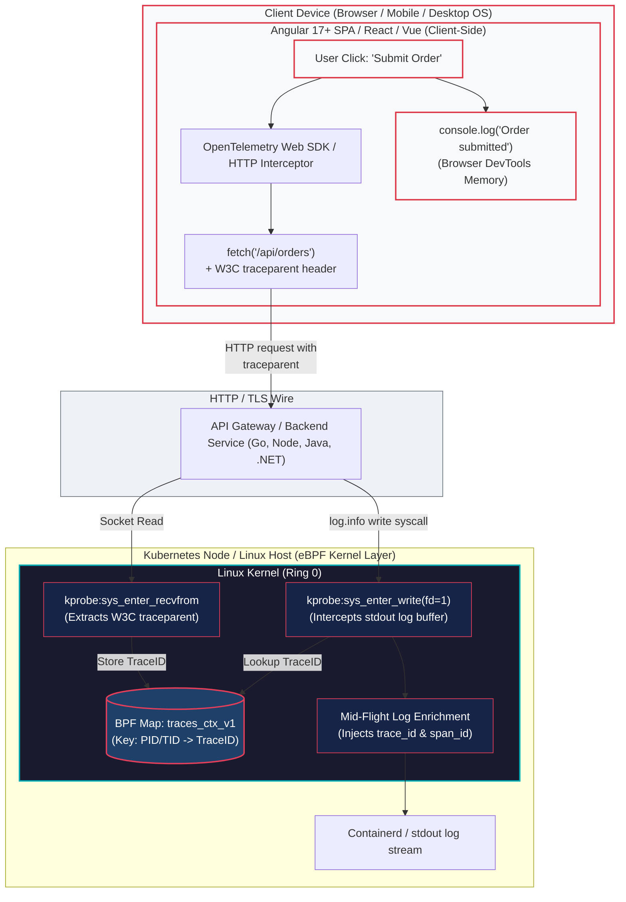
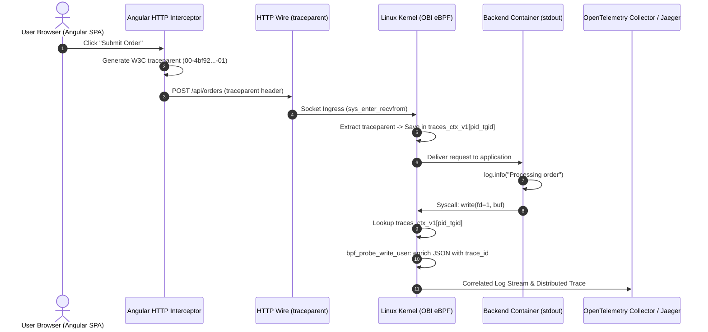

# Frontend Single Page Applications (SPA) & Server-Side Rendering (SSR) Telemetry Guide

> **Reference Documentation**:
>
> - [Zero-Code Trace-Log Correlation with OBI (Official Blog Announcement)](reference-blog-announcement.md)
> - [W3C Trace Context Specification (Recommendation)](https://www.w3.org/TR/trace-context/)
> - [OpenTelemetry Browser JavaScript SDK](https://opentelemetry.io/docs/languages/js/libraries/)

---

> **Documentation Hub**: [🏠 Overview](../README.md) &nbsp;|&nbsp; [📜 Announcement](reference-blog-announcement.md) &nbsp;|&nbsp; [🏛️ Architecture](architecture.md) &nbsp;|&nbsp; [📋 Day 0: Sizing](day0-planning-sizing.md) &nbsp;|&nbsp; [📦 Day 1: Deploy](day1-installation.md) &nbsp;|&nbsp; [🚨 Day 2: Ops](day2-operations-triage.md) &nbsp;|&nbsp; [💧 Log Filtering](log-filtering-guide.md) &nbsp;|&nbsp; [⚡ Runtimes](runtime-compatibility.md) &nbsp;|&nbsp; [🌐 Frontend](frontend-spa-ssr-telemetry.md) &nbsp;|&nbsp; [🕸️ Service Mesh](service-mesh-vs-ebpf-observability.md) &nbsp;|&nbsp; [📊 Tool Comparison](obi-vs-modern-observability-tools.md) &nbsp;|&nbsp; [📈 Grafana & K8s](grafana-and-k8s-observability.md) &nbsp;|&nbsp; [📊 Metrics & Telemetry](ebpf-metrics-and-telemetry.md) &nbsp;|&nbsp; [🔧 Troubleshooting](troubleshooting.md) &nbsp;|&nbsp; [🧹 Decommission](decommission-guide.md) &nbsp;|&nbsp; [📚 References](references.md)

---

## 📑 Table of Contents

- [🎥 Multimedia Deep Dives & Architectural Audio-Visual Guides](#-multimedia-deep-dives--architectural-audio-visual-guides)
- [1. Executive Summary](#1-executive-summary)
- [2. The Architectural Boundary: Client Browser vs Linux Kernel Space](#2-the-architectural-boundary-client-browser-vs-linux-kernel-space)
- [3. End-to-End Distributed Trace Sequence](#3-end-to-end-distributed-trace-sequence)
- [4. The Core Dilemma: Why eBPF Cannot Probe Client Browsers](#4-the-core-dilemma-why-ebpf-cannot-probe-client-browsers)
- [5. Frontend Solutions Comparison Matrix](#5-frontend-solutions-comparison-matrix)
- [6. Framework Implementations & Code Patterns](#6-framework-implementations--code-patterns)
  - [A. Angular 17+ Functional HTTP Interceptor](#a-angular-17-functional-http-interceptor)
  - [B. React / Next.js 14+ App Router Traced Fetch](#b-react--nextjs-14-app-router-traced-fetch)
  - [C. Vue 3 / Nuxt 3 `$fetch` Interceptor Plugin](#c-vue-3--nuxt-3-fetch-interceptor-plugin)
  - [D. Production OpenTelemetry Official Browser SDK](#d-production-opentelemetry-official-browser-sdk)
- [7. The Browser Telemetry Ingestion Bridge Pattern](#7-the-browser-telemetry-ingestion-bridge-pattern)
- [8. Server-Side Rendering (SSR) & Server Components Deep Dive](#8-server-side-rendering-ssr--server-components-deep-dive)
  - [Working Synchronous SSR Logging](#working-synchronous-ssr-logging)
  - [Broken Decoupled SSR Logging](#broken-decoupled-ssr-logging)
- [9. Runnable Microservice Reference](#9-runnable-microservice-reference)
- [10. Public References & Standards Catalog](#10-public-references--standards-catalog)
  - [1. W3C Standards & Distributed Tracing Specifications](#1-w3c-standards--distributed-tracing-specifications)
  - [2. OpenTelemetry Documentation & eBPF Kernel Instrumentation](#2-opentelemetry-documentation--ebpf-kernel-instrumentation)
  - [3. Frontend Framework Documentation & HTTP Interception](#3-frontend-framework-documentation--http-interception)
  - [4. Local Guides & Architecture Blueprints in this Repository](#4-local-guides--architecture-blueprints-in-this-repository)

---

### 🎥 Multimedia Deep Dives & Architectural Audio-Visual Guides

This guide is supported by dedicated educational audio-visual deep dives synthesized with **Gemini NotebookLM** that specifically address the boundary between client browsers, W3C context propagation, and host Linux kernel interception, as well as runtime event-loop buffering in Server-Side Rendering (SSR). All episodes and technical shorts are hosted on the [**@nubenetes**](https://youtube.com/@nubenetes) YouTube channel.

> [!NOTE]
> **Multilingual Learning Experience**:
> Features native audio in **Spanish 🇪🇸** and **English 🇺🇸**, with automated closed captions (CC) translated into **20+ languages** (Spanish, French, German, Japanese, Portuguese, Italian, Arabic, Hindi, etc.) for full-stack, frontend, and SRE teams.

#### 📊 Curated Frontend SPAs & SSR Telemetry Collection (13 Episodes)

| Format | Episode / Title | Domain / Focus | Language | Duration | Direct YouTube Link |
|:---:|---|---|:---:|:---:|---|
| 📽️ **Video Guide** | [**Browser to Kernel: Zero-Code Trace-Log Correlation with eBPF & OBI**](https://www.youtube.com/watch?v=PpcLms88DrI) | **Browser to Kernel**: sandboxed SPAs, W3C HTTP propagation, socket ingress y correlación mid-flight | 🇺🇸 English *(CC 20+)* | `8:20` | [▶️ Watch Video](https://www.youtube.com/watch?v=PpcLms88DrI) |
| 📽️ **Video Guide** | [**Server-Side Rendering Telemetry: Next.js, Node.js & OpenTelemetry eBPF**](https://www.youtube.com/watch?v=eS7OHoRtfC8) | **SSR & Node.js Runtimes**: event-loop decoupling, streams asíncronos y puentes de ingesta | 🇺🇸 English *(CC 20+)* | `7:43` | [▶️ Watch Video](https://www.youtube.com/watch?v=eS7OHoRtfC8) |
| 📽️ **Video Guide** | [**Telemetría Full Stack con eBPF: De SPAs y SSR al Kernel en Linux**](https://www.youtube.com/watch?v=aRfPpFjYiFM) | **Telemetría Full-Stack**: React, Angular, Node.js SSR, llamadas `write`/`recvfrom` y triaje a las 2 AM | 🇪🇸 Spanish *(CC 20+)* | `7:55` | [▶️ Ver Video](https://www.youtube.com/watch?v=aRfPpFjYiFM) |
| 📽️ **Video Guide** | [**Telemetría Full Stack OBI: Conectando el Navegador con el Kernel**](https://www.youtube.com/watch?v=ulOScXmXit8) | **6 Etapas Arquitectónicas**: del clic del usuario a la intercepción en socket y enriquecimiento zero-code | 🇪🇸 Spanish *(CC 20+)* | `5:42` | [▶️ Ver Video](https://www.youtube.com/watch?v=ulOScXmXit8) |
| 📽️ **Video Guide** | [**Conecta la Telemetría Frontend al Backend con OpenTelemetry y eBPF**](https://www.youtube.com/watch?v=eHCTIUg4GmY) | **Tres Pilares Full-Stack**: Navegador, Puentes de Ingesta y SSR | 🇪🇸 Spanish *(CC 20+)* | `2:52` | [▶️ Ver Video](https://www.youtube.com/watch?v=eHCTIUg4GmY) |
| 📽️ **Video Guide** | [**Connecting Browser Clicks to eBPF Logs: Full-Stack Architecture Guide**](https://www.youtube.com/watch?v=l2ehRwv8z-g) | **Three Full-Stack Pillars**: sandboxed SPAs, client ingestion bridges & SSR | 🇺🇸 English *(CC 20+)* | `2:29` | [▶️ Watch Video](https://www.youtube.com/watch?v=l2ehRwv8z-g) |
| 📽️ **Video Guide** | [**Bridging SPA and SSR Telemetry with OpenTelemetry eBPF**](https://www.youtube.com/watch?v=I26MdWvlEeg) | **Full-Stack Telemetry Gap**: client HTTP interceptors, kernel socket capture & SSR | 🇺🇸 English *(CC 20+)* | `2:45` | [▶️ Watch Video](https://www.youtube.com/watch?v=I26MdWvlEeg) |
| 🎙️ **Audio Podcast** | [**Podcast: Correlating Browser Clicks with Kernel Logs: Full-Stack OBI Deep Dive**](https://www.youtube.com/watch?v=YKPsm3iLVmk) | **Conversational Blueprint**: del sandbox del navegador al kernel eBPF y SSR | 🇺🇸 English *(CC 20+)* | `22:34` | [▶️ Listen Podcast](https://www.youtube.com/watch?v=YKPsm3iLVmk) |
| 🎙️ **Audio Podcast** | [**Podcast: Observabilidad del Navegador al Kernel con eBPF y OpenTelemetry OBI**](https://www.youtube.com/watch?v=6Yvs6DSSUdI) | **Analogía Postal y Trazas**: frontera del navegador, cabeceras W3C y stamping en Linux | 🇪🇸 Spanish *(CC 20+)* | `24:04` | [▶️ Escuchar Podcast](https://www.youtube.com/watch?v=6Yvs6DSSUdI) |
| 🎙️ **Audio Podcast** | [**Podcast: Correlación Zero-Code de Logs y Trazas: Service Mesh vs. Kernel eBPF (OBI)**](https://www.youtube.com/watch?v=kP_FrCcn_jE) | **Del Navegador al Kernel**: frontend SPAs (React, Angular), cabeceras W3C traceparent y captura en `sys_recvfrom` | 🇪🇸 Spanish *(CC 20+)* | `12:50` | [▶️ Escuchar Podcast](https://www.youtube.com/watch?v=kP_FrCcn_jE) |
| ⚡ **Technical Short** | [**Frontend SPA Telemetry: How W3C Trace Context Connects Clicks to Logs**](https://www.youtube.com/shorts/fPy7vW2vRDQ) | **Click-to-Log Propagation**: interceptor HTTP, W3C traceparent y captura en kernel map | 🇺🇸 English *(CC 20+)* | `1:11` | [▶️ Watch Short](https://www.youtube.com/shorts/fPy7vW2vRDQ) |
| ⚡ **Technical Short** | [**Cómo Conectar el Frontend con eBPF: Del Navegador al Kernel en Linux**](https://www.youtube.com/shorts/QdUdLTSOyZE) | **Del Clic a la Línea de Código**: barrera física del navegador, cabecera W3C y kernel stamping | 🇪🇸 Spanish *(CC 20+)* | `1:11` | [▶️ Ver Short](https://www.youtube.com/shorts/QdUdLTSOyZE) |
| ⚡ **Technical Short** | [**Why eBPF Trace-Log Correlation Loses Context: Async Buffers and Runtime Caveats**](https://www.youtube.com/shorts/b9oNWMJlUcc) | **Node.js SSR Runtime Buffering**: event-loop decoupling, async stdout streams y pérdidas de contexto en Server-Side Rendering | 🇺🇸 English *(CC 20+)* | `1:24` | [▶️ Watch Short](https://www.youtube.com/shorts/b9oNWMJlUcc) |

<details>
<summary>📂 <strong>Detailed Agendas & Architectural Relevance</strong></summary>

<br/>

#### 1. Browser to Kernel: Zero-Code Trace-Log Correlation with eBPF & OBI (8:20)
- 🔗 **Direct Link**: [https://www.youtube.com/watch?v=PpcLms88DrI](https://www.youtube.com/watch?v=PpcLms88DrI)
- ⏱️ **Duration**: 8:20
- 🏷️ **Domain**: Frontend Browser Sandbox & Linux Kernel Socket Interception
- 📝 **Full Description**:
> 🌐 Architectural Masterclass: From Browser Sandbox to Linux Kernel with OpenTelemetry eBPF (OBI)
>
> Full 8-minute technical walkthrough exploring how OpenTelemetry eBPF Instrumentation (OBI) bridges the gap between client-side browser single page applications (SPAs) and host Linux kernel logging.
>
> Learn how to trace a user request chronologically from a frontend button click, across the network wire, through kernel socket ingress, down to mid-flight log enrichment in Ring 0 without changing a single line of application source code.
>
> 📌 Key Architectural Milestones Explored:
>
> - The Midnight Triage Crisis: Receiving a failing trace alert at 2:00 AM and encountering completely orphaned backend logs.
> - The Browser Sandbox Boundary: Why client JavaScript (React, Angular, Vue) runs in isolated user devices and cannot execute Linux eBPF probes.
> - W3C Trace Context Propagation: How frontend HTTP interceptors generate and inject traceparent headers (00-trace_id-span_id-01) across outgoing network boundaries.
> - Kernel Socket Interception: How sys_enter_recvfrom intercepts incoming HTTP packets and populates the traces_ctx_v1 BPF map.
> - Mid-Flight Syscall Enrichment: How sys_enter_write intercepts backend stdout/stderr streams and stamps active trace identifiers.
> - Unified Incident Resolution: Bridging user clicks to root-cause backend log lines in seconds.
>
> 🔗 Official Blueprint Repository & Documentation:
>
> - GitHub Blueprint Repository: https://github.com/nubenetes/obi-trace-log-correlation
> - Frontend SPAs & SSR Telemetry Guide: https://github.com/nubenetes/obi-trace-log-correlation/blob/main/docs/frontend-spa-ssr-telemetry.md
> - OpenTelemetry Official Announcement: https://opentelemetry.io/blog/2026/obi-trace-log-correlation/
>
> ⏱️ Duration: 8:20
> #OpenTelemetry #eBPF #Frontend #Kubernetes #DistributedTracing #Observability #SRE #DevOps #Angular #React

#### 2. Server-Side Rendering Telemetry: Next.js, Node.js & OpenTelemetry eBPF (7:43)
- 🔗 **Direct Link**: [https://www.youtube.com/watch?v=eS7OHoRtfC8](https://www.youtube.com/watch?v=eS7OHoRtfC8)
- ⏱️ **Duration**: 7:43
- 🏷️ **Domain**: Server-Side Rendering (SSR) & Node.js Event-Loop Telemetry
- 📝 **Full Description**:
> ⚡ Architectural Deep Dive: Server-Side Rendering (SSR) Telemetry with OpenTelemetry eBPF (OBI)
>
> Full 7-minute systems analysis covering the unique challenges and operational solutions for instrumenting Server-Side Rendering (SSR) applications (Next.js, Nuxt, Node.js Express) with kernel eBPF probes.
>
> Explore why asynchronous runtime buffering causes trace desynchronization and discover production architectural patterns to maintain flawless trace-log correlation across modern full-stack web frameworks.
>
> 📌 Key Technical Modules Explored:
>
> - The SSR Runtime Dilemma: How Node.js single-threaded event loops decouple asynchronous request handling from operating system write syscalls.
> - The Async Buffering Gotcha: Why asynchronous log transports (e.g. Pino async logging, buffered streams) cause eBPF to stamp outdated trace context.
> - Thread-Context Alignment: Ensuring synchronous stream flushes so eBPF hooks capture matching thread IDs (tgid_pid) during active requests.
> - The Client Telemetry Ingestion Bridge: Designing dedicated HTTP ingestion endpoints to forward browser console errors into backend log pipelines.
> - Production Best Practices: Performance baselines, memory consumption, and configuring multi-line log assemblers in Fluent Bit and Vector.
>
> 🔗 Official Blueprint Repository & Documentation:
>
> - GitHub Blueprint Repository: https://github.com/nubenetes/obi-trace-log-correlation
> - Frontend SPAs & SSR Telemetry Guide: https://github.com/nubenetes/obi-trace-log-correlation/blob/main/docs/frontend-spa-ssr-telemetry.md
> - OpenTelemetry Official Announcement: https://opentelemetry.io/blog/2026/obi-trace-log-correlation/
>
> ⏱️ Duration: 7:43
> #OpenTelemetry #eBPF #SSR #NextJS #NodeJS #Kubernetes #Observability #SRE #DevOps #Microservices

#### 3. Telemetría Full Stack con eBPF: De SPAs y SSR al Kernel en Linux (7:55)
- 🔗 **Direct Link**: [https://www.youtube.com/watch?v=aRfPpFjYiFM](https://www.youtube.com/watch?v=aRfPpFjYiFM)
- ⏱️ **Duration**: 7:55
- 🏷️ **Domain**: Telemetría Full-Stack, SPAs, SSR y Kernel de Linux
- 📝 **Full Description**:
> 🌐 Masterclass de Arquitectura: Telemetría Full Stack con eBPF – De SPAs y SSR al Kernel de Linux
>
> Recorrido arquitectónico técnico en español de 8 minutos analizando cómo correlacionar telemetría desde aplicaciones frontend cliente y servidores SSR hasta el kernel de Linux utilizando OpenTelemetry eBPF (OBI).
>
> Descubre cómo resolver el mayor dolor de cabeza de los equipos SRE: conectar clics de usuario y renderizado en servidor con registros de contenedores sin modificar una sola línea de código fuente.
>
> 📌 Puntos Clave de la Sesión:
>
> - El Dilema de la Guardia a las 2:00 AM: Trazas distribuidas impecables en los paneles pero logs de backend totalmente desconectados del contexto de usuario.
> - La Frontera del Navegador: Por qué los clientes frontend (Angular, React, Vue) no pueden ejecutar sondas eBPF y cómo la cabecera W3C traceparent resuelve la conexión.
> - Intercepción en el Kernel: Captura de paquetes en sockets de red (sys_enter_recvfrom) y almacenamiento del trace_id en mapas BPF del kernel.
> - Retos en Server-Side Rendering (SSR): El impacto del bucle de eventos de Node.js y cómo el buffer asíncrono desincroniza el contexto de ejecución.
> - Soluciones de Producción: Modos de escritura síncrona en Pino y Node.js, puentes de ingesta de telemetría y ensamblaje de registros multilínea.
>
> 🔗 Repositorio Blueprint y Documentación Oficial:
>
> - Repositorio Blueprint en GitHub: https://github.com/nubenetes/obi-trace-log-correlation
> - Guía de Telemetría Frontend SPAs y SSR: https://github.com/nubenetes/obi-trace-log-correlation/blob/main/docs/frontend-spa-ssr-telemetry.md
> - Anuncio Oficial de OpenTelemetry: https://opentelemetry.io/blog/2026/obi-trace-log-correlation/
>
> ⏱️ Duración: 7:55
> #OpenTelemetry #eBPF #Frontend #SSR #NodeJS #React #Angular #Kubernetes #Observabilidad #SRE #DevOps

#### 4. Telemetría Full Stack OBI: Conectando el Navegador con el Kernel (5:42)
- 🔗 **Direct Link**: [https://www.youtube.com/watch?v=ulOScXmXit8](https://www.youtube.com/watch?v=ulOScXmXit8)
- ⏱️ **Duration**: 5:42
- 🏷️ **Domain**: Conexión Navegador a Kernel en 6 Etapas Arquitectónicas
- 📝 **Full Description**:
> 🔍 Guía Técnica: Telemetría Full Stack OBI – Conectando el Navegador con el Kernel de Linux
>
> Análisis técnico en español de 6 minutos estructurado en seis etapas fundamentales para mapear el viaje completo de la telemetría: desde un clic en el navegador hasta el kernel del servidor backend.
>
> Aprende la ingeniería de sistemas detrás de OpenTelemetry eBPF (OBI) para unificar la observabilidad full-stack sin tocar código de las aplicaciones.
>
> 📌 Las 6 Etapas Arquitectónicas Analizadas:
>
> - Etapa 1 - El Dilema de la Observabilidad: La barrera física entre el dispositivo del usuario y el servidor en incidentes de producción.
> - Etapa 2 - Trazas desde el Navegador: Generación de identificadores de traza en librerías cliente e interceptores HTTP.
> - Etapa 3 - La Pasarela y Reenvío W3C: Propagación de cabeceras traceparent estándar a través de proxies y balanceadores.
> - Etapa 4 - Intercepción en el Kernel: Detección a nivel de socket por OBI y vinculación con el ID de hilo del sistema operativo.
> - Etapa 5 - Reconciliación Zero-Code: Inyección del Trace ID en llamadas al sistema write() sobre stdout y stderr.
> - Etapa 6 - Triaje y Visibilidad Total: De la alerta en pantalla a la línea de código exacta del microservicio en segundos.
>
> 🔗 Repositorio Blueprint y Documentación Oficial:
>
> - Repositorio Blueprint en GitHub: https://github.com/nubenetes/obi-trace-log-correlation
> - Guía de Telemetría Frontend SPAs y SSR: https://github.com/nubenetes/obi-trace-log-correlation/blob/main/docs/frontend-spa-ssr-telemetry.md
> - Anuncio Oficial de OpenTelemetry: https://opentelemetry.io/blog/2026/obi-trace-log-correlation/
>
> ⏱️ Duración: 5:42
> #OpenTelemetry #eBPF #Frontend #FullStack #W3C #Kubernetes #Observabilidad #SRE #DevOps #Microservicios

#### 5. Podcast de Arquitectura: Correlación Zero-Code de Logs y Trazas: Del Navegador al Kernel (12:50)
- 🔗 **Direct Link**: [https://www.youtube.com/watch?v=kP_FrCcn_jE](https://www.youtube.com/watch?v=kP_FrCcn_jE)
- ⏱️ **Duration**: 12:50
- 🏷️ **Domain**: Frontera del Navegador, Frontend W3C Context (traceparent) & Captura en sys_recvfrom
- 📝 **Full Description**:
> 🎙️ Podcast de Arquitectura: Correlación Zero-Code de Logs y Trazas – Service Mesh vs. Kernel eBPF (Del Navegador al Kernel)
>
> Episodio en formato podcast técnico en español analizando la interacción entre el navegador web del usuario y las sondas eBPF en el kernel de Linux (OpenTelemetry OBI).
>
> 📌 Relevancia Específica para Frontend SPAs & Arquitectura Full-Stack:
>
> - La Frontera del Sandbox del Navegador: Por qué las aplicaciones cliente (React, Angular, Vue) que se ejecutan en navegadores en dispositivos de usuario no pueden ejecutar sondas eBPF de Linux.
> - Del Navegador al Kernel: Cómo el frontend genera y propaga cabeceras W3C traceparent (00-trace_id-span_id-01) a través de la red hacia el clúster.
> - Captura en Ingress por el Kernel: Cómo la sonda de socket del kernel (sys_enter_recvfrom) intercepta la cabecera HTTP inyectada por el frontend y almacena el trace_id en el mapa BPF traces_ctx_v1.
> - Correlación Extremo a Extremo: Cómo las llamadas stdout/stderr de los microservicios backend quedan automáticamente enriquecidas con el trace_id originado en el clic del usuario en el navegador.
>
> 🔗 Repositorio Blueprint y Documentación:
>
> - Repositorio Blueprint en GitHub: https://github.com/nubenetes/obi-trace-log-correlation
> - Guía de Frontend SPAs & SSR: https://github.com/nubenetes/obi-trace-log-correlation/blob/main/docs/frontend-spa-ssr-telemetry.md
> - Anuncio Oficial de OpenTelemetry: https://opentelemetry.io/blog/2026/obi-trace-log-correlation/
>
> ⏱️ Duración: 12:50
> #OpenTelemetry #eBPF #Frontend #Angular #React #Observabilidad #Kubernetes #SRE #DistributedTracing #Podcast

#### 6. Frontend SPA Telemetry: How W3C Trace Context Connects Clicks to Logs (1:11)
- 🔗 **Direct Link**: [https://www.youtube.com/shorts/fPy7vW2vRDQ](https://www.youtube.com/shorts/fPy7vW2vRDQ)
- ⏱️ **Duration**: 1:11
- 🏷️ **Domain**: Client Browser Interception & W3C Trace Context
- 📝 **Full Description**:
> ⚡ Frontend SPA Telemetry: How W3C Trace Context Connects Clicks to Logs!
>
> How does a click in an Angular or React app get linked to backend server logs?
>
> Frontend web apps run in isolated client browsers where Linux eBPF probes cannot reach. Here is how modern observability connects them without changing backend code:
>
> 1. Client Interceptor: When a user clicks an action, an HTTP interceptor injects a W3C traceparent header into the request.
> 2. Kernel Socket Interception: An eBPF probe captures the incoming socket call, extracts the trace ID, and saves it in a BPF kernel map.
> 3. Mid-Flight Log Enrichment: When the backend writes to stdout, eBPF intercepts the write syscall mid-flight and stamps the trace ID.
> 4. Instant Outage Resolution: Operators can jump directly from a user click to the exact backend failure log.
>
> 🔗 Blueprint Repository & Full-Stack Telemetry Architecture:
> https://github.com/nubenetes/obi-trace-log-correlation
> Full Guide: https://github.com/nubenetes/obi-trace-log-correlation/blob/main/docs/frontend-spa-ssr-telemetry.md
> Announcement: https://opentelemetry.io/blog/2026/obi-trace-log-correlation/
>
> #Shorts #OpenTelemetry #eBPF #Frontend #Angular #React #Observability #Kubernetes #SRE #DevOps

#### 7. Cómo Conectar el Frontend con eBPF: Del Navegador al Kernel en Linux (1:11)
- 🔗 **Direct Link**: [https://www.youtube.com/shorts/QdUdLTSOyZE](https://www.youtube.com/shorts/QdUdLTSOyZE)
- ⏱️ **Duration**: 1:11
- 🏷️ **Domain**: Conexión Frontend al Kernel y Trazabilidad W3C
- 📝 **Full Description**:
> ⚡ Cómo Conectar el Frontend con eBPF: Del Navegador al Kernel en Linux!
>
> ¿Cómo rastrear un error desde el navegador del usuario hasta el servidor backend sin librerías pesadas?
>
> Las aplicaciones React o Angular se ejecutan en el dispositivo del usuario, totalmente aisladas del kernel de Linux del servidor. Así es como la arquitectura moderna conecta ambos mundos:
>
> 1. Interceptor HTTP: El frontend inyecta una cabecera W3C traceparent única antes de enviar la petición de red.
> 2. Captura en el Kernel: Una sonda eBPF intercepta la conexión de red en el socket, extrae el identificador y lo asocia al hilo de ejecución.
> 3. Inyección en Registros: Si ocurre un fallo en backend, el kernel inyecta el Trace ID en el registro de salida en tiempo real.
> 4. Diagnóstico Inmediato: Pasas del clic frustrado del cliente a la línea de código exacta que falló en segundos.
>
> 🔗 Repositorio Blueprint y Guía de Arquitectura Frontend:
> https://github.com/nubenetes/obi-trace-log-correlation
> Guía Completa: https://github.com/nubenetes/obi-trace-log-correlation/blob/main/docs/frontend-spa-ssr-telemetry.md
> Anuncio Oficial: https://opentelemetry.io/blog/2026/obi-trace-log-correlation/
>
> #Shorts #OpenTelemetry #eBPF #Frontend #Angular #React #Observabilidad #Kubernetes #SRE #DevOps

#### 8. Technical Short: Why eBPF Trace-Log Correlation Loses Context: Async Buffers & SSR Caveats (1:24)
- 🔗 **Direct Link**: [https://www.youtube.com/shorts/b9oNWMJlUcc](https://www.youtube.com/shorts/b9oNWMJlUcc)
- ⏱️ **Duration**: 1:24
- 🏷️ **Domain**: Node.js SSR Event-Loop Buffering, Async Streams & Context Desynchronization
- 📝 **Full Description**:
> ⚡ Why eBPF Trace-Log Correlation Loses Context: Async Buffers and Runtime Caveats!
>
> A focused 84-second technical short explaining the primary operational hurdle when instrumenting Server-Side Rendering (SSR) engines (Next.js, Nuxt, Node.js Express) with eBPF:
>
> 📌 SSR & Node.js Runtime Mechanics:
>
> - The Async Buffering Dilemma: eBPF stamps trace IDs at the exact moment of the OS write() system call. In Node.js SSR engines using asynchronous pipes (e.g. Pino async transport, stream buffering), writes are deferred to future event-loop ticks.
> - Mismatched Thread Context: By the time Node.js flushes the buffered log to stdout, the worker thread is already processing a different incoming SSR render request, causing eBPF to stamp the wrong trace context.
> - The Architectural Fix: Configuring synchronous stream writers (destination({ sync: true })), using process.stdout.write synchronously during request lifecycles, or bridging client telemetry via synchronous ingestion bridges.
>
> 🔗 Official Blueprint Repo & Docs:
>
> - GitHub Blueprint Repository: https://github.com/nubenetes/obi-trace-log-correlation
> - SSR Deep Dive Guide: https://github.com/nubenetes/obi-trace-log-correlation/blob/main/docs/frontend-spa-ssr-telemetry.md#8-server-side-rendering-ssr--server-components-deep-dive
> - OpenTelemetry Official Announcement: https://opentelemetry.io/blog/2026/obi-trace-log-correlation/
>
> #Shorts #OpenTelemetry #eBPF #NodeJS #SSR #NextJS #Observability #Debugging #SRE #Kubernetes

#### 9. Conecta la Telemetría Frontend al Backend con OpenTelemetry y eBPF (2:52)
- 🔗 **Direct Link**: [https://www.youtube.com/watch?v=eHCTIUg4GmY](https://www.youtube.com/watch?v=eHCTIUg4GmY)
- ⏱️ **Duration**: 2:52
- 🏷️ **Domain**: Tres Pilares Full-Stack: Navegador, Puentes de Ingesta y SSR
- 📝 **Full Description**:
> 🌐 Guía Rápida de Arquitectura: Conecta la Telemetría Frontend al Backend con OpenTelemetry y eBPF
>
> Resumen técnico de 3 minutos en español que sintetiza los conceptos esenciales para conectar Single Page Applications (SPAs) con registros del backend utilizando OpenTelemetry eBPF (OBI).
>
> Descubre los 3 pilares clave de la arquitectura full-stack para resolver incidencias de producción sin perder el rastro de los errores de usuario.
>
> 📌 Los 3 Pilares Arquitectónicos Explicados:
>
> - El Dilema del Navegador: La analogía del guardia de seguridad del edificio y por qué eBPF en Linux necesita la cabecera W3C traceparent generada por el frontend.
> - Captura de Errores Aislados: El patrón del puente de ingesta de telemetría para enviar errores de JavaScript sin coste adicional en herramientas propietarias.
> - La Excepción de SSR: Por qué Server-Side Rendering (Next.js, Node.js) ejecuta código directamente en el servidor y cómo eBPF captura sus registros automáticamente.
>
> 🔗 Repositorio Blueprint y Documentación Oficial:
>
> - Repositorio Blueprint en GitHub: https://github.com/nubenetes/obi-trace-log-correlation
> - Guía de Telemetría Frontend SPAs y SSR: https://github.com/nubenetes/obi-trace-log-correlation/blob/main/docs/frontend-spa-ssr-telemetry.md
> - Anuncio Oficial de OpenTelemetry: https://opentelemetry.io/blog/2026/obi-trace-log-correlation/
>
> ⏱️ Duración: 2:52
> #OpenTelemetry #eBPF #Frontend #FullStack #Kubernetes #Observabilidad #SRE #DevOps #Microservicios #NodeJS

#### 10. Podcast: Correlating Browser Clicks with Kernel Logs: Full-Stack OBI Deep Dive (22:34)
- 🔗 **Direct Link**: [https://www.youtube.com/watch?v=YKPsm3iLVmk](https://www.youtube.com/watch?v=YKPsm3iLVmk)
- ⏱️ **Duration**: 22:34
- 🏷️ **Domain**: Conversational Blueprint: From Browser Sandbox to Kernel Stamping
- 📝 **Full Description**:
> 🎙️ Architecture Podcast: Correlating Browser Clicks with Kernel Logs – Full-Stack OBI Deep Dive
>
> Full 22-minute conversational masterclass podcast deconstructing the invisible bridge between client-side browser user interactions and deep Linux kernel log stamping via OpenTelemetry eBPF (OBI).
>
> Based directly on the frontend-spa-ssr-telemetry.md architectural blueprint, this session guides platform engineers, web architects, and SREs through solving one of the most frustrating observability hurdles in modern microservices.
>
> 📌 Key Architectural Discussion Points:
>
> - The Midnight Developer Frustration: The dreaded ticket stating the site is broken and the challenge of correlating anonymous browser actions with server crashes.
> - The Browser Sandbox Isolation: Why frontend code (Angular, React, Vue) running on user devices cannot execute Linux kernel probes.
> - W3C Trace Context as the Rosetta Stone: Generating traceparent headers in frontend HTTP interceptors to create an unbroken audit trail.
> - Ingress Socket Capture in Kernel Space: How sys_enter_recvfrom intercepts incoming HTTP packets and populates the traces_ctx_v1 BPF map.
> - Mid-Flight Syscall Enrichment: How sys_enter_write intercepts stdout/stderr streams and stamps active trace IDs before disk commit.
> - Server-Side Rendering (SSR) & Node.js Gotchas: Navigating event-loop decoupling, async Pino logging streams, and client ingestion bridges.
>
> 🔗 Official Blueprint Repository & Reference Documentation:
>
> - GitHub Blueprint Repository: https://github.com/nubenetes/obi-trace-log-correlation
> - Frontend SPAs & SSR Telemetry Guide: https://github.com/nubenetes/obi-trace-log-correlation/blob/main/docs/frontend-spa-ssr-telemetry.md
> - OpenTelemetry Official Announcement: https://opentelemetry.io/blog/2026/obi-trace-log-correlation/
>
> ⏱️ Duration: 22:34
> #OpenTelemetry #eBPF #Frontend #Podcast #Kubernetes #DistributedTracing #Observability #SRE #DevOps #Angular #React

#### 11. Podcast: Observabilidad del Navegador al Kernel con eBPF y OpenTelemetry OBI (24:04)
- 🔗 **Direct Link**: [https://www.youtube.com/watch?v=6Yvs6DSSUdI](https://www.youtube.com/watch?v=6Yvs6DSSUdI)
- ⏱️ **Duration**: 24:04
- 🏷️ **Domain**: Analogía Postal, Frontera del Navegador y Trazabilidad Full-Stack
- 📝 **Full Description**:
> 🎙️ Podcast de Arquitectura Técnica: Observabilidad del Navegador al Kernel con eBPF y OpenTelemetry OBI
>
> Episodio completo de 24 minutos en formato podcast técnico en español analizando la desconexión crítica entre las aplicaciones web en el navegador del usuario y el kernel del servidor Linux.
>
> Una conversación amena y profunda para arquitectos de software, líderes de plataforma y equipos SRE sobre cómo conectar el clic de compra de un usuario con los registros del sistema backend sin modificar código.
>
> 📌 Puntos Clave de la Sesión:
>
> - La Metáfora de la Instalación Postal: Por qué las herramientas de monitorización en el servidor son como cámaras de seguridad que no ven lo que ocurre dentro de la casa del usuario.
> - La Frontera del Navegador: El aislamiento de las SPAs (React, Angular) en dispositivos móviles y de escritorio frente al kernel de Linux.
> - La Cabecera W3C traceparent: La etiqueta de seguimiento estandarizada inyectada por interceptores HTTP cliente antes de salir a la red.
> - Captura en Sockets por eBPF: Cómo OBI extrae el identificador de traza en sys_enter_recvfrom y lo asocia al mapa BPF de contexto de hilos.
> - Estampado en Vuelo sin Código: Modificación en memoria del buffer de registros en llamadas al sistema write() y writev().
> - Casos Extremos en SSR y Node.js: Manejo de flujos asíncronos en Next.js, renderizado en servidor y puentes de ingesta de errores.
>
> 🔗 Repositorio Blueprint y Documentación Oficial:
>
> - Repositorio Blueprint en GitHub: https://github.com/nubenetes/obi-trace-log-correlation
> - Guía de Telemetría Frontend SPAs y SSR: https://github.com/nubenetes/obi-trace-log-correlation/blob/main/docs/frontend-spa-ssr-telemetry.md
> - Anuncio Oficial de OpenTelemetry: https://opentelemetry.io/blog/2026/obi-trace-log-correlation/
>
> ⏱️ Duración: 24:04
> #OpenTelemetry #eBPF #Frontend #Podcast #Kubernetes #DistributedTracing #Observabilidad #SRE #DevOps #Microservicios

#### 12. Connecting Browser Clicks to eBPF Logs: Full-Stack Architecture Guide (2:29)
- 🔗 **Direct Link**: [https://www.youtube.com/watch?v=l2ehRwv8z-g](https://www.youtube.com/watch?v=l2ehRwv8z-g)
- ⏱️ **Duration**: 2:29
- 🏷️ **Domain**: Browser Sandbox, Ingestion Bridges & Server-Side Rendering
- 📝 **Full Description**:
> 🌐 Architecture Quick Guide: Connecting Browser Clicks to eBPF Logs
>
> High-density 2-minute architectural overview breaking down the three foundational pillars needed to bridge user-facing Single Page Applications (SPAs) with host Linux kernel eBPF log correlation.
>
> Learn how OpenTelemetry eBPF Instrumentation (OBI) connects browser interactions with backend execution without code modification.
>
> 📌 The 3 Architectural Pillars Explained:
>
> - The Browser Sandbox Dilemma: Why Linux eBPF cannot inspect user devices directly and how W3C traceparent headers bridge the network boundary.
> - Isolated Client Error Capture: How telemetry ingestion bridges capture unhandled frontend exceptions and route them into the backend trace tree.
> - Server-Side Rendering (SSR) Direct Hooking: Why Node.js and Next.js server components execute locally and are automatically captured by host kernel probes.
>
> 🔗 Official Blueprint Repository & Reference Documentation:
>
> - GitHub Blueprint Repository: https://github.com/nubenetes/obi-trace-log-correlation
> - Frontend SPAs & SSR Telemetry Guide: https://github.com/nubenetes/obi-trace-log-correlation/blob/main/docs/frontend-spa-ssr-telemetry.md
> - OpenTelemetry Official Announcement: https://opentelemetry.io/blog/2026/obi-trace-log-correlation/
>
> ⏱️ Duration: 2:29
> #OpenTelemetry #eBPF #Frontend #FullStack #Kubernetes #DistributedTracing #Observability #SRE #DevOps #Microservices

#### 13. Bridging SPA and SSR Telemetry with OpenTelemetry eBPF (2:45)
- 🔗 **Direct Link**: [https://www.youtube.com/watch?v=I26MdWvlEeg](https://www.youtube.com/watch?v=I26MdWvlEeg)
- ⏱️ **Duration**: 2:45
- 🏷️ **Domain**: SPA & SSR Telemetry, Client Ingestion Bridges and Node.js Streams
- 📝 **Full Description**:
> 🌐 Architecture Quick Guide: Bridging SPA and SSR Telemetry with OpenTelemetry eBPF
>
> High-density 2-minute architectural overview analyzing how to bridge client-side Single Page Applications (SPAs) and Server-Side Rendering (SSR) engines with Linux kernel eBPF log correlation.
>
> Learn how to connect browser user actions with host kernel logging without application code modification.
>
> 📌 Key Architectural Discussion Points:
>
> - The Full-Stack Telemetry Gap: Correlating end-user browser sessions with distributed backend microservice logs during production outages.
> - W3C Traceparent Injection: Generating standardized trace headers in browser HTTP interceptors to traverse network ingress points.
> - Kernel Socket and Stream Capture: How sys_enter_recvfrom and sys_enter_write correlate incoming requests with active operating system threads.
> - Server-Side Rendering (SSR) Considerations: Addressing Node.js event-loop buffering and asynchronous Pino logging streams.
>
> 🔗 Official Blueprint Repository & Reference Documentation:
>
> - GitHub Blueprint Repository: https://github.com/nubenetes/obi-trace-log-correlation
> - Frontend SPAs & SSR Telemetry Guide: https://github.com/nubenetes/obi-trace-log-correlation/blob/main/docs/frontend-spa-ssr-telemetry.md
> - OpenTelemetry Official Announcement: https://opentelemetry.io/blog/2026/obi-trace-log-correlation/
>
> ⏱️ Duration: 2:45
> #OpenTelemetry #eBPF #Frontend #SSR #FullStack #Kubernetes #DistributedTracing #Observability #SRE #DevOps

</details>

---

## 1. Executive Summary

OpenTelemetry eBPF Instrumentation (OBI) operates transparently at the Linux kernel boundary (`sys_enter_write`, `sys_enter_recvfrom`), correlating backend container stdout/stderr logs with active distributed traces without application modification.

However, frontend Single Page Applications (SPAs)—such as **Angular**, **React**, **Vue**, and **Svelte**—execute client-side inside end users' web browsers (Chrome, Firefox, Safari) on devices across macOS, Windows, iOS, and Android. Because client-side JavaScript execution occurs outside the host Linux kernel running the backend workloads, browser `console.log()` calls never generate system calls on the Kubernetes host.

This guide provides the authoritative architectural blueprint for bridging frontend clients with OBI backend kernel-level log enrichment via **W3C Trace Context propagation (`traceparent`)**, **Server-Side Rendering (SSR) log interception**, and **client telemetry ingestion bridges**.

---

## 2. The Architectural Boundary: Client Browser vs Linux Kernel Space

[](images/full-stack-telemetry-via-ebpf.png)

> [!TIP]
> **Full-Resolution Visual Architecture**: View the master diagram in full lossless resolution at [`images/full-stack-telemetry-via-ebpf.png`](images/full-stack-telemetry-via-ebpf.png) or high-definition JPEG at [`images/full-stack-telemetry-via-ebpf.jpg`](images/full-stack-telemetry-via-ebpf.jpg).



---

## 3. End-to-End Distributed Trace Sequence



---

## 4. The Core Dilemma: Why eBPF Cannot Probe Client Browsers

1. **Client-Side Execution (Outside Host Kernel)**:
   - When an Angular, React, or Vue application runs in a client browser, all JavaScript execution occurs on the end user's device.
   - Browser calls to `console.log("Processing payment")` write into the browser engine's internal memory buffer.
   - **No Linux system calls occur on the backend host.** Because eBPF probes (`kprobe:sys_enter_write`, `sys_enter_recvfrom`) reside strictly in the Linux kernel (Ring 0) of the servers hosting backend microservices, they cannot inspect the client device's memory or browser process.
2. **The Distributed Tracing Solution (W3C HTTP Bridge)**:
   - The frontend application creates a client span and injects the W3C Trace Context standard HTTP header into outgoing network requests:
     ```http
     POST /api/orders HTTP/1.1
     Host: api.example.com
     traceparent: 00-4bf92f3577b34da6a3ce929d0e0e4736-00f067aa0ba902b7-01
     ```
   - When this HTTP packet lands on the Linux server running your backend container, **OBI intercepts socket ingress (`sys_enter_recvfrom`)**, extracts the `traceparent` header, and registers the `TraceID` (`4bf92f3577b34da6a3ce929d0e0e4736`) into the kernel BPF map (`traces_ctx_v1`).
   - When backend containers emit logs to stdout (`write(1, ...)`), OBI enriches them with that exact Trace ID.
3. **Server-Side Rendering (SSR) & Server Components**:
   - When an application uses Server-Side Rendering (Angular SSR, Next.js App Router, Nuxt 3 Nitro), initial page rendering executes **on the server inside a Node.js container on Linux**.
   - During SSR, server-side `console.log()` calls **DO execute `write(1, ...)` syscalls on the Linux kernel** and are directly intercepted and enriched by OBI eBPF.

---

## 5. Frontend Solutions Comparison Matrix

| Frontend Solution | Client Execution Location | Server SSR Engine & Runtime | eBPF Kernel Syscall Visibility | Recommended Client Trace Injection | SSR Server-Side Log Interception |
| :--- | :--- | :--- | :--- | :--- | :--- |
| **Angular 17+ (SPA)** | Browser (V8 / JSC) | None (Static Nginx / S3) | ❌ None (Client OS) | `HttpInterceptorFn` ([`telemetry.interceptor.ts`](../demo-apps/frontend-angular/src/app/telemetry.interceptor.ts)) | N/A |
| **Angular 17+ (SSR)** | Browser (V8 / JSC) | Node.js 20 (`@angular/ssr` / Express) | ✅ Full on Server SSR | `HttpInterceptorFn` on client; direct stdout on server | ✅ OBI intercepts Node.js `process.stdout.write()` |
| **React / Next.js 14+** | Browser (Client Components) | Node.js 20 (Server Components / RSC) | ✅ Full on Server SSR | `tracedFetch` wrapper ([`nextjs-instrumentation.ts`](../demo-apps/frontend-angular/other-solutions/nextjs-instrumentation.ts)) | ✅ OBI intercepts Node.js `console.log()` |
| **Vue 3 / Nuxt 3** | Browser (Vue Engine) | Node.js (Nitro Engine) | ✅ Full on Server SSR | Nuxt plugin overriding `$fetch` ([`nuxt-fetch-plugin.ts`](../demo-apps/frontend-angular/other-solutions/nuxt-fetch-plugin.ts)) | ✅ OBI intercepts Nitro server stdout |
| **Svelte 5 / SvelteKit** | Browser (Svelte DOM) | Node.js (`adapter-node`) | ✅ Full on Server SSR | `handleFetch` client hook in `hooks.client.ts` | ✅ OBI intercepts SvelteKit server stdout |
| **Vanilla JS / HTMX** | Browser (DOM Script) | None (Static) | ❌ None (Client OS) | Custom `fetch` interceptor / `hx-headers` | N/A |

---

## 6. Framework Implementations & Code Patterns

### A. Angular 17+ Functional HTTP Interceptor
As implemented in [`demo-apps/frontend-angular/src/app/telemetry.interceptor.ts`](../demo-apps/frontend-angular/src/app/telemetry.interceptor.ts):

```typescript
import { HttpInterceptorFn, HttpRequest, HttpHandlerFn } from '@angular/common/http';

export const openTelemetryInterceptor: HttpInterceptorFn = (req: HttpRequest<unknown>, next: HttpHandlerFn) => {
  if (req.headers.has('traceparent')) {
    return next(req);
  }

  // Generate 16-byte TraceID and 8-byte SpanID
  const traceId = generateHex(16);
  const spanId = generateHex(8);
  const traceparent = `00-${traceId}-${spanId}-01`;

  const tracedReq = req.clone({
    setHeaders: { 
      traceparent,
      baggage: 'frontend.framework=angular17,client.type=spa'
    }
  });

  return next(tracedReq);
};
```

### B. React / Next.js 14+ App Router Traced Fetch
As implemented in [`demo-apps/frontend-angular/other-solutions/nextjs-instrumentation.ts`](../demo-apps/frontend-angular/other-solutions/nextjs-instrumentation.ts):

```typescript
// Traced Fetch wrapper for Next.js Client Components
export async function tracedFetch(input: RequestInfo | URL, init?: RequestInit): Promise<Response> {
  const headers = new Headers(init?.headers);

  if (!headers.has('traceparent')) {
    const traceId = generateHex(16);
    const spanId = generateHex(8);
    headers.set('traceparent', `00-${traceId}-${spanId}-01`);
    headers.set('baggage', 'client.framework=nextjs-app-router');
  }

  return fetch(input, { ...init, headers });
}
```

### C. Vue 3 / Nuxt 3 `$fetch` Interceptor Plugin
As implemented in [`demo-apps/frontend-angular/other-solutions/nuxt-fetch-plugin.ts`](../demo-apps/frontend-angular/other-solutions/nuxt-fetch-plugin.ts):

```typescript
// Nuxt 3 plugin auto-injecting traceparent on all outgoing $fetch calls
export default defineNuxtPlugin(() => {
  globalThis.$fetch = $fetch.create({
    onRequest({ options }) {
      options.headers = options.headers || {};
      const headers = new Headers(options.headers);
      if (!headers.has('traceparent')) {
        headers.set('traceparent', `00-${generateHex(16)}-${generateHex(8)}-01`);
        options.headers = headers;
      }
    }
  });
});
```

### D. Production OpenTelemetry Official Browser SDK
As implemented in [`demo-apps/frontend-angular/other-solutions/otel-web-sdk.ts`](../demo-apps/frontend-angular/other-solutions/otel-web-sdk.ts):

```typescript
import { WebTracerProvider } from '@opentelemetry/sdk-trace-web';
import { registerInstrumentations } from '@opentelemetry/instrumentation';
import { FetchInstrumentation } from '@opentelemetry/instrumentation-fetch';

const provider = new WebTracerProvider();
provider.register();

registerInstrumentations({
  instrumentations: [
    new FetchInstrumentation({
      propagateTraceHeaderCorsUrls: [/.*/],
    }),
  ],
});
```

---

<a id="7-browser-telemetry-ingestion-bridge-pattern"></a>
## 7. The Browser Telemetry Ingestion Bridge Pattern

To capture frontend client exceptions and UI logs without deploying a separate proprietary RUM service, the frontend forwards telemetry to the backend server:

```typescript
// Browser client error handler
window.onerror = (message, source, lineno, colno, error) => {
  const activeTrace = getActiveTraceContext(); // Retrieves active traceparent
  navigator.sendBeacon('/api/telemetry/logs', JSON.stringify({
    event: 'client_javascript_error',
    message,
    source,
    line: lineno,
    traceparent: activeTrace
  }));
};
```

When `POST /api/telemetry/logs` arrives at the server, **OBI intercepts the socket call**, captures the client's `traceparent`, and decorates the server's stdout log write. This binds client-side JavaScript crashes directly into the distributed trace.

---

## 8. Server-Side Rendering (SSR) & Server Components Deep Dive

When Angular 17+ SSR (`@angular/ssr`) or Next.js runs in full-stack mode:
* Initial component rendering executes **server-side in Node.js on a Linux host**.
* Server-side `console.log()` statements **DO execute `write(1, ...)` syscalls on the Linux kernel host**.
* OBI intercepts these SSR logs directly during page pre-rendering, associating them with the incoming page navigation trace.

### Working Synchronous SSR Logging
```typescript
// WORKING: Synchronous write on the active SSR request event-loop tick
process.stdout.write(JSON.stringify({
  timestamp: new Date().toISOString(),
  level: "INFO",
  msg: "Angular SSR: Pre-rendered page /checkout",
  pid: process.pid
}) + "\n");
```

### Broken Decoupled SSR Logging
```typescript
// BROKEN: Logging after the SSR HTTP response has finished
setTimeout(() => {
  process.stdout.write(JSON.stringify({ msg: "SSR render completed" }) + "\n");
}, 100);
```
Because the `write()` syscall executes after the request socket has closed, eBPF thread tracking loses the active trace context.

---

## 9. Runnable Microservice Reference

A full production-grade demonstration featuring the Angular 17+ SPA HTTP interceptor, Node.js SSR Express engine, and multi-framework reference solutions is provided in [`demo-apps/frontend-angular/`](../demo-apps/frontend-angular/):

* [`server.js`](../demo-apps/frontend-angular/server.js) — Express SSR server & telemetry ingestion bridge.
* [`src/app/telemetry.interceptor.ts`](../demo-apps/frontend-angular/src/app/telemetry.interceptor.ts) — Angular 17+ functional interceptor.
* [`src/app/app.component.ts`](../demo-apps/frontend-angular/src/app/app.component.ts) — Angular root component.
* [`other-solutions/nextjs-instrumentation.ts`](../demo-apps/frontend-angular/other-solutions/nextjs-instrumentation.ts) — React / Next.js 14+ App Router traced fetch.
* [`other-solutions/nuxt-fetch-plugin.ts`](../demo-apps/frontend-angular/other-solutions/nuxt-fetch-plugin.ts) — Vue 3 / Nuxt 3 `$fetch` telemetry plugin.
* [`other-solutions/otel-web-sdk.ts`](../demo-apps/frontend-angular/other-solutions/otel-web-sdk.ts) — Official OpenTelemetry Web SDK integration.
* [`Dockerfile`](../demo-apps/frontend-angular/Dockerfile) — Minimal Alpine non-root container (`node:20-alpine`).
* [`README.md`](../demo-apps/frontend-angular/README.md) — Microservice runbook and step-by-step verification commands.

---

## 10. Public References & Standards Catalog

### 1. W3C Standards & Distributed Tracing Specifications
* **[W3C Trace Context (Recommendation)](https://www.w3.org/TR/trace-context/)**:
  * *Summary*: Defines the standard HTTP headers `traceparent` (`00-{trace_id}-{span_id}-{flags}`) and `tracestate` across vendor boundaries.
  * *Relevance*: This standard is the wire protocol that enables frontend browser actions (Angular, React, Vue) to bridge into the host Linux kernel socket ingress probes monitored by OBI.
* **[W3C Baggage Specification](https://www.w3.org/TR/baggage/)**:
  * *Summary*: Defines user-defined key-value metadata pairs propagated across distributed request boundaries without altering span identifiers.
  * *Relevance*: Allows frontend applications to propagate user context (`client.framework=angular17`, `app.version=2.4.0`) that travels untouched through backend microservice hops.

---

### 2. OpenTelemetry Documentation & eBPF Kernel Instrumentation
* **[OpenTelemetry Web & Browser JavaScript SDK Documentation](https://opentelemetry.io/docs/languages/js/libraries/)**:
  * *Summary*: Official guide on instrumenting client-side JavaScript applications running inside web browsers.
  * *Relevance*: Outlines how `@opentelemetry/sdk-trace-web` initializes browser tracer providers and creates user-interaction spans.
* **[OpenTelemetry eBPF Instrumentation (OBI) Documentation](https://opentelemetry.io/docs/zero-code/obi/)**:
  * *Summary*: Official documentation for deploying and configuring OBI DaemonSets and eBPF kernel instrumentation.
  * *Relevance*: Details kernel privilege requirements (`CAP_SYS_ADMIN`), Linux 6.0+ `write()` syscall interception, and DaemonSet configurations.
* **[Zero-Code Trace-Log Correlation with OBI (Announcement)](https://opentelemetry.io/blog/2026/obi-trace-log-correlation/)**:
  * *Summary*: Primary upstream announcement detailing in-flight `write()`/`writev()` syscall interception, mid-flight payload enrichment, and NUL byte placeholder suppression.
* **[OpenTelemetry eBPF Instrumentation Repository](https://github.com/open-telemetry/opentelemetry-ebpf-instrumentation)**:
  * *Summary*: Upstream GitHub repository containing OBI's eBPF C programs, Go userspace daemon, and socket ingress probe logic.
* **[OpenTelemetry JS Contrib Repository](https://github.com/open-telemetry/opentelemetry-js-contrib)**:
  * *Summary*: Houses official browser auto-instrumentation packages: `@opentelemetry/instrumentation-fetch`, `@opentelemetry/instrumentation-xml-http-request`, and `@opentelemetry/context-zone`.
* **[OpenTelemetry JS Core Repository](https://github.com/open-telemetry/opentelemetry-js)**:
  * *Summary*: Core OpenTelemetry API and SDK repository for JavaScript and TypeScript across browser and Node.js runtimes.

---

### 3. Frontend Framework Documentation & HTTP Interception
* **[Angular Documentation: HttpClient Interceptors](https://angular.dev/guide/http/interceptors)**:
  * *Summary*: Official guide for creating functional interceptors (`HttpInterceptorFn`) in Angular 17+ to inspect, mutate, and attach headers to outgoing HTTP requests.
* **[Angular Documentation: Server-Side Rendering (SSR) & Prerendering](https://angular.dev/guide/ssr)**:
  * *Summary*: Production deployment guide for `@angular/ssr`, configuring Node.js Express servers for initial page rendering and hydration.
* **[Next.js Documentation: OpenTelemetry Instrumentation](https://nextjs.org/docs/app/building-your-application/optimizing/open-telemetry)**:
  * *Summary*: Official guide for configuring distributed tracing in Next.js App Router using the root `instrumentation.ts` file and `@vercel/otel`.
* **[Nuxt 3 Documentation: Plugins & Lifecycle Hooks](https://nuxt.com/docs/guide/directory-structure/plugins)**:
  * *Summary*: Official guide for creating Nuxt 3 client and server plugins, extending the `$fetch` (ofetch) HTTP client, and handling SSR lifecycle hooks.

---

### 4. Local Guides & Architecture Blueprints in this Repository
* **[`docs/runtime-compatibility.md`](runtime-compatibility.md)**:
  * *Summary*: In-depth analysis of language runtimes (Go, Python, Node.js, Java, .NET, Ruby, and Frontend SPAs/SSR) and how OBI prevents context staleness.
* **[`docs/architecture.md`](architecture.md)**:
  * *Summary*: Exhaustive breakdown of Linux kernel syscall hooks (`sys_enter_write`, `sys_enter_recvfrom`), BPF hash maps (`traces_ctx_v1`), user buffer suppression, and 8 KiB buffer split behavior.
* **[`docs/references.md`](references.md)**:
  * *Summary*: Master reference directory indexing all upstream OBI specifications, Kubernetes overlays, and community channels.
* **[`README.md`](../README.md)**:
  * *Summary*: Master repository documentation, architecture diagrams, multi-cloud Kubernetes overlays (OpenShift, AKS, EKS, GKE, RKE2), and local Docker Compose quickstart.

---

## 🧭 Navigation & Documentation Directory

| ⬅️ Previous Document | 🏠 Documentation Hub | ➡️ Next Document |
| :--- | :---: | ---: |
| [**Runtime Compatibility Guide**](runtime-compatibility.md) | [**Repository Overview**](../README.md) | [**Service Mesh vs. eBPF Observability**](service-mesh-vs-ebpf-observability.md) |

### 📚 Complete Guide Catalog
- 📜 **[Official Reference Announcement](reference-blog-announcement.md)** — Verbatim OpenTelemetry announcement with junior primers and kernel deep dives
- 🏛️ **[Architecture Deep Dive](architecture.md)** — Low-level syscall hooks (`pipe_write`, `ksys_write`, `do_writev`), LRU maps, and ringbuffer flow
- 📋 **[Day 0: Planning & Sizing](day0-planning-sizing.md)** — Linux 6.0+ matrix, kernel lockdown, memory sizing formulas, and security postures
- 📦 **[Day 1: Multi-Cluster Deployment](day1-installation.md)** — Enterprise overlays for OpenShift 4.20+, AKS, EKS, GKE, RKE2, and Docker Compose
- 🚨 **[Day 2: Operations & Incident Triage](day2-operations-triage.md)** — SRE incident response playbook, LogQL/Jaeger queries, and canary rollouts
- 💧 **[Log Shipper Filtering Guide](log-filtering-guide.md)** — Suppressed NUL byte placeholder drop filters and 8 KiB write split handling
- ⚡ **[Runtime Compatibility Guide](runtime-compatibility.md)** — Go runtime hooks, `PYTHONUNBUFFERED=1`, Node.js async streams, and Java Loom
- 🌐 **[Frontend SPAs & SSR Telemetry Guide](frontend-spa-ssr-telemetry.md)** — W3C `traceparent` HTTP bridge, Angular/React/Vue patterns, and SSR kernel interception
- 🕸️ **[Service Mesh vs. eBPF Observability Guide](service-mesh-vs-ebpf-observability.md)** — Architectural comparison between Istio Ambient (ztunnel/waypoint) network proxying and OBI kernel-level trace-log enrichment
- 📊 **[OBI vs. Modern Observability Tools](obi-vs-modern-observability-tools.md)** — Architectural analysis & strategic conclusions comparing OBI against Datadog, Grafana, Dynatrace & New Relic
- 📈 **[Grafana & Kubernetes Observability Guide](grafana-and-k8s-observability.md)** — Grafana dashboard integration (OSS, Cloud, Enterprise) and zero-Grafana full observability on OpenShift, AKS, EKS, GKE & RKE2
- 📊 **[Metrics & Telemetry Architecture Guide](ebpf-metrics-and-telemetry.md)** — Zero-code application RED metrics, Prometheus Exemplars, and kernel health monitoring
- 🔧 **[Troubleshooting & Diagnostics](troubleshooting.md)** — Common pitfalls, eBPF probe errors, missing trace IDs, and verification steps
- 🧹 **[Decommission & Teardown Guide](decommission-guide.md)** — Safe probe detachment, BPF map unpinning, and resource cleanup
- 📚 **[References & Official Documentation](references.md)** — Upstream OpenTelemetry specifications, GitHub repositories, and CNCF channels
