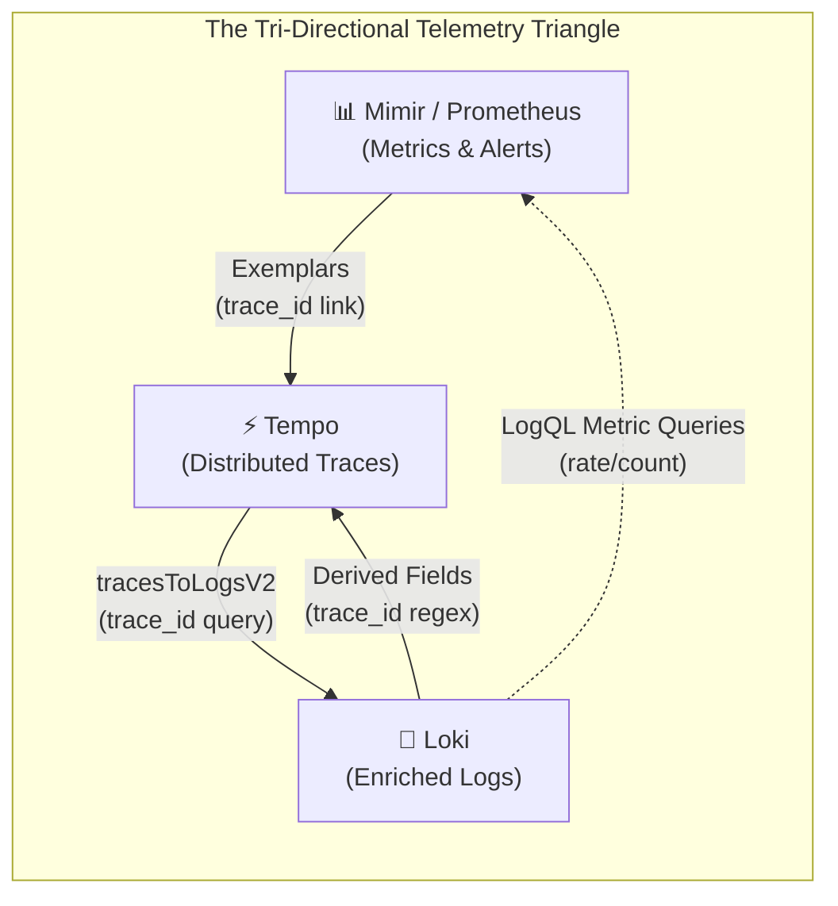
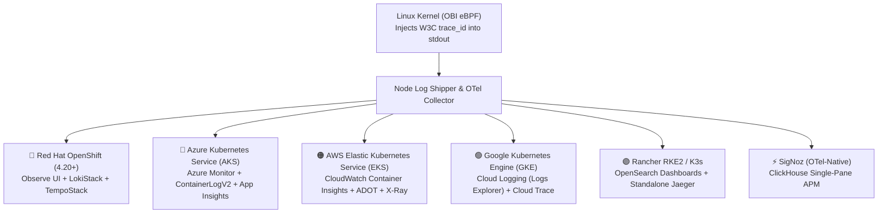

# OpenTelemetry eBPF (OBI) & Grafana Integration: Dashboards, Editions & Zero-Grafana Multi-Cloud Kubernetes Observability

[](#-complete-guide-catalog)
[](day0-planning-sizing.md)
[](architecture.md)
[](https://grafana.com)
[](../LICENSE)

> **Documentation Hub**: [🏠 Overview](../README.md) &nbsp;|&nbsp; [📜 Announcement](reference-blog-announcement.md) &nbsp;|&nbsp; [🏛️ Architecture](architecture.md) &nbsp;|&nbsp; [📋 Day 0: Sizing](day0-planning-sizing.md) &nbsp;|&nbsp; [📦 Day 1: Deploy](day1-installation.md) &nbsp;|&nbsp; [🚨 Day 2: Ops](day2-operations-triage.md) &nbsp;|&nbsp; [💧 Log Filtering](log-filtering-guide.md) &nbsp;|&nbsp; [⚡ Runtimes](runtime-compatibility.md) &nbsp;|&nbsp; [🌐 Frontend](frontend-spa-ssr-telemetry.md) &nbsp;|&nbsp; [🕸️ Service Mesh](service-mesh-vs-ebpf-observability.md) &nbsp;|&nbsp; [📊 Tool Comparison](obi-vs-modern-observability-tools.md) &nbsp;|&nbsp; [📈 Grafana & K8s](grafana-and-k8s-observability.md) &nbsp;|&nbsp; [🔧 Troubleshooting](troubleshooting.md) &nbsp;|&nbsp; [🧹 Decommission](decommission-guide.md) &nbsp;|&nbsp; [📚 References](references.md)

---

## 📑 Table of Contents

- [1. Executive Summary: Strategic Answers Upfront](#1-executive-summary-strategic-answers-upfront)
- [2. Is Grafana Mandatory? Decoupling Kernel Instrumentation from Visualization](#2-is-grafana-mandatory-decoupling-kernel-instrumentation-from-visualization)
  - [The Kernel-to-Backend Decoupling Principle](#the-kernel-to-backend-decoupling-principle)
  - [Zero-Vendor-Lock-In Contract](#zero-vendor-lock-in-contract)
  - [End-to-End Architectural Decoupling Topology](#end-to-end-architectural-decoupling-topology)
- [3. Full Observability with Grafana: The LGTM Stack Integration](#3-full-observability-with-grafana-the-lgtm-stack-integration)
  - [3.1 The Bi-Directional Correlation Pipeline](#31-the-bi-directional-correlation-pipeline)
  - [3.2 Grafana Tempo to Loki Integration (`tracesToLogsV2`)](#32-grafana-tempo-to-loki-integration-tracestologsv2)
  - [3.3 Grafana Loki to Tempo Integration (Derived Fields Regex)](#33-grafana-loki-to-tempo-integration-derived-fields-regex)
  - [3.4 Metrics-to-Traces with Exemplars (Mimir / Prometheus)](#34-metrics-to-traces-with-exemplars-mimir--prometheus)
  - [3.5 Ready-to-Use Dashboard Architectures](#35-ready-to-use-dashboard-architectures)
    - [Dashboard 1: OBI eBPF Health & Kernel Map Telemetry](#dashboard-1-obi-ebpf-health--kernel-map-telemetry)
    - [Dashboard 2: Auto-Generated RED Service APM Dashboard](#dashboard-2-auto-generated-red-service-apm-dashboard)
    - [Dashboard 3: 360-Degree Unified Incident Triage Dashboard](#dashboard-3-360-degree-unified-incident-triage-dashboard)
- [4. Which Grafana? Edition Comparison & Collector Configuration](#4-which-grafana-edition-comparison--collector-configuration)
  - [4.1 Grafana OSS (Self-Hosted LGTM Stack)](#41-grafana-oss-self-hosted-lgtm-stack)
  - [4.2 Grafana Cloud (Managed SaaS)](#42-grafana-cloud-managed-saas)
  - [4.3 Grafana Enterprise (Self-Hosted On-Premise)](#43-grafana-enterprise-self-hosted-on-premise)
  - [4.4 Cloud-Managed Grafana (Amazon Managed Grafana & Azure Managed Grafana)](#44-cloud-managed-grafana-amazon-managed-grafana--azure-managed-grafana)
  - [4.5 Comparative Matrix: Editions, Architecture & TCO Economics](#45-comparative-matrix-editions-architecture--tco-economics)
- [5. Zero-Grafana Observability: Native Stacks Across Kubernetes Distributions](#5-zero-grafana-observability-native-stacks-across-kubernetes-distributions)
  - [5.1 Red Hat OpenShift (4.20+): Built-in Web Console (Observe UI)](#51-red-hat-openshift-420-built-in-web-console-observe-ui)
  - [5.2 Azure Kubernetes Service (AKS): Container Insights + Log Analytics (KQL)](#52-azure-kubernetes-service-aks-container-insights--log-analytics-kql)
  - [5.3 AWS Elastic Kubernetes Service (EKS): CloudWatch Container Insights + X-Ray](#53-aws-elastic-kubernetes-service-eks-cloudwatch-container-insights--x-ray)
  - [5.4 Google Kubernetes Engine (GKE Standard): Google Cloud Observability + Trace](#54-google-kubernetes-engine-gke-standard-google-cloud-observability--trace)
  - [5.5 Rancher RKE2 / K3s: OpenSearch Dashboards (KQL) + Standalone Jaeger](#55-rancher-rke2--k3s-opensearch-dashboards-kql--standalone-jaeger)
  - [5.6 100% Open-Source Single-Pane-of-Glass Alternative: SigNoz](#56-100-open-source-single-pane-of-glass-alternative-signoz)
- [6. Multi-Backend OpenTelemetry Collector Routing Blueprint](#6-multi-backend-opentelemetry-collector-routing-blueprint)
- [7. Comparative Decision Matrix: Choose Your Observability Architecture](#7-comparative-decision-matrix-choose-your-observability-architecture)
- [8. Categorized Public References & Standards Catalog](#8-categorized-public-references--standards-catalog)
- [9. Navigation & Documentation Directory](#9-navigation--documentation-directory)

---

## 1. Executive Summary: Strategic Answers Upfront

Platform architects and engineering leaders evaluating OpenTelemetry eBPF Instrumentation (OBI) frequently face critical architectural questions:

| Architectural Question | Definitive Technical Answer | Core Strategic Implication |
| :--- | :--- | :--- |
| **Is Grafana mandatory for eBPF full observability?** | **NO. Grafana is 100% optional.** OBI operates inside the Linux kernel and emits vendor-neutral OpenTelemetry standards (OTLP for traces/metrics, W3C-injected JSON/text for logs). Telemetry can be visualized in any backend. | Zero platform lock-in. You can visualize enriched data in Grafana, AWS CloudWatch, Azure Log Analytics, Google Cloud Trace, OpenShift Web Console, SigNoz, Datadog, or OpenSearch. |
| **How does OBI integrate with Grafana dashboards?** | Via the **LGTM Stack** (Loki, Tempo, Mimir/Prometheus, Grafana). Grafana achieves bi-directional drilldown using **Tempo `tracesToLogsV2`**, **Loki Derived Fields regex**, and **Prometheus Exemplars**. | Enables instantaneous 1-click jumps from a Grafana alert spike ➔ Tempo trace waterfall ➔ exact Loki application logs sharing the identical `trace_id`. |
| **Which Grafana edition should you choose?** | Depends on operational constraints: **Grafana OSS** for on-premise data sovereignty and $0 software licensing; **Grafana Cloud** for zero-maintenance turnkey SaaS; **Grafana Enterprise** for corporate SSO/RBAC; or **Cloud-Managed (AWS AMG / Azure AMG)** for cloud-native integration. | Full parity across OTLP ingestion. Every edition supports the identical OBI correlation capabilities. |
| **How does full observability work WITHOUT Grafana on Kubernetes?** | Every enterprise Kubernetes distribution provides native visualization blades that correlate OBI telemetry directly using standard queries (KQL in AKS, CloudWatch Logs Insights in EKS, Logs Explorer in GKE, Observe UI in OpenShift). | Enterprise platform teams can leverage existing cloud provider contracts and native consoles without deploying, operating, or licensing a dedicated Grafana cluster. |

---

## 2. Is Grafana Mandatory? Decoupling Kernel Instrumentation from Visualization

### The Kernel-to-Backend Decoupling Principle

To understand why Grafana is optional, one must examine where OpenTelemetry eBPF Instrumentation (OBI) executes in the Linux architecture.

### End-to-End Architectural Decoupling Topology

```
+-----------------------------------------------------------------------------------------+
|                                    USER SPACE                                           |
|                                                                                         |
|   +---------------------------------------------------------------------------------+   |
|   |                       Polyglot Application Containers                           |   |
|   |         (Go, Python, Node.js, Java, .NET, Ruby, Angular SSR, etc.)              |   |
|   |                                                                                 |   |
|   |   Application writes log message:                                               |   |
|   |   printf("Order #1049 authorized\n")  -->  stdout / stderr (FD 1 / FD 2)         |   |
|   +----------------------------------------+----------------------------------------+   |
|                                            |                                            |
|                                            | write() / writev() Syscalls                |
+--------------------------------------------v--------------------------------------------+
|                                   LINUX KERNEL                                          |
|                                                                                         |
|   +---------------------------------------------------------------------------------+   |
|   |                   Linux Virtual File System (VFS) Layer                         |   |
|   |                   sys_enter_write / sys_enter_writev                            |   |
|   +----------------------------------------+----------------------------------------+   |
|                                            |                                            |
|                                            v                                            |
|   +---------------------------------------------------------------------------------+   |
|   |              OpenTelemetry eBPF Instrumentation (OBI Probe)                     |   |
|   |                                                                                 |   |
|   |   1. Intercepts write buffer in kernel memory before I/O commit.                |   |
|   |   2. Looks up active thread/goroutine context in BPF Map (traces_ctx_v1).       |   |
|   |   3. Injects W3C Trace Context in-flight via bpf_probe_write_user():            |   |
|   |      {"msg":"Order #1049 authorized","trace_id":"4bf92...","span_id":"00f06..."}|   |
|   +----------------------------------------+----------------------------------------+   |
|                                            |                                            |
|                                            v Pipe Write                                 |
|   +---------------------------------------------------------------------------------+   |
|   |                       Container Standard Stream Pipe Buffer                     |   |
|   +----------------------------------------+----------------------------------------+   |
+--------------------------------------------|--------------------------------------------+
                                             | Reads from /var/log/pods/*
+--------------------------------------------v--------------------------------------------+
|                                    NODE AGENT TIER                                      |
|                                                                                         |
|   +------------------------------------+   +----------------------------------------+   |
|   |        Log Shipper DaemonSet       |   |       OpenTelemetry Collector          |   |
|   |  (Vector / Fluent Bit / Promtail)  |   |        (OTel Contrib DaemonSet)        |   |
|   |                                    |   |                                        |   |
|   |   - Strips suppressed NUL bytes    |   |   - Ingests kernel traces & RED metrics|   |
|   |   - Parses JSON / Text attributes  |   |   - Enhances with k8sattributes        |   |
|   |   - Ships enriched logs via OTLP   |   |   - Routes to ANY configured backend   |   |
|   +------------------+-----------------+   +--------------------+-------------------+   |
+----------------------|------------------------------------------|-----------------------+
                       |                                          |
                       +--------------------+---------------------+
                                            |
                                            | Standard OpenTelemetry Protocol (OTLP v1.0)
                                            v
+-----------------------------------------------------------------------------------------+
|                                VISUALIZATION & STORAGE BACKENDS                         |
|                                     (Completely Pluggable)                              |
|                                                                                         |
|   [Option 1: Grafana LGTM]      --> Loki (Logs) + Tempo (Traces) + Mimir (Metrics)      |
|   [Option 2: Red Hat OpenShift] --> OpenShift Observe UI + Cluster Logging + Tempo      |
|   [Option 3: Microsoft Azure]   --> Container Insights + Log Analytics + App Insights   |
|   [Option 4: Amazon AWS]        --> CloudWatch Container Insights + Logs Insights + XRay|
|   [Option 5: Google Cloud]      --> Cloud Logging (Logs Explorer) + Cloud Trace + GMP   |
|   [Option 6: Open-Source CNCF]  --> SigNoz (ClickHouse) OR OpenSearch + Standalone Jaeger|
+-----------------------------------------------------------------------------------------+
```

### Zero-Vendor-Lock-In Contract

OBI operates strictly at the kernel boundary. Because it mutates standard container streams before user-space log collectors read them from `/var/log/pods/`, **the output of OBI is plain standard text and JSON**. 

No proprietary headers, binary serialization, or vendor agents are involved:
1. **Logs**: Standard UTF-8 lines emitted to standard out containing standard JSON fields (`"trace_id": "4bf92f3577b34da6a3ce929d0e0e4736"`) or standard key-value pairs (`trace_id=4bf92f3577b34da6a3ce929d0e0e4736`).
2. **Traces**: Standard W3C TraceContext (`traceparent: 00-4bf92f3577b34da6a3ce929d0e0e4736-00f067aa0ba902b7-01`) exported via standard OTLP over gRPC (port `4317`) or HTTP (port `4318`).
3. **Metrics**: Standard OpenTelemetry / Prometheus RED metrics (Rate, Errors, Duration) exported via OTLP or scraped via `/metrics`.

Because all three signals adhere to open standards, **you are never forced to use Grafana**.

---

## 3. Full Observability with Grafana: The LGTM Stack Integration

When Grafana **is** selected as the enterprise observability portal, it provides the most cohesive, open-source correlation workflow across logs, metrics, and traces (the **LGTM Stack**):
- **L**oki (Log Aggregation)
- **G**rafana (Unified Visualization & Dashboarding)
- **T**empo (Distributed Tracing Backend)
- **M**imir / Prometheus (Long-Term Metric Storage)



### 3.1 The Bi-Directional Correlation Pipeline

With OBI kernel enrichment, logs in Loki contain the exact 32-character hexadecimal `trace_id` generated during the request lifecycle. Grafana connects these signals through three native mechanisms:

1. **Metrics ➔ Traces**: A latency spike or 5xx error alert in Mimir contains Prometheus **Exemplars** that link directly to the trace in Tempo.
2. **Traces ➔ Logs**: Inside Tempo, clicking **"Logs for this span"** uses `tracesToLogsV2` to query Loki automatically with `{service="checkout"} |= "<trace_id>"`.
3. **Logs ➔ Traces**: Inside Loki, viewing any log line with a `trace_id` automatically renders a clickable button that opens the exact trace waterfall in Tempo.

---

### 3.2 Grafana Tempo to Loki Integration (`tracesToLogsV2`)

To enable seamless drill-down from a Tempo trace span into the correlated container logs in Loki, configure the Tempo datasource using the `tracesToLogsV2` specification:

```yaml
# tempo-datasource.yaml
apiVersion: 1
datasources:
  - name: Tempo
    type: tempo
    access: proxy
    uid: tempo
    url: http://tempo-query-frontend.tempo.svc.cluster.local:3100
    jsonData:
      httpMethod: GET
      tracesToLogsV2:
        # Link to the Loki datasource UID
        datasourceUid: 'loki'
        spanStartTimeShift: '-2m'
        spanEndTimeShift: '2m'
        filterByTrace: true
        filterBySpan: false
        tags:
          - key: 'service.name'
            value: 'service'
          - key: 'k8s.namespace.name'
            value: 'namespace'
          - key: 'k8s.pod.name'
            value: 'pod'
        # Query template: filters by container tags and searches for the active trace ID
        query: '{$${__tags}} |= "$${__trace.id}"'
      serviceMap:
        datasourceUid: 'mimir'
      nodeGraph:
        enabled: true
      search:
        hide: false
      lokiSearch:
        datasourceUid: 'loki'
```

> [!TIP]
> The `spanStartTimeShift` and `spanEndTimeShift` parameters expand the search window by ±2 minutes. This prevents missing logs in asynchronous runtimes (like Node.js event loops or Java background workers) where log buffers flush slightly after the HTTP span closes.

---

### 3.3 Grafana Loki to Tempo Integration (Derived Fields Regex)

To turn raw string `trace_id` attributes in Loki into clickable links that jump to Tempo, configure **Derived Fields** in the Loki datasource:

```yaml
# loki-datasource.yaml
apiVersion: 1
datasources:
  - name: Loki
    type: loki
    access: proxy
    uid: loki
    url: http://loki-gateway.loki.svc.cluster.local:80
    jsonData:
      maxLines: 5000
      derivedFields:
        - name: TraceID
          datasourceUid: 'tempo'
          # Matches both JSON format ("trace_id":"...") and Plain-Text format (trace_id=...)
          matcherRegex: '(?:"trace_id"[:=]\s*"|trace_id=)([a-fA-F0-9]{32})'
          url: '$${__value.raw}'
          urlDisplayLabel: '🔍 View Trace in Tempo'
        - name: SpanID
          datasourceUid: 'tempo'
          matcherRegex: '(?:"span_id"[:=]\s*"|span_id=)([a-fA-F0-9]{16})'
          url: '$${__value.raw}'
          urlDisplayLabel: '📍 Span'
```

When an engineer inspects a log stream in Grafana Explore:
```
2026-10-08T06:14:22Z stdout F {"level":"ERROR","msg":"payment gateway timeout","order_id":"9811","trace_id":"4bf92f3577b34da6a3ce929d0e0e4736"}
```
Grafana parses the `trace_id` field and renders an inline blue pill button: `[🔍 View Trace in Tempo]`. Clicking this button immediately splits the screen and renders the Tempo trace flamegraph.

---

### 3.4 Metrics-to-Traces with Exemplars (Mimir / Prometheus)

OpenTelemetry Collector and Prometheus scrape HTTP server duration metrics enriched with Exemplars:

```yaml
# mimir-prometheus-datasource.yaml
apiVersion: 1
datasources:
  - name: Mimir
    type: prometheus
    access: proxy
    uid: mimir
    url: http://mimir-nginx.mimir.svc.cluster.local/prometheus
    jsonData:
      httpMethod: POST
      exemplarTraceIdDestinations:
        - name: trace_id
          datasourceUid: 'tempo'
          urlDisplayLabel: 'Query Trace in Tempo'
```

When an HTTP 500 error spike appears on the RED dashboard, operators click directly on the exemplar star on the latency graph to load the exact failing trace in Tempo, which in turn links directly to the Loki logs.

---

### 3.5 Ready-to-Use Dashboard Architectures

Here are the three essential Grafana dashboards for a production OBI deployment:

#### Dashboard 1: OBI eBPF Health & Kernel Map Telemetry

Monitors the health, memory safety, and kernel overhead of the OBI DaemonSet:

| Panel Title | Metric / PromQL Query | Visualization | Operational Purpose |
| :--- | :--- | :--- | :--- |
| **Active Syscall Hooks Rate** | `sum(rate(obi_bpf_syscall_writes_total[1m])) by (syscall, k8s_pod_name)` | Time Series | Confirms OBI is intercepting `pipe_write`, `sys_write`, and `sys_writev` system calls. |
| **Trace Context Injection Rate** | `sum(rate(obi_bpf_correlations_injected_total[1m])) by (namespace)` | Time Series | Measures how many log records are enriched with active `trace_id`s per second. |
| **BPF Map Saturation (`traces_ctx_v1`)** | `(obi_bpf_map_entries{map="traces_ctx_v1"} / obi_bpf_map_max_entries{map="traces_ctx_v1"}) * 100` | Gauge | Alerts if the active concurrent request LRU map exceeds 80% capacity (prevents context drops). |
| **Kernel Ring Buffer Drop Count** | `sum(increase(obi_bpf_ringbuf_drops_total[5m]))` | Stat / Alert | Must remain **0**. Any non-zero count indicates user-space OBI daemon CPU starvation. |
| **Kernel Probe Overhead (p99)** | `histogram_quantile(0.99, sum(rate(obi_bpf_overhead_nanoseconds_bucket[5m])) by (le))` | Heatmap / Gauge | Confirms probe execution overhead remains under **2.5 microseconds** per write. |
| **OBI Daemon Memory / CPU Footprint** | `container_memory_working_set_bytes{container="obi-daemon"}` | Time Series | Ensures DaemonSet stays within its 256 MiB memory and 200m CPU limit. |

#### Dashboard 2: Auto-Generated RED Service APM Dashboard

Because OBI traces all incoming and outgoing HTTP/gRPC requests at the socket layer without language agents, it generates full RED metrics automatically:

```json
{
  "title": "Zero-Code Service APM (eBPF OBI)",
  "panels": [
    {
      "title": "Request Rate (RPS)",
      "type": "timeseries",
      "targets": [
        {
          "expr": "sum(rate(http_server_requests_total[1m])) by (service_name)",
          "legendFormat": "{{service_name}}"
        }
      ]
    },
    {
      "title": "Error Rate (5xx Percentage)",
      "type": "timeseries",
      "targets": [
        {
          "expr": "(sum(rate(http_server_requests_total{status_code=~"5.."}[1m])) by (service_name) / sum(rate(http_server_requests_total[1m])) by (service_name)) * 100",
          "legendFormat": "{{service_name}} Error %"
        }
      ]
    },
    {
      "title": "Duration (p95 Latency)",
      "type": "timeseries",
      "targets": [
        {
          "expr": "histogram_quantile(0.95, sum(rate(http_server_duration_milliseconds_bucket[1m])) by (le, service_name))",
          "legendFormat": "{{service_name}} p95"
        }
      ]
    }
  ]
}
```

#### Dashboard 3: 360-Degree Unified Incident Triage Dashboard

A split-screen investigation workspace featuring:
- **Top Panel**: Service dependency topological node graph (generated by Tempo and Mimir).
- **Bottom Left Panel**: Tempo trace waterfall with span hierarchy and HTTP headers.
- **Bottom Right Panel**: Embedded Loki log viewer pre-filtered by variable `$trace_id`:
  ```logql
  {namespace=~"$namespace", pod=~"$pod"} |= "$trace_id" | json
  ```

---

## 4. Which Grafana? Edition Comparison & Collector Configuration

Grafana is available in multiple commercial and open-source editions. All editions support OBI telemetry, but they differ in operational maintenance, cost structures, and data compliance.

### 4.1 Grafana OSS (Self-Hosted LGTM Stack)

The 100% free, open-source stack self-hosted inside your Kubernetes clusters:
- **Components**: Grafana OSS + Loki OSS + Tempo OSS + Mimir OSS / Prometheus.
- **Data Storage**: Object storage (AWS S3, Azure Blob, Google Cloud Storage, or on-premise Ceph/MinIO).
- **Target Audience**: Organizations requiring strict on-premise data residency, air-gapped clusters, or avoiding cloud egress costs.
- **OTel Collector Configuration**:
  ```yaml
  exporters:
    otlp/tempo:
      endpoint: "tempo-distributor.tempo.svc.cluster.local:4317"
      tls:
        insecure: true
    otlphttp/loki:
      endpoint: "http://loki-gateway.loki.svc.cluster.local/otlp"
    prometheusremotewrite/mimir:
      endpoint: "http://mimir-distributor.mimir.svc.cluster.local/api/v1/push"
  ```

### 4.2 Grafana Cloud (Managed SaaS)

Grafana Labs' fully managed SaaS platform:
- **Components**: Fully managed Loki, Tempo, Mimir, and Grafana frontend.
- **Maintenance**: Zero cluster management, zero storage scaling, automatic updates.
- **OTel Collector Ingestion**: Sends telemetry directly to the Grafana Cloud OTLP Gateway using HTTP Basic Authentication:
  ```yaml
  exporters:
    otlp/grafana_cloud:
      endpoint: "otlp-gateway-prod-us-east-0.grafana.net:443"
      headers:
        Authorization: "Basic ${env:GRAFANA_CLOUD_AUTH_TOKEN}"
  ```
  *(Where `GRAFANA_CLOUD_AUTH_TOKEN` is `base64(instance_id:api_token)`).*

### 4.3 Grafana Enterprise (Self-Hosted On-Premise)

Self-hosted enterprise deployment for regulated organizations:
- **Key Capabilities**: Enterprise plugins (Datadog, Splunk, ServiceNow, Oracle, Snowflake), Enterprise RBAC, SAML/Okta fine-grained permissions, 24/7 mission-critical SLA support.
- **Collector Config**: Identical to Grafana OSS, with enterprise token validation enabled at the gateway proxy.

### 4.4 Cloud-Managed Grafana (Amazon Managed Grafana & Azure Managed Grafana)

Managed Grafana frontends hosted directly by hyperscalers:
- **Amazon Managed Grafana (AMG)**: Fully managed Grafana integrated with AWS IAM Identity Center (SSO). Natively queries Amazon Managed Prometheus (AMP), AWS X-Ray, CloudWatch Logs, and Amazon OpenSearch.
- **Azure Managed Grafana (Azure AMG)**: Fully managed Grafana integrated with Microsoft Entra ID (Azure AD). Natively queries Azure Monitor, Log Analytics (`ContainerLogV2`), Application Insights, and Azure Data Explorer.

### 4.5 Comparative Matrix: Editions, Architecture & TCO Economics

| Feature / Dimension | Grafana OSS | Grafana Cloud (SaaS) | Grafana Enterprise | Amazon / Azure Managed Grafana |
| :--- | :--- | :--- | :--- | :--- |
| **Licensing Cost** | **$0** (AGPLv3 / Apache 2.0) | Pay-as-you-go / Pro / Enterprise | Commercial Annual License ($$$) | Per active user/month ($9–$35/user) |
| **Hosting Model** | Self-Hosted (K8s / On-Prem) | Multi-tenant or Single-tenant SaaS | Self-Hosted (K8s / Customer Cloud) | Managed PaaS inside AWS / Azure VPC |
| **Infrastructure Overhead** | High (Manage Loki/Tempo disks & S3) | **Zero** (Turnkey) | High (Customer operates storage tier) | Low (Hyperscaler operates frontend) |
| **Data Residency** | 100% inside customer boundary | Stored in Grafana Labs Cloud | 100% inside customer boundary | Stored inside customer cloud region |
| **OTLP Native Ingestion** | Yes (via OTel Collector) | Yes (Direct OTLP Gateway) | Yes (via OTel Collector) | Via cloud datasources (AMP, CloudWatch) |
| **Tempo `tracesToLogsV2`** | ✅ Supported | ✅ Supported | ✅ Supported | ✅ Supported |
| **Loki Derived Fields** | ✅ Supported | ✅ Supported | ✅ Supported | ✅ Supported |
| **Enterprise Plugins** | ❌ Community Only | Included in Enterprise plans | Included (Splunk, ServiceNow, etc.) | Available via Enterprise upgrade |

---

## 5. Zero-Grafana Observability: Native Stacks Across Kubernetes Distributions

If your organization standardizes on cloud-native or enterprise Kubernetes platforms, **you do NOT need to deploy Grafana**. OBI's kernel-level enrichment works natively with each platform's built-in observability suite.



---

### 5.1 Red Hat OpenShift (4.20+): Built-in Web Console (Observe UI)

Red Hat OpenShift features a native enterprise observability interface embedded directly into the **OpenShift Web Console**:

- **Native UI**: OpenShift Web Console > **Observe** > **Logs** & **Traces**.
- **Log Engine**: Red Hat OpenShift Logging Operator (Vector collector forwarding to Loki Operator / LokiStack).
- **Trace Engine**: Red Hat OpenShift distributed tracing platform (Tempo Operator / TempoStack).
- **How Correlation Works**:
  1. The user navigates to **Observe > Traces** in the OpenShift console.
  2. Selecting any trace displays the distributed span waterfall.
  3. Clicking **"Correlated Logs"** queries the internal LokiStack using the active `trace_id`.
  4. The console displays the exact Pod logs emitted by OBI side-by-side.

```yaml
# cluster-log-forwarder.yaml (OpenShift 4.20+)
apiVersion: observability.openshift.io/v1
kind: ClusterLogForwarder
metadata:
  name: instance
  namespace: openshift-logging
spec:
  managementState: Managed
  serviceAccount:
    name: cluster-logging-operator
  outputs:
    - name: default-lokistack
      type: loki
      loki:
        url: https://logging-loki-gateway.openshift-logging.svc:8080/api/logs/v1/application
      tls:
        ca:
          key: ca-bundle.crt
          configMapName: openshift-service-ca.crt
  pipelines:
    - name: application-logs
      inputRefs: [ application ]
      outputRefs: [ default-lokistack ]
```

---

### 5.2 Azure Kubernetes Service (AKS): Container Insights + Log Analytics (KQL)

Azure AKS provides native log aggregation in **Azure Log Analytics** and distributed tracing in **Application Insights**:

- **Native UI**: Azure Portal > Monitor > Application Insights & Log Analytics.
- **Log Engine**: Azure Monitor Agent (AMA) ingesting standard output into the high-performance `ContainerLogV2` table.
- **Trace Engine**: OpenTelemetry Collector forwarding OTLP traces to Application Insights via the `azuremonitor` exporter.
- **How Correlation Works**:
  When an alert triggers in Application Insights, copy the `OperationId` (which equals the W3C `trace_id`) and execute this Kusto Query Language (**KQL**) query in Azure Log Analytics:

```kusto
// Instant trace-log correlation in AKS Log Analytics
ContainerLogV2
| where TimeGenerated > ago(1h)
| where PodNamespace == "production"
| where LogMessage has "4bf92f3577b34da6a3ce929d0e0e4736"
| project TimeGenerated, PodNamespace, PodName, ContainerName, LogMessage
| order by TimeGenerated asc
```

For JSON structured logs enriched by OBI:
```kusto
ContainerLogV2
| where TimeGenerated > ago(1h)
| extend LogJson = parse_json(LogMessage)
| where LogJson.trace_id == "4bf92f3577b34da6a3ce929d0e0e4736"
| project TimeGenerated, PodName, LogLevel = LogJson.level, Message = LogJson.msg, TraceId = LogJson.trace_id
| order by TimeGenerated asc
```

---

### 5.3 AWS Elastic Kubernetes Service (EKS): CloudWatch Container Insights + X-Ray

AWS EKS integrates natively with **CloudWatch Container Insights**, **CloudWatch Logs Insights**, and **AWS X-Ray / AWS ServiceLens**:

- **Native UI**: AWS Management Console > CloudWatch > **ServiceLens** & **Logs Insights**.
- **Log Engine**: AWS for Fluent Bit daemonset streaming to `/aws/containerinsights/<cluster-name>/application`.
- **Trace Engine**: AWS Distro for OpenTelemetry (ADOT) Collector forwarding traces to AWS X-Ray.
- **How Correlation Works**:
  1. In **AWS ServiceLens**, click on a failing node in the service map to view the X-Ray trace detail.
  2. The console displays a **"View logs"** button directly linked to the CloudWatch log stream.
  3. Alternatively, run this query in **CloudWatch Logs Insights**:

```sql
fields @timestamp, @logStream, @message
| filter @logStream like /backend/
| filter @message like /4bf92f3577b34da6a3ce929d0e0e4736/
| sort @timestamp desc
| limit 200
```

For parsed JSON logs:
```sql
fields @timestamp, trace_id, level, msg, order_id
| filter trace_id = '4bf92f3577b34da6a3ce929d0e0e4736'
| sort @timestamp desc
```

---

### 5.4 Google Kubernetes Engine (GKE Standard): Google Cloud Observability + Trace

GKE includes native deep integration with **Google Cloud Logging** and **Google Cloud Trace**:

- **Native UI**: Google Cloud Console > **Cloud Trace** & **Logs Explorer**.
- **Log Engine**: GKE native logging agent streaming container standard output to Cloud Logging.
- **Trace Engine**: OpenTelemetry Collector forwarding traces to Google Cloud Trace via the `googlecloud` exporter.
- **How Correlation Works**:
  In Google Cloud Logs Explorer, query container logs by the injected `trace_id`:

```text
resource.type="k8s_container"
resource.labels.cluster_name="prod-gke-cluster"
resource.labels.namespace_name="production"
jsonPayload.trace_id="4bf92f3577b34da6a3ce929d0e0e4736"
```

In Google Cloud Trace:
1. Select the trace from the waterfall overview.
2. Click **"Show logs"** in the trace details pane.
3. Cloud Trace automatically executes a query in Logs Explorer filtering on `trace_id`, presenting application logs directly under each span.

---

### 5.5 Rancher RKE2 / K3s: OpenSearch Dashboards (KQL) + Standalone Jaeger

For Kubernetes clusters managed via Rancher or vanilla RKE2/K3s utilizing open-source components:

- **Native UI**: OpenSearch Dashboards / Kibana + Jaeger Query UI.
- **Log Engine**: Rancher Logging Operator (Fluent Bit + Fluentd) forwarding to OpenSearch / Elasticsearch.
- **Trace Engine**: OpenTelemetry Collector forwarding to a standalone Jaeger instance.
- **How Correlation Works**:
  - In **Jaeger UI**: Paste the `trace_id` `4bf92f3577b34da6a3ce929d0e0e4736` into the Search bar to inspect the waterfall.
  - In **OpenSearch Dashboards**: Under the Discover tab, filter by:
    `trace_id : "4bf92f3577b34da6a3ce929d0e0e4736"` or enter the Lucene query:
    ```lucene
    kubernetes.namespace_name: "production" AND trace_id: "4bf92f3577b34da6a3ce929d0e0e4736"
    ```

---

### 5.6 100% Open-Source Single-Pane-of-Glass Alternative: SigNoz

For teams seeking an all-in-one open-source observability platform without configuring Grafana derived fields or maintaining separate Loki and Tempo clusters, **SigNoz** is an ideal alternative:

- **Storage Engine**: ClickHouse columnar database (highly optimized for logs, metrics, and traces).
- **Native OTel Protocol**: SigNoz speaks native OTLP out-of-the-box.
- **Automatic Correlation**: Because SigNoz stores traces and logs in correlated ClickHouse tables, any log record containing a `trace_id` automatically displays an inline link to the trace waterfall, and every trace span displays an inline tab with correlated logs.
- **OTel Collector Config for SigNoz**:
  ```yaml
  exporters:
    otlp/signoz:
      endpoint: "signoz-otel-collector.platform.svc:4317"
      tls:
        insecure: true
  ```

---

## 6. Multi-Backend OpenTelemetry Collector Routing Blueprint

The OpenTelemetry Collector acts as the universal routing engine. It can ingest OBI telemetry once and simultaneously fan out to Grafana, hyperscaler native backends, and open-source tools:

```yaml
# k8s/base/otel-collector-multi-backend.yaml
apiVersion: v1
kind: ConfigMap
metadata:
  name: otel-collector-config
  namespace: opentelemetry
data:
  otel-collector-config.yaml: |
    receivers:
      otlp:
        protocols:
          grpc:
            endpoint: 0.0.0.0:4317
          http:
            endpoint: 0.0.0.0:4318

      # Ingests container logs from /var/log/pods with OBI-injected trace context
      filelog:
        include: [ /var/log/pods/*/*/*.log ]
        exclude: [ /var/log/pods/opentelemetry_*/*/*.log ]
        start_at: end
        operators:
          - type: container
            id: container-parser
          - type: regex_parser
            id: nul-byte-cleaner
            regex: '^[\x00\s]*$'
            action: drop
          - type: json_parser
            id: json-attribute-extractor
            if: 'body matches "^\\{.*\\}$"'
            parse_to: attributes

    processors:
      memory_limiter:
        check_interval: 1s
        limit_percentage: 75
        spike_limit_percentage: 20

      batch:
        send_batch_size: 8192
        timeout: 1s

      k8sattributes:
        auth_type: "serviceAccount"
        passthrough: false
        extract:
          metadata:
            - k8s.namespace.name
            - k8s.pod.name
            - k8s.node.name
            - k8s.container.name

    exporters:
      # Target 1: Grafana LGTM Stack (Tempo & Loki)
      otlp/tempo:
        endpoint: tempo-distributor.tempo.svc.cluster.local:4317
        tls:
          insecure: true

      otlphttp/loki:
        endpoint: http://loki-gateway.loki.svc.cluster.local/otlp

      # Target 2: AWS Hyperscaler (X-Ray & CloudWatch)
      awsxray:
        region: us-east-1

      # Target 3: Azure Hyperscaler (Application Insights / Log Analytics)
      azuremonitor:
        connection_string: "${env:APPLICATIONINSIGHTS_CONNECTION_STRING}"

      # Target 4: Google Cloud (Trace & Logging)
      googlecloud:
        project: "${env:GCP_PROJECT_ID}"

      # Target 5: SigNoz / ClickHouse APM
      otlp/signoz:
        endpoint: signoz-otel-collector.platform.svc:4317
        tls:
          insecure: true

      # Target 6: Standard Prometheus Metrics
      prometheus:
        endpoint: 0.0.0.0:8889

    service:
      pipelines:
        traces:
          receivers: [ otlp ]
          processors: [ memory_limiter, k8sattributes, batch ]
          exporters: [ otlp/tempo, awsxray, azuremonitor, googlecloud, otlp/signoz ]

        logs:
          receivers: [ otlp, filelog ]
          processors: [ memory_limiter, k8sattributes, batch ]
          exporters: [ otlphttp/loki, azuremonitor, googlecloud, otlp/signoz ]

        metrics:
          receivers: [ otlp ]
          processors: [ memory_limiter, batch ]
          exporters: [ prometheus ]
```

---

## 7. Comparative Decision Matrix: Choose Your Observability Architecture

| Evaluation Dimension | Grafana LGTM (OSS) | Grafana Cloud (SaaS) | OpenShift Observe UI | Azure Monitor (AKS) | AWS ServiceLens (EKS) | GCP Cloud Trace (GKE) | SigNoz (ClickHouse) |
| :--- | :--- | :--- | :--- | :--- | :--- | :--- | :--- |
| **Is Grafana Required?** | **YES** | **YES** | ❌ No | ❌ No | ❌ No | ❌ No | ❌ No |
| **Primary Trace Backend** | Tempo | Tempo Cloud | TempoStack | App Insights | AWS X-Ray | Cloud Trace | ClickHouse |
| **Primary Log Backend** | Loki | Loki Cloud | LokiStack | `ContainerLogV2` | CloudWatch Logs | Cloud Logging | ClickHouse |
| **Correlation Setup** | `tracesToLogsV2` & regex | Turnkey | Turnkey Console | KQL query by `trace_id` | CloudWatch filter | Filter `trace_id` | Native (Automatic) |
| **Deployment Effort** | Moderate (Helm) | Low (Tokens only) | Zero (Operator) | Zero (Add-on) | Low (ADOT add-on) | Zero (Built-in) | Low (Helm) |
| **Operational Overhead** | Medium | **Zero** | Low | **Zero** | **Zero** | **Zero** | Low to Medium |
| **Data Residency** | 100% In-Cluster | Grafana Cloud | 100% In-Cluster | Azure Region | AWS Region | GCP Region | 100% In-Cluster |
| **Software Cost** | **$0** (FOSS) | Consumption | Included in OCP | Ingestion / GB | Ingestion / GB | Ingestion / GB | **$0** (FOSS) |

---

## 8. Categorized Public References & Standards Catalog

### 1. OpenTelemetry & eBPF Standards
- [OpenTelemetry eBPF Instrumentation (OBI) Repository](https://github.com/open-telemetry/opentelemetry-ebpf-instrumentation) — Official upstream repository under the OpenTelemetry project.
- [Zero-code trace-log correlation with OBI](https://opentelemetry.io/blog/2026/obi-trace-log-correlation/) — The official OpenTelemetry milestone announcement (October 2026).
- [W3C Trace Context Recommendation](https://www.w3.org/TR/trace-context/) — Formal W3C specification defining `traceparent` and `tracestate` headers.

### 2. Grafana Documentation & Configuration References
- [Grafana Tempo `tracesToLogs` Configuration](https://grafana.com/docs/tempo/latest/configuration/grafana/#traces-to-logs) — Official guide on linking Tempo trace spans to Loki log streams.
- [Grafana Loki Derived Fields Configuration](https://grafana.com/docs/grafana/latest/datasources/loki/#derived-fields) — Regex-based link creation from log lines to tracing backends.
- [Grafana Mimir & Prometheus Exemplars Guide](https://grafana.com/docs/grafana/latest/fundamentals/exemplars/) — Connecting metric alert spikes to distributed traces.

### 3. Kubernetes Platform Observability Guides
- [Red Hat OpenShift Observability & Logging](https://docs.redhat.com/en/documentation/openshift_container_platform/4.16/html/logging/index) — Architecture of Vector, LokiStack, and Observe UI.
- [Azure Monitor Container Insights ContainerLogV2 Schema](https://learn.microsoft.com/en-us/azure/azure-monitor/containers/container-insights-logging-v2) — High-throughput container logging schema and KQL queries.
- [AWS CloudWatch Container Insights & ServiceLens](https://docs.aws.amazon.com/AmazonCloudWatch/latest/monitoring/ServiceLens.html) — Unified service map linking X-Ray traces to CloudWatch logs.
- [Google Cloud Observability in GKE](https://cloud.google.com/stackdriver/docs/solutions/gke) — Cloud Logging and Cloud Trace integration for Kubernetes.
- [SigNoz Open-Source Observability](https://signoz.io/docs/) — Native OpenTelemetry APM with ClickHouse backend.

---

## 9. Navigation & Documentation Directory

| ⬅️ Previous Document | 🏠 Documentation Hub | ➡️ Next Document |
| :--- | :---: | ---: |
| [**OBI vs. Modern Observability Tools**](obi-vs-modern-observability-tools.md) | [**Repository Overview**](../README.md) | [**Troubleshooting & Diagnostics**](troubleshooting.md) |

### 📚 Complete Guide Catalog
- 📜 **[Official Reference Announcement](reference-blog-announcement.md)** — Verbatim OpenTelemetry announcement with junior primers and kernel deep dives
- 🏛️ **[Architecture Deep Dive](architecture.md)** — Low-level syscall hooks (`pipe_write`, `ksys_write`, `do_writev`), LRU maps, and ringbuffer flow
- 📋 **[Day 0: Planning & Sizing](day0-planning-sizing.md)** — Linux 6.0+ matrix, kernel lockdown, memory sizing formulas, and security postures
- 📦 **[Day 1: Multi-Cluster Deployment](day1-installation.md)** — Enterprise overlays for OpenShift 4.20+, AKS, EKS, GKE, RKE2, and Docker Compose
- 🚨 **[Day 2: Operations & Incident Triage](day2-operations-triage.md)** — SRE incident response playbook, LogQL/Jaeger queries, and canary rollouts
- 💧 **[Log Shipper Filtering Guide](log-filtering-guide.md)** — Suppressed NUL byte placeholder drop filters and 8 KiB write split handling
- ⚡ **[Runtime Compatibility Guide](runtime-compatibility.md)** — Go runtime hooks, `PYTHONUNBUFFERED=1`, Node.js async streams, and Java Loom
- 🌐 **[Frontend SPAs & SSR Telemetry Guide](frontend-spa-ssr-telemetry.md)** — W3C `traceparent` HTTP bridge, Angular/React/Vue patterns, and SSR kernel interception
- 🕸️ **[Service Mesh vs. eBPF Observability Guide](service-mesh-vs-ebpf-observability.md)** — Architectural comparison between Istio Ambient (ztunnel/waypoint) network proxying and OBI kernel-level trace-log enrichment
- 📊 **[OBI vs. Modern Observability Tools](obi-vs-modern-observability-tools.md)** — Architectural analysis & strategic conclusions comparing OBI against Datadog, Grafana, Dynatrace & New Relic
- 📈 **[Grafana & Kubernetes Observability Guide](grafana-and-k8s-observability.md)** — Grafana dashboard integration (OSS, Cloud, Enterprise) and zero-Grafana full observability on OpenShift, AKS, EKS, GKE & RKE2
- 🔧 **[Troubleshooting & Diagnostics](troubleshooting.md)** — Common pitfalls, eBPF probe errors, missing trace IDs, and verification steps
- 🧹 **[Decommission & Teardown Guide](decommission-guide.md)** — Safe probe detachment, BPF map unpinning, and resource cleanup
- 📚 **[References & Official Documentation](references.md)** — Upstream OpenTelemetry specifications, GitHub repositories, and CNCF channels
