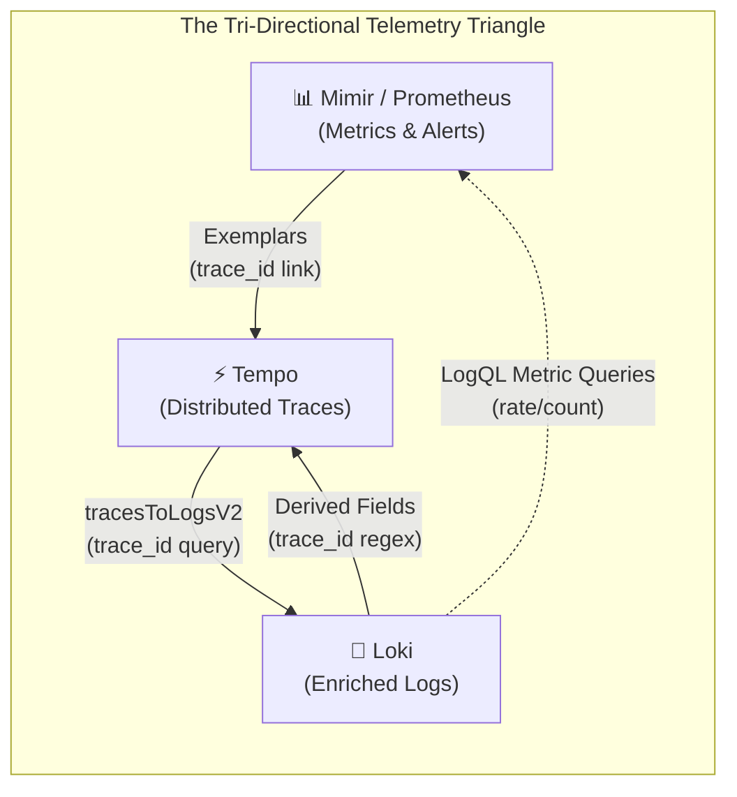
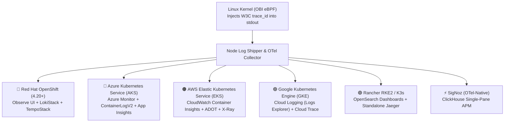

# OpenTelemetry eBPF (OBI) & Grafana Integration: Dashboards, Editions & Zero-Grafana Multi-Cloud Kubernetes Observability

[](#-complete-guide-catalog)
[](day0-planning-sizing.md)
[](architecture.md)
[](https://grafana.com)
[](../LICENSE)

> **Documentation Hub**: [🏠 Overview](../README.md) &nbsp;|&nbsp; [📜 Announcement](reference-blog-announcement.md) &nbsp;|&nbsp; [🏛️ Architecture](architecture.md) &nbsp;|&nbsp; [📋 Day 0: Sizing](day0-planning-sizing.md) &nbsp;|&nbsp; [📦 Day 1: Deploy](day1-installation.md) &nbsp;|&nbsp; [🚨 Day 2: Ops](day2-operations-triage.md) &nbsp;|&nbsp; [💧 Log Filtering](log-filtering-guide.md) &nbsp;|&nbsp; [⚡ Runtimes](runtime-compatibility.md) &nbsp;|&nbsp; [🌐 Frontend](frontend-spa-ssr-telemetry.md) &nbsp;|&nbsp; [🕸️ Service Mesh](service-mesh-vs-ebpf-observability.md) &nbsp;|&nbsp; [📊 Tool Comparison](obi-vs-modern-observability-tools.md) &nbsp;|&nbsp; [📈 Grafana & K8s](grafana-and-k8s-observability.md) &nbsp;|&nbsp; [🔧 Troubleshooting](troubleshooting.md) &nbsp;|&nbsp; [🧹 Decommission](decommission-guide.md) &nbsp;|&nbsp; [📚 References](references.md)

---

## 📑 Table of Contents

- [1. Executive Summary: Strategic Answers Upfront](#1-executive-summary-strategic-answers-upfront)
- [2. Is Grafana Mandatory? Decoupling Kernel Instrumentation from Visualization](#2-is-grafana-mandatory-decoupling-kernel-instrumentation-from-visualization)
  - [The Kernel-to-Backend Decoupling Principle](#the-kernel-to-backend-decoupling-principle)
  - [Zero-Vendor-Lock-In Contract](#zero-vendor-lock-in-contract)
  - [End-to-End Architectural Decoupling Topology](#end-to-end-architectural-decoupling-topology)
- [3. Full Observability with Grafana: The LGTM Stack Integration](#3-full-observability-with-grafana-the-lgtm-stack-integration)
  - [3.1 The Bi-Directional Correlation Pipeline](#31-the-bi-directional-correlation-pipeline)
  - [3.2 Grafana Tempo to Loki Integration (`tracesToLogsV2`)](#32-grafana-tempo-to-loki-integration-tracestologsv2)
  - [3.3 Grafana Loki to Tempo Integration (Derived Fields Regex)](#33-grafana-loki-to-tempo-integration-derived-fields-regex)
  - [3.4 Metrics-to-Traces with Exemplars (Mimir / Prometheus)](#34-metrics-to-traces-with-exemplars-mimir--prometheus)
  - [3.5 Ready-to-Use Dashboard Architectures](#35-ready-to-use-dashboard-architectures)
    - [Dashboard 1: OBI eBPF Health & Kernel Map Telemetry](#dashboard-1-obi-ebpf-health--kernel-map-telemetry)
    - [Dashboard 2: Auto-Generated RED Service APM Dashboard](#dashboard-2-auto-generated-red-service-apm-dashboard)
    - [Dashboard 3: 360-Degree Unified Incident Triage Dashboard](#dashboard-3-360-degree-unified-incident-triage-dashboard)
  - [3.6 GitOps Automation: Dashboards & Alert Rules as Code (IaC)](#36-gitops-automation-dashboards--alert-rules-as-code-iac)
    - [Grafana ConfigMap Auto-Provisioning (`kube-prometheus-stack`)](#grafana-configmap-auto-provisioning-kube-prometheus-stack)
    - [GrafanaDashboard CRD (Grafana Operator)](#grafanadashboard-crd-grafana-operator)
    - [PrometheusRule CRD for OBI Kernel Health Alerts](#prometheusrule-crd-for-obi-kernel-health-alerts)
- [4. Which Grafana? Edition Comparison & Collector Configuration](#4-which-grafana-edition-comparison--collector-configuration)
  - [4.1 Grafana OSS (Self-Hosted LGTM Stack)](#41-grafana-oss-self-hosted-lgtm-stack)
  - [4.2 Grafana Cloud (Managed SaaS)](#42-grafana-cloud-managed-saas)
  - [4.3 Grafana Enterprise (Self-Hosted On-Premise)](#43-grafana-enterprise-self-hosted-on-premise)
  - [4.4 Cloud-Managed Grafana (Amazon Managed Grafana & Azure Managed Grafana)](#44-cloud-managed-grafana-amazon-managed-grafana--azure-managed-grafana)
  - [4.5 Comparative Matrix: Editions, Architecture & TCO Economics](#45-comparative-matrix-editions-architecture--tco-economics)
- [5. Zero-Grafana Observability: Native Stacks Across Kubernetes Distributions](#5-zero-grafana-observability-native-stacks-across-kubernetes-distributions)
  - [5.1 Red Hat OpenShift (4.20+): Built-in Web Console (Observe UI)](#51-red-hat-openshift-420-built-in-web-console-observe-ui)
  - [5.2 Azure Kubernetes Service (AKS): Container Insights + Log Analytics (KQL)](#52-azure-kubernetes-service-aks-container-insights--log-analytics-kql)
  - [5.3 AWS Elastic Kubernetes Service (EKS): CloudWatch Container Insights + X-Ray](#53-aws-elastic-kubernetes-service-eks-cloudwatch-container-insights--x-ray)
  - [5.4 Google Kubernetes Engine (GKE Standard): Google Cloud Observability + Trace](#54-google-kubernetes-engine-gke-standard-google-cloud-observability--trace)
  - [5.5 Rancher RKE2 / K3s: OpenSearch Dashboards (KQL) + Standalone Jaeger](#55-rancher-rke2--k3s-opensearch-dashboards-kql--standalone-jaeger)
  - [5.6 100% Open-Source Single-Pane-of-Glass Alternative: SigNoz](#56-100-open-source-single-pane-of-glass-alternative-signoz)
- [6. Multi-Tenant Security & RBAC Isolation Across Platforms](#6-multi-tenant-security--rbac-isolation-across-platforms)
  - [6.1 Multi-Tenant Loki Isolation via OTel Collector (`X-Scope-OrgID`)](#61-multi-tenant-loki-isolation-via-otel-collector-x-scope-orgid)
  - [6.2 Red Hat OpenShift Project-Level Security Context & RBAC](#62-red-hat-openshift-project-level-security-context--rbac)
  - [6.3 Azure Log Analytics Workspace-Centric vs Resource-Centric RBAC](#63-azure-log-analytics-workspace-centric-vs-resource-centric-rbac)
  - [6.4 AWS IAM Policy Boundaries for CloudWatch Log Groups](#64-aws-iam-policy-boundaries-for-cloudwatch-log-groups)
- [7. Production OpenTelemetry Collector: Routing & Tail-Based Cost Optimization](#7-production-opentelemetry-collector-routing--tail-based-cost-optimization)
  - [7.1 The Ingestion Cost Dilemma with Kernel eBPF Telemetry](#71-the-ingestion-cost-dilemma-with-kernel-ebpf-telemetry)
  - [7.2 High-Throughput Tail-Based Sampling (80%–95% Cost Reduction)](#72-high-throughput-tail-based-sampling-8095-cost-reduction)
  - [7.3 Multi-Backend Production Pipeline Blueprint](#73-multi-backend-production-pipeline-blueprint)
- [8. The 2:00 AM Incident Triage Rapid Cheat Sheet (60-Second Runbook)](#8-the-200-am-incident-triage-rapid-cheat-sheet-60-second-runbook)
- [9. Comparative Decision Matrix: Choose Your Observability Architecture](#9-comparative-decision-matrix-choose-your-observability-architecture)
- [10. Categorized Public References & Standards Catalog](#10-categorized-public-references--standards-catalog)
- [11. Navigation & Documentation Directory](#11-navigation--documentation-directory)

---

---

### 🎥 Multimedia Deep Dives & Architectural Audio-Visual Guides

This guide is supported by dedicated educational audio-visual deep dives synthesized with **Gemini NotebookLM** that explore end-to-end telemetry architectures: from Grafana LGTM integration (`tracesToLogsV2`, Derived Fields) to Zero-Grafana multi-cloud Kubernetes deployments (OpenShift, Azure AKS, AWS EKS, GKE, SigNoz), multi-tenant RBAC isolation, and tail-based sampling cost optimization. All episodes and technical shorts are hosted on the [**@nubenetes**](https://youtube.com/@nubenetes) YouTube channel.

> [!NOTE]
> **Multilingual Learning Experience**:
> Features native audio in **Spanish 🇪🇸** and **English 🇺🇸**, with automated closed captions (CC) translated into **20+ languages** (Spanish, French, German, Japanese, Portuguese, Italian, Arabic, Hindi, etc.) for platform engineering, cloud-native architecture, and SRE teams.

#### 📊 Curated Kubernetes & Grafana Observability Collection (11 Episodes)

| Format | Episode / Title | Domain / Focus | Language | Duration | Direct YouTube Link |
|:---:|---|---|:---:|:---:|---|
| 📽️ **Video Guide** | [**OBI Masterclass: Kubernetes & Multi-Cloud Observability with OpenTelemetry eBPF**](https://www.youtube.com/watch?v=8FQk5KyA1BA) | **Multi-Cloud K8s Observability**: Grafana LGTM, Zero-Grafana, RBAC & Tail-Based Sampling | 🇺🇸 English *(CC 20+)* | `11:02` | [▶️ Watch Video](https://www.youtube.com/watch?v=8FQk5KyA1BA) |
| 📽️ **Video Guide** | [**Observabilidad en Kubernetes sin tocar código con OpenTelemetry y eBPF**](https://www.youtube.com/watch?v=S_8LfCrRAtA) | **Observabilidad Zero-Code**: integración con Grafana LGTM y nubes nativas (Azure, AWS, OpenShift) | 🇪🇸 Spanish *(CC 20+)* | `2:26` | [▶️ Ver Video](https://www.youtube.com/watch?v=S_8LfCrRAtA) |
| ⚡ **Technical Short** | [**How Tail Based Sampling Stops eBPF Bill Shock**](https://www.youtube.com/shorts/5LuHKkoTqAs) | **Tail-Based Sampling**: reducción de costes del 80-95% en OTel Collector frente a eBPF bill shock | 🇺🇸 English *(CC 20+)* | `1:08` | [▶️ Watch Short](https://www.youtube.com/shorts/5LuHKkoTqAs) |
| ⚡ **Technical Short** | [**How tracesToLogsV2 Correlates Traces**](https://www.youtube.com/shorts/bIYcoxT2JHY) | **Tempo to Loki Integration**: configuración de `tracesToLogsV2` y drill-down instantáneo | 🇺🇸 English *(CC 20+)* | `1:12` | [▶️ Watch Short](https://www.youtube.com/shorts/bIYcoxT2JHY) |
| ⚡ **Technical Short** | [**OpenShift Native Trace Log Correlation**](https://www.youtube.com/shorts/dxdC93SWLiM) | **Red Hat OpenShift**: consola web nativa (Observe UI), LokiStack y TempoStack | 🇺🇸 English *(CC 20+)* | `1:16` | [▶️ Watch Short](https://www.youtube.com/shorts/dxdC93SWLiM) |
| ⚡ **Technical Short** | [**How Azure Natively Correlates Kubernetes Logs**](https://www.youtube.com/shorts/D9-1TFG8ui8) | **Azure AKS Observability**: ContainerLogV2, Log Analytics KQL y Application Insights | 🇺🇸 English *(CC 20+)* | `1:21` | [▶️ Watch Short](https://www.youtube.com/shorts/D9-1TFG8ui8) |
| ⚡ **Technical Short** | [**Why OpenTelemetry OBI Doesn't Require Grafana**](https://www.youtube.com/shorts/t6JzaNdrIHw) | **Zero-Grafana Principle**: desacoplamiento entre instrumentación del kernel y visualización | 🇺🇸 English *(CC 20+)* | `1:13` | [▶️ Watch Short](https://www.youtube.com/shorts/t6JzaNdrIHw) |
| ⚡ **Technical Short** | [**How One Trace ID Solves Outages in 60 Seconds**](https://www.youtube.com/shorts/Y1bqQGaCZ7c) | **60-Second Triage Runbook**: resolución rápida a las 2 AM en cualquier plataforma de Kubernetes | 🇺🇸 English *(CC 20+)* | `1:01` | [▶️ Watch Short](https://www.youtube.com/shorts/Y1bqQGaCZ7c) |
| ⚡ **Technical Short** | [**How eBPF Kills Vendor Lock In**](https://www.youtube.com/shorts/Vd2TfmVxCLU) | **Zero Vendor Lock-In**: neutralidad de datos en el kernel y exportación agnóstica OTLP | 🇺🇸 English *(CC 20+)* | `1:12` | [▶️ Watch Short](https://www.youtube.com/shorts/Vd2TfmVxCLU) |
| ⚡ **Technical Short** | [**How OBI eBPF Injects Trace IDs In Flight**](https://www.youtube.com/shorts/ETnbC-_CNvI) | **In-Flight Kernel Injection**: intercepción de llamadas al sistema y enriquecimiento de buffers | 🇺🇸 English *(CC 20+)* | `1:18` | [▶️ Watch Short](https://www.youtube.com/shorts/ETnbC-_CNvI) |
| ⚡ **Technical Short** | [**How eBPF Links Logs Without Code**](https://www.youtube.com/shorts/GBdfwe8pJKU) | **Zero-Code Log Linking**: intercepción a nivel de Ring 0 en Linux sin modificar pods ni imágenes | 🇺🇸 English *(CC 20+)* | `1:18` | [▶️ Watch Short](https://www.youtube.com/shorts/GBdfwe8pJKU) |

<details>
<summary>📂 <strong>Detailed Agendas & Architectural Relevance</strong></summary>

<br/>

#### 1. OBI Masterclass: Kubernetes & Multi-Cloud Observability with OpenTelemetry eBPF (11:02)
- 🔗 **Direct Link**: [https://www.youtube.com/watch?v=8FQk5KyA1BA](https://www.youtube.com/watch?v=8FQk5KyA1BA)
- ⏱️ **Duration**: 11:02
- 🏷️ **Domain**: Multi-Cloud K8s Observability, Grafana LGTM, Zero-Grafana, RBAC & Tail-Based Sampling
- 📝 **Full Description**:
> 🔬 Architectural Masterclass: Kubernetes & Multi-Cloud Observability with OpenTelemetry eBPF (OBI)
>
> Comprehensive 11-minute deep dive for platform engineers, software architects, and SREs exploring the complete decoupling of Linux kernel telemetry instrumentation from visualization backends.
>
> Based directly on the grafana-and-k8s-observability.md blueprint, discover how OpenTelemetry eBPF Instrumentation (OBI) unifies metrics, traces, and logs across Grafana and native hyperscaler suites with zero code modifications.
>
> 📌 Core Architectural Concepts & Production Blueprints:
>
> - The 2:14 AM PagerDuty Nightmare: Ending manual grep triage by stamping 32-character W3C trace IDs directly into container stdout/stderr at the kernel boundary.
> - Full LGTM Stack Integration: Connecting Grafana Tempo to Loki via tracesToLogsV2 and configuring Derived Fields regex to jump bidirectionally between traces and logs.
> - GitOps & Kernel Health Monitoring: Deploying GrafanaDashboard CRDs and PrometheusRules to detect LRU BPF map saturation and enforce zero-drop kernel ringbuffers.
> - Zero-Grafana Multi-Cloud Observability: Native trace-log correlation in Red Hat OpenShift Observe UI, Azure AKS ContainerLogV2 (KQL), AWS EKS CloudWatch Insights, GKE, and SigNoz.
> - Multi-Tenant Security & RBAC Isolation: Dynamic X-Scope-OrgID tenant routing in OpenTelemetry Collector, OpenShift project isolation, and cloud resource-based access control.
> - Tail-Based Sampling Cost Optimization: Sashing eBPF ingestion bills by 80% to 95% by dropping health checks (/healthz), sampling 2% of 200 OKs, and retaining 100% of errors and slow spans.
> - The 60-Second Incident Triage Runbook: Cross-platform incident response cheat sheet to reduce MTTR from hours to under one minute.
>
> 🔗 Official Blueprint Repository & Reference Documentation:
>
> - GitHub Blueprint Repository: https://github.com/nubenetes/obi-trace-log-correlation
> - Grafana & Kubernetes Observability Blueprint: https://github.com/nubenetes/obi-trace-log-correlation/blob/main/docs/grafana-and-k8s-observability.md
> - OpenTelemetry Official Announcement: https://opentelemetry.io/blog/2026/obi-trace-log-correlation/
>
> ⏱️ Duration: 11:02
> #OpenTelemetry #eBPF #Kubernetes #Grafana #Loki #Tempo #Observability #SRE #DevOps #MultiCloud #CloudNative

#### 2. Observabilidad en Kubernetes sin tocar código con OpenTelemetry y eBPF (2:26)
- 🔗 **Direct Link**: [https://www.youtube.com/watch?v=S_8LfCrRAtA](https://www.youtube.com/watch?v=S_8LfCrRAtA)
- ⏱️ **Duration**: 2:26
- 🏷️ **Domain**: Observabilidad Zero-Code en Kubernetes, Grafana LGTM y Nubes Nativas
- 📝 **Full Description**:
> 🌐 Guía Rápida de Arquitectura: Observabilidad en Kubernetes sin tocar código con OpenTelemetry y eBPF
>
> Resumen técnico de 2 minutos en español que sintetiza cómo OpenTelemetry eBPF (OBI) revoluciona la observabilidad en clústeres de Kubernetes empresariales sin añadir SDKs ni modificar código.
>
> Descubre cómo desacoplar la instrumentación del kernel de la capa de visualización para ahorrar costes masivos y eliminar el bloqueo de proveedor (vendor lock-in).
>
> 📌 Puntos Clave de la Arquitectura:
>
> - Independencia Visual Total: Intercepción de llamadas al sistema en el kernel de Linux para estampar identificadores de traza W3C antes de llegar al disco.
> - Integración Nativa con Grafana LGTM: Salto con un solo clic desde alertas de errores en dashboards hasta el registro exacto en Loki y Tempo sin configuración manual compleja.
> - Observabilidad Zero-Grafana Multicloud: Aprovechamiento directo de visores nativos de nube como Azure Monitor (ContainerLogV2), AWS CloudWatch Insights y Red Hat OpenShift.
> - Ahorro Masivo de Costes: Reducción drástica del gasto en licencias de herramientas propietarias y optimización de ingesta mediante muestreo en OpenTelemetry Collector.
>
> 🔗 Repositorio Blueprint y Documentación Oficial:
>
> - Repositorio Blueprint en GitHub: https://github.com/nubenetes/obi-trace-log-correlation
> - Guía de Grafana y Observabilidad en Kubernetes: https://github.com/nubenetes/obi-trace-log-correlation/blob/main/docs/grafana-and-k8s-observability.md
> - Anuncio Oficial de OpenTelemetry: https://opentelemetry.io/blog/2026/obi-trace-log-correlation/
>
> ⏱️ Duración: 2:26
> #OpenTelemetry #eBPF #Kubernetes #Grafana #Loki #Tempo #Observabilidad #SRE #DevOps #MultiCloud #CloudNative

#### 3. How Tail Based Sampling Stops eBPF Bill Shock (1:08)
- 🔗 **Direct Link**: [https://www.youtube.com/shorts/5LuHKkoTqAs](https://www.youtube.com/shorts/5LuHKkoTqAs)
- ⏱️ **Duration**: 1:08
- 🏷️ **Domain**: Tail-Based Sampling & Ingestion Cost Reduction
- 📝 **Full Description**:
> ⚡ Technical Short: How Tail Based Sampling Stops eBPF Bill Shock
>
> High-throughput eBPF instrumentation captures every single system call write, potentially inflating telemetry ingestion bills to $25,000/month. Discover how configuring tail-based sampling in OpenTelemetry Collector reduces volume by 80% to 95%.
>
> 📌 Architectural Takeaways:
>
> - The Head vs Tail Dilemma: Why head sampling misses runtime exceptions and timeouts.
> - Dropping Noise: Dropping 100% of /healthz and /readyz probes while sampling 2% of HTTP 200 OKs.
> - 100% Error Capture: Ensuring every HTTP 5xx error and slow transaction (exceeding 1500ms) is retained.
>
> 🔗 Official Blueprint Repository & Documentation:
>
> - GitHub Blueprint Repository: https://github.com/nubenetes/obi-trace-log-correlation
> - Grafana & K8s Observability Guide: https://github.com/nubenetes/obi-trace-log-correlation/blob/main/docs/grafana-and-k8s-observability.md
> - OpenTelemetry Official Announcement: https://opentelemetry.io/blog/2026/obi-trace-log-correlation/
>
> ⏱️ Duration: 1:08
> #OpenTelemetry #eBPF #Kubernetes #CostOptimization #FinOps #SRE #DevOps

#### 4. How tracesToLogsV2 Correlates Traces (1:12)
- 🔗 **Direct Link**: [https://www.youtube.com/shorts/bIYcoxT2JHY](https://www.youtube.com/shorts/bIYcoxT2JHY)
- ⏱️ **Duration**: 1:12
- 🏷️ **Domain**: Grafana Tempo to Loki Correlation & tracesToLogsV2 Configuration
- 📝 **Full Description**:
> ⚡ Technical Short: How tracesToLogsV2 Correlates Traces and Logs in Grafana
>
> Drill down from a Tempo trace waterfall directly into correlated container logs in Loki with a single click using the tracesToLogsV2 datasource specification.
>
> 📌 Key Technical Capabilities:
>
> - Automatic Trace ID Forwarding: Injecting active trace_id into Loki queries automatically.
> - Time Shift Padding: Configuring spanStartTimeShift to accommodate asynchronous logging buffers.
> - Bidirectional Navigation: Jumping between Tempo spans and Loki logs without manual filtering.
>
> 🔗 Official Blueprint Repository & Documentation:
>
> - GitHub Blueprint Repository: https://github.com/nubenetes/obi-trace-log-correlation
> - Grafana & K8s Observability Guide: https://github.com/nubenetes/obi-trace-log-correlation/blob/main/docs/grafana-and-k8s-observability.md
> - OpenTelemetry Official Announcement: https://opentelemetry.io/blog/2026/obi-trace-log-correlation/
>
> ⏱️ Duration: 1:12
> #Grafana #Tempo #Loki #OpenTelemetry #eBPF #DistributedTracing #Kubernetes #SRE

#### 5. OpenShift Native Trace Log Correlation (1:16)
- 🔗 **Direct Link**: [https://www.youtube.com/shorts/dxdC93SWLiM](https://www.youtube.com/shorts/dxdC93SWLiM)
- ⏱️ **Duration**: 1:16
- 🏷️ **Domain**: Red Hat OpenShift Observe UI, LokiStack & TempoStack
- 📝 **Full Description**:
> ⚡ Technical Short: OpenShift Native Trace-Log Correlation with eBPF
>
> Red Hat OpenShift features a native enterprise observability interface embedded directly in the Web Console. See how OBI enables zero-code correlation in OpenShift Observe UI.
>
> 📌 Key OpenShift Features:
>
> - Native Observe UI: Navigating from Observe to Traces to Correlated Logs seamlessly.
> - OpenShift Logging & Tracing Operators: ClusterLogForwarder pipelines with LokiStack and TempoStack.
> - Project-Level RBAC: Enforcing multi-tenant isolation out-of-the-box.
>
> 🔗 Official Blueprint Repository & Documentation:
>
> - GitHub Blueprint Repository: https://github.com/nubenetes/obi-trace-log-correlation
> - Grafana & K8s Observability Guide: https://github.com/nubenetes/obi-trace-log-correlation/blob/main/docs/grafana-and-k8s-observability.md
> - OpenTelemetry Official Announcement: https://opentelemetry.io/blog/2026/obi-trace-log-correlation/
>
> ⏱️ Duration: 1:16
> #OpenShift #RedHat #Kubernetes #OpenTelemetry #eBPF #Loki #Tempo #SRE #DevOps

#### 6. How Azure Natively Correlates Kubernetes Logs (1:21)
- 🔗 **Direct Link**: [https://www.youtube.com/shorts/D9-1TFG8ui8](https://www.youtube.com/shorts/D9-1TFG8ui8)
- ⏱️ **Duration**: 1:21
- 🏷️ **Domain**: Azure AKS ContainerLogV2, Log Analytics KQL & Application Insights
- 📝 **Full Description**:
> ⚡ Technical Short: Native eBPF Trace-Log Correlation in Azure Kubernetes Service (AKS)
>
> Learn how Azure AKS correlates container logs in ContainerLogV2 with Application Insights traces using pure Kusto Query Language (KQL).
>
> 📌 Key AKS Capabilities:
>
> - OperationId to Trace ID Mapping: Using native W3C headers across Azure Monitor.
> - High-Speed KQL Queries: Querying ContainerLogV2 by trace_id with microsecond latency.
> - JSON Unpacking: Using extend LogJson = parse_json(LogMessage) to parse OBI structured logs.
>
> 🔗 Official Blueprint Repository & Documentation:
>
> - GitHub Blueprint Repository: https://github.com/nubenetes/obi-trace-log-correlation
> - Grafana & K8s Observability Guide: https://github.com/nubenetes/obi-trace-log-correlation/blob/main/docs/grafana-and-k8s-observability.md
> - OpenTelemetry Official Announcement: https://opentelemetry.io/blog/2026/obi-trace-log-correlation/
>
> ⏱️ Duration: 1:21
> #Azure #AKS #KQL #Kubernetes #OpenTelemetry #eBPF #AzureMonitor #CloudNative #SRE

#### 7. Why OpenTelemetry OBI Doesn't Require Grafana (1:13)
- 🔗 **Direct Link**: [https://www.youtube.com/shorts/t6JzaNdrIHw](https://www.youtube.com/shorts/t6JzaNdrIHw)
- ⏱️ **Duration**: 1:13
- 🏷️ **Domain**: Kernel Decoupling & Multi-Platform Observability
- 📝 **Full Description**:
> ⚡ Technical Short: Why OpenTelemetry OBI Does Not Require Grafana
>
> Dispel the myth that eBPF trace-log correlation requires deploying heavy Loki and Tempo clusters. OBI standardizes log streams right in the Linux kernel.
>
> 📌 Architectural Advantages:
>
> - Complete Backend Independence: Route OTLP telemetry to any platform without re-instrumentation.
> - Native Cloud Stacks: Leverage existing contracts with AWS CloudWatch, Azure Monitor, or Google Cloud Trace.
> - Zero Vendor Lock-In: Standardized W3C context embedded into stdout/stderr at Ring 0.
>
> 🔗 Official Blueprint Repository & Documentation:
>
> - GitHub Blueprint Repository: https://github.com/nubenetes/obi-trace-log-correlation
> - Grafana & K8s Observability Guide: https://github.com/nubenetes/obi-trace-log-correlation/blob/main/docs/grafana-and-k8s-observability.md
> - OpenTelemetry Official Announcement: https://opentelemetry.io/blog/2026/obi-trace-log-correlation/
>
> ⏱️ Duration: 1:13
> #OpenTelemetry #eBPF #Kubernetes #Observability #MultiCloud #SRE #DevOps #CloudNative

#### 8. How One Trace ID Solves Outages in 60 Seconds (1:01)
- 🔗 **Direct Link**: [https://www.youtube.com/shorts/Y1bqQGaCZ7c](https://www.youtube.com/shorts/Y1bqQGaCZ7c)
- ⏱️ **Duration**: 1:01
- 🏷️ **Domain**: 60-Second Incident Triage & 2:00 AM PagerDuty Runbook
- 📝 **Full Description**:
> ⚡ Technical Short: How One Trace ID Solves Outages in 60 Seconds
>
> During a 2:00 AM production outage, every second counts. See how a single W3C trace ID bridges distributed waterfall traces with backend logs across any Kubernetes distribution in under 60 seconds.
>
> 📌 Rapid Incident Triage:
>
> - Instant Drill-Down: Jump from a failing span directly to the exact stack trace in logs.
> - Zero Timestamp Guesswork: Eliminate blind grepping across distributed microservices.
> - Universal Workflow: Identical triage experience in Grafana, OpenShift, Azure, AWS, and SigNoz.
>
> 🔗 Official Blueprint Repository & Documentation:
>
> - GitHub Blueprint Repository: https://github.com/nubenetes/obi-trace-log-correlation
> - Grafana & K8s Observability Guide: https://github.com/nubenetes/obi-trace-log-correlation/blob/main/docs/grafana-and-k8s-observability.md
> - OpenTelemetry Official Announcement: https://opentelemetry.io/blog/2026/obi-trace-log-correlation/
>
> ⏱️ Duration: 1:01
> #IncidentManagement #PagerDuty #SRE #DevOps #Kubernetes #OpenTelemetry #eBPF #DistributedTracing

#### 9. How eBPF Kills Vendor Lock In (1:12)
- 🔗 **Direct Link**: [https://www.youtube.com/shorts/Vd2TfmVxCLU](https://www.youtube.com/shorts/Vd2TfmVxCLU)
- ⏱️ **Duration**: 1:12
- 🏷️ **Domain**: Vendor Neutrality & Open Standards
- 📝 **Full Description**:
> ⚡ Technical Short: How eBPF Eliminates Observability Vendor Lock-In
>
> Proprietary APM agents create brittle dependencies and expensive licensing contracts. Discover how kernel-space OpenTelemetry eBPF frees your platform architecture.
>
> 📌 Key Decoupling Principles:
>
> - OS-Level Stamping: Context injection at the syscall layer independent of application code.
> - Open Standards: Native W3C Trace Context and OpenTelemetry Protocol (OTLP).
> - Backend Flexibility: Switch between Grafana, cloud-native tools, and open-source stacks effortlessly.
>
> 🔗 Official Blueprint Repository & Documentation:
>
> - GitHub Blueprint Repository: https://github.com/nubenetes/obi-trace-log-correlation
> - Grafana & K8s Observability Guide: https://github.com/nubenetes/obi-trace-log-correlation/blob/main/docs/grafana-and-k8s-observability.md
> - OpenTelemetry Official Announcement: https://opentelemetry.io/blog/2026/obi-trace-log-correlation/
>
> ⏱️ Duration: 1:12
> #VendorLockIn #OpenTelemetry #eBPF #CloudNative #Kubernetes #SRE #OpenSource

#### 10. How OBI eBPF Injects Trace IDs In Flight (1:18)
- 🔗 **Direct Link**: [https://www.youtube.com/shorts/ETnbC-_CNvI](https://www.youtube.com/shorts/ETnbC-_CNvI)
- ⏱️ **Duration**: 1:18
- 🏷️ **Domain**: Kernel Syscall Interception & In-Flight Log Stamping
- 📝 **Full Description**:
> ⚡ Technical Short: How OBI eBPF Injects Trace IDs In-Flight
>
> Explore how OpenTelemetry eBPF Instrumentation intercepts stdout and stderr streams in kernel space and stamps active trace IDs mid-flight before disk commit.
>
> 📌 Kernel Mechanics Explained:
>
> - Syscall Interception: Attaching kprobes and tracepoints to write() and writev() system calls.
> - Thread Tracking: Linking socket ingress packets to active operating system thread IDs.
> - Mid-Flight Mutation: Zero-code log enrichment executed transparently in Ring 0.
>
> 🔗 Official Blueprint Repository & Documentation:
>
> - GitHub Blueprint Repository: https://github.com/nubenetes/obi-trace-log-correlation
> - Grafana & K8s Observability Guide: https://github.com/nubenetes/obi-trace-log-correlation/blob/main/docs/grafana-and-k8s-observability.md
> - OpenTelemetry Official Announcement: https://opentelemetry.io/blog/2026/obi-trace-log-correlation/
>
> ⏱️ Duration: 1:18
> #eBPF #LinuxKernel #OpenTelemetry #DistributedTracing #Kubernetes #Syscalls #SRE

#### 11. How eBPF Links Logs Without Code (1:18)
- 🔗 **Direct Link**: [https://www.youtube.com/shorts/GBdfwe8pJKU](https://www.youtube.com/shorts/GBdfwe8pJKU)
- ⏱️ **Duration**: 1:18
- 🏷️ **Domain**: Zero-Code Architecture & DaemonSet Deployment
- 📝 **Full Description**:
> ⚡ Technical Short: How eBPF Links Logs to Traces Without Code Changes
>
> Traditional APM agents require application SDKs, recompilation, and continuous maintenance. See how OBI achieves complete observability deployed as a lightweight Kubernetes DaemonSet.
>
> 📌 Production Highlights:
>
> - Zero Application SDKs: No language-specific dependencies in Java, Go, Node.js, or Python.
> - DaemonSet Delivery: Single agent per node protecting all containers transparently.
> - Immediate Value: Instant trace-log correlation for legacy and modern services alike.
>
> 🔗 Official Blueprint Repository & Documentation:
>
> - GitHub Blueprint Repository: https://github.com/nubenetes/obi-trace-log-correlation
> - Grafana & K8s Observability Guide: https://github.com/nubenetes/obi-trace-log-correlation/blob/main/docs/grafana-and-k8s-observability.md
> - OpenTelemetry Official Announcement: https://opentelemetry.io/blog/2026/obi-trace-log-correlation/
>
> ⏱️ Duration: 1:18
> #ZeroCode #OpenTelemetry #eBPF #Kubernetes #DaemonSet #DevOps #SRE

</details>

## 1. Executive Summary: Strategic Answers Upfront

Platform architects and engineering leaders evaluating OpenTelemetry eBPF Instrumentation (OBI) frequently face critical architectural questions:

| Architectural Question | Definitive Technical Answer | Core Strategic Implication |
| :--- | :--- | :--- |
| **Is Grafana mandatory for eBPF full observability?** | **NO. Grafana is 100% optional.** OBI operates inside the Linux kernel and emits vendor-neutral OpenTelemetry standards (OTLP for traces/metrics, W3C-injected JSON/text for logs). Telemetry can be visualized in any backend. | Zero platform lock-in. You can visualize enriched data in Grafana, AWS CloudWatch, Azure Log Analytics, Google Cloud Trace, OpenShift Web Console, SigNoz, Datadog, or OpenSearch. |
| **How does OBI integrate with Grafana dashboards?** | Via the **LGTM Stack** (Loki, Tempo, Mimir/Prometheus, Grafana). Grafana achieves bi-directional drilldown using **Tempo `tracesToLogsV2`**, **Loki Derived Fields regex**, and **Prometheus Exemplars**. | Enables instantaneous 1-click jumps from a Grafana alert spike ➔ Tempo trace waterfall ➔ exact Loki application logs sharing the identical `trace_id`. |
| **Which Grafana edition should you choose?** | Depends on operational constraints: **Grafana OSS** for on-premise data sovereignty and $0 software licensing; **Grafana Cloud** for zero-maintenance turnkey SaaS; **Grafana Enterprise** for corporate SSO/RBAC; or **Cloud-Managed (AWS AMG / Azure AMG)** for cloud-native integration. | Full parity across OTLP ingestion. Every edition supports the identical OBI correlation capabilities. |
| **How does full observability work WITHOUT Grafana on Kubernetes?** | Every enterprise Kubernetes distribution provides native visualization blades that correlate OBI telemetry directly using standard queries (KQL in AKS, CloudWatch Logs Insights in EKS, Logs Explorer in GKE, Observe UI in OpenShift). | Enterprise platform teams can leverage existing cloud provider contracts and native consoles without deploying, operating, or licensing a dedicated Grafana cluster. |

---

## 2. Is Grafana Mandatory? Decoupling Kernel Instrumentation from Visualization

### The Kernel-to-Backend Decoupling Principle

To understand why Grafana is optional, one must examine where OpenTelemetry eBPF Instrumentation (OBI) executes in the Linux architecture.

### End-to-End Architectural Decoupling Topology

```
+-----------------------------------------------------------------------------------------+
|                                    USER SPACE                                           |
|                                                                                         |
|   +---------------------------------------------------------------------------------+   |
|   |                       Polyglot Application Containers                           |   |
|   |         (Go, Python, Node.js, Java, .NET, Ruby, Angular SSR, etc.)              |   |
|   |                                                                                 |   |
|   |   Application writes log message:                                               |   |
|   |   printf("Order #1049 authorized\n")  -->  stdout / stderr (FD 1 / FD 2)         |   |
|   +----------------------------------------+----------------------------------------+   |
|                                            |                                            |
|                                            | write() / writev() Syscalls                |
+--------------------------------------------v--------------------------------------------+
|                                   LINUX KERNEL                                          |
|                                                                                         |
|   +---------------------------------------------------------------------------------+   |
|   |                   Linux Virtual File System (VFS) Layer                         |   |
|   |                   sys_enter_write / sys_enter_writev                            |   |
|   +----------------------------------------+----------------------------------------+   |
|                                            |                                            |
|                                            v                                            |
|   +---------------------------------------------------------------------------------+   |
|   |              OpenTelemetry eBPF Instrumentation (OBI Probe)                     |   |
|   |                                                                                 |   |
|   |   1. Intercepts write buffer in kernel memory before I/O commit.                |   |
|   |   2. Looks up active thread/goroutine context in BPF Map (traces_ctx_v1).       |   |
|   |   3. Injects W3C Trace Context in-flight via bpf_probe_write_user():            |   |
|   |      {"msg":"Order #1049 authorized","trace_id":"4bf92...","span_id":"00f06..."}|   |
|   +----------------------------------------+----------------------------------------+   |
|                                            |                                            |
|                                            v Pipe Write                                 |
|   +---------------------------------------------------------------------------------+   |
|   |                       Container Standard Stream Pipe Buffer                     |   |
|   +----------------------------------------+----------------------------------------+   |
+--------------------------------------------|--------------------------------------------+
                                             | Reads from /var/log/pods/*
+--------------------------------------------v--------------------------------------------+
|                                    NODE AGENT TIER                                      |
|                                                                                         |
|   +------------------------------------+   +----------------------------------------+   |
|   |        Log Shipper DaemonSet       |   |       OpenTelemetry Collector          |   |
|   |  (Vector / Fluent Bit / Promtail)  |   |        (OTel Contrib DaemonSet)        |   |
|   |                                    |   |                                        |   |
|   |   - Strips suppressed NUL bytes    |   |   - Ingests kernel traces & RED metrics|   |
|   |   - Parses JSON / Text attributes  |   |   - Enhances with k8sattributes        |   |
|   |   - Ships enriched logs via OTLP   |   |   - Routes to ANY configured backend   |   |
|   +------------------+-----------------+   +--------------------+-------------------+   |
+----------------------|------------------------------------------|-----------------------+
                       |                                          |
                       +--------------------+---------------------+
                                            |
                                            | Standard OpenTelemetry Protocol (OTLP v1.0)
                                            v
+-----------------------------------------------------------------------------------------+
|                                VISUALIZATION & STORAGE BACKENDS                         |
|                                     (Completely Pluggable)                              |
|                                                                                         |
|   [Option 1: Grafana LGTM]      --> Loki (Logs) + Tempo (Traces) + Mimir (Metrics)      |
|   [Option 2: Red Hat OpenShift] --> OpenShift Observe UI + Cluster Logging + Tempo      |
|   [Option 3: Microsoft Azure]   --> Container Insights + Log Analytics + App Insights   |
|   [Option 4: Amazon AWS]        --> CloudWatch Container Insights + Logs Insights + XRay|
|   [Option 5: Google Cloud]      --> Cloud Logging (Logs Explorer) + Cloud Trace + GMP   |
|   [Option 6: Open-Source CNCF]  --> SigNoz (ClickHouse) OR OpenSearch + Standalone Jaeger|
+-----------------------------------------------------------------------------------------+
```

### Zero-Vendor-Lock-In Contract

OBI operates strictly at the kernel boundary. Because it mutates standard container streams before user-space log collectors read them from `/var/log/pods/`, **the output of OBI is plain standard text and JSON**. 

No proprietary headers, binary serialization, or vendor agents are involved:
1. **Logs**: Standard UTF-8 lines emitted to standard out containing standard JSON fields (`"trace_id": "4bf92f3577b34da6a3ce929d0e0e4736"`) or standard key-value pairs (`trace_id=4bf92f3577b34da6a3ce929d0e0e4736`).
2. **Traces**: Standard W3C TraceContext (`traceparent: 00-4bf92f3577b34da6a3ce929d0e0e4736-00f067aa0ba902b7-01`) exported via standard OTLP over gRPC (port `4317`) or HTTP (port `4318`).
3. **Metrics**: Standard OpenTelemetry / Prometheus RED metrics (Rate, Errors, Duration) exported via OTLP or scraped via `/metrics`.

Because all three signals adhere to open standards, **you are never forced to use Grafana**.

---

## 3. Full Observability with Grafana: The LGTM Stack Integration

When Grafana **is** selected as the enterprise observability portal, it provides the most cohesive, open-source correlation workflow across logs, metrics, and traces (the **LGTM Stack**):
- **L**oki (Log Aggregation)
- **G**rafana (Unified Visualization & Dashboarding)
- **T**empo (Distributed Tracing Backend)
- **M**imir / Prometheus (Long-Term Metric Storage)



### 3.1 The Bi-Directional Correlation Pipeline

With OBI kernel enrichment, logs in Loki contain the exact 32-character hexadecimal `trace_id` generated during the request lifecycle. Grafana connects these signals through three native mechanisms:

1. **Metrics ➔ Traces**: A latency spike or 5xx error alert in Mimir contains Prometheus **Exemplars** that link directly to the trace in Tempo.
2. **Traces ➔ Logs**: Inside Tempo, clicking **"Logs for this span"** uses `tracesToLogsV2` to query Loki automatically with `{service="checkout"} |= "<trace_id>"`.
3. **Logs ➔ Traces**: Inside Loki, viewing any log line with a `trace_id` automatically renders a clickable button that opens the exact trace waterfall in Tempo.

---

### 3.2 Grafana Tempo to Loki Integration (`tracesToLogsV2`)

To enable seamless drill-down from a Tempo trace span into the correlated container logs in Loki, configure the Tempo datasource using the `tracesToLogsV2` specification:

```yaml
# tempo-datasource.yaml
apiVersion: 1
datasources:
  - name: Tempo
    type: tempo
    access: proxy
    uid: tempo
    url: http://tempo-query-frontend.tempo.svc.cluster.local:3100
    jsonData:
      httpMethod: GET
      tracesToLogsV2:
        # Link to the Loki datasource UID
        datasourceUid: 'loki'
        spanStartTimeShift: '-2m'
        spanEndTimeShift: '2m'
        filterByTrace: true
        filterBySpan: false
        tags:
          - key: 'service.name'
            value: 'service'
          - key: 'k8s.namespace.name'
            value: 'namespace'
          - key: 'k8s.pod.name'
            value: 'pod'
        # Query template: filters by container tags and searches for the active trace ID
        query: '{$${__tags}} |= "$${__trace.id}"'
      serviceMap:
        datasourceUid: 'mimir'
      nodeGraph:
        enabled: true
      search:
        hide: false
      lokiSearch:
        datasourceUid: 'loki'
```

> [!TIP]
> The `spanStartTimeShift` and `spanEndTimeShift` parameters expand the search window by ±2 minutes. This prevents missing logs in asynchronous runtimes (like Node.js event loops or Java background workers) where log buffers flush slightly after the HTTP span closes.

---

### 3.3 Grafana Loki to Tempo Integration (Derived Fields Regex)

To turn raw string `trace_id` attributes in Loki into clickable links that jump to Tempo, configure **Derived Fields** in the Loki datasource:

```yaml
# loki-datasource.yaml
apiVersion: 1
datasources:
  - name: Loki
    type: loki
    access: proxy
    uid: loki
    url: http://loki-gateway.loki.svc.cluster.local:80
    jsonData:
      maxLines: 5000
      derivedFields:
        - name: TraceID
          datasourceUid: 'tempo'
          # Matches both JSON format ("trace_id":"...") and Plain-Text format (trace_id=...)
          matcherRegex: '(?:"trace_id"[:=]\s*"|trace_id=)([a-fA-F0-9]{32})'
          url: '$${__value.raw}'
          urlDisplayLabel: '🔍 View Trace in Tempo'
        - name: SpanID
          datasourceUid: 'tempo'
          matcherRegex: '(?:"span_id"[:=]\s*"|span_id=)([a-fA-F0-9]{16})'
          url: '$${__value.raw}'
          urlDisplayLabel: '📍 Span'
```

When an engineer inspects a log stream in Grafana Explore:
```
2026-10-08T06:14:22Z stdout F {"level":"ERROR","msg":"payment gateway timeout","order_id":"9811","trace_id":"4bf92f3577b34da6a3ce929d0e0e4736"}
```
Grafana parses the `trace_id` field and renders an inline blue pill button: `[🔍 View Trace in Tempo]`. Clicking this button immediately splits the screen and renders the Tempo trace flamegraph.

---

### 3.4 Metrics-to-Traces with Exemplars (Mimir / Prometheus)

OpenTelemetry Collector and Prometheus scrape HTTP server duration metrics enriched with Exemplars:

```yaml
# mimir-prometheus-datasource.yaml
apiVersion: 1
datasources:
  - name: Mimir
    type: prometheus
    access: proxy
    uid: mimir
    url: http://mimir-nginx.mimir.svc.cluster.local/prometheus
    jsonData:
      httpMethod: POST
      exemplarTraceIdDestinations:
        - name: trace_id
          datasourceUid: 'tempo'
          urlDisplayLabel: 'Query Trace in Tempo'
```

When an HTTP 500 error spike appears on the RED dashboard, operators click directly on the exemplar star on the latency graph to load the exact failing trace in Tempo, which in turn links directly to the Loki logs.

---

### 3.5 Ready-to-Use Dashboard Architectures

Here are the three essential Grafana dashboards for a production OBI deployment:

#### Dashboard 1: OBI eBPF Health & Kernel Map Telemetry

Monitors the health, memory safety, and kernel overhead of the OBI DaemonSet:

| Panel Title | Metric / PromQL Query | Visualization | Operational Purpose |
| :--- | :--- | :--- | :--- |
| **Active Syscall Hooks Rate** | `sum(rate(obi_bpf_syscall_writes_total[1m])) by (syscall, k8s_pod_name)` | Time Series | Confirms OBI is intercepting `pipe_write`, `sys_write`, and `sys_writev` system calls. |
| **Trace Context Injection Rate** | `sum(rate(obi_bpf_correlations_injected_total[1m])) by (namespace)` | Time Series | Measures how many log records are enriched with active `trace_id`s per second. |
| **BPF Map Saturation (`traces_ctx_v1`)** | `(obi_bpf_map_entries{map="traces_ctx_v1"} / obi_bpf_map_max_entries{map="traces_ctx_v1"}) * 100` | Gauge | Alerts if the active concurrent request LRU map exceeds 80% capacity (prevents context drops). |
| **Kernel Ring Buffer Drop Count** | `sum(increase(obi_bpf_ringbuf_drops_total[5m]))` | Stat / Alert | Must remain **0**. Any non-zero count indicates user-space OBI daemon CPU starvation. |
| **Kernel Probe Overhead (p99)** | `histogram_quantile(0.99, sum(rate(obi_bpf_overhead_nanoseconds_bucket[5m])) by (le))` | Heatmap / Gauge | Confirms probe execution overhead remains under **2.5 microseconds** per write. |
| **OBI Daemon Memory / CPU Footprint** | `container_memory_working_set_bytes{container="obi-daemon"}` | Time Series | Ensures DaemonSet stays within its 256 MiB memory and 200m CPU limit. |

#### Dashboard 2: Auto-Generated RED Service APM Dashboard

Because OBI traces all incoming and outgoing HTTP/gRPC requests at the socket layer without language agents, it generates full RED metrics automatically:

```json
{
  "title": "Zero-Code Service APM (eBPF OBI)",
  "panels": [
    {
      "title": "Request Rate (RPS)",
      "type": "timeseries",
      "targets": [
        {
          "expr": "sum(rate(http_server_requests_total[1m])) by (service_name)",
          "legendFormat": "{{service_name}}"
        }
      ]
    },
    {
      "title": "Error Rate (5xx Percentage)",
      "type": "timeseries",
      "targets": [
        {
          "expr": "(sum(rate(http_server_requests_total{status_code=~"5.."}[1m])) by (service_name) / sum(rate(http_server_requests_total[1m])) by (service_name)) * 100",
          "legendFormat": "{{service_name}} Error %"
        }
      ]
    },
    {
      "title": "Duration (p95 Latency)",
      "type": "timeseries",
      "targets": [
        {
          "expr": "histogram_quantile(0.95, sum(rate(http_server_duration_milliseconds_bucket[1m])) by (le, service_name))",
          "legendFormat": "{{service_name}} p95"
        }
      ]
    }
  ]
}
```

#### Dashboard 3: 360-Degree Unified Incident Triage Dashboard

A split-screen investigation workspace featuring:
- **Top Panel**: Service dependency topological node graph (generated by Tempo and Mimir).
- **Bottom Left Panel**: Tempo trace waterfall with span hierarchy and HTTP headers.
- **Bottom Right Panel**: Embedded Loki log viewer pre-filtered by variable `$trace_id`:
  ```logql
  {namespace=~"$namespace", pod=~"$pod"} |= "$trace_id" | json
  ```

---

### 3.6 GitOps Automation: Dashboards & Alert Rules as Code (IaC)

In production Kubernetes clusters, dashboards and alert rules are never imported manually via UI clicks. They are deployed immutably through GitOps pipelines.

#### Grafana ConfigMap Auto-Provisioning (`kube-prometheus-stack`)

When using the `kube-prometheus-stack` Helm chart or a standard Grafana sidecar, save the dashboard definition inside a labeled `ConfigMap`:

```yaml
# k8s/base/grafana-dashboard-obi-health.yaml
apiVersion: v1
kind: ConfigMap
metadata:
  name: grafana-dashboard-obi-health
  namespace: monitoring
  labels:
    grafana_dashboard: "1"
spec:
  data:
    obi-health.json: |
      {
        "annotations": { "list": [] },
        "editable": false,
        "fiscalYearStartMonth": 0,
        "graphTooltip": 1,
        "title": "Kernel eBPF: OBI Health & System Overhead",
        "tags": ["ebpf", "opentelemetry", "obi", "kernel"],
        "timezone": "utc",
        "schemaVersion": 39,
        "version": 1,
        "panels": [
          {
            "id": 1,
            "title": "LRU BPF Map Saturation (traces_ctx_v1)",
            "type": "gauge",
            "targets": [
              {
                "expr": "(obi_bpf_map_entries{map="traces_ctx_v1"} / obi_bpf_map_max_entries{map="traces_ctx_v1"}) * 100",
                "legendFormat": "Map Saturation %"
              }
            ],
            "fieldConfig": {
              "defaults": {
                "unit": "percent",
                "thresholds": {
                  "mode": "absolute",
                  "steps": [
                    { "color": "green", "value": null },
                    { "color": "orange", "value": 75 },
                    { "color": "red", "value": 90 }
                  ]
                }
              }
            }
          }
        ]
      }
```

#### GrafanaDashboard CRD (Grafana Operator)

For clusters governed by the [Grafana Operator](https://grafana.github.io/grafana-operator/), declare the dashboard using the `GrafanaDashboard` custom resource:

```yaml
# k8s/base/grafanadashboard-cr.yaml
apiVersion: grafana.integreatly.org/v1beta1
kind: GrafanaDashboard
metadata:
  name: obi-kernel-telemetry
  namespace: monitoring
spec:
  instanceSelector:
    matchLabels:
      dashboards: "grafana"
  resyncPeriod: 5m
  configMapRef:
    name: grafana-dashboard-obi-health
    key: obi-health.json
```

#### PrometheusRule CRD for OBI Kernel Health Alerts

Proactively alert the platform team before kernel map exhaustion leads to context loss or dropped spans:

```yaml
# k8s/base/prometheusrules-obi.yaml
apiVersion: monitoring.coreos.com/v1
kind: PrometheusRule
metadata:
  name: obi-kernel-health-alerts
  namespace: monitoring
  labels:
    role: alert-rules
    prometheus: k8s
spec:
  groups:
    - name: obi-ebpf.rules
      rules:
        # Alert 1: BPF Map Near Capacity
        - alert: OBIBPFMapSaturationWarning
          expr: (obi_bpf_map_entries{map="traces_ctx_v1"} / obi_bpf_map_max_entries{map="traces_ctx_v1"}) * 100 > 80
          for: 3m
          labels:
            severity: warning
            team: platform-sre
          annotations:
            summary: "OBI kernel BPF map is near capacity on {{ $labels.instance }}"
            description: "The traces_ctx_v1 LRU map is {{ $value | printf "%.1f" }}% full. Concurrent request volume may cause context eviction."

        # Alert 2: Ringbuffer Drops (Zero Tolerance)
        - alert: OBIKernelRingbufferDropsCritical
          expr: sum(increase(obi_bpf_ringbuf_drops_total[5m])) by (instance, pod) > 0
          for: 1m
          labels:
            severity: critical
            team: platform-sre
          annotations:
            summary: "Kernel ringbuffer is dropping telemetry on {{ $labels.pod }}"
            description: "OBI user-space agent cannot keep up with kernel syscall write volume. Increase agent CPU limits immediately."

        # Alert 3: Elevated Probe Overhead
        - alert: OBIElevatedProbeOverhead
          expr: histogram_quantile(0.99, sum(rate(obi_bpf_overhead_nanoseconds_bucket[5m])) by (le, instance)) > 5000
          for: 5m
          labels:
            severity: warning
            team: platform-sre
          annotations:
            summary: "OBI eBPF probe execution latency exceeded 5 microseconds"
            description: "Kernel write hook latency p99 is {{ $value }} ns. Check for node CPU throttling."
```

---

## 4. Which Grafana? Edition Comparison & Collector Configuration

Grafana is available in multiple commercial and open-source editions. All editions support OBI telemetry, but they differ in operational maintenance, cost structures, and data compliance.

### 4.1 Grafana OSS (Self-Hosted LGTM Stack)

The 100% free, open-source stack self-hosted inside your Kubernetes clusters:
- **Components**: Grafana OSS + Loki OSS + Tempo OSS + Mimir OSS / Prometheus.
- **Data Storage**: Object storage (AWS S3, Azure Blob, Google Cloud Storage, or on-premise Ceph/MinIO).
- **Target Audience**: Organizations requiring strict on-premise data residency, air-gapped clusters, or avoiding cloud egress costs.
- **OTel Collector Configuration**:
  ```yaml
  exporters:
    otlp/tempo:
      endpoint: "tempo-distributor.tempo.svc.cluster.local:4317"
      tls:
        insecure: true
    otlphttp/loki:
      endpoint: "http://loki-gateway.loki.svc.cluster.local/otlp"
    prometheusremotewrite/mimir:
      endpoint: "http://mimir-distributor.mimir.svc.cluster.local/api/v1/push"
  ```

### 4.2 Grafana Cloud (Managed SaaS)

Grafana Labs' fully managed SaaS platform:
- **Components**: Fully managed Loki, Tempo, Mimir, and Grafana frontend.
- **Maintenance**: Zero cluster management, zero storage scaling, automatic updates.
- **OTel Collector Ingestion**: Sends telemetry directly to the Grafana Cloud OTLP Gateway using HTTP Basic Authentication:
  ```yaml
  exporters:
    otlp/grafana_cloud:
      endpoint: "otlp-gateway-prod-us-east-0.grafana.net:443"
      headers:
        Authorization: "Basic ${env:GRAFANA_CLOUD_AUTH_TOKEN}"
  ```
  *(Where `GRAFANA_CLOUD_AUTH_TOKEN` is `base64(instance_id:api_token)`).*

### 4.3 Grafana Enterprise (Self-Hosted On-Premise)

Self-hosted enterprise deployment for regulated organizations:
- **Key Capabilities**: Enterprise plugins (Datadog, Splunk, ServiceNow, Oracle, Snowflake), Enterprise RBAC, SAML/Okta fine-grained permissions, 24/7 mission-critical SLA support.
- **Collector Config**: Identical to Grafana OSS, with enterprise token validation enabled at the gateway proxy.

### 4.4 Cloud-Managed Grafana (Amazon Managed Grafana & Azure Managed Grafana)

Managed Grafana frontends hosted directly by hyperscalers:
- **Amazon Managed Grafana (AMG)**: Fully managed Grafana integrated with AWS IAM Identity Center (SSO). Natively queries Amazon Managed Prometheus (AMP), AWS X-Ray, CloudWatch Logs, and Amazon OpenSearch.
- **Azure Managed Grafana (Azure AMG)**: Fully managed Grafana integrated with Microsoft Entra ID (Azure AD). Natively queries Azure Monitor, Log Analytics (`ContainerLogV2`), Application Insights, and Azure Data Explorer.

### 4.5 Comparative Matrix: Editions, Architecture & TCO Economics

| Feature / Dimension | Grafana OSS | Grafana Cloud (SaaS) | Grafana Enterprise | Amazon / Azure Managed Grafana |
| :--- | :--- | :--- | :--- | :--- |
| **Licensing Cost** | **$0** (AGPLv3 / Apache 2.0) | Pay-as-you-go / Pro / Enterprise | Commercial Annual License ($$$) | Per active user/month ($9–$35/user) |
| **Hosting Model** | Self-Hosted (K8s / On-Prem) | Multi-tenant or Single-tenant SaaS | Self-Hosted (K8s / Customer Cloud) | Managed PaaS inside AWS / Azure VPC |
| **Infrastructure Overhead** | High (Manage Loki/Tempo disks & S3) | **Zero** (Turnkey) | High (Customer operates storage tier) | Low (Hyperscaler operates frontend) |
| **Data Residency** | 100% inside customer boundary | Stored in Grafana Labs Cloud | 100% inside customer boundary | Stored inside customer cloud region |
| **OTLP Native Ingestion** | Yes (via OTel Collector) | Yes (Direct OTLP Gateway) | Yes (via OTel Collector) | Via cloud datasources (AMP, CloudWatch) |
| **Tempo `tracesToLogsV2`** | ✅ Supported | ✅ Supported | ✅ Supported | ✅ Supported |
| **Loki Derived Fields** | ✅ Supported | ✅ Supported | ✅ Supported | ✅ Supported |
| **Enterprise Plugins** | ❌ Community Only | Included in Enterprise plans | Included (Splunk, ServiceNow, etc.) | Available via Enterprise upgrade |

---

## 5. Zero-Grafana Observability: Native Stacks Across Kubernetes Distributions

If your organization standardizes on cloud-native or enterprise Kubernetes platforms, **you do NOT need to deploy Grafana**. OBI's kernel-level enrichment works natively with each platform's built-in observability suite.



---

### 5.1 Red Hat OpenShift (4.20+): Built-in Web Console (Observe UI)

Red Hat OpenShift features a native enterprise observability interface embedded directly into the **OpenShift Web Console**:

- **Native UI**: OpenShift Web Console > **Observe** > **Logs** & **Traces**.
- **Log Engine**: Red Hat OpenShift Logging Operator (Vector collector forwarding to Loki Operator / LokiStack).
- **Trace Engine**: Red Hat OpenShift distributed tracing platform (Tempo Operator / TempoStack).
- **How Correlation Works**:
  1. The user navigates to **Observe -> Traces** in the OpenShift console.
  2. Selecting any trace displays the distributed span waterfall.
  3. Clicking **"Correlated Logs"** queries the internal LokiStack using the active `trace_id`.
  4. The console displays the exact Pod logs emitted by OBI side-by-side.

```yaml
# cluster-log-forwarder.yaml (OpenShift 4.20+)
apiVersion: observability.openshift.io/v1
kind: ClusterLogForwarder
metadata:
  name: instance
  namespace: openshift-logging
spec:
  managementState: Managed
  serviceAccount:
    name: cluster-logging-operator
  outputs:
    - name: default-lokistack
      type: loki
      loki:
        url: https://logging-loki-gateway.openshift-logging.svc:8080/api/logs/v1/application
      tls:
        ca:
          key: ca-bundle.crt
          configMapName: openshift-service-ca.crt
  pipelines:
    - name: application-logs
      inputRefs: [ application ]
      outputRefs: [ default-lokistack ]
```

---

### 5.2 Azure Kubernetes Service (AKS): Container Insights + Log Analytics (KQL)

Azure AKS provides native log aggregation in **Azure Log Analytics** and distributed tracing in **Application Insights**:

- **Native UI**: Azure Portal > Monitor > Application Insights & Log Analytics.
- **Log Engine**: Azure Monitor Agent (AMA) ingesting standard output into the high-performance `ContainerLogV2` table.
- **Trace Engine**: OpenTelemetry Collector forwarding OTLP traces to Application Insights via the `azuremonitor` exporter.
- **How Correlation Works**:
  When an alert triggers in Application Insights, copy the `OperationId` (which equals the W3C `trace_id`) and execute this Kusto Query Language (**KQL**) query in Azure Log Analytics:

```kusto
// Instant trace-log correlation in AKS Log Analytics
ContainerLogV2
| where TimeGenerated > ago(1h)
| where PodNamespace == "production"
| where LogMessage has "4bf92f3577b34da6a3ce929d0e0e4736"
| project TimeGenerated, PodNamespace, PodName, ContainerName, LogMessage
| order by TimeGenerated asc
```

For JSON structured logs enriched by OBI:
```kusto
ContainerLogV2
| where TimeGenerated > ago(1h)
| extend LogJson = parse_json(LogMessage)
| where LogJson.trace_id == "4bf92f3577b34da6a3ce929d0e0e4736"
| project TimeGenerated, PodName, LogLevel = LogJson.level, Message = LogJson.msg, TraceId = LogJson.trace_id
| order by TimeGenerated asc
```

---

### 5.3 AWS Elastic Kubernetes Service (EKS): CloudWatch Container Insights + X-Ray

AWS EKS integrates natively with **CloudWatch Container Insights**, **CloudWatch Logs Insights**, and **AWS X-Ray / AWS ServiceLens**:

- **Native UI**: AWS Management Console > CloudWatch > **ServiceLens** & **Logs Insights**.
- **Log Engine**: AWS for Fluent Bit daemonset streaming to `/aws/containerinsights/<cluster-name>/application`.
- **Trace Engine**: AWS Distro for OpenTelemetry (ADOT) Collector forwarding traces to AWS X-Ray.
- **How Correlation Works**:
  1. In **AWS ServiceLens**, click on a failing node in the service map to view the X-Ray trace detail.
  2. The console displays a **"View logs"** button directly linked to the CloudWatch log stream.
  3. Alternatively, run this query in **CloudWatch Logs Insights**:

```sql
fields @timestamp, @logStream, @message
| filter @logStream like /backend/
| filter @message like /4bf92f3577b34da6a3ce929d0e0e4736/
| sort @timestamp desc
| limit 200
```

For parsed JSON logs:
```sql
fields @timestamp, trace_id, level, msg, order_id
| filter trace_id = '4bf92f3577b34da6a3ce929d0e0e4736'
| sort @timestamp desc
```

---

### 5.4 Google Kubernetes Engine (GKE Standard): Google Cloud Observability + Trace

GKE includes native deep integration with **Google Cloud Logging** and **Google Cloud Trace**:

- **Native UI**: Google Cloud Console > **Cloud Trace** & **Logs Explorer**.
- **Log Engine**: GKE native logging agent streaming container standard output to Cloud Logging.
- **Trace Engine**: OpenTelemetry Collector forwarding traces to Google Cloud Trace via the `googlecloud` exporter.
- **How Correlation Works**:
  In Google Cloud Logs Explorer, query container logs by the injected `trace_id`:

```text
resource.type="k8s_container"
resource.labels.cluster_name="prod-gke-cluster"
resource.labels.namespace_name="production"
jsonPayload.trace_id="4bf92f3577b34da6a3ce929d0e0e4736"
```

In Google Cloud Trace:
1. Select the trace from the waterfall overview.
2. Click **"Show logs"** in the trace details pane.
3. Cloud Trace automatically executes a query in Logs Explorer filtering on `trace_id`, presenting application logs directly under each span.

---

### 5.5 Rancher RKE2 / K3s: OpenSearch Dashboards (KQL) + Standalone Jaeger

For Kubernetes clusters managed via Rancher or vanilla RKE2/K3s utilizing open-source components:

- **Native UI**: OpenSearch Dashboards / Kibana + Jaeger Query UI.
- **Log Engine**: Rancher Logging Operator (Fluent Bit + Fluentd) forwarding to OpenSearch / Elasticsearch.
- **Trace Engine**: OpenTelemetry Collector forwarding to a standalone Jaeger instance.
- **How Correlation Works**:
  - In **Jaeger UI**: Paste the `trace_id` `4bf92f3577b34da6a3ce929d0e0e4736` into the Search bar to inspect the waterfall.
  - In **OpenSearch Dashboards**: Under the Discover tab, filter by:
    `trace_id : "4bf92f3577b34da6a3ce929d0e0e4736"` or enter the Lucene query:
    ```lucene
    kubernetes.namespace_name: "production" AND trace_id: "4bf92f3577b34da6a3ce929d0e0e4736"
    ```

---

### 5.6 100% Open-Source Single-Pane-of-Glass Alternative: SigNoz

For teams seeking an all-in-one open-source observability platform without configuring Grafana derived fields or maintaining separate Loki and Tempo clusters, **SigNoz** is an ideal alternative:

- **Storage Engine**: ClickHouse columnar database (highly optimized for logs, metrics, and traces).
- **Native OTel Protocol**: SigNoz speaks native OTLP out-of-the-box.
- **Automatic Correlation**: Because SigNoz stores traces and logs in correlated ClickHouse tables, any log record containing a `trace_id` automatically displays an inline link to the trace waterfall, and every trace span displays an inline tab with correlated logs.
- **OTel Collector Config for SigNoz**:
  ```yaml
  exporters:
    otlp/signoz:
      endpoint: "signoz-otel-collector.platform.svc:4317"
      tls:
        insecure: true
  ```

---

## 6. Multi-Tenant Security & RBAC Isolation Across Platforms

In enterprise Kubernetes clusters shared across dozens of autonomous engineering squads, multi-tenancy and strict Role-Based Access Control (RBAC) are non-negotiable requirements. Unprivileged developers must never see telemetry from other business units or secure payment namespaces.

### 6.1 Multi-Tenant Loki Isolation via OTel Collector (`X-Scope-OrgID`)

When Grafana Loki is deployed with multi-tenancy enabled (`auth_enabled: true`), every write and read request must carry the `X-Scope-OrgID` HTTP header. 

The OpenTelemetry Collector can dynamically extract the Kubernetes namespace attribute (`k8s.namespace.name`) and route each log record to its dedicated Loki tenant:

```yaml
# loki-tenant-routing.yaml
processors:
  transform/tenant:
    error_mode: ignore
    log_statements:
      # Inject the tenant header value equal to the Kubernetes namespace
      - set(attributes["loki.tenant"], resource.attributes["k8s.namespace.name"])

exporters:
  otlphttp/loki_multitenant:
    endpoint: "http://loki-gateway.loki.svc.cluster.local/otlp"
    headers:
      # Dynamic or gateway-routed tenant header
      X-Scope-OrgID: "${attributes:loki.tenant}"
```

In Grafana, configure multiple Loki datasources or use the **Grafana Enterprise Data Isolation** engine so developers in Team A only authenticate against their namespace's tenant ID.

### 6.2 Red Hat OpenShift Project-Level Security Context & RBAC

OpenShift provides zero-effort multi-tenancy through its built-in security architecture:
1. **RBAC Isolation**: Developers only have `view` access to their specific OpenShift Project (e.g. `payments-prod`).
2. **Observe UI Filtering**: When an engineer accesses **Observe > Logs** or **Observe -> Traces** in the Web Console, OpenShift automatically injects the tenant context into the LokiStack and TempoStack queries.
3. **Audit Proofing**: Unprivileged users cannot remove namespace filters to inspect logs belonging to `kube-system`, `openshift-*`, or other tenant projects.

### 6.3 Azure Log Analytics Workspace-Centric vs Resource-Centric RBAC

Azure Monitor supports two distinct access control models:
- **Workspace-Centric RBAC**: Users granted access to the Log Analytics workspace can query all logs across the entire cluster.
- **Resource-Centric RBAC (Recommended)**: Developers are granted Azure RBAC `Reader` access only on their AKS cluster resource or specific resource groups. Azure Monitor automatically filters the `ContainerLogV2` table so queries executed by the user only return logs for pods within namespaces they are permitted to view.

### 6.4 AWS IAM Policy Boundaries for CloudWatch Log Groups

In AWS EKS, partition CloudWatch Log Groups by application domain:
`/aws/containerinsights/<cluster>/application/<namespace>`

Enforce least privilege using IAM condition keys:

```json
{
  "Version": "2012-10-17",
  "Statement": [
    {
      "Effect": "Allow",
      "Action": [
        "logs:FilterLogEvents",
        "logs:GetLogEvents"
      ],
      "Resource": "arn:aws:logs:us-east-1:123456789012:log-group:/aws/containerinsights/prod-eks/application/payments-*:*"
    }
  ]
}
```

---

## 7. Production OpenTelemetry Collector: Routing & Tail-Based Cost Optimization

### 7.1 The Ingestion Cost Dilemma with Kernel eBPF Telemetry

Because OpenTelemetry eBPF (OBI) operates transparently in kernel space, it captures **every single system call write and network transaction**. 

In high-throughput microservices (e.g., 5,000 req/sec):
- A cluster produces over **430 million spans** and **500+ GB of logs** daily.
- Ingestion pricing across managed platforms ($0.50/GB in AWS CloudWatch, $0.50/GB in Grafana Cloud, $2.30/GB in Datadog) can result in unexpected monthly bills exceeding **$10,000–$25,000**.
- **90%+ of this volume** typically consists of routine Kubernetes health probes (`/healthz`, `/livez`, `/readyz`) and repetitive HTTP 200 OK responses.

### 7.2 High-Throughput Tail-Based Sampling (80%–95% Cost Reduction)

To eliminate bill shock without compromising incident triage, configure the OpenTelemetry Collector's `tail_sampling` processor:

```yaml
# tail-sampling-strategy.yaml
processors:
  tail_sampling:
    decision_wait: 5s
    num_traces: 50000
    expected_new_traces_per_sec: 2000
    policies:
      # Rule 1: Always retain 100% of HTTP 5xx Server Errors
      - name: retain-server-errors
        type: numeric_attribute
        numeric_attribute:
          key: http.status_code
          min_value: 500
          max_value: 599

      # Rule 2: Always retain 100% of Slow Requests (Latency > 1.5s)
      - name: retain-slow-spans
        type: latency
        latency:
          threshold_ms: 1500

      # Rule 3: Drop 100% of routine Kubernetes health probes
      - name: drop-health-checks
        type: string_attribute
        string_attribute:
          key: http.target
          values: [ "/healthz", "/livez", "/readyz", "/metrics" ]
          enabled_regex_matching: false
          invert_match: true

      # Rule 4: Statistically sample only 2% of successful HTTP 200 OKs
      - name: sample-successful-traffic
        type: probabilistic
        probabilistic:
          sampling_percentage: 2.0
```

> [!IMPORTANT]
> **Why Tail-Based Sampling is Mandatory with eBPF**: Head-based sampling (making the decision at the start of the request) cannot know whether an incoming HTTP call will result in an exception or database timeout. Tail-based sampling waits for the trace to complete, ensuring that **every single failing request is captured at 100% fidelity**, while background noise is dropped.

### 7.3 Multi-Backend Production Pipeline Blueprint

Here is the complete, multi-backend OpenTelemetry Collector deployment combining tail-based sampling, NUL-byte cleansing, and fan-out routing:

```yaml
# k8s/base/otel-collector-multi-backend.yaml
apiVersion: v1
kind: ConfigMap
metadata:
  name: otel-collector-config
  namespace: opentelemetry
data:
  otel-collector-config.yaml: |
    receivers:
      otlp:
        protocols:
          grpc:
            endpoint: 0.0.0.0:4317
          http:
            endpoint: 0.0.0.0:4318

      filelog:
        include: [ /var/log/pods/*/*/*.log ]
        exclude: [ /var/log/pods/opentelemetry_*/*/*.log ]
        start_at: end
        operators:
          - type: container
            id: container-parser
          - type: regex_parser
            id: nul-byte-cleaner
            regex: '^[\x00\s]*$'
            action: drop
          - type: json_parser
            id: json-attribute-extractor
            if: 'body matches "^\\{.*\\}$"'
            parse_to: attributes

    processors:
      memory_limiter:
        check_interval: 1s
        limit_percentage: 75
        spike_limit_percentage: 20

      k8sattributes:
        auth_type: "serviceAccount"
        passthrough: false
        extract:
          metadata:
            - k8s.namespace.name
            - k8s.pod.name
            - k8s.node.name
            - k8s.container.name

      tail_sampling:
        decision_wait: 5s
        num_traces: 25000
        expected_new_traces_per_sec: 1500
        policies:
          - name: retain-server-errors
            type: numeric_attribute
            numeric_attribute:
              key: http.status_code
              min_value: 500
              max_value: 599
          - name: retain-slow-traces
            type: latency
            latency:
              threshold_ms: 1500
          - name: probabilistic-sample
            type: probabilistic
            probabilistic:
              sampling_percentage: 5.0

      batch:
        send_batch_size: 8192
        timeout: 1s

    exporters:
      # Target 1: Grafana LGTM Stack (Tempo & Loki)
      otlp/tempo:
        endpoint: tempo-distributor.tempo.svc.cluster.local:4317
        tls:
          insecure: true

      otlphttp/loki:
        endpoint: http://loki-gateway.loki.svc.cluster.local/otlp

      # Target 2: AWS CloudWatch / X-Ray
      awsxray:
        region: us-east-1

      # Target 3: Azure Monitor / Application Insights
      azuremonitor:
        connection_string: "${env:APPLICATIONINSIGHTS_CONNECTION_STRING}"

      # Target 4: Google Cloud Trace & Logging
      googlecloud:
        project: "${env:GCP_PROJECT_ID}"

      # Target 5: SigNoz / ClickHouse APM
      otlp/signoz:
        endpoint: signoz-otel-collector.platform.svc:4317
        tls:
          insecure: true

      # Target 6: Local Prometheus Metrics
      prometheus:
        endpoint: 0.0.0.0:8889

    service:
      pipelines:
        traces:
          receivers: [ otlp ]
          processors: [ memory_limiter, k8sattributes, tail_sampling, batch ]
          exporters: [ otlp/tempo, awsxray, azuremonitor, googlecloud, otlp/signoz ]

        logs:
          receivers: [ otlp, filelog ]
          processors: [ memory_limiter, k8sattributes, batch ]
          exporters: [ otlphttp/loki, azuremonitor, googlecloud, otlp/signoz ]

        metrics:
          receivers: [ otlp ]
          processors: [ memory_limiter, batch ]
          exporters: [ prometheus ]
```

---

## 8. The 2:00 AM Incident Triage Rapid Cheat Sheet (60-Second Runbook)

When an outage triggers at 2:00 AM and PagerDuty delivers an alert with an active Trace ID (`4bf92f3577b34da6a3ce929d0e0e4736`), use this 60-second operational lookup table:

| Platform / Portal | Initial Signal & Entry Point | Step 1: Trace Inspection | Step 2: Instant Correlated Log Command | Typical MTTR |
| :--- | :--- | :--- | :--- | :---: |
| **Grafana LGTM** | PagerDuty webhook with exemplar link | Opens Tempo waterfall at failing span | Click **"Logs for this span"** (`tracesToLogsV2`) or query in Loki: `{namespace="prod"} \|= "4bf92f3577b34da6a3ce929d0e0e4736"` | **< 30s** |
| **OpenShift 4.20+** | Alertmanager notification in Web Console | Navigate to **Observe -> Traces**, paste Trace ID | Click inline button **"Correlated Logs"** in the trace details blade | **< 45s** |
| **Azure AKS** | Application Insights Failure Alert | Open **Transaction Diagnostics** blade | In **Log Analytics**, run: `ContainerLogV2 \| where LogMessage has "4bf92f3577b34da6a3ce929d0e0e4736"` | **< 60s** |
| **AWS EKS** | CloudWatch Composite Alarm | Open **ServiceLens**, click node with 5xx error | In **Logs Insights**, run: `fields @timestamp, @message \| filter @message like /4bf92f3577b34da6a3ce929d0e0e4736/` | **< 60s** |
| **Google GKE** | Cloud Monitoring Alert Policy | Open **Cloud Trace** overview list | In **Logs Explorer**, run: `jsonPayload.trace_id="4bf92f3577b34da6a3ce929d0e0e4736"` | **< 45s** |
| **Rancher RKE2** | Prometheus Alertmanager notification | Open **Jaeger UI**, search Trace ID | In **OpenSearch Dashboards Discover**, query: `trace_id : "4bf92f3577b34da6a3ce929d0e0e4736"` | **< 60s** |
| **SigNoz** | Native SigNoz Alert Rule | Click trace in **Traces** tab | Click inline tab **"Logs"** beneath the trace waterfall | **< 15s** |

---

## 9. Comparative Decision Matrix: Choose Your Observability Architecture

| Evaluation Dimension | Grafana LGTM (OSS) | Grafana Cloud (SaaS) | OpenShift Observe UI | Azure Monitor (AKS) | AWS ServiceLens (EKS) | GCP Cloud Trace (GKE) | SigNoz (ClickHouse) |
| :--- | :--- | :--- | :--- | :--- | :--- | :--- | :--- |
| **Is Grafana Required?** | **YES** | **YES** | ❌ No | ❌ No | ❌ No | ❌ No | ❌ No |
| **Primary Trace Backend** | Tempo | Tempo Cloud | TempoStack | App Insights | AWS X-Ray | Cloud Trace | ClickHouse |
| **Primary Log Backend** | Loki | Loki Cloud | LokiStack | `ContainerLogV2` | CloudWatch Logs | Cloud Logging | ClickHouse |
| **Correlation Setup** | `tracesToLogsV2` & regex | Turnkey | Turnkey Console | KQL query by `trace_id` | CloudWatch filter | Filter `trace_id` | Native (Automatic) |
| **Deployment Effort** | Moderate (Helm) | Low (Tokens only) | Zero (Operator) | Zero (Add-on) | Low (ADOT add-on) | Zero (Built-in) | Low (Helm) |
| **Operational Overhead** | Medium | **Zero** | Low | **Zero** | **Zero** | **Zero** | Low to Medium |
| **Data Residency** | 100% In-Cluster | Grafana Cloud | 100% In-Cluster | Azure Region | AWS Region | GCP Region | 100% In-Cluster |
| **Software Cost** | **$0** (FOSS) | Consumption | Included in OCP | Ingestion / GB | Ingestion / GB | Ingestion / GB | **$0** (FOSS) |

---

## 10. Categorized Public References & Standards Catalog

### 1. OpenTelemetry & eBPF Standards
- [OpenTelemetry eBPF Instrumentation (OBI) Repository](https://github.com/open-telemetry/opentelemetry-ebpf-instrumentation) — Official upstream repository under the OpenTelemetry project.
- [Zero-code trace-log correlation with OBI](https://opentelemetry.io/blog/2026/obi-trace-log-correlation/) — The official OpenTelemetry milestone announcement (October 2026).
- [W3C Trace Context Recommendation](https://www.w3.org/TR/trace-context/) — Formal W3C specification defining `traceparent` and `tracestate` headers.

### 2. Grafana Documentation & Configuration References
- [Grafana Tempo `tracesToLogs` Configuration](https://grafana.com/docs/tempo/latest/configuration/grafana/#traces-to-logs) — Official guide on linking Tempo trace spans to Loki log streams.
- [Grafana Loki Derived Fields Configuration](https://grafana.com/docs/grafana/latest/datasources/loki/#derived-fields) — Regex-based link creation from log lines to tracing backends.
- [Grafana Mimir & Prometheus Exemplars Guide](https://grafana.com/docs/grafana/latest/fundamentals/exemplars/) — Connecting metric alert spikes to distributed traces.
- [Grafana Operator Documentation](https://grafana.github.io/grafana-operator/) — Kubernetes operator for declarative dashboard and datasource provisioning.

### 3. Kubernetes Platform Observability Guides
- [Red Hat OpenShift Observability & Logging](https://docs.redhat.com/en/documentation/openshift_container_platform/4.16/html/logging/index) — Architecture of Vector, LokiStack, and Observe UI.
- [Azure Monitor Container Insights ContainerLogV2 Schema](https://learn.microsoft.com/en-us/azure/azure-monitor/containers/container-insights-logging-v2) — High-throughput container logging schema and KQL queries.
- [AWS CloudWatch Container Insights & ServiceLens](https://docs.aws.amazon.com/AmazonCloudWatch/latest/monitoring/ServiceLens.html) — Unified service map linking X-Ray traces to CloudWatch logs.
- [Google Cloud Observability in GKE](https://cloud.google.com/stackdriver/docs/solutions/gke) — Cloud Logging and Cloud Trace integration for Kubernetes.
- [SigNoz Open-Source Observability](https://signoz.io/docs/) — Native OpenTelemetry APM with ClickHouse backend.

---

## 11. Navigation & Documentation Directory

| ⬅️ Previous Document | 🏠 Documentation Hub | ➡️ Next Document |
| :--- | :---: | ---: |
| [**OBI vs. Modern Observability Tools**](obi-vs-modern-observability-tools.md) | [**Repository Overview**](../README.md) | [**Troubleshooting & Diagnostics**](troubleshooting.md) |

### 📚 Complete Guide Catalog
- 📜 **[Official Reference Announcement](reference-blog-announcement.md)** — Verbatim OpenTelemetry announcement with junior primers and kernel deep dives
- 🏛️ **[Architecture Deep Dive](architecture.md)** — Low-level syscall hooks (`pipe_write`, `ksys_write`, `do_writev`), LRU maps, and ringbuffer flow
- 📋 **[Day 0: Planning & Sizing](day0-planning-sizing.md)** — Linux 6.0+ matrix, kernel lockdown, memory sizing formulas, and security postures
- 📦 **[Day 1: Multi-Cluster Deployment](day1-installation.md)** — Enterprise overlays for OpenShift 4.20+, AKS, EKS, GKE, RKE2, and Docker Compose
- 🚨 **[Day 2: Operations & Incident Triage](day2-operations-triage.md)** — SRE incident response playbook, LogQL/Jaeger queries, and canary rollouts
- 💧 **[Log Shipper Filtering Guide](log-filtering-guide.md)** — Suppressed NUL byte placeholder drop filters and 8 KiB write split handling
- ⚡ **[Runtime Compatibility Guide](runtime-compatibility.md)** — Go runtime hooks, `PYTHONUNBUFFERED=1`, Node.js async streams, and Java Loom
- 🌐 **[Frontend SPAs & SSR Telemetry Guide](frontend-spa-ssr-telemetry.md)** — W3C `traceparent` HTTP bridge, Angular/React/Vue patterns, and SSR kernel interception
- 🕸️ **[Service Mesh vs. eBPF Observability Guide](service-mesh-vs-ebpf-observability.md)** — Architectural comparison between Istio Ambient (ztunnel/waypoint) network proxying and OBI kernel-level trace-log enrichment
- 📊 **[OBI vs. Modern Observability Tools](obi-vs-modern-observability-tools.md)** — Architectural analysis & strategic conclusions comparing OBI against Datadog, Grafana, Dynatrace & New Relic
- 📈 **[Grafana & Kubernetes Observability Guide](grafana-and-k8s-observability.md)** — Grafana dashboard integration (OSS, Cloud, Enterprise) and zero-Grafana full observability on OpenShift, AKS, EKS, GKE & RKE2
- 🔧 **[Troubleshooting & Diagnostics](troubleshooting.md)** — Common pitfalls, eBPF probe errors, missing trace IDs, and verification steps
- 🧹 **[Decommission & Teardown Guide](decommission-guide.md)** — Safe probe detachment, BPF map unpinning, and resource cleanup
- 📚 **[References & Official Documentation](references.md)** — Upstream OpenTelemetry specifications, GitHub repositories, and CNCF channels
