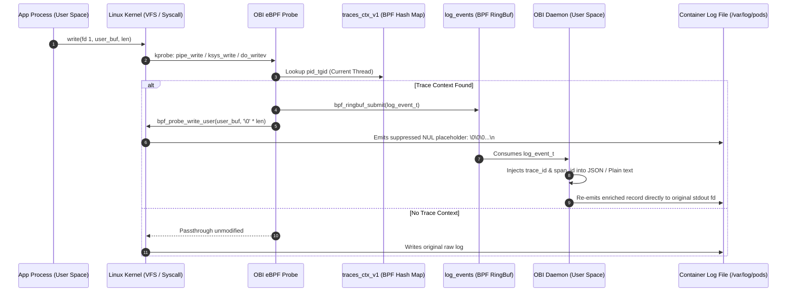
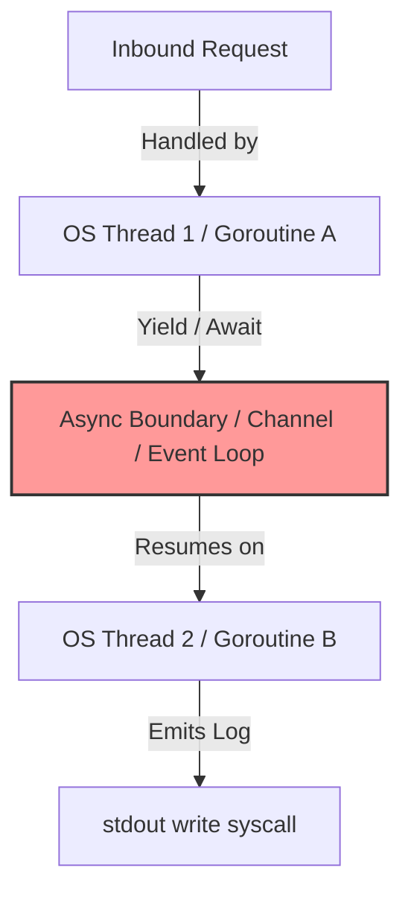

# Official Reference Announcement: Zero-Code Trace-Log Correlation with OBI

> **Source**: [OpenTelemetry Official Blog (October 2026)](https://opentelemetry.io/blog/2026/obi-trace-log-correlation/)  
> **Source Markdown**: [https://opentelemetry.io/blog/2026/obi-trace-log-correlation/index.md](https://opentelemetry.io/blog/2026/obi-trace-log-correlation/index.md)  
> **Target Audience**: Software Engineers, SREs, Platform Engineers, and Linux Kernel Specialists (Junior through Principal/Staff).

---

> **Documentation Hub**: [🏠 Overview](../README.md) &nbsp;|&nbsp; [📜 Announcement](reference-blog-announcement.md) &nbsp;|&nbsp; [🏛️ Architecture](architecture.md) &nbsp;|&nbsp; [📋 Day 0: Sizing](day0-planning-sizing.md) &nbsp;|&nbsp; [📦 Day 1: Deploy](day1-installation.md) &nbsp;|&nbsp; [🚨 Day 2: Ops](day2-operations-triage.md) &nbsp;|&nbsp; [💧 Log Filtering](log-filtering-guide.md) &nbsp;|&nbsp; [⚡ Runtimes](runtime-compatibility.md) &nbsp;|&nbsp; [🌐 Frontend](frontend-spa-ssr-telemetry.md) &nbsp;|&nbsp; [🕸️ Service Mesh](service-mesh-vs-ebpf-observability.md) &nbsp;|&nbsp; [📊 Tool Comparison](obi-vs-modern-observability-tools.md) &nbsp;|&nbsp; [🔧 Troubleshooting](troubleshooting.md) &nbsp;|&nbsp; [🧹 Decommission](decommission-guide.md) &nbsp;|&nbsp; [📚 References](references.md)

---


---

## Table of Contents
- [1. Verbatim Official Announcement Text](#1-verbatim-official-announcement-text)
- [2. Junior Engineer Primer (Explain Like I'm 5)](#2-junior-engineer-primer-explain-like-im-5)
  - [The 2 AM Incident Dilemma](#the-2-am-incident-dilemma)
  - [Why Not Just Use an SDK?](#why-not-just-use-an-sdk)
  - [How OBI Works Conceptually](#how-obi-works-conceptually)
  - [The Kitchen Ticket Analogy](#the-kitchen-ticket-analogy)
- [3. Advanced Specialist Deep Dive (Kernel & SRE Architecture)](#3-advanced-specialist-deep-dive-kernel--sre-architecture)
  - [Kernel Hook Mechanics & Memory Mutation](#kernel-hook-mechanics--memory-mutation)
  - [The Context Staleness Problem in Multi-Threaded Runtimes](#the-context-staleness-problem-in-multi-threaded-runtimes)
  - [The Null-Byte Replacement Mechanics & 8 KiB Boundary](#the-null-byte-replacement-mechanics--8-kib-boundary)
  - [Hybrid Coexistence with In-Process OpenTelemetry SDKs](#hybrid-coexistence-with-in-process-opentelemetry-sdks)
- [4. Production Verification & Reference Links](#4-production-verification--reference-links)

---

## 1. Verbatim Official Announcement Text

*Below is the complete, unabridged content of the OpenTelemetry blog post authored by the OpenTelemetry eBPF Instrumentation maintainers:*

***

### Zero-code trace-log correlation with OBI

You get paged. A trace shows a request failing in one of your services, and you know the answer is in the logs — but which log lines belong to *that* request? If the service never adopted structured logging with trace context, the honest answer is: you grep by timestamp and hope.

[OpenTelemetry eBPF Instrumentation (OBI)](https://github.com/open-telemetry/opentelemetry-ebpf-instrumentation) can now add that missing trace context to the logs your services already write. Your applications don't change: no SDK, no logging-library configuration, no application rebuild or redeploy.

The boundaries up front: it applies to logs written to stdout or stderr — the streams your container runtime captures — and a line is annotated when OBI has active trace context for the request being served at the moment of the write. What you roll out is an OBI configuration change and a one-line filter in your log pipeline.

Under the hood, OBI already knows — through eBPF — which request each thread is serving at the moment it writes a log line; that's the entire trick. The correlation fields are added before the container logging pipeline receives the line. The rest of this post covers what changes in practice, what the feature requires from your environment, and how to enable it.

#### What changes during an incident

Your application writes this:

```json
{ "level": "INFO", "message": "payment authorized", "amount": 42 }
```

The container log ends up with this:

```json
{
  "level": "INFO",
  "message": "payment authorized",
  "amount": 42,
  "trace_id": "4bf92f3577b34da6a3ce929d0e0e4736",
  "span_id": "00f067aa0ba902b7"
}
```

The IDs are the same ones OBI reports on the spans for that request, so correlation works in both directions: paste the `trace_id` from a failed trace into your log search and get exactly the log lines for that request, or copy the `trace_id` from a suspicious log line into your trace backend and land on the trace it belongs to.

It works for JSON logs, NDJSON, and plain text — free-form lines get a `key=value` annotation:

```text
payment authorized trace_id=4bf92f3577b34da6a3ce929d0e0e4736 span_id=00f067aa0ba902b7
```

If your logger already emits one of the configured fields, OBI preserves it and only fills in what's missing.

Here it is end to end, on a small demo: an uninstrumented Go `frontend` that calls an uninstrumented Go `backend`, each logging one JSON line per request, plus OBI and Jaeger — four containers total. No OpenTelemetry SDK anywhere in the application code.

A single request to the frontend produces one distributed trace in Jaeger — OBI also propagates the trace context between the two services, so the frontend and backend spans join under one trace:


Both services logged plain JSON with no trace fields; OBI injected matching context — the same `trace_id` in both services, each with its own `span_id`:


Searching Jaeger for the `trace_id` from either log line lands on exactly the trace shown above.

#### Is this a fit for your environment?

Check these before you plan a rollout:

- **Log destination.** Enrichment covers logs written to stdout or stderr and captured by the container runtime. Logs written directly to files or shipped over the network by an in-process appender are not covered.
- **Active trace context.** A line is enriched only when it is written while OBI is tracing a request on that service — an HTTP or gRPC request, a client call, or a database operation in flight. Startup messages and background-job logs pass through unchanged.
- **Kernel and privileges.** OBI's log enricher needs `CAP_SYS_ADMIN` and a kernel that is not in lockdown mode. Enriching the common `write()` path requires Linux 6.0 or later; on older kernels only `writev()`-based writes are enriched, so coverage depends on how your runtime's logger writes.
- **Synchronous logging.** The link between a log line and a request relies on the write happening from the thread serving the request. Go, Java, and Ruby loggers do this by default. Node.js stdout is asynchronous when backed by a pipe — the default in containers — so under write backpressure occasional lines can miss or carry stale context. Python needs `PYTHONUNBUFFERED=1`; .NET needs a synchronous console writer. Java virtual threads are not enriched yet; platform-thread workloads are unaffected.
- **Services instrumented with an OTel SDK.** Enrichment works there too, and is useful when the SDK exports traces but not logs: OBI injects only `trace_id`, because the span IDs OBI generates would not match the SDK's — and a wrong span link is worse than none. You can still find the transaction in the logs by trace ID.

#### Enable it

The enricher is opt-in. With version 2 configuration, enable it under `extensions.obi.correlation.log_trace_annotation`. Its `match` list takes the same match clauses as `capture` rules and selects which captured workloads get annotated. It must select at least one workload, and a workload outside your `capture` selection is never annotated:

```yaml
extensions:
  obi:
    version: '2.0'
    capture:
      policy:
        default_action: exclude
      rules:
        - action: include
          match:
            process:
              exe_path_glob:
                - /frontend
                - /backend
    correlation:
      log_trace_annotation:
        enabled: true
        match:
          - process:
              exe_path_glob:
                - /frontend
                - /backend
        plain_text:
          enabled: true
          placement: suffix
          multiline: first_line
```

The `plain_text` block controls where the `key=value` annotation is placed on non-JSON logs and which lines of a multi-line write get it. The injected field names default to `trace_id` and `span_id` and are configurable via `field_names`, so the output matches whatever your log pipeline already expects.

With version 1 configuration, the same selection lives under `ebpf.log_enricher.services` — see the [trace-log correlation documentation](https://opentelemetry.io/docs/zero-code/obi/trace-log-correlation/) for the details.

One pipeline change is required: for each enriched line, the original un-enriched line is replaced by a blank placeholder (NUL bytes) in the container log, and the enriched line is appended in its place. Add a filter to your log shipper that drops the blank placeholder lines — a single rule that matches all-NUL records.

#### Before enabling it in production

Behavior to account for in your rollout plan:

- **Large writes are split.** A single `write()` or `writev()` larger than 8 KiB is not enriched intact: the captured prefix is re-emitted with trace context while the remainder reaches the log stream separately, without enrichment — one logical record can become two. If your services routinely emit very large log lines, measure before enabling.
- **Roll out incrementally.** Start with one low-risk service in `match` and check two things in your log backend: the blank placeholder lines are being dropped by your filter, and log lines appear once — not duplicated, not split. Then add more services to `match`. Services left out of `match` are still traced; only their logs are left unchanged. Rolling back is removing a service from `match`, or setting `enabled: false` to turn annotation off for every service; the application is untouched in either direction.

#### Try it

Trace-log correlation ships in OBI. Point it at one service, add the placeholder filter to your log shipper, and your existing logs — with no application rebuild or redeploy — start carrying the trace IDs you needed during the last incident.

- Run the demo from this post yourself: [docker compose example](https://gist.github.com/mmat11/f3f23707e7bc9c94bce144f56276251d)
- [OBI documentation](https://opentelemetry.io/docs/zero-code/obi/)
- [OBI repository](https://github.com/open-telemetry/opentelemetry-ebpf-instrumentation)
- Curious how it works under the hood? The eBPF internals live in the [developer documentation](https://github.com/open-telemetry/opentelemetry-ebpf-instrumentation/blob/main/devdocs/trace-log-correlation.md)
- Questions or feedback: the [#otel-ebpf-instrumentation](https://cloud-native.slack.com/archives/C06DQ7S2YEP) channel on the CNCF Slack

***

---

## 2. Junior Engineer Primer (Explain Like I'm 5)

If you are new to observability, distributed systems, or Linux kernels, this section breaks down the foundational concepts.

### The 2 AM Incident Dilemma
Imagine you are on-call. Your phone alerts you at 2:00 AM:
1. You open **Jaeger** or **Tempo** and see a red, failing HTTP request: `POST /checkout` failed with `500 Internal Server Error`.
2. The trace gives you a **`trace_id`**: `4bf92f3577b34da6a3ce929d0e0e4736`.
3. To understand *why* it failed (e.g. database deadlocked, third-party payment gateway rejected card, out-of-memory error), you need to read the application log output.
4. You open **Grafana Loki**, **Elasticsearch**, or **AWS CloudWatch**. You search for logs around `02:00:00`.
5. **The nightmare**: Your system processes 15,000 requests per second. There are 250,000 log lines in that single minute across 50 Kubernetes pods. Because none of the log lines mention `trace_id`, you are forced to manually guess which log belongs to which user request based on timestamps. If server clocks drift by even 100 milliseconds, you are completely blind.

### Why Not Just Use an SDK?
In an ideal world, developers would add the OpenTelemetry SDK to every service, attach a logging library bridge (like `zap`, `logback`, or `slog`), and automatically inject `trace_id` into every log statement.

In the real enterprise world:
- **Polyglot Sprawl**: The company has 80 Go microservices, 40 Python services, 30 Node.js apps, and legacy Java services.
- **Legacy & Frozen Code**: Some applications were written 6 years ago by engineers who left the company; the code cannot easily be modified or recompiled.
- **Third-Party Binaries**: Proprietary software or COTS (Commercial Off-The-Shelf) binaries where you do not possess the source code.
- **Months of Backlog**: Coordinating 20 engineering squads to update libraries, test, and deploy can take an entire fiscal year.

### How OBI Works Conceptually
**OBI (OpenTelemetry eBPF Instrumentation)** does not touch the application's source code, container image, or dependencies. Instead, it runs as a privileged Linux daemon (DaemonSet in Kubernetes) that attaches **eBPF probes** inside the Linux kernel.

Whenever an application calls `fmt.Println()`, `print()`, or `logger.info()`, the program executes a Linux **system call** named `write()` to send text to `stdout` (File Descriptor 1).
OBI intercepts that `write()` call inside the kernel:
1. It asks the kernel: *"Which HTTP request was this thread serving right now?"*
2. The kernel responds with the active `trace_id` and `span_id`.
3. OBI inserts `"trace_id": "4bf9..."` into the log line.
4. The container log now contains the enriched line!

### The Kitchen Ticket Analogy
- **Trace ID** = The Order Slip Number (Ticket #42) created when a customer places an order.
- **Span ID** = The specific station working on the order (e.g., Salad Station, Grill Station).
- **Log Line** = The chef yelling *"Out of onions!"*
- Without correlation, the manager hears someone yell *"Out of onions!"* but has no idea which customer's order ticket is delayed.
- With OBI, before the chef's voice leaves the kitchen, OBI stamps `[Ticket #42, Grill Station]` onto the note, so the manager instantly knows which customer is affected.

### Visual Architecture Infographic

[](images/zero-code-trace-log-correlation-infographic.png)

---

## 3. Advanced Specialist Deep Dive (Kernel & SRE Architecture)

For Staff SREs, Kernel Engineers, and Enterprise Architects, this section details the low-level operating system mechanics and edge cases.

### Kernel Hook Mechanics & Memory Mutation



1. **Syscall Hook Points**:
   - `ksys_write` and `pipe_write` for standard writes (`ITER_UBUF`, Linux kernel >= 6.0).
   - `do_writev` for vectored I/O (`ITER_IOVEC`).
   - `tty_write` for interactive pseudo-terminal allocations.
2. **Buffer Suppression via `bpf_probe_write_user`**:
   - In Linux eBPF, a probe cannot silently cancel or divert a system call that has already begun execution.
   - To prevent duplicate logs (the original un-enriched line AND the new enriched line), OBI uses `bpf_probe_write_user` to zero out the memory buffer in the calling process's user space before the kernel copies it to the stdout pipe.
   - The kernel pipe receives a stream of NUL bytes (`\x00\x00...`) terminated by a newline `\n`.
3. **Re-Emission via User-Space Daemon**:
   - The user-space OBI daemon reads the original log payload from the BPF ring buffer, serializes the updated JSON or key-value plain-text line, and writes it directly to the container's stdout file descriptor.

### The Context Staleness Problem in Multi-Threaded Runtimes

The BPF map `traces_ctx_v1` is indexed by `u64 pid_tgid` (Process ID + OS Thread ID). In synchronous, single-threaded code, this is 100% reliable. However, modern high-concurrency runtimes decouple requests from OS threads:



To eliminate stale or swapped trace IDs, OBI implements **Per-Runtime Context Refresh Probes**:

1. **Go (Goroutine Multiplexing)**:
   - Go multiplexes $N$ goroutines onto $M$ OS threads.
   - OBI hooks `runtime.casgstatus` using uprobes. Whenever a goroutine transitions to `_Grunning` (state 2) or `_Gsyscall` (state 3), OBI updates `traces_ctx_v1` with that goroutine's active trace context.
   - Idempotency is guaranteed via `BPF_ANY` hash map semantics.
2. **Node.js (Event Loop & libuv)**:
   - Single thread interleaves multiple requests.
   - OBI injects an `async_hooks` `before()` callback. Before any async callback executes, it calls `fs.accessSync('/dev/null/obi-ctx/<fd>')`.
   - A BPF uprobe intercepts this specific path, extracts the socket file descriptor, looks up `fd_to_connection`, and refreshes `traces_ctx_v1` immediately before JavaScript execution.
3. **Java (Thread Pools & ByteBuddy)**:
   - Request received on acceptor thread, processed on worker thread.
   - OBI uses ByteBuddy bytecode instrumentation to hook `Executor.execute()`, `Runnable.run()`, and `ForkJoinTask`.
   - The child thread executes `ioctl(0, 0x0b10b1)` (`k_ioctl_java_threads`), allowing the BPF kprobe to traverse the parent-child thread hierarchy up to 3 levels.
   - **Virtual Threads (Project Loom)**: Currently unsupported because carrier thread hopping cannot be cleanly disambiguated at the kernel level without carrier thread contamination.
4. **Python (CPython Asyncio)**:
   - Uprobes on `_asyncio.Task.task_step` (Python 3.12+) and `PyContext_CopyCurrent` refresh context on every `await` resumption.
   - **Mandatory**: Must set `ENV PYTHONUNBUFFERED=1` in Docker containers to disable Python's 8 KiB C stdio block buffering on pipes.

### The Null-Byte Replacement Mechanics & 8 KiB Boundary

#### Why Log Pipelines Require a Filter
Because `bpf_probe_write_user` replaces the original log line with zeroes, `/var/log/pods/*/*.log` contains:
```text
\x00\x00\x00\x00\x00\x00\x00\x00\x00\x00\x00\x00\x00\x00\x00\x00\n
{"level":"INFO","message":"payment authorized","amount":42,"trace_id":"4bf9...","span_id":"00f0..."}\n
```
Log shippers (OpenTelemetry Collector, Vector, Fluent Bit, Promtail) must drop the blank placeholder line using the regex:
```regex
^[\x00\s]*$
```

#### The 8 KiB Split Limitation
- The eBPF stack space and `bpf_probe_write_user` helper in Linux enforce safety limits.
- If an application issues a single `write()` call exceeding **8,192 bytes (8 KiB)** (e.g. huge stack trace, gigantic JSON blob):
  1. OBI only captures and enriches the **first 8 KiB**.
  2. The remaining bytes past 8 KiB bypass enrichment and leak into stdout untouched.
  3. The result is that one logical record is split into two separate records in the log stream.
  4. SRE Recommendation: Monitor log line sizes or configure application loggers to truncate single payloads below 8 KiB.

### Hybrid Coexistence with In-Process OpenTelemetry SDKs

What happens if a backend service already uses the Go, Java, or Python OpenTelemetry SDK to emit traces, but the team forgot to configure log correlation?

```text
Application Process (with OTel SDK)
       │
       ├──> Generates Span A (SpanID: 1111111111111111, TraceID: 4bf92f3577b34da6...)
       └──> Logs to stdout: {"msg":"database query finished"} (NO trace_id)
```

OBI automatically detects that the process is exporting OTLP traces directly:
- **It injects `trace_id`**: Matches the SDK's active trace ID perfectly.
- **It SUPPRESSES injecting `span_id`**: OBI's kernel eBPF probe would generate its own synthetic span ID (e.g. `2222222222222222`), which would **contradict** the SDK's actual span ID (`1111...`).
- Emitting conflicting span IDs breaks APM waterfall charts in Jaeger and Grafana Tempo. By injecting only `trace_id`, OBI guarantees 100% correlation without data corruption.

---

## 4. Production Verification & Reference Links

- **Official Blog Post**: [https://opentelemetry.io/blog/2026/obi-trace-log-correlation/](https://opentelemetry.io/blog/2026/obi-trace-log-correlation/)
- **Official Markdown Source**: [https://opentelemetry.io/blog/2026/obi-trace-log-correlation/index.md](https://opentelemetry.io/blog/2026/obi-trace-log-correlation/index.md)
- **Kernel Internals Developer Spec**: [open-telemetry/opentelemetry-ebpf-instrumentation / devdocs/trace-log-correlation.md](https://github.com/open-telemetry/opentelemetry-ebpf-instrumentation/blob/main/devdocs/trace-log-correlation.md)
- **Official OpenTelemetry OBI Documentation**: [https://opentelemetry.io/docs/zero-code/obi/trace-log-correlation/](https://opentelemetry.io/docs/zero-code/obi/trace-log-correlation/)
- **Upstream Demonstration Gist**: [https://gist.github.com/mmat11/f3f23707e7bc9c94bce144f56276251d](https://gist.github.com/mmat11/f3f23707e7bc9c94bce144f56276251d)
- **CNCF Community Slack Channel**: [#otel-ebpf-instrumentation](https://cloud-native.slack.com/archives/C06DQ7S2YEP)


---

## 🧭 Navigation & Documentation Directory

| ⬅️ Previous Document | 🏠 Documentation Hub | ➡️ Next Document |
| :--- | :---: | ---: |
| [**References & Official Documentation**](references.md) | [**Repository Overview**](../README.md) | [**Architecture Deep Dive**](architecture.md) |

### 📚 Complete Guide Catalog
- 📜 **[Official Reference Announcement](reference-blog-announcement.md)** — Verbatim OpenTelemetry announcement with junior primers and kernel deep dives
- 🏛️ **[Architecture Deep Dive](architecture.md)** — Low-level syscall hooks (`pipe_write`, `ksys_write`, `do_writev`), LRU maps, and ringbuffer flow
- 📋 **[Day 0: Planning & Sizing](day0-planning-sizing.md)** — Linux 6.0+ matrix, kernel lockdown, memory sizing formulas, and security postures
- 📦 **[Day 1: Multi-Cluster Deployment](day1-installation.md)** — Enterprise overlays for OpenShift 4.20+, AKS, EKS, GKE, RKE2, and Docker Compose
- 🚨 **[Day 2: Operations & Incident Triage](day2-operations-triage.md)** — SRE incident response playbook, LogQL/Jaeger queries, and canary rollouts
- 💧 **[Log Shipper Filtering Guide](log-filtering-guide.md)** — Suppressed NUL byte placeholder drop filters and 8 KiB write split handling
- ⚡ **[Runtime Compatibility Guide](runtime-compatibility.md)** — Go runtime hooks, `PYTHONUNBUFFERED=1`, Node.js async streams, and Java Loom
- 🌐 **[Frontend SPAs & SSR Telemetry Guide](frontend-spa-ssr-telemetry.md)** — W3C `traceparent` HTTP bridge, Angular/React/Vue patterns, and SSR kernel interception
- 🕸️ **[Service Mesh vs. eBPF Observability Guide](service-mesh-vs-ebpf-observability.md)** — Architectural comparison between Istio Ambient (ztunnel/waypoint) network proxying and OBI kernel-level trace-log enrichment
- 📊 **[OBI vs. Modern Observability Tools](obi-vs-modern-observability-tools.md)** — Architectural analysis & strategic conclusions comparing OBI against Datadog, Grafana, Dynatrace & New Relic
- 🔧 **[Troubleshooting & Diagnostics](troubleshooting.md)** — Common pitfalls, eBPF probe errors, missing trace IDs, and verification steps
- 🧹 **[Decommission & Teardown Guide](decommission-guide.md)** — Safe probe detachment, BPF map unpinning, and resource cleanup
- 📚 **[References & Official Documentation](references.md)** — Upstream OpenTelemetry specifications, GitHub repositories, and CNCF channels
