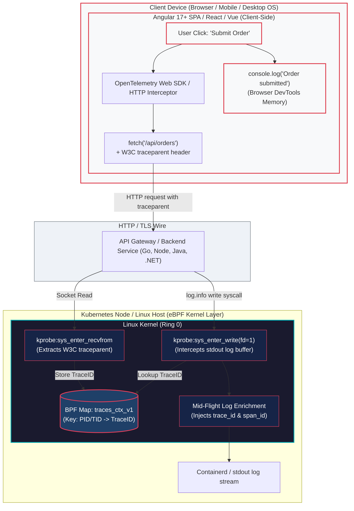
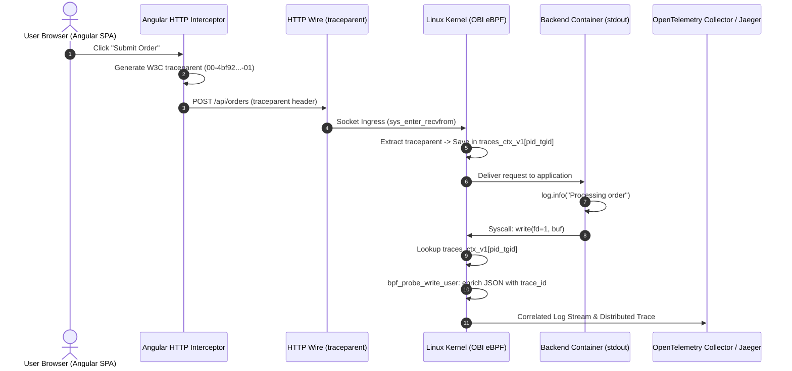
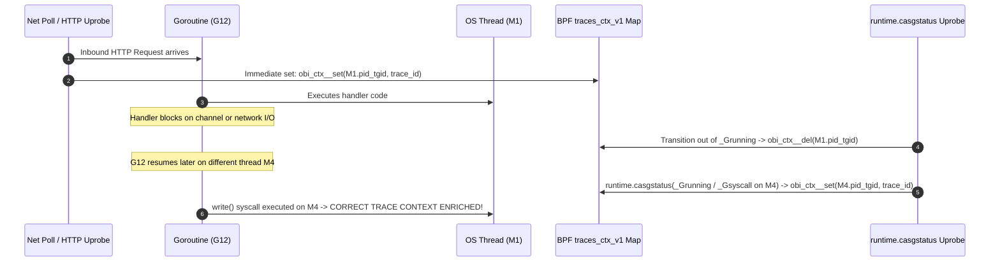

# Runtime Compatibility & Language Guidance: Solving Context Staleness in OBI

> **Reference Documentation**:
> - [Zero-Code Trace-Log Correlation with OBI (Official Blog Announcement)](reference-blog-announcement.md)
> - [Kernel Internals & Developer Spec (devdocs/trace-log-correlation.md)](https://github.com/open-telemetry/opentelemetry-ebpf-instrumentation/blob/main/devdocs/trace-log-correlation.md)

---

> **Documentation Hub**: [🏠 Overview](../README.md) &nbsp;|&nbsp; [📜 Announcement](reference-blog-announcement.md) &nbsp;|&nbsp; [🏛️ Architecture](architecture.md) &nbsp;|&nbsp; [📋 Day 0: Sizing](day0-planning-sizing.md) &nbsp;|&nbsp; [📦 Day 1: Deploy](day1-installation.md) &nbsp;|&nbsp; [🚨 Day 2: Ops](day2-operations-triage.md) &nbsp;|&nbsp; [💧 Log Filtering](log-filtering-guide.md) &nbsp;|&nbsp; [⚡ Runtimes](runtime-compatibility.md) &nbsp;|&nbsp; [🌐 Frontend](frontend-spa-ssr-telemetry.md) &nbsp;|&nbsp; [🕸️ Service Mesh](service-mesh-vs-ebpf-observability.md) &nbsp;|&nbsp; [📊 Tool Comparison](obi-vs-modern-observability-tools.md) &nbsp;|&nbsp; [🔧 Troubleshooting](troubleshooting.md) &nbsp;|&nbsp; [🧹 Decommission](decommission-guide.md) &nbsp;|&nbsp; [📚 References](references.md)

---


---

## Table of Contents
- [1. Executive Summary](#1-executive-summary)
- [2. The Fundamental Problem: Context Staleness Across Runtimes](#2-the-fundamental-problem-context-staleness-across-runtimes)
  - [The Junior Mental Model: The Restaurant Waiter Analogy](#the-junior-mental-model-the-restaurant-waiter-analogy)
  - [The Technical Problem: OS Threads vs Application Concurrency](#the-technical-problem-os-threads-vs-application-concurrency)
- [3. Per-Runtime Summary Table & Practical Guidance](#3-per-runtime-summary-table--practical-guidance)
  - [Architectural Dimensions of the Runtime Matrix](#architectural-dimensions-of-the-runtime-matrix)
  - [Go Runtime: Out-of-the-Box Success & Goroutine Pitfalls](#go-runtime-out-of-the-box-success--goroutine-pitfalls)
  - [Python Runtime: The Block Buffering Trap & Asyncio Fixes](#python-runtime-the-block-buffering-trap--asyncio-fixes)
  - [Node.js Runtime: Event Loop Alignment & Worker Thread Traps](#nodejs-runtime-event-loop-alignment--worker-thread-traps)
  - [Java Runtime: Platform Threads vs Project Loom Virtual Thread Failures](#java-runtime-platform-threads-vs-project-loom-virtual-thread-failures)
  - [.NET Runtime: ASP.NET Core Background Channel Dilemma & Solutions](#net-runtime-aspnet-core-background-channel-dilemma--solutions)
  - [Ruby Runtime: Puma Reactor Paths & Background Job Limits](#ruby-runtime-puma-reactor-paths--background-job-limits)
  - [Frontend SPAs & Full-Stack SSR: Angular, React & Next.js](#frontend-spas--full-stack-ssr-angular-react--nextjs)
  - [Plain-Text & Legacy Monoliths: Non-JSON Key-Value Enrichment](#plain-text--legacy-monoliths-non-json-key-value-enrichment)
- [4. Deep Dive: Per-Runtime Kernel Refresh Mechanics](#4-deep-dive-per-runtime-kernel-refresh-mechanics)
  - [Go Runtime: `runtime.casgstatus` Uprobes](#go-runtime-runtimecasgstatus-uprobes)
  - [Node.js Runtime: `async_hooks` & `uv_fs_access`](#nodejs-runtime-async_hooks--uv_fs_access)
  - [Java Runtime: ByteBuddy & Thread Hierarchy `ioctl`](#java-runtime-bytebuddy--thread-hierarchy-ioctl)
  - [Ruby (Puma): Direct vs Reactor Path (`rb_ary_shift`)](#ruby-puma-direct-vs-reactor-path-rb_ary_shift)
  - [Python Runtime: CPython Asyncio & `PYTHONUNBUFFERED=1`](#python-runtime-cpython-asyncio--pythonunbuffered1)
  - [.NET Runtime: Synchronous Writers vs Background Channels](#net-runtime-synchronous-writers-vs-background-channels)
- [5. Coexistence with OpenTelemetry In-Process SDKs (Hybrid Mode)](#5-coexistence-with-opentelemetry-in-process-sdks-hybrid-mode)

---

## 1. Executive Summary

OBI correlates log writes with distributed traces by capturing the active `trace_id` and `span_id` associated with the executing thread. In a simplistic OS model, each incoming network request would be served from start to finish by a single dedicated operating system thread (`pid_tgid`).

However, modern high-performance runtimes (Go, Node.js, Python Asyncio, Java Netty/Tomcat) decouple I/O handling from CPU execution. Without runtime-aware kernel hooks, `traces_ctx_v1[pid_tgid]` would become stale, causing logs from one customer request to be incorrectly stamped with the trace ID of a different customer request.

This document explains the runtime specifics, requirements, and kernel probe mechanisms that solve context staleness.

---

## 2. The Fundamental Problem: Context Staleness Across Runtimes

### The Junior Mental Model: The Restaurant Waiter Analogy
Imagine a busy restaurant:
- **Waiter (OS Thread)**: The worker who runs back and forth between the kitchen and tables.
- **Order Slip (Trace Context)**: The customer's ticket (Ticket #101).
- **Notepad (Log Buffer)**: Where the worker writes down status notes ("Drink prepared").

In an old synchronous model, Waiter Bob took Ticket #101, walked to the bar, prepared the drink, wrote "Drink prepared" on Bob's notepad, and brought it to Table 101. Bob's badge ID was always tied to Ticket #101.

In a modern async model:
- Waiter Bob takes Ticket #101, hands the drink order to the bartender, and immediately walks over to Table 102 to take Ticket #102.
- When the bartender finishes the drink for Table 101, Waiter Alice happens to be walking past. Alice picks up the glass and writes "Drink prepared" on Alice's notepad.
- If OBI only checked "Who is Alice serving?", it might stamp Ticket #102 on Table 101's drink!

### The Technical Problem: OS Threads vs Application Concurrency
The kernel BPF map `traces_ctx_v1` is indexed by `u64 pid_tgid` (OS Process ID + Thread ID).
- **Go**: Multiplexes thousands of Goroutines ($G$) onto a pool of OS threads ($M$). A goroutine can yield on channel I/O or a network call, and resume on a completely different OS thread.
- **Node.js**: The single-threaded event loop processes multiple interleaved requests concurrently via `libuv`. Multiple HTTP requests arrive on the wire before any user JavaScript callback runs.
- **Java**: HTTP servers (Netty, Tomcat) use separate acceptor threads to read socket bytes, then pass tasks to worker thread pools.
- **Python**: In `asyncio`, an event loop runs many tasks on a single OS thread. When code hits `await`, the thread switches tasks.

To prevent context staleness, OBI hooks each runtime's internal scheduler to refresh `traces_ctx_v1` at the exact instant context switches occur.

---

## 3. Per-Runtime Summary Table & Practical Guidance

The matrix below provides an operational overview of how mainstream programming language runtimes behave with OBI eBPF zero-code trace-log correlation.

| Language Runtime | Default Stdout Buffering | Works Out of the Box? | Mandatory Configuration / Remediation | Context Refresh Hook | Risk of Context Staleness |
| :--- | :--- | :---: | :--- | :--- | :---: |
| **Go** | Synchronous `write()` | ✅ **Yes** | None (Zero-code / Zero-config) | `runtime.casgstatus` uprobes | Minimal (Except detached background goroutines) |
| **Python** | Block-buffered on pipes (8 KiB) | ⚠️ **Requires Env** | `ENV PYTHONUNBUFFERED=1` in Dockerfile | `_asyncio.Task.task_step` uprobes | **High** if unbuffered mode is omitted |
| **Node.js** | Synchronous stdout pipe | ✅ **Yes** | Use direct stdout stream; avoid worker-thread transports | `async_hooks` + `uv_fs_access` uprobe | Low (High if using thread-stream transports) |
| **Java (Platform Threads)** | Immediate `System.out` flush | ✅ **Yes** | Standard synchronous console appenders | ByteBuddy + `ioctl` (`k_ioctl_java_threads`) | Low with platform thread pools |
| **Java (Virtual Threads / Loom)** | Fiber carrier multiplexing | ❌ **Not Supported** | Do not rely on OBI for Loom fibers; use in-process OTel SDK | None (Virtual carrier hopping unmapped) | **Extreme** (Severe trace cross-contamination) |
| **.NET (C# / ASP.NET)** | Block-buffered (4 KB) | ⚠️ **Requires Code** | Serilog synchronous console sink or `AutoFlush = true` | Synchronous console appender required | **High** with default `AddConsole()` background channel |
| **Ruby (Puma)** | Synchronous `syswrite()` | ✅ **Yes** | Ensure `STDOUT.sync = true` in multi-process Puma | `rb_ary_shift` uprobes | Low within web worker threads |
| **Frontend SPAs (Client Browser)** | In-browser DevTools memory | 🌐 **Bridged via HTTP** | OpenTelemetry Web SDK / Angular Interceptor `traceparent` injection | Not in kernel; bridged at backend socket ingress | **Zero on server** (Client execution outside host kernel) |
| **Frontend SSR (Angular / Node.js)** | Synchronous stdout pipe | ✅ **Yes** | Direct synchronous stdout; avoid decoupled async queues | Node.js `async_hooks` uprobes | Low (High if using deferred async queues) |
| **Legacy Plain-Text (C/C++/Go)** | VFS write syscalls | ✅ **Yes** | None (Appends `trace_id=... span_id=...` key-value pairs) | Direct `sys_enter_write` kprobe | Minimal |

---

### Architectural Dimensions of the Runtime Matrix

To understand why some runtimes work effortlessly while others silently lose trace correlation, engineers must evaluate three fundamental architectural dimensions:

1. **User-Space Buffering vs Kernel System Calls**:
   - The Linux kernel eBPF probe operates strictly at the VFS syscall boundary (`sys_enter_write` and `sys_enter_writev`).
   - If an application's runtime or standard C library (`libc`) buffers output in user-space memory (e.g. 4 KiB or 8 KiB buffers), the actual `write()` syscall does not occur when the code executes `log.info(...)`.
   - Instead, the syscall is deferred until the buffer fills or the process exits. By that time, the thread has finished processing the original HTTP transaction, resulting in **either a completely missing trace ID or an incorrect trace ID from an unrelated subsequent request**.

2. **Thread Affinity vs Asynchronous Dispatch**:
   - The kernel identifies executing code by `bpf_get_current_pid_tgid()` (Thread Group ID + Process ID).
   - If a logging framework immediately hands log entries to a separate background thread pool, async channel, or worker thread (as seen in ASP.NET Core `AddConsole()` or Pino worker threads), the thread that actually issues the `write()` system call is **not** the thread that handled the request.
   - Without active thread-hierarchy tracking, the worker thread possesses no entry in the `traces_ctx_v1` BPF map.

3. **Runtime Scheduler Visibility**:
   - In cooperative multitasking runtimes (Go Goroutines, Python Asyncio, Node.js Event Loop), multiple units of application concurrency are multiplexed over one or more OS threads.
   - OBI requires runtime-specific uprobes (`runtime.casgstatus`, `async_hooks`, `_asyncio.Task.task_step`) to update `traces_ctx_v1` precisely as the runtime scheduler switches active execution contexts.

---

### Go Runtime: Out-of-the-Box Success & Goroutine Pitfalls

#### Why It Works Out of the Box
Go's runtime scheduler multiplexes $M$ operating system threads across $N$ goroutines. OBI hooks `runtime.casgstatus` to detect when a goroutine enters `_Grunning` or `_Gsyscall`. When an uninstrumented Go application logs via `log/slog` or `fmt.Println`, the runtime issues a direct `write()` syscall on the current OS thread $M$, allowing the eBPF probe to match `traces_ctx_v1[pid_tgid]` instantaneously.

#### ✅ Working Sample: Standard Go `log/slog` JSON Server
This is the pattern implemented in [`demo-apps/go/frontend/main.go`](../demo-apps/go/frontend/main.go):

```go
package main

import (
    "log/slog"
    "net/http"
    "os"
)

func main() {
    // Zero-code setup: Standard JSON handler writing directly to os.Stdout
    logger := slog.New(slog.NewJSONHandler(os.Stdout, nil))

    http.HandleFunc("/api/order", func(w http.ResponseWriter, r *http.Request) {
        // OBI intercepts this stdout write and correlates it with the active HTTP trace!
        logger.Info("order received",
            slog.String("item", "widget-pro"),
            slog.Int("qty", 2),
        )
        w.WriteHeader(http.StatusOK)
    })

    http.ListenAndServe(":8080", nil)
}
```

#### ⚠️ When It Does NOT Work: Detached Background Goroutines
If an HTTP handler fires an unmonitored background goroutine that outlives the HTTP request or performs async work after returning, OBI's return uprobe clears the active HTTP trace context when the handler finishes:

```go
// ❌ BROKEN SCENARIO: Detached background goroutine loses trace context
http.HandleFunc("/api/order", func(w http.ResponseWriter, r *http.Request) {
    logger.Info("order accepted synchronously") // ✅ Correlated!

    // Fire-and-forget goroutine executing after HTTP response returns
    go func() {
        time.Sleep(200 * time.Millisecond)
        // ❌ FAILS: The HTTP request has finished. OBI's return probe cleared
        // the thread's trace context. This log line will NOT contain trace_id!
        logger.Info("async background notification dispatched")
    }()

    w.WriteHeader(http.StatusAccepted)
})
```

#### 💡 Remediation for Background Goroutines
For asynchronous tasks that outlive the HTTP request, pass context explicitly or log within the synchronous boundary:
```go
// ✅ REMEDIATION: Capture context or complete work within handler lifecycle
http.HandleFunc("/api/order", func(w http.ResponseWriter, r *http.Request) {
    logger.Info("processing order synchronously")
    
    // Complete async work with WaitGroup or bounded context before returning:
    done := make(chan struct{})
    go func() {
        logger.Info("in-flight worker task executing") // ✅ Correlated while request is active
        close(done)
    }()
    <-done
    w.WriteHeader(http.StatusOK)
})
```

---

### Python Runtime: The Block Buffering Trap & Asyncio Fixes

#### Why It FAILS Out of the Box: The `libc` Block Buffering Trap
By default, the C standard library (`libc`) detects whether standard output is connected to an interactive terminal (`isatty(fileno)`):
- **Terminal (TTY)**: Standard output is **line-buffered** (flushed on each newline `\n`).
- **Container Pipe (`/dev/stdout`)**: When running inside Docker or Kubernetes, stdout is redirected to a pipe. In non-TTY mode, Python switches to **block-buffering (typically 8,192 bytes)**.

As a result, Python buffers log lines in memory and only triggers the kernel `write()` syscall after 8 KiB accumulates. By that time, the original HTTP request has long since ended, and the thread is either idle or serving an unrelated request.

#### ❌ Broken Sample: Default Containerized Python
```python
# app.py - BROKEN IN CONTAINERS WITHOUT UNBUFFERED MODE
import logging
from http.server import HTTPServer, BaseHTTPRequestHandler

logging.basicConfig(level=logging.INFO, format='{"time":"%(asctime)s","msg":"%(message)s"}')

class Handler(BaseHTTPRequestHandler):
    def do_GET(self):
        # ❌ FAILS: Log line stays in Python's internal 8 KiB buffer!
        # The write() syscall is NOT called during this request.
        logging.info("handling customer checkout")
        self.send_response(200)
        self.end_headers()
        self.wfile.write(b"OK\n")

HTTPServer(("", 8082), Handler).serve_forever()
```

#### ✅ Working Fix 1 (Recommended Dockerfile): `ENV PYTHONUNBUFFERED=1`
As configured in [`demo-apps/python/Dockerfile`](../demo-apps/python/Dockerfile):
```dockerfile
FROM python:3.12-alpine
WORKDIR /app

# CRITICAL FOR OBI TRACE-LOG CORRELATION:
# Disables libc block buffering on pipes, ensuring each log write
# triggers an immediate write() syscall on the active thread.
ENV PYTHONUNBUFFERED=1

COPY app.py .
CMD ["python", "app.py"]
```

#### ✅ Working Fix 2 (CLI / Kubernetes Command Override)
Invoke Python with the `-u` (unbuffered) flag:
```bash
python -u app.py
```

#### ✅ Working Fix 3 (Code-Level Reconfiguration)
For existing applications where Dockerfiles cannot be modified, reconfigure standard streams in code:
```python
import sys
# Forces line buffering on stdout even when piped to a container runtime
sys.stdout.reconfigure(line_buffering=True)
```

#### ⚡ Asyncio & FastAPI Compatibility
In asynchronous frameworks (FastAPI, Starlette, AIOHTTP), OBI attaches uprobes to `_asyncio.Task.task_step` to update `traces_ctx_v1` across `await` yields:
```python
from fastapi import FastAPI
import logging, sys, asyncio

# Ensure synchronous stdout flushes
sys.stdout.reconfigure(line_buffering=True)
app = FastAPI()
logger = logging.getLogger("api")

@app.get("/items/{item_id}")
async def get_item(item_id: str):
    logger.info(f"fetching item {item_id}") # ✅ Correlated!
    await asyncio.sleep(0.05) # Yields execution to event loop
    logger.info(f"item {item_id} ready")    # ✅ Correlated after coroutine resume!
    return {"item_id": item_id}
```

---

### Node.js Runtime: Event Loop Alignment & Worker Thread Traps

#### Why It Works Out of the Box
Node.js processes requests on a single-threaded event loop. Standard `process.stdout.write` and `console.log` execute synchronous writes to file descriptor 1. OBI pairs an internal `async_hooks` bridge with a `uv_fs_access` dummy file descriptor probe to synchronize `traces_ctx_v1` as callbacks resume.

#### ✅ Working Sample: Direct Synchronous Stdout Stream
As implemented in [`demo-apps/nodejs/server.js`](../demo-apps/nodejs/server.js):
```javascript
const http = require('http');

function logJSON(level, msg, extra = {}) {
  const line = JSON.stringify({
    timestamp: new Date().toISOString(),
    level,
    msg,
    ...extra
  }) + '\n';
  // Synchronous write on the main event-loop thread
  process.stdout.write(line);
}

const server = http.createServer((req, res) => {
  // ✅ Correlated: OBI intercepts this write() on the active HTTP context
  logJSON('INFO', 'handling node.js async transaction', { path: req.url });
  res.writeHead(200, { 'Content-Type': 'application/json' });
  res.end('{"status":"ok"}\n');
});

server.listen(8083);
```

#### ❌ When It Fails: Asynchronous Worker-Thread Transports
Many Node.js teams configure **Pino** with multi-threaded worker transports (`pino.transport({ target: 'pino/file' })` or `thread-stream`) to offload log serialization from the main event loop.

```javascript
// ❌ BROKEN FOR OBI: Pino worker-thread transport
const pino = require('pino');

// Spins up a worker_threads worker to handle I/O asynchronously
const transport = pino.transport({
  target: 'pino/file',
  options: { destination: 1 } // Output to stdout via worker thread
});

const logger = pino(transport);

// In HTTP handler:
app.get('/order', (req, res) => {
  // ❌ FAILS: The main thread posts a message to the worker thread.
  // The worker thread executes the write() syscall. Because the worker thread
  // is detached from the HTTP request context, it has NO entry in traces_ctx_v1!
  logger.info('processing order');
  res.send('ok');
});
```

#### 💡 Remediation for Node.js
When deploying OBI, configure loggers to write synchronously to `process.stdout` on the main thread:
```javascript
// ✅ REMEDIATION: Direct stdout stream on the main thread
const pino = require('pino');
const logger = pino({
  level: 'info'
}, process.stdout); // Direct synchronous stream -> CORRELATED!
```

---

### Java Runtime: Platform Threads vs Project Loom Virtual Thread Failures

#### Platform Threads: Traditional Thread-Pool Servers (Works Out of the Box)
In standard Java architectures (Tomcat, Spring Boot, Jetty, Netty), incoming HTTP requests are served by dedicated platform threads (`catalina-exec-*`). OBI deploys a ByteBuddy bytecode agent that intercepts task submissions to `ThreadPoolExecutor` and calls a lightweight `ioctl` (`k_ioctl_java_threads`) to link parent and worker thread IDs in kernel space.

#### ✅ Working Sample: Java Microservice & Spring Boot
A complete runnable microservice is provided in [`demo-apps/java/`](../demo-apps/java/) (featuring [`App.java`](../demo-apps/java/App.java) and [`Dockerfile`](../demo-apps/java/Dockerfile)). Below is how enterprise Spring Boot with Logback or the standalone demo microservice executes on platform threads:

```java
@RestController
public class PaymentController {
    private static final Logger log = LoggerFactory.getLogger(PaymentController.class);

    @PostMapping("/payments")
    public ResponseEntity<String> processPayment(@RequestBody PaymentRequest req) {
        // ✅ Correlated: Executing on platform thread catalina-exec-1
        log.info("Processing payment for account={}", req.getAccountId());
        return ResponseEntity.ok("AUTHORIZED");
    }
}
```

#### ❌ When It Fails #1: Java 21+ Project Loom (Virtual Threads)
Project Loom decouples Java threads from operating system threads. A huge number of virtual threads (`java.lang.VirtualThread`) are multiplexed onto a small pool of carrier OS threads (`ForkJoinPool.commonPool()`):

```properties
# application.properties (Spring Boot 3.2+)
spring.threads.virtual.enabled=true # ❌ FAILS WITH OBI CORRELATION!
```

**Why Virtual Threads Break eBPF Kernel Correlation**:
1. When a virtual thread blocks on non-blocking socket I/O, it unmounts from its carrier OS thread.
2. When I/O completes, the virtual thread remounts on a potentially **different** carrier OS thread.
3. Crucially, multiple virtual threads run consecutively on the **same** carrier OS thread.
4. In the Linux kernel, `bpf_get_current_pid_tgid()` only sees the carrier OS thread's TID. The kernel cannot discern which user-space virtual thread is currently executing.
5. If virtual thread A sets a trace context in `traces_ctx_v1` on carrier thread 10, yields, and virtual thread B logs on carrier thread 10, **virtual thread B is falsely stamped with virtual thread A's trace ID** (severe trace cross-contamination).

#### 💡 Guidance for Project Loom
- **Option A (Recommended for OBI)**: Keep web request handling on standard platform thread pools (`server.tomcat.threads.max=200`).
- **Option B (In-Process Agent)**: If virtual threads are mandatory for throughput, deploy the official OpenTelemetry Java Agent (`-javaagent:opentelemetry-javaagent.jar`). The in-process agent tracks `ScopedValue` and virtual thread continuations in JVM memory until eBPF Loom support is engineered.

#### ❌ When It Fails #2: Asynchronous Log4j2 Disruptor Loggers
If Log4j2 is configured with the asynchronous LMAX Disruptor (`AsyncLogger`):
```properties
-Dlog4j2.contextSelector=org.apache.logging.log4j.core.async.AsyncLoggerContextSelector
```
Log events are placed into an in-memory ringbuffer and written by a single background thread (`Log4j2-AsyncLogger-1`). This background thread has no trace context in the kernel.

**Remediation**: Use standard synchronous console appenders with `immediateFlush="true"`:
```xml
<!-- log4j2.xml: Synchronous console appender -->
<Console name="Console" target="SYSTEM_OUT" immediateFlush="true">
  <JsonTemplateLayout eventTemplateUri="classpath:LogstashJsonEventLayoutV1.json"/>
</Console>
```

---

### .NET Runtime: ASP.NET Core Background Channel Dilemma & Solutions

#### Why It FAILS Out of the Box: The Background Channel Architecture
In .NET 6/7/8/9, standard console logging fails with OBI for two distinct reasons:
1. `Console.Out` is wrapped in a `StreamWriter` with `AutoFlush = false`, causing 4 KB block buffering.
2. The default ASP.NET Core console logger (`builder.Logging.AddConsole()`) queues log messages into an internal asynchronous queue (`System.Threading.Channels.Channel<LogMessageEntry>`). A single dedicated background writer thread (`ConsoleLoggerProcessor`) dequeues messages and performs the actual write syscall.

Because the writer thread is not the thread that executed the controller action, the kernel sees a `write()` syscall from a thread with zero trace context in `traces_ctx_v1`.

#### ❌ Broken Sample: Default ASP.NET Core `AddConsole()`
```csharp
// Program.cs - BROKEN FOR OBI CORRELATION
var builder = WebApplication.CreateBuilder(args);

// Default console provider delegates to an asynchronous background channel thread
builder.Logging.ClearProviders();
builder.Logging.AddConsole(); 

var app = builder.Build();

app.MapGet("/checkout", (ILogger<Program> logger) => {
    // ❌ FAILS: Log write occurs on background ConsoleLoggerProcessor thread!
    logger.LogInformation("Processing customer checkout");
    return Results.Ok(new { status = "approved" });
});

app.Run();
```

#### ✅ Working Fix 1 (Recommended: Serilog Synchronous Console)
A complete runnable microservice demonstrating both the broken out-of-the-box scenario and the synchronous fix is provided in [`demo-apps/dotnet/`](../demo-apps/dotnet/) (featuring [`Program.cs`](../demo-apps/dotnet/Program.cs), [`DotnetApp.csproj`](../demo-apps/dotnet/DotnetApp.csproj), and [`Dockerfile`](../demo-apps/dotnet/Dockerfile)).

Serilog's console sink writes synchronously on the calling thread:
```csharp
// Program.cs - FIXED FOR OBI CORRELATION
using Serilog;

// Configure Serilog to write synchronously to stdout on the calling thread
Log.Logger = new LoggerConfiguration()
    .WriteTo.Console(new Serilog.Formatting.Json.JsonFormatter())
    .CreateLogger();

var builder = WebApplication.CreateBuilder(args);
builder.Host.UseSerilog();

var app = builder.Build();

app.MapGet("/checkout", () => {
    // ✅ Correlated: write() syscall occurs synchronously on the request thread!
    Log.Information("Processing customer checkout");
    return Results.Ok(new { status = "approved" });
});

app.Run();
```

#### ✅ Working Fix 2: Native StreamWriter with `AutoFlush = true`
```csharp
// Force immediate stdout flushing on standard Console.Out
var stdout = new StreamWriter(Console.OpenStandardOutput()) { AutoFlush = true };
Console.SetOut(stdout);
```

#### ✅ Working Fix 3: NLog Synchronous Console Target
Configure NLog without queueing:
```xml
<!-- nlog.config -->
<targets>
  <target xsi:type="Console" name="console" queueLimit="0" />
</targets>
```

---

### Ruby Runtime: Puma Reactor Paths & Background Job Limits

#### Why It Works Out of the Box
Puma servers dispatch HTTP requests from worker threads. OBI instruments `rb_ary_shift` (`Array#shift` in Ruby C internals) to synchronize `traces_ctx_v1` whenever a worker pulls a request from the reactor queue.

A complete runnable microservice demonstrating both Puma clustered mode and stdout synchronization is provided in [`demo-apps/ruby/`](../demo-apps/ruby/) (featuring [`app.rb`](../demo-apps/ruby/app.rb), [`puma.rb`](../demo-apps/ruby/puma.rb), and [`Dockerfile`](../demo-apps/ruby/Dockerfile)).

#### Clustered Mode vs Multi-Threaded Mode
* **Clustered Mode (`workers > 0`)**: Puma forks multiple worker OS processes, each with its own independent Linux `PID`. When OBI monitors socket ingress, each worker process maintains an isolated trace context entry in the kernel BPF map (`traces_ctx_v1`). There is zero cross-process trace leakage.
* **Threaded Mode (`threads min, max`)**: Within a single Puma worker, requests run concurrently on separate Ruby threads managed by the Ruby VM (MRI GVL / Global VM Lock). OBI relies on runtime context hooks (`rb_ary_shift`) to track active thread transitions.

#### ⚠️ The Non-TTY Pipe Buffering Trap: `STDOUT.sync = true`
Inside Linux containers (Docker/containerd), stdout is connected to a non-TTY UNIX pipe. By default, Ruby's standard I/O layer switches to **8 KiB block buffering**.

##### ❌ Broken Sample: Default Block-Buffered Stdout
```ruby
# app.rb - BROKEN: STDOUT.sync is false by default on non-TTY pipes
log_line = { timestamp: Time.now.iso8601, msg: "Order placed" }.to_json + "\n"
# ❌ FAILS: Log write is buffered in user-space up to 8 KiB!
$stdout.write(log_line)
```
Because the log line is buffered in memory, the actual `write(1, ...)` syscall is deferred until 8 KiB accumulates or the process terminates. By then, the HTTP request has finished, and eBPF loses trace context.

##### ✅ Working Sample: Unbuffered Synchronous Stdout
```ruby
# app.rb / config/puma.rb - FIXED FOR OBI CORRELATION
STDOUT.sync = true # Forces immediate write() syscall on every write

log_line = { timestamp: Time.now.iso8601, msg: "Order placed" }.to_json + "\n"
# ✅ Correlated: Triggers immediate write(1, ...) syscall within active request context!
$stdout.write(log_line)
```

#### ⚠️ When It Does NOT Work: Asynchronous Background Workers
Asynchronous queue workers (Sidekiq, GoodJob, Resque) running in separate worker processes or threads do not share the HTTP thread's kernel context. Pass W3C `traceparent` headers inside the serialized job payload if asynchronous background jobs must correlate with originating HTTP requests.

---

<a id="frontend-spas--full-stack-ssr-angular-react--nextjs"></a>
<a id="1-frontend-languages--single-page-applications-angular-react-vue"></a>
### Frontend SPAs & Full-Stack SSR: Angular, React & Next.js

#### The Architectural Boundary: Client Browser vs Linux Kernel Space
A Single Page Application (SPA) built with frameworks like Angular, React, Vue, or Svelte presents a unique architectural reality for eBPF-based observability:

1. **Client-Side Execution (Outside Host Kernel)**:
   - When an Angular application runs in Google Chrome, Safari, or an iOS/Android WebView, all JavaScript execution occurs on the end user's device.
   - Browser calls to `console.log("User clicked checkout")` write into the browser engine's internal buffer or DevTools console.
   - **No Linux system calls occur on the backend host.** Because eBPF probes (`kprobe:sys_enter_write`, `sys_enter_recvfrom`) reside strictly in the Linux kernel (Ring 0) of the servers hosting backend microservices, they cannot inspect the client's browser memory or device I/O.

2. **The Distributed Tracing Solution (W3C HTTP Bridge)**:
   - To achieve complete end-to-end trace correlation from the frontend click to backend microservice logs, the client application injects the standard W3C HTTP header (`traceparent`) into outgoing API requests.
   - When the HTTP packet arrives at a Linux backend container, **OBI intercepts socket ingress**, registers the incoming Trace ID in `traces_ctx_v1`, and attaches it to all subsequent `write()` syscalls emitted by backend microservices.



#### End-to-End Distributed Trace Sequence (Browser Click to Kernel Log Enrichment)



#### Frontend Solutions Comparison Matrix

| Frontend Solution | Client Execution Location | Server SSR Engine & Runtime | eBPF Kernel Syscall Visibility | Recommended Client Trace Injection | SSR Server-Side Log Interception |
| :--- | :--- | :--- | :--- | :--- | :--- |
| **Angular 17+ (SPA)** | Browser (V8 / JSC) | None (Static Nginx / S3) | ❌ None (Client OS) | `HttpInterceptorFn` ([`telemetry.interceptor.ts`](../demo-apps/frontend-angular/src/app/telemetry.interceptor.ts)) | N/A |
| **Angular 17+ (SSR)** | Browser (V8 / JSC) | Node.js 20 (`@angular/ssr` / Express) | ✅ Full on Server SSR | `HttpInterceptorFn` on client; direct stdout on server | ✅ OBI intercepts Node.js `process.stdout.write()` |
| **React / Next.js 14+** | Browser (Client Components) | Node.js 20 (Server Components / RSC) | ✅ Full on Server SSR | `tracedFetch` wrapper ([`nextjs-instrumentation.ts`](../demo-apps/frontend-angular/other-solutions/nextjs-instrumentation.ts)) | ✅ OBI intercepts Node.js `console.log()` |
| **Vue 3 / Nuxt 3** | Browser (Vue Engine) | Node.js (Nitro Engine) | ✅ Full on Server SSR | Nuxt plugin overriding `$fetch` ([`nuxt-fetch-plugin.ts`](../demo-apps/frontend-angular/other-solutions/nuxt-fetch-plugin.ts)) | ✅ OBI intercepts Nitro server stdout |
| **Svelte 5 / SvelteKit** | Browser (Svelte DOM) | Node.js (`adapter-node`) | ✅ Full on Server SSR | `handleFetch` client hook in `hooks.client.ts` | ✅ OBI intercepts SvelteKit server stdout |
| **Vanilla JS / HTMX** | Browser (DOM Script) | None (Static) | ❌ None (Client OS) | Custom `fetch` interceptor / `hx-headers` | N/A |

#### ✅ Client SPA Sample: Angular 17+ HTTP Interceptor
As implemented in [`demo-apps/frontend-angular/src/app/telemetry.interceptor.ts`](../demo-apps/frontend-angular/src/app/telemetry.interceptor.ts), Angular applications inject W3C Trace Context into all outgoing `HttpClient` requests:

```typescript
import { HttpInterceptorFn, HttpRequest, HttpHandlerFn } from '@angular/common/http';

export const openTelemetryInterceptor: HttpInterceptorFn = (req: HttpRequest<unknown>, next: HttpHandlerFn) => {
  if (req.headers.has('traceparent')) {
    return next(req);
  }

  // Generate 16-byte TraceID and 8-byte SpanID (or use @opentelemetry/sdk-trace-web)
  const traceId = generateHex(16);
  const spanId = generateHex(8);
  const traceparent = `00-${traceId}-${spanId}-01`;

  const tracedReq = req.clone({
    setHeaders: { 
      traceparent,
      baggage: 'frontend.framework=angular17,client.type=spa'
    }
  });

  return next(tracedReq);
};
```

#### ✅ Alternative Frontend Solutions

##### React / Next.js 14+ App Router Traced Fetch
As provided in [`demo-apps/frontend-angular/other-solutions/nextjs-instrumentation.ts`](../demo-apps/frontend-angular/other-solutions/nextjs-instrumentation.ts):
```typescript
// Traced Fetch wrapper for Next.js Client Components
export async function tracedFetch(input: RequestInfo | URL, init?: RequestInit): Promise<Response> {
  const headers = new Headers(init?.headers);
  if (!headers.has('traceparent')) {
    headers.set('traceparent', `00-${generateHex(16)}-${generateHex(8)}-01`);
    headers.set('baggage', 'client.framework=nextjs-app-router');
  }
  return fetch(input, { ...init, headers });
}
```

##### Vue 3 / Nuxt 3 `$fetch` Interceptor Plugin
As provided in [`demo-apps/frontend-angular/other-solutions/nuxt-fetch-plugin.ts`](../demo-apps/frontend-angular/other-solutions/nuxt-fetch-plugin.ts):
```typescript
// Nuxt 3 plugin auto-injecting traceparent on all outgoing $fetch calls
export default defineNuxtPlugin(() => {
  globalThis.$fetch = $fetch.create({
    onRequest({ options }) {
      const headers = new Headers(options.headers || {});
      if (!headers.has('traceparent')) {
        headers.set('traceparent', `00-${generateHex(16)}-${generateHex(8)}-01`);
        options.headers = headers;
      }
    }
  });
});
```

##### Production OpenTelemetry Official Web SDK
As provided in [`demo-apps/frontend-angular/other-solutions/otel-web-sdk.ts`](../demo-apps/frontend-angular/other-solutions/otel-web-sdk.ts), enterprise SPAs can use `@opentelemetry/sdk-trace-web` and `@opentelemetry/instrumentation-fetch` to propagate W3C Trace Context automatically to all API endpoints.

#### Server-Side Rendering (SSR) & Server Component Pre-Rendering
When Angular 17+ SSR (`@angular/ssr`) or Next.js runs in full-stack mode:
* Initial component rendering executes **server-side in Node.js on a Linux host**.
* Server-side `console.log()` statements **DO execute `write(1, ...)` syscalls on the Linux kernel host**.
* OBI intercepts these SSR logs directly during page pre-rendering, associating them with the incoming page navigation trace.

#### ❌ Broken SSR Mode: Decoupled Asynchronous Logging
If an Angular SSR server dispatches logs to a decoupled background timer or asynchronous worker thread:
```typescript
// BROKEN: Logging after the SSR HTTP response has finished
setTimeout(() => {
  process.stdout.write(JSON.stringify({ msg: "SSR render completed" }) + "\n");
}, 100);
```
Because the `write()` syscall executes after the request socket has closed, eBPF thread tracking loses the active trace context.

#### ✅ Working SSR Mode: Direct Synchronous Stdout
```typescript
// WORKING: Synchronous write on the active SSR request event-loop tick
process.stdout.write(JSON.stringify({
  timestamp: new Date().toISOString(),
  level: "INFO",
  msg: "Angular SSR: Pre-rendered page /checkout",
  pid: process.pid
}) + "\n");
```

A complete runnable demonstration featuring both the Angular SPA HTTP interceptor and Node.js SSR server is available in [`demo-apps/frontend-angular/`](../demo-apps/frontend-angular/) (with [`server.js`](../demo-apps/frontend-angular/server.js), [`Dockerfile`](../demo-apps/frontend-angular/Dockerfile), and [`README.md`](../demo-apps/frontend-angular/README.md)).

---

### Plain-Text & Legacy Monoliths: Non-JSON Key-Value Enrichment

#### Universal Compatibility Without JSON
OBI does not require structured JSON logging. If a legacy C, C++, or Go application emits unstructured free-form log lines, OBI intercepts the `write()` system call, checks if the payload starts with `{`, and if not, automatically appends key-value annotations: `trace_id=<hex> span_id=<hex>`.

#### ✅ Working Sample: Legacy Unstructured Service
As implemented in [`demo-apps/plaintext/main.go`](../demo-apps/plaintext/main.go):
```go
package main

import (
    "fmt"
    "net/http"
    "time"
)

func main() {
    http.HandleFunc("/legacy", func(w http.ResponseWriter, r *http.Request) {
        // Raw unstructured string emitted to stdout
        fmt.Printf("[%s] legacy transaction executed user=john_doe status=ok\n", 
            time.Now().Format(time.RFC3339))
        w.Write([]byte("processed\n"))
    })

    http.ListenAndServe(":8084", nil)
}
```

#### Output Stream Result
```text
# Raw Application Output:
[2026-10-07T00:00:00Z] legacy transaction executed user=john_doe status=ok

# Enriched Output Captured by Container Engine:
[2026-10-07T00:00:00Z] legacy transaction executed user=john_doe status=ok trace_id=4bf92f3577b34da6a3ce929d0e0e4736 span_id=00f067aa0ba902b7
```

---

## 4. Deep Dive: Per-Runtime Kernel Refresh Mechanics

### Go Runtime: `runtime.casgstatus` Uprobes

Go implements zero-code correlation with zero configuration. It achieves this using a 3-part synchronization model:



1. **Immediate Set at Uprobe Entry**: When an HTTP server handler (`ServeHTTP`, gRPC `server_handleStream`, etc.) starts, OBI immediately stores `(pid_tgid, trace_ctx)` in `traces_ctx_v1`. At this instant, the goroutine is guaranteed to run on the calling OS thread.
2. **Goroutine State Transitions**: The Go runtime calls `runtime.casgstatus` whenever a goroutine changes state. OBI attaches a uprobe here:
   - When transitioning to `_Grunning` (state 2) or `_Gsyscall` (state 3), OBI looks up the goroutine's active trace and calls `obi_ctx__set(current_pid_tgid, &tp)`.
   - Because `traces_ctx_v1` uses `BPF_ANY` hash semantics, updates are idempotent and race-free.
3. **Cleanup at Return**: When the handler completes, return uprobes delete the map entry via `obi_ctx__del(pid_tgid)`.

---

### Node.js Runtime: `async_hooks` & `uv_fs_access`

In Node.js, asynchronous callbacks execute sequentially on a single thread. Simply setting `traces_ctx_v1` on socket read would cause subsequent concurrent requests to overwrite each other before callbacks run.

OBI solves this with a lightweight user-space / kernel bridge:
1. The OBI Node.js agent registers an `async_hooks` hook:
   ```javascript
   const async_hooks = require('async_hooks');
   async_hooks.createHook({
     before(asyncId) {
       fs.accessSync(`/dev/null/obi-ctx/${incomingFd}`);
     }
   }).enable();
   ```
2. Calling `fs.accessSync` triggers a kernel syscall that hits OBI's `obi_uv_fs_access` uprobe.
3. The eBPF probe:
   - Parses the socket file descriptor from the dummy file path.
   - Looks up `fd_to_connection[pid_tgid, fd]` in kernel memory.
   - Refreshes `traces_ctx_v1[pid_tgid]` with the matching request's trace context.
4. When the JavaScript callback runs and calls `console.log()` or `pino.info()`, `traces_ctx_v1` is perfectly synchronized.

---

### Java Runtime: ByteBuddy & Thread Hierarchy `ioctl`

Java enterprise workloads (Spring Boot, Tomcat, Jetty, Netty) dispatch incoming requests from network selector threads to worker thread pools (`ThreadPoolExecutor`, `ForkJoinPool`).

1. **ByteBuddy Bytecode Instrumentation**:
   - The OBI Java helper instruments `Executor.execute()`, `Runnable.run()`, `Callable.call()`, and `ForkJoinTask`.
2. **Kernel Notification via `ioctl`**:
   - When a task begins execution on a worker thread, it issues an `ioctl` call:
     ```c
     ioctl(0, 0x0b10b1, packet); // Operation: k_ioctl_java_threads (3)
     ```
3. **Hierarchy Traversal in eBPF**:
   - The BPF kprobe intercepts `sys_ioctl`.
   - It maintains a `java_tasks[child_tid] = parent_tid` hierarchy map.
   - It traverses up to 3 levels of ancestor threads to locate the original `server_traces` context.
   - It populates `traces_ctx_v1[child_pid_tgid]` with the parent's trace context.
4. **Project Loom (Virtual Threads) Limitation**:
   > [!WARNING]
   > Virtual threads jump across JVM carrier threads dynamically. In kernel space, `bpf_get_current_pid_tgid()` only sees the carrier OS thread. If two virtual threads share a carrier thread, stamping the carrier thread in `traces_ctx_v1` would cause trace pollution. Virtual threads are therefore not currently enriched.

---

### Ruby (Puma): Direct vs Reactor Path (`rb_ary_shift`)

Puma uses two request processing models:
- **Direct Path**: A Puma worker thread reads socket data directly. `server_or_client_trace()` sets `traces_ctx_v1` immediately on the worker thread.
- **Reactor Path**: Under heavy load, a separate reactor thread reads HTTP data, then places work into Puma's `todo` queue.
- **The Fix**: OBI hooks `rb_ary_shift` (`Array#shift` in Ruby C internals), which fires whenever a worker thread pulls a request from the queue. The BPF handler maps `puma_worker_tasks[worker_tid] = reactor_tid` and synchronizes the trace context.

---

### Python Runtime: CPython Asyncio & `PYTHONUNBUFFERED=1`

Python presents two critical challenges: C standard library stdout block buffering and `asyncio` task switching.

#### 1. The Block Buffering Trap
By default, the C runtime library (`libc`) checks whether `stdout` is a terminal (TTY).
- If attached to a TTY: `stdout` is line-buffered.
- If attached to a container pipe (`/dev/stdout`): `stdout` is **block-buffered** (8 KiB buffer).
- Result without configuration: Python holds log lines in memory and only calls `write()` when 8 KiB accumulates. By that time, the HTTP request has finished and the thread is handling another request or is idle!
- **Mandatory Dockerfile Setting**:
  ```dockerfile
  ENV PYTHONUNBUFFERED=1
  ```
  This forces Python's standard streams to write directly to the kernel without libc buffering.

#### 2. Asyncio Task Switching Probes
OBI attaches uprobes to CPython internals:
- `_asyncio.Task.__init__`: Tracks new tasks and parentage.
- `_asyncio.Task.task_step` (Python 3.12+) / `task_step_legacy` (< 3.12): Fires whenever the event loop resumes an async coroutine. The probe updates `traces_ctx_v1` with the task's context.
- `task_step_ret`: Fires when a task yields (`await`). Deletes `traces_ctx_v1` so idle loop code does not carry stale IDs.
- `libpython3.context_run`: Covers worker threads launched via `asyncio.to_thread()`.

---

### .NET Runtime: Synchronous Writers vs Background Channels

In .NET Core / .NET 8+, `Console.Out` is wrapped by a `StreamWriter` configured with `AutoFlush = false`.

#### The Background Channel Problem
The default ASP.NET Core console logger (`Microsoft.Extensions.Logging.Console` via `builder.Logging.AddConsole()`) queues log messages into an internal asynchronous `System.Threading.Channels.Channel`. A single dedicated background writer thread dequeues and writes to stdout.
- Because the writer thread is **not** the thread that executed the controller action, it has no trace context in `traces_ctx_v1`.
- `AddConsole()` **will not correlate logs with OBI**.

#### Supported Solutions in .NET
Use synchronous console appenders:
1. **Direct `StreamWriter` with `AutoFlush`**:
   ```csharp
   var stdout = new StreamWriter(Console.OpenStandardOutput()) { AutoFlush = true };
   Console.SetOut(stdout);
   ```
2. **Serilog Console**:
   ```csharp
   Log.Logger = new LoggerConfiguration()
       .WriteTo.Console() // Writes synchronously on calling thread
       .CreateLogger();
   ```
3. **NLog ColoredConsole**:
   ```xml
   <target name="console" xsi:type="ColoredConsole" queueLimit="0" />
   ```

---

## 5. Coexistence with OpenTelemetry In-Process SDKs (Hybrid Mode)

In enterprise migrations, many applications already export traces via the official OpenTelemetry SDK (e.g., `opentelemetry-go`, `opentelemetry-java`), but have not configured log correlation.

```text
[HTTP Request] ---> App with OTel Tracing SDK
                        │
                        ├── Emits Span (TraceID: AAAA, SpanID: BBBB) -> OTLP Exporter
                        │
                        └── Emits Log to stdout: {"msg":"user login"} (NO trace context)
```

OBI automatically identifies when a process is already exporting OTLP traces.
- **Trace ID Injection**: OBI injects `trace_id` (`AAAA`) to link logs with the distributed trace.
- **Span ID Suppression**: OBI **does not inject `span_id`**. OBI's kernel probe would otherwise generate its own synthetic span ID (`CCCC`), which would conflict with the SDK's actual child span (`BBBB`).
- By injecting only `trace_id`, OBI maintains full trace-to-log navigability without creating contradictory span relationships in APM backends.


---

## 🧭 Navigation & Documentation Directory

| ⬅️ Previous Document | 🏠 Documentation Hub | ➡️ Next Document |
| :--- | :---: | ---: |
| [**Log Shipper Filtering Guide**](log-filtering-guide.md) | [**Repository Overview**](../README.md) | [**Frontend SPAs & SSR Telemetry**](frontend-spa-ssr-telemetry.md) |

### 📚 Complete Guide Catalog
- 📜 **[Official Reference Announcement](reference-blog-announcement.md)** — Verbatim OpenTelemetry announcement with junior primers and kernel deep dives
- 🏛️ **[Architecture Deep Dive](architecture.md)** — Low-level syscall hooks (`pipe_write`, `ksys_write`, `do_writev`), LRU maps, and ringbuffer flow
- 📋 **[Day 0: Planning & Sizing](day0-planning-sizing.md)** — Linux 6.0+ matrix, kernel lockdown, memory sizing formulas, and security postures
- 📦 **[Day 1: Multi-Cluster Deployment](day1-installation.md)** — Enterprise overlays for OpenShift 4.20+, AKS, EKS, GKE, RKE2, and Docker Compose
- 🚨 **[Day 2: Operations & Incident Triage](day2-operations-triage.md)** — SRE incident response playbook, LogQL/Jaeger queries, and canary rollouts
- 💧 **[Log Shipper Filtering Guide](log-filtering-guide.md)** — Suppressed NUL byte placeholder drop filters and 8 KiB write split handling
- ⚡ **[Runtime Compatibility Guide](runtime-compatibility.md)** — Go runtime hooks, `PYTHONUNBUFFERED=1`, Node.js async streams, and Java Loom
- 🌐 **[Frontend SPAs & SSR Telemetry Guide](frontend-spa-ssr-telemetry.md)** — W3C `traceparent` HTTP bridge, Angular/React/Vue patterns, and SSR kernel interception
- 🕸️ **[Service Mesh vs. eBPF Observability Guide](service-mesh-vs-ebpf-observability.md)** — Architectural comparison between Istio Ambient (ztunnel/waypoint) network proxying and OBI kernel-level trace-log enrichment
- 📊 **[OBI vs. Modern Observability Tools](obi-vs-modern-observability-tools.md)** — Architectural analysis & strategic conclusions comparing OBI against Datadog, Grafana, Dynatrace & New Relic
- 🔧 **[Troubleshooting & Diagnostics](troubleshooting.md)** — Common pitfalls, eBPF probe errors, missing trace IDs, and verification steps
- 🧹 **[Decommission & Teardown Guide](decommission-guide.md)** — Safe probe detachment, BPF map unpinning, and resource cleanup
- 📚 **[References & Official Documentation](references.md)** — Upstream OpenTelemetry specifications, GitHub repositories, and CNCF channels
