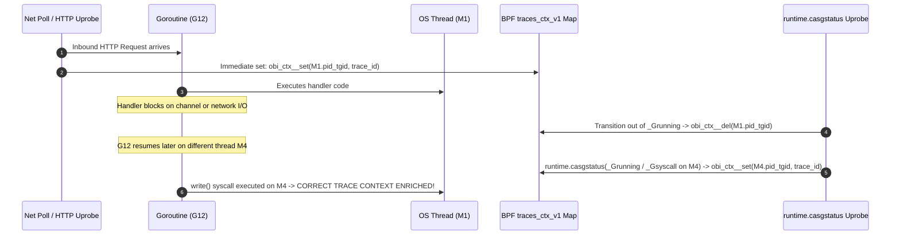

# Runtime Compatibility & Language Guidance: Solving Context Staleness in OBI

> **Reference Documentation**:
> - [Zero-Code Trace-Log Correlation with OBI (Official Blog Announcement)](reference-blog-announcement.md)
> - [Kernel Internals & Developer Spec (devdocs/trace-log-correlation.md)](https://github.com/open-telemetry/opentelemetry-ebpf-instrumentation/blob/main/devdocs/trace-log-correlation.md)

---

## Table of Contents
- [1. Executive Summary](#1-executive-summary)
- [2. The Fundamental Problem: Context Staleness Across Runtimes](#2-the-fundamental-problem-context-staleness-across-runtimes)
  - [The Junior Mental Model: The Restaurant Waiter Analogy](#the-junior-mental-model-the-restaurant-waiter-analogy)
  - [The Technical Problem: OS Threads vs Application Concurrency](#the-technical-problem-os-threads-vs-application-concurrency)
- [3. Per-Runtime Summary Table](#3-per-runtime-summary-table)
- [4. Deep Dive: Per-Runtime Kernel Refresh Mechanics](#4-deep-dive-per-runtime-kernel-refresh-mechanics)
  - [Go Runtime: `runtime.casgstatus` Uprobes](#go-runtime-runtimecasgstatus-uprobes)
  - [Node.js Runtime: `async_hooks` & `uv_fs_access`](#nodejs-runtime-async_hooks--uv_fs_access)
  - [Java Runtime: ByteBuddy & Thread Hierarchy `ioctl`](#java-runtime-bytebuddy--thread-hierarchy-ioctl)
  - [Ruby (Puma): Direct vs Reactor Path (`rb_ary_shift`)](#ruby-puma-direct-vs-reactor-path-rb_ary_shift)
  - [Python Runtime: CPython Asyncio & `PYTHONUNBUFFERED=1`](#python-runtime-cpython-asyncio--pythonunbuffered1)
  - [.NET Runtime: Synchronous Writers vs Background Channels](#net-runtime-synchronous-writers-vs-background-channels)
- [5. Coexistence with OpenTelemetry In-Process SDKs (Hybrid Mode)](#5-coexistence-with-opentelemetry-in-process-sdks-hybrid-mode)

---

## 1. Executive Summary

OBI correlates log writes with distributed traces by capturing the active `trace_id` and `span_id` associated with the executing thread. In a simplistic OS model, each incoming network request would be served from start to finish by a single dedicated operating system thread (`pid_tgid`).

However, modern high-performance runtimes (Go, Node.js, Python Asyncio, Java Netty/Tomcat) decouple I/O handling from CPU execution. Without runtime-aware kernel hooks, `traces_ctx_v1[pid_tgid]` would become stale, causing logs from one customer request to be incorrectly stamped with the trace ID of a different customer request.

This document explains the runtime specifics, requirements, and kernel probe mechanisms that solve context staleness.

---

## 2. The Fundamental Problem: Context Staleness Across Runtimes

### The Junior Mental Model: The Restaurant Waiter Analogy
Imagine a busy restaurant:
- **Waiter (OS Thread)**: The worker who runs back and forth between the kitchen and tables.
- **Order Slip (Trace Context)**: The customer's ticket (Ticket #101).
- **Notepad (Log Buffer)**: Where the worker writes down status notes ("Drink prepared").

In an old synchronous model, Waiter Bob took Ticket #101, walked to the bar, prepared the drink, wrote "Drink prepared" on Bob's notepad, and brought it to Table 101. Bob's badge ID was always tied to Ticket #101.

In a modern async model:
- Waiter Bob takes Ticket #101, hands the drink order to the bartender, and immediately walks over to Table 102 to take Ticket #102.
- When the bartender finishes the drink for Table 101, Waiter Alice happens to be walking past. Alice picks up the glass and writes "Drink prepared" on Alice's notepad.
- If OBI only checked "Who is Alice serving?", it might stamp Ticket #102 on Table 101's drink!

### The Technical Problem: OS Threads vs Application Concurrency
The kernel BPF map `traces_ctx_v1` is indexed by `u64 pid_tgid` (OS Process ID + Thread ID).
- **Go**: Multiplexes thousands of Goroutines ($G$) onto a pool of OS threads ($M$). A goroutine can yield on channel I/O or a network call, and resume on a completely different OS thread.
- **Node.js**: The single-threaded event loop processes multiple interleaved requests concurrently via `libuv`. Multiple HTTP requests arrive on the wire before any user JavaScript callback runs.
- **Java**: HTTP servers (Netty, Tomcat) use separate acceptor threads to read socket bytes, then pass tasks to worker thread pools.
- **Python**: In `asyncio`, an event loop runs many tasks on a single OS thread. When code hits `await`, the thread switches tasks.

To prevent context staleness, OBI hooks each runtime's internal scheduler to refresh `traces_ctx_v1` at the exact instant context switches occur.

---

## 3. Per-Runtime Summary Table

| Language Runtime | Default Stdout Buffering | Works Out of the Box? | Mandatory Configuration | Context Refresh Hook |
|---|---|:---:|---|---|
| **Go** | Synchronous `write()` | ✅ **Yes** | None (Zero config) | `runtime.casgstatus` uprobes |
| **Node.js** | Synchronous stdout pipe | ✅ **Yes** | Ensure no heavy pipe backpressure | `async_hooks` + `uv_fs_access` uprobe |
| **Java (Platform Threads)** | Immediate `System.out.println()` | ✅ **Yes** | Standard console appenders | ByteBuddy + `ioctl` (`k_ioctl_java_threads`) |
| **Java (Virtual Threads / Loom)** | Fiber multiplexing | ⚠️ **Not Yet** | Do not rely on OBI for Loom fibers | Currently unsupported in kernel map |
| **Ruby (Puma)** | Synchronous `syswrite()` | ✅ **Yes** | None | `rb_ary_shift` uprobes |
| **Python** | Block-buffered on pipes | ⚠️ **Requires Env** | `ENV PYTHONUNBUFFERED=1` | `_asyncio.Task.task_step` uprobes |
| **.NET (C#)** | Block-buffered (4 KB) | ⚠️ **Requires Code** | Set `AutoFlush = true` on `StreamWriter` | Synchronous console appender required |

---

## 4. Deep Dive: Per-Runtime Kernel Refresh Mechanics

### Go Runtime: `runtime.casgstatus` Uprobes

Go implements zero-code correlation with zero configuration. It achieves this using a 3-part synchronization model:



1. **Immediate Set at Uprobe Entry**: When an HTTP server handler (`ServeHTTP`, gRPC `server_handleStream`, etc.) starts, OBI immediately stores `(pid_tgid, trace_ctx)` in `traces_ctx_v1`. At this instant, the goroutine is guaranteed to run on the calling OS thread.
2. **Goroutine State Transitions**: The Go runtime calls `runtime.casgstatus` whenever a goroutine changes state. OBI attaches a uprobe here:
   - When transitioning to `_Grunning` (state 2) or `_Gsyscall` (state 3), OBI looks up the goroutine's active trace and calls `obi_ctx__set(current_pid_tgid, &tp)`.
   - Because `traces_ctx_v1` uses `BPF_ANY` hash semantics, updates are idempotent and race-free.
3. **Cleanup at Return**: When the handler completes, return uprobes delete the map entry via `obi_ctx__del(pid_tgid)`.

---

### Node.js Runtime: `async_hooks` & `uv_fs_access`

In Node.js, asynchronous callbacks execute sequentially on a single thread. Simply setting `traces_ctx_v1` on socket read would cause subsequent concurrent requests to overwrite each other before callbacks run.

OBI solves this with a lightweight user-space / kernel bridge:
1. The OBI Node.js agent registers an `async_hooks` hook:
   ```javascript
   const async_hooks = require('async_hooks');
   async_hooks.createHook({
     before(asyncId) {
       fs.accessSync(`/dev/null/obi-ctx/${incomingFd}`);
     }
   }).enable();
   ```
2. Calling `fs.accessSync` triggers a kernel syscall that hits OBI's `obi_uv_fs_access` uprobe.
3. The eBPF probe:
   - Parses the socket file descriptor from the dummy file path.
   - Looks up `fd_to_connection[pid_tgid, fd]` in kernel memory.
   - Refreshes `traces_ctx_v1[pid_tgid]` with the matching request's trace context.
4. When the JavaScript callback runs and calls `console.log()` or `pino.info()`, `traces_ctx_v1` is perfectly synchronized.

---

### Java Runtime: ByteBuddy & Thread Hierarchy `ioctl`

Java enterprise workloads (Spring Boot, Tomcat, Jetty, Netty) dispatch incoming requests from network selector threads to worker thread pools (`ThreadPoolExecutor`, `ForkJoinPool`).

1. **ByteBuddy Bytecode Instrumentation**:
   - The OBI Java helper instruments `Executor.execute()`, `Runnable.run()`, `Callable.call()`, and `ForkJoinTask`.
2. **Kernel Notification via `ioctl`**:
   - When a task begins execution on a worker thread, it issues an `ioctl` call:
     ```c
     ioctl(0, 0x0b10b1, packet); // Operation: k_ioctl_java_threads (3)
     ```
3. **Hierarchy Traversal in eBPF**:
   - The BPF kprobe intercepts `sys_ioctl`.
   - It maintains a `java_tasks[child_tid] = parent_tid` hierarchy map.
   - It traverses up to 3 levels of ancestor threads to locate the original `server_traces` context.
   - It populates `traces_ctx_v1[child_pid_tgid]` with the parent's trace context.
4. **Project Loom (Virtual Threads) Limitation**:
   > [!WARNING]
   > Virtual threads jump across JVM carrier threads dynamically. In kernel space, `bpf_get_current_pid_tgid()` only sees the carrier OS thread. If two virtual threads share a carrier thread, stamping the carrier thread in `traces_ctx_v1` would cause trace pollution. Virtual threads are therefore not currently enriched.

---

### Ruby (Puma): Direct vs Reactor Path (`rb_ary_shift`)

Puma uses two request processing models:
- **Direct Path**: A Puma worker thread reads socket data directly. `server_or_client_trace()` sets `traces_ctx_v1` immediately on the worker thread.
- **Reactor Path**: Under heavy load, a separate reactor thread reads HTTP data, then places work into Puma's `todo` queue.
- **The Fix**: OBI hooks `rb_ary_shift` (`Array#shift` in Ruby C internals), which fires whenever a worker thread pulls a request from the queue. The BPF handler maps `puma_worker_tasks[worker_tid] = reactor_tid` and synchronizes the trace context.

---

### Python Runtime: CPython Asyncio & `PYTHONUNBUFFERED=1`

Python presents two critical challenges: C standard library stdout block buffering and `asyncio` task switching.

#### 1. The Block Buffering Trap
By default, the C runtime library (`libc`) checks whether `stdout` is a terminal (TTY).
- If attached to a TTY: `stdout` is line-buffered.
- If attached to a container pipe (`/dev/stdout`): `stdout` is **block-buffered** (8 KiB buffer).
- Result without configuration: Python holds log lines in memory and only calls `write()` when 8 KiB accumulates. By that time, the HTTP request has finished and the thread is handling another request or is idle!
- **Mandatory Dockerfile Setting**:
  ```dockerfile
  ENV PYTHONUNBUFFERED=1
  ```
  This forces Python's standard streams to write directly to the kernel without libc buffering.

#### 2. Asyncio Task Switching Probes
OBI attaches uprobes to CPython internals:
- `_asyncio.Task.__init__`: Tracks new tasks and parentage.
- `_asyncio.Task.task_step` (Python 3.12+) / `task_step_legacy` (< 3.12): Fires whenever the event loop resumes an async coroutine. The probe updates `traces_ctx_v1` with the task's context.
- `task_step_ret`: Fires when a task yields (`await`). Deletes `traces_ctx_v1` so idle loop code does not carry stale IDs.
- `libpython3.context_run`: Covers worker threads launched via `asyncio.to_thread()`.

---

### .NET Runtime: Synchronous Writers vs Background Channels

In .NET Core / .NET 8+, `Console.Out` is wrapped by a `StreamWriter` configured with `AutoFlush = false`.

#### The Background Channel Problem
The default ASP.NET Core console logger (`Microsoft.Extensions.Logging.Console` via `builder.Logging.AddConsole()`) queues log messages into an internal asynchronous `System.Threading.Channels.Channel`. A single dedicated background writer thread dequeues and writes to stdout.
- Because the writer thread is **not** the thread that executed the controller action, it has no trace context in `traces_ctx_v1`.
- `AddConsole()` **will not correlate logs with OBI**.

#### Supported Solutions in .NET
Use synchronous console appenders:
1. **Direct `StreamWriter` with `AutoFlush`**:
   ```csharp
   var stdout = new StreamWriter(Console.OpenStandardOutput()) { AutoFlush = true };
   Console.SetOut(stdout);
   ```
2. **Serilog Console**:
   ```csharp
   Log.Logger = new LoggerConfiguration()
       .WriteTo.Console() // Writes synchronously on calling thread
       .CreateLogger();
   ```
3. **NLog ColoredConsole**:
   ```xml
   <target name="console" xsi:type="ColoredConsole" queueLimit="0" />
   ```

---

## 5. Coexistence with OpenTelemetry In-Process SDKs (Hybrid Mode)

In enterprise migrations, many applications already export traces via the official OpenTelemetry SDK (e.g., `opentelemetry-go`, `opentelemetry-java`), but have not configured log correlation.

```text
[HTTP Request] ---> App with OTel Tracing SDK
                        │
                        ├── Emits Span (TraceID: AAAA, SpanID: BBBB) -> OTLP Exporter
                        │
                        └── Emits Log to stdout: {"msg":"user login"} (NO trace context)
```

OBI automatically identifies when a process is already exporting OTLP traces.
- **Trace ID Injection**: OBI injects `trace_id` (`AAAA`) to link logs with the distributed trace.
- **Span ID Suppression**: OBI **does not inject `span_id`**. OBI's kernel probe would otherwise generate its own synthetic span ID (`CCCC`), which would conflict with the SDK's actual child span (`BBBB`).
- By injecting only `trace_id`, OBI maintains full trace-to-log navigability without creating contradictory span relationships in APM backends.
