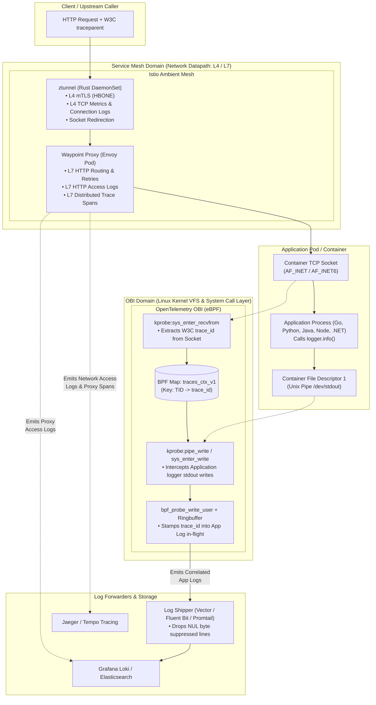
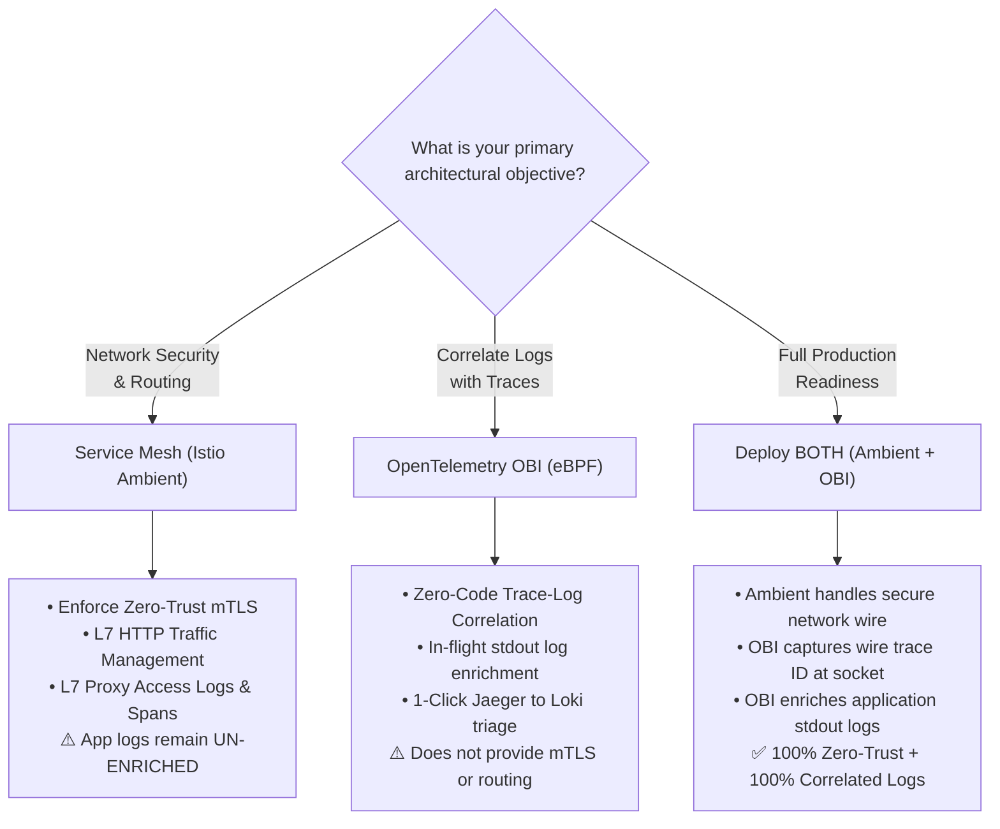

# Service Mesh Observability (Istio Ambient) vs. Kernel eBPF (OBI) Deep Dive

---

> **Documentation Hub**: [🏠 Overview](../README.md) &nbsp;|&nbsp; [📜 Announcement](reference-blog-announcement.md) &nbsp;|&nbsp; [🏛️ Architecture](architecture.md) &nbsp;|&nbsp; [📋 Day 0: Sizing](day0-planning-sizing.md) &nbsp;|&nbsp; [📦 Day 1: Deploy](day1-installation.md) &nbsp;|&nbsp; [🚨 Day 2: Ops](day2-operations-triage.md) &nbsp;|&nbsp; [💧 Log Filtering](log-filtering-guide.md) &nbsp;|&nbsp; [⚡ Runtimes](runtime-compatibility.md) &nbsp;|&nbsp; [🌐 Frontend](frontend-spa-ssr-telemetry.md) &nbsp;|&nbsp; [🕸️ Service Mesh](service-mesh-vs-ebpf-observability.md) &nbsp;|&nbsp; [📊 Tool Comparison](obi-vs-modern-observability-tools.md) &nbsp;|&nbsp; [📈 Grafana & K8s](grafana-and-k8s-observability.md) &nbsp;|&nbsp; [🔧 Troubleshooting](troubleshooting.md) &nbsp;|&nbsp; [🧹 Decommission](decommission-guide.md) &nbsp;|&nbsp; [📚 References](references.md)

---

## 📑 Table of Contents

- [🎥 Multimedia Deep Dives & Podcasts on Service Mesh vs. eBPF](#-multimedia-deep-dives--podcasts-on-service-mesh-vs-ebpf)
- [1. Executive Summary & Paradigm Overview](#1-executive-summary--paradigm-overview)
- [2. Architectural Topology: Network Datapath vs. Kernel VFS](#2-architectural-topology-network-datapath-vs-kernel-vfs)
- [3. The 2 AM Triage Dilemma: What Happens During an Outage?](#3-the-2-am-triage-dilemma-what-happens-during-an-outage)
- [4. Dimension-by-Dimension Technical Comparison Matrix](#4-dimension-by-dimension-technical-comparison-matrix)
- [5. How Istio Ambient Observability Works (L4 ztunnel + L7 Waypoint)](#5-how-istio-ambient-observability-works-l4-ztunnel--l7-waypoint)
- [6. Why Service Meshes Cannot Enrich Application Logs](#6-why-service-meshes-cannot-enrich-application-logs)
- [7. How OpenTelemetry OBI Solves the In-Process Log Gap](#7-how-opentelemetry-obi-solves-the-in-process-log-gap)
- [8. eBPF Hook Mechanics: Socket Redirection vs. Syscall Memory Mutation](#8-ebpf-hook-mechanics-socket-redirection-vs-syscall-memory-mutation)
- [9. The Ideal Enterprise Synergy: Running Ambient Mesh with OBI](#9-the-ideal-enterprise-synergy-running-ambient-mesh-with-obi)
- [10. Decision Framework & Architectural Guidance](#10-decision-framework--architectural-guidance)
- [11. Public References & Standards Catalog](#11-public-references--standards-catalog)

---

### 🎥 Multimedia Deep Dives & Podcasts on Service Mesh vs. eBPF

This architectural comparison is supported by a comprehensive educational multimedia series synthesized with **Gemini NotebookLM** based directly on this document, kernel syscall mechanics, and real-world SRE triage scenarios. All episodes and technical shorts are hosted on the [**@nubenetes**](https://youtube.com/@nubenetes) YouTube channel.

> [!NOTE]
> **Multilingual Learning Experience**:
> Episodes feature native spoken audio in **English 🇺🇸** and **Spanish 🇪🇸**, with automated closed captions (CC) translated into **20+ languages** (Spanish, French, German, Japanese, Portuguese, Italian, Arabic, Hindi, etc.) for global SRE and platform engineering teams.

#### 📊 Video Guides, Masterclass Podcasts & Technical Shorts Summary

| Format | Episode / Title | Domain / Focus | Language | Duration | Direct YouTube Link |
|:---:|---|---|:---:|:---:|---|
| 📽️ **Video Guide** | [**Service Mesh vs. Kernel eBPF: Why Meshes Fail at Log Correlation & How OBI Solves It**](https://www.youtube.com/watch?v=weRUz_7BC_A) | Visual breakdown of network proxies vs Linux VFS syscalls | 🇺🇸 English *(CC 20+)* | `8:14` | [▶️ Watch Video](https://www.youtube.com/watch?v=weRUz_7BC_A) |
| 🎙️ **Audio Podcast** | [**Podcast: Zero-Code Trace-Log Correlation: Service Mesh vs. Kernel eBPF (OBI)**](https://www.youtube.com/watch?v=qJUrpdWvHTs) | Complete 58m masterclass on socket boundaries, ztunnel/waypoint & VFS pipes | 🇺🇸 English *(CC 20+)* | `58:23` | [▶️ Listen Podcast](https://www.youtube.com/watch?v=qJUrpdWvHTs) |
| 🎙️ **Audio Podcast** | [**Podcast: Correlación Zero-Code de Logs y Trazas: Service Mesh vs. Kernel eBPF (OBI)**](https://www.youtube.com/watch?v=kP_FrCcn_jE) | Frontera del Service Mesh, kernel VFS, W3C traceparent y frontend | 🇪🇸 Spanish *(CC 20+)* | `12:50` | [▶️ Escuchar Podcast](https://www.youtube.com/watch?v=kP_FrCcn_jE) |
| ⚡ **Technical Short** | [**Why Service Meshes Fail at Log Correlation: Network Perimeter vs Kernel eBPF**](https://www.youtube.com/shorts/g-mkqDaklMQ) | 77-second breakdown of network perimeter limits vs kernel VFS interception | 🇺🇸 English *(CC 20+)* | `1:17` | [▶️ Watch Short](https://www.youtube.com/shorts/g-mkqDaklMQ) |
| ⚡ **Technical Short** | [**Por Qué Combinar Service Mesh y eBPF: Observabilidad Completa sin Puntos Ciegos**](https://www.youtube.com/shorts/3SfLjZ0hHno) | Sinergia de red y kernel en resolución instantánea de incidentes | 🇪🇸 Spanish *(CC 20+)* | `1:02` | [▶️ Ver Short](https://www.youtube.com/shorts/3SfLjZ0hHno) |

<details>
<summary>📂 <strong>Detailed Agendas & Technical Breakdowns</strong></summary>

<br/>

#### 1. Video Guide: Service Mesh vs. Kernel eBPF: Why Meshes Fail at Log Correlation & How OBI Solves It
- 🔗 **Direct Link**: [https://www.youtube.com/watch?v=weRUz_7BC_A](https://www.youtube.com/watch?v=weRUz_7BC_A)
- ⏱️ **Duration**: 8:14
- 🏷️ **Domain**: Service Mesh vs Kernel eBPF Observability & VFS Syscall Interception
- 📝 **Full Description**:
> 🔍 Service Mesh vs. Kernel eBPF: Why Service Meshes Fail at Log Correlation & How OBI Solves It
>
> A comprehensive architectural deep dive comparing Service Mesh Observability (Istio Ambient Mesh) with Kernel-level eBPF Instrumentation (OpenTelemetry OBI).
>
> Discover why network proxies cannot bridge the gap between distributed traces and local application logs, and how operating at the Linux kernel layer enables zero-code log enrichment.
>
> 📌 **Core Architectural Concepts & Highlights:**
>
> - **The SRE Midnight Nightmare**: Paged for an HTTP 500 error where the trace is known, but application logs have zero trace context.
> - **Service Mesh Perimeter Limits**: Why Envoy, ztunnel, and Waypoint proxies operate strictly on network sockets (AF_INET) and have zero access to container stdout/stderr pipes.
> - **The Linux Namespace Boundary**: Examining why network proxies cannot intercept in-process memory or file descriptor writes.
> - **Kernel Syscall Interception**: How OBI hooks write() system calls in Linux kernel space using eBPF probes.
> - **Real-Time Context Stamping**: Extracting active trace IDs from BPF maps and modifying log line buffers in-flight.
> - **The Perfect Partnership**: Running Istio Ambient Mesh for L4/L7 traffic security alongside OBI for bidirectional incident triage.
>
> 🔗 **Official Blueprint Repository & Reference Documentation:**
>
> - **GitHub Blueprint Repository**: https://github.com/nubenetes/obi-trace-log-correlation
> - **Service Mesh vs. eBPF Guide**: https://github.com/nubenetes/obi-trace-log-correlation/blob/main/docs/service-mesh-vs-ebpf-observability.md
> - **OpenTelemetry Official Announcement**: https://opentelemetry.io/blog/2026/obi-trace-log-correlation/
>
> ⏱️ **Duration**: 8:14
> #OpenTelemetry #eBPF #ServiceMesh #Istio #AmbientMesh #Observability #Kubernetes #SRE #DevOps #DistributedTracing

#### 2. Architecture Podcast: Zero-Code Trace-Log Correlation: Service Mesh vs. Kernel eBPF (OBI)
- 🔗 **Direct Link**: [https://www.youtube.com/watch?v=qJUrpdWvHTs](https://www.youtube.com/watch?v=qJUrpdWvHTs)
- ⏱️ **Duration**: 58:23
- 🏷️ **Domain**: Service Mesh vs Kernel eBPF Observability & Full-Stack Synergy
- 📝 **Full Description**:
> 🎙️ Architecture Podcast: Zero-Code Trace-Log Correlation – Service Mesh Observability vs. Kernel eBPF
>
> Full 58-minute masterclass podcast exploring the architectural boundaries, trade-offs, and synergies between sidecarless Service Meshes (Istio Ambient, Linkerd, Cilium Mesh) and Kernel eBPF Instrumentation (OpenTelemetry OBI).
>
> An exhaustive discussion for cloud architects, platform engineers, and SREs on why service meshes excel at network traffic but remain blind to application internals, and how combining both unlocks full-stack zero-trust observability.
>
> 📌 **Architectural Roadmap & Key Topics:**
>
> - **The Fundamental Dilemma**: Why deploying a modern service mesh does not eliminate the need for kernel-level trace-log correlation.
> - **Network Datapath vs. Kernel VFS**: Understanding the socket boundary (L4 TCP / L7 HTTP) versus the Linux Virtual File System and system call boundary.
> - **The 2:00 AM P1 Triage Dilemma**: Why proxy access logs alone cannot diagnose an internal NullPointerException, database timeout, or unhandled exception.
> - **Inside Istio Ambient Mesh**: How ztunnel handles L4 mTLS (HBONE) and Waypoint proxies emit L7 metrics and spans without sidecars.
> - **The Log Correlation Blind Spot**: Why network proxies cannot physically access container stdout/stderr file descriptors or inject trace context into application logs.
> - **OBI Kernel Mechanics**: Intercepting write() and writev() syscalls, BPF LRU maps, and in-flight trace_id stamping via bpf_probe_write_user.
> - **Full-Stack Enterprise Synergy**: Combining Ambient Mesh for L7 security and policy enforcement with OBI for instant, zero-code trace-log correlation.
>
> 🔗 **Official Blueprint Repository & Reference Documentation:**
>
> - **GitHub Blueprint Repository**: https://github.com/nubenetes/obi-trace-log-correlation
> - **Service Mesh vs. eBPF Architectural Deep Dive**: https://github.com/nubenetes/obi-trace-log-correlation/blob/main/docs/service-mesh-vs-ebpf-observability.md
> - **OpenTelemetry Official Announcement**: https://opentelemetry.io/blog/2026/obi-trace-log-correlation/
>
> ⏱️ **Duration**: 58:23
> #OpenTelemetry #eBPF #ServiceMesh #Istio #AmbientMesh #Observability #Kubernetes #SRE #DevOps #DistributedTracing #Podcast

#### 3. Podcast de Arquitectura: Correlación Zero-Code de Logs y Trazas: Service Mesh vs. Kernel eBPF (OBI)
- 🔗 **Direct Link**: [https://www.youtube.com/watch?v=kP_FrCcn_jE](https://www.youtube.com/watch?v=kP_FrCcn_jE)
- ⏱️ **Duration**: 12:50
- 🏷️ **Domain**: Service Mesh vs eBPF, Frontend W3C Context & Mutación de Memoria
- 📝 **Full Description**:
> 🎙️ Podcast de Arquitectura: Correlación Zero-Code de Logs y Trazas – Service Mesh vs. Kernel eBPF
>
> Episodio completo de 13 minutos en formato podcast técnico en español analizando la sinergia arquitectónica entre Service Mesh (Istio Ambient, Envoy) y la instrumentación en el Kernel de Linux mediante eBPF (OpenTelemetry OBI).
>
> Una conversación técnica profunda para ingenieros de fiabilidad (SRE), arquitectos cloud y desarrolladores sobre por qué las mallas de servicio son ciegas a los registros locales de las aplicaciones y cómo eBPF resuelve este dilema sin tocar una sola línea de código.
>
> 📌 **Puntos Clave y Hoja de Ruta de la Sesión:**
>
> - **El Incidente de las 2:00 AM**: Recibir una alerta crítica con un Trace ID específico y encontrar cero resultados al buscar en los logs distribuidos.
> - **La Frontera del Service Mesh**: Por qué los proxies de red actúan en el muelle de carga (sockets TCP/HTTP) sin visibilidad alguna sobre los pipes internos stdout y stderr del contenedor.
> - **La Solución en el Kernel**: Cómo OBI intercepta llamadas al sistema write() y writev() en Linux, inyectando el Trace ID activo en memoria antes de consolidar el registro.
> - **Del Navegador al Kernel**: Conectando el frontend (React, Angular) mediante cabeceras W3C traceparent capturadas por el servidor vía sys_recvfrom.
> - **Supresión NUL y Límites de 8 KiB**: El truco de bpf_probe_write_user para silenciar el buffer original y estrategias de reensamblaje multilínea en los colectores.
> - **La Verdad en Producción**: Reflexión final sobre el papel del sistema operativo como editor fantasma en la telemetría moderna.
>
> 🔗 **Repositorio Oficial y Documentación de Referencia:**
>
> - **Repositorio Blueprint en GitHub**: https://github.com/nubenetes/obi-trace-log-correlation
> - **Guía Arquitectónica Service Mesh vs. eBPF**: https://github.com/nubenetes/obi-trace-log-correlation/blob/main/docs/service-mesh-vs-ebpf-observability.md
> - **Anuncio Oficial de OpenTelemetry**: https://opentelemetry.io/blog/2026/obi-trace-log-correlation/
>
> ⏱️ **Duración**: 12:50
> #OpenTelemetry #eBPF #ServiceMesh #Istio #AmbientMesh #Observabilidad #Kubernetes #SRE #DevOps #DistributedTracing #Podcast

#### 4. Technical Short: Why Service Meshes Fail at Log Correlation: Network Perimeter vs Kernel eBPF
- 🔗 **Direct Link**: [https://www.youtube.com/shorts/g-mkqDaklMQ](https://www.youtube.com/shorts/g-mkqDaklMQ)
- ⏱️ **Duration**: 1:17
- 🏷️ **Domain**: Network Perimeter vs Kernel VFS Interception
- 📝 **Full Description**:
> ⚡ Why Service Meshes Fail at Log Correlation: Network Perimeter vs Kernel eBPF!
>
> Service meshes track requests across the network, but the moment your application writes a local log, they lose the trail. Here is why:
>
> - **Outside the Container**: Service meshes act as traffic cops on the network boundary. They have zero access to the internal pipes where your code prints its logs.
> - **The Kernel Solution**: To correlate logs, you must go beneath the application to the OS kernel. OBI intercepts write system calls mid-flight via eBPF.
> - **In-Flight Stamping**: OBI stamps the active trace ID directly into the log line and suppresses the original buffer with bpf_probe_write_user.
> - **The Perfect Pair**: Service meshes secure network traffic while eBPF silently links application logs to traces without code changes.
>
> 🔗 **Official Blueprint Repo & Docs:**
> https://github.com/nubenetes/obi-trace-log-correlation
> Architecture Deep Dive: https://github.com/nubenetes/obi-trace-log-correlation/blob/main/docs/service-mesh-vs-ebpf-observability.md
> Official Blog: https://opentelemetry.io/blog/2026/obi-trace-log-correlation/
>
> #Shorts #OpenTelemetry #eBPF #ServiceMesh #Istio #Kubernetes #DevOps #SRE #Observability #CloudNative

#### 5. Technical Short: Por Qué Combinar Service Mesh y eBPF: Observabilidad Completa sin Puntos Ciegos
- 🔗 **Direct Link**: [https://www.youtube.com/shorts/3SfLjZ0hHno](https://www.youtube.com/shorts/3SfLjZ0hHno)
- ⏱️ **Duration**: 1:02
- 🏷️ **Domain**: Sinergia Service Mesh y eBPF en Resolución de Incidentes
- 📝 **Full Description**:
> ⚡ Por Qué Combinar Service Mesh y eBPF: Observabilidad Completa sin Puntos Ciegos!
>
> ¿Por qué combinar una malla de servicios con eBPF si ambas monitorizan la infraestructura? Porque por separado sus puntos ciegos complican la resolución de incidentes:
>
> - **El Punto Ciego de la Red**: La malla de servicios detecta el error 500 en la red, pero es ciega a lo que ocurre en la memoria interna y stdout de la aplicación.
> - **Intercepción en el Kernel**: eBPF opera en el núcleo de Linux, intercepta los mensajes de log justo al escribirse y les estampa el trace ID de la red al instante.
> - **Triage Inmediato**: Permite saltar con un solo clic desde la alerta de red hasta la línea exacta de log que explica el error en segundos.
> - **Sinergia Total**: La malla gestiona la seguridad y el tráfico mientras eBPF sincroniza los logs sin tocar una sola línea de código.
>
> 🔗 **Repositorio Oficial y Documentación:**
> https://github.com/nubenetes/obi-trace-log-correlation
> Guía Service Mesh vs eBPF: https://github.com/nubenetes/obi-trace-log-correlation/blob/main/docs/service-mesh-vs-ebpf-observability.md
> Anuncio Oficial: https://opentelemetry.io/blog/2026/obi-trace-log-correlation/
>
> #Shorts #OpenTelemetry #eBPF #ServiceMesh #Istio #Kubernetes #DevOps #SRE #Observabilidad #CloudNative

</details>

---

## 1. Executive Summary & Paradigm Overview

Enterprise platform teams modernizing Kubernetes observability frequently ask:  
**"If we adopt a modern sidecarless Service Mesh like Istio Ambient Mesh, does it eliminate the need for OpenTelemetry eBPF (OBI) trace-log correlation?"**

The short answer is **no**. While both technologies leverage eBPF and provide zero-code telemetry, they operate at completely different layers of the operating system and solve entirely orthogonal engineering problems:

1. **Service Mesh Observability (Istio Ambient, Linkerd, Cilium Mesh)**:
   - Operates on the **Network Datapath (Layer 4 TCP / Layer 7 HTTP wire)**.
   - Observes traffic **in transit between containers and hosts**.
   - Emits **Network Access Logs** (`client_ip`, `status_code`, `path`, `response_latency`) and **Proxy Trace Spans** representing network hops.
   - **The Blind Spot**: A service mesh proxy has **zero visibility** into internal application process memory, threads, runtime event loops, or standard output file descriptors (`stdout`/`stderr`).

2. **OpenTelemetry eBPF Instrumentation (OBI)**:
   - Operates on the **Linux Kernel Virtual File System (VFS) and System Call Boundary**.
   - Observes the **in-process runtime execution and output streams** (`sys_enter_recvfrom`, `sys_enter_write`, `pipe_write`).
   - Hooks application file descriptors (`/proc/<pid>/fd/1`) to stamp matching W3C `trace_id` and `span_id` attributes directly into **internal application logs** in-flight without SDKs.
   - **The Primary Value**: Bridges the gap between distributed traces and internal application log records, eliminating the manual 2 AM incident response search.

---

## 2. Architectural Topology: Network Datapath vs. Kernel VFS

The diagram below maps the precise execution domains and interception points of Istio Ambient Mesh versus OpenTelemetry OBI:



[](images/service-mesh-vs-kernel-ebpf.png)

> [!TIP]
> **Full-Resolution Master Asset**: The architectural diagram above is available in original full-resolution (2752x1536 PNG, lossless) at [`images/service-mesh-vs-kernel-ebpf.png`](images/service-mesh-vs-kernel-ebpf.png) and high-definition JPEG at [`images/service-mesh-vs-kernel-ebpf.jpg`](images/service-mesh-vs-kernel-ebpf.jpg).

---

## 3. The 2 AM Triage Dilemma: What Happens During an Outage?

To understand why service meshes alone cannot solve application observability, consider an actual incident scenario: a customer checkout transaction fails with `500 Internal Server Error`.

### Scenario A: Istio Ambient Mesh Only (Without OBI)

1. **The Alert**: The on-call SRE receives a PagerDuty alert: elevated 5xx error rate on `/checkout`.
2. **The Trace Waterfall**: The SRE opens Jaeger or Grafana Tempo and inspects the trace emitted by the Istio Waypoint proxy:
   ```text
   Trace ID: 4bf92f3577b34da6a3ce929d0e0e4736
   Span: checkout-service.prod (Envoy Waypoint)
   Status: 500 Internal Server Error
   Duration: 42ms
   ```
3. **The Proxy Access Log**: The SRE queries Loki for Envoy access logs and finds:
   ```text
   [2026-10-07T10:00:00.123Z] "POST /checkout HTTP/1.1" 500 - 42ms "client_ip=10.244.1.15"
   ```
4. **The Critical Gap**: The proxy log only states *that* the backend returned an error. It cannot explain *why*.
5. **The Application Log Search**: The SRE opens Loki and searches for logs emitted by the application at `10:00:00`. The backend service logged the true root cause:
   ```json
   {"level":"error","message":"Inventory lock acquisition timed out for SKU 88921 on warehouse node 4"}
   ```
   **Problem**: Because the application lacked an OpenTelemetry tracing SDK, the log entry contains **no `trace_id`**. In a cluster processing 5,000 transactions/sec across 20 replicas, dozens of error logs exist at that exact millisecond. The SRE must manually cross-reference timestamps, pod names, and user IDs, artificially extending Mean Time to Resolution (MTTR).

### Scenario B: OpenTelemetry OBI Enabled (With or Without Mesh)

1. **The Write Interception**: When the application process calls `logger.error(...)`, the Linux kernel `sys_enter_write` hook triggers.
2. **In-Flight Correlation**: OBI looks up the active OS thread in `traces_ctx_v1`, zeroes the un-enriched buffer via `bpf_probe_write_user`, and re-emits the payload with native trace attributes:
   ```json
   {
     "level": "error",
     "message": "Inventory lock acquisition timed out for SKU 88921 on warehouse node 4",
     "trace_id": "4bf92f3577b34da6a3ce929d0e0e4736",
     "span_id": "00f067aa0ba902b7"
   }
   ```
3. **Instant Resolution**: The SRE copies the `trace_id` from the Jaeger waterfall directly into Loki:
   ```logql
   {app="checkout-service"} | json | trace_id = "4bf92f3577b34da6a3ce929d0e0e4736"
   ```
   The exact root cause log line displays instantly. Triage completes in seconds.

---

## 4. Dimension-by-Dimension Technical Comparison Matrix

| Architectural Feature | **OpenTelemetry eBPF (OBI)** *(This Repository)* | **Istio Ambient Mesh** *(Modern Service Mesh)* | **Classic Istio / Linkerd** *(Sidecar Model)* |
| :--- | :--- | :--- | :--- |
| **Architectural Layer** | **Kernel VFS & System Call Boundary** | **L4 Secure Overlay + L7 Namespace Waypoint** | **Pod Network Namespace (iptables)** |
| **Primary Responsibility** | Zero-code trace-log correlation & stdout enrichment | Zero-trust mTLS, L4/L7 traffic routing, security | Zero-trust mTLS, L7 traffic management |
| **Application `stdout`/`stderr` Enrichment** | ✅ **Native**: Stamps `trace_id` directly into application logs in-flight | ❌ **Impossible**: Mesh proxies never touch application file descriptors | ❌ **Impossible**: Sidecars cannot inspect stdout Unix pipes |
| **Network Wire Access Logging** | Basic socket metadata (used to extract W3C headers) | ✅ **Exhaustive**: HTTP path, status, protocol, bytes, duration, TLS cipher | ✅ **Exhaustive**: Full Envoy L7 access logging |
| **Distributed Trace Spans** | Enriches stdout logs with active spans; detects socket calls | Emits L7 client/server network proxy spans | Emits L7 client/server network proxy spans |
| **Application Context Awareness** | **High**: Tracks OS threads, Node.js event-loop, Go goroutines | ❌ **Zero**: Blind to application threads, memory, or runtime state | ❌ **Zero**: Blind to internal application state |
| **Source Code Modification** | **None** (No SDKs, no recompilation, no redeployment) | **None** for network routing; SDK required if app logs need trace IDs | **None** for network; SDK required for app log correlation |
| **Resource Overhead Model** | 1 lightweight DaemonSet per node (~50 MB RAM, < 1.5% CPU) | 1 node-shared `ztunnel` (Rust, ~25 MB RAM) + optional per-namespace Waypoints | 1 Envoy proxy container injected into **every pod** (high CPU/RAM overhead) |
| **Security Context & Privileges** | Requires `CAP_SYS_ADMIN` / `CAP_BPF`; lockdown must be `[none]` | `ztunnel` requires `CAP_NET_ADMIN` / `CAP_NET_RAW`; works under lockdown | Injected proxy runs unprivileged; init container needs `NET_ADMIN` |
| **Kernel Requirements** | **Linux 6.0+** (`ITER_UBUF`, BTF `/sys/kernel/btf/vmlinux`) | Any standard Linux kernel supporting basic socket routing | Any standard Linux kernel with iptables support |
| **Traffic Mutation & Control** | ❌ None (Passive observer and log enricher) | ✅ **Full**: mTLS, retries, canary traffic shifting, fault injection | ✅ **Full**: mTLS, retries, canary splits, circuit breakers |

---

## 5. How Istio Ambient Observability Works (L4 ztunnel + L7 Waypoint)

Istio Ambient Mesh splits service mesh responsibilities into two distinct architectural layers:

### Layer 4: The Secure Overlay (`ztunnel`)
- **Node-Shared Architecture**: A single Rust daemon (`ztunnel`) runs on each Kubernetes worker node as a DaemonSet.
- **Traffic Redirection**: `istio-cni` configures eBPF programs or iptables rules to transparently redirect all TCP connections originating from or destined to pods into `ztunnel`.
- **HBONE Protocol**: `ztunnel` encapsulates plain TCP traffic into HTTP/2 CONNECT tunnels (HBONE) encrypted with mTLS and SPIFFE identities.
- **L4 Telemetry**: Emits Layer 4 connection metrics (TCP bytes sent/received, connection duration) and basic L4 TCP access logs.

### Layer 5–7: The Application Overlay (`waypoint`)
- **Standalone Envoy Proxies**: When a service requires Layer 7 capabilities (HTTP header routing, retries, URL rewriting, or L7 authorization policies), an Envoy-based `waypoint` proxy is deployed per namespace or per service account.
- **L7 Telemetry**: Waypoints parse HTTP headers, emit Prometheus metrics (request count, 4xx/5xx rates, P99 request latencies), and generate distributed trace spans for every HTTP hop.

---

## 6. Why Service Meshes Cannot Enrich Application Logs

To understand why even the most advanced service mesh cannot inject trace IDs into application logs, examine the **Linux Namespace and File Descriptor Boundary**:

```text
┌────────────────────────────────────────────────────────────────────────┐
│                        Application Pod Container                       │
│                                                                        │
│   Application Process (e.g. Node.js / Go / Python)                     │
│         │                                                              │
│         ├── writes HTTP response ──► Socket (fd: 3) ──► Network Wire   │
│         │                                                    │         │
│         │                                           [Intercepted by   │
│         │                                           Service Mesh]      │
│         │                                                              │
│         └── writes log entry ──────► Stdout (fd: 1) ──► Unix Pipe      │
│                                                              │         │
│                                                     [COMPLETELY BLIND  │
│                                                      TO SERVICE MESH]  │
└──────────────────────────────────────────────────────────────┼─────────┘
                                                               ▼
                                                    Linux Kernel VFS Pipe
                                                               ▼
                                                 containerd / CRI Logging Engine
                                                               ▼
                                                    /var/log/pods/*.log
```

1. **Network vs. VFS Segregation**:
   - The service mesh proxy (whether a classic sidecar or Ambient ztunnel/waypoint) operates exclusively on network sockets (`AF_INET`/`AF_INET6`).
   - Application logging frameworks (Log4j, Zap, Pino, `log/slog`) do not transmit logs across application network sockets. They issue `write()` or `writev()` system calls on standard output (file descriptor 1) or standard error (file descriptor 2).
2. **The Pipe Isolation**:
   - File descriptor 1 connects to a kernel unidirectional Unix pipe managed by the container runtime (`containerd` or `CRI-O`).
   - The container runtime reads from the other end of the pipe and writes raw bytes to `/var/log/pods/<namespace>_<pod>_<uid>/<container>/0.log`.
3. **The Consequence**:
   - The service mesh proxy never has access to the container's file descriptor table, standard output pipe, or CRI log files.
   - Therefore, **no configuration of Istio, Linkerd, or Envoy can ever stamp a `trace_id` onto an application log line**.

---

## 7. How OpenTelemetry OBI Solves the In-Process Log Gap

OpenTelemetry eBPF Instrumentation (OBI) resolves this blind spot by operating within the Linux kernel where file descriptors, system calls, and active threads converge:

1. **Dual Interception (Socket + VFS Pipe)**:
   - OBI attaches kprobes to **both** incoming network socket reads (`sys_enter_recvfrom`) and outgoing file descriptor writes (`sys_enter_write`, `pipe_write`).
2. **Thread-to-Context Mapping**:
   - When a network packet arrives carrying a W3C `traceparent` header, OBI extracts the `trace_id` and records it in the pinned kernel hash map `traces_ctx_v1`, keyed by the operating system thread ID (`tgid_pid`).
3. **In-Flight Buffer Substitution**:
   - When that same thread later calls `write(1, buffer, len)` to emit a log message to stdout, OBI's probe intercepts the call before the kernel transfers data to the pipe buffer.
   - It queries `traces_ctx_v1` using the thread ID, zeroes the original un-enriched buffer via `bpf_probe_write_user` (suppressing duplicate lines), and submits the log payload paired with the trace context to the `log_events` ring buffer.
   - The user-space OBI daemon re-emits the payload with `trace_id` and `span_id` stamped directly onto the container's stdout file descriptor.

---

## 8. eBPF Hook Mechanics: Socket Redirection vs. Syscall Memory Mutation

Both Istio Ambient (via `istio-cni`) and OBI leverage eBPF, but their programs attach to completely distinct subsystems within the Linux kernel:

```text
┌────────────────────────────────────────────────────────────────────────┐
│                              Linux Kernel                              │
├───────────────────────────────────┬────────────────────────────────────┤
│   Networking Subsystem (eBPF)     │   Tracing & VFS Subsystem (eBPF)   │
│   [Used by Istio Ambient]         │   [Used by OpenTelemetry OBI]      │
├───────────────────────────────────┼────────────────────────────────────┤
│ • Program Type: BPF_PROG_TYPE_SOCK_OPS • Program Type: BPF_PROG_TYPE_KPROBE │
│ • Program Type: BPF_PROG_TYPE_SK_MSG   • Hook: sys_enter_write (pipe_write)│
│ • Hook: tc (Traffic Control ingress)   • Hook: sys_enter_recvfrom          │
│ • Helper: bpf_msg_redirect_hash        • Helper: bpf_probe_write_user      │
│ • Purpose: Route TCP packets to ztunnel • Purpose: In-flight buffer mutation│
│ • Privileges: CAP_NET_ADMIN            • Privileges: CAP_SYS_ADMIN / BPF   │
│ • Lockdown Compatible: YES             • Lockdown Compatible: NO ([none])  │
└───────────────────────────────────┴────────────────────────────────────┘
```

### Can Istio Ambient and OBI Run on the Same Host?
**Yes, with zero conflict.** Because:
- **Disjoint Hook Points**: Istio Ambient hooks networking data structures (`sock_ops`, `tc`, `sk_buff`). OBI hooks system call entry points (`kprobe:sys_enter_write`, `kprobe:sys_enter_recvfrom`).
- **Isolated BPF Maps**: Istio pins its maps under `/sys/fs/bpf/istio/` or `/sys/fs/bpf/cilium/`. OBI isolates its maps exclusively under `/sys/fs/bpf/otel/`.
- **Zero Kernel Lock Contention**: The two systems execute in separate kernel execution phases without shared map locks.

---

## 9. The Ideal Enterprise Synergy: Running Ambient Mesh with OBI

Rather than choosing between a service mesh and eBPF log correlation, leading enterprise architectures deploy **both** to achieve complete full-stack zero-trust security and end-to-end observability:

```text
┌────────────────────────────────────────────────────────────────────────┐
│                        1. CLIENT / BROWSER TIER                        │
│   Angular 17+ / React SPA injects W3C traceparent via HTTP Interceptor │
└───────────────────────────────────┬────────────────────────────────────┘
                                    │ HTTP Request + traceparent
                                    ▼
┌────────────────────────────────────────────────────────────────────────┐
│                   2. SERVICE MESH TIER (Istio Ambient)                 │
│   • ztunnel enforces L4 mutual TLS (HBONE) between nodes               │
│   • Waypoint proxy applies L7 authorization & emits Proxy Spans        │
│   • Transparently forwards W3C traceparent header on the wire          │
└───────────────────────────────────┬────────────────────────────────────┘
                                    │ TLS Wire Hop into Target Pod
                                    ▼
┌────────────────────────────────────────────────────────────────────────┐
│                     3. KERNEL & RUNTIME TIER (OBI)                     │
│   • sys_enter_recvfrom intercepts socket ingress & extracts trace_id   │
│   • Uninstrumented application processes logic & calls logger.info()   │
│   • sys_enter_write enriches stdout log with trace_id & span_id        │
└───────────────────────────────────┬────────────────────────────────────┘
                                    │ Correlated Stdout Log Record
                                    ▼
┌────────────────────────────────────────────────────────────────────────┐
│                     4. TELEMETRY STORAGE & TRIAGE                      │
│   • Jaeger / Tempo: Contains network hop spans from Istio Waypoint     │
│   • Grafana Loki: Contains application logs enriched with trace_id     │
│   • Result: 1-Click Navigation from Trace Span to Root Cause Log Line  │
└────────────────────────────────────────────────────────────────────────┘
```

---

## 10. Decision Framework & Architectural Guidance

Use the following decision matrix to determine the optimal observability architecture for your platform:



### When to Choose Istio Ambient Mesh:
- You need automated **mutual TLS (mTLS)** and cryptographic pod identity (SPIFFE) without sidecar CPU/RAM bloat.
- You require sophisticated **L7 traffic routing**, canary weight splitting, retries, and fault injection.
- You need uniform **network access logs** across every service communicating over the cluster network.

### When to Choose OpenTelemetry OBI:
- Your on-call engineers suffer from the **2 AM incident triage problem**—searching logs by timestamp because application logs lack `trace_id`.
- You manage a polyglot fleet (Go, Python, Java, Node.js, .NET) and **cannot afford months of engineering backlog** to install OpenTelemetry SDKs into hundreds of codebases.
- You operate legacy monoliths, third-party COTS containers, or closed-source vendor binaries that cannot be recompiled.

### When to Deploy Both:
- Enterprise clusters running mission-critical workloads where **both network encryption and rapid incident root-cause analysis** are mandatory.

---

## 11. Public References & Standards Catalog

### 1. Istio Ambient & Service Mesh Architecture
* **[Istio Ambient Mesh Documentation](https://istio.io/latest/docs/ambient/)**: Official architecture guide detailing ztunnel, waypoint proxies, and HBONE encapsulation.
* **[Istio Ambient Observability Guide](https://istio.io/latest/docs/ambient/usage/metrics/)**: Details Prometheus metrics and access logging emitted by ztunnel and waypoint proxies.
* **[ztunnel GitHub Repository](https://github.com/istio/ztunnel)**: Upstream Rust implementation of the L4 zero-trust node proxy.

### 2. OpenTelemetry & eBPF Kernel Instrumentation
* **[Zero-Code Trace-Log Correlation with OBI (Official Announcement)](https://opentelemetry.io/blog/2026/obi-trace-log-correlation/)**: Upstream milestone announcement covering kernel `write()` syscall interception.
* **[OpenTelemetry eBPF Instrumentation Repository](https://github.com/open-telemetry/opentelemetry-ebpf-instrumentation)**: Core OBI codebase containing eBPF C programs, LRU hash maps, and userspace daemons.
* **[W3C Trace Context Specification](https://www.w3.org/TR/trace-context/)**: Defines standard `traceparent` and `tracestate` headers bridging service meshes, client applications, and kernel probes.

### 3. Local Architecture Guides in this Repository
* **[`docs/architecture.md`](architecture.md)**: Kernel hooks, `traces_ctx_v1` LRU map, and user-space ringbuffer architecture.
* **[`docs/day0-planning-sizing.md`](day0-planning-sizing.md)**: Hardware sizing, Linux 6.0+ requirements, and kernel lockdown settings.
* **[`docs/frontend-spa-ssr-telemetry.md`](frontend-spa-ssr-telemetry.md)**: Client browser boundaries, W3C HTTP interceptors, and SSR kernel interception.

---

## 🧭 Navigation & Documentation Directory

| ⬅️ Previous Document | 🏠 Documentation Hub | ➡️ Next Document |
| :--- | :---: | ---: |
| [**Frontend SPAs & SSR Telemetry**](frontend-spa-ssr-telemetry.md) | [**Repository Overview**](../README.md) | [**OBI vs. Modern Observability Tools**](obi-vs-modern-observability-tools.md) |

### 📚 Complete Guide Catalog
- 📜 **[Official Reference Announcement](reference-blog-announcement.md)** — Verbatim OpenTelemetry announcement with junior primers and kernel deep dives
- 🏛️ **[Architecture Deep Dive](architecture.md)** — Low-level syscall hooks (`pipe_write`, `ksys_write`, `do_writev`), LRU maps, and ringbuffer flow
- 📋 **[Day 0: Planning & Sizing](day0-planning-sizing.md)** — Linux 6.0+ matrix, kernel lockdown, memory sizing formulas, and security postures
- 📦 **[Day 1: Multi-Cluster Deployment](day1-installation.md)** — Enterprise overlays for OpenShift 4.20+, AKS, EKS, GKE, RKE2, and Docker Compose
- 🚨 **[Day 2: Operations & Incident Triage](day2-operations-triage.md)** — SRE incident response playbook, LogQL/Jaeger queries, and canary rollouts
- 💧 **[Log Shipper Filtering Guide](log-filtering-guide.md)** — Suppressed NUL byte placeholder drop filters and 8 KiB write split handling
- ⚡ **[Runtime Compatibility Guide](runtime-compatibility.md)** — Go runtime hooks, `PYTHONUNBUFFERED=1`, Node.js async streams, and Java Loom
- 🌐 **[Frontend SPAs & SSR Telemetry Guide](frontend-spa-ssr-telemetry.md)** — W3C `traceparent` HTTP bridge, Angular/React/Vue patterns, and SSR kernel interception
- 🕸️ **[Service Mesh vs. eBPF Observability Guide](service-mesh-vs-ebpf-observability.md)** — Architectural comparison between Istio Ambient (ztunnel/waypoint) network proxying and OBI kernel-level trace-log enrichment
- 📊 **[OBI vs. Modern Observability Tools](obi-vs-modern-observability-tools.md)** — Architectural analysis & strategic conclusions comparing OBI against Datadog, Grafana, Dynatrace & New Relic
- 📈 **[Grafana & Kubernetes Observability Guide](grafana-and-k8s-observability.md)** — Grafana dashboard integration (OSS, Cloud, Enterprise) and zero-Grafana full observability on OpenShift, AKS, EKS, GKE & RKE2
- 🔧 **[Troubleshooting & Diagnostics](troubleshooting.md)** — Common pitfalls, eBPF probe errors, missing trace IDs, and verification steps
- 🧹 **[Decommission & Teardown Guide](decommission-guide.md)** — Safe probe detachment, BPF map unpinning, and resource cleanup
- 📚 **[References & Official Documentation](references.md)** — Upstream OpenTelemetry specifications, GitHub repositories, and CNCF channels
